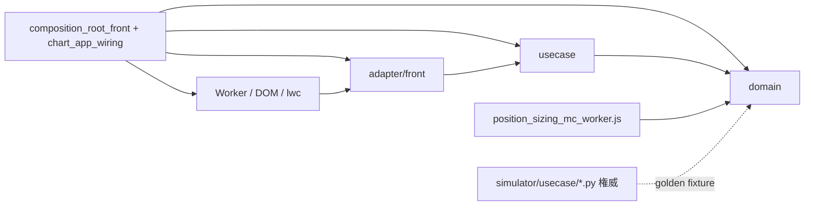

# ポジションサイズ計算機のチャート UI 統合 設計書（ISSUE-368）

作成: 2026-08-19（設計エージェント成果の恒久記録・2026-08-20 転記）。
実装ブランチ: `feature/issue-368-position-sizing-ui`（develop 51e8d21 起点）。

## 裁定記録（2026-08-20・依頼者承認済み）

- **TBD-1/5**: 建値も価格の単一ソース＝チャートに**一本化する**（gap モード・間隔指定を撤廃。
  direct 指定のみ＝順張り／逆張り 2 カード比較は参照実装 :1098 の明示により同一結果＝表示しない）。
- **TBD-2**: 単体 HTML `integrated_position_sizing_calculator.html` は**保持**（既定。参照実装のまま）。
- **TBD-3**: 図 3（資産推移パス・別乱数系列）は**含めない**。
- **TBD-4**: 3 トグル（ロット単位 整数/小数・決済 ブラケット/時間・建て制約 証拠金100%/ロスカット基準）は
  **3 つとも残す**。
- **TBD-6**: `export_account_engine_fixtures.py` docstring の対象モジュール名を実装時に併記更新（軽微）。
- **TBD-7**: Step 1 RoR の JS↔Python 一致はスライス 2 実測後に判定（不一致なら**無検証で緩めず停止**して裁定）。

---

# ISSUE-368 実装設計（読み取り専用・確定案）

## 評価対象のモジュール・ファイル一覧

**参照実装（正解の定義）**
- `/workspaces/app/integrated_position_sizing_calculator.html`（1138 行）
- `/workspaces/app/integrated_position_sizing_calculator.html.bak-260811`（**参照実装として使用禁止**。ISSUE-370 修正前＝ `mFactor` 2 件残存。現行 HTML の `mFactor` は 1 件でコメントのみ）

**Python 権威**
- `/workspaces/app/simulator/usecase/edge_ruin.py`
- `/workspaces/app/simulator/usecase/account_engine.py`
- `/workspaces/app/simulator/usecase/sizing_ports.py` / `sizing_models.py`
- `/workspaces/app/simulator/adapter/sizing/account_margin_sizing.py`
- `/workspaces/app/simulator/tools/export_account_engine_fixtures.py`
- `/workspaces/app/simulator/tests/fixtures/account_engine/js_golden_cases.json`
- `/workspaces/app/simulator/tests/unit/test_account_engine_js_fixture_sync.py` / `test_edge_ruin.py`

**JS 受け皿**
- `/workspaces/app/indigators/indicator_ui/web/js/domain/`（8 ファイル）／`usecase/`／`adapter/front/`
- `adapter/front/chart_app_wiring.js` / `composition_root_front.js` / `app_chrome_view.js` / `chart_renderer.js` / `chart_interaction_controller.js` / `scale_controller.js` / `pair_lines_primitive.js` / `color_theme_menu.js` / `color_theme_dialogs.js`
- `/workspaces/app/simulator/replay_ui/web/js/adapter/front/composition_root_front.js`
- `/workspaces/app/unified_ui/web/js/unified_root.js`

**規約・検定**
- `/workspaces/app/.doc/LAYERING_CONVENTIONS.md`
- `/workspaces/app/.doc/sim-backtest-ui-integration/基本設計書.md` §12.3〜§12.6
- `/workspaces/app/tools/web_suites.txt`
- `web/tests/served_import_resolution.test.js` / `symlink_health.test.js` / `upstream_isolation_declaration.test.js` / `composition_roots_share_wiring.test.js` / `color_theme_toolbar_mount.test.js`

---

# 出力 2. 調査 1〜4 の実測結果（先に提示する。設計はこれに従属する）

## 調査 1: 計算コアの単一ソース戦略（最重要）

### 1-A. ISSUE-369 Phase 2（f57102d）の実体

| 成果物 | パス | 実測内容 |
|---|---|---|
| 生成器 | `simulator/tools/export_account_engine_fixtures.py:1-15` | docstring に「チャート UI 統合（ISSUE-368）で **JS（domain/position_sizing_plan.js 予定）**が実装する証拠金・ロスカット計算の数値検定に使う正解データを、権威（account_engine.py の閉形式）から生成する。JS 側は本 JSON と一致することを `node --test` で検定する」と明記 |
| 格子 | 同 `:34-43` | `ENTRY_SETS` 5 × `BALANCES` 3 × `MARGIN_RATES` 2 × `DIRECTIONS` 2 = **60** |
| fixture | `simulator/tests/fixtures/account_engine/js_golden_cases.json` | `"id"` 出現数 **60**（実測）。`expected` は `total_units` / `avg_price` / `required_margin` / `margin_use` / `losscut_price` / `losscut_distance` の **6 出力のみ** |
| 同期検定 | `simulator/tests/unit/test_account_engine_js_fixture_sync.py:22-35` | コミット済み fixture を `official_required_margin` / `official_losscut_price` で**再計算して照合**。式を変えて再生成し忘れると Red |

### 1-B. **JS 実装は 1 行も存在しない（実測）**

`position_sizing_plan|js_golden_cases` を worktree 除外で grep → ヒットは上記 **Python 2 ファイルのみ**。`**/*golden*` の Glob にも JS 側の account/edge 用 fixture・テストは存在しない。

**結論**: Phase 2 が作ったのは「Python 側の半分（権威＋fixture＋鮮度検定）」だけであり、**JS 消費側（実装＋一致検定）は未着手**。「golden があるから単一ソースは解決済み」という読みは実測で棄却される。

### 1-C. 規約（プロジェクト規約・単一ソースの正解形）

`.doc/LAYERING_CONVENTIONS.md:28-30`:
> Python/JS で同一規則を二重実装する場合、権威は Python とし、JS は golden fixture で一致を検定する（規則変更 PR は fixture 再生成を必須とする＝`test_js_parity_golden_fresh.py` が強制）。

既存の完成形（market_profile）は **3 点セット**である。
1. 生成器 `tools/gen_js_parity_golden.py`
2. Python 側鮮度検定 `indigators/market_profile/api/tests/test_js_parity_golden_fresh.py:24-54`
3. **JS 側一致検定** `indigators/market_profile/web/tests/py_parity_golden.test.js`

account_engine は 1・2 のみで **3 が欠落**している。

### 1-D. 計算ファミリごとの権威所在（実測）

| ファミリ | 対象 | Python 権威 | golden fixture | JS 実装 | 判定 |
|---|---|---|---|---|---|
| **A. エッジ・破産確率**（Step 1） | Kelly f*・g(f)・RoR(f)・制約 f・(q/p)^N | **有**: `edge_ruin.py`（`:11-23` に HTML `:582`〜`:686` の行対応表、`:47-70` に Mulberry32 移植＝**bit 単位照合可**） | **無** | 無 | 生成器＋鮮度検定＋JS 実装＋一致検定を**新規に作る** |
| **B. 証拠金・ロスカット**（Step 3 の一部） | 必要証拠金・ロスカット価格・維持率 | **有**: `account_engine.py:310-335` `official_*` | **有（60）** | 無 | **JS 実装＋一致検定のみ**追加（最短） |
| **C. 分割ロット変換**（Step 3 の本体） | 重み・距離・L₁/Lᵢ・合計・リスク配分・RR・分岐点・EV・建て制約 | **無** | 無 | 無 | **Python 権威を先に作る**（`edge_ruin.py` と同型の本実装化） |

ファミリ C に権威が無い根拠: 基本設計書 `:1117-1119`「移植範囲は **Step 1 のみ**。Step 2/3（f 選択・分割ロット変換）は移植対象外」。Python 側 `account_margin_sizing.py:94-95` は **単一建玉（K=1）** の `raw = f·E/(D·V)` しか持たない。分割の `L₁ = f·E/(V·Σwᵢdᵢ)` は HTML `:976-978` にしか存在しない。

### 1-E. 複製禁止の既存規律（設計が従うべき形）

- `sizing_ports.py:42-52`: 「実装は必要証拠金・ロスカット価格の式を**再実装してはならない**（`account_engine` の権威式のみを呼ぶ・§12.3-3 C-7）」
- `account_margin_sizing.py:15-19`: 閉形式を解いて上限 U を書き下すと**式の写しになる**ため、**単調性を使った二分探索で権威関数に判定させる**（＝式の権威を 1 箇所に留める実装技法の先例）

### 1-F. Python↔JS 一致の実測済み限界（設計の許容差を決める事実）

`test_edge_ruin.py:20-31`（実測記録）:
- 閉形式部（EV・f*・(q/p)^N）: **厳密一致（許容 0）**
- MC 部（RoR・制約 f）: 参照実装と**厳密一致**（ただし実測は 5 ケース）
- **g(f) のみ**: `math.log` と V8 `Math.log` に **1 ULP 差**が実測されている（`0.05411532090976834` vs `...8366`）→ 相対許容 **1e-15**
- 実行時間: 参照実装既定の `SIMS=4000` は Python で **1 ケース約 25 秒**（60 格子 × 4000 × T）

### 調査 1 の確定判定

**新規 JS 実装＋Python golden 固定（3 点セットの完成）を採る。** ただし着手順は B → A → C ではなく **C の Python 権威作成が先**（下記スライス 0）。理由: C だけ権威が無く、先に JS を書くと「golden 非同期の第 2 実装」がそこに生まれる（禁止条件そのもの）。

---

## 調査 2: 参照実装の全機能列挙と仕分け

### Step 1「エッジと破産確率」（HTML `:274-334` / `:576-724`）

| 項目 | 行 | 式・挙動 | 統合 |
|---|---|---|---|
| 入力 p, R, 破産水準, α, T, N | `:277-290` | 既定 38%, 2.74, 50%, 1%, 250, 20 | **統合**（p・R は手入力のまま） |
| 派生カード q / EV / f* / ハーフ | `:585-593` | `q=1−p`, `EV=Rp−q`, `f*=(Rp−q)/R`, `f*/2` | **統合**（同期・MC 不要） |
| `simRoR` | `:599-605` | 対数資産 `le += log(1+Rf) or log(1−f)`、`le≤log(ruin)` で破産 | **統合（Worker）** |
| `runMC` 走査 | `:628-640` | `fmax=min(0.9,max(0.35,(fk>0?fk:0.1)*2.4))`、`grid=fmax·i/60 (i=1..60)`、制約 f は走査＋**最初の跨ぎ区間で線形補間**、フルケリー点は `SIMS*2` | **統合（Worker）** |
| 図 1/図 2 | `:662-676` | canvas 描画 | 統合（モーダル内 canvas） |
| 図 3 資産推移 | `:687-722` | `mulberry32(WSEED)`・M=14 パス・中央値・5〜95% トリム | **要裁定**（別乱数系列・追加負荷） |

### Step 2「採用する f を選ぶ」（`:337-346` / `:786-794`）
`safe`（既定）/`half`/`full` の 3 択 → `chosenF()` `:580`。**統合**。

### Step 3「分割エントリー」（`:349-555` / `:796-1031`）

| 入力 | 行 | 統合可否 |
|---|---|---|
| E, V, P₀, mr | `:355-362` | **統合**（モーダル） |
| ロット単位 int/dec | `:366-369` | **要裁定**（認知負荷） |
| 方向 long/short | `:379-382` | **統合**（チャート側で判定可） |
| 決済 bracket/time | `:387-390` | **要裁定** |
| 損切り指定 dist/price | `:403-406` | **撤廃確定**（価格に一本化・要件） |
| 損切り価格 | `:415` | **統合**（チャート水準線が単一ソース） |
| D 算出 manual/ATR×k | `:421-424` | **対象外**（ATR） |
| ATR パネル・MAE/ATR k 電卓 | `:427-450`, `:852-873` | **対象外** |
| 利確 dist/price | `:456-459`, `:463-466` | **撤廃確定**（価格に一本化） |
| 建値指定 gap/direct | `:476-479` | **要裁定**（下記 4-E） |
| K, g, 間隔 uniform/custom | `:484-497` | K は統合／間隔は要裁定 |
| 重み equal/linear/double/custom | `:499-508` | **統合** |
| 建て制約 margin/lc | `:515-518` | **要裁定** |

`build()` `:956-1031` の計算（DOM 直読み `num()` を除いた純関数部）:
```
price[i]   :962-964   direct なら customP、else P0 ± sign·off[i]（mode up/down で符号反転）
nearest    :965       long は min(price)、short は max(price)
D, stop    :966-972   smode=price: stop 入力、D = nearest − stop（long）
d[i]       :974       long: price[i] − stop
w          :975       genWeights（equal=1 / linear=i+1 / double=2^i / custom）
Swd, L1    :976-977   L1 = f·E / (V·Σ wᵢdᵢ)
L          :978-979   Lraw=L1·wᵢ、int モードは Math.floor（切り捨て＝保守側）
totals     :980-984   totalLot, sumLd, sumLP, avgP = sumLP/totalLot
risk[i]    :982       Lᵢdᵢ / Σ Lᵢdᵢ
totalRisk  :983       V · Σ Lᵢdᵢ
rr/EV      :988-995   profit=Σ Lᵢ|target−priceᵢ|、rr=profit/(totalRisk/V)、breakeven=1/(1+rr)、evYen=p·profitYen−(1−p)·totalRisk
reqMargin  :998-1001  notional=sumLP·V、reqMargin=notional·mr、marginUse=reqMargin/E
lcDist     :1009      (E − reqMargin) / U        ← 公式仕様（ISSUE-370 是正後）
lcPrice    :1011      long: avgP − lcDist
capLot     :1015-1024 margin: totalLot/marginUse ／ lc: U_lc = E/(avgP(1+mr) − stop)
build lot  :1025-1028 scale=min(1, capLot/totalLot)、int は floor
```
`drawPriceLine` `:752-783` は **建値 / 損切り / ロスカットの数直線**（＝チャート水準線の参照実装そのもの）。

**対象外の確定**: ATR 系（`:427-450`, `:852-873`, `effectiveD` の atr 分岐 `:950`）、`drawDunits` `:727-748`（D↔単位数の説明図）。

---

## 調査 3: indicator_ui 側の受け皿

### 3-A. 3 配信ページの実体（実測）

| ページ | 起点 | chart_app_wiring 経由 |
|---|---|---|
| ライブ standalone | `indigators/indicator_ui/web/index.html:35` | 有 |
| リプレイ standalone | `simulator/replay_ui/web/index.html:44` | 有 |
| 統合 UI | `unified_ui/web/js/unified_root.js:38`（`LIVE_ROOT='/live/js/adapter/front/composition_root_front.js'`）＋ `:232` の動的 import | 有（ライブ root を 1 回だけ起動） |
| **sim（報告ビュー）** | `simulator/sim_ui/web/js/adapter/front/composition_root_front.js` | **無**（`chart_app_wiring|installSharedUi` grep 0 件・独自 `lwc5_chart_renderer.js`） |

→ 上流の「3 配信ページ」は現時点でも成立する。ただし根拠は「ページ総数が 3」ではなく「**chart_app_wiring を通るページが 3**」である（配信 index.html は 4 枚存在する）。

### 3-B. 層構成と依存方向（実測・違反 0 件）

```
web/js/domain   → 自パッケージ内のみ（実測: domain 配下の相対 import は domain_models→color_roles,
                  tickvol_bands→tf_meta/session_day の 3 本のみ）
web/js/usecase  → domain と usecase のみ（実測 25 本すべて該当）
web/js/adapter/front → usecase / domain / 同層
composition_root_front.js（＋ chart_app_wiring.js）＝ Composition Root
```

### 3-C. 拡張点（実測）

- ツールバー空マウント: `app_chrome_view.js:88-130`。`:121` に `'<div class="color-theme-menu" id="color-theme-menu"></div>'`（**index.html には 1 枚も書かない**規約）
- モーダル: `app_chrome_view.js:135-179` `installIndicatorDialog`
- 共有配線: `chart_app_wiring.js:160-251` `installSharedUi`（`:169` で `installChartToolbar`）／`:278-` `wireControllerCollaborators`
- 協働子の DIP 規約: メニューは協働子を import せず **コールバック注入**＋遅延参照（`:236-241`, `:259-274`）

### 3-D. テスト流儀（実測）

- 台帳 `tools/web_suites.txt:17-21`（5 スイート・`npm test` 起動を `tools/tests/test_web_suites_ledger.py` が強制）
- 構造ガード群
  - `served_import_resolution.test.js:37` `IMPORT_RE = /(?:from|import)\s*\(?\s*['"](\.[^'"]+)['"]/g` → **`new Worker(new URL(...))` は検出対象外（実測）**
  - `symlink_health.test.js:33-58`（`web/js` 配下 symlink の解決性）
  - `upstream_isolation_declaration.test.js:28-63`（lwc API 名 × 許可ファイル。`coordinateToPrice` は列挙外＝現に `chart_renderer.js:613` で呼ばれて緑）
  - `composition_roots_share_wiring.test.js:25-42`（`SHARED_OWNED` に共有部品を列挙し、root での再 `new` を禁止）
  - `color_theme_toolbar_mount.test.js:97-107`（**4 枚の index.html に器が 0 件**であることまで固定）

---

## 調査 4: 双方向連動の設計に関わる実測

### 4-A. チャートに無いもの（ISSUE-368 記載の再確認・成立）
- ドラッグ可能な価格線: 無。`chart_renderer.js:596-598` の `_createPriceLines` は指標スロット紐付け（`SeriesDrawer` 委譲）
- y→価格の公開変換: 無。`coordinateToPrice` は `chart_renderer.js:612-613`（`_onCrosshairMove` 内部）と `scale_controller.js:142-143` のみ

### 4-B. primitive 雛形（成立）
`chart_renderer.js:266-284` `attachBackgroundPrimitive(key, factory)`（メイン系列へ 1 度だけ装着・`:282` で色を 1 回配る）。雛形 `pair_lines_primitive.js:54-88`（`priceToCoordinate` `:63`・`useBitmapCoordinateSpace` `:65`・範囲外 null はスキップ `:73`・`setChromeColors` `:38-51`）。

### 4-C. **上流「確定事実」の訂正（新規発見・実測）**

ISSUE-368 は「`renderer.setUserInteraction`（`chart_renderer.js:297`）は本番呼び出し元 0 件で drag 中の lwc 抑止に使える」と記録している。これは**必要だが不十分**である。

```
chart_renderer.js:298-304  setUserInteraction(enabled)
    → this._chart.applyOptions({ handleScroll: on, handleScale: on })  ← lwc のオプションのみ
```

一方、アプリ自身の縦価格パンは lwc を経由しない。

```
chart_interaction_controller.js:84-93   container 'pointerdown' で左ボタンなら常に vpanActive = true
chart_interaction_controller.js:94-109  'pointermove' で renderer.panPriceByPixels(dy)
chart_renderer.js:345-348               → this._scale.panPriceByPixels(dy)
scale_controller.js:160-172             → priceScale.getVisibleRange() / setVisibleRange()
```

`setVisibleRange` 直叩きであり `handleScroll` を参照しない。**したがって水準線を掴んだ瞬間にチャートが縦にパンし、線とチャートが同時に動いて掴めない。**

唯一の既存ゲートは `isVerticalPanBlocked`（`chart_interaction_controller.js:28-29, :85`、`chart_app_wiring.js:162` で受け取り `:174` で渡す）だが、**単数スロット**であり、**リプレイ root が既に使用中**（`composition_roots_share_wiring.test.js:98` が `assert.match(src, /isVerticalPanBlocked/)` で固定）。

→ **根治**: `isVerticalPanBlocked` を合成可能（ブロッカー登録＋OR 判定）にする。単数スロット競合という既知の破綻型（`setCandleObserver` / `setTfPeriodHoverHandler`）の再発を構造的に潰す。

### 4-D. Worker の配信経路（実測）
統合 UI ではライブ root が `/live/js/adapter/front/composition_root_front.js` として読まれる（`unified_root.js:38`）。`new URL('./x_worker.js', import.meta.url)` は `/live/js/adapter/front/x_worker.js` に解決され、`unified_ui/router.py:227-238` の prefix 剥がしでライブ core へ届く。**Worker スクリプト取得が Service Worker（`sw_client.js`）に阻害されないかは未実測** → NFR-09 の実 UI 検証点。

### 4-E. 水準線の本数（参照実装が決めている事実）

HTML `:1098`（`splitVerdict` の direct モード文言）:
> 建値を直接指定したため**順張り／逆張りの区別はなく、両カードは同一結果**。各建玉の距離は「建値−損切り価格」で算出。

「価格水準の単一ソースはチャート側」＝各建玉に**価格が 1 つ確定する**ということであり、参照実装の定義上これは `pmode='direct'` と同値である。したがって **順張り／逆張りの 2 カード比較はチャート統合では原理的に消える**（推測ではなく参照実装の明示）。線の本数は `K 本の建値 ＋ 損切り 1 ＋ 利確 1`（＝最大 12 本）＋ 読み取り専用のロスカット 1 本。

---

# 出力 1. 設計判定と構成

━━━━━━━━━━━━━━━━━━━━━━━━━
クリーンアーキテクチャ設計
対象: ISSUE-368 ポジションサイズ計算機のチャート UI 統合
━━━━━━━━━━━━━━━━━━━━━━━━━

## 1. 入力検証結果

| 項目 | 結果 | 根拠 |
|---|---|---|
| 仕様確定 | 充足（一部 TBD あり） | 壁打ち確定要件 6 点＋ISSUE-368 記録＋参照実装 HTML 全読解。未確定は §13 に 7 件列挙 |
| アクター情報 | 充足 | 参照実装の入力群・OANDA 公式文書・ISSUE-362/364 の実行環境制約から 7 アクターを識別 |
| 入出力境界 | 充足 | Step 1/2/3 の入出力を HTML `:277-290` / `:337-346` / `:352-524` / `:956-1031` で列挙済み |
| 制約条件 | 充足 | MC 約 6000 万ループ＝サーバ送り不可（ISSUE-362 GIL 律速・ISSUE-364 単一ワーカー詰まり）、3 配信ページ同時掲載、複製ゼロ（LAYERING_CONVENTIONS `:28-30`）、既存構造ガード 5 本 |

## 2. アクターマトリクス（S-1）

| アクター | 関心事 | 想定される変更要求例 |
|---|---|---|
| A1 資金管理担当（トレーダー） | 賭け比率の決め方（p・R・α・破産水準・T・N・採用 f） | 「α を 0.5% に」「ハーフケリー既定に」 |
| A2 ブローカー規約（OANDA 証券） | 必要証拠金・ロスカット・ロット刻み | 証拠金率改定、ロスカット規約変更 |
| A3 発注設計者 | 分割本数・重み・間隔・建て制約 | 「重みパターンを追加」「建て制約の基準を変更」 |
| A4 チャート操作者 | 水準線を掴む・動かす・スナップ | 「線の掴み判定を太く」「スナップ刻みを変えたい」 |
| A5 画面デザイン | ツールバー並び・モーダル項目配置・配色 | 「テーマの隣に置く」「トグルを減らす」 |
| A6 実行環境（ブラウザ性能） | MC の実行場所・試行数・進捗表示 | 「sims を可変に」「進捗バーを出す」 |
| A7 配信構成 | どのページに載るか | 「sim ページにも載せる」 |

**SRP 判定**: A1 と A2 は同じ数式群を触るように見えるが変更起点が独立（A1 は自分の運用方針、A2 は他社の規約改定）→ **計算コアを edge（A1）／account（A2）／split（A3）に分離する**。参照実装 HTML が 1 ファイルに混在させているのはプロトタイプゆえであり、そのまま移植してはならない。

## 3. ユースケース一覧（S-2）

### UC-01: エッジから賭け比率 f を求める
- アクター: A1
- 目的: p・R から f*・ハーフ・破産確率制約 f を得る
- Input Model: `{ winRate, payoffRatio, ruinLevel, alpha, horizon, splitCount, seed, sims }`（全て数値・比）
- Output Model: `{ lossRate, expectedValue, kellyFraction, halfKellyFraction, constrainedFraction, rorAtConstrained, rorAtKelly, growthAtKelly, growthAtConstrained, equalBetRuinReference, fMax, rorCurve[], growthCurve[] }`
- 関連エンティティ: E-01
- 例外: 範囲外入力（`edge_ruin.py:141-155` と同一規則）／MC 実行不能（Worker 未対応）

### UC-02: 水準線を掴んで価格を変更する
- アクター: A4
- 目的: y 座標を価格へ変換し、対象水準（entry[i] / stop / take）を更新して再計算を発火
- Input Model: `{ handleId, clientY }`
- Output Model: `{ levels: PriceLevels, invalid: string[] }`
- 関連エンティティ: E-02
- 例外: 不正配置（ロングで stop が建値より上＝HTML `:971` `stopInvalid` と同一判定）

### UC-03: 水準とパラメータからロット計画を得る
- アクター: A3
- 目的: f・水準・重み・E/V/mr から各建玉のロット・リスク配分・RR・必要証拠金・ロスカット・実建可能ロットを得る
- Input Model: `{ direction, entryPrices[], stopPrice, takePrice|null, weights[], balance, pointValue, marginRate, lotMode, capBasis, winRate }`
- Output Model: `{ distances[], lotsRaw[], lots[], totalLot, avgPrice, totalRisk, lossRate, riskShares[], rr, breakeven, excess, evYen, requiredMargin, marginUse, losscutPrice, losscutDistance, stopDistance, lcBeforeStop, immediateLC, capLot, buildableLot, effectiveRisk, marginBinds, stopInvalid, roundZeroed }`
- 関連エンティティ: E-02, E-03, E-04
- 例外: `stopInvalid`（`d[i] ≤ 0`）／`totalLot = 0`

### UC-04: 計画を表示・入力する（モーダル）
- アクター: A5
- Input Model: ユーザー入力イベント
- Output Model: ViewModel（表示文字列は Presenter が生成）

## 4. エンティティ一覧（S-3）

### E-01: EdgeSpec（賭け比率の不変ルール）
- 担う不変ルール: `kelly(p,R)=(Rp−q)/R`・`g(f)=p·ln(1+Rf)+q·ln(1−f)`・RoR モデル
- 不変条件: `0≤p≤1`, `R>0`, `0<ruinLevel≤1`, `0≤α≤1`, `T≥1`, `N≥1`, `sims≥1`
- 公開振る舞い: `kellyFraction(p,R)`, `growthRate(f,p,R)`, `simulateRuinProbability(...)`, `solveEdgeRuin(spec)`
- **権威**: `simulator/usecase/edge_ruin.py`（JS は golden 一致検定で従う）

### E-02: PriceLevels（価格水準の単一ソース）
- 担う不変ルール: **保持するのは価格のみ。距離（D・TP・g）は常に派生**（要件の恒久化）
- 不変条件: long なら `stopPrice < min(entryPrices)` かつ（take があれば）`takePrice > P₀`。short は反転
- 公開振る舞い: `withStop(price)`, `withEntry(i, price)`, `withTake(price)`, `stopDistance()`, `takeDistance()`, `nearestEntry()`, `validate()`
- **JS 固有**（Python 権威なし。距離モード撤廃は本統合で新設した不変条件のため）

### E-03: SplitWeights（分割重み）
- 不変ルール: `equal=1` / `linear=i+1` / `double=2^i` / `custom`（HTML `:880-888` と同一）
- 公開振る舞い: `generate(K, pattern, custom)`

### E-04: AccountRule（口座・銘柄規約）
- 不変ルール: 必要証拠金 = **約定代金**×証拠金率（建値固定・OANDA 公式 §3(2)）、ロスカットは維持率 100% 以下
- 公開振る舞い: `requiredMargin(entries, mr, V)`, `losscutPrice(dir, entries, E, mr, V)`
- **権威**: `simulator/usecase/account_engine.py:310-335`

## 5. 境界（ポート）定義（S-4）

```
## Input Boundary（usecase 層・JS）
PositionSizingPlanUseCase
  - setLevels(levels: PriceLevels) -> ViewModel
  - setParams(params: PlanParams) -> ViewModel
  - runMonteCarlo() -> Promise<ViewModel>

## Output Boundary（usecase 層に定義・外側が実装）
MonteCarloPort                       # 実装: adapter/front/mc_worker_gateway.js
  - solve(spec: EdgeSpecDTO, onProgress: (ratio) => void) -> Promise<EdgeResultDTO>

PlanPresenterPort                    # 実装: adapter/front/position_sizing_dialog.js（関数注入）
  - present(vm: PlanViewModel) -> void

LevelViewPort                        # 実装: adapter/front/price_level_lines_primitive.js（関数注入）
  - render(levels: LevelLineViewModel) -> void

PriceCoordinatePort                  # 実装: ChartRenderer.priceAtCoordinate（既存 adapter を注入）
  - priceAtCoordinate(y: number) -> number | null
```

プロジェクト規約に合わせ、`PlanPresenterPort` / `LevelViewPort` は **class interface ではなくコールバック注入**で実現する（`chart_app_wiring.js:236-241`, `:259-274` が確立した DIP の形。新しい受け渡し機構を作らない）。

## 6. アダプター設計（S-5）

```
## Adapter: PriceLevelDragController（adapter/front/price_level_drag_controller.js）
- 入力: container の pointerdown / pointermove / pointerup / pointerleave
- 変換: clientY − rect.top → renderer.priceAtCoordinate(y) → 価格
- 委譲先: PositionSizingPlanUseCase.setLevels
- 副作用: drag 開始で renderer.setUserInteraction(false) ＋ 縦パンブロッカー ON、終了で復元
- 掴み判定: renderer 経由の priceToCoordinate ではなく、primitive が持つ最新 y 座標表と px 許容で判定

## Adapter: PriceLevelLinesPrimitive（adapter/front/price_level_lines_primitive.js）
- 実装する Output Boundary: LevelViewPort
- 出力先: メイン系列の背景 primitive（attachBackgroundPrimitive('position_sizing', factory)）
- 変換: 価格 → priceToCoordinate、範囲外 null はスキップ（pair_lines_primitive.js:73 と同一規約）
- setChromeColors: 対応する（chart_renderer.js:282 が装着時に 1 回配る）

## Adapter: McWorkerGateway（adapter/front/mc_worker_gateway.js）
- 実装する Output Boundary: MonteCarloPort
- 実体: new Worker(new URL('./position_sizing_mc_worker.js', import.meta.url), { type: 'module' })
- 例外翻訳: Worker 未対応・起動失敗 → ドメイン例外 McUnavailableError（無音の縮退をしない）

## Adapter: PositionSizingMenu / PositionSizingDialog
- 器: app_chrome_view.installChartToolbar が生成する空マウント #position-sizing-menu
- 項目 DOM: 各モジュールが自分で生成（index.html は 1 枚も触らない）
- 協働子は import せずコールバック注入・遅延参照（color_theme と同一規約）

## Adapter: ChartRenderer（既存・拡張のみ）
- 追加: priceAtCoordinate(y) — 内部の coordinateToPrice を公開化。lwc API 名は隔離点の中に留まる
```

## 7. フレームワーク・ドライバー層（S-6）

| 種別 | 選択 | 隔離方針 |
|---|---|---|
| チャート | lightweight-charts v5 | `ChartRenderer` とその協働子・primitive のみ（`upstream_isolation_declaration.test.js:52-63` が施行） |
| 並列実行 | **Web Worker（ESM・`type:'module'`）** | `mc_worker_gateway.js` と worker 本体のみ。usecase は `MonteCarloPort` しか知らない。サーバ送りは ISSUE-362/364 の実測で棄却済み |
| DOM | 生 DOM | View（menu / dialog）と primitive の canvas に限定 |
| 永続化 | （本統合では不使用） | YAGNI で削除（§10） |
| Python 権威 | 標準ライブラリのみ（`edge_ruin.py:31`） | usecase 層。numpy/pandas を持ち込まない |

## 8. 依存方向図（S-7）



**依存方向検証結果**
- 内側 → 外側 への違反: **なし**
  - 実測（既存）: `web/js/domain` 配下の相対 import は 3 本すべて domain 内、`web/js/usecase` の 25 本すべて domain / usecase のみ
  - 設計（新規）: `domain/*` は import 0（`edge_ruin_core.js` / `account_margin_core.js` / `split_entry_plan.js` / `price_levels.js`）、`usecase/position_sizing_plan.js` は domain のみ、Worker 本体は domain のみ
- Composition Root: `chart_app_wiring.js`（共有部）＋各 `composition_root_front.js`（root 固有差のみ）

## 9. ディレクトリ構造（実務的推奨／仮説）

```
simulator/                                   # Python 権威（既存規約に従う）
  usecase/edge_ruin.py                       既存
  usecase/account_engine.py                  既存
  usecase/split_entry_plan.py                【新規】Step 3 分割ロット変換の本実装（権威）
  tools/export_account_engine_fixtures.py    既存（60 ケース）
  tools/export_edge_ruin_fixtures.py         【新規】
  tools/export_split_entry_fixtures.py       【新規】
  tests/fixtures/account_engine/js_golden_cases.json    既存
  tests/fixtures/edge_ruin/js_golden_cases.json         【新規】
  tests/fixtures/split_entry/js_golden_cases.json       【新規】
  tests/unit/test_account_engine_js_fixture_sync.py     既存
  tests/unit/test_edge_ruin_js_fixture_sync.py          【新規】
  tests/unit/test_split_entry_plan.py / _js_fixture_sync.py 【新規】

indigators/indicator_ui/web/js/
  domain/edge_ruin_core.js            【新規】権威 edge_ruin.py の鏡（golden 検定）
  domain/account_margin_core.js       【新規】権威 account_engine.official_* の鏡（golden 60）
  domain/split_entry_plan.js          【新規】権威 split_entry_plan.py の鏡（golden 検定）
  domain/price_levels.js              【新規】価格水準の不変条件・派生距離（JS 固有）
  usecase/position_sizing_plan.js     【新規】Step2+3 合成・ViewModel 生成
  usecase/mc_port.js                  【新規】MonteCarloPort の契約定義
  adapter/front/price_level_lines_primitive.js   【新規】
  adapter/front/price_level_drag_controller.js   【新規】
  adapter/front/mc_worker_gateway.js             【新規】
  adapter/front/position_sizing_mc_worker.js     【新規・Worker 本体】
  adapter/front/position_sizing_menu.js          【新規】
  adapter/front/position_sizing_dialog.js        【新規】
  adapter/front/app_chrome_view.js               【既存改変・空マウント 1 行】
  adapter/front/chart_renderer.js                【既存改変・priceAtCoordinate 追加】
  adapter/front/chart_interaction_controller.js  【既存改変・ブロッカー合成】
  adapter/front/chart_app_wiring.js              【既存改変・install / wire 追加】

simulator/replay_ui/web/js/**                【symlink 追加】上記 front / domain / usecase 新規分
```

**import ルール**
- `domain`: 自パッケージ内のみ
- `usecase`: domain のみ
- `adapter/front`: usecase, domain, 同層
- Worker 本体: domain のみ（DOM・lwc・fetch を触らない）
- `chart_app_wiring` / `composition_root_front`: 全層

## 10. YAGNI 検証結果（S-9）

| 抽象化 | 変更要因の実在 | 複数実装の現実性 | 採否 |
|---|---|---|---|
| `MonteCarloPort` | **実在**（A6。ISSUE-362/364 で実行場所が実際に一度棄却・変更されている） | Worker 実装＋テスト用同期 fake | **維持** |
| `PriceCoordinatePort`（別 interface） | 仮想（renderer 以外の座標源は存在しない） | 単一 | **削除**（既存規約どおり renderer を注入するだけにする） |
| `PlanPresenterPort` / `LevelViewPort`（class interface） | 実在（表示先が modal と primitive の 2 つ） | あり | **維持。ただし class ではなくコールバック注入**（既存 DIP 規約に一致させ、受け渡し機構を 2 種類作らない） |
| `LevelStorePort`（水準の永続化） | 仮想（要件に無い） | 単一 | **削除** |
| `SnapPolicy`（価格スナップ戦略の抽象） | 仮想（刻みは銘柄仕様の 1 値） | 単一 | **削除**（定数で足りる） |
| 縦パンブロッカーの合成（registry 化） | **実在**（リプレイ MP ＋ 水準線 drag の 2 者が今日同時に必要） | 2 実装 | **維持** |
| `LotModeStrategy`（整数/小数の戦略化） | 仮想（分岐 1 か所・`Math.floor` のみ） | 単一 | **削除**（条件式のまま） |
| 分割の 順張り/逆張り 2 系統計算 | **消滅**（参照実装 `:1098` により direct では両者同一） | — | **削除**（要裁定 §13-1） |

- 維持された境界: `MonteCarloPort`、Presenter/LevelView のコールバック境界、縦パンブロッカー合成
- 削除推奨された境界: `PriceCoordinatePort`、`LevelStorePort`、`SnapPolicy`、`LotModeStrategy`、順張り/逆張り 2 系統

## 11. 設計判断の根拠

| 判断 | 根拠 |
|---|---|
| 計算コアを edge / account / split の 3 モジュールに分離 | Martin (2017) SRP。A1・A2・A3 の変更起点が独立（§2） |
| 権威は Python・JS は golden 一致検定 | プロジェクト規約 `.doc/LAYERING_CONVENTIONS.md:28-30` |
| Step 3 分割変換の Python 権威を先に作る | プロジェクト規約 基本設計書 `:1114-1124`（Step 1 の本実装化の先例）。権威不在のまま JS を書くと「golden 非同期の第 2 実装」になる |
| 証拠金・ロスカット式を JS で解き直さない（権威関数に判定させる） | プロジェクト規約 `sizing_ports.py:42-52`、`account_margin_sizing.py:15-19` |
| `MonteCarloPort` を置く | Martin (2017) Output Boundary。usecase が Worker（framework）を知らない |
| Presenter/LevelView をコールバック注入で実装 | プロジェクト規約 `chart_app_wiring.js:256-258`（受け渡し機構を 2 種類作らない） |
| `priceAtCoordinate` を ChartRenderer に追加 | Martin (2017) 偶有的性質の外側隔離。lwc API 名を隔離点の中に留める（`upstream_isolation_declaration.test.js:52-63`） |
| `isVerticalPanBlocked` を合成可能にする | Martin (2017) OCP。単数スロット競合（`setCandleObserver` / `setTfPeriodHoverHandler`）の再発型を構造的に潰す |
| primitive で描く（`createPriceLine` を使わない） | 実測: `chart_renderer.js:596-598` は指標スロット紐付けで流用不可 |
| ツールバー空マウント＋モーダル | 依頼者確定要件＋既存同型 `color_theme_toolbar_mount.test.js` |
| Worker URL 構造ガードを新設 | 実測: `served_import_resolution.test.js:37` の正規表現が Worker URL を拾わない |
| ディレクトリ配置・着手順序 | （実務的推奨／仮説） |

## 12. 実装着手順序

出力 3 の実装スライスを参照。

## 13. 未解決事項（TBD・要裁定）

| # | 項目 | 確認が必要な理由 | 確認先 |
|---|---|---|---|
| 1 | 建値も価格を単一ソースにするか（`pmode='gap'` の撤廃）。結果として**順張り／逆張り 2 カード比較が消える** | 「価格水準の単一ソースはチャート側」を建値へ適用した帰結。参照実装 `:1098` が「direct では両カード同一」と明示。UI 変更＝承認事項 | 依頼者 |
| 2 | 単体 HTML `integrated_position_sizing_calculator.html` の今後（保持／撤去） | 撤去は既存ファイル削除＋参照実装の消失。**破壊的裁定の一発 y/n 禁止**に該当するため段階分割で別途提示が必要 | 依頼者（本設計では「保持」を既定とする） |
| 3 | 図 3（資産推移・`wReseed` 別乱数系列）を統合するか | MC とは別の乱数系列（`mulberry32(WSEED)` `:696`）で追加負荷。要件に明記なし | 依頼者 |
| 4 | `lotmode`（整数/小数）・`exit`（ブラケット/時間）・`ltmode`（証拠金100%/ロスカット価格）の 3 トグルを残すか | 認知負荷の最小化と、実運用で切り替える頻度の実在性 | 依頼者 |
| 5 | 間隔 `gapmode`（均等/カスタム）の扱い | TBD-1 で `gap` を撤廃すると同時に無効化される | 依頼者（1 と同時裁定） |
| 6 | JS domain モジュール名 | `export_account_engine_fixtures.py:5` は「domain/position_sizing_plan.js 予定」と記録。本設計は `domain/account_margin_core.js`（権威の鏡）＋`usecase/position_sizing_plan.js`（合成）に分離するため、docstring 1 行の更新が要る | 依頼者（軽微・実装時に併記） |
| 7 | Step 1 の JS↔Python 許容差 | `growth` の 1 ULP 差は実測済み（`test_edge_ruin.py:23-26`）。**RoR の厳密一致は 5 ケースでしか実証されていない**。全ケース厳密一致が崩れた場合、許容差を緩める（±1/sims）か fixture 側を調整するかは裁定事項（**無検証で緩めない**） | 依頼者（スライス 2 で実測後） |

━━━━━━━━━━━━━━━━━━━━━━━━━

---

# 出力 3. 実装スライス分割（各通過条件・NFR-09 実 UI 検証込み）

## スライス 0: Step 3 分割ロット変換の Python 権威を作る（前提・必須）
- 追加: `simulator/usecase/split_entry_plan.py`（`edge_ruin.py:11-23` と同型の**行対応表**を docstring に置く。対応元は HTML `:880-888`, `:908-913`, `:956-1031`）
- **必要証拠金・ロスカットは `account_engine.official_*` を呼ぶ。閉形式を書き下さない**（`sizing_ports.py:42-52`）。`capLot`（lc 基準）は `account_margin_sizing.py:166-184` と同型の**単調性二分探索**で権威関数に判定させる
- 通過条件
  1. 参照実装の既定値（p=38%, R=2.74, E=172000, V=1, P₀=58700, mr=10%, stop=58340, K=1〜3, linear）で HTML の実測出力と一致
  2. `stopInvalid` / `roundZeroed` / `immediateLC` / `marginBinds` の各分岐が参照実装と同一条件で立つ
  3. `simulator` unit 全緑（現行 866 件＋新規）
- 実 UI 検証: 不要（Python 単体）

## スライス 1: golden 生成器と鮮度検定（Python 側）
- 追加: `simulator/tools/export_edge_ruin_fixtures.py` / `export_split_entry_fixtures.py`、対応する `*_js_fixture_sync.py`（`test_account_engine_js_fixture_sync.py:22-35` と同型）
- edge 用 fixture は **sims=200 の格子ケース群＋既定値 1 ケースのみ SIMS=4000**（根拠: `test_edge_ruin.py:28-31` で 1 ケース約 25 秒と実測済み）
- 通過条件
  1. 2 回再生成して **byte 一致**（決定論）
  2. 権威式を 1 文字変えると鮮度検定が Red になることを実演（検定が空振りしないことの実証）
  3. `simulator` unit 全緑

## スライス 2: JS domain（権威の鏡）＋ golden 一致検定
- 追加: `domain/account_margin_core.js`（**既存 60 ケースで即着手可**）、`domain/edge_ruin_core.js`、`domain/split_entry_plan.js`、`domain/price_levels.js`
- 追加テスト: `web/tests/py_parity_account_margin.test.js` 他（`indigators/market_profile/web/tests/py_parity_golden.test.js` と同型）
- 通過条件
  1. account/split: **厳密一致**（許容 0）
  2. edge: 閉形式部と RoR は厳密一致、`growth` のみ相対許容 1e-15（根拠 `test_edge_ruin.py:23-26`）
  3. `price_levels.js`: long/short の配置不変条件・派生距離が HTML `:948-955`, `:965-974` と一致
  4. `tools/run_web_tests.sh` 全緑（`tools/web_suites.txt` 経由）
  5. **RoR が 1 ケースでも不一致なら Red のまま停止し、TBD-7 として裁定を仰ぐ**（許容差を無検証で緩めない）

## スライス 3: 拡張点の追加（renderer 公開変換＋縦パンブロッカー合成）
- `chart_renderer.js`: `priceAtCoordinate(y)` を追加（内部 `coordinateToPrice` の公開化。lwc API 名は隔離点に留まる）
- `chart_interaction_controller.js` / `chart_app_wiring.js`: `isVerticalPanBlocked` を**合成可能**にする（複数ブロッカーの OR。未注入は従来と同一＝常に false）
- 通過条件
  1. 既存 `chart_interaction_controller.test.js` / `chart_renderer.test.js` が無改変で緑
  2. 新テスト: ブロッカー 2 個を登録し、どちらか真で `panPriceByPixels` が呼ばれないことを固定
  3. `upstream_isolation_declaration.test.js` 緑（`coordinateToPrice` は API 列挙外＝現に `:613` で呼ばれて緑であることを実測済み）
  4. `composition_roots_share_wiring.test.js` 緑（リプレイ root の `isVerticalPanBlocked` が従来どおり効く）
- 実 UI 検証（NFR-09）: リプレイ 8280 で MP リプレイ表示中に本体縦パンがブロックされる従来挙動が不変

## スライス 4: 水準線 primitive ＋ drag
- 追加: `price_level_lines_primitive.js`（`pair_lines_primitive.js` と同型・`setChromeColors` 対応）、`price_level_drag_controller.js`
- drag 中は `renderer.setUserInteraction(false)` **と** 縦パンブロッカー ON の**両方**（スライス 3 の実測根拠による）
- 通過条件
  1. fake renderer/container で「掴む → 動かす → 離す」により `PriceLevels` が更新される
  2. drag 中は `setUserInteraction(false)` が呼ばれ、ブロッカーが真を返す。終了で両方復元
  3. 範囲外価格（`priceToCoordinate` が null）を含む線はスキップされ例外を投げない
- 実 UI 検証（NFR-09・**必須**）: ライブ 8000 で損切り線を掴んで上下に動かす。**チャートが縦にずれない**こと、線が指に追従すること、離すと lwc 操作が復帰すること、console エラー 0

## スライス 5: usecase 合成 ＋ Worker（MC）
- 追加: `usecase/position_sizing_plan.js`、`usecase/mc_port.js`、`adapter/front/mc_worker_gateway.js`、`adapter/front/position_sizing_mc_worker.js`
- **新規構造ガード** `web/tests/worker_url_resolution.test.js`: front 配下の `new Worker(new URL('<rel>', import.meta.url)` を走査し、対象が**配信ルート配下に実在**することを検定（`served_import_resolution.test.js:37` の正規表現が Worker URL を拾わないことを実測済みのため）
- 通過条件
  1. fake Worker で gateway の往復・進捗コールバック・失敗時の `McUnavailableError` を固定（無音縮退をしない）
  2. Worker 本体の import が domain のみ（構造ガード）
  3. 新規 Worker URL ガードが緑、かつ URL を 1 文字壊すと Red になることを実演
  4. `served_import_resolution.test.js` / `symlink_health.test.js` 緑
- 実 UI 検証（NFR-09・**必須**）: 3 ページすべてで「計算する」を押し、MC 実行中もチャート操作が固まらない／進捗が進む／結果が Python golden と同一（同一 seed・同一 sims）／console エラー 0。**統合 UI では Service Worker 有効下で Worker スクリプトが 200 で取得されること**を DevTools Network で確認

## スライス 6: ツールバー ＋ モーダル
- `app_chrome_view.js:104-127` に空マウント 1 行追加（`<div class="position-sizing-menu" id="position-sizing-menu"></div>`）
- 追加: `position_sizing_menu.js` / `position_sizing_dialog.js`（`color_theme_menu.js` / `color_theme_dialogs.js` と同型・コールバック注入・遅延参照）
- **新規構造ガード** `position_sizing_toolbar_mount.test.js`（`color_theme_toolbar_mount.test.js` と同型。**4 枚の index.html に器が 0 件**まで固定）
- 通過条件
  1. 空マウントがツールバー 1 本につき 1 個・冪等
  2. 既存の `tf-menu` / `tpl-menu` / `color-theme-menu` が無改変で 1 個ずつ在席
  3. 4 枚の index.html が無改変（差分 0 行）
- 実 UI 検証（NFR-09）: 3 ページでボタン位置・開閉・排他クローズが既存メニューと同挙動

## スライス 7: 結線（共有配線 1 箇所）
- `chart_app_wiring.js` の `installSharedUi` にメニュー／ダイアログ install、`wireControllerCollaborators` に協働子（store・primitive・drag・worker gateway）を追加。各 root は識別子の受け渡しのみ
- `composition_roots_share_wiring.test.js` の `SHARED_OWNED` に新規部品を追加
- `simulator/replay_ui/web/js/**` へ新規 front / domain / usecase の symlink を張る
- 通過条件
  1. `composition_roots_share_wiring.test.js` 緑（root が自前で `new` していない）
  2. `symlink_health.test.js` / `served_import_resolution.test.js` 緑
  3. `tools/run_web_tests.sh` 全スイート緑、`simulator` unit 全緑
- 実 UI 検証（NFR-09・**総合**）: ライブ 8000 ／ リプレイ 8280 ／ 統合 の 3 ページすべてで
  - 水準線 drag → モーダルの損切り価格・D・ロット・必要証拠金・ロスカット価格が即時追随
  - モーダルで損切り価格を入力 → チャートの線が移動（双方向）
  - 「ロスカットが損切りより手前」の警告が HTML `:1080` と同条件で出る
  - 3 ページの表示・挙動が同一、console エラー 0
  - 起動は `serve.sh` 経由（固定ポート・生起動禁止）

---

# 出力 4. 自己レビュー

## upstream-input-validation

### 上流入力の整理
| 種別 | 件数 | 内容 |
|---|---|---|
| 依頼者指示 | 1 | ISSUE-368 実装設計の確定（読み取り専用） |
| 既存合意の引き継ぎ | 2 | 壁打ち確定要件 6 点（2026-08-11）／ISSUE-368「設計調査の確定事実（再調査不要）」 |
| 前段成果物 | 1 | ISSUE-369 Phase 2（f57102d） |
| 他者レビュー指摘 | 0 | 該当なし |

### 前提抽出 → 証拠先行検証 → 判定

| # | 上流前提 | 実証手段と出力 | 判定 |
|---|---|---|---|
| P1 | JS golden fixture 60 ケース＋同期検定が存在 | Grep `"id":` → `js_golden_cases.json` **60 件**。Read `test_account_engine_js_fixture_sync.py:22-35` | **採用** |
| P2 | ISSUE-368 の着手条件が成立 | Read `ISSUE.md:6960` | **採用** |
| P3 | Kelly/RoR/成長率の権威は `edge_ruin.py` | Read `edge_ruin.py:1-31`、基本設計書 `:1114-1124` | **採用** |
| P4 | 証拠金・ロスカットの権威は `account_engine.py` | Read `account_engine.py:308-336`、`sizing_ports.py:42-52` | **採用** |
| P5 | ライブ＋リプレイ＋統合の **3 配信ページ** | Grep `composition_root_front` in index.html → 2 件、`unified_root.js:38/232` → 1 件。`simulator/sim_ui` root は `chart_app_wiring` grep **0 件** | **条件付き採用**（「chart_app_wiring を通るページが 3」が正確。配信 index.html は 4 枚あり、構造ガードは 4 枚を対象にする） |
| P6 | `renderer.setUserInteraction` で drag 中の lwc 抑止 | Read `chart_renderer.js:298-304`（`handleScroll/handleScale` のみ）、`chart_interaction_controller.js:84-109`、`scale_controller.js:160-172`（`setVisibleRange` 直叩き） | **条件付き採用**（必要だが**不十分**。`isVerticalPanBlocked` の合成化が追加で必須。単数スロットはリプレイ root が使用中＝`composition_roots_share_wiring.test.js:98`） |
| P7 | Worker URL は `served_import_resolution.test.js` の検出対象外 | Read `served_import_resolution.test.js:37` `IMPORT_RE`（`from`/`import(` のみ） | **採用** |
| P8 | `priceAtCoordinate(y)` 公開追加が根治 | Grep `coordinateToPrice` → `chart_renderer.js:612-613`・`scale_controller.js:142-143` の内部利用のみ | **採用** |
| P9 | 現行 HTML の `build()` は DOM 直読み・`Math.random` 直用 | Read HTML `:957`（`num('E')` 等）、`:603`（`Math.random` は `simRoR` 内）、`:696`（`drawWealth` は `mulberry32`） | **条件付き採用**（DOM 直読みは事実。`Math.random` は `build()` ではなく Step 1 の `simRoR`。`build()` に乱数は無い） |
| P10 | ATR 統合は対象外・p/R は手入力 | 要件（依頼者確定） | **採用** |
| P11 | 参照実装は現行 HTML | Grep `mFactor` → 現行 HTML **1 件（コメントのみ）**、`.bak-260811` **2 件（旧式）** | **採用**（`.bak` を参照実装に使ってはならない旨を設計に明記） |
| P12 | Phase 2 で JS 検定の仕組みが整った | Grep `position_sizing_plan|js_golden_cases`（worktree 除外）→ **Python 2 ファイルのみ・JS 実装 0** | **棄却**（整ったのは Python 側の半分だけ。JS 消費側は未着手） |

**最終判定**: 採用 8 件／条件付き採用 3 件／棄却 1 件。棄却・条件付きの内容はすべて設計本文（§4-C、スライス 0〜2、調査 1-B）に反映済み。

### 残存リスク
1. 統合 UI（Service Worker 有効下）での module Worker 取得の実測 → スライス 5 の NFR-09
2. Step 1 RoR の全ケース厳密一致（実測は 5 ケースのみ）→ TBD-7
3. TBD-1（建値の単一ソース化＝2 カード撤去）は UI 変更のため依頼者承認まで着手不可

## prompt-validation-workflow

### 検証する 3 辺（事前列挙）
| # | 辺 | 検証内容 | 実施状態 | 証拠強度 |
|---|---|---|---|---|
| 1 | 規約 vs 既存実体 | LAYERING_CONVENTIONS `:28-30` の 3 点セットが market_profile で実在するか | done | ★★★ |
| 2 | account_engine 側 vs JS 消費側 | 生成器・fixture・鮮度検定の実在と、JS 実装・一致検定の不在 | done | ★★★ |
| 3 | edge_ruin / split 側 | 同 3 点セットの存在 | done | ★★★ |
全辺 done・全て ★★★ → **triangulation 完了**（結論を全面採用可）。

### Pre-mortem（最有力の失敗原因）

**原因 1（最有力）**: 「Phase 2 で golden があるから JS 単一ソースは解決済み」と読み、Step 1（Kelly/RoR）と Step 3（分割変換）にも golden があると誤認して、無検定の第 2 実装を JS に作る。
- 証拠: `position_sizing_plan|js_golden_cases` grep → Python 2 ファイルのみ。`export_account_engine_fixtures.py:63-70` の `expected` は 6 出力のみで、Kelly/RoR/ロット変換を含まない。`**/*golden*` Glob に edge / split の fixture 無し。基本設計書 `:1117-1119` が Step 2/3 を移植対象外と明記。
- **成立** → 反映: スライス 0（Python 権威作成）と スライス 1（生成器・鮮度検定）を設計の先頭に置いた。

**原因 2**: 水準線 drag が縦価格パンと二重発火し、線を掴んだ瞬間にチャートごと動いて使えない。
- 証拠: `chart_renderer.js:298-304`（`setUserInteraction` は lwc オプションのみ）、`chart_interaction_controller.js:84-109`（左ボタン pointerdown で無条件に vpan 開始）、`scale_controller.js:160-172`（`priceScale.setVisibleRange` 直叩き＝lwc オプション非経由）。
- **成立** → 反映: §4-C で上流「確定事実」を訂正、スライス 3 でブロッカー合成を必須化。

**原因 3**: `isVerticalPanBlocked` を単純に流用し、リプレイ側の既存ブロック（MP リプレイ中の縦パン抑止）を上書きして壊す。
- 証拠: `chart_app_wiring.js:162` は単数引数、`composition_roots_share_wiring.test.js:98` がリプレイ root の使用を固定。
- **成立** → 反映: 合成（OR）方式を採用し、スライス 3 の通過条件 2/4 に既存挙動不変を明記。

**原因 4**: `growth` の Python↔JS ULP 差で JS 側 golden が Red になり、原因不明のまま許容差を無検証で緩める。
- 証拠: `test_edge_ruin.py:23-26` に 1 ULP 差の実測値が記録済み。
- **成立** → 反映: スライス 2 の通過条件で `growth` のみ rel 1e-15 と明記し、RoR は厳密のまま。不一致時は緩めず TBD-7 として停止する規律を明記。

**原因 5**: Worker URL が構造ガードを素通りし、パス変更後に実 UI だけ静かに壊れる（ISSUE-268 と同型）。
- 証拠: `served_import_resolution.test.js:37` の正規表現。
- **成立** → 反映: スライス 5 で新規ガードを追加し、「URL を 1 文字壊すと Red」を通過条件にした。

**原因 6（棄却）**: sim ページにも共有配線が入っており、掲載先が 4 ページになる。
- 証拠: `simulator/sim_ui/.../composition_root_front.js` で `chart_app_wiring|installSharedUi` grep **0 件**、独自 `lwc5_chart_renderer.js` を使用。
- **棄却**（対象は 3 ページのまま）。ただし構造ガードの index.html 走査は既存どおり 4 枚を対象にする。

### 残存リスク
1. 統合 UI での module Worker × Service Worker の相互作用（未実測）→ スライス 5 の NFR-09 で確定させる
2. Step 1 RoR の全ケース厳密一致（未実証）→ TBD-7
3. TBD-1〜6 は依頼者裁定待ち。特に TBD-1（2 カード撤去）は UI 変更、TBD-2（単体 HTML 撤去）は破壊的裁定に該当し、単一ターンで y/n を求めてはならない
4. 既存 4 ファイル（`app_chrome_view.js` / `chart_renderer.js` / `chart_interaction_controller.js` / `chart_app_wiring.js`）＋`export_account_engine_fixtures.py` の docstring 1 行に改変が入る。改変範囲の妥当性は実装着手時に依頼者確認が必要

---

# 総合判定

**合格。**

判定根拠
- 依存方向違反リスト: **空集合（0 件）**
  - 既存: `web/js/domain` の相対 import 3 本すべて domain 内、`web/js/usecase` の 25 本すべて domain / usecase のみ（実測）
  - 新規設計: `domain/*` の import 0、`usecase/position_sizing_plan.js` は domain のみ、Worker 本体は domain のみ
- 修正指示を発行した箇所（上流「確定事実」P6 の不十分性）は、スライス 3 の縦パンブロッカー合成により再検証で合格パターンに到達
- YAGNI 検証: 維持 3 / 削除推奨 5
- 未解決事項 7 件はすべて §13 に列挙し、いずれも依存方向・単一ソース戦略の判定に影響しない（UI 構成とスコープの裁定事項）
