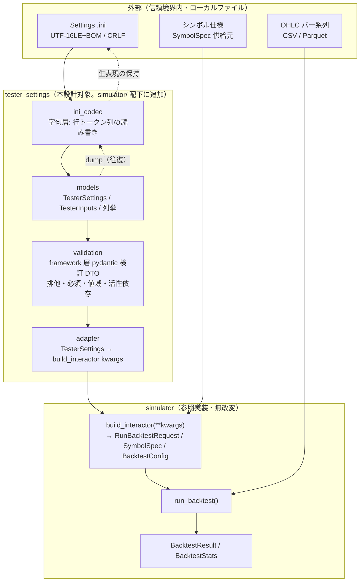
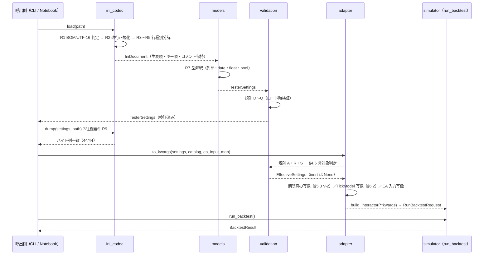
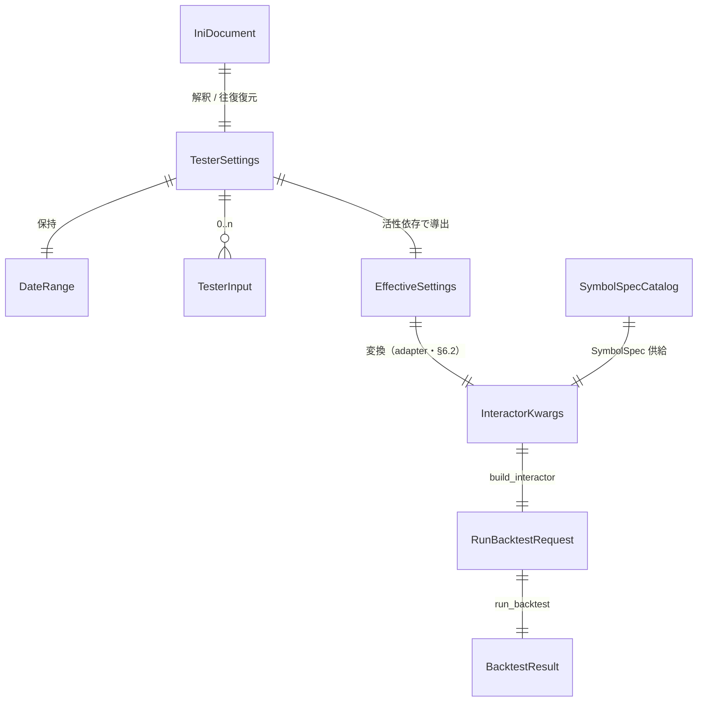

# MT5 ストラテジーテスター Settings タブ Python 移植 基本設計書

MetaTrader 5 ストラテジーテスターの **Settings タブ（実行条件）** を Python へ移植するための基本設計を確定する。本書は「バックテストの実行条件をどう表現し、どう検証し、どうエンジンへ渡すか」を対象とし、**EA の売買ロジックとエンジン内部アルゴリズムは対象外**とする。

- **出典（一次情報）**:
  - `sample/MQL5/Profiles/Tester/*.ini`（44 件。Settings タブの機械可読シリアライズ。UTF-16LE + BOM + CRLF。2026-08-17 復元・照合済み。Git 追跡外＝`.gitignore:236`）
  - `.doc/ss20260817190711.jpg`（Settings タブ全体。Modelling = `Math calculations`）
  - `.doc/ss20260627184706.jpg`（Modelling ドロップダウン展開。選択肢 5 件。⚠️ 現在リポジトリに不在＝再取得待ち（ISSUE-385）。§2.2.2 は撮影時の実測記録）
- **参照実装（挙動の正）**:
  - 現行バックテストエンジン: `simulator/`（`usecase/run_backtest.py`・`usecase/models.py`・`main/__init__.py` の `build_interactor`・`adapter/execution/tick_model_registry.py` ほか）
  - 実行条件機構（Phase 6 確定）: [`./sim-backtest-ui-integration/基本設計書.md`](./sim-backtest-ui-integration/基本設計書.md) §16（`SymbolSpecCatalog`・`allowed_backtest_keys()`・`POST /sim/jobs` 契約）
  - MT5 実走オラクル: `simulator/tests/fixtures/mt5/`（golden・bit-exact）・`simulator/tests/confirmation/`（bit-exact 突合ケース群。Git 追跡外）
- **関連ドキュメント（旧設計・歴史的仕様）**: ⚠️ 以下は `simulator/` 実装に先行する旧設計文書であり、現行実装と乖離した記述を含む（乖離点は §4.5・§5・§6.2 で明示）。本書が旧設計文書と現行実装のどちらとも矛盾する場合、挙動の正は上記参照実装とする。
  - バックテストエンジン設計（9 項目）: [`./backtest/BACKTEST_DESIGN.md`](./backtest/BACKTEST_DESIGN.md)
  - 実行プロセス（OnTick の処理順）: [`./backtest/BACKTEST_PROCESS.md`](./backtest/BACKTEST_PROCESS.md)
  - 分析結果の用語・算出式: [`./backtest/BACKTEST_METRICS.md`](./backtest/BACKTEST_METRICS.md)
  - 戦略ロジック仕様: [`./backtest/BACKTEST_SPEC.md`](./backtest/BACKTEST_SPEC.md)
  - MQL5 → Python 移植ガイド（主対象はインディケーター移植）: [`../indigators/PORTING_GUIDE.md`](../indigators/PORTING_GUIDE.md)
  - 指標計算モデル: [`./indicator-management-ui/INDICATOR_CALC_MODEL.md`](./indicator-management-ui/INDICATOR_CALC_MODEL.md)
- **記述方針**: 実証済みの事実（corpus 実測・画像実測・実コード実測）と未確定の推定を分離する。未確定は §9.3 に隔離し、本文で使用する場合は「暫定」と明示する。⚠️ は非決定要因・原典仕様の注意点。本文中の `BACKTEST_*.md` への参照はすべて `.doc/backtest/` 配下、`PORTING_GUIDE.md` は `indigators/` 配下を指す。

---

## 1. 文書情報

| 項目 | 内容 |
|---|---|
| 文書名 | MT5 ストラテジーテスター Settings タブ Python 移植 基本設計書 |
| 版 | v1.1.0 |
| 作成日 | 2026-08-17（v1.1.0 改訂 2026-08-17） |
| 設計対象 | バックテスト実行条件（Settings タブ）の設定モデル・`.ini` 双方向変換・現行 `simulator/` エンジンへの設定適用 |
| 設計レベル | 基本設計（内部設計＝クラス粒度・実装仕様は対象外） |
| 変更履歴 | v1.0.0: 初版（`sample/MQL5/Profiles/Tester/` 44 件および画像 2 枚の実測に基づく）。v1.1.0: ISSUE-384〜388 の一括是正（承認 2026-08-17）＝接続先を旧 `backtest` 設計から現行 `simulator/` 実装へ差し替え（§2.1・§5・§6.2）／参照パス実在化／技術スタック記載を実測値へ更新（CON-04・CON-07・§3.3）／検証層を framework 層 pydantic の既存規約へ再裁定（U-1・K-02）／Delays 実行拒否（旧 N-04）を撤回（§4.5.3）／§4.5 実行時セマンティクスを現行エンジン実装の実測に整合 |

### 1.1 指示された 14 項目と本書の章対応

| # | 指示項目 | 記載章 |
|---|---|---|
| 1 | 目的・位置付け（責務境界） | §2.1 |
| 2 | 要件の分類 | §2.3.1 / §2.3.2 / §2.3.3 |
| 3 | 移植元の事実 | §2.2 |
| 4 | 機能設計（フィールド・列挙・変換規則） | §4.2 / §4.3 / §4.4 |
| 5 | データ設計 | §5 |
| 6 | インターフェース設計 | §6 |
| 7 | アーキテクチャ方針 | §3 |
| 8 | 各 Settings 項目の実行時セマンティクス | §4.5 |
| 9 | 保証境界（対象／非対象） | §4.6 |
| 10 | 例外設計 | §7.5 |
| 11 | 未確定事項 | §9.3 |
| 12 | 画像の再現プリセット | §4.7 |
| 13 | 下流工程への引き渡し | §8.5 |
| 14 | 決定事項一覧 | §10.2 |

---

## 2. プロジェクト概要

### 2.1 システム概要と責務境界

#### 2.1.1 位置付け

本設計対象は、現行バックテストエンジン `simulator/` の **入口**（実行条件の受領・検証・変換）である。MT5 テスターにおける Settings タブが担う「どの EA を・どの銘柄で・どの期間・どのティック生成方式・どの口座条件で回すか」を Python の設定モデルとして確定し、現行の投入契約（`build_interactor(**kwargs)` → `RunBacktestRequest` → `run_backtest`。`simulator/main/__init__.py`）へ引き渡す。

```
MT5 Settings タブ（UI）            本設計対象                        参照実装（simulator/）
┌────────────────┐   保存   ┌──────────────────┐  変換  ┌───────────────────────┐
│ Expert/Symbol/ │ ───────→ │ .ini ⇄ TesterSettings │ ─────→ │ build_interactor(**kw) │
│ Date/Modelling │  .ini    │ ＋整合検証／活性依存    │        │ → RunBacktestRequest   │
└────────────────┘          └──────────────────┘        │ → run_backtest()       │
                                                          └───────────────────────┘
```

⚠️ **v1.0 からの是正（ISSUE-384）**: v1.0 は接続先を `backtest` パッケージ（旧 `BACKTEST_DESIGN.md` の未実装設計）としていたが、`backtest` パッケージはリポジトリに存在せず、実装は `simulator/` である。v1.1 で接続先を現行実装＝参照実装へ差し替えた。旧設計の `BacktestConfig`（`symbol_spec`/`initial_deposit` 等を持つ想定）と現行 `simulator/usecase/models.py:BacktestConfig`（決定論 9 項目＋拡張 2 項目）は**別物**である（§6.2）。

#### 2.1.2 既存実装・既存ドキュメントとの責務境界

| パス | 役割 | 本設計書との境界 |
|---|---|---|
| `simulator/`（**参照実装**） | 現行バックテストエンジン。MT5 実走との bit-exact 突合済み（golden fixture＋confirmation ケース群）。投入契約は `build_interactor`／`RunBacktestRequest`（`main/__init__.py`）、決定論設定は `usecase/models.py:BacktestConfig`（9 項目＋拡張） | **挙動の正**。本書は Settings 層をこの契約の上流に追加する。エンジン内部（約定・統計・口座）は改変しない（追加のみ・OCP） |
| `.doc/sim-backtest-ui-integration/基本設計書.md` | sim バックテスト UI 統合の基本設計（§13〜§17 確定済み）。§16.3 に実行条件機構（`SymbolSpecCatalog`／`RunProfile`／`allowed_backtest_keys()`＝`build_interactor` シグネチャ由来／`POST /sim/jobs` 契約） | Settings 層の接続先契約。本書 §6.2 はこの機構への写像を定義する |
| `.doc/backtest/BACKTEST_DESIGN.md` | 旧エンジン設計仕様書（9 項目）。§9.1 例外階層・§4.4 Fail-Stop 方針は現行実装に引き継がれている | 旧設計。方針（Fail-Stop・沈黙スキップ禁止）は引用するが、モデル定義（§7.2）・技術スタック（§4.1）・語彙（§6.3）は現行実装と乖離しており**引用しない**（乖離の実測は ISSUE-384） |
| `.doc/backtest/BACKTEST_PROCESS.md` | 旧実行フロー文書。⚠️ §0.2 は **3 モード表**（Open prices only / 1 Min OHLC / Every tick）であり 5 モード表ではない（実測。ISSUE-388） | 歴史的仕様。現行のモード別実行構造は §4.5.1（実コード実測）に従う |
| `.doc/backtest/BACKTEST_METRICS.md` | MT5 レポート用語辞典。§5.1 口座式（`Margin = Σ lot·contract_size·entry/leverage`）、**§6 に 5 モードの用語集**（1 行ずつ）、§7 最適化・カスタム指標系 | 集計式の用語出典。ゼロ除算等の実挙動は現行 `usecase/metrics_spec.py`（MT5 校正済み）を正とする（§4.5.2） |
| `.doc/backtest/BACKTEST_SPEC.md` | 各 EA の戦略ロジック仕様 | 本書は EA ロジックを扱わない（§4.6 非対象） |
| `indigators/PORTING_GUIDE.md` | MQL→Python 移植規約（主対象はインディケーター移植）。§2 アーキテクチャ原則（依存は内向き／DTO は `@dataclass(frozen=True)`） | 準拠する一般規約。ただし検証層の実装手段は simulator 既存規約（framework 層 pydantic。U-1）が優先する |
| `.doc/indicator-management-ui/INDICATOR_CALC_MODEL.md` | `OnCalculate` → バッチ計算 | 参考のみ。本書からの参照は行わない |

---

### 2.2 移植元の事実（一次情報の整理）

本節は実測結果のみを記載する。実測に基づかない推定は §9.3 に隔離する。

#### 2.2.1 一次情報 1: Settings タブ画面（`.doc/ss20260817190711.jpg`）

読み取れた全コントロール（グレーアウト＝非活性の項目も値は表示される）。

| # | 画面ラベル | 表示値 | 活性状態 |
|---|---|---|---|
| 1 | Expert | `260620-01_limit_stop.ex5` | 活性 |
| 2 | Symbol（銘柄） | `JP225` | 非活性 |
| 3 | Symbol（時間足） | `M1` | 非活性 |
| 4 | Date（種別） | `Custom period` | 非活性 |
| 5 | Date（開始） | `2026.04.01` | 非活性 |
| 6 | Date（終了） | `2026.04.30` | 非活性 |
| 7 | Forward（種別） | `No` | 非活性 |
| 8 | Forward（日付） | `2026.04.15` | 非活性 |
| 9 | Delays | `Zero latency, ideal execution` | 非活性 |
| 10 | Modelling | `Math calculations` | **活性** |
| 11 | profit in pips for faster calculations（チェックボックス） | チェックなし | 非活性 |
| 12 | Deposit（金額） | `10000` | 非活性 |
| 13 | Deposit（通貨） | `JPY` | 非活性 |
| 14 | leverage | `1:10` | 非活性 |
| 15 | Optimization | `Disabled` | 活性 |

補足（実測）:

- Delays 行の右に説明文 `select a delay to emulate slippage and requotes during trade execution` が表示される。Delays は約定遅延（スリッページ・リクオート）のエミュレーション設定である。
- 画像 1 には `visual mode with the display of charts, indica...` チェックボックスが**描画されていない**。画像 2（Modelling = `Every tick`）には Optimization 行の右に同チェックボックスが**描画されている**。→ Modelling = `Math calculations` のとき visual mode は指定不能である（§4.5.5 規則 C）。
- Symbol 行の右に通貨設定ボタン（`$` アイコン）、Delays 行の右に遅延設定ボタンが存在する。いずれも設定値そのものではないため設計対象外とする。

**非活性の理由（設計上の解釈）**: Modelling に `Math calculations` を選ぶと価格イベントを生成しないため、銘柄・時間足・期間・フォワード・遅延・証拠金の各項目が実行結果に影響しない。MT5 はこの依存関係を UI の活性/非活性で表現している。本書は同じ依存関係をバリデーション規則と派生ビューで表現する（§4.5.5）。

#### 2.2.2 一次情報 1-b: Modelling ドロップダウン（`.doc/ss20260627184706.jpg`）

選択肢は上から 5 件（UI 表示順）。

| UI 表示順 | ラベル |
|---|---|
| 1 | `Every tick` |
| 2 | `Every tick based on real ticks` |
| 3 | `1 minute OHLC` |
| 4 | `Open prices only` |
| 5 | `Math calculations` |

⚠️ **UI 表示順は `.ini` の `Model` 数値と一致しない**（§2.2.4 の実測対応を参照）。UI 順を数値に読み替えてはならない。

#### 2.2.3 一次情報 2: `.ini` corpus の実測（44 件）

**ファイル構造（実測）**

| 事実 | 実測根拠 |
|---|---|
| 総数 44 件、拡張子 `.ini` | `sample/MQL5/Profiles/Tester/*.ini` の列挙で 44 件 |
| エンコーディングは UTF-16（BOM 付き） | 先頭 2 バイトが BOM。通常のテキスト読取では文字間に NUL が見える |
| 改行は CRLF | `^Visual=1\r$` が 38 件一致（`\r` を含めた正規表現で一致する） |
| 1 行目は `;` 始まりのコメント（MT5 自動生成） | 44 件すべてで 1 行目が `;` 始まり |
| セクションは `[Tester]` と `[TesterInputs]` の 2 個のみ、各 1 回 | `\[Tester(Inputs)?\]` が 88 件 / 44 ファイル（= 2 個ずつ） |
| `[TesterInputs]` は空セクションでも存在する | `TC24051903.JP225.Daily.all_history.200.ini` は `[TesterInputs]` 直後に本文なしで終端 |
| 最終行も CRLF で終端する | 上記ファイルの末尾構造 |

**`[Tester]` セクションの全キー（17 キー・実測）**

| キー | 出現数 | 実測値の全種類 |
|---|---|---|
| `Expert` | 31 | `TC24051901.ex5`, `TC24051902.ex5`, `TC24051903.ex5`, `TC24051903_24052301.ex5`, `my_first_ea.ex5`, `range.ex5`, `Examples\Moving Average\Moving Average.ex5` |
| `Indicator` | 13 | `Band.ex5`, `MADR.ex5`, `PRO!fit_Band.ex5`, `TC240506_01.ex5`, `TC240506_02.ex5`, `autocorrelation.ex5`, `Examples\TC240504_01.ex5`, `Examples\PRO!fit_HLBand.ex5`, `Free Indicators\Woodie Channel.ex5` |
| `Symbol` | 44 | `JP225`, `JP225c`, `JP225_ver24051601` |
| `Period` | 44 | `Daily`, `H1`, `H8` |
| `Model` | 44 | `0`, `1`, `2`, `4` |
| `Dates` | 27 | `0`, `2` |
| `FromDate` | 17 | `2010.11.15`, `2012.01.01`, `2020.03.30`, `2023.01.01` |
| `ToDate` | 17 | `2012.03.31`, `2012.12.31`, `2015.12.31`, `2023.12.31`, `2024.05.18`, `2024.05.19` |
| `Optimization` | 31 | `0`, `1`, `2` |
| `OptimizationCriterion` | 31 | `0`, `1` |
| `ForwardMode` | 31 | `0`（17 件）, `3`（11 件）, `4`（3 件） |
| `ForwardDate` | 3 | `1970.01.01`, `2023.05.22` |
| `Deposit` | 31 | `10000`, `139500` |
| `Currency` | 31 | `JPY` |
| `ProfitInPips` | 31 | `0`, `1` |
| `Leverage` | 31 | `10`, `100` |
| `ExecutionMode` | 31 | `-1`, `21`, `50` |
| `Visual` | 38 | `1` |

⚠️ 上記 17 キー以外（MT5 が対応する `Report` / `ReplaceReport` / `ShutdownTerminal` / `UseLocal` 等）は本 corpus に出現しない。**本設計書の対象キーは上記 17 キーに限定する**（§4.6 非対象、§9.3 TBD-15）。

**キー出現順（実測・往復に使用）**

Expert テスト（`TC24051903.JP225.Daily.all_history.200.ini` の全文構造）:

```
;Expert Advisor visual test: TC24051903, JP225 Daily, open prices, entire history
[Tester]
Expert / Symbol / Period / Optimization / Model / {Dates | FromDate,ToDate} /
ForwardMode / [ForwardDate] / Deposit / Currency / ProfitInPips / Leverage /
ExecutionMode / OptimizationCriterion / [Visual]
[TesterInputs]
```

Indicator テスト（`PRO!fit_Band.JP225.H8.all_history.4.ini` の全文）:

```
;Indicator visual test: PRO!fit_Band, JP225 H8, real ticks, entire history
[Tester]
Indicator=PRO!fit_Band.ex5
Symbol=JP225
Period=H8
Model=4
Dates=0
Visual=1
[TesterInputs]
inpSymbol=
inpTimeFrame=0||0||0||49153||N
```

#### 2.2.4 実測で確定した構造的事実（推測ではない）

| # | 事実 | 実測根拠 |
|---|---|---|
| F-1 | `Expert` と `Indicator` は排他 | `^(Expert\|Indicator)=` が 44 件 / 44 ファイル（各 1 件）。31 + 13 = 44 |
| F-2 | `Dates` と `FromDate`/`ToDate` は排他 | `Dates` 27 件・`FromDate` 17 件で 27 + 17 = 44、両方を持つファイルは 0 件 |
| F-3 | `Model=0` ↔ コメント `every tick` | `Moving Average.JP225.H8.last_year.000.ini`（`Model=0` / `;… every tick, last year`）、`TC240504_01…0.ini` 他 |
| F-4 | `Model=1` ↔ コメント `m1 ohlc` | `TC24051901.JP225.Daily.all_history.100.ini`（`Model=1` / `;… m1 ohlc, entire history`） |
| F-5 | **`Model=2` ↔ コメント `open prices`** | `TC24051903.JP225.Daily.all_history.200.ini` 1 行目 `;Expert Advisor visual test: TC24051903, JP225 Daily, open prices, entire history` かつ 7 行目 `Model=2`。**実証済み**（本作業で確定） |
| F-6 | `Model=4` ↔ コメント `real ticks` | `PRO!fit_Band.JP225.Daily.all_history.4.ini`（`Model=4` / `;… real ticks, entire history`） |
| F-7 | `Dates=0` ↔ `entire history`、`Dates=2` ↔ `last year` | `TC24051903.JP225.Daily.all_history.100.ini`（`Dates=0`）、`PRO!fit_Band.JP225.Daily.last_year.0.ini`（`Dates=2` / `;… last year`） |
| F-8 | `Optimization=0` ↔ コメントに最適化表記なし（`… visual test`）、`=1` ↔ `Full optimization`、`=2` ↔ `Genetic optimization` | `TC24051903.JP225.Daily.20200330_20240518.111.ini`（`Optimization=1` / `;Full optimization: …`）、`TC24051903.JP225_ver24051601.H8.all_history.121.ini`（`Optimization=2` / `;Genetic optimization: …`）、`…120.ini`（`Optimization=2` / `Genetic optimization`・forward なし） |
| F-9 | `ForwardMode≠0` ↔ コメント末尾 `, with forward period` | `ForwardMode=3` の 11 件および `=4` の 3 件すべてでコメント末尾に一致。`ForwardMode=0` の 17 件では出現しない |
| F-10 | `ForwardMode=4` ⇔ `ForwardDate` 併記 | `ForwardMode=4` は 3 件、`ForwardDate` も 3 件、集合が一致（`TC24051903.JP225_ver24051601.Daily.all_history.101.ini` / `…H8.all_history.121.ini` / `TC24051903_24052301…20120101_20121231.121.ini`）。`ForwardMode∈{0,3}` の 28 件に `ForwardDate` は存在しない |
| F-11 | `Visual` キーの有無は `Optimization` で決まる（`Visual` 欠落 ⇔ `Optimization∈{1,2}`） | `Visual` 38 件 = Indicator 13 件 + Expert かつ `Optimization=0` 25 件。欠落 6 件は `Optimization=1` の 2 件と `=2` の 4 件に一致 |
| F-12 | Indicator テストは Expert 専用 8 キー（`Optimization` / `ForwardMode` / `Deposit` / `Currency` / `ProfitInPips` / `Leverage` / `ExecutionMode` / `OptimizationCriterion`）を持たない | 当該 8 キーの出現数がすべて 31（= Expert ファイル数）。Indicator 13 件は `Indicator` / `Symbol` / `Period` / `Model` / 期間 / `Visual` の 6 キーのみ |
| F-13 | `[TesterInputs]` の書式は `名前=現在値\|\|開始値\|\|刻み\|\|終了値\|\|{Y\|N}` | `MAPeriod=3\|\|2\|\|1\|\|22\|\|Y`、`LotSize=0.01\|\|0.01\|\|0.001000\|\|0.100000\|\|N`、`CheckMarketHours=true\|\|false\|\|0\|\|true\|\|N` |
| F-14 | `[TesterInputs]` には `名前=`（値なし・`\|\|` なし）の形式も存在する | `PRO!fit_Band.JP225.H8.all_history.4.ini` の `inpSymbol=` |
| F-15 | `inpTimeFrame` の最適化終了値 `49153` は MQL `ENUM_TIMEFRAMES` の `PERIOD_MN1` に一致する | `inpTimeFrame=0\|\|0\|\|0\|\|49153\|\|N`。`PERIOD_MN1 = 49153`（0xC001）。時間足入力が `ENUM_TIMEFRAMES` の生値で保存されることを示す |
| F-16 | ファイル名末尾の数字は Expert テストで `{Model}{Optimization}{Forward 有効フラグ}`、Indicator テストで `{Model}` と一致する | 44 / 44 件で成立。例: `…all_history.400.ini`（`Model=4, Optimization=0, ForwardMode=0`）、`…20200330_20240518.121.ini`（`Model=1, Optimization=2, ForwardMode=3`）、`…all_history.121.ini`（`Model=1, Optimization=2, ForwardMode=4`）、`PRO!fit_Band…4.ini`（`Model=4`）。⚠️ 第 3 桁は「forward 有効/無効」のみを表し、`ForwardMode` の値（3 / 4）を区別しない。MT5 側の命名規則そのものは公式仕様で未確認（§9.3 TBD-09） |
| F-17 | `ForwardDate=1970.01.01`（Unix epoch 0）が `ForwardMode=4` と併記される例が存在する | `TC24051903_24052301.JP225_ver24051601.H8.20120101_20121231.121.ini`。⚠️ 「カスタム日付が未設定」の状態を表す退化値として扱う必要がある |
| F-18 | 1 行目コメントの書式は `;{テスト種別}: {対象名}, {Symbol} {Period}, {Model 語}, {期間語}[, with forward period]` | 44 件すべてで成立。テスト種別の実測値は `Expert Advisor visual test` / `Indicator visual test` / `Full optimization` / `Genetic optimization` の 4 種 |
| F-19 | `260620-01_limit_stop` に対応する MQL ソースはリポジトリ内に存在しない | `sample/MQL5` 配下の `260620\|limit_stop` 検索でヒットは `sample/MQL5/Experts/StopEntryProbe_EA.mq5:40: input ulong EA_Magic = 20260620;` の 1 件のみ |
| F-20 | `sample/` は Git 追跡対象外 | `.gitignore:236: sample/`（2026-08-17 追加・`git status` で非表示を実測。⚠️ v1.0 の「`.gitignore:180`」は当時の誤記＝当時エントリ自体が不在だった。ISSUE-385） |

#### 2.2.5 上流入力からの訂正（本作業で実測により更新した点）

| 上流入力の記載 | 実測結果 | 本書での取り扱い |
|---|---|---|
| 「`Model=2` はコメントから確定できていない（`Open prices only` と推定されるが未実証）」 | `Model=2` のファイルのコメントに `open prices` が存在（F-5） | **実証済みとして扱う**。§9.3 の未確定事項から除外 |
| 「`ForwardMode` の 1・2・3 が未確定」 | `ForwardMode=3` は 11 件で実測され、`ForwardDate` を伴わない forward 有効状態であることが確定（F-9・F-10） | 値の存在と「forward 有効・日付なし」の性質は実証。UI の `1/2`・`1/3`・`1/4` のどれに対応するかは未確定（§9.3 TBD-03） |
| 「ファイル名末尾の数字はユーザー独自の連番と思われる（未実証）」 | 44 / 44 件で `{Model}{Optimization}{Forward 有効フラグ}` に一致（F-16） | 相関は実証済み。生成規則の公式根拠は未確定（§9.3 TBD-09） |
| 「画像の 10 項目＋2 チェックボックス」 | 画像 1 のコントロールは 15 個（うちチェックボックス 1 個）。2 個目のチェックボックス（visual mode）は画像 2 でのみ描画される | §2.2.1 の 15 コントロール表と §4.7 の写像表で全件を対応付ける |
| 「`Indicator` の実測値 …他」 | 9 種（`autocorrelation.ex5` を含む） | §2.2.3 の表に全 9 種を列挙 |

---

### 2.3 適用範囲・制約条件

#### 2.3.1 機能要件

| 要件 ID | 機能要件 | 出典 |
|---|---|---|
| FR-01 | Settings タブの全 17 キーを型付き設定モデル（`TesterSettings`）として表現する | §2.2.3 実測 |
| FR-02 | `.ini`（UTF-16LE+BOM / CRLF / 先頭コメント）を設定モデルへ変換する（デコード） | §2.2.3 実測 |
| FR-03 | 設定モデルを `.ini` へ変換する（エンコード）。読込元がある場合はバイト列同一で復元する | 原典忠実（NFR-02） |
| FR-04 | `[TesterInputs]` の 5 分割書式（`名前=現在値\|\|開始値\|\|刻み\|\|終了値\|\|{Y\|N}`）および値なし形式を解析・復元する | F-13・F-14 |
| FR-05 | 排他・必須・値域の整合検証を行い、違反を例外で拒否する | §7.5 |
| FR-06 | UI の活性/非活性依存を検証規則および派生ビュー（`EffectiveSettings`）として表現する | §2.2.1 実測 |
| FR-07 | 設定モデルを現行投入契約（`build_interactor` 引数＋`RunBacktestRequest`）へ変換する | §6.2（ISSUE-384 是正） |
| FR-08 | `Model` 値に対応するティック生成方式を選択する（5 モードの語彙は `BACKTEST_METRICS.md §6` 用語集。現行実装の受け口は `TICK_MODEL_IDS` の 4 値＋契約拡張 1 値） | §4.5.1・§6.2 |
| FR-09 | `Math calculations`（ティック非生成）を「正常終了で trades=0」として扱う。⚠️ 現行契約は `data_path` 必須のため**契約拡張を要する**（§4.5.2） | §4.5.2 |
| FR-10 | 非対象設定（§4.6）の実行要求を沈黙スキップせず例外で拒否する | `BACKTEST_DESIGN.md §4.4` |
| FR-11 | 期間指定（`Dates` プリセット / `FromDate`・`ToDate`）を入力バー系列のフィルタとして適用する | §5.3 |
| FR-12 | 1 行目コメントを往復のため保持し、検証補助として解析できる（読取専用） | F-18 |

#### 2.3.2 非機能要件（数値目標付き）

| 要件 ID | 非機能要件 | 数値目標 | 測定方法 |
|---|---|---|---|
| NFR-01 | 決定論性: 同一入力から同一設定モデルを得る | 同一ファイルの 2 回ロードで全フィールド一致率 100%（44 / 44 件） | 2 回ロード結果の等価比較テスト |
| NFR-02 | 原典忠実: 往復（load → dump）でバイト列一致 | 44 / 44 件でバイト列一致（BOM・CRLF・キー順・コメント・数値表記を含む） | 元ファイルと出力のバイト比較テスト |
| NFR-03 | Fail-Stop: 不正・未知・非対象を沈黙処理しない | §7.5 の 7 例外クラスすべてに送出テスト 1 件以上、合計 20 ケース以上 | 異常系テスト |
| NFR-04 | 性能: 設定ロードがエンジン実行時間に対して無視できる | 1 ファイルのロード＋検証 ≤ 10 ms、44 件一括 ≤ 500 ms（`BACKTEST_DESIGN.md §4.3` の 1 run 30 秒に対し 2% 未満） | `time.perf_counter` による計測テスト |
| NFR-05 | 保守性: 未確定値の確定を局所変更で吸収する | 列挙値 1 個の追加で変更ファイル数 ≤ 2 | 変更差分のレビュー |
| NFR-06 | トレーサビリティ: 設定フィールドと出典の対応を保つ | 全 17 キーに実測根拠または TBD 番号を付与（欠落 0 件） | §4.2 / §4.3 の表レビュー |

#### 2.3.3 制約条件

| 制約 ID | 制約条件 | 根拠 |
|---|---|---|
| CON-01 | 範囲は「設定モデル」＋「エンジン骨格への接続」。EA の売買ロジックは対象外 | ユーザー確定事項 1。画像の `260620-01_limit_stop.ex5` に対応する `.mq5` は不存在（F-19） |
| CON-02 | Modelling は 5 モードすべてを列挙として設計する。**既定値は `1 minute OHLC`（`Model=1`）＝現行 `tick_model="ohlc_expand"`** | ユーザー確定事項 2（約定検証が可能なモード。MT5 突合オラクルも全ケース `1 minute OHLC`＝実測） |
| CON-03 | 新規依存を追加しない。設定・ドメインの内側 DTO は `@dataclass(frozen=True)`、検証は **framework 層 pydantic**（既存規約） | 2026-08-17 再裁定（ISSUE-386 承認）。v1.0 確定事項 3「pydantic 不採用」は根拠（現コンテナ未導入）が誤りだったため撤回。pydantic 2.13.4 は導入済みで、`simulator/framework/config_loader.py` が既に pydantic 検証を採用（`_ConfigModel`・`extra="forbid"`・`Literal[TICK_MODEL_IDS]`） |
| CON-04 | 現コンテナ導入済み（実測 2026-08-17）: Python 3.13.5・numpy 2.4.6・pandas 3.0.3・pytest 9.0.3・pydantic 2.13.4・tqdm。`requirements.txt` は別プロジェクト（preflop range getter）由来で陳腐化している（実導入群を反映していない） | `pip list` 実測（⚠️ v1.0 の「numpy と tqdm のみ」は誤り＝ISSUE-386） |
| CON-05 | `sample/` は Git 追跡対象外（`.gitignore:236`）。corpus 44 件は 2026-08-17 に復元済みだが CI からは直接参照できない（追跡外のため）。フィクスチャ化の方針は D-06 | F-20・ISSUE-385 |
| CON-06 | MT5 実行環境（Windows / MetaTrader 5 端末）は本リポジトリに存在しない。`.ini` を MT5 に読み戻す実機検証は本工程で実施できない | 環境制約 |
| CON-07 | 技術スタックのバージョンを無断変更しない。基準は**実環境の導入済みバージョン**（CON-04）とする。⚠️ v1.0 が維持対象とした旧 `BACKTEST_DESIGN.md §4.1` の指定（pandas 2.x 等）は実環境（pandas 3.0.3）と乖離しており基準にしない（ISSUE-386） | `.claude/CLAUDE.md` 絶対遵守ルール＋実測 |
| CON-08 | 本作業の成果物はドキュメントのみ。`requirements.txt` の整理およびコード実装は内部設計・実装工程で行う | 依頼範囲 |

#### 2.3.4 上位確定事項（旧設計・v1.0 に対する本書の確定）

旧 `BACKTEST_DESIGN.md` の本文は改訂しない。以下は**本書が上位**として扱う確定事項であり、内部設計はこちらに従う。

| # | 対象 | 旧記載（`BACKTEST_DESIGN.md` / v1.0） | 本書の確定事項（v1.1） | 根拠 |
|---|---|---|---|---|
| U-1 | 検証の実装手段 | v1.0「pydantic を導入しない。検証は専用検証層に手書き（19 規則）」 | **simulator 既存規約に揃える**: 検証は framework 層の pydantic 検証 DTO（`config_loader.py:_ConfigModel` 流儀＝`extra="forbid"`・列挙は `Literal` で固定・cross-field は `model_validator`）、内側 DTO は `@dataclass(frozen=True)`。§4.4/§4.5.5 の検証**規則そのもの**（19 件）は不変＝実装手段のみの変更 | 2026-08-17 再裁定（ISSUE-386）。既存規約の実在（`simulator/framework/config_loader.py`）＋pydantic 2.13.4 導入済み（CON-04） |
| U-2 | ドメインモデルの表現 | 旧 §7.2 で `pydantic.BaseModel` 定義 | 内側 DTO（`TesterSettings`／`IniDocument` 等）は `@dataclass(frozen=True)`。pydantic は検証境界（framework 層）に限定し、内側レイヤは import しない（simulator と同じ依存方向） | `PORTING_GUIDE.md §2` DTO 規約＋simulator 既存規約 |
| U-3 | ティックモデル語彙 | 旧 §6.3 は `ohlc_simulate` / `every_tick_real` / `open_only` の 3 値（v1.0 はこれを基準に写像） | **現行の単一レジストリ `TICK_MODEL_IDS`**（`every_tick` / `ohlc_expand` / `open_only` / `real_ticks`。`simulator/adapter/execution/tick_model_registry.py`）を写像先とする。`MATH_CALCULATIONS` のみ現行に対応値が無く、レジストリへの 1 エントリ追加＝契約拡張を要する（§6.2） | 実コード実測（ISSUE-384 項 3。旧 3 値語彙は陳腐化） |
| U-4 | 依存追加 | 旧 §4.1 に `jinja2` / `lightweight-charts-python` を含む | 本設計対象（設定層）はこれらに依存しない。新規依存の追加なし（pydantic・pandas・pytest はすべて導入済み＝CON-04） | CON-03・CON-04・CON-08 |
| U-5 | 既定ティックモデル | 旧 §5.1 の例で `tick_model="ohlc_simulate"` | 既定値を `TickModel.ONE_MINUTE_OHLC`（`Model=1`）＝現行 `"ohlc_expand"` と明文化する。⚠️ 現行 `config_loader` の既定は `"every_tick"` であり、Settings 層経由の既定とは別（Settings 層は常に明示値を渡す） | CON-02＋実コード実測 |

#### 2.3.5 設計上の課題と技術的リスク（詳細は §9.1）

| # | 課題 | 影響 |
|---|---|---|
| C-1 | `Model=3`（`Math calculations` の想定値）が corpus に存在しない | 画像の再現プリセットが暫定値になる（§4.7） |
| C-2 | `ExecutionMode` の `.ini` キーと UI Delays の同一性が厳密未実証（値 `50` ↔ UI「50 ms」↔ MT5 report `delays_ms:50` の対応はリポジトリ内 fixture で実測済み。§4.5.3） | 遅延の明示エミュレーションは実装しない。bit-exact 保証は実測済みの組（Zero latency・50 ms）に限定（§4.5.3・TBD-07） |
| C-3 | 往復バイト一致と型付きモデルの両立 | 二重表現（生表現＋型付き表現）が必要（§3.2 採用案） |
| C-4 | `sample/` が Git 追跡外（CON-05。corpus は復元済み） | 44 件往復テストを CI で実行できない。フィクスチャ複製方針を内部設計で決定（D-06。UTF-16 バイナリのコミット可否は承認事項） |
| C-5 | MT5 実機検証不可（CON-06） | プリセットの読み戻し確認が未実施のまま残る（§9.3 TBD-18） |
| C-6 | `Math calculations` の `data=None` 実行は現行契約（`data_path` 必須・`required_backtest_keys()`）に無い | エンジン骨格・投入契約の拡張が必要。範囲を §4.5.2 に明示（ISSUE-387 項 3） |

---

## 3. システムアーキテクチャ

### 3.1 全体構成図



⚠️ モジュールの最終配置（simulator 既存レイヤ domain / usecase / adapter / framework への割付）は内部設計 D-08 で確定する。図の 4 箱は責務の分割を示す。

### 3.2 アーキテクチャパターン選択理由

**採用**: レイヤード構成（字句層 / モデル層 / 検証層 / 変換層の 4 層）＋ **二重表現**（生表現 `IniDocument` と型付き表現 `TesterSettings` を並置）。検証層は **framework 層の pydantic 検証 DTO**（simulator 既存規約＝`config_loader.py:_ConfigModel` 流儀）で実装する（U-1・2026-08-17 再裁定）。依存方向は外側→内側の一方向（`PORTING_GUIDE.md §2`・simulator と同一）。

| 評価軸 | 採用案: 4 層＋二重表現＋検証は framework 層 pydantic | 代替案 A: 単一モジュールに同居 | 代替案 B: 検証 19 規則を手書き（v1.0 採用案） | 代替案 C: 標準ライブラリ `configparser` で読み書き |
|---|---|---|---|---|
| 要件適合（NFR-02 往復バイト一致） | 適合。生表現がキー順・数値表記・コメント・改行を保持する（pydantic は検証境界のみで往復に関与しない） | 部分適合。生表現が設定モデルの公開面に混入する | 適合 | **不適合**。既定 `optionxform` によるキー小文字化、コメント欠落、`key = value` 形式での書出し、BOM/CRLF のバイト一致保証なし |
| 要件適合（FR-05 検証） | 適合。19 規則を pydantic の `Literal`／field 制約／`model_validator` で宣言的に表現し、規則 ID との対応表（§4.5.5・§7.5）を維持する | 適合 | 適合（ただし実装量大） | 不適合（検証機構を持たない） |
| 既存規約との整合 | **適合**。`simulator/framework/config_loader.py` の実在規約（framework 層 pydantic・`extra="forbid"`・`Literal[TICK_MODEL_IDS]`・内側 DTO は dataclass）と同一流儀＝検証流儀が単一ソース化する | 不適合 | **不適合**。既存 pydantic 検証と手書き検証の二流儀が並立する | 不適合 |
| 運用コスト（依存管理） | 低（新規依存 0。pydantic 2.13.4 は導入済み＝CON-04。pandas は変換層以降のみ） | 低 | 低 | 低 |
| 変更主体の分離（SRP／`PORTING_GUIDE.md §2`） | 適合。`.ini` 書式の変更者（MT5 バージョン）と設定意味の変更者（エンジン仕様）を別モジュールに分離 | **不適合**。2 主体が 1 ファイルに同居する | 適合 | 不適合 |
| 判定 | **採用** | 棄却 | 棄却（v1.0 採用案。ISSUE-386 裁定で置換） | 棄却 |

**採用根拠**:

1. NFR-02（44 / 44 件のバイト一致）は生表現の保持なしに達成できない。型付きモデルだけでは `Deposit=139500` を `139500.0` と書き戻す差分が生じる。
2. `.ini` 書式は MT5 のバージョンに追従して変わり得る。設定の意味（エンジンへの効き方）とは変更主体が異なるため、字句層を分離する。
3. 検証流儀は simulator の既存規約（framework 層 pydantic）に揃える。v1.0 の手書き案は「pydantic 未導入」という誤った前提（ISSUE-386）に基づいており、同一リポジトリに検証二流儀を作ることになるため棄却。**規則の内容（§4.4 R1〜R13・§4.5.5 A〜S）は実装手段に依存せず不変**である。

**採用に伴うトレードオフ（明示）**:

- pydantic は検証境界（framework 層）に限定し、`ini_codec`／`models` からは import しない（依存方向の不変条件。§3.4）。字句層の構文検証（R1〜R8）は pydantic の対象外＝手書きのまま（バイト列・行構造は pydantic の型付けと相性が悪く、往復責務は字句層に閉じるため）。
- 二重表現により、型付き値と生表現の同期責務が生じる。緩和策として、生表現は読込時のみ生成し、型付きモデル側からの部分更新を禁止する（更新は「新しい設定モデル＋標準キー順で新規生成」に限る。§4.4 R6）。

### 3.3 技術スタック詳細

| 層 | 採用技術 | バージョン | 代替候補 | 採用根拠 |
|---|---|---|---|---|
| 言語 | Python | 3.13.5（実環境。実測） | — | CON-04・CON-07（実環境基準） |
| 字句層（`.ini` 入出力） | 標準ライブラリのみ（`pathlib` / `codecs` 相当の組込 `open`） | 標準 | `configparser` | 往復バイト一致（§3.2 代替案 C 棄却理由） |
| 内側 DTO（設定モデル） | `dataclasses`（`frozen=True`）＋ `enum.IntEnum` / `enum.StrEnum` | 標準 | `pydantic.BaseModel` | U-2。`PORTING_GUIDE.md §2` DTO 規約。simulator 内側 DTO（`usecase/models.py`）・`common/applied_price.py` の流儀に一致 |
| 検証層 | `pydantic` v2（framework 層の検証 DTO） | 2.13.4（導入済み。実測） | 手書き 19 規則（v1.0 案） | U-1・ISSUE-386 裁定。`simulator/framework/config_loader.py` の既存規約と単一流儀化 |
| 日付 | `datetime.date` | 標準 | `pd.Timestamp` | 設定層は pandas に依存しない（依存方向）。`YYYY.MM.DD` は時刻を持たない |
| バー系列（変換層以降） | 現行エンジンの入力契約に従う（`data_path` → Repository → `list[domain.Bar]`。§5.2） | — | `pd.DataFrame` 直渡し（v1.0 案） | ISSUE-388 項 5。現行契約はパス渡し＋Repository 変換であり、設定層はバー系列を直接保持しない |
| 数値計算 | `numpy` | 2.4.6（導入済み。実測） | — | CON-04。設定層では未使用 |
| テスト | `pytest` | 9.0.3（導入済み。実測） | `unittest` | 既存 `simulator/tests`・`indigators/*/tests` が pytest 形式 |
| 依存追記 | **なし**（必要ライブラリはすべて導入済み） | — | — | CON-04 実測。`requirements.txt` の陳腐化解消は別途承認事項（§8.4） |

### 3.4 レイヤー構成・責務分担

| レイヤー | 責務 | 依存先 | 出典／根拠 |
|---|---|---|---|
| `ini_codec`（字句層） | UTF-16 の読み書き、BOM・CRLF の保持、行種別（コメント / セクション / エントリ / 空行）への分解と復元。**意味解釈を行わない** | 標準ライブラリのみ | `PORTING_GUIDE.md §2`（依存は内向き）。F-18 の書式実測 |
| `models`（モデル層） | `TesterSettings` / `DateRange` / `TesterInput` / 9 列挙の定義。不変（`frozen=True`）。**I/O と検証を行わない** | 標準ライブラリのみ | `PORTING_GUIDE.md §2`（DTO は不変） |
| `validation`（検証層・framework 配置） | 排他・必須・値域・活性依存の 19 規則の適用（pydantic 検証 DTO＝`extra="forbid"`・`Literal`・`model_validator`）、例外送出（`ValidationError` → `SettingsError` 系への翻訳。§7.5）、`EffectiveSettings` の導出 | `models` / `pydantic` | FR-05・FR-06・U-1 |
| `adapter`（変換層） | `TesterSettings` → `build_interactor` kwargs／`SymbolSpecCatalog` 参照キーへの変換、期間指定の `marketdata_window` への写像 | `models` / `validation` / `simulator`（`main` の投入契約） | FR-07・FR-11・§6.2 |
| （参照のみ）`simulator` 本体 | エンジン内部・統計・出力（**無改変**。契約拡張は §6.2 に明示した範囲のみ） | — | 参照実装 |

**依存方向の不変条件**: `ini_codec` と `models` は `pandas`・`pydantic` を import しない。`pydantic` は `validation`（framework 配置）のみ、`pandas` は `adapter` 以降のみで使用する（simulator の既存依存方向＝「pydantic は framework 層・内側 DTO は dataclass」と同一。設定 core は標準ライブラリのみに限定する。設定層は数値計算を行わないため numpy も不要）。

---

## 4. 機能設計

### 4.1 機能一覧・優先度

| 機能 ID | 機能名 | 概要 | 優先度 | 対応要件 ID |
|---|---|---|---|---|
| M-01 | 設定モデル定義 | `TesterSettings` と 9 列挙の定義（§4.2・§4.3） | A（必須） | FR-01 |
| M-02 | `.ini` デコード | 字句解析 → 生表現 → 型付きモデル（§4.4 R1〜R10） | A | FR-02・FR-04・FR-12 |
| M-03 | `.ini` エンコード | 型付きモデル＋生表現 → バイト列（§4.4 R6・R7・R9） | A | FR-03・FR-04 |
| M-04 | 整合検証 | 19 検証規則の適用と例外送出（§4.5.5・§7.5） | A | FR-05・FR-06 |
| M-05 | 実効設定の導出 | 活性依存に基づく `EffectiveSettings` 生成（§4.5.5） | A | FR-06 |
| M-06 | エンジン設定変換 | `build_interactor` kwargs 生成（§6.2） | A | FR-07 |
| M-07 | ティック生成方式の選択 | `TickModel` → ティック列生成方式（§4.5.1） | A | FR-08 |
| M-08 | `Math calculations` 実行 | ティック 0 件・trades=0 の正常終了（§4.5.2） | A | FR-09 |
| M-09 | 非対象設定の拒否 | 実行要求時の `UnsupportedSettingError`（§4.6） | A | FR-10 |
| M-10 | 期間フィルタ適用 | `Dates` / `FromDate`・`ToDate` によるバー系列の切り出し（§5.3） | A | FR-11 |
| M-11 | コメント行の検証補助解析 | 1 行目コメントと設定値の整合チェック（読取専用） | B（後続） | FR-12 |

### 4.2 `TesterSettings` の全フィールド

`@dataclass(frozen=True)`。単位は明記しない項目を除きすべて無次元。「必須」列は `subject_kind` の値ごとに示す（E=Expert テスト、I=Indicator テスト）。

| # | フィールド | 型 | 対応 `.ini` キー | 既定値 | 値域 | 必須 | 実証状態 |
|---|---|---|---|---|---|---|---|
| 1 | `subject_kind` | `SubjectKind` | （`Expert` / `Indicator` キーのいずれが存在するかで決定） | なし | `{EXPERT, INDICATOR}` | E: 必須 / I: 必須 | F-1 |
| 2 | `subject_path` | `str` | `Expert` または `Indicator` | なし | 1〜255 文字。`\` 区切りの相対パス形式を許容（実測 `Examples\Moving Average\Moving Average.ex5`）。末尾は `.ex5` | E: 必須 / I: 必須 | §2.2.3 |
| 3 | `symbol` | `str` | `Symbol` | なし | 1〜31 文字。空文字は不可 | E: 必須 / I: 必須 | §2.2.3 |
| 4 | `timeframe` | `Timeframe` | `Period` | なし | §4.3.1 の 22 値 | E: 必須 / I: 必須 | 実測ラベルは `Daily` / `H1` / `H8` の 3 件のみ（TBD-10） |
| 5 | `tick_model` | `TickModel` | `Model` | `TickModel.ONE_MINUTE_OHLC`（=1） | §4.3.2 の 5 値 | E: 必須 / I: 必須 | 0・1・2・4 は実証（F-3〜F-6）。3 は暫定（TBD-01） |
| 6 | `date_range` | `DateRange` | `Dates` または `FromDate`＋`ToDate` | なし | §4.2.1 | E: 必須 / I: 必須 | F-2・F-7 |
| 7 | `forward_mode` | `ForwardMode` | `ForwardMode` | `ForwardMode.DISABLED`（=0） | §4.3.4 | E: 必須 / I: 指定不可 | F-9・F-12 |
| 8 | `forward_date` | `date \| None` | `ForwardDate` | `None` | `1970.01.01`〜`2999.12.31` | E: `forward_mode==CUSTOM_DATE` のとき必須、それ以外は `None` 固定 / I: 指定不可 | F-10・F-17 |
| 9 | `deposit` | `float` | `Deposit` | なし（推定しない） | `> 0`。上限は `1e12`（浮動小数の有効桁で口座通貨額を一意に表せる範囲） | E: 必須 / I: 指定不可 | §2.2.3（実測 `10000` / `139500`） |
| 10 | `currency` | `str` | `Currency` | なし（推定しない） | ISO 4217 の 3 文字大文字（`^[A-Z]{3}$`） | E: 必須 / I: 指定不可 | §2.2.3（実測 `JPY` のみ。TBD-17） |
| 11 | `profit_in_pips` | `bool` | `ProfitInPips` | `False` | `{False, True}`（`.ini` では `0` / `1`） | E: 必須 / I: 指定不可 | §2.2.3 |
| 12 | `leverage` | `int` | `Leverage` | なし（推定しない） | `1 ≤ leverage ≤ 1000`（整数） | E: 必須 / I: 指定不可 | §2.2.3（実測 `10` / `100`。UI 表記 `1:N` の N と解釈。TBD-12） |
| 13 | `execution_delay` | `int` | `ExecutionMode` | `ExecutionDelay.ZERO_LATENCY_IDEAL`（=0、暫定） | `-2^31 ≤ v ≤ 2^31-1`（生値を保持） | E: 必須 / I: 指定不可 | §2.2.3（実測 `-1` / `21` / `50`）。値の意味は TBD-06〜TBD-08 |
| 14 | `optimization` | `OptimizationMode` | `Optimization` | `OptimizationMode.DISABLED`（=0） | §4.3.6 | E: 必須 / I: 指定不可 | F-8 |
| 15 | `optimization_criterion` | `OptimizationCriterion` | `OptimizationCriterion` | `OptimizationCriterion.CRITERION_0`（=0） | §4.3.7 | E: 必須 / I: 指定不可 | §2.2.3（実測 `0` / `1`）。意味は TBD-05 |
| 16 | `visual` | `bool \| None` | `Visual` | `None`（キー欠落を表す） | `{None, False, True}` | E: `optimization==DISABLED` のとき任意、それ以外は `None` 固定 / I: 任意 | F-11（実測値は `1` のみ。`0` は TBD-13） |
| 17 | `inputs` | `tuple[TesterInput, ...]` | `[TesterInputs]` セクション全行 | `()` | 0〜256 要素 | E: 任意 / I: 任意 | F-13・F-14 |
| 18 | `header_comment` | `str \| None` | 1 行目 `;` 行 | `None` | `;` で始まる 1 行（原文をそのまま保持。生成はしない） | 任意 | F-18 |
| 19 | `source` | `IniDocument \| None` | （生表現。往復用） | `None` | §4.4 R6・R9 | 読込時は必須、新規生成時は `None` | NFR-02 |

**既定値の設計根拠（既定値を与える 6 フィールド）**

| フィールド | 既定値 | 根拠 |
|---|---|---|
| `tick_model` | `ONE_MINUTE_OHLC` | CON-02（ユーザー確定事項 2）。約定検証が可能な最小構成 |
| `forward_mode` | `DISABLED` | フォワード実行は非対象（§4.6）。既定で無効化する |
| `optimization` | `DISABLED` | 最適化実行は非対象（§4.6）。既定で無効化する |
| `optimization_criterion` | `CRITERION_0`（=0） | 最適化を実行しないため結果に影響しない。実測最頻値（31 件中 25 件が `0`） |
| `execution_delay` | `0`（暫定） | 画像の Delays が `Zero latency, ideal execution` であることと整合させる。⚠️ 値 `0` がこのラベルに対応する根拠は未取得（TBD-08）。実行時の扱いは §4.5.3（拒否せずパススルー・保証境界は実測済み組に限定） |
| `profit_in_pips` | `False` | pips 建て損益計算は非対象（§4.6）。画像でチェックなし |
| `visual` | `None` | 描画は非対象（§4.6）。キー欠落を既定とすることで往復時にキーを発明しない |

⚠️ `deposit` / `currency` / `leverage` / `symbol` / `timeframe` / `date_range` / `subject_*` には既定値を与えない。これらは口座計算・データ選択に直結し、推定値を与えると誤った結果を沈黙生成するため（`.claude/CLAUDE.md`「不明点は推測しない」／`BACKTEST_DESIGN.md §4.4` Fail-Stop）。

#### 4.2.1 `DateRange`（入れ子 DTO）

| フィールド | 型 | 既定値 | 値域 | 必須条件 |
|---|---|---|---|---|
| `kind` | `DateRangeKind` | なし | `{PRESET, CUSTOM}` | 必須 |
| `preset` | `DatesPreset \| None` | `None` | §4.3.3 | `kind==PRESET` のとき必須、`CUSTOM` のとき `None` 固定 |
| `from_date` | `date \| None` | `None` | `1970.01.01`〜`2999.12.31` | `kind==CUSTOM` のとき必須 |
| `to_date` | `date \| None` | `None` | `from_date ≤ to_date` | `kind==CUSTOM` のとき必須 |

#### 4.2.2 `TesterInput`（`[TesterInputs]` の 1 行）

| フィールド | 型 | 既定値 | 値域 | 備考 |
|---|---|---|---|---|
| `name` | `str` | なし | 1〜63 文字。`=` を含まない | MQL の `input` 変数名 |
| `form` | `InputForm` | なし | `{SCALAR, RANGE_5}` | `SCALAR` = `名前=値`（値は空文字を許容、F-14）。`RANGE_5` = 5 分割形式（F-13） |
| `current` | `str` | `""` | 任意文字列（`\|\|` を含まない） | 現在値。**型変換を行わず文字列で保持**（型推定は内部設計で確定。§8.5） |
| `start` | `str \| None` | `None` | 同上 | `form==RANGE_5` のとき必須 |
| `step` | `str \| None` | `None` | 同上 | 同上 |
| `stop` | `str \| None` | `None` | 同上 | 同上 |
| `optimize` | `bool \| None` | `None` | `{None, False, True}` | `form==RANGE_5` のとき必須。`.ini` 上は `Y` / `N` |
| `raw` | `str` | なし | 行原文（`名前=…`） | 往復（NFR-02）で使用 |

⚠️ `current` を文字列で保持する理由: 実測値に `0.01`（float）・`3`（int）・`true`（bool）・空文字（未設定）が混在し（F-13・F-14）、型は EA の `input` 宣言に依存する。設定モデル層は EA 宣言を知らないため型推定を行わない。型変換は変換層の **EA ごとの入力名→引数名写像**（§6.2。現行 `build_interactor` の型付き個別引数へ接続）の責務とする。

### 4.3 列挙型定義

**共通方針**（プロジェクト規約より）: MQL の列挙に対応するものは `enum.IntEnum` とし、**値を MQL / `.ini` の生値と一致させる**。`common/applied_price.py` の `AppliedPrice`（`ENUM_APPLIED_PRICE` と値一致、docstring に「①層名/責務 ②含む構造 ③元 MQL 対応 ④依存」の 4 節を記載）と同じ流儀を採る。

#### 4.3.1 `Timeframe`（MQL `ENUM_TIMEFRAMES` と値一致）

`.ini` の `Period` は**数値ではなく文字列ラベル**で保存される（実測 `Daily` / `H1` / `H8`）。したがって `Timeframe` は「MQL 数値」と「`.ini` ラベル」の 2 つの写像を持つ。

| メンバ | MQL 値 | `.ini` ラベル | ラベル実証 | 秒数 |
|---|---|---|---|---|
| `M1` | 1 | `M1` | 画像 1 の UI 表示のみ（TBD-10） | 60 |
| `M2` | 2 | `M2` | 未実証（TBD-10） | 120 |
| `M3` | 3 | `M3` | 未実証 | 180 |
| `M4` | 4 | `M4` | 未実証 | 240 |
| `M5` | 5 | `M5` | 未実証 | 300 |
| `M6` | 6 | `M6` | 未実証 | 360 |
| `M10` | 10 | `M10` | 未実証 | 600 |
| `M12` | 12 | `M12` | 未実証 | 720 |
| `M15` | 15 | `M15` | 未実証 | 900 |
| `M20` | 20 | `M20` | 未実証 | 1200 |
| `M30` | 30 | `M30` | 未実証 | 1800 |
| `H1` | 16385 | `H1` | **実証**（`Period=H1` 実測） | 3600 |
| `H2` | 16386 | `H2` | 未実証 | 7200 |
| `H3` | 16387 | `H3` | 未実証 | 10800 |
| `H4` | 16388 | `H4` | 未実証 | 14400 |
| `H6` | 16390 | `H6` | 未実証 | 21600 |
| `H8` | 16392 | `H8` | **実証**（`Period=H8` 実測） | 28800 |
| `H12` | 16396 | `H12` | 未実証 | 43200 |
| `D1` | 16408 | `Daily` | **実証**（`Period=Daily` 実測） | 86400 |
| `W1` | 32769 | `Weekly` | 未実証（TBD-10） | 604800 |
| `MN1` | 49153 | `Monthly` | 未実証（TBD-10） | — |

⚠️ 数値列は MQL5 の `ENUM_TIMEFRAMES` に基づく。本リポジトリ内で実証できている数値は `49153`（`inpTimeFrame` の最適化終了値＝`PERIOD_MN1`、F-15）のみである。他の数値および `Weekly` / `Monthly` 等のラベル表記は内部設計着手時に MQL5 公式リファレンスと照合する（§9.3 TBD-10・TBD-11）。
⚠️ `MN1` の秒数は月長により一定でないため定義しない。月足を用いる期間整合検証（§5.3 V-3）は `MN1` を対象外とする。

#### 4.3.2 `TickModel`（`.ini` `Model` と値一致）

| メンバ | `Model` 値 | UI ラベル | 現行 `tick_model` 値（`TICK_MODEL_IDS`。U-3） | 実証状態 |
|---|---|---|---|---|
| `EVERY_TICK` | 0 | `Every tick` | `every_tick` | **実証**（F-3: コメント `every tick`） |
| `ONE_MINUTE_OHLC` | 1 | `1 minute OHLC` | `ohlc_expand` | **実証**（F-4: コメント `m1 ohlc`） |
| `OPEN_PRICES_ONLY` | 2 | `Open prices only` | `open_only` | **実証**（F-5: コメント `open prices`） |
| `MATH_CALCULATIONS` | 3 | `Math calculations` | （現行に無し＝契約拡張 `math_calculations`。§6.2） | **暫定**。corpus に出現せず、0 / 1 / 2 / 4 が他 4 モードに対応することからの消去法（§9.3 TBD-01） |
| `REAL_TICKS` | 4 | `Every tick based on real ticks` | `real_ticks` | **実証**（F-6: コメント `real ticks`） |

⚠️ UI 表示順（§2.2.2）と `Model` 値は一致しない。実装時に UI 順のインデックスを値として用いてはならない。

#### 4.3.3 `DateRangeKind` と `DatesPreset`

`DateRangeKind`（`.ini` 上のキー構成を表す。MQL 由来の数値は持たないため `StrEnum`）:

| メンバ | 値 | 意味 | `.ini` 表現 |
|---|---|---|---|
| `PRESET` | `"preset"` | プリセット期間 | `Dates=<int>` |
| `CUSTOM` | `"custom"` | カスタム期間 | `FromDate=<date>` ＋ `ToDate=<date>` |

`DatesPreset`（`.ini` `Dates` と値一致）:

| メンバ | `Dates` 値 | UI 相当 | 実証状態 |
|---|---|---|---|
| `ENTIRE_HISTORY` | 0 | 全履歴 | **実証**（F-7: コメント `entire history`） |
| `LAST_YEAR` | 2 | 直近 1 年 | **実証**（F-7: コメント `last year`） |

⚠️ `Dates=1` および `3` 以降は corpus に出現しない。列挙に追加しない（未知値は例外。§7.5 E-05）。UI の `Custom period` は `DateRangeKind.CUSTOM` に対応する（F-2 により `Dates` キー自体が存在しない）。

#### 4.3.4 `ForwardMode`（`.ini` `ForwardMode` と値一致）

| メンバ | 値 | 実測された性質 | 実証状態 |
|---|---|---|---|
| `DISABLED` | 0 | forward 無効。コメントに `with forward period` が付かない。`ForwardDate` を持たない（17 件） | **実証**（F-9） |
| `PRESET_SPLIT` | 3 | forward 有効。`ForwardDate` を持たない（11 件）→ 期間の一部を自動分割する種別 | 値と性質は**実証**（F-9・F-10）。UI の `1/2` / `1/3` / `1/4` のどれに対応するかは**未確定**（TBD-03） |
| `CUSTOM_DATE` | 4 | forward 有効。`ForwardDate` を必ず伴う（3 件） | **実証**（F-10）。UI の `Custom` に対応すると解釈するが UI 対応の直接実証はなし（TBD-03） |

⚠️ 値 `1` / `2` は corpus に出現しない。列挙に追加しない（未知値は例外）。
⚠️ `PRESET_SPLIT`（=3）が「後ろ 1/2・1/3・1/4 のどれか」を確定できないため、フォワード期間の分割位置は計算できない。§4.6 で `forward_mode != DISABLED` の実行を非対象とする根拠の一つである。

#### 4.3.5 `ExecutionDelay`（`.ini` `ExecutionMode`）

| メンバ | 値 | 意味 | 実証状態 |
|---|---|---|---|
| `ZERO_LATENCY_IDEAL` | 0 | 遅延なし・理想約定（画像 1 の `Zero latency, ideal execution`） | **暫定**（TBD-08） |
| `DELAY_50MS` | 50 | UI「`50 ms`」の遅延設定 | UI「50 ms」↔ MT5 report `delays_ms: 50` の対応は**実測**（golden fixture `mt5_report/settings.jpg`＋`expected/report.json`。§4.5.3）。`.ini` キー `ExecutionMode` がこの設定の保存先であることは値一致からの推定（TBD-07） |

設計方針: `execution_delay` フィールドは**生の `int`** として保持する（§4.2 #13）。`-1` / `21`（corpus 実測値）は意味未確定のため命名せず、保持・往復・パススルーのみを行う（§4.5.3）。

**採用理由**: 値の意味が未確定（TBD-06・TBD-07）な状態で列挙メンバに名前を与えると、未実証の意味が確定事実として下流に伝播する。`DELAY_50MS` のみ、リポジトリ内 fixture（同一ランの UI スクリーンショットとパース済み report）で「50 ↔ 50 ms」の対応が実測されたため命名する。
**v1.0 からの変更（ISSUE-387 裁定）**: v1.0 は `0` 以外を実行拒否（`UnsupportedSettingError`）としたが、現行エンジンは Delays=50 ms の MT5 実走を bit-exact 再現済み（§4.5.3 の実測）であり、拒否は実証済み能力の後退になるため撤回した。

#### 4.3.6 `OptimizationMode`（`.ini` `Optimization` と値一致）

| メンバ | 値 | 意味 | 実証状態 |
|---|---|---|---|
| `DISABLED` | 0 | 最適化なし（単一パス） | **実証**（F-8） |
| `FULL_SLOW_COMPLETE` | 1 | 全数探索（コメント `Full optimization`） | **実証**（F-8） |
| `GENETIC` | 2 | 遺伝的アルゴリズム（コメント `Genetic optimization`） | **実証**（F-8） |

⚠️ 値 `3` は corpus に出現しない。列挙に追加しない（未知値は例外。§9.3 TBD-04）。

#### 4.3.7 `OptimizationCriterion`（`.ini` `OptimizationCriterion` と値一致）

| メンバ | 値 | 意味 | 実証状態 |
|---|---|---|---|
| `CRITERION_0` | 0 | 未確定（`BACKTEST_METRICS.md §7` の評価軸のいずれか） | 値の存在のみ**実証**（31 件中 25 件） |
| `CRITERION_1` | 1 | 未確定（同上） | 値の存在のみ**実証**（31 件中 6 件） |

⚠️ メンバ名に評価軸名（`BALANCE_MAX` 等）を用いない。`BACKTEST_METRICS.md §7` は評価軸の一覧を与えるが、数値との対応は与えていない（§9.3 TBD-05）。最適化は非対象（§4.6）であり、本値は保持・往復のみに用いる。

#### 4.3.8 `SubjectKind` / `InputForm`（補助列挙）

| 列挙 | メンバ | 値 | 意味 |
|---|---|---|---|
| `SubjectKind` | `EXPERT` | `"expert"` | `Expert` キーを持つ。Expert 専用 8 キーを伴う（F-12） |
| `SubjectKind` | `INDICATOR` | `"indicator"` | `Indicator` キーを持つ。Expert 専用 8 キーを持たない（F-12） |
| `InputForm` | `SCALAR` | `"scalar"` | `名前=値`（`\|\|` なし。F-14） |
| `InputForm` | `RANGE_5` | `"range5"` | `名前=現在値\|\|開始値\|\|刻み\|\|終了値\|\|{Y\|N}`（F-13） |

### 4.4 `.ini` ⇄ 設定モデルの変換規則

| 規則 ID | 規則 | 違反時 |
|---|---|---|
| R1 | **エンコーディング**: 読込は UTF-16（先頭 BOM で LE / BE を判定）。BOM が存在しない場合は不正とする。書出しは **UTF-16LE + BOM（U+FEFF）** に固定する | `IniFormatError`（E-01） |
| R2 | **改行**: 読込は CRLF / LF の双方を受容し、行末の `CR` を除去して行内容を得る。書出しは **CRLF に固定**し、最終行にも CRLF を付す（実測: 44 / 44 件が CRLF、最終行 CRLF 終端） | — |
| R3 | **コメント行**: `;` で始まる行は**行位置とともに原文を保持**し、書出し時に同じ位置へ復元する。コメント行の生成・書き換えは行わない（MT5 が生成する情報であるため）。1 行目のコメントは `header_comment` にも格納する（F-18） | — |
| R4 | **セクション**: 許容するセクション名は `[Tester]` と `[TesterInputs]` の 2 種のみ。出現順は `[Tester]` → `[TesterInputs]` に固定。各 1 回。`[TesterInputs]` は本文が空でも省略しない | `IniFormatError`（E-01） |
| R5 | **エントリ行**: `key=value` 形式。最初の `=` の 1 個で分割し、`key` は前後空白なし・大小区別あり（実測は CamelCase 固定）。`value` は改行を除く残り全体（空文字を許容）。`=` を含まない非空行はエントリでない | `IniFormatError`（E-01） |
| R6 | **キー順序**: 読込時は出現順を `source.key_order` に保持し、書出し時にその順で復元する。読込元がない新規生成時は下記「標準キー順」を用いる | — |
| R7 | **値の書式保持**: 数値・日付は入力トークン文字列をそのまま `source` に保持し、書出しでは保持文字列を出力する（例: `Deposit=139500` を `139500.0` に整形しない）。型付き値（`float` / `int` / `date`）は解釈結果として別に保持する（二重表現。§3.2） | — |
| R8 | **`[TesterInputs]` の分割**: 値を `\|\|` で分割し、フィールド数 1 なら `InputForm.SCALAR`、5 なら `RANGE_5` とする。5 件目のフラグは `Y` / `N` のみ許容。フィールド数が 2・3・4 または 6 以上の場合は不正 | `IniFormatError`（E-01） |
| R9 | **往復（round-trip）要件**: 読込元ファイルがある設定モデルは、`dump` の出力が元ファイルとバイト列一致でなければならない（BOM・CRLF・キー順・コメント・数値表記・末尾改行を含む）。対象は corpus 44 件全件 | 回帰テスト失敗（NFR-02） |
| R10 | **日付書式**: `YYYY.MM.DD`（ゼロ埋め 2 桁）に固定する。他書式・存在しない日付は不正。`1970.01.01` は退化値（F-17）として受容し、意味付けは行わない | `SettingsValueError`（E-04） |
| R11 | **真偽値**: `ProfitInPips` / `Visual` は `0` / `1` のみ許容し `bool` へ写像する。`[TesterInputs]` 内の `true` / `false` は文字列として保持する（R8・§4.2.2） | `SettingsValueError`（E-04） |
| R12 | **未知キー**: `[Tester]` に §2.2.3 の 17 キー以外が出現した場合は不正とする（沈黙スキップ禁止。`BACKTEST_DESIGN.md §4.4`） | `UnknownSettingKeyError`（E-06） |
| R13 | **未知値**: `Model` / `Dates` / `ForwardMode` / `Optimization` / `OptimizationCriterion` / `Period` が §4.3 の列挙に無い値の場合は不正とする | `UnknownSettingValueError`（E-05） |

**標準キー順（新規生成時。実測順に一致。F-18 の構造）**

| 対象 | 順序 |
|---|---|
| Expert テスト | `Expert`, `Symbol`, `Period`, `Optimization`, `Model`, （`Dates` または `FromDate`, `ToDate`）, `ForwardMode`, （`ForwardDate`）, `Deposit`, `Currency`, `ProfitInPips`, `Leverage`, `ExecutionMode`, `OptimizationCriterion`, （`Visual`） |
| Indicator テスト | `Indicator`, `Symbol`, `Period`, `Model`, （`Dates` または `FromDate`, `ToDate`）, （`Visual`） |

括弧付きキーは条件付き出力（`ForwardDate` は `forward_mode==CUSTOM_DATE` のとき、`Visual` は `visual is not None` のとき）。

**R12 の代替案と棄却理由**: 未知キーを保持して警告に留める案（`strict=False`）。**棄却理由**: `BACKTEST_DESIGN.md §4.4`「沈黙のスキップは禁止」。未知キー（例: `ShutdownTerminal`）は実行条件を変える可能性があり、無視すると原典と異なる結果を生成し得る。⚠️ 本 corpus 外のキーを含む `.ini` は本実装ではロードできない。対応は TBD-15 として内部設計以降で拡張する。

### 4.5 各 Settings 項目の実行時セマンティクス

#### 4.5.1 Modelling 5 モードの実行時仕様（現行エンジン実装の実測に整合）

5 モードの**語彙**は `BACKTEST_METRICS.md §6` の用語集に対応する。**実行時セマンティクスは現行エンジン実装（実コード実測。ISSUE-388）を正とする**。⚠️ v1.0 が引用した「`BACKTEST_PROCESS.md §0.2` の 5 モード表」は実在しない（実在する §0.2 は 3 モード表）。

**現行エンジンの実行構造は 2 経路である（`simulator/usecase/run_backtest.py` 実測）**:

| 経路 | 適用条件 | 実行単位 | SL/TP 判定 |
|---|---|---|---|
| bar-mode（`execute`） | `tick_model ∈ {every_tick, ohlc_expand, open_only}` かつ `pending_lifecycle=False` | **1 bar = 1 OnTick** の同一 bar ループ（3 値とも共通） | bar の high/low ＋ `sltp_tie`（同時ヒット時 SL 優先）。建値は `entry_price_basis`（既定 `"close"`＝bid=ask=close で spread 無視、`"current_open"`＝MT5 突合系の実走整合値） |
| every-tick 経路（`_execute_every_tick`） | `tick_model="real_ticks"`、または `pending_lifecycle=True`（指値・逆指値ライフサイクル） | ティック単位（`ticks_of` の消費点はこの経路のみ） | ティック列上で逐次判定。合成ティックは `OhlcExpandTickModel`（`ohlc_order` 3 値）等が生成 |

| `TickModel` | `Model` | 現行 `tick_model` 値 | 実行時挙動（実測） | 本設計での実行可否 |
|---|---|---|---|---|
| `EVERY_TICK` | 0 | `every_tick` | bar-mode（成行系）では `ohlc_expand`／`open_only` と**同一の bar ループ**。every-tick 経路の合成フォールバックは**固定 O→H→L→C**（`ohlc_order` 無視。`adapter/execution/tick_model.py`）。⚠️ MT5 の内挿アルゴリズムは非公開のため近似であり、MT5 との一致は保証しない | 実行可（近似。§4.6 N-06） |
| `ONE_MINUTE_OHLC` | 1 | `ohlc_expand` | bar-mode では同上。every-tick 経路（pending 系）では 4 疑似ティックへ展開し、順序は **`ohlc_order` 3 値**（`auto`＝足方向で切替: 強気足=安値先・弱気足=高値先・ドジは前足モメンタム継続・tickvol<4 は隣接等値を集約／`ohlc`／`olhc`）。⚠️ v1.0 が引用した PROCESS §7 #5「始値が高安どちらに近いかで切替」は現行実装と**異なる**（実装済み規則が正。2603-01 journal 実証） | **実行可（既定）**（CON-02。MT5 突合オラクルの全ケースが本モード） |
| `OPEN_PRICES_ONLY` | 2 | `open_only` | bar-mode では同上（1 bar = 1 OnTick は 3 値共通のため、成行系では `ohlc_expand` と実行列が同一になる）。合成ティック生成時は `open` のみ | 実行可 |
| `MATH_CALCULATIONS` | 3（暫定） | **対応値なし（契約拡張）** | ティック非生成・約定 0 件（§4.5.2）。⚠️ 現行 `TICK_MODEL_IDS` に存在せず、レジストリへの 1 エントリ追加＋`data` 任意化の契約拡張を要する | 契約拡張後に実行可（§4.5.2） |
| `REAL_TICKS` | 4 | `real_ticks` | every-tick 経路。実ティック I/O（`tick_store_root`/`tick_start`/`tick_end`）から取得したティック順で約定・ヒット判定 | 実ティック供給時のみ実行可。未供給時は非対象（§4.6・E-07） |

スプレッドの扱いは全経路共通の単一プリミティブ `mt5_bid_ask`（`usecase/_execution.py`。`Ask = Bid + spread × point`）に従う。⚠️ ただし既定 `entry_price_basis="close"` は bid=ask=close の spread 無視分岐であり、MT5 実走整合（golden/confirmation）は `"current_open"` で成立している（実測）。Settings 層からの実行は MT5 再現を目的とするため、**`entry_price_basis="current_open"` を明示指定する**。

#### 4.5.2 `Math calculations` の正常終了定義

⚠️ **画像 1 の設定（`Math calculations`）はティックを生成しないため約定が 0 件になる。これは異常ではなく「正常終了で trades=0」と定義する。**

| 項目 | 値・挙動 |
|---|---|
| 生成するティック列の長さ | 0 |
| メインループの実行 | 実行しない（イテレーション 0 回） |
| 入力バー系列（`data`）の要求 | **要求しない**。`data=None` を許容する（銘柄・期間が実行結果に影響しないため。§2.2.1）。⚠️ **契約拡張が必要**: 現行契約は `data_path` が必須キー（`required_backtest_keys()`・submit 検証で欠落拒否。ISSUE-387 項 3）であり、`math_calculations` は `TICK_MODEL_IDS` に無い。必要な拡張は (a) `tick_model_registry` への 1 エントリ追加（レジストリが公式拡張点＝実測）、(b) `math_calculations` のときのみ `data_path` を任意化する投入契約の分岐、の 2 点。範囲は内部設計 D-09 で確定する |
| 指標前計算 | 実行しない（価格データを参照しないため） |
| `stats.trades` / `stats.deals` | `0` / `0` |
| `stats.profit` / `gross_profit` / `gross_loss` | `0.0` / `0.0` / `0.0` |
| `stats.profit_factor` / `expected_payoff` | **`inf` / `0.0`**（現行 `usecase/metrics_spec.py` 実測: `GL=0 → inf`（METRICS §1.1・MT5 校正済みの裁定＝`compute_stats.py` docstring）、`N=0 → 0.0`）。⚠️ v1.0 の `NaN`（旧 PROCESS §6.1 引用）は現行実装と不一致のため置換（ISSUE-388 項 4）。trades=0 の統計は**現行実装の値を正**とする |
| `equity_curve` / `balance_curve` | 長さ 0 の系列 |
| 口座モデル（Balance / Equity / Margin） | 構築しない（`Deposit` / `Currency` / `Leverage` は inert。§4.5.5 規則 A） |
| 例外送出 | しない |
| 終了コード（CLI） | `0`（成功。現行 `main/__init__.py` run_backtest の終了コード規約＝`ConfigError`=2 / `BacktestError`=1 / 正常=0。実測） |
| ⚠️ 注意 | `data` を指定した状態で `MATH_CALCULATIONS` を実行要求した場合は沈黙無視せず `SettingsActivationError`（E-03）を送出する |

**設計根拠**: `BACKTEST_METRICS.md §6`「Math calculations: 価格を使わない数値計算のみ（カスタム指標最適化用）」。⚠️ v1.0 が引用した「`BACKTEST_PROCESS.md §0.2`『数学計算…』」の記述は同書に存在しない（実測。ISSUE-388 項 1）。5 モードの列挙出典は METRICS §6 のみである。

#### 4.5.3 Delays（`ExecutionMode`）の実行時仕様（v1.1 で全面改訂・ISSUE-387 裁定）

| 事実・判断 | 内容 |
|---|---|
| UI 上の意味 | 約定時のスリッページ・リクオートをエミュレートする遅延（画像 1 の説明文 `select a delay to emulate slippage and requotes during trade execution`） |
| corpus 実測値 | `-1`（1 件）、`21`（11 件）、`50`（19 件）。合計 31 件（Expert ファイル数と一致） |
| **リポジトリ内の実測（v1.1 追加）** | ① golden fixture `simulator/tests/fixtures/mt5/ma_slope_jp225_202501/`: 同一ランの `mt5_report/settings.jpg` が UI「**Delays: 50 ms**」を表示し、パース済み `expected/report.json` が `delays_ms: 50` を記録＝**UI「50 ms」↔ 数値 50（ms 単位）の対応は実測確定**。このランは bit-exact ゲート（`test_compute_stats_golden_mt5.py` 等）の対象。② confirmation `2026-01_ma-market/screenshot.jpg` も「50 ms」（bit-exact 突合済み）。③ `2026-03_ma-market`／`2026-04_ma-limit`／`2026-04_stop-probe` は「Zero latency, ideal execution」（いずれも bit-exact/完全一致） |
| 帰結（実測からの確定） | **現行エンジンは、遅延を明示モデル化せずに、Delays=50 ms の MT5 実走と Zero latency の MT5 実走の双方を bit-exact 再現している**。すなわち検証済みの実行条件（1 minute OHLC・対象 EA 群）において Delays 設定は再現性を破壊しない |
| 本設計での扱い | `execution_delay` は**実行拒否の対象にしない**（v1.0 の N-04 を撤回）。値は保持・往復し、実行時は現行エンジンへのパススルー（遅延の明示エミュレーションは実装しない）。**bit-exact 保証の範囲は実測済みの組（Zero latency 相当・50 ms）に限定**し、未実測値（`-1`／`21`）での実行は近似として結果メタ情報に記録する（N-06 と同型） |
| ⚠️ 残る未確定 | `.ini` キー `ExecutionMode` が UI Delays の保存先であることの厳密実証（TBD-07。値 50 の一致と「Settings タブ唯一の遅延設定」であることによる強い傍証まで）。`-1`＝Random delay・`21`＝21 ms の対応（TBD-06）。確認先にリポジトリ内 fixture を追加済み（§9.3） |
| v1.0 の拒否根拠の再評価 | 「ms 解像度と疑似ティックの非両立」は遅延を**エミュレートする場合**の障害であり、パススルー（非エミュレート）を妨げない。「ランダム遅延と決定論性の非両立」も同様（本設計は遅延を再現しないため乱数を導入しない）。拒否は実証済み再現能力（上記 ①②）の後退となるため撤回（2026-08-17 承認） |

#### 4.5.4 Forward / Optimization の実行時仕様

| 設定 | 保持・検証 | 実行 |
|---|---|---|
| `forward_mode`（`ForwardMode`） | 行う（値域検証・`ForwardDate` の必須/禁止検証。§4.5.5 規則 F） | **行わない**。`forward_mode != DISABLED` での実行要求は `UnsupportedSettingError`（E-07）。理由: 期間分割位置が未確定（TBD-03）であり、`BACKTEST_DESIGN.md §2.3` でもフォワードテストは対象外 |
| `forward_date` | 行う（書式・退化値 `1970.01.01` の受容。R10） | 同上 |
| `optimization`（`OptimizationMode`） | 行う（値域検証・`Visual` との排他。規則 B） | **行わない**。`optimization != DISABLED` での実行要求は `UnsupportedSettingError`（E-07）。理由: `BACKTEST_DESIGN.md §2.3`「パラメータスイープ／最適化は Phase 1 では含まない」 |
| `optimization_criterion` | 行う（値域検証） | 同上（最適化を実行しないため参照しない） |
| `inputs`（`[TesterInputs]` の最適化レンジ） | 行う（5 分割の構文検証。R8） | 現在値（`current`）のみを EA 入力写像（§6.2）経由で `build_interactor` の型付き引数へ渡す。`start` / `step` / `stop` / `optimize` は実行に用いない |

#### 4.5.5 UI 活性依存のバリデーション表現

MT5 UI の項目間活性/非活性依存を、**検証規則**（不整合を拒否する）と**派生ビュー**（inert なフィールドを参照させない）の 2 機構で表現する。設定モデルは往復（NFR-02）のため値を破棄しない。

**規則 A: `Math calculations` による inert 化**（画像 1 の非活性項目に対応）

`tick_model == MATH_CALCULATIONS` のとき、以下 10 フィールドは inert（保持するが実行時に参照しない）とする。

| inert フィールド | 対応する画面コントロール（§2.2.1 の #） |
|---|---|
| `symbol` | #2 |
| `timeframe` | #3 |
| `date_range`（`preset` / `from_date` / `to_date` を含む） | #4・#5・#6 |
| `forward_mode` | #7 |
| `forward_date` | #8 |
| `execution_delay` | #9 |
| `profit_in_pips` | #11 |
| `deposit` | #12 |
| `currency` | #13 |
| `leverage` | #14 |

**表現方法**: `TesterSettings.effective() -> EffectiveSettings` を定義する。`EffectiveSettings` は同一フィールド集合を持ち、inert なフィールドを `None` に置換した派生 DTO（`frozen=True`）である。エンジンおよび変換層（§6.2）は **`EffectiveSettings` のみを参照する**。これにより「inert な値を誤って口座計算に用いる」経路を型レベルで遮断する。
**代替案**: inert フィールドを `TesterSettings` から削除する（`Math calculations` 用の別型を作る）。**棄却理由**: 削除すると往復（NFR-02）で値を復元できない。
**代替案**: 検証時に inert フィールドへ既定値を強制する。**棄却理由**: 元の値を失い往復不能。かつ「非活性でも値は表示される」という原典挙動（§2.2.1）に反する。

**規則 B〜S: 検証規則一覧**

| 規則 ID | 検証内容 | 実測根拠 | 違反時の例外 |
|---|---|---|---|
| B | `optimization != DISABLED` のとき `visual` は `None` でなければならない（`.ini` では `Visual` キーが存在しない） | F-11（44 / 44 件で成立） | `SettingsActivationError`（E-03） |
| C | `tick_model == MATH_CALCULATIONS` のとき `visual` は inert（規則 A に含めて `None` 化）。⚠️ `.ini` 上で `Visual` キーが省略されるか否かは実例が存在しないため、**書出し時は入力のキー集合を保つ**（キーを発明・削除しない） | 画像 1 と画像 2 の差分（visual mode チェックボックスの描画有無）。`.ini` 表現は TBD-13 | （検証なし。書出し規則 R6 に従う） |
| D | `Expert` と `Indicator` を同時に持てない。いずれか 1 つが必須 | F-1 | `SettingsKeyConflictError`（E-02） |
| E | `Dates` と `FromDate` / `ToDate` を同時に持てない。いずれかの形式が必須 | F-2 | `SettingsKeyConflictError`（E-02） |
| F | `forward_mode == CUSTOM_DATE` のとき `forward_date` が必須。`forward_mode ∈ {DISABLED, PRESET_SPLIT}` のとき `forward_date` は存在してはならない | F-10 | 欠落: `SettingsKeyMissingError`（E-08）／余剰: `SettingsKeyConflictError`（E-02） |
| G | `subject_kind == INDICATOR` のとき Expert 専用 8 キー（`Optimization` / `ForwardMode` / `Deposit` / `Currency` / `ProfitInPips` / `Leverage` / `ExecutionMode` / `OptimizationCriterion`）は存在してはならない | F-12（13 / 13 件で成立） | `SettingsKeyConflictError`（E-02） |
| H | `subject_kind == EXPERT` のとき Expert 専用 8 キーはすべて必須 | F-12（31 / 31 件で成立） | `SettingsKeyMissingError`（E-08） |
| I | `deposit > 0` | 値域（口座計算の前提。`BACKTEST_METRICS.md §5.1` の `B_0`） | `SettingsValueError`（E-04） |
| J | `1 ≤ leverage ≤ 1000` | 値域（`Margin` 式の除数。`BACKTEST_METRICS.md §5.3`） | `SettingsValueError`（E-04） |
| K | `date_range.kind == CUSTOM` のとき `from_date ≤ to_date` | 値域 | `SettingsValueError`（E-04） |
| L | `currency` は `^[A-Z]{3}$` に一致する | ISO 4217。実測 `JPY` | `SettingsValueError`（E-04） |
| M | `symbol` は 1〜31 文字の非空文字列 | 実測（最長 `JP225_ver24051601` = 17 文字） | `SettingsValueError`（E-04） |
| N | `subject_path` は `.ex5` で終わる 1〜255 文字 | 実測（44 / 44 件） | `SettingsValueError`（E-04） |
| O | `Model` / `Dates` / `ForwardMode` / `Optimization` / `OptimizationCriterion` / `Period` は §4.3 の列挙値でなければならない | R13 | `UnknownSettingValueError`（E-05） |
| P | `[Tester]` のキーは §2.2.3 の 17 キーに限る | R12 | `UnknownSettingKeyError`（E-06） |
| Q | `[TesterInputs]` の各行は `InputForm.SCALAR` または `RANGE_5` に合致する | R8 | `IniFormatError`（E-01） |
| R | 実行要求時、`EffectiveSettings` の非 inert フィールドに `None` があってはならない（例: `tick_model != MATH_CALCULATIONS` かつ `deposit is None`） | 整合性 | `SettingsKeyMissingError`（E-08） |
| S | 実行要求時、`data`（バー系列）の有無が `tick_model` と整合する（`MATH_CALCULATIONS` は `data is None`、他は `data is not None`） | §4.5.2 | `SettingsActivationError`（E-03） |

**検証の実行時点**: 規則 D〜Q は**ロード時**（`.ini` 読込直後）に適用する。規則 A・R・S および §4.6 の非対象判定は**実行要求時**（`build_interactor` 呼出のための kwargs 生成時）に適用する。理由: ロードは往復・検査目的でも行われるため、非対象設定を含むファイルの読込自体は成功させる（FR-03 の往復要件と両立させる）。

### 4.6 保証境界（対象／非対象）

**方針**: 非対象を沈黙スキップしない。非対象設定を実行要求された場合は `UnsupportedSettingError`（E-07）を送出して run を中止する（`BACKTEST_DESIGN.md §4.4` Fail-Stop）。

| # | 非対象項目 | 非対象の理由 | 検出時点 | 送出例外 |
|---|---|---|---|---|
| N-01 | EA の売買ロジック | CON-01。画像の `260620-01_limit_stop.ex5` に対応する `.mq5` が不存在（F-19）。実行可能な EA は現行 `_EA_FACTORIES`（`simulator/main/__init__.py`）の登録集合 | 実行要求時（`ea_name` 未登録） | `ConfigError`。⚠️ 現行実装は未登録 EA を `_EA_FACTORIES.get(ea_name, _factory_tc24051901)` で**沈黙フォールバック**する（`main/__init__.py:434,520` 実測＝ISSUE-384 項 7）。これは Fail-Stop 方針違反であり、Settings 層の結線時に**変換層で登録集合を事前検証**して沈黙誤実行を遮断する（現行コード無改変で上流ガード） |
| N-02 | `Optimization` = 1 / 2 / 3 の最適化実行 | Settings 層からの最適化実行は対象外（単一パスのみ）。値 3 は意味未確定（TBD-04）。⚠️ simulator 本体の walk-forward/最適化機構は別経路であり本判定の対象外 | 実行要求時 | `UnsupportedSettingError` |
| N-03 | `ForwardMode` の期間分割実行 | 分割位置が未確定（TBD-03） | 実行要求時 | `UnsupportedSettingError` |
| N-04 | **（v1.1 で撤回・欠番）** ~~`ExecutionMode` の実行拒否~~ | 2026-08-17 裁定（ISSUE-387）: 現行エンジンが Delays=50 ms の MT5 実走を bit-exact 再現済みのため拒否を撤回。扱いは §4.5.3（パススルー・保証境界は実測済み組に限定・未実測値は近似メタ記録） | — | （送出しない） |
| N-05 | `Model=4`（実ティック）で実ティック列が供給されない場合 | 実ティックを合成で代替すると原典と一致しない | 実行要求時 | `UnsupportedSettingError` |
| N-06 | `Model=0` の MT5 内挿アルゴリズムの再現 | MT5 の内挿仕様は非公開。**本設計では `ONE_MINUTE_OHLC` と同一の 4 疑似ティックによる決定論的近似**とし、MT5 との一致は保証しない | 実行は可。近似であることを結果メタ情報に記録する | （例外なし・⚠️ 近似） |
| N-07 | `ProfitInPips = 1`（pips 建て損益計算） | 損益式は `BACKTEST_METRICS.md §5.2`（口座通貨建て）に固定。pips 建ての集計式は同書に定義がない | 実行要求時 | `UnsupportedSettingError` |
| N-08 | `STAT_*` 全 45 項目の集計 | 集計は現行 `usecase/models.py:BacktestStats`・`usecase/metrics_spec.py`（`BACKTEST_METRICS.md` と 1:1）の責務。本設計対象（設定層）は集計を行わない | — | （責務境界。§2.1.2） |
| N-09 | visual mode（`Visual=1`）の描画 | 描画は `BACKTEST_DESIGN.md §8` のレポート責務。テスターのリアルタイム描画は移植対象外 | 実行要求時（`visual is True`） | `UnsupportedSettingError` |
| N-10 | マルチシンボル | `BACKTEST_DESIGN.md §2.3`「マルチシンボルは含まない」。`.ini` の `Symbol` は単一値（実測 44 / 44 件） | ロード時（複数指定は構文上不可能）／実行要求時 | `UnsupportedSettingError` |
| N-11 | クロス通貨換算 | 口座通貨 = シンボル決済通貨の前提（現行エンジンは換算レートを持たない。`JPY` は `profit_round_digits=0` が代理＝実測）。`Currency` が決済通貨と異なる場合は実行不可 | 実行要求時（判定データ源は `SymbolSpecCatalog` への通貨情報追加＝D-10） | `UnsupportedSettingError` |
| N-12 | 本 corpus 外の `[Tester]` キー（`Report` / `ReplaceReport` / `ShutdownTerminal` / `UseLocal` 等） | §2.2.3。実測されていないキーの意味を推定しない | ロード時 | `UnknownSettingKeyError` |
| N-13 | `Dates=1` / `3` 以降、`ForwardMode=1` / `2`、`Optimization=3`、`OptimizationCriterion=2` 以降 | corpus 未出現（§9.3） | ロード時 | `UnknownSettingValueError` |
| N-14 | `.set` ファイル（`sample/MQL5/Profiles/Tester/*.set`）の読み書き | Settings タブではなく Inputs タブの独立保存形式。書式（`; saved automatically on …` ヘッダ付き）が `.ini` と異なる | — | （範囲外） |

**対象（保証する範囲）**

| # | 対象項目 |
|---|---|
| Y-01 | §2.2.3 の 17 キーの読取・検証・書出し（往復バイト一致。44 / 44 件） |
| Y-02 | `[TesterInputs]` の 2 形式（`SCALAR` / `RANGE_5`）の読取・書出し |
| Y-03 | `TickModel` 5 値の表現と、`ONE_MINUTE_OHLC` / `OPEN_PRICES_ONLY` の実行（`EVERY_TICK` は近似実行、`REAL_TICKS` は実ティック供給時のみ、`MATH_CALCULATIONS` は契約拡張後＝§4.5.2）。Delays は実測済み組（Zero latency・50 ms）で bit-exact（§4.5.3） |
| Y-04 | `Deposit` / `Currency` / `Leverage` のエンジン口座モデル（`run_backtest` 内 `Account`/`Position` 経路＝§5.4）への引き渡し |
| Y-05 | 期間指定（`CUSTOM` / `PRESET`）のバー系列フィルタへの適用（§5.3） |
| Y-06 | 非対象設定の明示拒否（E-07 の送出） |

### 4.7 画像の再現プリセット

画像 1（`.doc/ss20260817190711.jpg`）の設定を `.ini` 形式で表現する。⚠️ **暫定値を含む**（下表の「実証状態」列）。本プリセットを MT5 に読み戻した確認は実施していない（CON-06・TBD-18）。

```ini
[Tester]
Expert=260620-01_limit_stop.ex5
Symbol=JP225
Period=M1
Optimization=0
Model=3
FromDate=2026.04.01
ToDate=2026.04.30
ForwardMode=0
Deposit=10000
Currency=JPY
ProfitInPips=0
Leverage=10
ExecutionMode=0
OptimizationCriterion=0
Visual=0
[TesterInputs]
```

- 出力順は §4.4「標準キー順（Expert テスト）」に一致させている。
- 1 行目のコメント行は含めない（MT5 が自動生成する情報であり、`Math calculations` に対応するコメント語が未実測のため。R3）。
- `[TesterInputs]` は空セクションとして出力する（EA の `input` 宣言が不明なため。F-19・R4）。
- ⚠️ ファイルとして保存する場合の書式は UTF-16LE + BOM / CRLF（R1・R2）。上記コードブロックは可読化のため ASCII で示している。

**画面コントロール → `.ini` キーの写像（§2.2.1 の 15 コントロールを全件対応付け）**

| # | 画面ラベル | 表示値 | `.ini` キー＝値 | 対応する設定フィールド | 実証状態 |
|---|---|---|---|---|---|
| 1 | Expert | `260620-01_limit_stop.ex5` | `Expert=260620-01_limit_stop.ex5` | `subject_kind=EXPERT`, `subject_path` | 実証（キー書式は F-1・§2.2.3） |
| 2 | Symbol（銘柄） | `JP225` | `Symbol=JP225` | `symbol` | 実証（`Symbol=JP225` は corpus 実測値） |
| 3 | Symbol（時間足） | `M1` | `Period=M1` | `timeframe=Timeframe.M1` | **暫定**: `.ini` のラベル表記が `M1` である直接実測はない（corpus は `Daily` / `H1` / `H8` のみ。TBD-10） |
| 4 | Date（種別） | `Custom period` | （キーなし＝`FromDate` / `ToDate` を出力） | `date_range.kind=CUSTOM` | 実証（F-2） |
| 5 | Date（開始） | `2026.04.01` | `FromDate=2026.04.01` | `date_range.from_date` | 実証（書式 R10） |
| 6 | Date（終了） | `2026.04.30` | `ToDate=2026.04.30` | `date_range.to_date` | 実証 |
| 7 | Forward（種別） | `No` | `ForwardMode=0` | `forward_mode=DISABLED` | 実証（F-9: `0` は forward 無効） |
| 8 | Forward（日付） | `2026.04.15` | （キーを出力しない） | `forward_date=None` | 実証（F-10: `ForwardMode≠4` では `ForwardDate` 不在）。⚠️ UI に日付が表示されていても `.ini` には書かれない |
| 9 | Delays | `Zero latency, ideal execution` | `ExecutionMode=0` | `execution_delay=0` | **暫定**: 値 `0` がこのラベルに対応する根拠は未取得（TBD-08。corpus 実測値は `-1` / `21` / `50`） |
| 10 | Modelling | `Math calculations` | `Model=3` | `tick_model=MATH_CALCULATIONS` | **暫定**: corpus 未出現。0 / 1 / 2 / 4 が他 4 モードに対応することからの消去法（TBD-01） |
| 11 | profit in pips…（チェックボックス） | チェックなし | `ProfitInPips=0` | `profit_in_pips=False` | 実証（`0` / `1` の 2 値は実測。R11） |
| 12 | Deposit（金額） | `10000` | `Deposit=10000` | `deposit=10000.0` | 実証（`Deposit=10000` は corpus 実測値） |
| 13 | Deposit（通貨） | `JPY` | `Currency=JPY` | `currency="JPY"` | 実証（corpus 実測唯一値） |
| 14 | leverage | `1:10` | `Leverage=10` | `leverage=10` | **暫定**: `1:N` の N を保存する解釈（corpus に `10` / `100` が実在し整合するが、UI 表示との 1:1 対応の実証は未取得。TBD-12） |
| 15 | Optimization | `Disabled` | `Optimization=0` | `optimization=DISABLED` | 実証（F-8） |
| 16 | visual mode…（チェックボックス） | 画像 1 では**描画されない** | `Visual=0` | `visual=False` | **暫定**: `Visual=0` は corpus 未出現（実測は `1` のみ）。`Math calculations` 時にキー自体が省略されるかも未確定（TBD-13） |

**本プリセットの実行時挙動**: `tick_model=MATH_CALCULATIONS` のため §4.5.5 規則 A により #2・#3・#4〜#6・#7・#8・#9・#11〜#14 は inert となり、`data=None` で実行し、`trades=0` / `deals=0` で正常終了する（§4.5.2）。`Visual=0` は §4.6 N-09 の判定対象外（`True` のときのみ非対象）。

### 4.8 処理フロー図



---

## 5. データ設計

### 5.1 データモデル概要（概念レベル）



### 5.2 主要エンティティ定義

| エンティティ | 概要 | 主要属性 | 関連エンティティ |
|---|---|---|---|
| `IniDocument` | `.ini` の生表現。行種別（コメント / セクション / エントリ / 空行）の順序付き列と、セクション別のキー順を保持する。往復（NFR-02）の担保責務のみを持つ | `lines`（順序付き行トークン列）, `key_order`（セクション別）, `encoding`, `newline`, `bom` | `TesterSettings` |
| `TesterSettings` | 型付き設定モデル（§4.2 の 19 フィールド）。不変（`frozen=True`） | §4.2 の表 | `DateRange`, `TesterInput`, `IniDocument`, `EffectiveSettings` |
| `DateRange` | 期間指定（プリセット / カスタムの排他表現） | `kind`, `preset`, `from_date`, `to_date` | `TesterSettings` |
| `TesterInput` | `[TesterInputs]` の 1 行（EA の `input` 1 個に対応） | §4.2.2 の表 | `TesterSettings` |
| `EffectiveSettings` | 活性依存を適用した実効設定。inert フィールドが `None` の派生 DTO。変換層（§6.2）はこれのみを参照する | `TesterSettings` と同一フィールド集合（inert は `None`） | `TesterSettings`, 投入契約（§6.2） |
| `SymbolSpec` | シンボル仕様。**現行 `simulator/usecase/models.py:SymbolSpec` の 8 フィールドを正とする**（`contract_size` / `volume_min` / `volume_max` / `volume_step` / `stops_level` / `digits` / `point_size` / `leverage`。実測）。⚠️ v1.0 が流用した旧 §3.2 の 11 項目（swap/commission/freeze_level を含み leverage を含まない）は現行と別物（ISSUE-384 項 5）。供給元は `SymbolSpecCatalog`（sim-backtest 基本設計書 §16.3・単一ソース） | 実コード参照 | 投入契約（§6.2） |
| バー系列（入力データ） | **現行契約はパス渡し**: `data_path` → Repository（`MarketDataPort.load`）→ `list[domain.Bar]`（`time` は naive `numpy.datetime64`。tz 情報を持たない＝実測）。⚠️ v1.0 の `pd.DataFrame`＋UTC tz-aware 前提（旧 §3.1）は現行と別物（ISSUE-388 項 5）。Settings 層はバー系列を保持せず、期間指定を `marketdata_window` 等へ写像する（§6.2） | 実コード参照 | 投入契約（§6.2） |
| `BacktestConfig`（現行） | **決定論設定 DTO**（`usecase/models.py`。PROCESS §7 決定論 9 項目: `tick_model` / `spread_model` / `sltp_tie` / `fill_delay` / `ohlc_order` / `session_calendar` / `digits` / `legacy_quirks` / `return_basis` ＋拡張 `entry_price_basis`（既定 `"close"`）・`stop_out_action`（既定 `"fail_stop"`）。実測）。⚠️ v1.0 想定の「実行条件を包括する `BacktestConfig`」とは別物＝実行条件は `build_interactor` 引数群に分散している（ISSUE-384 項 2） | 実コード参照 | `run_backtest` |

⚠️ `SymbolSpec` は `.ini` に含まれない（実測: 44 件に `digits` / `point_size` / `contract_size` 等のキーは存在しない）。したがって `TesterSettings` は**銘柄名（`symbol`）のみ**を保持し、仕様値は `SymbolSpecCatalog` から供給する（§6.1）。`symbol` に対応する仕様が catalog に無い場合は `ConfigError` を送出する。

### 5.3 入力バー系列と期間・時間足の整合

| 検証 ID | 内容 | 適用条件 | 違反時 |
|---|---|---|---|
| V-1 | バー系列のスキーマ検証は**現行 Repository の例外契約を正とする**（`MarketDataPort.load` が時刻昇順違反→`TimeOrderError`・OHLC 整合違反→`OHLCInvalidError`・必須列欠損→`MissingBarError`・I/O 失敗→`DataError` を送出＝実測）。Settings 層は検証を再実装しない。⚠️ v1.0 の「旧 §3.1 の 6 前提（UTC tz-aware DataFrame）」は現行入力（naive `list[domain.Bar]`）に適用不能のため置換（ISSUE-388 項 5） | `tick_model != MATH_CALCULATIONS` | `DataError` 系（domain 例外） |
| V-2 | 期間フィルタの適用: `date_range.kind == CUSTOM` のとき、`from_date` の 00:00:00 以上、かつ `to_date` の翌日 00:00:00 未満の行を採用する（＝`to_date` 当日を含む）。⚠️ 現行のバー時刻は **naive**（tz なし・MT5 サーバ時刻系）であり、境界も同じ時刻系で解釈する | 同上 | 採用行 0 件のとき `DataError` 系 |
| V-3 | 時間足整合: バー系列の隣接時刻差分の最頻値が `timeframe` の秒数（§4.3.1）と一致する。`MN1` は対象外。⚠️ 現行 `build_interactor` の `period` 引数は本体で未使用（実測＝ISSUE-384 項 9）のため、本検証は Settings 層（変換層）で実施する | 同上かつ `timeframe != MN1` | `ConfigError` |
| V-4 | `date_range.kind == PRESET` の解決: `ENTIRE_HISTORY` はフィルタなし（全行採用）。`LAST_YEAR` はバー系列の最終足時刻から 365 日前以降を採用する | 同上 | 採用行 0 件のとき `DataError` 系 |

⚠️ V-2 の境界規則（`to_date` 当日を含む）および V-4 の `LAST_YEAR` 定義（365 日固定・暦年ではない）は**暫定**である。MT5 側の境界仕様は corpus からは判定できない（§9.3 TBD-14）。内部設計工程で MT5 公式仕様と照合し、差異があれば本規則を改訂する。

### 5.4 `Deposit` / `Currency` / `Leverage` の口座計算への影響

**入力先は現行エンジンの MT5 型口座経路とする。** ⚠️ 現行リポジトリには口座エンジンが**二系統**存在する（実測＝ISSUE-388 項 6）: ① `run_backtest.py` 内の `Account`/`Position` 経路（MT5 型: `leverage` 除数・`margin_level < stop_out_level` 比較。**本書の写像先**）、② `usecase/account_engine.py`（OANDA CFD 用の別参照実装: margin_rate ベース・維持率 100% ロスカット・ISSUE-369）。内部設計で接続先を誤ると式が変わるため、Settings 層は必ず ① に接続する。

現行実装の式（実測。`domain/position.py:44-46`・`domain/account.py:62-66`。METRICS §5.1/§5.3 と一致）:
`Margin = volume × contract_size × entry_price / leverage`、`MarginLevel(%) = Equity / Margin × 100`。

| 設定フィールド | 入力先（現行 ① 経路） | 具体的な効き方 |
|---|---|---|
| `deposit` | `build_interactor(initial_deposit=…)` → `Balance(t) = B_0 + Σ p_i` の `B_0` | 残高曲線の起点。DD（`Balance Drawdown Absolute = B_0 − min B_k`）と HPR に直結する |
| `leverage` | `build_interactor(leverage=…)`（`SymbolSpec.leverage`） → `Margin` の除数 | 必要証拠金の除数。`FreeMargin = Equity − Margin`、`MarginLevel(%)`、ストップアウト判定（`margin_level < stop_out_level`。既定 `stop_out_level=0.0`＝MT5 bit-exact fixture の前提値・実測）に波及する。ヘッジ証拠金は `hedged_margin`（`BacktestStats` 系設定・confirmation で実証済み） |
| `currency` | 対応フィールドなし（実測＝ISSUE-384 項 10。`JPY` は `profit_round_digits=0` が代理） | 口座通貨＝シンボル決済通貨の前提下でのみ実行可。`SymbolSpec` に決済通貨フィールドが無いため N-11 の判定データ源は `SymbolSpecCatalog` 側への通貨情報追加が前提（D-10 引き渡し） |
| `profit_in_pips` | 対応フィールドなし | `True` は pips 建て集計を要求する。現行に集計式が存在しないため非対象（§4.6 N-07） |

**数値例（`leverage` の効き方の検証項目）**: 同一ポジション（`lot=1`, `contract_size=1`, `entry=40000`）に対し、`leverage=10` の `Margin` は `4000`、`leverage=100` の `Margin` は `400` であり、**`leverage=10` の必要証拠金は `1:100` の 10 倍**になる。これを実装時の検証項目とする（§8.3 T-04）。

### 5.5 データフローとライフサイクル

| 段階 | 入力 | 出力 | 保持期間 |
|---|---|---|---|
| 1. ロード | `.ini` ファイル（ローカル） | `IniDocument` ＋ `TesterSettings` | プロセス内（メモリ）。永続化しない |
| 2. 検証 | `TesterSettings` | 検証済み `TesterSettings`（同一値） | 同上 |
| 3. 導出 | `TesterSettings` | `EffectiveSettings` | 同上 |
| 4. 変換 | `EffectiveSettings` ＋ `SymbolSpecCatalog` ＋ EA 入力写像 | `build_interactor` kwargs → `RunBacktestRequest` | 同上 |
| 5. 実行 | `RunBacktestRequest`（データは `data_path` から Repository が取得） | `BacktestResult` | メモリ完結（現行 run_backtest と同方針。永続化は呼出側責務） |
| 6. 書出し | `TesterSettings`（＋`IniDocument`） | `.ini` ファイル | 呼出側が指定したパス |

- **アーカイブ・削除ポリシー**: 本設計対象は永続データを持たない（`BACKTEST_DESIGN.md §7.1` メモリ完結方針に整合）。書出した `.ini` の管理は呼出側責務とする。
- **上書き規則**: 書出し先が既存ファイルの場合は上書きしない（`FileExistsError` を送出する）。理由: `.claude/CLAUDE.md`「既存ファイルの上書き・削除は破壊的変更」。上書きが必要な場合は呼出側が明示的に削除・退避する。

---

## 6. インターフェース設計

### 6.1 公開 API 概要

種別: **ライブラリ API（同期・インプロセス関数呼出）**。REST / GraphQL / gRPC は Settings 層自身には持たせない。現行の「ライブラリ API＋CLI は薄いラッパ（`main/__init__.py` run_backtest）」構成に整合させる。UI からの実行は既存 `POST /sim/jobs`（sim-backtest 基本設計書 §16.3）が受け、Settings 層は同契約の許容キー（`allowed_backtest_keys()`）へ変換した kwargs を渡す。

| # | API | 入力 | 出力 | 例外 | 対応要件 |
|---|---|---|---|---|---|
| API-01 | `.ini` ロード | ファイルパス | 検証済み `TesterSettings`（`source` に `IniDocument` を含む） | E-01〜E-06, E-08 | FR-02・FR-04・FR-12 |
| API-02 | `.ini` 書出し | `TesterSettings`、出力パス | なし（副作用） | E-01（書式不整合）, `FileExistsError` | FR-03 |
| API-03 | マッピングからの生成 | `dict[str, str]`（`[Tester]` 相当）、`list[str]`（`[TesterInputs]` 相当） | 検証済み `TesterSettings`（`source=None`） | E-02〜E-06, E-08 | FR-01 |
| API-04 | マッピングへの変換 | `TesterSettings` | 順序付き `dict[str, str]`（標準キー順。§4.4） | — | FR-03 |
| API-05 | 実効設定の導出 | `TesterSettings` | `EffectiveSettings` | E-03, E-08 | FR-06 |
| API-06 | エンジン設定への変換 | `EffectiveSettings`、`SymbolSpec`（`SymbolSpecCatalog` 由来）、`ea_params`、`stop_out_level`（**既定 0.0**＝現行 `build_interactor`/`RunBacktestRequest` の既定・MT5 bit-exact fixture の前提値。⚠️ v1.0 の既定 50.0 は現行と不一致のため置換＝ISSUE-384 項 6） | `build_interactor` kwargs（→ `RunBacktestRequest`） | E-03, E-07, E-08, `ConfigError` | FR-07 |
| API-07 | 期間指定の写像 | `EffectiveSettings` | `marketdata_window`／`trading_start`（＋real_ticks 時 `tick_start`/`tick_end`）の値組（§6.2。実データの切り出しは現行 Repository の責務） | `DataError` 系, `ConfigError` | FR-11 |
| API-08 | コメント行の解析（読取専用・検証補助） | `header_comment` | 解析結果（テスト種別 / 対象名 / Symbol / Period / Model 語 / 期間語 / forward 有無） | 解析不能時は `None` を返し例外を送出しない（検証補助のため） | FR-12 |

- 同期実行のみ。非同期 API は提供しない（現行 `run_backtest` と同方針。ジョブ化は既存 `POST /sim/jobs` 側の責務）。
- API-01 / API-02 はファイルシステムのみを参照する。ネットワーク・DB アクセスを持たない。
- API-08 は「44 件のコメントと設定値の整合を突合するテスト」（§8.3 T-05）専用であり、実行経路には組み込まない。理由: コメントは MT5 が生成する非正規化情報であり、設定の正典は `[Tester]` セクションである。

### 6.2 エンジンへの引き渡し（現行投入契約への写像。v1.1 で全面再定義＝ISSUE-384）

写像先は現行の投入契約とする: **`build_interactor(**kwargs)`（`simulator/main/__init__.py:438`。keyword 引数 39 個・既定なし必須 18）→ `(BacktestController, RunBacktestRequest)` → `run_backtest`**。UI 経由の場合の許容キー集合は `allowed_backtest_keys()`／必須集合は `required_backtest_keys()`（`simulator/sim_ui/main/composition_root_jobs.py`＝`build_interactor` シグネチャ由来・sim-backtest 基本設計書 §16.3）。

| `TesterSettings`（`EffectiveSettings`）フィールド | 現行の受け口 | 変換規則 |
|---|---|---|
| `symbol` | `symbol` ＋ `SymbolSpecCatalog` 参照キー | 銘柄名で catalog を引き、`SymbolSpec` 8 フィールド（`contract_size`/`volume_min`/`volume_max`/`volume_step`/`stops_level`/`digits`/`point_size`/`leverage`）を `build_interactor` の対応引数へ展開する。catalog 不在時 `ConfigError`（§5.2） |
| `deposit` | `initial_deposit: float` | そのまま。inert（`MATH_CALCULATIONS`）のときは参照しない |
| `leverage` | `leverage: float`（`SymbolSpec.leverage` と同一値になる） | `.ini` の `Leverage`（`1:N` の N）をそのまま。⚠️ catalog 側の `leverage` と `.ini` 値が食い違う場合は**不整合として `ConfigError`**（沈黙上書きしない） |
| `timeframe` | `period: str` | `.ini` ラベル（`M1`/`H1`/`Daily` 等）を渡す。⚠️ `period` は `build_interactor` 本体で未使用（実測）のため、時間足整合は Settings 層 V-3 で担保する（§5.3） |
| `date_range` | `marketdata_window` ／ `trading_start`（＋ real_ticks 時は `tick_start`/`tick_end`） | V-2 の境界規則（`to_date` 当日を含む＝翌日 00:00 未満）で半開区間 `(start, end)` に変換して渡す。⚠️ 現行の各窓は半開区間・naive 時刻（実測）であり、境界の対応付けは D-11 で検証テストを付す |
| `subject_path` | `ea_name: str` | パス区切り `\` の最終要素から拡張子 `.ex5` を除いた語幹（例 `Examples\Moving Average\Moving Average.ex5` → `Moving Average`）。**変換層で `_EA_FACTORIES` 登録集合に対して事前検証**（未登録は `ConfigError`。N-01＝現行の沈黙フォールバック対策） |
| `inputs`（`ea_params`） | `build_interactor` の**型付き個別引数**（`ma_period`/`ma_method`/`lot_size`/`stop_loss_points`/`take_profit_points`/`entry_offset_points`/`entry_type` 等） | ⚠️ 現行は「任意名の文字列辞書」を受けない（実測＝ISSUE-384 項 8）。変換層に **EA ごとの入力名→引数名写像**を置き、`TesterInput.current`（文字列）を引数の型へ変換する。写像に無い入力名は `ConfigError`（沈黙破棄しない）。写像表は EA 追加時に 1 エントリ追加（D-02 と統合） |
| `tick_model` | `tick_model`（`config_overrides` 経由の `BacktestConfig.tick_model`） | 下表の写像 |
| `execution_delay` | （現行対応引数なし） | パススルー（エンジンへ渡さない）。保証境界は §4.5.3。実行メタ情報に元値を記録する |
| （`.ini` にキーなし） | `stop_out_level: float = 0.0` | 既定 0.0（現行既定＝MT5 bit-exact fixture の前提値。実測）。`.ini` に対応キーが無いため設定モデルから供給しない |
| （`.ini` にキーなし） | `entry_price_basis` | **`"current_open"` を明示指定**（MT5 実走整合の実証値。§4.5.1。既定 `"close"` のままだと spread 無視分岐＝MT5 再現にならない） |

**`TickModel` → 現行 `tick_model`（`TICK_MODEL_IDS`）の写像（U-3・v1.1 再定義）**

| `TickModel` | `Model` | 現行 `tick_model` 値 | 対応 |
|---|---|---|---|
| `EVERY_TICK` | 0 | `"every_tick"` | 既存（bar-mode では ohlc_expand と同一ループ＝§4.5.1。近似＝N-06） |
| `ONE_MINUTE_OHLC` | 1 | `"ohlc_expand"` | 既存（**既定**。MT5 突合オラクルの実証モード） |
| `OPEN_PRICES_ONLY` | 2 | `"open_only"` | 既存 |
| `MATH_CALCULATIONS` | 3（暫定） | `"math_calculations"`（**新設＝契約拡張**） | `tick_model_registry` へ 1 エントリ追加（レジストリが公式拡張点＝実測）＋ `data_path` 任意化（§4.5.2・D-09） |
| `REAL_TICKS` | 4 | `"real_ticks"` | 既存（実ティック I/O 経路。`tick_store_root` 等の供給が必要） |

⚠️ v1.0 の写像先語彙（`ohlc_simulate`/`every_tick_synthetic`/`every_tick_real`）は旧 `BACKTEST_DESIGN.md §6.3` 由来で、現行 `TICK_MODEL_IDS` に存在しない（一致は `open_only` のみ＝実測）。v1.1 で全面置換した。

**引き渡し順序**: API-05（実効設定導出）→ §4.6 非対象判定 → API-06（変換＝`build_interactor` 呼出）→ `run_backtest`。非対象判定を変換前に置く理由: `build_interactor` の呼出に成功した設定は「実行可能」であることを保証するため（不変条件）。

### 6.3 既存資産の再利用点

| 既存資産 | 再利用する規約 | 本設計での適用 |
|---|---|---|
| `simulator/framework/config_loader.py`（`_ConfigModel`） | ①framework 層に pydantic 検証 DTO、②`extra="forbid"` で未知キー拒否、③許容値は単一レジストリから `Literal` 導出（`Literal[TICK_MODEL_IDS]`）、④内側 DTO（dataclass）へ変換して渡す | 検証層は同流儀で実装する（U-1）。列挙の許容値は §4.3 の列挙定義から導出し、二重管理しない |
| `simulator/adapter/repository/`（`MarketDataPort` 実装群） | I/O 失敗・整合違反を domain 例外（`DataError`/`TimeOrderError`/`OHLCInvalidError`/`MissingBarError`）へ翻訳する例外契約（実測） | バー系列の検証は Repository の既存契約に委ね、Settings 層は再実装しない（§5.3 V-1） |
| `common/applied_price.py`（`AppliedPrice`） | ①`IntEnum` で MQL 列挙と**値一致**、②docstring に「①層名/責務 ②含む構造 ③元 MQL 対応 ④依存」の 4 節、③`from __future__ import annotations` を先頭に置く、④未知値は `ValueError` | `Timeframe` / `TickModel` / `DatesPreset` / `ForwardMode` / `OptimizationMode` / `OptimizationCriterion` / `ExecutionDelay` を同流儀で定義する（§4.3）。⚠️ 未知値は `ValueError` ではなく `UnknownSettingValueError`（`BacktestError` 派生）を送出する（現行 `simulator/domain/exceptions.py` の階層に統一するため） |
| `simulator/sim_ui/adapter/symbol_spec_catalog.py`（`SymbolSpecCatalog`） | 銘柄仕様の単一ソース（Phase 6 確定・sim-backtest 基本設計書 §16.3） | `SymbolSpec` の供給元（§6.2）。仕様値を Settings 層に複製しない |
| `simulator/adapter/execution/tick_model_registry.py`（`TICK_MODEL_REGISTRY`） | tick_model の単一レジストリ。「新 tick_model 追加は本表への 1 エントリ」（実測＝コード内宣言） | `MATH_CALCULATIONS` の契約拡張点（§4.5.2・§6.2） |
| モジュール配置 | simulator の既存レイヤ構成（domain / usecase / adapter / framework / main） | Settings 系モジュールは `simulator/` 配下に**追加**し（既存改変なし・OCP）、レイヤ割付は D-08 で確定する。⚠️ v1.0 の `backtest/settings/` 新設案は `backtest` パッケージ不存在（ISSUE-384）のため置換 |

### 6.4 ファイル形式仕様（データ形式とその選定）

| 項目 | 仕様 | 選定理由 |
|---|---|---|
| 設定ファイル形式 | MT5 テスター `.ini`（UTF-16LE + BOM / CRLF / `[Tester]`＋`[TesterInputs]`） | 移植元の正典であり、MT5 と相互に読み書きできる唯一の形式（§2.2.3） |
| 代替形式（YAML / JSON） | 採用しない | MT5 が読めない。現行 `framework/config_loader.py` が受ける設定は「エンジン決定論設定」の入力形式であり、本書の対象（テスター実行条件）とは別レイヤ。両者は API-06 で接続する |
| 文字コード | 読込 UTF-16（BOM 判定）／書出し UTF-16LE + BOM 固定 | R1。実測 44 / 44 件 |
| 改行 | CRLF 固定（最終行を含む） | R2。実測 44 / 44 件 |
| 数値・日付表記 | 入力トークンを保持（R7）／日付は `YYYY.MM.DD`（R10） | NFR-02（往復バイト一致） |

### 6.5 画面構成・遷移

**該当なし**。本設計対象は GUI を持たない（CLI / ライブラリ呼出のみ）。MT5 側の Settings タブは移植元であり、移植先で UI を再現しない（§4.6 N-09）。

---

## 7. 非機能設計

### 7.1 性能設計・スケーラビリティ対策

| 要件 | 数値目標 | 設計対策 | 測定方法 |
|---|---|---|---|
| NFR-04 単一ファイルのロード | ロード＋検証 ≤ 10 ms | 全ファイルを 1 回の読込でメモリへ展開（実測 44 件の行数は最大 22 行＝`TC24051902.JP225.Daily.all_history.101.ini`）。正規表現のコンパイルはモジュール読込時に 1 回のみ | `time.perf_counter` による 100 回試行の中央値 |
| NFR-04 一括ロード | 44 件で ≤ 500 ms | 逐次処理（並列化しない）。`BACKTEST_DESIGN.md §4.2` の「`multiprocessing` / `joblib` は後付け」方針に整合 | 同上（44 件一括の 10 回試行の中央値） |
| メモリ消費 | 設定層の常駐メモリ ≤ 1 MB（44 件同時保持時） | `IniDocument` は行文字列の参照のみを保持し、バイト列を二重に保持しない | `tracemalloc` によるピーク計測 |
| 入力サイズ上限 | 1 ファイル ≤ 1 MiB（超過時は `IniFormatError`） | 読込前にファイルサイズを検査する（§7.3 の DoS 対策と兼用） | 異常系テスト |
| スケーラビリティ | 設定件数の増加は線形（O(n)）。1000 件で ≤ 12 秒 | 状態を持たない関数として実装し、呼出側で並列化可能にする（`BACKTEST_DESIGN.md §5.1` と同方針） | 生成データによる計測 |

### 7.2 可用性設計・障害対策

| 要件 | 数値目標 | 設計対策 | 測定方法 |
|---|---|---|---|
| 稼働率（SLO） | **該当なし**。常駐サービスではなくローカル実行のライブラリ／CLI である | — | — |
| 再現性（可用性の代替指標） | 同一入力に対する出力一致率 100%（NFR-01。44 / 44 件） | 乱数・時刻・環境変数・ロケールに依存しない実装（`ExecutionMode` の Random 遅延を非対象化した理由の一つ。§4.5.3） | 2 回実行の等価比較テスト |
| 障害時の挙動（MTTR の代替） | 異常は即時停止し、部分結果を返さない | Fail-Stop（`BACKTEST_DESIGN.md §4.4`・§6.1「run は原子的」）。例外に `context` を付与して原因行・キー名を通知する（§7.5） | 異常系テスト（E-01〜E-08 各 1 件以上） |
| ファイル破損耐性 | 破損検出率 100%（BOM 欠落・セクション欠落・行書式不正） | R1・R4・R5 の構文検証 | 破損フィクスチャによるテスト |

### 7.3 セキュリティ設計

| 観点 | 方針 |
|---|---|
| 認証・認可 | **該当なし**。ローカル実行であり認証境界を持たない。ネットワーク通信・外部 API 呼出を行わない |
| 通信暗号化 | **該当なし**（通信を行わない） |
| 入力検証 | §4.4 R1〜R13 および §4.5.5 規則 D〜Q により、`.ini` の全キー・全値を許容集合に対して検証する（許可リスト方式）。未知キー・未知値は拒否する（R12・R13） |
| パス・トラバーサル | ⚠️ `Expert` / `Indicator` の値は相対パスを含む（実測 `Examples\Moving Average\Moving Average.ex5`）。本設計では**この値をファイルシステムアクセスに使用しない**（EA 名の識別子としてのみ保持し、`ea_name` へは語幹のみを渡す。§6.2）。`..` を含む値も文字列として保持するのみで解決しない |
| リソース枯渇（DoS） | 入力サイズ上限 1 MiB（§7.1）、`[TesterInputs]` の行数上限 256（§4.2 #17）、行長上限 4096 文字。いずれも超過時は `IniFormatError` |
| 監査ログ | ロード時に「入力パス・ファイルサイズ・SHA-256・検出したキー数」を INFO レベルで記録する。書出し時に「出力パス・バイト数・SHA-256」を記録する。⚠️ ログにファイル内容そのもの（EA 名・パラメータ値）を出力しない方針は取らない（機密情報を含まないローカル設定ファイルであるため。判断根拠: `.ini` は取引口座の認証情報を含まない＝実測 17 キーに認証系キーは存在しない） |
| 秘密情報 | 取り扱わない（`.ini` にパスワード・API キーは含まれない。§2.2.3 の 17 キー） |
| 詳細脅威分析 | 本書では扱わない（security スキルの成果物に委譲する） |

### 7.4 運用・保守性設計

| 項目 | 設計 |
|---|---|
| ログ設計 | ①`INFO`: ロード / 書出しの監査項目（§7.3）、②`WARNING`: 近似実行の使用（`EVERY_TICK`＝§4.6 N-06）および inert フィールドの検出件数、③`ERROR`: 例外送出時のメッセージ＋`context`（キー名・行番号・値）。ログは標準 `logging` を用い、ライブラリ側でハンドラを設定しない（呼出側責務） |
| 監視ポイント | ①往復一致テストの成否（NFR-02）、②未知キー・未知値の出現（新しい MT5 バージョンの検出シグナル）、③近似実行の使用率 |
| 構成管理 | 設定の正典は `.ini` ファイル。列挙値と検証規則はコードに定義し、外部設定ファイル化しない（理由: 値域の変更は仕様変更であり、レビューを経る必要がある） |
| 拡張点 | ①`Timeframe` ラベル表（§4.3.1）、②列挙メンバの追加（TBD 確定時）、③`[Tester]` 許容キー集合（TBD-15 確定時）。いずれも `models` レイヤの 1 ファイル変更で吸収する（NFR-05: 変更ファイル数 ≤ 2） |
| バックアップ・リストア | 該当なし（永続データを持たない。§5.5）。書出しは既存ファイルを上書きしない（§5.5 上書き規則） |
| 責務分離による保守性 | §3.4 の 4 層。`.ini` 書式変更は `ini_codec` のみ、設定意味の変更は `models` / `validation`、エンジン仕様変更は `adapter` に閉じる |

### 7.5 例外設計

現行 `simulator/domain/exceptions.py` の実在階層（`BacktestError` → `ConfigError`。実測）に、`ConfigError` の下位として設定系例外を追加する。共通属性（`timestamp` / `symbol` / `bar_index` / `context`）は現行 `BacktestError` が任意キーワード引数として実装済み（実測）であり、それを継承する。検証層（pydantic）の `ValidationError` は framework 境界で捕捉し、対応する `SettingsError` 系へ翻訳する（原例外を `__cause__` に保持。pydantic 型を内側レイヤへ漏らさない）。

```
BacktestError
└── ConfigError                          （既存）
    └── SettingsError                    （新設・設定系の基底）
        ├── IniFormatError               （E-01）
        ├── SettingsKeyConflictError      （E-02）
        ├── SettingsActivationError       （E-03）
        ├── SettingsValueError            （E-04）
        ├── UnknownSettingValueError      （E-05）
        ├── UnknownSettingKeyError        （E-06）
        ├── UnsupportedSettingError       （E-07）
        └── SettingsKeyMissingError       （E-08）
```

**送出条件（すべて具体条件で記述）**

| 例外 ID | 例外クラス | 送出時点 | 送出条件 | `context` に含める情報 |
|---|---|---|---|---|
| E-01 | `IniFormatError` | ロード時 | ①BOM 不在（R1）、②セクション名が `[Tester]` / `[TesterInputs]` 以外・順序違反・重複（R4）、③`=` を含まない非空・非コメント行（R5）、④`[TesterInputs]` のフィールド数が 1・5 以外またはフラグが `Y` / `N` 以外（R8）、⑤ファイルサイズ > 1 MiB・行長 > 4096・`[TesterInputs]` 行数 > 256（§7.3） | ファイルパス、行番号、行原文（最大 200 文字） |
| E-02 | `SettingsKeyConflictError` | ロード時 | ①`Expert` と `Indicator` の同時指定（規則 D）、②`Dates` と `FromDate` / `ToDate` の同時指定（規則 E）、③`forward_mode ∈ {DISABLED, PRESET_SPLIT}` で `ForwardDate` が存在（規則 F）、④`subject_kind == INDICATOR` で Expert 専用 8 キーのいずれかが存在（規則 G）、⑤`optimization != DISABLED` で `Visual` が存在（規則 B） | 競合したキー名の集合 |
| E-03 | `SettingsActivationError` | 実行要求時 | ①`tick_model == MATH_CALCULATIONS` かつ `data is not None`（規則 S）、②`tick_model != MATH_CALCULATIONS` かつ `data is None`（規則 S）、③inert フィールドを参照する経路が呼ばれた（規則 A の不変条件違反） | `tick_model`、`data` の有無、対象フィールド名 |
| E-04 | `SettingsValueError` | ロード時 | ①`deposit ≤ 0`（規則 I）、②`leverage < 1` または `> 1000`（規則 J）、③`from_date > to_date`（規則 K）、④`currency` が `^[A-Z]{3}$` に不一致（規則 L）、⑤`symbol` が空または 32 文字以上（規則 M）、⑥`subject_path` が `.ex5` 終端でない・256 文字以上（規則 N）、⑦日付が `YYYY.MM.DD` 形式でない・存在しない日付（R10）、⑧`ProfitInPips` / `Visual` が `0` / `1` 以外（R11）、⑨数値キーが整数／実数として解釈できない | キー名、値、期待する値域 |
| E-05 | `UnknownSettingValueError` | ロード時 | `Model` / `Dates` / `ForwardMode` / `Optimization` / `OptimizationCriterion` / `Period` が §4.3 の列挙に存在しない（R13）。⚠️ 具体例: `Model=3` は暫定的に `MATH_CALCULATIONS` として受容する（§4.3.2）。`Model=5` 以上、`Dates=1`、`ForwardMode=1` / `2`、`Optimization=3`、`OptimizationCriterion=2` 以上、未知の `Period` ラベルは本例外 | キー名、値、許容値の一覧 |
| E-06 | `UnknownSettingKeyError` | ロード時 | `[Tester]` に §2.2.3 の 17 キー以外が出現（R12・§4.6 N-12） | 未知キー名、許容キー一覧、行番号 |
| E-07 | `UnsupportedSettingError` | 実行要求時 | ①`optimization != DISABLED`（N-02）、②`forward_mode != DISABLED`（N-03）、③（v1.1 で削除＝旧 N-04 の `execution_delay != 0` 拒否は撤回。§4.5.3）、④`tick_model == REAL_TICKS` かつ実ティック列未供給（N-05）、⑤`profit_in_pips is True`（N-07）、⑥`visual is True`（N-09）、⑦`currency` がシンボル決済通貨と不一致（N-11。判定データ源は D-10） | 非対象項目 ID（N-xx）、該当フィールド名と値、代替手段の説明 |
| E-08 | `SettingsKeyMissingError` | ロード時／実行要求時 | ①`subject_kind == EXPERT` で Expert 専用 8 キーのいずれかが欠落（規則 H）、②`Symbol` / `Period` / `Model` / 期間キーのいずれかが欠落、③`forward_mode == CUSTOM_DATE` で `ForwardDate` が欠落（規則 F）、④実行要求時に非 inert フィールドが `None`（規則 R） | 欠落キー名の集合、`subject_kind` |

**呼出側の扱い**（現行 `simulator/main/__init__.py` run_backtest の終了コード規約に整合。実測: `ConfigError`=2 / `BacktestError`=1）

| 例外 | CLI 終了コード | 理由 |
|---|---|---|
| `SettingsError` の全下位（E-01〜E-08） | `2` | `ConfigError` 系（現行規約と一致） |
| その他の `BacktestError` | `1` | 現行規約 |

⚠️ `UnsupportedSettingError`（E-07）は「設定は妥当だが本実装では実行しない」ことを表す。呼出側がこれを捕捉して `trades=0` 等の代替結果を生成してはならない（沈黙の代替は Fail-Stop 方針に反する）。`MATH_CALCULATIONS` の `trades=0` は §4.5.2 の**正常終了**であり、本例外とは区別する。

---

## 8. 開発・運用方針

### 8.1 開発方法論・プロセス

- 段階順序: 内部設計（クラス粒度・テスト設計の確定）→ テスト作成 → 実装 → 44 件往復回帰 → レビュー。
- 1 変更 1 目的のコミット単位とし、原典挙動の再現と改善を同一コミットに混在させない（`PORTING_GUIDE.md §4-4`「まず元の挙動を 1:1 で再現し、改善は別コミットで根拠を添えて行う」）。
- 未確定事項（§9.3）が実装判断に必要になった時点で作業を中断し、確認を得る（`.claude/CLAUDE.md`「不明点・重要な判断が必要な場合は即時中断」）。

### 8.2 品質保証方針

| 観点 | 基準 |
|---|---|
| 決定論的記述の遵守 | 本書の全フィールドに型・既定値・値域・例外条件が付与されていること（§4.2・§4.3・§7.5） |
| 実証と推定の分離 | 実装コード・docstring に未実証事項を確定事実として記述しない。§9.3 の TBD 番号を参照コメントとして残す |
| 原典忠実 | 往復バイト一致（NFR-02）を回帰テストで固定する |
| レビュー基準 | 新規・変更された検証規則が §4.5.5 / §7.5 の表に反映されていること |

### 8.3 テスト方針

テストレベル: **単体**（字句層・モデル層・検証層）／**結合**（ロード→検証→変換→エンジン骨格）／**回帰**（44 件往復）。受入テストは §8.3 の T-01〜T-08 の全合格をもって判定する。

| テスト ID | レベル | 内容 | 合否基準 | 対応要件 |
|---|---|---|---|---|
| T-01 | 回帰 | corpus 44 件の往復一致（load → dump） | 44 / 44 件でバイト列一致（BOM・CRLF・キー順・コメント・数値表記・末尾改行を含む） | NFR-02・FR-03 |
| T-02 | 単体 | 画像プリセット（§4.7）の値検証 | §4.7 の 16 行写像表の全項目が期待値と一致（`Model=3` / `Period=M1` / `ExecutionMode=0` / `Visual=0` は暫定値として固定） | FR-01・FR-02 |
| T-03 | 結合 | `Math calculations` の正常終了（**契約拡張 D-09 の完了後に実施**） | `data=None` で例外を送出せず、`trades == 0` / `deals == 0` / 終了コード 0 / `equity_curve` 長さ 0 / `profit_factor == inf` / `expected_payoff == 0.0`（§4.5.2 の全項目。⚠️ v1.0 の NaN 基準は現行実装と不一致のため置換） | FR-09 |
| T-04 | 単体 | `Leverage` の証拠金への効き方 | `lot=1, contract_size=1, entry=40000` で `leverage=10` の `Margin` が `leverage=100` の 10 倍（`4000` 対 `400`。§5.4） | FR-07 |
| T-05 | 回帰 | コメント行と設定値の整合突合（API-08） | 44 / 44 件で、コメントの Model 語（`every tick` / `m1 ohlc` / `open prices` / `real ticks`）・期間語（`entire history` / `last year` / 日付範囲）・forward 有無・テスト種別が `[Tester]` の値と一致 | FR-12・F-3〜F-9 |
| T-06 | 単体 | 異常系（例外送出） | E-01〜E-08 の各例外について送出テスト 1 件以上、合計 20 ケース以上が期待例外を送出し、`context` に指定情報を含む | NFR-03 |
| T-07 | 単体 | 決定論性 | 44 件を各 2 回ロードし、全フィールドが等価（`==`）である | NFR-01 |
| T-08 | 単体 | 性能 | 1 ファイル ≤ 10 ms、44 件一括 ≤ 500 ms（中央値） | NFR-04 |
| T-09 | 単体 | 構造的事実の固定 | F-1・F-2・F-10・F-11・F-12・F-16 を corpus 全件に対して検証するテスト（新しい `.ini` を追加した際に前提崩壊を検出する） | §2.2.4 |

⚠️ T-01 / T-05 / T-09 は `sample/` 配下を参照するが、`sample/` は Git 追跡対象外（CON-05）である。フィクスチャの扱いは §8.5 の引き渡し項目 D-06 で決定する。

### 8.4 リリース・デプロイメント方針

| 項目 | 方針 |
|---|---|
| 環境構成 | 単一環境（開発コンテナ）。ステージング・本番の区別を持たない（ローカル解析ツールであるため） |
| 配布形態 | リポジトリ内パッケージ（`simulator/` 配下の Settings 系モジュール。配置は D-08）としてインポートする。PyPI 配布・コンテナイメージ配布は行わない |
| デプロイ戦略 | 該当なし（常駐プロセスを持たない） |
| 依存追加手順 | **追加なし**（pandas / pytest / pydantic はすべて導入済み＝CON-04 実測）。`requirements.txt` の陳腐化（別プロジェクト由来）の解消は本設計と独立の承認事項として扱う |
| バージョン変更禁止 | 導入済みバージョン（CON-04）を無断変更しない（CON-07・`.claude/CLAUDE.md`） |

### 8.5 下流工程（内部設計）への引き渡し

#### 8.5.1 内部設計で確定すべき項目

| 引き渡し ID | 確定すべき事項 | 前提条件・判断材料 |
|---|---|---|
| D-01 | クラス粒度: `IniDocument` の行トークン表現（行種別の判別子と保持内容）、`ini_codec` の関数分割 | R1〜R8。往復バイト一致（NFR-02）を満たす最小構造 |
| D-02 | `TesterInput.current` の型推定規則（実行時に `ea_params` へ渡す際の `bool` / `int` / `float` / `str` の判定順序） | §4.2.2。EA の `input` 宣言に依存するため EA 実装側との契約が必要 |
| D-03 | `Timeframe` の `.ini` ラベル完全表（`M2`〜`H12` / `Weekly` / `Monthly`） | §9.3 TBD-10・TBD-11。MQL5 公式リファレンスとの照合が前提 |
| D-04 | 例外メッセージの文言と `context` キー名の統一 | §7.5 の `context` 列 |
| D-05 | 検証規則 19 件の pydantic への割付（field 制約 / `model_validator` / 変換層関数のどれで表現するか）と適用順序（pydantic は既定で全違反収集＝`ValidationError.errors()`。E-xx への翻訳粒度を確定） | U-1・Fail-Stop 方針と原因究明容易性のトレードオフ |
| D-06 | 往復回帰テストの対象ファイルの配置（`sample/` 参照＝存在時のみ実行する条件付きスキップか、`tests/fixtures/tester_ini/` への複製か） | CON-05（corpus は復元済みだが Git 追跡外）。複製する場合はバイナリ（UTF-16）ファイルのコミット可否が**承認事項**（ISSUE-385） |
| D-07 | ログ出力の詳細度と呼出側での設定方法 | §7.4 ログ設計 |
| D-08 | Settings 系モジュールの simulator 既存レイヤ（domain / usecase / adapter / framework）への割付と公開 API 集合 | §3.1・§3.4・§6.1（API-01〜API-08）。既存コード無改変（OCP）が制約 |
| D-09 | `MATH_CALCULATIONS` の契約拡張の実装範囲（`tick_model_registry` への 1 エントリ追加・`data_path` 任意化の分岐位置・`required_backtest_keys()` への波及） | §4.5.2・C-6。既存 4 モードの挙動 bit-exact 不変（MT5 突合ゲート全通過）が通過条件 |
| D-10 | `currency` 整合検証（N-11）の判定データ源（`SymbolSpecCatalog` への決済通貨フィールド追加） | §5.4。現行 `SymbolSpec` に通貨フィールドが無い（実測） |
| D-11 | 期間境界の写像検証（V-2 の閉区間 → 現行 `marketdata_window` 半開区間・naive 時刻への変換の等価性テスト） | §6.2。境界差は trades 完全一致を崩すため実測テスト必須（TBD-14 と連動） |

#### 8.5.2 設計判断の動機とトレードオフ（引き渡し情報）

| 判断 | 動機 | 受け入れたトレードオフ |
|---|---|---|
| 二重表現（生表現＋型付き表現） | 往復バイト一致（NFR-02）と型安全の同時達成 | 生表現と型付き表現の同期責務が発生する。緩和として型付き側からの部分更新を禁止（R6） |
| 検証層を framework 層 pydantic に（v1.1 裁定） | simulator 既存規約（`config_loader` 流儀）との単一流儀化・宣言的検証（U-1・ISSUE-386） | pydantic `ValidationError` → `SettingsError` 系への翻訳層が必要（§7.5）。字句層の構文検証（R1〜R8）は対象外＝手書きのまま |
| 未知キー・未知値を例外にする | 沈黙スキップ禁止（`BACKTEST_DESIGN.md §4.4`） | corpus 外キーを含む `.ini` を読めない。TBD-15 の確定後に許容集合を拡張 |
| 非対象判定を実行要求時に置く | ロード（往復・検査）と実行を分離し、FR-03 と FR-10 を両立させる | 「読めるが実行できない設定」が存在する。API-06 で必ず判定されるため実行経路の安全性は保たれる |
| `EffectiveSettings` の導入 | inert フィールドの誤参照を型で遮断（§4.5.5 規則 A） | DTO が 1 つ増える |
| `execution_delay` を生 `int` で保持 | 未実証の意味を下流に伝播させない（§4.3.5） | 値の意味を扱えないため遅延モデルを実装できない（§4.6 N-04 として明示） |

#### 8.5.3 実装時の検証方針（受入条件）

1. **44 件の `.ini` 全件往復一致**（T-01）。
2. **画像プリセットの値検証**（T-02。暫定値 4 件を明示的に固定）。
3. **`Math calculations` で `trades=0`**（T-03。例外を送出せず正常終了）。
4. **`Margin` が `leverage=10` で `1:100` の 10 倍**（T-04）。
5. 加えて T-05〜T-09（コメント整合・異常系・決定論性・性能・構造的事実）に合格すること。

---

## 9. リスク・課題

### 9.1 技術的リスクと対策

| リスク | 影響度 | 発生確率 | 対策 | 対策の出典／根拠 |
|---|---|---|---|---|
| `Model=3` が `Math calculations` でない（TBD-01） | 高（画像の再現プリセットが誤りになる） | 低（0 / 1 / 2 / 4 が他 4 モードに対応することが実証済み） | プリセットの当該行を暫定と明示（§4.7）。列挙値を 1 箇所（`TickModel`）に集約し、確定時の変更を局所化（NFR-05） | §2.2.4 F-3〜F-6・消去法 |
| MT5 バージョン差により `.ini` のキー集合が変わる | 中（ロード不能） | 中 | 未知キーを `UnknownSettingKeyError` で検出（R12）。監視ポイントに「未知キー出現」を設定（§7.4） | `BACKTEST_DESIGN.md §4.4` |
| 往復バイト一致が数値表記差で崩れる | 中（NFR-02 未達） | 中 | 生表現で入力トークンを保持（R7）。T-01 で 44 件を回帰固定 | §3.2 採用案 |
| `sample/` が Git 追跡外のため回帰テストが CI で実行されない（CON-05） | 中（NFR-02 の継続的検証が欠落） | 高 | D-06 でフィクスチャ配置を決定（UTF-16 コミット可否は承認事項）。決定までは「存在時のみ実行」の条件付きテストとし、スキップ発生をログに残す | CON-05・ISSUE-385 |
| MT5 実機で読み戻せない `.ini` を生成する（CON-06） | 中（プリセットが実用にならない） | 中 | 書式規則を実測に一致させる（R1〜R10・標準キー順）。実機確認を TBD-18 として残す | CON-06 |
| `EVERY_TICK`（`Model=0`）の近似が MT5 結果と乖離する | 中（trades 完全一致を崩す） | 高 | §4.6 N-06 で非対象と明記し、近似使用時に `WARNING` を出力（§7.4） | §4.5.1（現行実装の近似構造） |
| `MATH_CALCULATIONS` 契約拡張が既存 4 モードの挙動を変える | 高（MT5 bit-exact 不変条件の破壊） | 低 | D-09 の通過条件を「MT5 突合ゲート全通過（golden＋confirmation）」に固定し、機械的検査で担保する | §4.5.2・C-6 |
| 期間境界規則（V-2）が MT5 と異なる | 中（トレード件数が完全一致しない） | 中 | 暫定規則として明示（§5.3）。TBD-14 で照合 | §5.3 |
| 検証規則の実装漏れ | 中（不正設定の通過） | 中 | 規則 ID → 例外 → テストの 1:1:1 対応（§8.2）。T-06 で 20 ケース以上を要求 | NFR-03 |

### 9.2 スケジュール・リソースリスク

| リスク | 内容 | 対策 |
|---|---|---|
| MT5 公式仕様の照合待ち | §9.3 の 18 件のうち 11 件は MT5 公式ドキュメントまたは実機確認が必要であり、本リポジトリ内では解決できない | 未確定項目に依存しない範囲（§4.6 の対象 Y-01〜Y-06）を先行実装する。未確定に依存する実装は着手しない |
| EA 実装との依存 | `ea_params` の型付け（D-02）は EA 実装側の契約が必要 | 設定層は文字列で渡す契約に固定し、EA 実装の進捗と分離する |
| `requirements.txt` の扱い | 別プロジェクト由来の内容（CON-04）への追記は承認事項 | 実装着手前に承認を取得（§8.4） |

### 9.3 今後の検討課題（TBD 一覧）

⚠️ **以下は corpus・画像から実測できない事項である。本書の他章でこれらを確定値として記述していない（暫定と明示した箇所のみで使用している）。内部設計工程の前提条件として、MT5 公式仕様の照合または実機確認を先に実施する。**

| TBD ID | 未確定事項 | 確認が必要な理由 | 確認先／確認方法 |
|---|---|---|---|
| TBD-01 | `Math calculations` に対応する `Model` の値（本書では暫定 `3`） | corpus に出現しない。画像 1 が `Math calculations` である一方 `.ini` 実例がない。0 / 1 / 2 / 4 の 4 値が他 4 モードに対応する（F-3〜F-6）ことからの消去法にとどまる | MT5 公式ドキュメント（端末起動設定の `[Tester]` セクション仕様）／MT5 で `Math calculations` を選択して `.ini` を保存し実測 |
| TBD-02 | `Dates=1` および `3` 以降の意味（UI のプリセット期間の対応） | corpus は `0`（entire history）と `2`（last year）のみ（F-7） | 同上／MT5 UI で各プリセットを選択して保存し実測 |
| TBD-03 | `ForwardMode` の `1` / `2` の値、および `3` / `4` と UI（`No` / `1/2` / `1/3` / `1/4` / `Custom`）の対応 | `3` は「forward 有効・`ForwardDate` なし」、`4` は「`ForwardDate` あり」までは実証（F-9・F-10）。分数の対応は不明で分割位置を計算できない | 同上／UI の各選択肢で保存して実測 |
| TBD-04 | `Optimization=3` の意味 | corpus は `0` / `1` / `2` のみ（F-8） | 同上 |
| TBD-05 | `OptimizationCriterion` の `0` / `1` が指す評価軸、および `2` 以降の値 | corpus は `0` / `1` のみ。`BACKTEST_METRICS.md §7` は評価軸一覧を与えるが数値対応を与えない | 同上／`BACKTEST_METRICS.md §7` の 8 評価軸と UI の並び順の照合 |
| TBD-06 | `ExecutionMode=-1` が Random delay を意味する根拠、`21`＝21 ms の対応 | 実測値だが意味未実証 | MT5 UI で各選択肢を保存し実測／UI の遅延ドロップダウン選択肢のスクリーンショット取得 |
| TBD-07 | `.ini` キー `ExecutionMode` が UI Delays の保存先であることの厳密実証 | **傍証は取得済み（v1.1）**: golden fixture の同一ランで UI「Delays: 50 ms」（`mt5_report/settings.jpg`）と report `delays_ms: 50`（`expected/report.json`）が対応＝「50 ↔ 50 ms」は実測確定（§4.5.3）。残るのは `.ini` 保存時に当該設定が `ExecutionMode` キーへ書かれることの直接実証のみ | **リポジトリ内確認先**: `simulator/tests/fixtures/mt5/ma_slope_jp225_202501/`・`simulator/tests/confirmation/2026-01_ma-market/`。最終確認: MT5 で Delays を変更して `.ini` を保存し `ExecutionMode` 値の変化を実測 |
| TBD-08 | `ExecutionMode=0` が `Zero latency, ideal execution` に対応する根拠（§4.7 プリセットの暫定値） | corpus に `0` が出現しない（実測は `-1` / `21` / `50`）。confirmation の Zero latency 実走 3 ケースは `.ini` 非経由のため傍証にならない | MT5 で `Zero latency` を選択して保存し実測 |
| TBD-09 | ファイル名末尾の数字の生成規則 | 44 / 44 件で `{Model}{Optimization}{Forward 有効フラグ}` に一致（F-16）が、MT5 の命名規則としての公式根拠がない。第 3 桁が `ForwardMode` の 3 / 4 を区別しない理由も不明 | MT5 公式ドキュメント／異なる設定で保存してファイル名を実測 |
| TBD-10 | `Period` の `.ini` ラベル文字列の完全集合（`M1`〜`H12` / `Weekly` / `Monthly` の表記） | 実測は `Daily` / `H1` / `H8` の 3 件のみ。画像の `M1` は UI 表示であり `.ini` 表記の実証ではない（§4.7 #3 が暫定である理由） | 同上／各時間足で保存して実測 |
| TBD-11 | `Timeframe` 列挙の数値（`ENUM_TIMEFRAMES`）の公式値 | リポジトリ内の実証は `49153`（`PERIOD_MN1`。F-15）のみ | MQL5 公式リファレンス `ENUM_TIMEFRAMES` |
| TBD-12 | `Leverage` キーが UI 表記 `1:N` の `N` であることの 1:1 対応 | 画像は `1:10`、corpus は `10` / `100` で整合するが、同一設定の画面と `.ini` を対にした実証がない | MT5 で `1:200` 等を設定して保存し実測 |
| TBD-13 | `Visual=0` の実在、および `Model=3`（`Math calculations`）のとき `Visual` キーが書かれるか | 実測値は `1` のみ（38 件）。`Visual` 欠落は `Optimization≠0` の場合のみ観測（F-11）。画像 1 では visual mode チェックボックスが描画されない | MT5 で visual mode 未チェック／`Math calculations` を保存して実測 |
| TBD-14 | `FromDate` / `ToDate` の期間境界（`ToDate` 当日を含むか）と `Dates=2`（last year）の起点定義 | §5.3 V-2・V-4 を暫定規則として定義している。境界差は trades の bit-exact 一致（MT5 突合の通過条件）を崩す | MT5 公式ドキュメント／同一データで MT5 実行結果のバー数と比較（D-11 の等価性テストと連動） |
| TBD-15 | 本 corpus 外の `[Tester]` キー（`Report` / `ReplaceReport` / `ShutdownTerminal` / `UseLocal` 等）の完全集合と型 | corpus に出現しない（§2.2.3）。R12 により現状は例外となる | MT5 公式ドキュメント（端末起動設定ファイル仕様） |
| TBD-16 | `Deposit` に小数表記が許容されるか | 実測は整数のみ（`10000` / `139500`）。R7 は入力トークンを保持するため小数でも往復は成立するが、MT5 側の受容性が不明 | MT5 で小数の初期証拠金を設定して保存し実測 |
| TBD-17 | `Currency` の許容値集合 | 実測は `JPY` のみ。ISO 4217 3 文字（規則 L）は形式検証であり、MT5 の許容集合とは別 | MT5 の通貨選択肢の実測。**リポジトリ内傍証**: golden fixture `case.yaml:20` に `currency: JPY`（MT5 実走の確定値）の記録あり（v1.1 追記） |
| TBD-18 | 本書 §4.7 のプリセットを MT5 に読み戻して同一 UI 状態を再現できるか | MT5 実行環境が存在しない（CON-06） | MT5 端末での実機確認 |

---

## 10. 付録

### 10.1 用語集

| 用語 | 定義 |
|---|---|
| Settings タブ | MT5 ストラテジーテスターの実行条件設定画面。Expert / Symbol / Date / Forward / Delays / Modelling / Deposit / Optimization を設定する（§2.2.1） |
| テスター `.ini` | Settings タブの内容を保存した設定ファイル。`sample/MQL5/Profiles/Tester/*.ini`（UTF-16LE + BOM / CRLF、`[Tester]`＋`[TesterInputs]`） |
| ティックモデリング（Modelling） | 1 足から生成する価格イベント列の方式。5 モード（§4.3.2） |
| inert フィールド | 設定として保持するが、当該 `tick_model` では実行結果に影響しないフィールド（§4.5.5 規則 A） |
| 往復（round-trip） | `.ini` をロードし再び書き出したときに、元ファイルとバイト列が一致すること（NFR-02） |
| 二重表現 | 生表現（`IniDocument`）と型付き表現（`TesterSettings`）を並置する設計（§3.2） |
| Fail-Stop | 異常検出時に run を中止し、部分結果を破棄する方針（`BACKTEST_DESIGN.md §4.4`・§6.1） |
| 実証済み | corpus の実測値・MT5 自動生成コメント・画像の表示から直接確認できる事実（F-1〜F-20） |
| 暫定 | 実測に基づかないが設計上の値を必要とするため仮置きした値。§9.3 に TBD 番号を持つ |
| 退化値 | 意味上の「未設定」を表す実在値（例: `ForwardDate=1970.01.01`。F-17） |

### 10.2 決定事項一覧（設計判断の索引）

| 判断 ID | 判断項目 | 採用 | 代替案 | 採用理由 / 棄却理由 | 出典区分 |
|---|---|---|---|---|---|
| K-01 | アーキテクチャ構成 | `simulator/` 配下に 4 層（字句 / モデル / 検証 / 変換）＋二重表現を**追加**（既存無改変・OCP。配置は D-08） | ① 単一モジュール同居 ② 検証手書き（v1.0 案） ③ `configparser` | 採用: 往復バイト一致とアクター分離の同時達成。棄却: ①は変更主体の混在、②は検証二流儀の並立（ISSUE-386）、③はキー小文字化・コメント欠落で往復不能 | プロジェクト規約より（`PORTING_GUIDE.md §2`・SOLID） |
| K-02 | 検証の実装手段 | **framework 層 pydantic 検証 DTO＋内側 `@dataclass(frozen=True)`**（simulator 既存規約） | 検証 19 規則の手書き（v1.0 採用案） | 採用: 既存規約（`config_loader.py:_ConfigModel`）との単一流儀化・pydantic 2.13.4 導入済み（CON-04）。v1.0 確定事項 3 は根拠（未導入）誤りにつき撤回（2026-08-17 承認）。規則内容は不変＝実装手段のみの変更 | 実コード実測＋ユーザー裁定（ISSUE-386） |
| K-03 | 既定ティックモデル | `ONE_MINUTE_OHLC`（`Model=1`） | `EVERY_TICK` / `REAL_TICKS` | 採用: 約定検証が可能で決定論的（`BACKTEST_PROCESS.md §1.3` の 4 疑似ティック）。棄却: `EVERY_TICK` は内挿非公開で一致保証不能、`REAL_TICKS` は実ティック未供給 | ユーザー確定事項 2 |
| K-04 | `TickModel` を 5 値で表現し現行 `TICK_MODEL_IDS` へ写像 | `Model` 値と一致する 5 メンバ → `every_tick`/`ohlc_expand`/`open_only`/`real_ticks`＋契約拡張 `math_calculations` | 旧 §6.3 の 3 値語彙（v1.0 写像先） | 採用: Settings の選択肢は 5 件（§2.2.2）・現行レジストリが実在の受け口（実測）。棄却: 旧 3 値語彙は現行に不存在（ISSUE-384 項 3） | 実コード実測（本書が上位。U-3） |
| K-05 | 列挙値を `.ini` / MQL 生値に一致 | `IntEnum` で値一致 | 連番の独自列挙 | 採用: `common/applied_price.py`（`ENUM_APPLIED_PRICE` と値一致）と同流儀。UI 表示順と `Model` 値が不一致（§2.2.2）であるため、独自連番は誤変換を招く | プロジェクト規約より（`PORTING_GUIDE.md §3`） |
| K-06 | `execution_delay` を生 `int` で保持し**実行拒否しない**（パススルー・保証境界は実測済み組に限定） | 生値保持＋`DELAY_50MS` のみ命名（実測確定のため）＋近似メタ記録 | ① v1.0 案: `0` 以外を実行拒否 ② 実測 3 値すべてに意味名を付与 | 採用: 現行エンジンが Delays=50 ms 実走を bit-exact 再現済み（§4.5.3 実測）であり拒否は能力後退。棄却: ①は ISSUE-387 裁定で撤回、②は `-1`/`21` の意味が未実証（TBD-06） | 実測＋ユーザー裁定（ISSUE-387・2026-08-17） |
| K-07 | 活性依存の表現 | 検証規則＋`EffectiveSettings`（inert を `None` 化） | ① フィールド削除 ② 既定値強制 | 採用: 値を保持しつつ誤参照を型で遮断。棄却: ①②はいずれも往復不能（NFR-02 違反） | 実務的推奨／仮説（原典の「非活性でも値は表示」挙動に整合） |
| K-08 | `Math calculations` の結果定義 | 正常終了・`trades=0`・`data=None` 許容（**契約拡張 D-09 を要する**。trades=0 統計は現行実装値＝`inf`/`0.0`） | ① 例外送出 ② `data` 必須 | 採用: `BACKTEST_METRICS.md §6`（価格を使わない数値計算のみ）。棄却: ①は正常な設定を異常扱いにする、②は銘柄・期間が非活性である原典挙動に反する。⚠️ v1.0 引用の「PROCESS §0.2 の Math calculations 記述」は実在しない（ISSUE-388 項 1） | 公式仕様（MT5 モード定義）＋実コード実測 |
| K-09 | 非対象の扱い | 実行要求時に `UnsupportedSettingError` | 沈黙スキップ／既定値へフォールバック | 採用: `BACKTEST_DESIGN.md §4.4`「沈黙のスキップは禁止」 | プロジェクト規約より |
| K-10 | 未知キー・未知値の扱い | ロード時に例外（R12・R13） | 保持して警告 | 採用: 未知キーは実行条件を変え得るため。棄却: 沈黙スキップ禁止。トレードオフ: corpus 外キーの `.ini` を読めない（TBD-15） | プロジェクト規約より |
| K-11 | `Model=0` の扱い | `ONE_MINUTE_OHLC` と同一の 4 疑似ティックによる決定論的近似（実行可・`WARNING`） | 実行拒否 | 採用: 依頼の保証境界指定（「非公開のため決定論的近似とする」）。棄却: 拒否は corpus の 7 件（`Model=0`）を一切扱えなくする | ユーザー指示（§4.6 N-06） |
| K-12 | 検証時点の分離 | 構文・整合はロード時、活性依存・非対象は実行要求時 | すべてロード時 | 採用: 往復・検査目的のロード（FR-03）と実行（FR-10）の両立。棄却: すべてロード時にすると非対象設定を含む corpus 31 件を読めない | 実務的推奨／仮説 |
| K-13 | `TesterInput` の値型 | 文字列で保持（型推定しない） | ロード時に型推定 | 採用: 実測値に float / int / bool / 空文字が混在し、型は EA の `input` 宣言依存（F-13・F-14）。棄却: 設定層は EA 宣言を知らない | 実務的推奨／仮説 |
| K-14 | 入力データの検証・例外 | 現行 Repository（`MarketDataPort` 実装群）の既存例外契約（`DataError`/`TimeOrderError`/`OHLCInvalidError`/`MissingBarError` へ翻訳済み・実測）に委ね、Settings 層で再実装しない | 設定層に独自ローダ＋例外ラップを新設（v1.0 案） | 採用: 検証の単一ソース化・現行契約が要件を既に満たす。棄却: 複製は取り残しを生む | 実コード実測（本書が上位） |
| K-15 | 書出し時の上書き | 既存ファイルは上書きしない（`FileExistsError`） | 上書き許可 | 採用: `.claude/CLAUDE.md`「既存ファイルの上書き・削除は破壊的変更」 | プロジェクト規約より |
| K-16 | 期間境界規則 | `to_date` 当日を含む（暫定）／`LAST_YEAR` は最終足から 365 日（暫定） | 境界未定義のまま実装 | 採用: 決定論的記述の要件（曖昧のまま残さない）。ただし暫定であることを明示し TBD-14 で照合 | TBD: 確認要 |
| K-17 | 設定ファイル形式 | MT5 `.ini` を正典とする | YAML / JSON を正典化 | 採用: MT5 と相互運用できる唯一の形式。現行 `config_loader` の決定論設定はエンジン設定の別レイヤとして併存 | プロジェクト規約より |
| K-18 | セキュリティ: `Expert` 値の扱い | ファイルシステムアクセスに使用しない（識別子としてのみ保持） | パスとして解決 | 採用: 相対パス（`Examples\…`）や `..` を含む値によるパス・トラバーサルを構造的に排除 | 実務的推奨／仮説 |

### 10.3 参考資料

| # | 資料 | 用途 |
|---|---|---|
| 1 | `sample/MQL5/Profiles/Tester/*.ini`（44 件。2026-08-17 復元） | 移植元の正典。全キー・全値・キー順・書式の実測 |
| 2 | `.doc/ss20260817190711.jpg` | Settings タブ全体および活性/非活性依存の実測 |
| 3 | `.doc/ss20260627184706.jpg`（⚠️ 現在不在・再取得待ち＝ISSUE-385） | Modelling の選択肢 5 件および visual mode チェックボックスの実測（撮影時記録） |
| 4 | `simulator/`（`usecase/run_backtest.py`・`usecase/models.py`・`usecase/metrics_spec.py`・`main/__init__.py`・`adapter/execution/`・`domain/exceptions.py`・`framework/config_loader.py`） | **参照実装**。投入契約・決定論設定・統計規則・例外階層・検証流儀の実測（ISSUE-384/386/387/388） |
| 5 | `.doc/sim-backtest-ui-integration/基本設計書.md` §16 | 実行条件機構（`SymbolSpecCatalog`・`allowed_backtest_keys()`・`POST /sim/jobs`） |
| 6 | `simulator/tests/fixtures/mt5/`・`simulator/tests/confirmation/` | MT5 実走オラクル（Delays 50 ms↔`delays_ms:50` の実測を含む。§4.5.3） |
| 7 | `.doc/backtest/BACKTEST_DESIGN.md`／`BACKTEST_PROCESS.md`（§0.2 は 3 モード表）／`BACKTEST_METRICS.md`（§5.1 口座式・§6 5 モード用語集） | 旧設計・用語出典（歴史的仕様。乖離点は本文に明示） |
| 8 | `indigators/PORTING_GUIDE.md` | §2 アーキテクチャ原則 / §4 落とし穴 / §7 テスト規約 |
| 9 | `common/applied_price.py` | `IntEnum` による MQL 列挙の値一致実装の参照実装 |
| 10 | `requirements.txt`・`pip list` 実測 | 現行依存（Python 3.13.5 / numpy 2.4.6 / pandas 3.0.3 / pytest 9.0.3 / pydantic 2.13.4）および `requirements.txt` 陳腐化の実測 |
| 11 | `.gitignore`（236 行目 `sample/`） | corpus が Git 追跡外である事実 |

### 10.4 関連する標準・規格

| 標準・規格 | 適用箇所 |
|---|---|
| ISO 4217（通貨コード） | `currency` の形式検証（規則 L・`^[A-Z]{3}$`） |
| ISO/IEC 10646・Unicode（UTF-16、BOM U+FEFF） | `.ini` の文字コード（R1） |
| MQL5 `ENUM_TIMEFRAMES` | `Timeframe` の数値（§4.3.1。照合は TBD-11） |
| MQL5 `ENUM_APPLIED_PRICE` | 列挙定義の流儀（`common/applied_price.py` に準拠） |
| MQL5 `ENUM_STATISTICS`（`TesterStatistics()`） | `Math calculations` 時の統計値定義（§4.5.2）。詳細は `BACKTEST_METRICS.md` |
| SOLID（単一責任原則） | §3.4 の層分割（変更主体＝アクターで分離。`PORTING_GUIDE.md §2`） |
| YAGNI | 最適化・フォワード・遅延モデルを実装しない判断（§4.6。`BACKTEST_DESIGN.md §4.4`） |


