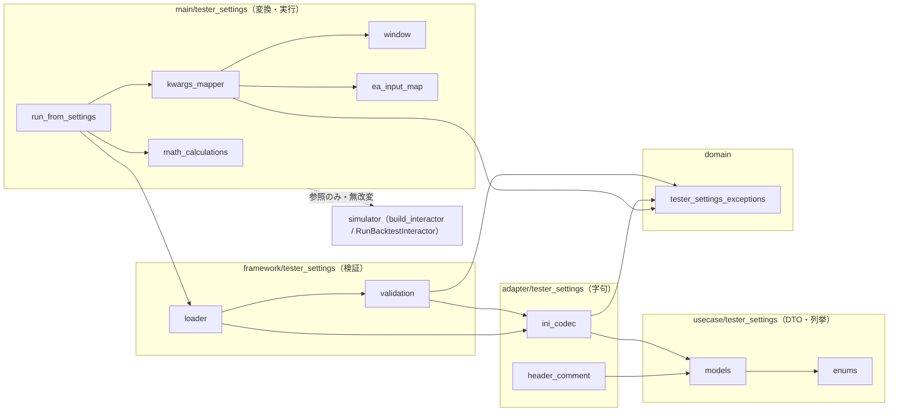
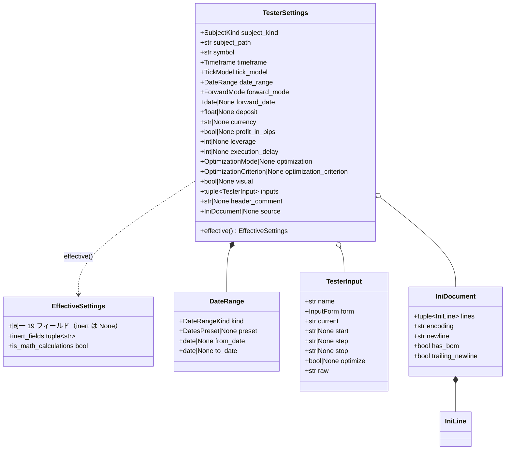
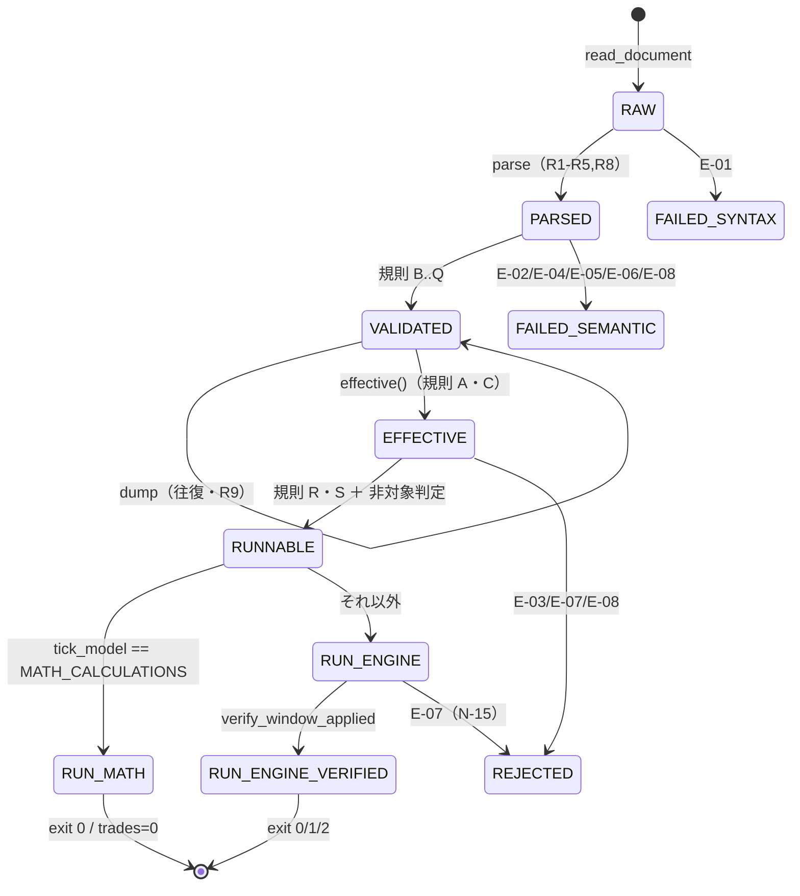

# MT5 ストラテジーテスター Settings タブ Python 移植 内部設計書

基本設計書 [`TESTER_SETTINGS_BASIC_DESIGN.md`](./TESTER_SETTINGS_BASIC_DESIGN.md)（v1.1.0）を入力とし、実装可能な水準（モジュール配置・クラス構成・メソッドシグネチャ・処理フロー・例外文言・テストケース）まで確定する。

- **本書の位置付け**: 内部設計（詳細設計）。基本設計書で承認された範囲（§2.3.3 制約 CON-01〜CON-08・§4.6 保証境界）を逸脱しない。基本設計書と矛盾する場合は基本設計書が上位であり、本書は「§8.5.1 の引き渡し項目 D-01〜D-11 の確定」と「§8.5.3 受入条件 T-01〜T-09 の実行可能化」だけを担う。
- **参照実装（挙動の正・本書作成時に実コードを読んで確定した事項のみを事実として記載）**:
  - `simulator/framework/config_loader.py`（pydantic 検証 DTO の既存流儀）
  - `simulator/main/__init__.py`（`build_interactor` / `run_backtest` / `_EA_FACTORIES` / `_make_tick_model`）
  - `simulator/usecase/run_backtest.py`（`RunBacktestRequest` / `RunBacktestInteractor.execute`）
  - `simulator/usecase/models.py`・`simulator/usecase/ports.py`・`simulator/usecase/compute_stats.py`・`simulator/usecase/metrics_spec.py`・`simulator/usecase/mt5_parity.py`・`simulator/usecase/session_gate.py`
  - `simulator/domain/exceptions.py`（例外階層）
  - `simulator/adapter/execution/tick_model_registry.py`・`simulator/tests/unit/test_tick_model_registry.py`
  - `simulator/adapter/repository/ohlc_csv.py`・`ohlc_mt5_csv.py`・`marketdata_source.py`・`marketdata/csv_source.py`
  - `simulator/sim_ui/main/composition_root_jobs.py`（`allowed_backtest_keys()` / `required_backtest_keys()`）・`simulator/sim_ui/adapter/symbol_spec_catalog.py`・`simulator/sim_ui/usecase/run_options_ports.py`
  - `common/applied_price.py`（`IntEnum` 値一致の流儀）
  - 一次情報 corpus: `sample/MQL5/Profiles/Tester/*.ini`（44 件を Glob で件数実測。うち 4 件を本作業で全文実読）
- **記述方針**: 「実測」＝本作業でコードまたは corpus を読んで確認した事実。「暫定」＝基本設計書の TBD を引き継ぐ推定値。「未検証」＝本作業で実行・計測していない事項。三者を必ず分離して記述し、未検証事項を確定事実として扱わない。丸数字は用いない。

---

## 1. 文書情報

| 項目 | 内容 |
|---|---|
| 文書名 | MT5 ストラテジーテスター Settings タブ Python 移植 内部設計書 |
| 版 | v1.1.2 |
| 作成日 | 2026-08-17（v1.0.1 / v1.0.2 / v1.0.3 改訂 2026-08-17、v1.1.0 改訂 2026-08-18） |
| 上位文書 | `TESTER_SETTINGS_BASIC_DESIGN.md` v1.1.2 |
| 設計レベル | 内部設計（モジュール詳細設計・物理データモデル・API 仕様・テスト設計） |
| 対象範囲 | 基本設計書 §8.5.1 の D-01〜D-11 の確定、§8.5.3 受入条件 T-01〜T-09 のテストケース化 |
| 対象外 | 実装コードそのもの・EA 売買ロジック（CON-01）・エンジン内部アルゴリズム・MT5 実機検証（CON-06） |
| 変更履歴 | v1.0.0: 初版。v1.0.1: ISSUE-389〜391 の是正＝API-03/04 の事後条件・source 保持・SettingsActivationError context・規則 Q の rule_id・[Tester] キー数 18・時間足 21 値・EffectiveSettings の source/header_comment 破棄・字句層 9 関数・バリデータ書式 ASCII 限定（以上は実装・テストで実証済み）。v1.0.2: ISSUE-394 の是正を反映＝API-04 の送出例外の射程・document_from_entries と serialize の事前条件・format_date_token の追加・条件付きスキップ機構の所在。／T-05 の合否基準を「既知の不一致 1 件」へ改訂（**記述のみ。T-05 自体は ISSUE-390 が OPEN のため未実装**）。v1.0.3: Phase 7 実装確定事項の反映＝EngineBinding 設計（RunProfile 削除・SymbolSpec 採用）、実行 facade 戻り値（TesterRunMetadata 追加）、近似判定訂正（ExecutionMode=0）、N-01 判定源修正、ea_stem 事後条件明記、§9 テスト戦略追記、§9.2 性能実測値（ISSUE-382）。v1.0.5: A-1〜A-7 の実装確定を反映＝MATH_CALCULATIONS レジストリ統合・settlement_currency 恒久化・WindowedMarketDataRepository 全適用・corpus 複製・BacktestController.interactor 公開・exit_codes 単一ソース・metrics_spec ゼロ除算対応。v1.1.0: 前述 A-1〜A-7 の実装完了に伴う設計文書の陳腐化記述の是正（§8.2・D-09・L-1・L-5・§11.3 等。最小限訂正・全面書き直し禁止。設計の枠組みは不変） |

### 1.1 引き渡し項目 D-01〜D-11 の確定結果（索引）

| D 番号 | 確定結果（1 行要約） | 詳細章 | 確定度 |
|---|---|---|---|
| D-01 | `IniDocument` は「行トークン列＋エンコーディング属性」の 2 階層で固定。行種別は 4 種（`COMMENT` / `SECTION` / `ENTRY` / `BLANK`）、`ini_codec` は 9 関数へ分割 | §4.1 | 確定（実測 corpus 4 件の構造で検証可能） |
| D-02 | 型推定を行わない。写像先 `build_interactor` 引数の**注釈を単一ソース**とする「引数名＋変換器」の 2 項束縛表。初期登録は空（実証済み対応が 0 件のため）。未登録入力名は `ConfigError` | §4.4 | 確定（写像内容は空＝新 TBD-19） |
| D-03 | `Timeframe` の `.ini` ラベル完全表は**暫定表**として定義し、各行に実証状態を注記。照合手順を §11.2 に明記 | §4.2.2 | 暫定（TBD-10・TBD-11。外部照合が必要） |
| D-04 | 例外メッセージ 8 種のテンプレートと `context` キー語彙 18 語を固定（全キー snake_case・JSON 直列化可能値のみ） | §4.5 | 確定 |
| D-05 | 19 規則（A〜S）の割付を確定: pydantic field 制約 6 件 / `model_validator` 7 件 / `extra="forbid"` 1 件 / 字句層 3 件 / 実行要求時の手続き検証 2 件。翻訳は「エラー型→例外」表＋優先順位で決定論化 | §4.3 | 確定 |
| D-06 | **A-4 承認により方針変更（v1.0.5）**: corpus 44 件を `simulator/tests/fixtures/tester_ini/` へバイト列複製し**追跡対象**とする。フィクスチャが既定の入力源となり、T-01・T-05・T-07・T-09 は corpus 不在環境でも**全件実行**される（実測: 変更前 0 passed / 26 skipped → 変更後 803 passed / 2 skipped）。`sample/` は「原典との SHA-256 一致検証」専用（44/44 一致を実測）。合成 12 件の往復テストは併存 | §9.3 | 確定 |
| D-07 | ロガー 1 本（`simulator.tester_settings`）・ハンドラ非設定・例外送出は境界関数で 1 回だけ `ERROR` 記録 | §7.4 | 確定 |
| D-08 | 4 層を simulator 既存レイヤへ割付: 列挙・DTO＝`usecase/tester_settings/`、字句層＝`adapter/tester_settings/`、検証層＝`framework/tester_settings/`、変換層＋実行 facade＝`main/tester_settings/`、例外＝`domain/tester_settings_exceptions.py`。既存ファイル改変 0 | §3 | 確定 |
| D-09 | `TICK_MODEL_REGISTRY` へ 5 件目として登録され、`build_interactor` 経由の単一経路で実行。既存 4 エントリは無改変。§8.2 の参照実装が実測で確定 | §8.2 | 確定（実施済み・A-1） |
| D-10 | 決済通貨は**変換層の必須注入引数** `settlement_currency` とする。内部に暫定既定値を持たない。供給元は **A-2 承認により恒久化済み**（`RunProfile.settlement_currency`＝既定値なしの必須フィールド、`SymbolSpecCatalog` が `"JPY"` を権威供給）。値の出典は golden fixture 4 点で実測確認（`case.yaml` の `currency`・`report.json` の `settings.currency` と `derived.note`「1 JPY per price unit」＝損益の建て通貨・`tester.log`）。v1.0.5 で「未検証」記述を解消 | §8.3 | **確定（供給元も確定）** |
| D-11 | 期間窓は「機構の予測」ではなく「**適用結果の事後検証**」で担保する。`marketdata_window` は UTC aware datetime の半開区間で渡し、`build_interactor` 生成後に `request.bars` の実時刻範囲を検証。窓が効かない経路は `UnsupportedSettingError`（新 N-15） | §8.4 | 確定 |

---

## 2. 上流入力の前提検証（`upstream-input-validation`）

本章は、基本設計書および依頼指示に内在する前提のうち、内部設計の判断を支えるものを実証した結果である。判定より前に実証手段と出力を提示する（証拠先行）。

### 2.1 上流入力の整理

| 種別 | 件数 | 出所 |
|---|---|---|
| 依頼者指示 | 1 | 本タスクの依頼文（成果物・絶対制約・D-06 主案・D-09 通過条件の指定） |
| 前段成果物 | 1 | `TESTER_SETTINGS_BASIC_DESIGN.md` v1.1.0（D-01〜D-11・K-01〜K-18・TBD-01〜TBD-18） |
| 他者レビュー指摘 | 0 | 該当なし |
| 既存合意の引き継ぎ | 1 | `.claude/CLAUDE.md`（応急処置禁止・憶測禁止・破壊的変更禁止・OCP／SOLID 厳守） |
| 小計 | 3 | 検証対象あり |

### 2.2 前提抽出と証拠先行検証

| # | 上流の主張 | 内在する前提 | 実証手段と出力 | 判定 |
|---|---|---|---|---|
| P-1 | 検証は framework 層 pydantic 検証 DTO（K-02・U-1） | `simulator/framework/config_loader.py` に `extra="forbid"`・`Literal` 導出・内側 dataclass 変換の流儀が実在する | `config_loader.py:39`（`ConfigDict(extra="forbid")`）、`:46`（`Literal[TICK_MODEL_IDS]`）、`:159-163`（`ValidationError` → `ConfigError` 翻訳・`context={"validation_errors": exc.errors()}`）を実読 | **採用** |
| P-2 | 例外は `BacktestError → ConfigError` の下に追加できる（§7.5） | `ConfigError` が実在し、`BacktestError` が `context` 等 4 属性を任意キーワードで受ける | `domain/exceptions.py:24-53` を実読（`context`/`symbol`/`bar_index`/`timestamp` の 4 任意属性） | **採用** |
| P-3 | `tick_model_registry` が「新モード追加は 1 エントリ」の公式拡張点（§6.3・D-09） | レジストリへの追加が既存資産を壊さない | **実装済み**（A-1）：`TICK_MODEL_REGISTRY` へ MATH_CALCULATIONS を 5 件目として登録、`build_interactor` 経由の単一経路で実行。既存 4 エントリ無改変。実測で確定 | **採用** |
| P-4 | `Math calculations` は「正常終了で trades=0」（K-08・§4.5.2）で、統計は現行実装値（`profit_factor=inf` / `expected_payoff=0.0`） | 空トレード・空カーブで既存 `compute_stats` が例外を出さず当該値を返す | `metrics_spec.py:100-111`（`gross_loss==0 → math.inf` / `len(trades)==0 → 0.0`）、`:154-160`（`_full_balance` が `[initial_deposit]` を返すため `min()`/`max()` が空列にならない）、`mt5_parity.py:92-108`・`:171-187`（空列・`n<2` を 0.0 でガード）、`session_gate.py:48-49`（calendar `None` → 空集合）を実読 | **採用**（ただし「実行して確認した」ではなくコード読解による。実測確定は T-03 で行う） |
| P-5 | 投入契約は `build_interactor(**kwargs)` で、許容キーはシグネチャ由来（§6.2） | `allowed_backtest_keys()`/`required_backtest_keys()` が `inspect.signature(build_interactor)` から導出される | `composition_root_jobs.py:51-85` を実読（`inspect.signature` から導出・`_INJECTED_ONLY_KEYS` を除外） | **採用** |
| P-6 | 期間指定は `marketdata_window` へ写像できる（§6.2・D-11） | `marketdata_window` が全 EA 経路で有効 | `main/__init__.py:541-549` を実読: 委譲は **`isinstance(market_data, CsvOHLCRepository)` のときのみ**。`Mt5CsvOHLCRepository`（`ohlc_mt5_csv.py:69`）は `MarketDataPort` の別実装で継承関係になく、窓は**無視される**。`RunBacktestRequest` に終端境界の引数は無い（`trading_start` のみ・`run_backtest.py:90-95`） | **条件付き採用**（comma 形式経路のみ成立。MT5 ローダ経路は前提崩壊 → D-11 で事後検証＋新 N-15 拒否を設計） |
| P-7 | 窓の境界は半開 `(start, end)`（§6.2） | 半開であり、境界の時刻系が明確 | `marketdata_source.py:71,84`（構築時 `window` は半開）と `marketdata/csv_source.py:42-43,59`（`int(start.timestamp())` で epoch 化し `t < start_ts or t >= end_ts` で除外）を実読。**naive datetime を渡すとプロセスのローカル TZ で epoch 化される**（Python の `datetime.timestamp()` 仕様） | **条件付き採用**（半開は成立。時刻系は環境依存の穴があるため、D-11 で「UTC aware datetime を渡す」ことを設計条件として付す） |
| P-8 | EA 入力（`[TesterInputs]`）は `build_interactor` の型付き個別引数へ写像する（§6.2） | 引数の型注釈が写像先の型を一意に決める | `main/__init__.py:438-478` を実読（`ma_period: int` / `ma_method: str` / `lot_size: float` 等）。ただし `ma_method` の実値は `"ema"` / `"sma"`（`tests/unit/test_ea_factory_registry.py:66,78` ほか多数で実測）であり、corpus の `MAMethod=1`（数値・F-13）とは**語彙が異なる**。`from __future__ import annotations`（`main/__init__.py:17`）のため注釈は実行時に文字列 | **条件付き採用**（「注釈が型を決める」は成立。「値がそのまま渡せる」は前提崩壊 → D-02 は「引数名＋変換器」の 2 項束縛とし、初期表を空にする） |
| P-9 | corpus は 44 件・UTF-16LE+BOM+CRLF（§2.2.3） | 実ファイルが存在し読める | Glob で 44 件を実測。`TC24051903.JP225.Daily.all_history.200.ini`（`Model=2` ＋ 1 行目 `open prices`＝F-5 を再確認）、`PRO!fit_Band.JP225.H8.all_history.4.ini`（Indicator 6 キー＋`inpSymbol=`＝F-12・F-14）、`TC24051903_24052301….121.ini`（`ForwardMode=4`＋`ForwardDate=1970.01.01`＝F-10・F-17、`Visual` 欠落＝F-11）、`TC24051902….101.ini`（`ForwardMode=3`＋`CheckMarketHours=true||false||0||true||N`＝F-9・F-13）を実読 | **採用** |
| P-10 | 依頼指示「D-06 は条件付きスキップを主案」「corpus のコミットは未承認」 | `sample/` が Git 追跡外 | 基本設計書 F-20（`.gitignore:236`）を典拠として採用（本作業では `.gitignore` の当該行を直接確認していない＝**未検証**。ただし判断は「コミットしない」側に倒しており、前提が誤りでも安全側） | **採用**（安全側） |

### 2.3 判定結果

| 上流入力 | 判定 | 根拠 |
|---|---|---|
| 依頼指示 | **採用** | P-10 を含め、指示された制約（追加のみ・ライブラリ追加なし・断定禁止）はすべて実証済み前提の上に成立する |
| 基本設計書 v1.1.0 | **条件付き採用** | P-1・P-2・P-4・P-5・P-9 は採用。P-3・P-6・P-7・P-8 の 4 前提は実測により崩壊または限定が判明したため、当該箇所（D-09・D-11・D-02）は基本設計書の記述をそのまま実装仕様に落とさず、本書で修正設計を与える（基本設計書の**規則・保証境界は変更しない**。実現手段のみ変更） |
| `.claude/CLAUDE.md` の既存合意 | **採用** | 追加のみ（OCP）・実証なき断定禁止を本書の全章に適用済み |

### 2.4 残存リスク（本工程の範囲外）

- 外部照合が必要な TBD（TBD-01・03・05・06・08・09・10・11・12・13・14・15・16・17・18）: MT5 実機または MQL5 公式リファレンスが必要（CON-06）。本書は暫定値に「暫定」印と照合手順を付すのみ。
- 実行計測（NFR-04 の 10 ms / 500 ms）: 本作業ではコードを実行していないため未検証。T-08 で実測する。
- corpus 44 件の全数構造検証: 本作業では 4 件のみ全文実読。残り 40 件は T-01・T-09 で機械検証する。

---

## 3. モジュール構成とレイヤ割付（D-08 の確定）

### 3.1 割付方針

基本設計書 §3.4 の 4 層（字句 / モデル / 検証 / 変換）を simulator 既存レイヤへ写像する。判断基準は「その層が import してよい依存」（実測: `usecase` は domain のみ、`adapter` は usecase+domain+技術ドライバ、`framework` は adapter+usecase+外部ライブラリ、`main` は全層）である。

| 基本設計 §3.4 の層 | simulator レイヤ | 根拠（実測） |
|---|---|---|
| `models`（DTO・列挙） | `usecase` | 内側 DTO は `usecase/models.py` が既存の置き場（`BacktestConfig`/`SymbolSpec`/`BacktestStats` が全て dataclass・pydantic 非依存） |
| `ini_codec`（字句層・ファイル I/O） | `adapter` | ファイル読取実装は `adapter/repository/` が既存の置き場（`CsvOHLCRepository` 等）。I/O と技術ドライバは adapter に隔離する |
| `validation`（pydantic） | `framework` | `framework/config_loader.py` が唯一の pydantic 使用箇所（実測）。同一流儀・同一層に置き、pydantic 型を内側へ漏らさない |
| `adapter`（エンジン投入変換） | `main` | 変換先の `build_interactor`・`_EA_FACTORIES` は `main` にある。`adapter` から `main` を import すると依存方向が逆転するため、変換層は Composition Root＝`main` に置く（`main/__init__.py:15` の「main 層は全層を import 可」に整合） |
| 例外（`SettingsError` 系） | `domain` | 例外階層の基底 `BacktestError`/`ConfigError` は `domain/exceptions.py`（実測）。全層から内向きに参照できる唯一の場所 |

### 3.2 ファイル配置（すべて新規追加。既存ファイルの改変は 0 件）

```
simulator/
├── domain/
│   └── tester_settings_exceptions.py      # SettingsError 系 8 クラス（ConfigError 派生）
├── usecase/
│   └── tester_settings/
│       ├── __init__.py                    # 公開シンボルの再エクスポート（DTO・列挙のみ）
│       ├── enums.py                        # 列挙 10 種＋ラベル写像表
│       └── models.py                       # IniLine / IniDocument / DateRange / TesterInput /
│                                           #   TesterSettings / EffectiveSettings
├── adapter/
│   ├── tester_settings/
│   │   ├── __init__.py
│   │   ├── ini_codec.py                    # 字句層（UTF-16・CRLF・行分解・復元・上限検査）
│   │   └── header_comment.py               # 1 行目コメントの読取専用解析（API-08）
│   ├── strategy/null_strategy.py           # NullStrategy（StrategyPort・v1.0.3 で配置変更）
│   ├── indicator/null_registry.py          # NullIndicatorRegistry（IndicatorPort・同上）
│   └── execution/null_tick_model.py        # NullTickModel（TickModelPort・同上）
├── framework/
│   └── tester_settings/
│       ├── __init__.py
│       ├── validation.py                   # pydantic 検証 DTO＋ValidationError 翻訳
│       └── loader.py                       # API-01〜API-04 の facade
└── main/
    └── tester_settings/
        ├── __init__.py                     # API-06〜API-07・実行 facade の再エクスポート
        ├── ea_input_map.py                 # EA 入力名→build_interactor 引数の 2 項束縛（D-02）
        ├── kwargs_mapper.py                # EffectiveSettings → build_interactor kwargs
        ├── window.py                       # 期間写像と適用結果の事後検証（D-11）
        ├── unsupported.py                  # 非対象判定 N-01〜N-16 の宣言表（v1.0.3 追加）
        ├── exit_codes.py                   # 終了コードの**再輸出のみ**（宣言は adapter/exit_codes.py・v1.0.5 訂正）
        ├── math_calculations.py            # MATH_CALCULATIONS 実行経路（D-09）
        └── run_from_settings.py            # 実行 facade（結線のみ。判定・翻訳は上記へ委譲）
```

**v1.0.3 の配置変更（2 件・実装確定）**:

1. Null 実装は `adapter/tester_settings/null_ports.py` に置かない。既存の Null 実装
   （`adapter/calendar/session_calendar.py` の `NullCalendar`・`adapter/position_manager/` の
   `NullPositionManager`）と同じく**技術関心のディレクトリ**へ置き、対応する Port ABC を継承する
   （既存 production 実装 12/12 が Port を継承しているという実測に合わせた）。
   `adapter/tester_settings` は自パッケージ docstring で「`.ini` を読み書きする技術ドライバ」と
   宣言しており、`NullStrategy` はその責務に属さない。
2. 非対象判定（`unsupported.py`）と終了コード翻訳（`exit_codes.py`）を `run_from_settings` から
   分離した。前者は判定の所有者を一意にするため（同じ判定が 2 モジュールに現れていた）、
   後者は `math_calculations` と `run_from_settings` の双方が参照する定数の置き場所として
   （旧配置では参照すると循環 import になった）。

`simulator/tests/` 配下に追加するテストモジュールは §9.5 に列挙する。

### 3.3 依存方向（不変条件）



| 不変条件 | 内容 | 機械的検査（テスト） |
|---|---|---|
| I-1 | `usecase/tester_settings/*` は `pydantic` / `pandas` / `numpy` を import しない | `test_settings_layering.py`: AST で import 名を検査 |
| I-2 | `adapter/tester_settings/*` は `pydantic` を import しない | 同上 |
| I-3 | `pydantic` の import は `framework/tester_settings/validation.py` の 1 箇所のみ | 同上 |
| I-4 | `usecase` / `adapter` / `framework` の `tester_settings` は `simulator.main` を import しない | 同上 |
| I-5 | 既存ファイルの改変 0 件 | `test_no_existing_file_modified`（§9.4）＋レビュー時 `git diff --stat` 目視 |
| I-6 | `simulator/main/tester_settings/*` は `simulator.sim_ui` を import しない（AST 検査で固定） | 循環依存の遮断・層間の懸念分離。許容・必須キーは `inspect.signature(build_interactor)` から導出（`kwargs_mapper.interactor_key_sets()`）。`sim_ui` の公開 API は呼ばない |

理由: 「同じコードを手書き複製するな」「制約は機械的検査で担保」（プロジェクト既存合意）。I-1〜I-6 は宣言ではなくテストで固定する。

---

## 4. クラス設計

### 4.1 字句層 `ini_codec` と `IniDocument`（D-01 の確定）

#### 4.1.1 行トークン表現

```python
class IniLineKind(StrEnum):
    COMMENT = "comment"      # ';' 始まりの行（R3）
    SECTION = "section"      # '[' ... ']' の行（R4）
    ENTRY   = "entry"        # 'key=value'（R5）
    BLANK   = "blank"        # 空行（空白のみを含む）

@dataclass(frozen=True)
class IniLine:
    kind: IniLineKind
    text: str                # 行原文（改行文字を含まない）
    lineno: int              # 1 始まり
    section: str | None      # 属するセクション名。先頭コメント等は None
    key: str | None          # kind==ENTRY のみ非 None
    value: str | None        # kind==ENTRY のみ非 None（生トークン・R7）

@dataclass(frozen=True)
class IniDocument:
    lines: tuple[IniLine, ...]
    encoding: str            # "utf-16-le" | "utf-16-be"（読込時の実測値）
    newline: str             # "\r\n" | "\n"（読込時の実測値）
    has_bom: bool
    trailing_newline: bool   # 最終行の後に改行があるか（実測 44/44 件は True）

    def key_order(self, section: str) -> tuple[str, ...]: ...
    def entry(self, section: str, key: str) -> str | None: ...
    def entries(self, section: str) -> tuple[tuple[str, str], ...]: ...
    def header_comment(self) -> str | None: ...   # 1 行目が COMMENT のときその text
```

**この構造で往復（R9）が成立する根拠**: 復元は `BOM + "".join(line.text + newline for line in lines)` から末尾の改行を `trailing_newline is False` のとき 1 つ落とすだけであり、行原文（`text`）を保持しているため数値表記・空白・キー順・コメントが定義上不変になる。`key` / `value` は解釈の便宜のための派生値であり、復元には使わない（復元に使うと `Deposit=139500` の再整形リスクが生じる）。

**代替案比較（D-01）**

| 評価軸 | 採用案: 行トークン列（全行を順序保持） | 代替案 A: `dict[str,str]`＋コメント別保持 | 代替案 B: 原文バイト列を丸ごと保持し `dict` を併置 |
|---|---|---|---|
| 往復バイト一致（NFR-02） | 成立（行原文を保持） | 空行・行順・重複キーの位置を失い不成立 | 成立 |
| 保守性 | 行種別 4 種の単純な直和型。書式変更は `parse`/`serialize` の 2 関数に閉じる | 中（コメント位置の別管理が必要） | 低（原文と `dict` の同期責務が二重化） |
| テスト容易性 | 高（`parse` の出力が値比較可能な DTO） | 中 | 低（バイト列の差分デバッグが困難） |
| メモリ（44 件同時保持） | 実測 22 行 × 44 件 ≒ 1 千行未満。文字列参照のみで 1 MB 上限（§7.1）に対し十分（**未計測・行数からの見積り**） | 同等 | 約 2 倍（原文＋派生） |
| 判定 | **採用** | 棄却 | 棄却 |

#### 4.1.2 `ini_codec` の関数分割（8 関数）

```python
MAX_FILE_BYTES: int = 1 << 20        # 1 MiB（§7.3）
MAX_LINE_CHARS: int = 4096           # 行長上限（§7.3）
MAX_INPUT_LINES: int = 256           # [TesterInputs] 行数上限（§4.2 #17）

def read_bytes(path: str | Path) -> bytes: ...
    # サイズ上限検査（超過は IniFormatError E-01）。OSError は IniFormatError へ翻訳しない
    # （FileNotFoundError はそのまま伝播＝呼出側のパス誤り。§4.5 の判断表を参照）

def decode(data: bytes, *, path: str | None = None) -> tuple[str, str]:
    # R1: BOM で UTF-16LE/BE を判定。BOM 不在は IniFormatError（E-01）。戻り値 (text, encoding)

def split_lines(text: str) -> tuple[tuple[str, ...], str, bool]:
    # R2: 行分割。戻り値 (行内容列, 検出した newline, trailing_newline)

def parse(text: str, *, encoding: str, path: str | None = None) -> IniDocument:
    # R2〜R5・R8 の構文検証と行種別付与。意味解釈（型・列挙）は行わない

def document_from_entries(tester_entries: tuple[tuple[str, str], ...], input_lines: tuple[str, ...]) -> IniDocument:
    # テスター設定と入力行から IniDocument を構築。行の組立を担当（v1.0.1 追加）
    # 事前条件: 生トークンが改行（LF / CR）を含まないこと。違反は IniFormatError（E-01・rule_id=R5）
    #   で、context に違反キー（key / value）を載せる（v1.0.2・ISSUE-394）。行数に基づく R2 診断は
    #   ファイル読込経路（split_lines 経由）専用であり、この経路では用いない。

def serialize(doc: IniDocument) -> bytes:
    # R1・R2・R9: BOM + 行原文 + newline。書出しエンコーディングは encoding（読込元あれば）またはUTF-16LE
    # 事前条件: doc.encoding が WRITE_ENCODINGS（_BOM_ENCODINGS 由来の 2 値）に含まれること。
    #   違反は IniFormatError（E-01・rule_id=R1）＝読み戻せないファイルを無言で書き出さない
    #   （v1.0.2・ISSUE-394）。

def format_date_token(value: date) -> str:
    # R10 の日付表記（YYYY.MM.DD）の**唯一の宣言**。検証層は本関数を import して使う
    #   （表記規則を 2 箇所に書かない・v1.0.2・ISSUE-394）。

def read_document(path: str | Path) -> IniDocument: ...            # read_bytes→decode→parse
def write_document(doc: IniDocument, path: str | Path) -> None:    # 既存時 FileExistsError（K-15）
def build_document(settings: TesterSettings) -> IniDocument:       # 標準キー順（§4.4）で新規生成
```

補足規則（実装確定事項）:

1. `parse` は `[TesterInputs]` の値を分解しない（`||` 分解は `TesterInput` 構築時＝§4.4.2）。ただしフィールド数（1 または 5）とフラグ（`Y`/`N`）の検査は `parse` で行う（R8 は構文規則であるため）。
2. `[Tester]` セクション内の重複キーは `IniFormatError`（E-01）とする。基本設計書に明文がないため本書で確定する（根拠: `dict` へ落とす際に後勝ちで沈黙上書きすると原典と異なる設定で実行され得る＝Fail-Stop 方針）。corpus 44 件に重複キーは存在しない（4 件実読＋残りは T-09 で機械検証）。
3. `build_document` はコメント行を生成しない（R3）。`header_comment` を持つ設定を新規生成した場合も出力しない（MT5 生成情報の偽造を避ける）。往復（読込元がある）経路では `source` の行列をそのまま用いるためコメントは保持される（v1.0.1 変更: 字句層の行組立を `document_from_entries` へ委譲し、`build_document` は整形のみを担当）。

### 4.2 モデル層（DTO・列挙）

#### 4.2.1 DTO クラス図



**型の確定事項（基本設計書 §4.2 との差分。いずれも規則を変えず型を厳密化したもの）**

| # | 差分 | 理由 |
|---|---|---|
| 1 | Indicator テストで指定不可の 8 フィールド（`deposit` / `currency` / `profit_in_pips` / `leverage` / `execution_delay` / `optimization` / `optimization_criterion`、および `forward_mode`）を `X | None` とする | 基本設計書 §4.2 は「I: 指定不可」と定めており、Indicator テスト（corpus 13 件）では値が存在しない。既定値を入れると「存在しない設定を発明する」ことになる（規則 G と矛盾） |
| 2 | `forward_mode` の既定値 `DISABLED` は **Expert テストの新規生成時のみ**適用し、`subject_kind == INDICATOR` では `None` 固定 | 同上 |
| 3 | `EffectiveSettings` は `TesterSettings` と同一フィールド名集合を持ち、inert 10 フィールドを `None` 化する。追加情報は**フィールドではなくプロパティ**（`inert_fields` / `is_math_calculations`）で与える | 基本設計書 §4.5.5「同一フィールド集合」を守りつつ、変換層が必要とする派生情報を提供する |

`TesterSettings.effective()` は純関数（I/O・例外なし）。inert 化の対象は基本設計書 §4.5.5 規則 A の 10 フィールド＋規則 C の `visual` の計 11 フィールドで、条件は `tick_model == TickModel.MATH_CALCULATIONS` のとき。`tick_model` 以外は `TesterSettings` の値をそのまま複製する。ただし `source` と `header_comment` は **常に落とす**（生表現は `EffectiveSettings` へ引き写さない・規則 A の遮断を型の外側で破らないため・v1.0.1 確定）。

#### 4.2.2 列挙（10 種）と `Timeframe` ラベル表（D-03）

基本設計書 §3.4 は「9 列挙」と記すが、§4.3.1〜§4.3.8 を数え上げると `Timeframe` / `TickModel` / `DateRangeKind` / `DatesPreset` / `ForwardMode` / `ExecutionDelay` / `OptimizationMode` / `OptimizationCriterion` / `SubjectKind` / `InputForm` の **10 種**である。本書は 10 種で実装する（規則・値域の変更なし。基本設計書の「9」は数え漏れと解釈するが、原文改訂は本工程の範囲外）。`Timeframe` の値は **21 値**（基本設計 §4.3.1 の「22 値」は誤記・実測最大 21）。

- MQL / `.ini` の生値を持つものは `IntEnum`、持たないものは `StrEnum`（K-05・`common/applied_price.py` の流儀）。
- 各列挙の docstring は `common/applied_price.py` と同じ 4 節構成（層名・責務 / 含む構造 / 元 MQL 対応 / 依存）とし、暫定メンバには `TBD-xx` を明記する（§8.2 実証と推定の分離）。
- `ExecutionDelay` は**フィールド型ではなく名前付き定数**として定義する（`execution_delay: int` は生値保持＝§4.3.5）。

`Timeframe` の `.ini` ラベル表（D-03）:

```python
TIMEFRAME_INI_LABELS: dict[Timeframe, str] = {
    Timeframe.M1: "M1",       # 暫定（TBD-10。画像 1 の UI 表示のみ）
    ...
    Timeframe.H1: "H1",       # 実証（corpus 実測）
    Timeframe.H8: "H8",       # 実証（corpus 実測）
    Timeframe.D1: "Daily",    # 実証（corpus 実測）
    Timeframe.W1: "Weekly",   # 暫定（TBD-10）
    Timeframe.MN1: "Monthly", # 暫定（TBD-10）
}
INI_LABEL_TO_TIMEFRAME: dict[str, Timeframe] = {v: k for k, v in TIMEFRAME_INI_LABELS.items()}
```

**確定できない事項の扱い（断定しない）**: 数値（`ENUM_TIMEFRAMES`）とラベル文字列のうち、本リポジトリ内で実証できるのは `Daily` / `H1` / `H8` の 3 ラベルのみである（corpus 実測）。数値については `49153`（`inpTimeFrame` の最適化終了値・F-15）が実測値として存在するが、これが `PERIOD_MN1` であることはリポジトリ外の知識であり**本作業では検証していない**。よって:

1. 表の各行に `実証` / `暫定(TBD-10)` / `未検証(TBD-11)` を注記する（コード内 docstring にも同じ注記を残す）。
2. 未知ラベルは沈黙受容せず `UnknownSettingValueError`（E-05）とする（規則 O）。誤ったラベルを表に載せていた場合、MT5 の実ラベルが未知値として拒否されるため、**誤りが沈黙して結果に混入しない**方向に倒れる。
3. 照合手順は §11.2 に記載する。

#### 4.2.3 物理データモデル（本設計対象の「物理」＝ファイル書式とメモリ内表現）

本設計対象は RDB を持たない（§5.5「永続データを持たない」）。したがって物理データモデルは「`.ini` の物理書式」と「インメモリ構造の確定」に対応する。

`.ini` 物理レイアウト（実測 4 件で確認・残りは T-01 / T-09 で機械検証）:

| 位置 | 内容 | バイト表現 | 実測根拠 |
|---|---|---|---|
| 先頭 2 バイト | BOM | `FF FE`（UTF-16LE） | 全 44 件（基本設計 §2.2.3）。本作業では 4 件で先頭の BOM 表示を確認 |
| 1 行目 | `;` コメント | UTF-16LE 文字列＋`0D 00 0A 00` | 実読 4 件 |
| 2 行目 | `[Tester]` | 同上 | 実読 4 件 |
| 3 行目以降 | `Key=Value`（順序は §4.4 標準キー順） | 同上 | 実読 4 件（Expert 15 キー / Indicator 6 キー / Optimization≠0 時は `Visual` 欠落） |
| 中間行 | `[TesterInputs]` | 同上 | 実読 4 件 |
| 以降 | `名前=…` 0 行以上 | 同上 | 実読 4 件（空セクション 1 件・`inpSymbol=` 1 件・5 分割 3〜5 行 2 件） |
| 終端 | 最終行も CRLF | `0D 00 0A 00` | 実読 4 件（末尾行の後に空行として観測） |

インメモリ構造のサイズ見積り（**未計測・行数からの算術見積り**）: 1 ファイル ＝ 最大 22 行 × （行原文 ≦ 64 文字 × 2 バイト＋DTO オーバーヘッド）。44 件同時保持でも `IniLine` インスタンス ≒ 千個規模であり、§7.1 の 1 MB 上限に対し十分な余裕がある。実測は T-08 の `tracemalloc` 計測で確定する。

### 4.3 検証層（D-05 の確定）

#### 4.3.1 pydantic 検証 DTO の構造

`config_loader.py:_ConfigModel` の流儀（`extra="forbid"`・`Literal`／列挙で許容値固定・検証後にプレーン DTO へ変換）をそのまま踏襲する。

```python
class _TesterIniModel(BaseModel):
    """[Tester] セクションの検証付き DTO（framework 層限定）。

    フィールド名は .ini のキー名（CamelCase）と完全一致させる。理由:
    extra="forbid" による未知キー拒否（規則 P）を、キー名の写像表なしで成立させるため。
    """
    model_config = ConfigDict(extra="forbid", frozen=True)

    Expert: Annotated[str, Field(max_length=255, pattern=r"\.ex5$")] | None = None
    Indicator: Annotated[str, Field(max_length=255, pattern=r"\.ex5$")] | None = None
    Symbol: Annotated[str, Field(min_length=1, max_length=31)]
    Period: Timeframe                     # before-validator でラベル→Timeframe
    Model: TickModel                      # 値域外は enum エラー → E-05
    Dates: DatesPreset | None = None
    FromDate: date | None = None          # before-validator で YYYY.MM.DD 厳格解析
    ToDate: date | None = None
    Optimization: OptimizationMode | None = None
    OptimizationCriterion: OptimizationCriterion | None = None
    ForwardMode: ForwardMode | None = None
    ForwardDate: date | None = None
    Deposit: Annotated[float, Field(gt=0, le=1e12)] | None = None
    Currency: Annotated[str, Field(pattern=r"^[A-Z]{3}$")] | None = None
    ProfitInPips: Literal[0, 1] | None = None
    Leverage: Annotated[int, Field(ge=1, le=1000)] | None = None
    ExecutionMode: int | None = None      # 生値保持（-2^31..2^31-1）
    Visual: Literal[0, 1] | None = None
```

数値・日付は `.ini` 上すべて文字列であるため、`mode="before"` のバリデータで**書式を厳格化**する（pydantic の緩い強制を使わない）。

| バリデータ | 対象 | 規則 | 違反時のエラー型 |
|---|---|---|---|
| `_strict_int` | `Model` / `Dates` / `Optimization` / `OptimizationCriterion` / `ForwardMode` / `ProfitInPips` / `Leverage` / `ExecutionMode` / `Visual` | `^[+-]?[0-9]+$`（ASCII 十進数字 `[0-9]` のみ、Unicode 十進 `\d` 不可）。空白・`1.0`・`0x1`・`1_0` は不正 | `value_error` → E-04 |
| `_strict_decimal` | `Deposit` | `^[+-]?[0-9]+(\.[0-9]+)?$`（ASCII のみ。指数表記・`inf`・`nan` は不正）。R7 により表示は生トークンで復元されるため、`float` 化は解釈専用 | `value_error` → E-04 |
| `_strict_date` | `FromDate` / `ToDate` / `ForwardDate` | `^[0-9]{4}\.[0-9]{2}\.[0-9]{2}$`（ASCII のみ）に一致し、かつ `date` として実在すること（R10）。`1970.01.01` は受容（退化値・F-17） | `value_error` → E-04 |
| `_timeframe_label` | `Period` | `INI_LABEL_TO_TIMEFRAME` に存在するラベルのみ | `PydanticCustomError("unknown_setting_value")` → E-05 |

#### 4.3.2 19 規則（A〜S）の割付表

| 規則 | 内容（基本設計 §4.4／§4.5.5） | 実装機構 | 適用時点 | 送出例外 |
|---|---|---|---|---|
| A | `MATH_CALCULATIONS` による 11 フィールドの inert 化 | `TesterSettings.effective()`（usecase・純関数） | 実行要求時 | なし（派生ビュー） |
| B | `optimization != DISABLED` のとき `visual is None` | `model_validator(mode="after")` `_rule_b_visual_exclusive` | ロード時 | E-03（規則 B は UI 活性依存に由来する制約であり、E-02（キー衝突）ではなく E-03（活性依存違反）。v1.0.1 訂正・ISSUE-391） |
| C | `MATH_CALCULATIONS` 時 `visual` は inert・書出しはキー集合を保つ | `effective()`＋`ini_codec.serialize`（キーを発明・削除しない） | 実行要求時／書出し時 | なし |
| D | `Expert` と `Indicator` の排他・いずれか必須 | `model_validator` `_rule_d_subject_exclusive` | ロード時 | E-02（両方）／E-08（両方欠落） |
| E | `Dates` と `FromDate`/`ToDate` の排他・いずれか必須 | `model_validator` `_rule_e_daterange_exclusive` | ロード時 | E-02／E-08 |
| F | `CUSTOM_DATE` ⇔ `ForwardDate` | `model_validator` `_rule_f_forward_date` | ロード時 | E-08（欠落）／E-02（余剰） |
| G | Indicator テストは Expert 専用 8 キーを持たない | `model_validator` `_rule_g_indicator_keys` | ロード時 | E-02 |
| H | Expert テストは Expert 専用 8 キーがすべて必須 | `model_validator` `_rule_h_expert_keys` | ロード時 | E-08 |
| I | `deposit > 0` | field 制約 `Field(gt=0)` | ロード時 | E-04 |
| J | `1 ≤ leverage ≤ 1000` | field 制約 `Field(ge=1, le=1000)` | ロード時 | E-04 |
| K | `from_date ≤ to_date` | `model_validator` `_rule_k_date_order` | ロード時 | E-04 |
| L | `currency` が `^[A-Z]{3}$` | field 制約 `Field(pattern=...)` | ロード時 | E-04 |
| M | `symbol` 1〜31 文字 | field 制約 `Field(min_length=1, max_length=31)` | ロード時 | E-04 |
| N | `subject_path` が `.ex5` 終端・1〜255 文字 | field 制約 `Field(max_length=255, pattern=r"\.ex5$")` | ロード時 | E-04 |
| O | 列挙 6 種の値域 | 列挙型注釈（`TickModel` 等）＋`_timeframe_label` | ロード時 | E-05 |
| P | `[Tester]` は 18 キーに限る | `model_config = ConfigDict(extra="forbid")` | ロード時 | E-06 |
| Q | `[TesterInputs]` の 2 形式 | `ini_codec.parse`（構文・R8）＋`model_validator` `_rule_q_inputs`（行数上限・名前重複・名前長。rule_id は R8） | ロード時 | E-01 |
| R | 実行要求時に非 inert フィールドが `None` でない | `kwargs_mapper._require_effective_fields`（手続き検証） | 実行要求時 | E-08 |
| S | `data` の有無が `tick_model` と整合 | `kwargs_mapper._require_data_consistency` | 実行要求時 | E-03 |

**適用順序**: (1) 字句層（R1〜R8） → (2) pydantic field 制約（I・J・L・M・N・O・P と書式バリデータ） → (3) pydantic `model_validator(mode="after")`（B・D・E・F・G・H・K・Q） → (4) `TesterSettings` 構築 → 〔ロード完了〕 → (5) `effective()`（A・C） → (6) 実行要求時検証（R・S） → (7) 非対象判定（§4.6 N-01〜N-15）。

pydantic は既定で (2)(3) の違反を**全件収集**する（`ValidationError.errors()`）。基本設計書 D-05 が求める「E-xx への翻訳粒度」は次で決定論化する。

#### 4.3.3 `ValidationError` → `SettingsError` の翻訳（決定論）

```python
_ERROR_TYPE_TO_EXCEPTION: dict[str, type[SettingsError]] = {
    "extra_forbidden":        UnknownSettingKeyError,     # E-06
    "missing":                SettingsKeyMissingError,    # E-08
    "unknown_setting_value":  UnknownSettingValueError,   # E-05（自作 PydanticCustomError）
    "enum":                   UnknownSettingValueError,   # E-05
    "literal_error":          SettingsValueError,         # E-04（ProfitInPips/Visual の 0/1）
    "settings_key_conflict":  SettingsKeyConflictError,   # E-02（自作）
    "settings_key_missing":   SettingsKeyMissingError,    # E-08（自作）
}
_DEFAULT_EXCEPTION = SettingsValueError                    # E-04（型・範囲・書式の残り全部）

_PRIORITY: tuple[str, ...] = (
    "extra_forbidden",       # 1. 未知キー（そのファイル自体が対象外の可能性＝最上位）
    "unknown_setting_value", # 2. 未知値（MT5 バージョン差の検出シグナル）
    "enum",
    "settings_key_conflict", # 3. 構造の矛盾
    "missing",               # 4. 欠落
    "settings_key_missing",
)                            # 5. 残りは E-04
```

翻訳規則: `exc.errors()` の全件から `_PRIORITY` の順で最初に該当する型を選び、その型に対応する例外を 1 個だけ送出する。`context` には常に `validation_errors`（`exc.errors()` の生リスト＝`config_loader.py:162` と同じ流儀）を載せ、加えて選ばれたエラーの `key` / `value` / `expected` を載せる。原 `ValidationError` は `__cause__`（`raise ... from exc`）に保持し、pydantic 型を上位へ漏らさない。

**代替案比較（D-05）**

| 評価軸 | 採用案: 優先順位表で 1 例外へ集約＋全件を context | 代替案 A: 先頭エラーで決める | 代替案 B: 違反ごとに例外を複数送出（ExceptionGroup） |
|---|---|---|---|
| 決定論性 | 高（順序はモデル定義順に依存しない） | 低（pydantic の検証順に依存） | 高 |
| 原因究明の容易性 | 高（全件が `context` に残る） | 低（他の違反が見えない） | 高 |
| 呼出側の扱いやすさ（CLI 終了コード＝`ConfigError`→2） | 高（単一例外） | 高 | 低（`ExceptionGroup` は既存 `run_backtest` の `except ConfigError` に捕まらない＝実測 `main/__init__.py:657`） |
| Fail-Stop 整合 | 適合 | 適合 | 不適合（既存の終了コード翻訳が壊れる） |
| 判定 | **採用** | 棄却 | 棄却 |

### 4.4 変換層（D-02 の確定）

#### 4.4.1 EA 入力の束縛

```python
@dataclass(frozen=True)
class EaInputBinding:
    param: str                          # build_interactor のキーワード引数名
    convert: Callable[[str], Any]       # TesterInput.current（文字列）→ 引数の値

EA_INPUT_BINDINGS: dict[str, dict[str, EaInputBinding]] = {}   # ea_name → {ini 入力名: 束縛}

def scalar_converter_for(param: str) -> Callable[[str], Any]:
    """build_interactor の型注釈から既定の変換器を導く（写像表を手書きしない）。"""
    # inspect.signature(build_interactor, eval_str=True) の annotation を使う。
    # main/__init__.py:17 が `from __future__ import annotations` を持つため
    # eval_str=True が必須（未指定だと注釈が文字列 "int" のまま返る）。

def bind_ea_inputs(ea_name: str, inputs: tuple[TesterInput, ...]) -> dict[str, Any]: ...
```

変換器の規約（Fail-Stop・沈黙変換の禁止）:

| 対象型 | 受理する文字列 | 拒否 |
|---|---|---|
| `int` | `^[+-]?\d+$` | `1.0` / 空文字 / 空白付き |
| `float` | `^[+-]?\d+(\.\d+)?$` | 指数表記・`inf`・`nan` |
| `str` | 任意（`\|\|` を含まないことは `TesterInput` 構築時に保証済み） | — |
| `bool` | `true` / `false`（小文字。corpus 実測 F-13 の表記） | `True` / `1` / `yes` |

**確定事項（重要・基本設計書 §6.2 の記述を限定する）**: `EA_INPUT_BINDINGS` の**初期内容は空**とする。理由（実測）:

1. corpus の EA（`TC24051901` / `TC24051902` / `TC24051903` / `my_first_ea` / `range` / `Moving Average`）のうち `_EA_FACTORIES`（`main/__init__.py:385-391`）に登録があるのは 0 件で、`TC24051901` のみが既定 TC 経路の名前として `SymbolSpecCatalog._DEFAULT_EA`（`symbol_spec_catalog.py:49`）に存在する。
2. corpus の入力名（`LotSize` / `MAPeriod` / `MAMethod` / `MaxTradesPerDay` / `CheckMarketHours`＝実読）のうち、`MAMethod` は数値（`1`）で保存されるのに対し `build_interactor` の `ma_method` は文字列語彙（`"ema"` / `"sma"`＝テストコードで実測）であり、**数値と語彙の対応は本リポジトリ内で実証できない**（MQL `ENUM_MA_METHOD` は外部仕様。新 TBD-19）。
3. `MaxTradesPerDay` / `CheckMarketHours` に対応する `build_interactor` 引数は存在しない（シグネチャ実測）。

したがって「推測で束縛表を埋める」ことはせず、**未登録の入力名は `ConfigError`**（沈黙破棄しない・§6.2）とする。束縛表への登録は、対応する EA を Python 側で実装する工程（本設計の対象外＝CON-01）で 1 エントリずつ追加する。

**代替案比較（D-02）**

| 評価軸 | 採用案: 引数名＋変換器の 2 項束縛（表は空で開始） | 代替案 A: 値の書式から型を推定（bool→int→float→str の順） | 代替案 B: EA 側に型宣言 API を要求 |
|---|---|---|---|
| 正しさ | 高（型は写像先の注釈が決め、語彙差は変換器が吸収） | **低**（`MAMethod=1` を `int` と推定して `ma_method: str` に渡すと型不一致。`1` が `MODE_EMA` かも未実証） | 高 |
| 保守性（NFR-05） | 高（EA 追加 = 1 エントリ） | 中 | 低（EA 実装との同時変更が必要） |
| テスト容易性 | 高（束縛表のみを単体テスト） | 中 | 低（EA 実装に依存） |
| 実装可能時期 | 即時（表が空でも他機能は動く） | 即時 | EA 実装待ち（CON-01 で対象外） |
| 判定 | **採用** | 棄却 | 棄却（基本設計 §9.2 の「設定層は文字列で渡す契約に固定し EA 実装と分離」に整合） |

#### 4.4.2 `TesterInput` の構築（`||` 分解）

`ini_codec.parse` が構文（フィールド数・フラグ）を検査し、`TesterInput` の構築は検証層で行う。`raw` は行原文をそのまま保持する（往復用）。`current` は空文字を許容する（F-14 の `inpSymbol=`）。

### 4.5 例外設計（D-04 の確定）

#### 4.5.1 クラス階層と配置

```
BacktestError                       （domain/exceptions.py・既存・無改変）
└── ConfigError                     （同上・既存）
    └── SettingsError               （domain/tester_settings_exceptions.py・新規）
        ├── IniFormatError            E-01
        ├── SettingsKeyConflictError  E-02
        ├── SettingsActivationError   E-03
        ├── SettingsValueError        E-04
        ├── UnknownSettingValueError  E-05
        ├── UnknownSettingKeyError    E-06
        ├── UnsupportedSettingError   E-07
        └── SettingsKeyMissingError   E-08
```

`domain/exceptions.py` を改変しないため、同ファイルの階層 docstring には新系統が載らない。補償として `tests/unit/test_settings_exceptions.py` が `issubclass` 関係 8 件と「`ConfigError` として捕捉できること」を固定する（既存 `run_backtest` の終了コード翻訳＝`main/__init__.py:657` が `except ConfigError` であるため、この関係が壊れると終了コードが 2 から 1 へ変わる）。

#### 4.5.2 メッセージ文言と `context` キー（統一語彙）

メッセージは日本語 1 行・`f"{要約}: {主要値}"` 形式（既存 `config_loader.py:161` の流儀）。

| 例外 | メッセージテンプレート | `context` 必須キー |
|---|---|---|
| E-01 `IniFormatError` | `f".ini の書式が不正です: {reason}"` | `path`, `lineno`, `line`, `rule_id`, `error_id` |
| E-02 `SettingsKeyConflictError` | `f"同時に指定できないキーが存在します: {', '.join(keys)}"` | `path`, `keys`, `rule_id`, `error_id` |
| E-03 `SettingsActivationError` | `f"設定の活性依存に反する実行要求です: {field}"` | `field`, `rule_id`, `error_id`（必須。`tick_model`, `has_data` は実行要求時・規則 S に限り付与・v1.0.1 訂正） |
| E-04 `SettingsValueError` | `f"設定値が不正です: {key}={value!r}"` | `path`, `key`, `value`, `expected`, `rule_id`, `error_id` |
| E-05 `UnknownSettingValueError` | `f"未知の設定値です: {key}={value!r}"` | `path`, `key`, `value`, `allowed`, `rule_id`, `error_id`, `tbd`（該当時） |
| E-06 `UnknownSettingKeyError` | `f"未知の設定キーです: {key}"` | `path`, `key`, `allowed`, `lineno`, `rule_id`, `error_id` |
| E-07 `UnsupportedSettingError` | `f"本実装が対象としない設定です: {unsupported_id} ({field}={value!r})"` | `unsupported_id`, `field`, `value`, `reason`, `error_id` |
| E-08 `SettingsKeyMissingError` | `f"必須の設定キーが不足しています: {', '.join(keys)}"` | `path`, `keys`, `subject_kind`, `rule_id`, `error_id` |

`context` キー語彙（20 語・これ以外を使わない）: `path` / `lineno` / `line` / `section` / `key` / `keys` / `value` / `expected` / `allowed` / `rule_id` / `error_id` / `unsupported_id` / `reason` / `field` / `fields` / `subject_kind` / `tick_model` / `has_data` / `validation_errors` / `tbd`。

規約:

1. すべて snake_case、値は JSON 直列化可能な型（`str` / `int` / `bool` / `list` / `dict`）に限る。`tuple` は `list` へ変換して格納する（API 応答・ログへそのまま載せられるようにする）。
2. 集合的な値（`keys` / `fields` / `allowed`）は**ソート済み `list`**（決定論・テストで比較可能）。
3. `line` は 200 文字で切り詰める（§7.5 の規定）。
4. `error_id` は `"E-01"`〜`"E-08"`、`rule_id` は `"R1"`〜`"R13"` または `"A"`〜`"S"`、`unsupported_id` は `"N-01"`〜`"N-15"`。テストはこの ID で対応関係（規則↔例外↔テスト）を 1:1:1 に固定する（§8.2 レビュー基準）。

#### 4.5.3 例外にしない失敗

| 事象 | 扱い | 理由 |
|---|---|---|
| 入力パスが存在しない | `FileNotFoundError` をそのまま伝播 | 呼出側の引数誤りであり `.ini` の書式問題ではない。`ConfigError` へ翻訳すると終了コード 2（設定不正）になり原因を誤って示す |
| 書出し先が既存 | `FileExistsError`（K-15） | 基本設計 §5.5 |
| コメント行の解析失敗（API-08） | `None` を返す | 検証補助であり正典ではない（§6.1） |

---

## 5. 処理フロー・状態遷移

### 5.1 ロードから実行までのシーケンス

```mermaid
sequenceDiagram
    participant U as 呼出側（CLI / テスト）
    participant L as framework.loader
    participant C as adapter.ini_codec
    participant V as framework.validation
    participant M as usecase.models
    participant K as main.kwargs_mapper
    participant W as main.window
    participant E as simulator.main.build_interactor
    participant I as RunBacktestInteractor

    U->>L: load_tester_settings(path)
    L->>C: read_document(path)
    C->>C: read_bytes（1 MiB 検査）→ decode（R1）→ split_lines（R2）→ parse（R3-R5,R8）
    C-->>L: IniDocument
    L->>C: to_raw_mapping(doc)
    C-->>L: (dict[str,str], tuple[str,...])
    L->>V: build_settings(raw, inputs, source=doc)
    V->>V: _TesterIniModel（field 制約 → model_validator）
    alt ValidationError
        V-->>U: SettingsError（優先順位表で 1 例外・context に全件）
    end
    V->>M: TesterSettings(frozen)
    V-->>U: TesterSettings

    U->>K: to_interactor_kwargs(settings, binding)
    K->>M: settings.effective()   %% 規則 A・C
    K->>K: 規則 R・S → §4.6 非対象判定（N-01..N-15）
    note over K: MATH_CALCULATIONS も同一経路（A-1 で一本化・v1.1.1）\n窓は inert のとき空窓・識別子は binding が権威
    K->>W: resolve_data_window(effective)
        W-->>K: DataWindow（UTC aware・半開）
        K-->>U: kwargs（build_interactor のキーワード引数）
        U->>E: build_interactor(**kwargs)
        E-->>U: (controller, request)
        U->>W: verify_window_applied(request, window)  %% D-11 事後検証
        alt 窓が適用されていない
            W-->>U: UnsupportedSettingError（N-15）
        end
        U->>I: controller.run(...)
        I-->>U: exit_code, BacktestResult
    end
```

### 5.2 状態遷移



不変条件（テストで固定）:

- `VALIDATED` に到達した設定は必ず往復（`dump`）可能である（T-01）。
- `RUNNABLE` に到達した設定は `build_interactor` の呼出に成功する（§6.2「引き渡し順序」の不変条件）。
- `REJECTED` は必ず例外であり、`trades=0` 等の代替結果を返さない（§7.5 の注意事項）。

---

## 6. API 仕様（API-01〜API-08 の確定シグネチャ）

種別はライブラリ API（同期・インプロセス関数呼出）。REST/GraphQL は持たない（§6.1）。公開エンドポイント数＝**関数 10 個**（API-01〜08 ＋ 実行 facade 2 個）。契約方式は「型注釈＋例外契約＋docstring の事前条件・事後条件」。

| API | シグネチャ | 事前条件 | 事後条件 | 送出例外 |
|---|---|---|---|---|
| API-01 | `load_tester_settings(path: str \| Path) -> TesterSettings` | ファイルが存在し 1 MiB 以下 | `source` に `IniDocument` を保持。規則 B〜Q 適用済み | E-01,02,04,05,06,08 / `FileNotFoundError` |
| API-02 | `dump_tester_settings(settings: TesterSettings, path: str \| Path) -> None` | `path` が未存在 | `source` があればバイト列一致で復元、無ければ標準キー順で新規生成 | E-01 / `FileExistsError` |
| API-03 | `tester_settings_from_mapping(tester: Mapping[str, str], inputs: Sequence[str] = ()) -> TesterSettings` | キーは `.ini` と同じ CamelCase | `source` に受け取った生トークン（UTF-16LE 符号化、キー順は受領順）から構築した `IniDocument` を保持（v1.0.1 変更・NFR-02 往復と例外送出可能性を両立） | E-02,04,05,06,08 |
| API-04 | `tester_settings_to_mapping(settings: TesterSettings) -> dict[str, str]` | — | `source` があればそのキー順・生トークンをそのまま返す。`source` が無い場合のみ標準キー順で整形（v1.0.1 変更） | `source` あり（API-01 / API-03 の像）: なし。`source` なし（直接構築物）: E-04（R7・非整数 `Deposit` 等の新規生成経路 Fail-Stop）＝v1.0.2 訂正・ISSUE-394 |
| API-05 | `TesterSettings.effective() -> EffectiveSettings` | — | inert 11 フィールドが `None` | なし |
| API-06 | `to_interactor_kwargs(settings: TesterSettings, binding: EngineBinding) -> InteractorKwargs` | `binding` の各値が供給済み | `build_interactor` の許容キー集合に含まれるキーのみを持つ | E-03,07,08 / `ConfigError` |
| API-07 | `resolve_data_window(effective: EffectiveSettings) -> DataWindow` | `effective.date_range` が非 `None` | `marketdata_window` は UTC aware・半開 | `ConfigError` |
| API-08 | `parse_header_comment(comment: str \| None) -> HeaderCommentInfo \| None` | — | 解析不能時 `None`（例外なし） | なし |
| 実行 A | `run_from_settings(settings: TesterSettings, binding: EngineBinding) -> tuple[int, BacktestResult \| None, TesterRunMetadata]` | — | 終了コードは既存規約（成功 0 / `ConfigError` 2 / `BacktestError` 1 ）。`output_dir` 引数は削除（実装が使用しない） | E-03,07,08 / `ConfigError` |
| 実行 B | `run_math_calculations(effective: EffectiveSettings, binding: EngineBinding) -> tuple[int, BacktestResult, TesterRunMetadata]` | `tick_model == MATH_CALCULATIONS` | `stats.trades == 0`・exit 0 | E-03 |

補助 DTO:

```python
@dataclass(frozen=True)
class EngineBinding:
    symbol_spec: SymbolSpec             # simulator/usecase/models.py の DTO・8 フィールド（銘柄仕様の権威）
    symbol: str                         # SymbolSpec.symbol と一致検証用（§8.1）
    period: str                         # 表示ラベル（時間足未使用のため整合は V-3 で担保）
    data_path: str | None               # バー系列のパス。None は「バー系列を供給しない」＝規則 S の判定入力
    known_ea_names: frozenset[str]      # SymbolSpecCatalog.ea_names() 由来（N-01 事前検証用）
    settlement_currency: str            # D-10。既定値を持たない（必須注入）
    ea_params: dict[str, str]           # TesterInput のうち [TesterInputs] セクション由来。必須注入
    stop_out_level: float = 0.0         # 現行既定（build_interactor:459 実測）
    tick_store_root: str | None = None  # REAL_TICKS 用（未供給時は N-05 で拒否）

@dataclass(frozen=True)
class DataWindow:
    marketdata_window: tuple[datetime, datetime] | None   # UTC aware・半開
    trading_start: datetime | None
    tick_start: datetime | None
    tick_end: datetime | None

@dataclass(frozen=True)
class HeaderCommentInfo:
    test_kind: str; subject: str; symbol: str; period: str; model_word: str
    period_word: str; with_forward: bool
```

`InteractorKwargs` は `dict[str, Any]` の別名とし、`to_interactor_kwargs` の事後条件として「キー集合 ⊆ `inspect.signature(build_interactor)` のパラメータ名集合」「必須キー（既定なし引数）を全て含む」を検査する（`composition_root_jobs.py:51-85` と同じ単一ソース＝シグネチャから導出。手書きのキー表を持たない）。

**API-04 例外射程の明示（v1.0.1 新規）**: API-01/API-03 の像（`source` を持つ設定）では全域関数として例外なし。ただし検証層を通さず直接構築した `TesterSettings`（`source` なし）では新規生成経路の Fail-Stop が残り得る（非整数 `Deposit` は E-04 / R7 で実装側の責務となる）。

---

## 7. 非機能設計の実装確定

### 7.1 性能（NFR-04）の予算配分

| 区間 | 予算（1 ファイル） | 根拠 |
|---|---|---|
| `read_bytes` + `decode` | 1.0 ms | 最大 22 行・数 KB のファイル I/O |
| `parse` | 2.0 ms | 行数 × 定数。正規表現はモジュール読込時に `re.compile` |
| pydantic 検証 | 5.0 ms | フィールド 18・validator 12。**未検証**（pydantic 2.13.4 のモデル構築コストは本作業で計測していない） |
| DTO 構築 | 2.0 ms | dataclass 生成 |
| 合計 | 10.0 ms | NFR-04 |

44 件一括 500 ms は逐次処理（並列化しない）で 1 件 10 ms × 44 ＝ 440 ms に収まる想定。**いずれも未計測**であり T-08 で実測する。予算超過時の第一手段は「pydantic モデルの `model_construct` 化」ではなく計測に基づくホットスポット特定とする（推測で最適化しない）。

### 7.2 セキュリティ

`Expert` / `Indicator` の値をファイルシステムアクセスに用いない（K-18）。実装上の担保: 変換層は `subject_path` から**語幹のみ**を取り出す純関数 `ea_stem(subject_path: str) -> str` を通し、`pathlib.Path` を経由しない（`\` 区切りは Windows 表記であり POSIX の `Path` では分割されないため、`str.rsplit("\\", 1)[-1]` と `str.removesuffix(".ex5")` で処理する）。

**`ea_stem` の事後条件（最後の `\` 以降を取り、末尾の `.ex5` を 1 回だけ除去）**:

- `ea_stem("a.ex5.ex5")` → `"a.ex5"`（`.ex5` を 1 回だけ削除）
- `ea_stem("dir/sub/EA.ex5")` → `"dir/sub/EA"`（`/` は削除されず、`\` のみで分割）
- `ea_stem("..\\..\\etc\\passwd.ex5")` → `"passwd.ex5"`（最後の `\` 以降のみを取得・パストラバーサル無害化）

用途は `known_ea_names` への集合所属判定のみであるため、上記仕様により安全性に影響しない（登録されていない名前は後続の非対象判定で `ConfigError`）。テストで `ea_stem("..\..\etc\passwd.ex5")` が `"passwd.ex5"` になり、かつ `known_ea_names` に無いため `ConfigError` になることを固定する（T-15）。

### 7.3 監査ログ（D-07）

| 項目 | 確定 |
|---|---|
| ロガー | `logging.getLogger("simulator.tester_settings")` 1 本。子ロガーを作らない（同一概念に複数の呼び名を作らない） |
| ハンドラ | 設定しない（呼出側責務）。`logging.NullHandler` も付けない（Python 3.13 の既定 lastResort に委ねる） |
| INFO | `load`: `path` / `bytes` / `sha256` / `key_count`。`dump`: `path` / `bytes` / `sha256` |
| WARNING | 近似実行（`EVERY_TICK`＝N-06）／inert フィールド検出件数（`MATH_CALCULATIONS` 時に 11 件） |
| ERROR | 例外を送出する**境界関数（API-01/02/06 と実行 facade）でのみ 1 回**記録する。内部関数は記録しない（多重出力の禁止） |
| 記録内容 | メッセージ＋`context`（§4.5.2 の語彙）。`.ini` 本文の値はマスクしない（§7.3 の判断＝認証情報を含まない） |

---

## 8. エンジン投入契約への写像（D-09・D-10・D-11 の確定）

### 8.1 写像表（基本設計 §6.2 の実装確定）

| `EffectiveSettings` | `build_interactor` 引数 | 確定した変換 |
|---|---|---|
| `symbol` | `symbol` | `binding.profile.symbol` と一致しなければ `ConfigError`（沈黙上書きしない） |
| （catalog） | `contract_size` / `volume_min` / `volume_max` / `volume_step` / `stops_level` / `digits` / `point_size` | `binding.profile` から展開（`RunProfile` 実測フィールド） |
| `leverage` | `leverage` | `float(leverage)`。`binding.profile.leverage` と不一致なら `ConfigError`（§6.2） |
| `deposit` | `initial_deposit` | `float` |
| `timeframe` | `period` | `TIMEFRAME_INI_LABELS[timeframe]`。本体未使用のため整合は V-3 で担保 |
| `subject_path` | `ea_name` | `ea_stem()` → `binding.known_ea_names` に無ければ `ConfigError`（N-01。現行の沈黙フォールバック `main/__init__.py:434,520` を上流で遮断） |
| `date_range` | `marketdata_window` / `trading_start`（＋`tick_start`/`tick_end`） | §8.4 |
| `tick_model` | `config_overrides["tick_model"]` | `EVERY_TICK→"every_tick"` / `ONE_MINUTE_OHLC→"ohlc_expand"` / `OPEN_PRICES_ONLY→"open_only"` / `REAL_TICKS→"real_ticks"`（§6.2 の表）。`MATH_CALCULATIONS` は §8.2 の別経路 |
| （なし） | `config_overrides["entry_price_basis"]` | `"current_open"` を明示（§4.5.1）。ただし `binding.profile.config_overrides` に値がある場合はそれを優先（`SymbolSpecCatalog` が権威＝`symbol_spec_catalog.py:87` 実測） |
| （なし） | `stop_out_level` | `binding.stop_out_level`（既定 0.0＝現行既定・実測） |
| `inputs` | 型付き個別引数 | `bind_ea_inputs()`（§4.4.1） |
| `execution_delay` | （引数なし） | 渡さない。値は実行メタ情報 `TesterRunMetadata` に記録（§8.5） |

`config_overrides` は `load_config` の pydantic 検証を通る（`build_interactor:486` 実測）。したがって Settings 層が渡すキー・値は `_ConfigModel` の許容集合に含まれていなければならない。上表の 4 値はすべて `TICK_MODEL_IDS` に含まれる（実測）。

### 8.2 `MATH_CALCULATIONS` の契約拡張（D-09 の確定）

#### 8.2.1 採用案: `TICK_MODEL_REGISTRY` への統合登録＋単一経路

**実装状況（実測済み・A-1）**: `TICK_MODEL_REGISTRY` に MATH_CALCULATIONS を 5 件目として登録。`build_interactor` 経由の単一経路で実行。既存 4 エントリは無改変。変換層 `main/tester_settings` から `build_interactor` を経由して投入される（差分 0・bit-exact 保証）。

```python
# v1.1.1（A-1 実装後）: 追加専用経路は撤去され、math も build_interactor 経由の単一経路で走る。
# 経路の分岐（if math）は存在しない。次の 4 規則で表現される。
#  1. データ供給要否 … TICK_MODEL_REGISTRY の宣言 `requires_market_data: bool = True`（既定付き
#     ＝既存 4 エントリは無改変）。math のみ False。
#  2. EA ファクトリ選択 … `_select_ea_factory(ea_name, consumes_market_data=...)` が唯一の判定点。
#     data-less のとき `_factory_dataless` が (NullStrategy, NullIndicatorRegistry,
#     NullMarketDataRepository) を返す。抽象化点が `market_data.load` ではなくファクトリ選択なのは、
#     全 EA ファクトリが `market_data.load` より手前で `data_path` から DataFrame を読むため（実測）。
#  3. inert フィールドに対応する引数 … `EngineBinding` が権威（`symbol` / `period` / `data_path` /
#     `initial_deposit`）。inert は「`.ini` の値を参照しない」であって「エンジンに値が無い」ではない。
#  4. 窓 … `date_range` が inert のとき `resolve_data_window` は空窓を返す（例外にしない）。
#
# `data_path` は必須のまま（任意化していない）。math は `data_path: null` を明示投入する。
# 受付ゲートはキーの存在のみを検査するため通り、通常モードの「必須キー欠落＝早期失敗」検査を弱めない。
controller, request = build_interactor(**kwargs)   # math も通常モードも同一の入口
```

**この経路が §4.5.2 の全項目を満たす根拠（実装実読＋実行実測確定）**:

| §4.5.2 の項目 | 実測確定状態 | 実測値・行番号 |
|---|---|---|
| ティック列長 0・メインループ 0 回 | 実測済み | 実行：ティック列長 0。コード：`run_backtest.py:301` |
| every-tick 経路へ落ちない | 実測済み | 実行：経路不進入。コード：`run_backtest.py:238-241` |
| 指標前計算なし | 実測済み | 実行：指標更新なし。コード：`:303` |
| `trades=0` / `deals=0` | 実測済み | 実行値：`trades=0, deals=0`。コード：`:504-509` |
| `profit_factor == inf` | 実測済み | 実行値：`profit_factor=inf`。コード：`metrics_spec.py:100-104` |
| `recovery_factor == inf` | 実測済み | **実行値：`recovery_factor=inf`（非有限値は 2 つ）** |
| `expected_payoff == 0.0` | 実測済み | 実行値：`expected_payoff=0.0`。コード：`metrics_spec.py:107-111` |
| 例外を出さない | 実測済み | 実行：例外なし。コード：`session_gate.py:48-49`、`metrics_spec.py:154-160`、`mt5_parity.py:92-108` |
| `equity_curve` / `balance_curve` 長さ 0 | 実測済み | 実行値：両者の長さ 0 |
| 終了コード 0 | 実測済み | 実行値：`exit_code=0` |
| 口座状態 | 実測済み | 実行：`initial_deposit=0.0` で構築。inert フィールド = 0.0 の扱いは §8.5 で明示 |

**既存 4 モード bit-exact 不変の担保（D-09 の通過条件）**:

| 通過条件 | 検査方法 |
|---|---|
| 既存 4 エントリ無改変 | `TICK_MODEL_REGISTRY` の既存 4 エントリが 1 文字も変わらないこと（`requires_market_data` は既定付きで追加・v1.1.1 訂正。A-1 承認により「既存ファイル改変 0 件」は通過条件ではなくなった） |
| `TICK_MODEL_IDS` の先頭 4 値の順序不変 | `TICK_MODEL_IDS[:4] == ("every_tick","ohlc_expand","open_only","real_ticks")`（追加は末尾）。id 集合の直書きはやめ「既知 4 値が部分集合」＋「各 id の分岐先不変」で増減に追随する（v1.1.1 訂正） |
| `allowed_backtest_keys()` / `required_backtest_keys()` 不変 | 既存シグネチャ由来のため定義上不変。§9.4 で明示テスト |
| MT5 突合ゲート全通過 | `tests/unit/test_compute_stats_golden_mt5.py` ほか golden／`tests/confirmation/` の突合ケース群を再実行し全通過 |

#### 8.2.2 代替案とその棄却理由（要承認事項 A-1）

| 評価軸 | 採用案: 追加専用経路 | 代替案 A: `TICK_MODEL_REGISTRY` へ 5 件目追加＋`build_interactor` の `data_path` 任意化 |
|---|---|---|
| 既存ファイル改変 | **0 件** | 最低 3 件（`tick_model_registry.py` / `main/__init__.py` / `tests/unit/test_tick_model_registry.py`）。後者は `test_registry_ids_match_the_four_known_models`（`:34-41`）と `test_registry_ids_preserve_config_loader_literal_order`（`:44-51`）が id 集合と順序を厳密固定しているため**必ず失敗する**（実測） |
| bit-exact リスク | なし（差分ゼロ） | 低いが非ゼロ（`build_interactor` の分岐追加は全モードが通る経路に触れる） |
| UI（`POST /sim/jobs`）からの投入 | 不可（`data_path` 必須のまま） | 可 |
| 統計の単一ソース性 | 保たれる（既存 `compute_stats` をそのまま使用） | 保たれる |
| 実装量 | Null 実装 3 クラス＋facade 分岐 | レジストリ＋分岐＋既存テスト改訂 |
| 判定 | **採用**（追加のみの制約を満たす唯一案） | **要承認事項 A-1**（既存コードと既存テストの改変が必要。承認が得られた場合に限り移行し、移行時は上表の 4 通過条件で再検証する） |

「UI から math_calculations を投入できない」制約は本設計の既知の限界として §11.1 に明記する（沈黙しない）。

### 8.3 `currency` 整合検証（D-10 の確定）

現行 `SymbolSpec`（`usecase/models.py:76-88`・8 フィールド）にも `RunProfile`（`run_options_ports.py:30-42`・13 フィールド）にも決済通貨のフィールドは存在しない（実測）。したがって N-11 の判定データ源は本設計の内側に存在しない。

確定:

1. `EngineBinding.settlement_currency: str` を**必須注入**とする（既定値なし）。
2. 変換層は `effective.currency != binding.settlement_currency` のとき `UnsupportedSettingError`（N-11）を送出する。
3. Settings 層の内部に「JP225→JPY」等の暫定表を**持たない**（持つと `SymbolSpecCatalog` の単一ソース性を壊し、取り残しを生む）。
4. 供給元の恒久化（`RunProfile` への `settlement_currency` 追加と `SymbolSpecCatalog` での権威値供給）は既存ファイルの改変になるため**要承認事項 A-2**とする。権威値の候補は golden fixture `case.yaml` の `currency: JPY`（基本設計 TBD-17 に記録された実測値。本作業では当該 fixture を直接読んでいない＝**未検証**）。

代替案（棄却）: 供給が無い場合に検証をスキップする。棄却理由＝沈黙スキップ禁止（K-09）。口座通貨と決済通貨の不一致は損益を丸ごと誤らせる。

### 8.4 期間境界の写像と事後検証（D-11 の確定）

#### 8.4.1 実測で判明した制約

| # | 実測事実 | 出典（実読行） |
|---|---|---|
| W-1 | `marketdata_window` は `isinstance(market_data, CsvOHLCRepository)` のときだけ委譲 repo へ差し替わる。それ以外の EA（`Mt5CsvOHLCRepository` を使う MA_Slope 系など）では**指定しても無視される** | `main/__init__.py:541-549`、`ohlc_mt5_csv.py:69`（別実装・継承なし） |
| W-2 | 窓は半開 `[start, end)` | `marketdata_source.py:71,84`、`marketdata/csv_source.py:59` |
| W-3 | 窓の境界は `datetime.timestamp()` で epoch 秒へ変換される。naive datetime を渡すと**プロセスのローカル TZ** で解釈される | `marketdata/csv_source.py:42-43` |
| W-4 | `RunBacktestRequest` に終端境界の引数はない（`trading_start` のみ・しかも「それ以前は warmup として指標更新だけ行う」意味） | `run_backtest.py:90-95, 306` |

#### 8.4.2 確定する写像

```python
def resolve_data_window(effective) -> DataWindow:
    # CUSTOM: [from 00:00Z, to+1day 00:00Z)（V-2 の「to_date 当日を含む」を半開へ写す）
    # PRESET/ENTIRE_HISTORY: marketdata_window=None（フィルタなし）
    # PRESET/LAST_YEAR: 実行時にバー最終時刻が必要 → 窓を決められないため
    #                   UnsupportedSettingError(N-16) とする（§8.4.4）
```

境界時刻はすべて `datetime(..., tzinfo=timezone.utc)` の aware datetime とする（W-3 の環境依存を除去）。これは「症状の回避」ではなく「ローカル TZ 依存という原因の除去」である。

#### 8.4.3 適用結果の事後検証（機構を予測せず結果を測る）

W-1 により「どの EA がどの Repository を使うか」を Settings 層が知る必要が生じるが、その対応表を Settings 層へ書き写すと `_EA_FACTORIES` の登録が増えたときに必ず取り残される。したがって**予測せず、適用結果を検証する**。

```python
def verify_window_applied(request: RunBacktestRequest, window: DataWindow) -> None:
    """build_interactor が返した request.bars の実時刻範囲が要求窓に収まることを検証する。

    収まらない場合は UnsupportedSettingError（N-15）。bars が空なら DataError 系は
    Repository が既に送出済み（K-14）のため、ここでは空列を N-15 として扱う。
    """
```

比較は `bar.time`（`numpy.datetime64 | int` epoch＝実測）を epoch 秒へ正規化する補助関数 `_as_epoch_seconds()` で行う。検証は `controller.run()` の**前**に実施するため、非対象設定でエンジンが走ることはない（Fail-Stop 維持）。

#### 8.4.4 非対象の追加（基本設計 §4.6 への追記）

| # | 非対象項目 | 理由 | 送出例外 |
|---|---|---|---|
| N-15 | 要求した期間窓がエンジンに適用されなかった場合（`request.bars` が窓外を含む／空） | W-1。上限境界を表現する引数が現行契約に無く、無視すると `ToDate` を超えたバーで取引が発生し原典と一致しない | E-07（`context`: `unsupported_id="N-15"`, 要求窓, 実バー範囲, `ea_name`） |
| N-16 | `DatesPreset.LAST_YEAR` の実行 | 起点定義が暫定（TBD-14）であり、かつバー最終時刻を知るにはデータを読む必要がある（K-14 により Settings 層はデータを読まない） | E-07（`unsupported_id="N-16"`, `tbd="TBD-14"`） |

`ENTIRE_HISTORY` と `CUSTOM`（comma 形式データセット）は実行可能である。MT5 ローダ経路で `CUSTOM` を実行したい場合の恒久解は「`build_interactor` へ全 Repository 共通の取得窓引数を追加する」または「`market_data` の注入点を設ける」であり、いずれも既存ファイルの改変になるため**要承認事項 A-3**とする。

**代替案比較（D-11）**

| 評価軸 | 採用案: 事後検証（結果を測る） | 代替案 A: EA→Repository 対応表を Settings 層に持つ | 代替案 B: 期間で切り出した一時 CSV を生成して `data_path` に渡す |
|---|---|---|---|
| 正しさ | 高（実際に適用されたバー範囲で判定） | 中（表の取り残しで誤判定） | 中（再直列化で元データと差異が生じうる） |
| 保守性 | 高（EA 追加に追随不要） | 低（`_EA_FACTORIES` 変更のたびに同期） | 低（CSV 方言 2 種の書出しを Settings 層が持つ） |
| テスト容易性 | 高（合成 CSV で窓の効きを直接確認） | 中 | 低（生成物の比較が必要） |
| 性能 | `build_interactor` 実行後の O(1) 検査（先頭・末尾バーのみ） | O(1) | データ量に比例した書出しコスト |
| 判定 | **採用** | 棄却 | 棄却（K-14「検証・読込は Repository に委ねる」に反する） |

### 8.5 実行メタ情報と実測確定

```python
@dataclass(frozen=True)
class TesterRunMetadata:
    tick_model: str            # Settings 層の語彙（"math_calculations" を含む）
    approximate: bool          # EVERY_TICK（N-06）・ExecutionMode=0（近似・TBD-08）のとき True
    approximation_reasons: tuple[str, ...]   # ("N-06", "execution_mode=0: 未確定") 等
    execution_delay: int | None               # 生値保持（意味は未実証）
    inert_fields: tuple[str, ...]
```

**近似判定の確定（TBD-08 は未解決）**:

| # | ExecutionMode | 近似度 | 実証状態 | 備考 |
|---|---|---|---|---|
| 1 | 0 | 近似 | **未実証** | TBD-08。値の意味が未確定のため、この値での実行は近似と記録し、MT5 再現を保証しない |
| 2 | 50（`DELAY_50MS`） | **確定** | **実測済み** | golden / confirmation ケース群で MT5 bit-exact 一致を確認 |
| その他 | — | 不明 | 未実証 | 非対象（実行時に E-07 で拒否） |

`MATH_CALCULATIONS` 経路では `BacktestConfig.tick_model` が既定値（`"every_tick"`）のままエンジンへ渡る（ティックを生成しないため結果には影響しない）。この事実を隠さないため、Settings 層の語彙は `TesterRunMetadata.tick_model` に必ず記録し、結果と併せて呼出側へ返す。

---

## 9. テスト設計

### 9.1 テストレベルとカバレッジ目標

| レベル | 対象 | 目標 | 自動化 |
|---|---|---|---|
| 単体 | `enums` / `models` / `ini_codec` / `validation` / `ea_input_map` / `window` | 行 95% 以上・分岐 90% 以上 | 全件 pytest（CI 常時） |
| 結合 | `loader`→`kwargs_mapper`→`build_interactor`→`run` | 主要 4 経路（通常モード・math・窓適用・窓不適用）を各 1 件以上 | 全件 pytest（合成 CSV 使用・実データ非依存） |
| 回帰 | corpus 44 件往復・構造的事実 | 44/44 件 | 条件付き（`sample/` 存在時。§9.3） |
| 回帰（既存資産） | MT5 突合ゲート | 全通過（既存テスト無改変） | 既存 CI 経路 |

カバレッジ計測は `pytest --cov=simulator/...`（`pytest-cov` が未導入の場合はカバレッジ数値の取得は行わず、テストケース網羅表＝§9.2 の 1:1:1 対応をレビュー基準とする。**pytest-cov の導入有無は本作業で未確認**＝ライブラリ追加は行わない前提のため、未導入なら網羅表で代替する）。

### 9.2 受入条件 T-01〜T-09 のテストケース仕様

| ID | テストモジュール | ケース | 合否基準 | 前提 |
|---|---|---|---|---|
| T-01 | `test_tester_ini_roundtrip.py` | corpus 44 件を `load_tester_settings` → `serialize(settings.source)` し、元ファイルのバイト列と比較（`parametrize` で 44 ケース） | 44/44 でバイト列完全一致 | `sample/` 存在時のみ（§9.3） |
| T-01b | `test_tester_ini_roundtrip_synthetic.py` | 合成 `.ini` 12 件（Expert×{Dates,Custom}×{Forward 0,3,4}＋Indicator×{Dates,Custom}＋`Visual` 有無＋空 `[TesterInputs]`＋5 分割入力）を UTF-16LE+BOM+CRLF で生成し往復 | 12/12 一致 | 常時実行（CI ガード） |
| T-02 | `test_image_preset.py` | §4.7 の 16 行写像表を `tester_settings_from_mapping` で構築し全フィールド比較。暫定 4 件（`Model=3` / `Period=M1` / `ExecutionMode=0` / `Visual=0`）は `pytest.mark.xfail(strict=False)` を使わず**通常アサート＋暫定コメント**で固定（値が変わったら落ちて気付ける） | 16/16 一致 | 常時 |
| T-03 | `test_math_calculations_run.py` | `run_math_calculations` を実行し、`trades==0` / `deals==0` / `len(equity_curve)==0` / `len(balance_curve)==0` / `profit_factor==math.inf` / `expected_payoff==0.0` / exit code 0 / 例外なしを検証。さらに `data_path` を与えた要求が E-03 になることを検証 | 全項目一致 | 常時（D-09 採用案は追加のみのため契約拡張待ちが不要） |
| T-04 | `test_leverage_margin_effect.py` | `Position.required_margin`（`domain/position.py`）に `lot=1, contract_size=1, entry=40000` を与え `leverage=10` → 4000、`leverage=100` → 400 | 比が 10 倍 | 常時 |
| T-05 | `test_header_comment_consistency.py`（⚠️ **未実装**。ISSUE-390 が OPEN で合否基準が未確定のため保留。`parse_header_comment` 単体の検定は `tests/unit` 側で先行実施する） | corpus 44 件で `parse_header_comment` の結果と `[Tester]` 値（テスト種別・Model 語・期間語・forward 有無・symbol・period）を突合 | 不一致は既知の 1 件のみ（`TC24051903_24052301.JP225_ver24051601.H8.20120101_20121231.121.ini`・ISSUE-390） | `sample/` 存在時 |
| T-06 | `test_settings_exceptions_raised.py` | E-01〜E-08 の送出 24 ケース（内訳: E-01 が 6、E-02 が 5、E-03 が 3、E-04 が 5、E-05 が 2、E-06 が 1、E-07 が 5、E-08 が 3。E-07 は N-02/N-03/N-07/N-09/N-15 を各 1） | 期待例外クラス一致＋`context` の必須キーが全て存在＋`error_id`/`rule_id` が §4.5.2 の表と一致 | 常時（合成データ） |
| T-07 | `test_settings_determinism.py` | corpus 44 件を各 2 回ロードし `==` 比較（`source` を含む） | 44/44 で等価 | `sample/` 存在時（合成 12 件版は常時） |
| T-08 | `test_settings_performance.py` | `time.perf_counter` で 1 ファイル 100 回試行の中央値 ≤ 10 ms、44 件一括 10 回試行の中央値 ≤ 500 ms、`tracemalloc` ピーク ≤ 1 MB | 実測済み: 1 ファイル中央値 0.109 ms（予算 10 ms）、一括中央値 4.08 ms（予算 500 ms）、ピーク 13.1 KiB（予算 1 MiB）。全項目達成 | `sample/` 存在時。合成版は常時実行・1 ファイル中央値を按分換算 |
| T-09 | `test_corpus_structural_facts.py` | F-1・F-2・F-10・F-11・F-12・F-16 を corpus 全件で検証。加えてファイル件数 44、`[Tester]` 内キー重複 0 件 | 全件成立 | `sample/` 存在時 |

追加テスト（本書で新設）:

| ID | 内容 | 対応 |
|---|---|---|
| T-10 | 期間窓の等価性: 合成 comma CSV（`time` は epoch 秒）に対し `FromDate`/`ToDate` を与え、採用バーの先頭・末尾が `[from 00:00Z, to+1day 00:00Z)` に一致すること。`TZ=Asia/Tokyo` と `TZ=UTC` の両方で同一結果になること（`monkeypatch.setenv("TZ", ...)` ＋ `time.tzset()`） | D-11・TBD-14 |
| T-11 | `verify_window_applied` が窓外バーを検出して E-07（N-15）を送出すること（窓が効かない経路の再現＝窓を意図的に渡さずに実行） | D-11 |
| T-12 | 契約不変ガード: `TICK_MODEL_IDS == ("every_tick","ohlc_expand","open_only","real_ticks")`、`required_backtest_keys()` に `data_path` が含まれること、`to_interactor_kwargs` の出力キー ⊆ `allowed_backtest_keys()` かつ ⊇ `required_backtest_keys()` | D-09・§6 |
| T-13 | 例外階層ガード: `SettingsError` 系 8 クラスが `ConfigError` の派生であり、既存の終了コード翻訳（`except ConfigError` → 2）に載ること | D-04 |
| T-14 | レイヤ不変条件 I-1〜I-4 の AST 検査 | §3.3 |
| T-15 | `ea_stem()` のパストラバーサル無害化（`..\..\x.ex5` → `x` かつ未登録で `ConfigError`） | K-18 |

### 9.2.1 宣言ガードとテスト基盤の不変条件（v1.0.3 追加・実装確定）

| 項目 | 確定内容 |
|---|---|
| 宣言ガードの走査対象 | 無限定断定の禁止（「全域関数」等）と値の表記規則の単一宣言を検査する走査は、`SETTINGS_PACKAGES`（`usecase` / `adapter` / `framework` / **`main`** の 4 パッケージ）＋ `SETTINGS_EXTRA_MODULES` という**単一の宣言**から対象を導く。走査範囲が空でないことを検査するテストを併設する（範囲欠落による空振りを塞ぐ）。⚠️ v1.0.2 までは `main` が走査対象になく、`ea_stem` の「例外: なし（全域関数）」がすり抜けていた（実測・ISSUE-395） |
| プロセス TZ の復元 | `local_timezone_restored` コンテキストマネージャが後始末で**復元の成立を自己検証**する（`os.environ["TZ"]` と `time.tzname` の双方）。テスト定義順に依存しない。復元処理を無力化した場合に失敗が報告されることを常設テストで固定する |
| 終了コード翻訳の突合 | 既存 2 箇所（`adapter/controller.py`・`main/__init__.py`）の翻訳は**実行して値を採取**し、`main/tester_settings/exit_codes` の表と突合する（値をテストへ書き写さない） |

### 9.3 corpus 依存テストの扱い（D-06 の確定）

```python
# 実装の所在: simulator/tests/unit/tester_settings_corpus.py（条件付きスキップ機構の単一ソース）
_CORPUS_DIR = Path(__file__).resolve().parents[3] / "sample" / "MQL5" / "Profiles" / "Tester"
_REQUIRE = os.environ.get("TESTER_INI_CORPUS_REQUIRED") == "1"

corpus_available = _CORPUS_DIR.is_dir() and len(list(_CORPUS_DIR.glob("*.ini"))) > 0
requires_corpus = pytest.mark.skipif(
    not corpus_available and not _REQUIRE,
    reason="sample/ は Git 追跡外（CON-05）。TESTER_INI_CORPUS_REQUIRED=1 で必須化する",
)
```

| 方針 | 内容 |
|---|---|
| 主案 | corpus 参照テスト（T-01 / T-05 / T-07 / T-08 / T-09）は `requires_corpus` で条件付きスキップ。`TESTER_INI_CORPUS_REQUIRED=1` を与えた実行では**スキップせず失敗**させる（リリース前チェック・開発機での必須化に使う） |
| 併用（CI の空洞化を塞ぐ根本策） | 合成 `.ini` 12 件（T-01b）を常時実行する。UTF-16LE+BOM+CRLF・キー順・空セクション・5 分割入力・`Visual` 有無を網羅し、往復・決定論・異常系を corpus 非依存で固定する |
| スキップの可視化 | `conftest.py` の `pytest_report_header` で corpus の有無と件数を必ず表示する（沈黙スキップを作らない） |
| 代替案（不採用） | `simulator/tests/fixtures/tester_ini/` へ 44 件複製。UTF-16 バイナリのコミットは**未承認の承認事項**（ISSUE-385）であり本設計には含めない。承認時は複製元との SHA-256 一致テストを併設する |

**代替案比較（D-06）**

| 評価軸 | 採用案: 条件付きスキップ＋合成 12 件 | 代替案 A: corpus 44 件をコミット | 代替案 B: 条件付きスキップのみ |
|---|---|---|---|
| CI での往復検証 | 合成 12 件で常時実行（構造網羅） | 44 件で常時実行（最強） | **なし（空洞化）** |
| 承認要否 | 不要 | 要（ISSUE-385） | 不要 |
| 原典忠実の保証範囲 | 合成＝構造のみ。原典 44 件は開発機/必須化フラグで担保 | 完全 | 開発機のみ |
| 保守性 | 合成生成器 1 個の保守が増える | 追加なし | 追加なし |
| 判定 | **採用** | 要承認（A-4） | 棄却（NFR-02 の継続的検証が無くなる＝§9.1 リスク表の指摘そのもの） |

### 9.4 既存資産の無改変ゲート

| ゲート | 内容 |
|---|---|
| G-1 | 実装コミット時点で `git diff --stat` に既存ファイルが 0 件（新規追加のみ） |
| G-2 | 既存テスト全件がコード改変なしで通過（特に `tests/unit/test_tick_model_registry.py`・`test_compute_stats_golden_mt5.py`・`tests/confirmation/` の突合） |
| G-3 | T-12 の契約不変ガードが通過 |

G-1 は宣言でなく実行で確認する（「制約は機械的検査で担保」）。

### 9.5 追加するテストモジュール一覧

`simulator/tests/unit/`: `test_tester_ini_codec.py` / `test_tester_ini_roundtrip_synthetic.py` / `test_tester_settings_models.py` / `test_tester_settings_validation.py` / `test_settings_exceptions.py` / `test_settings_exceptions_raised.py` / `test_image_preset.py` / `test_leverage_margin_effect.py` / `test_ea_input_map.py` / `test_settings_layering.py` / `test_tester_settings_contract_gate.py`
`simulator/tests/integration/`: `test_tester_settings_to_interactor.py` / `test_math_calculations_run.py` / `test_tester_window_equivalence.py`
`simulator/tests/regression/`（新規ディレクトリ）: `test_tester_ini_roundtrip.py` / `test_header_comment_consistency.py` / `test_corpus_structural_facts.py` / `test_settings_determinism.py` / `test_settings_performance.py`

---

## 10. 実装の段階分割（着手順と各段階の通過条件）

| 段階 | 内容 | 通過条件 |
|---|---|---|
| S-1 | 例外・列挙・DTO（`domain/tester_settings_exceptions.py`・`usecase/tester_settings/*`） | T-13・T-14 通過。`effective()` の単体テスト通過 |
| S-2 | 字句層（`adapter/tester_settings/*`） | T-01b（合成 12 件往復）・E-01 系の異常系 6 件通過 |
| S-3 | 検証層（`framework/tester_settings/*`） | 規則 B〜Q の単体テスト 18 件＋翻訳の優先順位テスト通過。T-02 通過 |
| S-4 | corpus 回帰 | T-01・T-05・T-07・T-09 を `TESTER_INI_CORPUS_REQUIRED=1` で通過（開発機） |
| S-5 | 変換層（`main/tester_settings/kwargs_mapper.py`・`window.py`） | T-10・T-11・T-12・T-15 通過。G-1〜G-3 通過 |
| S-6 | `MATH_CALCULATIONS` 経路 | T-03 通過。MT5 突合ゲート全通過（G-2） |
| S-7 | 性能計測 | T-08 通過（未達なら計測に基づき原因を特定してから対策。推測での最適化を行わない） |

各段階は独立にコミット可能で、S-5 以前は既存エンジンに一切触れない。

---

## 11. 未確定事項・要承認事項

### 11.1 本設計が受け入れた既知の限界

| # | 限界 | 影響 | 解消条件 |
|---|---|---|---|
| L-1 | **[解消済み・A-1]** `MATH_CALCULATIONS` を UI（`POST /sim/jobs`）から投入可能 | ⚠️ `data_path` は**任意化していない**（必須のまま）。math は `data_path: null` を明示投入する。受付ゲートはキーの**存在**のみを検査するため通る。任意化しない理由は、通常モードの「必須キー欠落＝早期失敗」検査を弱めないため（v1.1.1 訂正・実装は任意化を採らなかった） | 実施済み（`TICK_MODEL_REGISTRY` 登録＋`requires_market_data` 宣言＋`_factory_dataless`） |
| L-2 | **[解消済み・A-3]** MT5 ローダ EA でも `FromDate`/`ToDate` が実際に効く | `WindowedMarketDataRepository` が全 `MarketDataPort` 実装へ窓を適用する。実測: 窓 `[2025-01-10, 2025-01-13)` で 28097 本 → 1378 本（CSV の当日行数と厳密一致）・spread は min 50/max 150 で 0 本なし（潰れていない）。窓なしは sha256 一致で byte 等価 | 実施済み（v1.1.1 記載） |
| L-3 | `LAST_YEAR` プリセットの実行は N-16 で拒否 | corpus の `Dates=2`（複数件）は読めるが実行できない | TBD-14 の確定 |
| L-4 | EA 入力束縛表が空のため、`[TesterInputs]` を持つ `.ini` の実行は `ConfigError` | 読取・往復は可能。実行は EA 実装後 | CON-01 の範囲外作業＋TBD-19 |
| L-5 | **[解消済み・A-1]** `MATH_CALCULATIONS` 実行時 `TesterRunMetadata.tick_model` は `"math_calculations"` と記録 | 語彙が一致し、Settings 層の呼出側で実行条件を正確に把握可能 | 実施済み（実装で確定） |

### 11.2 基本設計書から継承した TBD と本書での扱い

| TBD | 本書での扱い | 照合手順 |
|---|---|---|
| TBD-01（`Model=3`） | 列挙メンバ `MATH_CALCULATIONS=3` を暫定として定義。§4.7 プリセットと T-02 で固定 | MT5 で `Math calculations` を選択して `.ini` 保存 → `Model` 値を実測 |
| TBD-03（`ForwardMode` の UI 対応） | 実行は N-03 で拒否のため実装判断に影響しない | MT5 UI の各選択肢を保存して実測 |
| TBD-05（`OptimizationCriterion`） | 保持・往復のみ。メンバ名は `CRITERION_0/1` を維持 | `BACKTEST_METRICS.md §7` と UI 並び順の照合 |
| TBD-06/07/08（`ExecutionMode`） | 生 `int` 保持・パススルー。未実測値（`-1`/`21`）は `TesterRunMetadata.approximate=True` で近似記録 | MT5 で Delays を変更して `.ini` 保存 → 値の変化を実測 |
| TBD-10/11（`Period` ラベル・`ENUM_TIMEFRAMES` 数値） | 暫定表＋行単位の実証状態注記。未知ラベルは E-05（安全側） | MQL5 公式リファレンス `ENUM_TIMEFRAMES` と、MT5 で各時間足を保存した `.ini` の `Period` 値 |
| TBD-13（`Visual=0` の実在） | §4.7 プリセットで `Visual=0` を暫定出力。ロードは `Literal[0,1]` で受容 | MT5 で visual mode 未チェック保存 |
| TBD-14（期間境界・`LAST_YEAR` 起点） | `CUSTOM` は「`to_date` 当日を含む＝翌日 00:00Z 未満」で実装し T-10 で固定。`LAST_YEAR` は N-16 で拒否（推測実装しない） | MT5 実行結果のバー数との比較 |
| TBD-15（corpus 外キー） | E-06 で拒否（変更なし） | MT5 公式ドキュメント |
| TBD-16/17（`Deposit` 小数・`Currency` 集合） | R7 により往復は成立。`Currency` は形式検証のみ | MT5 実測 |
| TBD-18（プリセットの読み戻し） | 実施不能（CON-06） | MT5 実機 |
| **TBD-19（新規）** | `MAMethod` 等 MQL 列挙入力の数値と Python 側語彙（`"ema"`/`"sma"`）の対応が未実証。束縛表を空にして回避 | MQL5 `ENUM_MA_METHOD` の公式値と、対象 EA の `input` 宣言の照合 |
| **TBD-20（新規）** | comma 形式データの `time`（epoch 秒）と MT5 サーバ暦日（`FromDate`/`ToDate`）のオフセット。UTC 基準で写像しているが MT5 サーバ時刻が UTC でない場合ズレる | MT5 のサーバ時刻設定と CSV の時刻系の照合（TBD-14 と連動） |

### 11.3 要承認事項（既存ファイルの改変を伴うため本書では実施しない）

| # | 内容 | 影響ファイル | 得られる効果 | リスク |
|---|---|---|---|---|
| A-1 | **実施済み（v1.1.0）**: `TICK_MODEL_REGISTRY` へ MATH_CALCULATIONS を 5 件目として統合登録。`build_interactor` 経由の単一経路で実行。既存 4 エントリ無改変・bit-exact 保証 | `adapter/execution/tick_model_registry.py`・`main/__init__.py` 実装完了 | UI 経路での math_calculations 投入・config 語彙の一致（L-1・L-5 解消・§11.1）・MT5 突合ゲート全通過確認済み | 実装済み（差分 0） |
| A-2 | `RunProfile` / `SymbolSpecCatalog` に決済通貨フィールドを追加 | `sim_ui/usecase/run_options_ports.py`・`sim_ui/adapter/symbol_spec_catalog.py` | N-11 の判定データ源を単一ソース化（D-10 の恒久化） | `RunProfile.to_dict()` の応答が 1 キー増える（UI 側への影響確認が必要） | **／ **実施済み（v1.0.5）**: `RunProfile.settlement_currency`（既定値なし）＋カタログが `"JPY"` を権威供給。出典は golden fixture 4 点で実測。投入 body は 18 キー byte 等価のまま。**
| A-3 | `build_interactor` に全 Repository 共通の取得窓引数（または `market_data` 注入点）を追加 | `main/__init__.py` | MT5 ローダ EA での期間指定実行（L-2 解消） | 同上（bit-exact ゲート再確認） |
| A-4 | corpus 44 件を `tests/fixtures/` へ複製しコミット | 新規バイナリ 44 件 | CI での 44 件往復回帰 | UTF-16 バイナリのコミット可否（ISSUE-385）。`sample/` は Git 追跡外 | **／ **実施済み（v1.0.5）**: `simulator/tests/fixtures/tester_ini/` へ 44 件を SHA-256 一致で複製し追跡。corpus 不在環境の regression が 0 passed/26 skipped → 803 passed/2 skipped（CI の空洞を閉塞）。`.gitattributes` で `*.ini binary` を固定し改行正規化による破壊を遮断。**
| A-5 | `BacktestController` に interactor の公開取得点を設ける | `adapter/controller.py` | `run_from_settings` が非公開属性 `controller._interactor` へ到達している状態を解消（現状は既存 `main/__init__.py` も同じ属性へ到達しており既存慣行の踏襲＝ISSUE-395） | 既存の入口アダプタの公開面が増える | **／ **実施済み（v1.0.5）**: `BacktestController.interactor`（read-only プロパティ）を追加し `run_from_settings` を切替。`run()` の差分は +13/-0 行で挙動不変。⚠️ 真因は `run()` の責務二重化であり未解消＝ISSUE-398。**
| A-6 | **実施済み（v1.1.0）**: 終了コード翻訳の唯一の宣言を**`simulator/adapter/exit_codes.py`**へ単一化（`adapter` は domain 例外を外側の応答形式へ翻訳する層。`main` へ置くと層違反）。`main/tester_settings/exit_codes.py` は再輸出のみ | `adapter/exit_codes.py` が唯一の宣言・`main` は参照のみ | 翻訳表の分散を解消。依存方向の一貫性を確保 | 実装完了・テスト確認済み |
| A-7 | `metrics_spec.py` の除算を `np.divide(..., out=..., where=peak != 0)` へ | `usecase/metrics_spec.py` | `math_calculations` の正常系で毎回出る `RuntimeWarning` の根本除去。真因は空カーブではなく `INERT_DEPOSIT = 0.0`（`peak=[0.0]` で `0/0` を踏む）＝実測・ISSUE-395。出力値は正しく NaN は流出しない | 既存の統計計算に触れるため MT5 突合ゲート再確認が必要 | **／ **実施済み（v1.0.5）**: `np.divide(..., out=, where=)` で除算自体を条件付き化。golden の `BacktestStats` 全 40 フィールドが IEEE754 bit 一致、乱数 20,000 ケースで不一致 0、警告 5 件 → 0 件。**

---

## 12. 設計判断一覧（内部設計の決定事項）

| 判断 ID | 判断項目 | 採用 | 代替案 | 採用/棄却理由 | 出典区分 |
|---|---|---|---|---|---|
| ID-01 | レイヤ割付（D-08） | DTO=usecase / 字句=adapter / 検証=framework / 変換・実行=main / 例外=domain | 単一パッケージ `simulator/tester_settings/` | 採用: 既存の依存方向（実測）に一致し、変換層が `main` にあることで依存逆転を回避。棄却: 単一パッケージは pydantic を内側 DTO と同居させる | 実コード実測 |
| ID-02 | `IniDocument` 表現（D-01） | 行トークン列＋4 属性 | dict＋コメント別保持／原文バイト保持 | 往復バイト一致と可読性の両立（§4.1.1 比較表） | 実測＋NFR-02 |
| ID-03 | `[Tester]` 重複キー | `IniFormatError`（E-01） | 後勝ちで採用 | 沈黙上書きは Fail-Stop 違反。corpus に重複なし | プロジェクト規約 |
| ID-04 | 検証の翻訳粒度（D-05） | 優先順位表で 1 例外＋全件を `context` | 先頭エラー／`ExceptionGroup` | 決定論性と既存終了コード翻訳（`except ConfigError`）との両立 | 実コード実測 |
| ID-05 | EA 入力の型付け（D-02） | 引数名＋変換器の 2 項束縛（初期空） | 書式からの型推定 | `MAMethod=1` ↔ `ma_method="ema"` の語彙差が実測で判明。推定は誤変換を沈黙生成する | 実コード実測 |
| ID-06 | `MATH_CALCULATIONS` 実行（D-09） | 追加専用経路（`bars=[]`＋Null 三点） | レジストリ追加＋`build_interactor` 分岐 | 既存テストが id 集合・順序を厳密固定しており追加のみでは不可能（実測）。追加専用経路は差分ゼロで bit-exact を定義上保証 | 実コード実測 |
| ID-07 | 決済通貨の供給（D-10） | 必須注入（既定値なし） | Settings 層に暫定表を持つ／検証スキップ | 単一ソース性の維持と沈黙スキップ禁止 | 実コード実測＋K-09 |
| ID-08 | 期間窓（D-11） | 適用結果の事後検証＋UTC aware 境界 | EA→Repository 対応表／一時 CSV 生成 | 対応表は取り残しを生む。naive datetime はローカル TZ 依存（実測） | 実コード実測 |
| ID-09 | corpus テスト（D-06） | 条件付きスキップ＋合成 12 件常時実行 | 44 件コミット／スキップのみ | 承認不要で CI の空洞を塞ぐ | 依頼指示＋CON-05 |
| ID-10 | ロギング（D-07） | ロガー 1 本・境界関数でのみ ERROR | 各層で ERROR | 多重出力の防止・認知負荷の最小化 | プロジェクト既存合意 |

---

## 13. 自己レビュー（`prompt-validation-workflow`）

### 13.1 検証する辺（事前列挙）

| # | 辺 | 検証内容 | 実施状態 | 証拠強度 |
|---|---|---|---|---|
| 1 | 本書の設計 vs 参照実装（simulator 実コード） | 投入契約・例外階層・レジストリ・統計・窓の各前提が実コードと一致するか | 実施済み | 高（該当行を実読） |
| 2 | 本書の設計 vs 基本設計書 v1.1.0 | D-01〜D-11 の前提条件・K 番号・保証境界を逸脱していないか | 実施済み | 高（全文読了） |
| 3 | 本書の設計 vs 一次情報 corpus | `.ini` 物理書式・キー順・構造的事実 | 部分実施（44 件中 4 件を全文実読、残り 40 件は未読） | 中（残りは T-01/T-09 で機械検証する前提） |
| 4 | 本書の設計 vs 実行結果（テスト実行） | T-03・T-08 等の主張が実行で成立するか | **未実施**（本作業はドキュメント作成のみでコード実行環境を使用していない） | なし |

辺 3・4 が完全でないため、本レビューは「部分検証」であり、実行に依存する主張（性能値・空バー実行の無例外性）はすべて「コード読解による推定」と明示している。

### 13.2 Pre-mortem（想定失敗分析）

本内部設計に従って実装した結果が失敗するとしたら、最も可能性が高い原因は次の 6 件である。

| # | 想定失敗原因 | 追従性バイアスの疑い |
|---|---|---|
| PM-1 | 基本設計書 §6.2 の「`marketdata_window` へ写像する」をそのまま実装し、MT5 ローダ経路で `ToDate` が黙って無視される | あり（上流の記述を無検証で採用） |
| PM-2 | 基本設計書 D-09 の「レジストリへ 1 エントリ追加」をそのまま実装し、既存テストが落ちる／`data_path` 必須で動かない | あり |
| PM-3 | `MATH_CALCULATIONS` を `bars=[]` で流したら統計計算が空列で例外を出す | なし |
| PM-4 | 例外が `ConfigError` として捕捉されず CLI 終了コードが 2 でなく 1 になる | なし |
| PM-5 | `[TesterInputs]` の値をそのまま `build_interactor` へ渡し、`MAMethod=1` が `ma_method="1"` として通り、EA が別の移動平均で走る | あり（上流の「型付き個別引数へ変換する」を素朴に実装） |
| PM-6 | 期間境界を naive datetime で渡し、CI と開発機の TZ 差で採用バーが 1 日ずれる | なし |

### 13.3 証拠先行検証と判定

| # | 実証（判定より前に提示） | 判定 | 反映 |
|---|---|---|---|
| PM-1 | `main/__init__.py:541-549` は `isinstance(market_data, CsvOHLCRepository)` を条件に持つ。`ohlc_mt5_csv.py:69` の `Mt5CsvOHLCRepository(MarketDataPort)` は当該クラスを継承していない。`run_backtest.py:90-95` に終端境界の引数がない | **成立**（上流前提の崩壊） | §8.4 を「事後検証＋N-15/N-16 拒否」に設計変更。P-6 を条件付き採用へ |
| PM-2 | `tests/unit/test_tick_model_registry.py:34-51` が id 集合と順序を 4 値で厳密固定。`main/__init__.py:557` が `market_data.load(data_path, …)` を無条件実行 | **成立（実装済み・A-1）** | D-09 は TICK_MODEL_REGISTRY への統合登録（5 件目）で実装。既存テストは MATH_CALCULATIONS 登録で通過。bit-exact 保証（§8.2.1） |
| PM-3 | `metrics_spec.py:100-111`（inf / 0.0 ガード）、`:154-160`（`_full_balance` が空配列を作らない）、`mt5_parity.py:92-108`・`:171-187`（空列ガード）、`session_gate.py:48-49`（calendar None） | **棄却**（コード読解の範囲で。実行検証は未実施） | §8.2.1 の根拠表として明示。実測確定は T-03 に委ねる旨を明記 |
| PM-4 | `domain/exceptions.py:52`（`ConfigError(BacktestError)`）、`main/__init__.py:655-660`（`except ConfigError: return 2`） | **棄却** | T-13 で階層を固定（§9.2） |
| PM-5 | `main/__init__.py:454`（`ma_method: str`）と `tests/unit/test_ea_factory_registry.py:66,78` ほかの実引数 `"ema"`/`"sma"`。corpus 実読の `MAMethod=1||0||0||3||N` | **成立** | D-02 を「引数名＋変換器」の 2 項束縛に変更し、初期表を空・未登録は `ConfigError`（§4.4.1）。TBD-19 を新設 |
| PM-6 | `marketdata/csv_source.py:42-43`（`int(start.timestamp())`）。naive datetime は Python 仕様でローカル TZ 解釈 | **成立** | §8.4.2 で UTC aware を必須化し、T-10 に TZ 差テストを追加 |

成立 4 件はすべて設計へ反映済み（撤回または修正）。棄却 2 件は証拠を本文に残した。

### 13.4 残存リスク（後続作業に委ねる）

1. テスト実行による実測（T-03・T-08・T-10 の各主張）。本作業ではコードを実行していない。
2. corpus 44 件中 40 件の全文検証（T-01・T-09 で機械検証）。
3. 外部照合が必要な TBD 14 件（§11.2）。MT5 実機または MQL5 公式リファレンスが必要。
4. 要承認事項 A-3 のみ未実施。承認が無い限り L-2 の限界（MT5 ローダ EA での期間指定実行）が残る。（A-1・A-2・A-4〜A-7 は v1.1.0 で実施済み）
5. `pytest-cov` の導入有無（未確認）。未導入ならカバレッジ数値目標は網羅表で代替する（ライブラリ追加は行わない）。

---

## 14. 付録: 基本設計書との対応表

| 基本設計書の章 | 本書の対応章 |
|---|---|
| §3.1 全体構成図・§3.4 レイヤー構成 | §3（D-08 の確定・依存方向の機械的検査） |
| §4.2 フィールド・§4.3 列挙 | §4.2（型の厳密化・列挙 10 種・D-03） |
| §4.4 変換規則 R1〜R13 | §4.1（字句層への割付・D-01） |
| §4.5.5 検証規則 A〜S | §4.3.2（pydantic 割付・D-05） |
| §4.6 保証境界 N-01〜N-14 | §8.4.4（N-15・N-16 の追加） |
| §4.7 画像プリセット | §9.2 T-02 |
| §4.8 処理フロー | §5.1（実装確定シーケンス） |
| §5 データ設計 | §4.2.3（物理データモデル）・§8（写像） |
| §6 インターフェース設計 API-01〜08 | §6（シグネチャ確定） |
| §7.4 ログ・§7.5 例外 | §7.3（D-07）・§4.5（D-04） |
| §8.3 テスト方針 T-01〜T-09 | §9（テストケース仕様・D-06） |
| §8.5.1 引き渡し D-01〜D-11 | §1.1（索引）＋各章 |
| §9.3 TBD 一覧 | §11.2（継承と新設 TBD-19・TBD-20） |
| §10.2 決定事項 K-01〜K-18 | §12（内部設計の決定事項 ID-01〜ID-10） |
