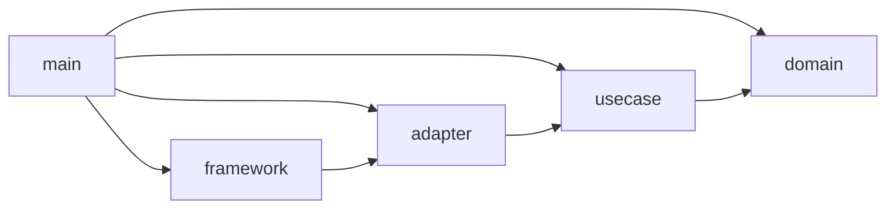

# バックテストエンジン クリーンアーキテクチャ設計

対象: `/workspaces/app/.doc/backtest/BACKTEST_DESIGN.md`（バックテストエンジン Python 設計仕様書）
参照: `BACKTEST_METRICS.md`（算出式辞典）／`BACKTEST_SPEC.md`（戦略ロジック仕様）／`BACKTEST_PROCESS.md`（実行フロー仕様）
整合確認: `indigators/profit_band/src/core.py`（pure）・`loader.py`（input adapter）

> 本書は Martin 2017『Clean Architecture』に基づく構造設計。実装詳細（戦略式・処理順）は SPEC/PROCESS で確定済み（初版で不在だった 2 文書を反映）。本書は境界配置に集中し、内部式は SPEC、内部処理順は PROCESS を一次情報とする。

> **改訂履歴**: 初版は SPEC/PROCESS 不在を前提に StrategyPort/TickModelPort 抽象で吸収。本改訂で両文書を反映し、(a) TBD#1 を解消、(b) TickModelPort を「削除候補→維持」へ訂正、(c) E-Order の保留注文・E-TradeRecord の決済理由・BacktestConfig の決定論ポリシーを追記。

> **【状態注記 2026-07-18】** 本書§1.3〜§10 のうち、**UC-004 レポート生成系・ReportPresenterPort 実装（HtmlPresenter）・ResultSinkPort 実装**は死滅コード監査により撤去済み（コミット f6d5860）。現存実装は Presenter 2 種（Markdown/Json）・ResultSinkPort 実装なし（メモリ完結・出力はコンソール）。本文書は設計記録として保存する。

---

## 1. 入力検証結果

| 項目 | 結果 |
|---|---|
| 仕様確定 | 充足。処理（§6）・エンティティ（§7）・入出力（§5/§8）・制約（§4）・例外（§9）が明示。**戦略内部式は SPEC §2-3（MADiff=MA(close)−MA(open)、#1〜#5 の条件式）、内部処理順は PROCESS §2（OnInit→OnTick A〜I→OnDeinit）で確定**。当初の TBD は解消 |
| アクター情報 | 充足。バックテスト実行者・戦略開発者・MT5 突合検証者・レポート閲覧者・指標供給者を識別可能 |
| 入出力境界 | 充足。Input=`df`+`BacktestConfig`、Output=`BacktestResult`（§5.1/§8.1） |
| 制約条件 | 充足。Python3.11+/pandas2.x/pydantic v2、30 秒・1GB、Fail-Stop（§4） |

着手前ゲート 4 項目すべて充足。

---

## 2. アクターマトリクス

| アクター | 関心事 | 想定される変更要求例 |
|---|---|---|
| バックテスト実行者（呼出側/Notebook/CLI） | 1 run を実行し結果を得る | 入力形式・出力形式・実行 API シグネチャの変更 |
| 戦略開発者（EA 移植担当） | 戦略ロジックの追加・差替 | 新規 EA 追加、シグナル判定・決済条件の変更 |
| MT5 突合検証者 | Python 結果と MT5 STAT_* の一致確認 | 許容誤差・突合項目・比較レポート形式の変更 |
| レポート閲覧者 | 結果の可視化・帳票化 | Markdown/HTML/JSON 形式・チャート要素の変更 |
| 指標供給者（指標計算担当） | 指標値の算出・登録 | 指標式の変更・新規指標追加 |

SRP（Martin 2017 第7章）: 5 アクターは独立して変更要求を出す。特に「戦略開発者」「レポート閲覧者」「指標供給者」は互いに無関係に変化するため、同一モジュールへ混在させると変更が波及する。

---

## 3. ユースケース一覧

### UC-001: バックテストを 1 run 実行する
- アクター: バックテスト実行者
- 目的: config + 価格データから確定トレード・統計・曲線を算出
- Input Model: `{ config: BacktestConfig, data: OHLCFrame }`
- Output Model: `{ trades, deals, equity_curve, balance_curve, stats, indicator_values }`
- 関連エンティティ: E-Account, E-Position, E-Deal, E-Order, E-PendingOrder, E-Bar
- 内部処理順: PROCESS §2（OnInit 前処理 → tick ごとに A ガード→B 新規バー判定→C 指標取得→D 保有状態→E シグナル→F 発注/決済→G 状態更新→H SL/TP ヒット→I equity 更新 → OnDeinit 集計）。本順序は Interactor 内に閉じる
- 例外ケース: ConfigError / DataError / IndicatorNaNError / ExecutionError / MarginCallError

### UC-002: 統計量（STAT_*）を算出する
- アクター: MT5 突合検証者（間接）／実行者
- 目的: 確定トレード列・equity 系列から BacktestStats を決定論的に算出
- Input Model: `{ trades_df, equity_curve, balance_curve, initial_deposit }`
- Output Model: BacktestStats（STAT_* 1:1 + 計算値）
- 関連エンティティ: E-TradeRecord（確定トレード）
- 例外ケース: N=0 / B_i≤0（HPR 定義不能 → §1.4 スキップ）

### UC-003: MT5 結果と突合する
- アクター: MT5 突合検証者
- 目的: BacktestStats と MT5 STAT_* dict を許容誤差で照合し合否判定
- Input Model: `{ py_stats: BacktestStats, mt5_stats: dict, tolerances: dict }`
- Output Model: ComparisonReport `{ matches, mismatches, passed }`
- 関連エンティティ: なし（純粋比較）
- 例外ケース: 突合キー欠落

### UC-004: 結果レポートを生成する（撤去済み：2026-07-18 コミット f6d5860）
> **【撤去済み】** UC-004・generate_report.py Interactor・HtmlPresenter は死滅コード監査で撤去。現存は Markdown/Json Presenter のみ。以下は設計記録。

- アクター: レポート閲覧者
- 目的: BacktestResult を Markdown/HTML/JSON 表現へ変換
- Input Model: BacktestResult
- Output Model: `{ markdown: str }` / `{ html_path: Path }` / `{ json_path: Path }`（現存は markdown/json のみ）
- 関連エンティティ: なし（表示変換）
- 例外ケース: テンプレート不在・出力先書込不可

> UC-002 は UC-001 の内部ステップだが、突合（UC-003）の入力を単独で再計算可能にするため独立 UseCase として切り出す。

---

## 4. エンティティ一覧

### E-Bar: 価格バー（Value Object）
- 不変ルール: OHLC 整合（low ≤ open,close ≤ high）
- 不変条件: `low ≤ min(open,close) ≤ max(open,close) ≤ high`；`spread ≥ 0`
- 公開振る舞い: なし（不変データ）
- 利用 UC: UC-001

### E-Order: 発注（Value Object）
- 不変ルール: SL/TP が stops_level 距離制約を満たす
- 不変条件: `side ∈ {buy,sell}`；`kind ∈ {market, buy_limit}`（PROCESS §4）；volume は volume_step の倍数・`[volume_min,volume_max]`
- 公開振る舞い: `validate(symbol_spec) -> None | raises InvalidPriceError`
- 利用 UC: UC-001

### E-PendingOrder: 保留注文（#4 BuyLimit・Value Object）
- 不変ルール: 指値到達で約定、期限到達で失効（PROCESS §4.2）
- 不変条件: `limit_price > 0`；`expire_time > entry_time`
- 公開振る舞い: `fills_at(tick_ask) -> bool`（`Ask ≤ limit_price`）；`expired_at(tick_time) -> bool`
- 利用 UC: UC-001
- 注記: 成行のみの #1/#2/#3/#5 では生成されない。#4 専用だが Band ソース不在のため Phase 最後（§12）

### E-Position: 建玉
- 不変ルール: 含み損益・必要証拠金の算出規則（METRICS §5.1）
- 不変条件: `volume > 0`；`entry_price > 0`
- 公開振る舞い: `floating_pnl(price, contract_size) -> float`；`required_margin(leverage) -> float`
- 利用 UC: UC-001

### E-Deal: 約定明細（Value Object）
- 不変ルール: 1 約定の確定損益式 p_i（METRICS §5.2）
- 不変条件: `direction ∈ {in,out}`；profit は式で一意
- 公開振る舞い: なし（不変データ）
- 利用 UC: UC-001, UC-002

### E-Account: 口座状態
- 不変ルール: balance/equity/margin/margin_level の関係式（METRICS §5.1）
- 不変条件: `equity = balance + floating_pnl + swap + commission`；`margin_level = equity/margin×100`
- 公開振る舞い: `apply_deal(deal)`；`update_floating_pnl(bar)`；`margin_level() -> float`
- 利用 UC: UC-001

### E-TradeRecord: 確定トレード（往復・Value Object）
- 不変ルール: 確定損益 p_i の構成（close-entry·sign·lot·contract_size + swap + commission）
- 不変条件: `exit_time ≥ entry_time`；`exit_reason ∈ {sl, tp, reverse, expire}`（PROCESS §6）
- 公開振る舞い: `pnl() -> float`；`is_win() -> bool`；`is_long() -> bool`
- 利用 UC: UC-001, UC-002

> 統計算出ロジック（連勝ラン・Z-Score・DD・HPR）は「複数トレードに横断する集計規則」であり単一トレードの不変ルールではないため、エンティティに昇格させず UC-002 のドメインサービス（純粋関数群）として配置する（Martin 2017 第20章「Application Business Rules」）。

---

## 5. 境界（ポート）定義

```
## Input Boundary: RunBacktestInputBoundary（UC-001）
- execute(request: RunBacktestRequest) -> BacktestResult

## Input Boundary: CompareStatsInputBoundary（UC-003）
- execute(py_stats, mt5_stats, tolerances) -> ComparisonReport

## Output Boundary: MarketDataPort（Repository）  ← データ取得の隔離
- load(source_ref, timeframe, period) -> OHLCFrame
  実装: CsvOHLCRepository / Mt5CsvOHLCRepository / MarketDataSourceRepository（Dukascopy 委譲）
  > **【撤去済み】** ParquetOHLCRepository は 2026-07-18 撤去（コミット b62bcc3）。Dukascopy は marketdata.CandleSource へ移行。

## Output Boundary: ResultSinkPort（Repository）  ← 永続化の隔離
- save_trades(df, path) / save_stats(dict, path) / save_report(html, path)
  > **【撤去済み】** ResultSinkPort の全実装（Parquet/Json）は 2026-07-18 撤去（コミット f6d5860）。現在は出力をコンソール/メモリで管理（BacktestResult で直返し）。Port 抽象は温存（API 契約用）。

## Output Boundary: StrategyPort（= EAStrategy, §7.3）  ← 戦略の隔離
- on_init(config, indicators)
- on_new_bar(bar_index, indicators, account) -> list[Order]
- on_position_check(position, bar_index, indicators) -> "hold"|"close"

## Output Boundary: IndicatorPort（= IndicatorRegistry, §7.3）  ← 指標の隔離
- get(name) -> pd.Series | raises IndicatorBufferError
- update(bar_index)

## Output Boundary: TickModelPort  ← ティック生成の隔離（維持。PROCESS §0.2/§7-#1 で3モデルが結果を左右する設定軸と確定）
- ticks_of(bar: Bar, prev_close: float) -> Iterable[Tick]   # Tick = (price, bid, ask, time)
  実装: EveryTickModel（実ティック列）/ OhlcExpandTickModel（O→H→L→C 4疑似ティック）/ OpenOnlyTickModel

## Output Boundary: ReportPresenterPort（Presenter, UC-004）
- present_markdown(result) -> str
- present_html(result, path) -> None
- present_json(result, path) -> None
```

DIP（Martin 2017 第11章）: UC-001 Interactor は各 Port を**呼び出す**が実装は知らない。これにより「Dukascopy 採用」「parquet 採用」「lightweight-charts 採用」という偶有的決定（DESIGN §4.1）が UseCase へ侵入しない。

---

## 6. アダプター設計

```
## Adapter: BacktestController（CLI/Notebook → UC-001）
- 入力: CLI args（§5.2）または Notebook の config+df
- 変換: config.yaml → BacktestConfig、parquet/csv → OHLCFrame（MarketDataPort 経由）
- 委譲先: RunBacktestInputBoundary
- 終了コード翻訳: ConfigError→2 / BacktestError→1 / 成功→0（§9.4）

## Adapter: MarkdownPresenter / JsonPresenter（UC-004・HtmlPresenter 撤去済み）
- 実装 Port: ReportPresenterPort（撤去：HtmlPresenter / UC-004 実装全体）
- 出力先: str / stats.json（HTML 廃止：2026-07-18 撤去）
- 変換: BacktestResult → §8.2 テンプレート（Markdown/Json のみ）

## Adapter: CsvOHLCRepository / Mt5CsvOHLCRepository / MarketDataSourceRepository
- 実装 Port: MarketDataPort
- 永続化先: CSV（既存 loader.py 規約に整合）
- 例外翻訳: pandas 例外 → DataError / MissingBarError / OHLCInvalidError / TimeOrderError
- > **【撤去済み】** ParquetOHLCRepository は 2026-07-18 撤去（コミット b62bcc3）

## Adapter: ResultSinkPort 実装（撤去済み：2026-07-18）
> **【撤去済み】** ParquetResultRepository / JsonResultRepository は 2026-07-18 撤去（コミット f6d5860）。現在は ResultSinkPort が Port 抽象のみ（実装なし）。出力は BacktestResult をコンソール/メモリで管理。
- 実装 Port: ResultSinkPort（実装なし）
- 例外翻訳: I/O 例外 → BacktestError（context 付与）

## Adapter: PandasIndicatorRegistry
- 実装 Port: IndicatorPort
- 既存 indigators/profit_band/src/core.py（pure）を内部利用
- 例外翻訳: NaN 検出 → IndicatorNaNError、未登録参照 → IndicatorBufferError

## Adapter: 各 EAStrategy 実装（TC24051901 等）
- 実装 Port: StrategyPort
- usecase/domain のみ参照。pandas/フレームワーク型を on_new_bar 戻り値に漏らさない（Order を返す）
```

例外翻訳方向（Martin 2017 第22章）: 外側（pandas/IO）例外を内側ドメイン例外（BacktestError 系統）へ翻訳。逆向き（フレームワーク例外の内側漏出）を禁止する。

---

## 7. フレームワーク・ドライバー層

```
## Framework & Drivers
- 言語/数値: Python 3.11+ / pandas 2.x / numpy 1.26+（DESIGN §4.1）
- 設定モデル: pydantic v2 — BacktestConfig/SymbolSpec の検証は Controller/Composition Root 境界でのみ使用
- 永続化ドライバ: csv — Repository 内のみ。Parquet は撤去済み（2026-07-18）
- チャート: lightweight-charts-python — HtmlPresenter 撤去済み（2026-07-18）
- テンプレ: jinja2 — MarkdownPresenter 内のみ（HtmlPresenter は撤去）
- データ取得（将来）: Dukascopy フィード — DukascopyGateway（MarketDataPort 実装）内のみ
- 隔離方針: 上記技術は §6 アダプター実装の内部に限定。domain/usecase からの import を禁止
```

> pydantic v2 の BaseModel は **検証付き DTO** として境界に限定し、Entity の振る舞い（floating_pnl 等）は pydantic 非依存のメソッドで持たせることで、pydantic 差替時の影響を境界に閉じる（実務的推奨／仮説）。既存 `core.py` の domain（`@dataclass(frozen=True)`・numpy のみ・pydantic 非依存）と整合。

---

## 8. 依存方向図



### 依存方向違反の検出（DESIGN §7.4/§8.1 を Clean Architecture 観点で評価）

| # | 違反 | 重大度 | DIP 解消法 |
|---|---|---|---|
| ① | `engine.py`（UseCase 相当）が `execution/`・`tick_simulator.py`・`reporting/`・`strategies/`・`indicators/` を直接 import する技術別フラット構造。UseCase が約定実装・ティック実装・レポート・指標実装（外側）へ直接依存 | 高 | TickModelPort / ResultSinkPort / IndicatorPort / StrategyPort を usecase 層に置き、`execution`・`reporting`・各実装を adapter 層へ移し DIP で逆転 |
| ② | `result.py`（BacktestResult）が `to_html()`/`to_markdown()`/`to_json()` を持つ（§8.1）。ドメイン結果オブジェクトが reporting（外側）・lightweight-charts・jinja2 へ依存 | 高 | 変換責務を ReportPresenterPort（Presenter）へ移譲。`result.to_html()` ではなく `MarkdownPresenter(result)` を Composition Root で結線。BacktestResult はデータ保持のみ |
| ③ | `result.compare(mt5_stats)`（§8.1/§8.3） | 軽微 | 突合は純粋比較で外側依存はないが、責務分離上 UC-003（CompareStats）へ移すのが SRP 整合 |

Composition Root: `main`（§5.2 CLI `__main__`）— BacktestConfig 構築、各 Port 実装（Repository/Presenter/Strategy/Indicator/TickModel）の選択と DI、Interactor 組み立てを担う。

---

## 9. ディレクトリ構造（提案）

DESIGN §7.4 の技術別フラット構造を、レイヤー別へ再マッピングする（実務的推奨／仮説。既存 `indigators/profit_band/src/` の pure/loader 分離規約に整合）。

```
backtest/
├── domain/                      # 最内側・依存ゼロ（pandas/pydantic 非依存のメソッド）
│   ├── bar.py                   # E-Bar
│   ├── order.py                 # E-Order
│   ├── position.py              # E-Position
│   ├── deal.py                  # E-Deal
│   ├── account.py               # E-Account
│   ├── trade_record.py          # E-TradeRecord
│   └── exceptions.py            # BacktestError 階層（§9.1）— domain に置く（全層が送出）
├── usecase/
│   ├── run_backtest.py          # UC-001 Interactor + RunBacktestInputBoundary
│   ├── compute_stats.py         # UC-002 ドメインサービス（STAT_* 純粋算出）
│   ├── compare_stats.py         # UC-003 Interactor（ComparisonReport）
│   ├── generate_report.py       # UC-004 Interactor（撤去済み：2026-07-18 コミット f6d5860）
│   ├── ports.py                 # MarketDataPort/ResultSinkPort/StrategyPort/
│   │                            #   IndicatorPort/TickModelPort/ReportPresenterPort
│   └── models.py                # BacktestConfig/SymbolSpec/BacktestStats/BacktestResult
│                                #   （プレーン DTO。検証は adapter 境界で pydantic）
│                                #   BacktestConfig は PROCESS §7 の決定論ポリシー9項目を保持:
│                                #   tick_model / spread_model / sltp_tie=SL優先 / fill_delay=次tick /
│                                #   ohlc_order / session_calendar / digits / legacy_quirks(#4) / return_basis
├── adapter/
│   ├── controller.py            # BacktestController（CLI/Notebook）
│   ├── repository/
│   │   ├── ohlc_csv.py          # CsvOHLCRepository（既存 loader.py 流用）
│   │   ├── ohlc_mt5_csv.py      # Mt5CsvOHLCRepository
│   │   ├── ohlc_parquet.py      # ParquetOHLCRepository（撤去済み：2026-07-18 コミット b62bcc3）
│   │   ├── marketdata_source.py # MarketDataSourceRepository（Dukascopy 委譲・ISSUE-135）
│   │   └── result_sink.py       # ResultSinkPort 実装（撤去済み：2026-07-18 コミット f6d5860）
│   ├── indicator/
│   │   ├── registry.py          # PandasIndicatorRegistry（IndicatorPort 実装）
│   │   ├── madiff.py            # MADiff（SPEC §2 確定後充填）
│   │   └── ema_adx_di.py        # Phase 3
│   ├── strategy/
│   │   ├── tc24051901.py        # StrategyPort 実装（Phase 1）
│   │   ├── tc24051902.py        # Phase 2
│   │   └── pro_fit_band.py      # Phase 3
│   ├── execution/
│   │   ├── order_executor.py    # 成行/BuyLimit 約定（UC-001 が呼ぶ純粋約定ロジック・PROCESS §4）
│   │   ├── sltp_checker.py      # SL/TP ヒット判定（同足両ヒットは SL 優先・PROCESS §5）
│   │   └── tick_model.py        # EveryTick/OhlcExpand/OpenOnly TickModel（TickModelPort 実装）
│   └── presenter/
│       ├── markdown.py          # MarkdownPresenter
│       ├── html.py              # HtmlPresenter（撤去済み：2026-07-18 コミット f6d5860）
│       ├── json.py              # JsonPresenter
│       └── templates/（Markdown/Json のみ現存）
├── framework/
│   └── config_loader.py         # config.yaml → BacktestConfig（pydantic v2 検証）
└── main/
    └── __main__.py              # Composition Root（CLI・DI 組み立て・終了コード）

tests/
├── unit/         # domain・usecase の純粋テスト（Port はモック）
├── integration/  # Composition Root 経由の 1 run
└── fixtures/mt5_outputs/   # STAT_* 期待値 JSON
```

### 各パッケージの import ルール
- `domain`: 自パッケージ内のみ（pandas/pydantic 非依存）
- `usecase`: domain のみ
- `adapter`: usecase, domain
- `framework`: adapter, usecase, domain
- `main`: 全層

> `order_executor`/`sltp_checker` は「UC-001 が呼ぶ純粋約定計算」であり外部 I/O を持たない。UseCase 内ヘルパー（usecase/ 直下）に置く選択も可。Port を介す必要があるのは外部 I/O（データ取得・永続化・描画）と差替可能性のある戦略・指標・ティックモデルに限る（§10 参照）。

---

## 10. YAGNI 検証結果

| 抽象化 | 変更要因の実在 | 複数実装の現実性 | 採否 |
|---|---|---|---|
| StrategyPort（EAStrategy） | 実在（Phase1→3 で複数 EA。§2.1） | 複数実装あり（TC24051901/902/PRO!fit_Band） | 維持 |
| IndicatorPort（Registry） | 実在（MADiff/EMA/ADX/DI 複数指標） | 複数実装あり | 維持 |
| MarketDataPort | 実在（CSV/MT5CSV + Dukascopy 委譲） | 複数実装あり（csv/mt5csv/marketdata委譲）。Parquet は撤去済み（2026-07-18） | 維持 |
| ResultSinkPort | 実在（§7.1 永続化は呼出側責務・port 抽象のみ） | 実装 0（撤去済み：2026-07-18）。Port 抽象は温存（API 契約用） | **維持（抽象のみ）** |
| TickModelPort | **実在（初版から訂正）**（PROCESS §0.2/§7-#1 が全ティック/OHLC4展開/始値のみの3モデルを「結果を左右する設定軸」と明記。§7 決定論チェックリスト #1 で選択を要求） | 複数実装あり（EveryTick/OhlcExpand/OpenOnly） | **維持**（当初の削除判断を撤回。Phase1 でも全ティック＋OHLC 展開近似の2実装が早期に必要） |
| ReportPresenterPort | 実在（Markdown/JSON の 2 表現。§8.1。HTML は撤去）| 実装 2 あり（Markdown/Json）。HTML は撤去済み（2026-07-18） | 維持 |
| CompareStats を独立 UseCase 化 | 実在（突合は検証者アクター固有・許容誤差は変更対象 §1） | — | 維持（SRP 根拠。Port は不要・直接呼び） |
| パラメータスイープ/並列化の抽象 | 仮想（§4.4・§2.3 で Phase2 以降と明示） | — | **削除候補**（呼出側で複数 Engine 並走） |
| DB 永続化抽象（SQLAlchemy 等） | 仮想（§4.2 不採用・メモリ完結 §7.1） | — | **削除候補**（ResultSinkPort のファイル実装で充足） |

- 維持された境界: StrategyPort / IndicatorPort / MarketDataPort / ResultSinkPort / ReportPresenterPort / **TickModelPort（訂正により追加）**
- 削除推奨された境界: パラメータスイープ抽象（Phase2 以降・呼出側責務）／DB 永続化抽象（メモリ完結方針と矛盾）

---

## 11. 設計判断の根拠

| 判断 | 根拠 |
|---|---|
| 4＋1 レイヤー（domain/usecase/adapter/framework/main）へ再構成 | Martin 2017 第22章（The Clean Architecture） |
| StrategyPort/IndicatorPort を Output Boundary 化 | Martin 2017 第11章（DIP）— 戦略・指標の差替を UseCase から隔離 |
| MarketDataPort で Dukascopy/CSV/Parquet を隔離 | Martin 2017 第22章（偶有的性質を外側へ）＋ 既存 loader.py「データ取得は責務外」規約 |
| BacktestResult から to_html/to_markdown を剥離し Presenter へ | Martin 2017 第22章（Presenter）— 依存方向違反②の解消 |
| compute_stats を UC-002 として分離 | Martin 2017 第20章（Application Business Rules）＋ SRP（突合者アクター） |
| 統計集計をエンティティに昇格させない | YAGNI（Martin 2017 第34章）— 単一トレード不変ルールでない |
| TickModelPort を Phase1 で導入しない | YAGNI 強制（§4）— §6.3 で単一実装確定 |
| domain を pydantic 非依存メソッドで持たせる | （実務的推奨／仮説）pydantic v2 差替の影響を境界へ閉じる |
| ディレクトリをレイヤー別へ | （実務的推奨／仮説）Martin 原典に直接の図解なし。既存 src/ の pure/loader 分離に整合 |

---

## 12. 実装着手順序（実務的推奨／仮説）

1. domain（E-Bar〜E-TradeRecord + exceptions）を pandas 非依存で実装
2. usecase/ports.py + run_backtest Interactor を実装。Repository/Strategy/Indicator は最初インメモリ/スタブで結線
3. compute_stats（UC-002）を METRICS §12 の 10 トレード期待値で先にテスト固定
4. adapter（CsvOHLCRepository・PandasIndicatorRegistry・TC24051901 戦略・OhlcSimulateTickModel・Presenter）を実装
5. framework（config_loader）接続、main で Composition Root 組み立て
6. integration テストで `result.compare(mt5_expected).passed == True`（§11-6）

---

## 13. 未解決事項（TBD）

| 項目 | 確認が必要な理由 | 確認先 |
|---|---|---|
| ~~MADiff 計算式・OnTick 処理順~~ | **解消済**。SPEC §2-3 で式・条件式、PROCESS §2 で処理順が確定 | — |
| #4 Band 指標ソース（28バッファ四分位） | `Band.ex5` のみで `.mq5` 不在（SPEC §4）。`pOL/pOH` 算出式が不明で #4 完全再現不可。`indigators/profit_band` で代替可否を要照合 | ユーザー（原典ソース入手）／profit_band 照合 |
| ADX(8)/+DI/−DI の移植 | #5 PRO!fit_Band が依存するが未移植（PROCESS §1.2）。PandasIndicatorRegistry に新規実装が必要 | 実装（Phase3 着手前） |
| 既存 `indigators` ディレクトリ名 | 実ディレクトリは `indigators`（タイポ）。新 `simulator/adapter/indicator` から既存 core を流用する際の import パス整合 | ユーザー（リネーム可否は破壊的変更/承認事項） |
| `PORTING_GUIDE.md` | SPEC/PROCESS が配列向き・型注意で参照するが未確認（不在の可能性）。移植時の `[0]→df.iloc[-1]` 等の規約根拠 | ユーザー（文書整備） |
| order_executor を Port 化するか UseCase 内ヘルパーとするか | 外部 I/O を持たず差替要求も現状なし。境界粒度は実装時の約定モデル拡張要求で再判定 | Phase2 約定モデル拡張時 |

---

## 付録: 上流入力前提検証サマリ

- 初版時点で `BACKTEST_SPEC.md`/`BACKTEST_PROCESS.md` は不在だったため StrategyPort/TickModelPort 抽象で吸収し TBD 化。**本改訂で両文書が追加され反映**：SPEC §2-3 で MADiff 式・各 EA 条件式、PROCESS §2 で OnTick 処理順が確定し TBD#1 を解消。PROCESS §0.2/§7 によりティックモデルが設定軸と判明し TickModelPort を維持へ訂正。
- 既存 `indigators/profit_band/src/core.py`（pure・pandas 中心・pydantic 非依存）/ `loader.py`（「データ取得は本ライブラリの責務外」明示）を実コードで確認 → 本設計の pure-core/loader-adapter 分離方針と整合。
- DESIGN §7.4 は技術別フラット配置で domain/usecase/adapter 境界が無いため、本設計でレイヤー別へ再構成（§8 で違反 3 件を検出・解消法併記）。
- **残存 TBD**（§13）：#4 Band 指標ソース不在・ADX 未移植・`indigators` タイポ・`PORTING_GUIDE.md` 未確認。いずれも境界配置には影響せず、特定アダプター実装（indicator/strategy）に局所化される。
