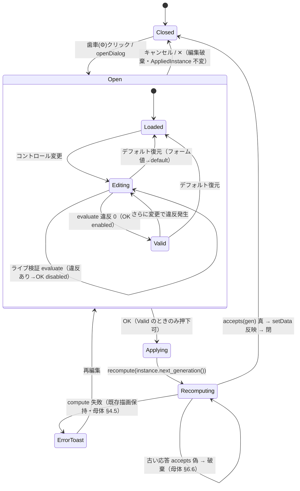
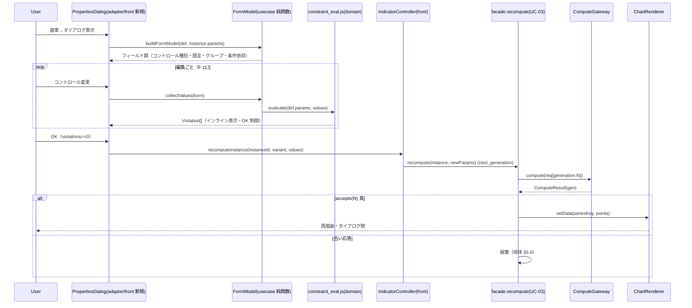
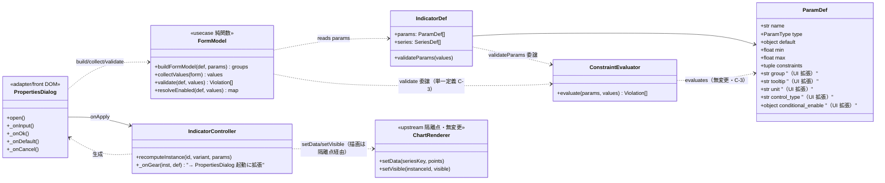

# インジケーター・プロパティ（パラメーター設定）ダイアログ 内部設計書

## 0. 文書情報

- 作成日：2026-06-07
- バージョン：v0.2.0（spec-reviewer「条件付き可」指摘の反映・「可」引き上げ。母体内部設計書 v0.1.1 への拡張）
- 作成者：system-internal-design エージェント
- 承認者：（未承認 / 要ユーザー承認）

### 0.0 変更履歴

| 版 | 日付 | 変更内容 | 実コード根拠 |
|---|---|---|---|
| v0.1.0 | 2026-06-07 | 新規作成 | — |
| v0.2.0 | 2026-06-07 | spec-reviewer 指摘のピンポイント反映（範囲拡大・他章再設計なし）。①**H-1 事実訂正**：A 方式 `compute` が `params` を無視し `${indicatorId}:${variant}` キーで事前計算 series を解決する事実に合わせ、§9.1 結論・§9.2・§9.3・§10.2 T-PD-I6 の「該当データ無し→スキップ→無反映」記述を「params 無視・同一 series 再描画・値未反映・非クラッシュ／スキップは未収録 variant のみ」へ訂正。②**M-4**：§1.2 に probabilities 既定不一致（catalog `[0.95,0.99]` vs 実体 7 水準）を M-1/2/3 と同列追記。③**M-recompute-sig**：§7.3・§8.2 に「newParams 反映は B 方式 gateway のみ」注記。④**M-cnt**：§3.3.3 でテスト数の出所を明示（test_constraint_evaluator.py=40、101/108 は全スイート合計）。⑤**L-buckets-param**：§11.1 A-3 を規模明記へ。⑥**L-ref**：§1.1 buckets 既定を DEFAULT_BUCKETS 経由（引数 :94→定義 :51）と分離記述 | `embedded_compute_gateway.js:25-29`、`facade.js:131-156`、`indicator_controller.js:212-214`、`catalog.js:54`、`profit_band/src/core.py:19`、`profit_band/src/lwc_chart.py:51,94`、`api/tests/test_constraint_evaluator.py`（40） |
- 上位文書：
  - 内部設計書 `/workspaces/app/.doc/indicator-management-ui/内部設計書.md`（v0.1.1・本書の母体。以下「母体設計」）
  - 基本設計書 `/workspaces/app/.doc/indicator-management-ui/基本設計書.md`（v0.2.1・確定）
- 参照 UI（範・read-only）：`/workspaces/app/.doc/ss20260607125849.jpg`（EMA プロパティダイアログ）、`/workspaces/app/design/chart-design.html`
- 基本方針：本書は母体設計（domain ← usecase ← adapter ← framework）の**拡張**として、TradingView のプロパティダイアログ（パラメーター / スタイル / 可視性タブ）に相当する「インジケーター・プロパティ ダイアログ」を実装可能粒度で確定する。**新レイヤー・新ポートは増やさない**。既存フロント構造（`domain/usecase/adapter/front`）に収める。

### 0.1 絶対制約（本書が遵守する前提）

| # | 制約 | 根拠 |
|---|---|---|
| C-1 | `lightweight-charts-python-main/`・`design/` は read-only。技術スタック lightweight-charts **v4.1.3 固定**・無断変更禁止 | 依頼指示・母体 §0/§1.3 |
| C-2 | 新規依存追加禁止（node 標準＋ブラウザ標準＋既存 JS のみ） | 依頼指示・母体 §10.2 |
| C-3 | 検証ロジックは domain `ConstraintEvaluator` の**単一定義を共有**。フロント/API で二重実装しない | 母体 §3.1.5・申し送り#4 |
| C-4 | recompute は generation（母体 §6.6）で古い応答破棄を維持 | 母体 §3.1.4 `accepts`/`next_generation`・§4.2 |
| C-5 | 新レイヤー・新ポートを増やさない。既存 5 ポート（母体 §3.2.1）に収める | 依頼指示 |
| C-6 | 推測で API 名・挙動を断定しない。確認不能は「要確認」 | 依頼指示 |

### 0.2 本書のスコープと非スコープ

| 区分 | 含む | 含まない |
|---|---|---|
| 対象 | プロパティダイアログ DOM（adapter/front 新規モジュール）、PARAM_DEF→UI コントロールのマッピング規則、PARAM_DEF の UI 向けメタデータ拡張、リアルタイム検証（F-11）、3 指標の具体フォーム定義、振る舞い・状態遷移、クラス/モジュール設計、A/B 方式可動差、テスト設計 | 実装コードそのもの、TDD 実行、スタイル/可視性タブの**詳細**フォーム（責務範囲のみ定義）、計算 API の HTTP 契約（母体 §6.3 確定済を流用）、レジストリ API 化方式（母体 TBD-03） |
| 既存資産 | 母体設計の domain/usecase/adapter を import・拡張。`ConstraintEvaluator`（Py/JS）・`catalog.js`・`facade.js`・`indicator_controller.js` を整合先とする | 既存 3 指標 `src/` の改変、母体確定設計との矛盾 |

---

## 1. 既存実装の実証（本書の判断根拠）

> 本章は「設計判断に実コード/設計の根拠を添える」制約（C-6）の起点。以下はすべて Read 済の実コード事実であり、推測を含まない。

### 1.1 3 指標の実パラメータ（add_* 関数シグネチャ・実コード）

| 指標 / variant | 関数 | パラメータ（実コードの引数名・既定・型） | 根拠（ファイル:行） |
|---|---|---|---|
| `tgp_btlm` | `add_btlm` | `fitter`（第3位置・`BtlmFitter` 実体）／`price="open"`(str)／`maxbars=100`(int)／`q_low=0.05`(float)／`q_high=0.95`(float)／`time_column=None`／`color`(str) | `tgp_btlm/src/lwc_chart.py:63-73`、既定値 `core.py:33-35`（`DEFAULT_MAXBARS=100`/`Q_LOW=0.05`/`Q_HIGH=0.95`） |
| `profit_band` / global | `add_profit_band` | `probabilities=PROBABILITIES`(float tuple)／`buckets=DEFAULT_BUCKETS`(=`("nOH","pOL","pOH","nOL")`)／`time_column=None`／`require_full=True`(bool)／`legend=False`(bool)／`bands=None`(内部) | `profit_band/src/lwc_chart.py:89-98`、`probabilities` 既定は `PROBABILITIES=(0.51,0.80,0.85,0.90,0.95,0.98,0.99)`（`core.py:19`）。`buckets` 既定は **`DEFAULT_BUCKETS` 経由**（引数 `lwc_chart.py:94` が名前参照→定義 `lwc_chart.py:51` の `("nOH","pOL","pOH","nOL")`。シグネチャはタプル直書きでない） |
| `profit_band` / robust | `add_robust_profit_band` | 上記に加え `normalize="return"`(enum: return/atr)／`window="expanding"`(expanding or int)／`atr_period=14`(int)／`min_obs=30`(int) | `profit_band/src/lwc_chart.py:158-169`、`normalize` 検証 `robust_bands.py:135-140`、`atr_period` は `normalize=="atr"` 時のみ使用（`robust_bands.py:107-109,137`） |
| `price_range_power` | `add_price_range_power` | `interval=0.1`(float)／`range_from=None`(float)／`range_to=None`(float)／`top_n=5`(int, `<0` で `ValueError`)／`bull_color`／`bear_color`／`width=2`(int) | `price_range_power/src/lwc_chart.py:36-46`、`top_n<0`→`ValueError`（`:68-69`）、`DEFAULT_INTERVAL=0.1`（`core.py:40`） |

### 1.2 母体実装との不一致（本書で是正・要承認候補）

> 既存 `catalog.js`（母体プロトタイプの最小レジストリ）と 1.1 の実コード（add_* シグネチャ）の間に**4 点の不一致**を検出した。本書は実コード（add_* シグネチャ）を正とし、`catalog.js` を拡張時に是正する方針を提示する（破壊的変更でないため拡張で吸収。ただし既定値変更は UI 既定値に影響するため**要承認候補**）。

| # | 母体 `catalog.js` の定義 | 実コード（add_* シグネチャ） | 是正方針 | 根拠 |
|---|---|---|---|---|
| M-1 | `maxbars` default = 40（`catalog.js:26`） | `DEFAULT_MAXBARS=100`（`core.py:33`、`add_btlm` 既定） | 実コード既定 **100** を UI 既定にする。default 変更は要承認 | `tgp_btlm/src/core.py:33` |
| M-2 | `interval` を `ParamType.ENUM` [0.1,0.01,0.001]（`catalog.js:82`） | `interval: float`（連続値・`add_price_range_power` 既定 0.1） | **要確認**：実体は float。離散選択が UX 上望ましいか（VBA 由来の刻み）を確認。本書は「ENUM 提示・実体 float」の両論を §4.4 に併記し既定を ENUM 維持（後述） | `price_range_power/src/lwc_chart.py:40`、`core.py:40` |
| M-3 | `top_n` default = 2（`catalog.js:83`） | `add_price_range_power` 既定 `top_n=5` | 実コード既定 **5** にするか 2 維持かは UX 判断＝**要承認**。本書はフォーム定義で「既定＝5（実コード準拠）」を提示 | `price_range_power/src/lwc_chart.py:44` |
| M-4 | `probabilities` default = `[0.95, 0.99]`（2 水準・`catalog.js:54`） | `PROBABILITIES=(0.51,0.80,0.85,0.90,0.95,0.98,0.99)`（**7 水準**・`add_profit_band` 既定） | 実コード既定 **7 水準**を UI 既定にする。M-1/2/3 と同様、是正は `catalog.js` の `params` 定義に閉じ `ConstraintEvaluator`（Py/JS）は不変。default 変更は UI 既定値に影響するため**要承認** | `profit_band/src/core.py:19`、`lwc_chart.py:93`（引数既定が `PROBABILITIES` を参照） |

- **重要（C-3 整合）**：上記是正は `catalog.js` の `params` 定義（既定・型・制約）に閉じる。`ConstraintEvaluator`（Py/JS）のロジックは一切変更しない。フォームは `IndicatorDef.params` を読むため、`catalog.js` 是正がそのままフォームに反映される（単一定義共有）。

---

## 2. ダイアログ構造（要件 1）

### 2.1 全体レイアウト（参照 UI = EMA ダイアログに準拠）

参照画像（`ss20260607125849.jpg`）の構造を範とし、本プロジェクトの 3 指標へ写像する。

```text
┌─────────────────────────────────────────┐
│ [指標名]                              ✕  │  ← タイトルバー（指標表示名＋閉じる・ドラッグ移動ハンドル）
├─────────────────────────────────────────┤
│ パラメーター   スタイル   可視性          │  ← タブバー（3 タブ。既定=パラメーター）
├─────────────────────────────────────────┤
│ ┌─ グループ見出し（例: 計算）──────────┐ │
│ │ ラベル      [コントロール]   (i)ツール │ │  ← パラメータ行（label / control / tooltip）
│ │ ラベル      [コントロール]            │ │
│ │   └ インライン違反メッセージ（赤）     │ │  ← F-11 リアルタイム検証
│ └────────────────────────────────────┘ │
│ ┌─ グループ見出し（例: 表示）──────────┐ │
│ │ ...                                    │ │
│ └────────────────────────────────────┘ │
├─────────────────────────────────────────┤
│ [デフォ…▾]            [キャンセル] [OK]  │  ← フッター（デフォルト復元 / キャンセル / OK）
└─────────────────────────────────────────┘
```

### 2.2 構成要素と責務

| 要素 | 責務 | 参照 UI 対応 |
|---|---|---|
| タイトルバー | 指標表示名（`IndicatorDef.displayNameKey` を i18n 解決した値）表示・ドラッグ移動ハンドル・閉じる（✕） | 「EMA」「✕」 |
| タブバー | パラメーター(inputs) / スタイル(style) / 可視性(visibilities) の 3 タブ切替。既定はパラメーター | 「パラメーター/スタイル/可視性」 |
| パラメーター タブ（本書の主眼） | `IndicatorDef.params` を UI コントロールへ写像（§3）。グループ見出し・条件付き有効化・ツールチップ・リアルタイム検証（§5） | 「期間/ソース/オフセット…」 |
| スタイル タブ | **SeriesDef 単位の色 / 線幅 / 線種**の編集（§6 で責務範囲のみ定義） | TradingView スタイルタブ相当 |
| 可視性 タブ | **系列単位の表示 / 非表示**（§6 で責務範囲のみ定義） | TradingView 可視性タブ相当 |
| フッター | デフォルト（既定値復元）／キャンセル（破棄）／OK（適用＝UC-03 recompute） | 「デフォ…/キャンセル/OK」 |

### 2.3 ドラッグ移動・閉じる（挙動）

| 操作 | 挙動 | 実現（ブラウザ標準のみ・C-2） |
|---|---|---|
| ドラッグ移動 | タイトルバー `pointerdown`→`pointermove` で `transform: translate(x,y)` 更新。ビューポート外への移動はクランプ | Pointer Events（標準）。`setPointerCapture` |
| 閉じる（✕） | キャンセルと同義（編集破棄・§7 状態遷移）。ダイアログ DOM を非表示（`is-open` クラス除去） | 母体 `indicator_controller.js:325` `_closeDialog` と同型 |
| 背景クリック | 任意（既定は閉じない＝誤操作防止）。**要確認**：TradingView は背景クリックで閉じない | — |

---

## 3. PARAM_DEF → UI コントロールのマッピング規則（要件 2・中核・決定論的）

> 本章が本設計の中核。`誰が実装しても同じコントロールになる`よう、`ParamType`（既存 enum）＋ UI 拡張メタデータ（§3.3）から**一意に**コントロールを決定する規則を定める。

### 3.1 ParamType → コントロール対応表（決定論的写像）

| `ParamType`（`param_def.py:12-22`） | UI コントロール | 検証連携 | 例（指標） |
|---|---|---|---|
| `INT` | 数値入力（スピナー）。`step`／`min`／`max` 属性付与 | `type(int)` 違反＝整数以外（`validation.py:83-92`／`constraint_eval.js:83-88`） | `maxbars`／`top_n`／`window`(int)／`atr_period`／`min_obs` |
| `FLOAT` | 数値入力（スピナー）。`step`（小数刻み）／`min`／`max` | 相関制約（range_open 等）で検証。型検査は無（FLOAT は型違反を出さない＝`validation.py:83` は INT のみ） | `q_low`／`q_high`／`interval`(float 実体) |
| `ENUM` | ドロップダウン（`enum_values` を選択肢）。表示は i18n ラベル、値は raw | `enum` 違反＝`enum_values` 非包含（`validation.py:95-109`） | `fitter`(ols/tgp)／`price`(ソース=終値等)／`normalize`(return/atr)／`variant`(global/robust) |
| `BOOL` | チェックボックス | 無（true/false のみ） | `require_full`／`legend` |
| `STRING` | テキスト入力 | 無（または将来 pattern） | （現 3 指標で UI 露出なし） |
| `COLOR` | カラーピッカー（`<input type=color>` ＋ alpha は補助）。**スタイルタブへ移譲**（§6） | 無 | `color`／`bull_color`／`bear_color` |
| `FLOAT_LIST` | **リスト編集コントロール**（各要素=数値入力／追加・削除ボタン／要素ごと検証） | `range_open` を**要素ごと**に評価（`validation.py:151-160` `elements` ループ） | `probabilities` |
| `ENUM_LIST` | **チップ/マルチセレクト**（候補から複数選択） | 各要素が候補集合に含まれるか | `buckets`（nOH/pOL/pOH/nOL） |

- **決定規則の一意性**：コントロール種別は `control_type`（§3.3 拡張・明示指定があれば優先）→ なければ `ParamType` のデフォルト写像（上表）で決まる。曖昧さはゼロ。

### 3.2 FLOAT_LIST（probabilities）リスト編集コントロールの仕様

`probabilities` は実コードで float のタプル（既定 7 水準・`core.py:19`）。TradingView に直接の範はないため、以下を確定仕様とする。

| 項目 | 仕様 |
|---|---|
| 表示 | 各要素を 1 行（数値入力＋削除ボタン）。末尾に「＋追加」 |
| 追加 | 末尾に新要素（既定 0.95）を追加。即時に検証実行 |
| 削除 | 当該要素除去。**空リスト禁止**（最低 1 要素・要確認：実コードは空配列を許すか＝`build_bands` の挙動依存。本書は「最低 1 要素」を UI 制約として課す） |
| 要素検証 | 各要素に `range_open(0,_,1)` を適用（`0 < p < 1`）。違反要素をハイライト（`evalRangeOpen` が**最初の違反要素**を返す＝`constraint_eval.js:155-163`） |
| ソート | 任意（実コードは並び順を描画順に使う＝`add_profit_band:134` の `for prob in probabilities`）。UI は入力順を保持し勝手に並べ替えない |

### 3.3 PARAM_DEF の UI 向けメタデータ拡張（要件 2・後方互換）

現 `ParamDef`（`param_def.py:55-71`／`constraint_eval.js` の plain object）が持つ情報と、UI に新規追加が要る情報を明確に区別する。

#### 3.3.1 既存 ParamDef が持つ情報で足りる分

| UI ニーズ | 既存フィールド | 備考 |
|---|---|---|
| コントロール種別 | `type`（`ParamType`） | §3.1 の写像で一意に決まる |
| 既定値 | `default` | デフォルト復元（§7）に使用。`default is None` は required（`validation.py:68`） |
| 数値レンジ | `min`／`max`（`param_def.py:67-68`） | スピナーの `min`/`max` 属性。**注意**：JS plain object（`catalog.js` の `param()`）は現状 min/max を出力していない（`catalog.js:13-15` は name/labelKey/type/default/enumValues/constraints のみ）＝**JS 側に min/max/ui 拡張を足す必要あり**（後述 P-1） |
| 選択肢 | `enum_values`／`enumValues` | ドロップダウン項目 |
| 表示要否 | `ui_visible`（`param_def.py:70`） | false（例 `time_column`）はフォームから除外 |
| ラベルキー | `label_key`／`labelKey` | 表示ラベルの i18n キー |
| 制約 | `constraints` | リアルタイム検証（§5） |

#### 3.3.2 新規追加が要る UI メタデータ（拡張フィールド）

> 既存ロジック（`ConstraintEvaluator`）には一切影響しない**純 UI メタデータ**。`ParamDef`（Python dataclass）と JS plain object の双方に追加する。全て**任意（省略可）・既定で従来挙動**＝後方互換。

| 拡張フィールド | 型 | 役割 | 既定（省略時挙動） |
|---|---|---|---|
| `display_label` / `displayLabel` | str(i18n key) | 日本語表示ラベル（`label_key` と統合可。本書は `label_key` を流用し別名追加は不要＝**`label_key` で足りる**） | `label_key` を使用 |
| `group` / `group` | str(i18n key) | グループ見出し（§3.4）。同一 `group` のパラメータを 1 見出し下にまとめる | `null`＝「基本」グループ（無見出しの先頭群） |
| `control_type` / `controlType` | str | コントロール明示指定（§3.1 のデフォルト写像を上書き）。例 FLOAT を slider にしたい等 | `null`＝`ParamType` のデフォルト写像 |
| `tooltip` / `tooltip` | str(i18n key) | ツールチップ（パラメータ説明）。(i) アイコンに表示 | `null`＝ツールチップなし |
| `unit` / `unit` | str | 単位表示（例「本」「%」「期間」）。コントロール右に併記 | `null`＝単位なし |
| `step` / `step` | number | 数値入力の刻み（INT は既定 1、FLOAT は明示推奨。例 q は 0.01） | INT=1、FLOAT=未指定（ブラウザ既定 `any`） |
| `conditional_enable` / `conditionalEnable` | object | 条件付き有効化（§3.5）。`{ when: {param, equals} }` 形式 | `null`＝常時有効 |
| `order` / `order` | number | グループ内表示順 | 配列順 |

- **min/max の扱い（P-1）**：Python `ParamDef` は `min`/`max` を既に持つ（`param_def.py:67-68`）。JS plain object（`catalog.js:13` の `param()` ヘルパ）は現状未出力。**JS 側 `param()` を `min`/`max`/`step`/`group`/`tooltip`/`unit`/`controlType`/`conditionalEnable`/`order` を受けられるよう拡張**する（既存呼び出しは引数省略で従来同値＝後方互換）。これは `constraint_eval.js` の `evaluate` に影響しない（evaluate は name/type/default/enumValues/constraints のみ参照＝`constraint_eval.js:53-67`）。

#### 3.3.3 移行方針（後方互換）

| 観点 | 方針 |
|---|---|
| Python `ParamDef` | 新規フィールドは `dataclass` の**末尾に default 付き**で追加（`group: str|None = None` 等）。既存生成箇所はキーワード省略で従来同値。`frozen=True` 維持 |
| JS plain object | `param()` ヘルパ（`catalog.js:13`）にオプション引数追加。`evaluate` は新フィールドを読まない（無視）ため挙動不変 |
| 検証ロジック | `ConstraintEvaluator`（Py/JS）は**無変更**（C-3）。UI メタデータは検証に不関与 |
| 既存テスト | `test_constraint_evaluator.py`・JS constraint テストはベクタ不変＝**既存全テスト緑維持**（UI メタデータは evaluate 非対象）。**注（M-cnt）**：本ダイアログ単体のテスト数を断定しない。`test_constraint_evaluator.py` の test 関数は 40（実測・`api/tests/test_constraint_evaluator.py`）。「101 Python / 108 JS」等の数値はリポジトリ**全スイート合計**の値であり本ダイアログ単体の数ではない（合計値は実装時に実測で確定）。後方互換の根拠は「既存全テスト緑維持」とする |

### 3.4 グループ化規則

| 規則 | 内容 |
|---|---|
| グルーピングキー | `ParamDef.group`（i18n key）。同一 key を 1 見出しにまとめる |
| 表示順 | グループは初出順、グループ内は `order`（なければ配列順） |
| 無指定 | `group=null` のパラメータは見出しなしで先頭に集約（参照 UI の「期間/ソース/オフセット」相当） |
| 例（参照 UI 対応） | EMA 図の「平滑化」「計算」見出しに相当。本プロジェクトでは §4 の各指標フォームで `group` を確定 |

### 3.5 条件付き有効化（conditional enable）

参照 UI の「タイプ=なし→期間/BB標準偏差 disabled」と**同型**を、実コードの依存（`robust_bands`）に対応付ける。

| 項目 | 仕様 |
|---|---|
| 宣言 | `conditional_enable = { when: { param: "normalize", equals: "atr" } }` を `atr_period` に付与 |
| UI 挙動 | `when` が偽のとき当該フィールドを **disabled**（グレーアウト・参照 UI の「14」グレー表示と同型）。値は保持（送信時は実コード既定で無視される） |
| 検証連携 | disabled 時はその制約を**評価しない**。これは既存 `ConstraintKind.CONDITIONAL`（`validation.py:177-194`）と**同じ前提判定**（`when` 真のときのみ内側制約評価）を UI 有効化にも使う＝二重定義しない |
| 実コード対応 | `atr_period` は `normalize=="atr"` のときのみ ATR 計算に使われる（`robust_bands.py:107-109,137`）。`normalize=="return"` 時は未使用＝UI でも disabled が自然 |
| 整合 | **UI 有効化条件**と**CONDITIONAL 制約の when**は同一の `{param, equals}` を共有する（フォームモデル構築時に `conditional_enable.when` から `Constraint.when` を生成、または逆。単一ソース化＝§8.3） |

### 3.6 ツールチップ・表示ラベル・単位

| 項目 | 規則 | 例 |
|---|---|---|
| 表示ラベル（日本語） | `label_key` を i18n 解決。i18n 辞書（フロント・新規 `i18n.js` または既存辞書）に日本語を定義 | `label.maxbars`→「最大本数」 |
| ツールチップ | `tooltip`（i18n key）を (i) アイコンの title/popover に表示 | `tooltip.q_low`→「下側分位点（0〜1）。q_high 未満」 |
| 単位 | `unit` をコントロール右に併記 | `maxbars`→「本」、`probabilities` 要素→「%」相当（0–1 実値・表示は実値） |

---

## 4. 3 指標それぞれの具体的フォーム定義（要件 4・確定）

> §3 のマッピングを適用し、**実コードの add_* シグネチャ（§1.1）を正**として 3 指標のフォームを確定する。列：パラメータ名 / 表示ラベル(i18n) / `ParamType` / コントロール / 既定 / 制約 / グループ / 条件依存 / 単位・備考。**誰が実装しても同じフォームになる粒度**。

### 4.1 tgp_btlm（回帰チャネル）

| name | ラベル(i18n key) | ParamType | コントロール | 既定 | 制約（ConstraintKind） | グループ | 条件依存 | 単位/備考 |
|---|---|---|---|---|---|---|---|---|
| `fitter` | `label.fitter`「フィッター」 | ENUM | ドロップダウン[ols, tgp] | `ols` | `enum` | 計算 | — | tgp は rpy2/R 依存（不在時 backend_unavailable・母体 §7.4） |
| `price` | `label.price`「ソース」 | ENUM | ドロップダウン[open,high,low,close] | `open` | `enum` | 計算 | — | 参照 UI「ソース=終値」相当（本指標既定は始値 open・`add_btlm:68`） |
| `maxbars` | `label.maxbars`「最大本数」 | INT | スピナー(step1,min1) | **100**（実コード `core.py:33`・M-1 是正） | `min_value(maxbars,1)` | 計算 | — | 単位「本」 |
| `q_low` | `label.q_low`「下側分位」 | FLOAT | スピナー(step0.01,min0,max1) | `0.05` | `range_open(0,q_low,1)`／`lt(q_low,q_high)` | 計算 | — | 0<q_low<q_high<1 |
| `q_high` | `label.q_high`「上側分位」 | FLOAT | スピナー(step0.01,min0,max1) | `0.95` | `range_open(0,q_high,1)` | 計算 | — | q_low<q_high<1（順序制約は q_low 側に保持＝`catalog.js:29`） |

- `color` は COLOR＝**スタイルタブへ移譲**（§6）。`time_column` は `ui_visible=false`＝フォーム非表示（母体方針）。
- 相関制約 `0<q_low<q_high<1` は `catalog.js:27-33` に既存（range_open ×2 ＋ lt）。**本書は既存定義を流用**（C-3）。

### 4.2 profit_band / global（add_profit_band）

| name | ラベル | ParamType | コントロール | 既定 | 制約 | グループ | 条件依存 | 単位/備考 |
|---|---|---|---|---|---|---|---|---|
| `probabilities` | `label.probabilities`「確率水準」 | FLOAT_LIST | リスト編集（§3.2） | `[0.51,0.80,0.85,0.90,0.95,0.98,0.99]`（`core.py:19`） | `range_open(0,probabilities,1)`（要素ごと） | 計算 | — | 各要素 0<p<1。最低 1 要素 |
| `buckets` | `label.buckets`「系統」 | ENUM_LIST | マルチセレクト[nOH,pOL,pOH,nOL] | `[nOH,pOL,pOH,nOL]`（`lwc_chart.py:51`） | 各要素∈候補 | 計算 | — | 未知系統は `KeyError`（`lwc_chart.py:131-132`） |
| `require_full` | `label.require_full`「全バケット必須」 | BOOL | チェックボックス | `True`（`:96`） | — | 計算 | — | false で空バケット許容（true で空なら empty_series・母体 §7.4） |
| `legend` | `label.legend`「凡例表示」 | BOOL | チェックボックス | `False`（`:97`） | — | 表示 | — | — |

### 4.3 profit_band / robust（add_robust_profit_band）

> global の全フィールドに加え、robust 固有 4 パラメータ。`variant` 自体はフォームの「バリアント」セレクタ（§7.1）または別 UI で切替（母体 `indicator_controller.js:412-420` は歯車で global↔robust トグル）。

| name | ラベル | ParamType | コントロール | 既定 | 制約 | グループ | 条件依存 | 単位/備考 |
|---|---|---|---|---|---|---|---|---|
| （global の全フィールド） | … | … | … | … | … | … | … | §4.2 と同一 |
| `normalize` | `label.normalize`「正規化」 | ENUM | ドロップダウン[return, atr] | `return`（`:164`） | `enum` | 頑健化 | — | atr 不正値は `ValueError`（`robust_bands.py:140`） |
| `window` | `label.window`「窓」 | ENUM or INT | ドロップダウン[expanding] ＋ 数値（**要確認**：`"expanding"` か int の二者＝複合型） | `expanding`（`:165`） | （expanding か正の int） | 頑健化 | — | 実体は `Union[str,int]`（`robust_bands.py:97`）。UI は「expanding/数値」のラジオ＋数値（§4.3.1） |
| `atr_period` | `label.atr_period`「ATR 期間」 | INT | スピナー(step1,min1) | `14`（`:166`） | `conditional(atr_period>0) when normalize==atr` | 頑健化 | **normalize==atr で有効化** | 単位「本」。return 時 disabled |
| `min_obs` | `label.min_obs`「最小標本数」 | INT | スピナー(step1,min1) | `30`（`:167`） | `min_value(min_obs,1)`（推奨） | 頑健化 | — | 標本不足は NaN（`robust_bands.py:86-87`） |

#### 4.3.1 `window`（Union[str,int]）の UI 仕様（複合型・確定）

| 項目 | 仕様 |
|---|---|
| 表現 | ラジオ「展開(expanding) / 固定窓」。固定窓選択時に数値入力（INT, min1）を有効化 |
| 値生成 | 展開→`"expanding"`／固定窓→入力 int。フォームモデルが文字列 or 数値を生成 |
| 検証 | 固定窓 int は `min_value(window,1)`。expanding は検証スキップ（条件付き＝固定窓選択時のみ） |
| 根拠 | `robust_bands.py:79-80`（`expanding = window=="expanding"`／else `int(window)`） |
| 要確認 | `ParamType` に複合型がないため `control_type="window_compound"`（§3.3 control_type 拡張）で明示。検証は内部で expanding/int を分岐 |

#### 4.3.2 条件依存（normalize==atr → atr_period）の制約定義（実コードへの対応付け）

```text
ParamDef(atr_period).constraints += Constraint(
  kind = CONDITIONAL,
  operands = ("atr_period", 0),        # 内側: atr_period > 0
  message_key = "err.atr_period",
  when = Constraint(kind=LT 等は使わず等値前提 → operands=("normalize","atr"))
)
ParamDef(atr_period).conditional_enable = { when: { param: "normalize", equals: "atr" } }   # UI 有効化（§3.5）
```

- **`when` の評価**：`_premise_holds`（`validation.py:196-203`／`constraint_eval.js:203-209`）は `left == right`（`normalize` の値と `"atr"`）で前提成立判定。`normalize=="return"` のとき前提偽＝内側制約は評価されない（`validation.py:182`）。UI 有効化も同じ前提で disabled。
- **二重定義回避（C-3）**：`when` の `{param, equals}` と `conditional_enable.when` は同一値。フォームモデル構築時にどちらか一方を単一ソースとして他方を導出する（§8.3 単体テストで一致を固定）。

### 4.4 price_range_power（add_price_range_power）

| name | ラベル | ParamType | コントロール | 既定 | 制約 | グループ | 条件依存 | 単位/備考 |
|---|---|---|---|---|---|---|---|---|
| `interval` | `label.interval`「価格刻み」 | ENUM（提示）/ FLOAT（実体） | ドロップダウン[0.1,0.01,0.001]（既定）／要確認で数値入力 | `0.1`（`core.py:40`） | `enum`（ENUM 採用時）or `gt(interval,0)`（FLOAT 採用時） | 計算 | — | M-2：実体 float。離散提示が UX 良なら ENUM 維持 |
| `range_from` | `label.range_from`「下限価格」 | FLOAT | スピナー（任意・空可） | `null`（自動）（`:42`） | `lt(range_from,range_to)`（両方指定時） | 計算 | — | None で自動（プロファイル全域） |
| `range_to` | `label.range_to`「上限価格」 | FLOAT | スピナー（任意・空可） | `null`（自動） | （上記の対） | 計算 | — | range_from<range_to |
| `top_n` | `label.top_n`「上位帯数」 | INT | スピナー(step1,min0) | **5**（実コード `:44`・M-3 是正） | `min_value(top_n,0)` | 計算 | — | 単位「帯」。`<0` で `ValueError`（`:68-69`） |

- `bull_color`/`bear_color` は COLOR＝**スタイルタブへ移譲**（§6）。`width` は INT（線幅）＝スタイルタブ（線幅）へ移譲が自然（§6）。
- **range_from < range_to の相関制約**：両方が指定（非 null）のときのみ `lt(range_from,range_to)` を評価。**要確認**：現 `catalog.js` は range_from/range_to/width/bull_color/bear_color を `params` に含めていない（`catalog.js:81-84` は interval/top_n のみ）。本書は実コードシグネチャに合わせ**これらを params に追加**する拡張を提示（§1.2 と同じく拡張で吸収。range の lt 制約は新規・両者非 null 時のみ＝**conditional 的な前提**が必要＝要確認、§9）。

### 4.5 フォーム定義の決定論性（実装者向け確約）

上記 §4.1–4.4 の表は、各セルが「name / ラベルキー / ParamType / コントロール / 既定 / 制約 / グループ / 条件依存」を一意に与える。実装者は §3 の写像規則と本表のみで、**同一のフォーム DOM** を生成できる（追加の解釈余地なし）。残る曖昧点（M-2 interval、window 複合型、range 相関制約、buckets 空可否）は §9「要確認」に隔離した。

---

## 5. リアルタイム検証（F-11・要件 3）

### 5.1 検証フロー（単一定義共有・C-3）

| 段階 | 内容 | 実装 |
|---|---|---|
| トリガ | 各コントロールの `input`/`change` イベント | DOM（adapter/front 新規ダイアログモジュール） |
| 値収集 | フォーム DOM → `values: {name: value}`（型変換：INT/FLOAT は Number、BOOL は checked、FLOAT_LIST は配列） | フォームモデル（usecase 相当の純関数・§8.2） |
| 検証呼出 | `evaluate(def.params, values)`（JS `constraint_eval.js:53`）。**domain 単一定義を共有**（Python `validation.py` と同一ロジック・母体 T-INT-5） | `constraint_eval.js` |
| 表示 | 戻り `Violation[]` を `param` 単位でインライン表示（該当コントロール下に赤メッセージ）。`message_key` を i18n 解決 | ダイアログ DOM |
| OK 制御 | `violations.length > 0` のとき OK ボタン **disabled**。空で enabled | ダイアログ DOM |

### 5.2 違反の種別と表示

| 違反 `constraint`（文字列） | 由来 | 表示位置 | 例 |
|---|---|---|---|
| `required` | `default is None` かつ未入力（`validation.py:68`） | 当該フィールド | — |
| `type(int)` | INT に非整数（`validation.py:83-92`） | 当該フィールド | maxbars に 1.5 |
| `enum` | 候補外（`validation.py:95-109`） | 当該フィールド | fitter に未知値 |
| `lt/lte/gt/gte` | 相関比較（`validation.py:127-143`） | **両端のうちパラメータ側**（左がパラメータならそれ・`validation.py:136`） | `q_low<q_high` 違反→q_low |
| `range_open` | 開区間（`validation.py:145-161`）。FLOAT_LIST は最初の違反要素 | 当該フィールド（リストは要素） | probabilities 要素 1.2 |
| `min_value` | 下限（`validation.py:163-175`） | 当該フィールド | top_n に -1 |
| `conditional` | 前提成立時の内側違反（`validation.py:177-194`） | 当該フィールド（前提偽なら非評価） | normalize=atr かつ atr_period 0 |

### 5.3 相関制約の連動表示（0<q_low<q_high<1）

- q_low を変更→`evaluate` は `q_low` の `range_open` と `lt(q_low,q_high)` を両方評価。`lt` 違反は `validation.py:136` により `param=q_low`（左がパラメータ）。
- q_high を変更→`q_low` 側の `lt(q_low,q_high)` が再評価（`evaluate` は全 ParamDef を走査＝`validation.py:54-61`）。**1 フィールド変更で全相関制約が再評価**されるため、相方フィールドのエラーも即時更新される。
- **決定論**：表示先パラメータは `ConstraintEvaluator` の `param` フィールドに**従う**（UI は独自に違反箇所を推定しない）＝単一定義共有の徹底（C-3）。

### 5.4 検証の二重実装防止（C-3 再確認）

| 観点 | 担保 |
|---|---|
| フロント検証 | `constraint_eval.js:evaluate`（既存・母体 §3.1.5） |
| API 検証 | `validation.py:ConstraintEvaluator.evaluate`（既存） |
| 同値性 | 同一テストベクタで一致（母体 T-INT-5）。本ダイアログは**新検証ロジックを追加しない**。型変換（DOM 文字列→number）はダイアログ側の前処理であり検証ロジックではない |

---

## 6. スタイル / 可視性タブの責務範囲（要件 1・SeriesDef 対応）

> パラメータタブほど厳密でなくてよいが、**SeriesDef との対応**を明記する（依頼指示）。詳細フォームは本書スコープ外（§0.2）。

### 6.1 スタイルタブ（SeriesDef 単位の色 / 線幅 / 線種）

| 編集項目 | 対応 SeriesDef フィールド（`series_def.py`／`domain_models.js:22-48`） | 適用先（描画） | 備考 |
|---|---|---|---|
| 色 | `color_rule`（`series_def.py:199`） | `ChartRenderer.renderLine` の `color`（母体 §3.3.4） | `tgp_btlm.color`／`profit_band` は系統別 alpha 規則（`_ALPHA`・`lwc_chart.py:48`）／`price_range_power` bull/bear |
| 線幅 | `width`（`series_def.py:198`） | `addLineSeries({lineWidth})`（ChartRenderer 隠蔽） | `price_range_power.width`(=2) もここ |
| 線種 | `style`（`LineStyle` solid/dotted/dashed・`series_def.py:197`） | `addLineSeries({lineStyle})`（v4.1.3 enum 実値は母体 §10.3.1 要確認） | profit_band は系統別（solid/dotted・`_BAND_STYLE`） |

- **対応の明記**：スタイルは **SeriesDef 単位**（1 系列＝1 スタイル）。`profit_band` の dynamic 系列（28 本）は系統（bucket）×百分率で色/線種が規則化されている（`lwc_chart.py:40-48`）ため、スタイルタブは**系統（bucket）粒度**でまとめる（28 行は冗長）。**要確認**：個別系列スタイル編集をどこまで許すか（TradingView は系列ごと）。
- **A 方式制約**：色/線幅/線種の変更は描画オプションのみで再計算不要（`applyOptions`）。ただし現プロトタイプ（A 方式）は事前計算 series の色を固定で持つため、**スタイル反映は ChartRenderer 経由の `applyOptions` が要・§8 で adapter 拡張**（要確認：プロトタイプ実装範囲）。

### 6.2 可視性タブ（系列単位の表示 / 非表示）

| 編集項目 | 対応 | 適用先 |
|---|---|---|
| 系列の表示/非表示 | `AppliedInstance.visible` は**インスタンス単位**（母体 §3.1.4）。可視性タブは**系列単位**（より細粒度） | `ChartRenderer.setVisible`（母体 §3.3.4）を**系列キー単位**に拡張するか要検討 |

- **責務の境界**：母体 UC-04（`toggle_visibility`）は**インスタンス単位**の visible（母体 §3.2.2）。可視性タブが「系列単位」を要求する場合、**系列キー単位の表示状態**が必要＝母体ポート `ChartRendererPort.set_visible(instance_id, bool)` を `set_visible(seriesKey, bool)` 相当へ拡張する必要がある（**新ポートは作らず既存ポートのメソッド粒度拡張**＝C-5 維持）。**要確認**：系列単位可視性を MVP に含めるか（TradingView は系列ごとチェックボックス）。本書は「責務＝系列単位表示制御。実装粒度（インスタンス/系列）は要承認」と定義に留める。

### 6.3 タブ間の整合

| 整合点 | 内容 |
|---|---|
| パラメータ↔系列本数 | `profit_band` は `probabilities`×`buckets` で系列本数が変わる（dynamic）。パラメータ変更（OK→recompute）で系列集合が変わると、スタイル/可視性タブの行も再構築が要る |
| 適用順 | OK 押下時：パラメータ変更は UC-03 recompute（再計算）。スタイル/可視性変更は描画オプション（`applyOptions`/`setVisible`）で再計算不要。両者が同時変更された場合は recompute→スタイル適用の順 |

---

## 7. 振る舞い・状態遷移（要件 5）

### 7.1 操作シーケンス（歯車→編集→OK/キャンセル/デフォルト）

| ステップ | 動作 | 対応（既存） |
|---|---|---|
| 1. 歯車クリック | 凡例の ⚙ で当該 `AppliedInstance` の設定を開く | `indicator_controller.js:394-398,412` `_onGear`（**現状は variant トグルのみ**。本書はここをダイアログ起動へ拡張） |
| 2. パラメータ読込 | 現 `AppliedInstance.params`（`applied_instance` の params pairs）をフォーム初期値に展開。未保持は `ParamDef.default` | `facade` の applied params（`facade.js:119` paramsToPairs） |
| 3. 編集 | 各コントロール変更→§5 ライブ検証→OK 有効/無効 | `constraint_eval.js:evaluate` |
| 4-OK | OK→`values` を収集→UC-03 `recompute(instance, newParams)`（generation+1・accepts 破棄・母体 §6.6） | `facade.js:131` `recompute`／`indicator_controller.js:124` `recomputeInstance` |
| 4-キャンセル | 編集破棄。フォーム値を捨てダイアログ閉。AppliedInstance 不変 | — |
| 4-デフォルト | 全フィールドを `ParamDef.default` に復元（フォーム内のみ。OK 押下まで適用しない） | `indicator_controller.js:229` `_defaultParams` 流用 |
| 5. 反映 | recompute 採用時 `ChartRenderer.setData` で差し替え（系列再生成なし）。破棄時は無反映 | `indicator_controller.js:137-152` |

### 7.2 状態遷移（mermaid）



- **generation 競合（C-4）**：OK 連打や連続編集で gen=N の後 gen=N+1 を発行した場合、gen=N の応答は `accepts(N)` が偽（現行=N+1）で破棄（母体 §3.1.4・§4.2）。本ダイアログは**既存 recompute フローをそのまま使う**ため、競合破棄は自動的に維持される（新ロジック不要）。

### 7.3 UC-03 recompute との結線（mermaid シーケンス）



- **注記（M-recompute-sig・A/B 差）**：`facade.recompute` は `newParams` を `compute` へ渡すが（`facade.js:140-146`）、**`newParams` が計算へ反映されるのは B 方式 gateway のみ**。A 方式 gateway（`embedded_compute_gateway.js:25`）は `params` を無視し `${indicatorId}:${variant}` キーで事前計算 series を解決するため、variant 以外のパラメータ変更は描画に**未反映**（H-1）。シーケンス自体（next_generation→compute→accepts 判定）は A/B 共通だが、A 方式では `series` が変更前と同一になる。

---

## 8. クラス / モジュール設計（要件 6・既存への載せ方）

### 8.1 配置（新規モジュールと層）

> **新レイヤー・新ポートは増やさない**（C-5）。既存 `domain/usecase/adapter/front` に収める。

| 新規 / 拡張 | ファイル | 層 | 責務 |
|---|---|---|---|
| 新規 | `adapter/front/properties_dialog.js` | adapter/front | プロパティダイアログの **DOM**（タイトル/タブ/フィールド/フッター/ドラッグ）。upstream JS API 非参照（描画は ChartRenderer 経由） |
| 新規 | `usecase/form_model.js` | usecase | **フォームモデル構築**（`IndicatorDef.params`→フィールド記述）・**値収集**・**検証呼出**（`evaluate` への委譲）。DOM/chart/fetch 非依存の純関数 |
| 拡張 | `usecase/catalog.js` | usecase | `param()` ヘルパに UI メタデータ（min/max/step/group/tooltip/unit/controlType/conditionalEnable/order）追加。3 指標 params を §4 へ拡張（M-1/2/3 是正） |
| 拡張 | `domain/param_def.py` | domain | `ParamDef` に UI メタデータ末尾追加（default 付き・後方互換） |
| 拡張 | `adapter/front/indicator_controller.js` | adapter/front | `_onGear` をダイアログ起動へ拡張（`properties_dialog.js` を生成・OK で `recomputeInstance` 呼出） |
| 無変更 | `domain/constraint_eval.js`／`validation.py` | domain | **検証ロジックは一切変更しない**（C-3） |
| 無変更 | `adapter/front/chart_renderer.js` | adapter/front | upstream 隔離点。スタイル/可視性適用は既存メソッド（`setData`/`setVisible`／将来 `applyOptions` 粒度拡張）で受ける |

### 8.2 各モジュールの責務と署名（疑似）

```js
// usecase/form_model.js（純関数・DOM/chart 非依存・単体テスト対象）
// def: IndicatorDef（catalog.get）, currentParams: {name:value}
export function buildFormModel(def, currentParams) {
  // → { groups: [{ key, fields: [FieldDesc] }] }
  // FieldDesc = { name, label, controlType, value, default, enumValues,
  //               step, min, max, unit, tooltip, constraints, enabled, conditionalEnable }
}
export function collectValues(formModel /* または DOM 抽象 */) {
  // フィールド→ {name: value}（型変換: INT/FLOAT=Number, BOOL=checked, FLOAT_LIST=配列, ENUM_LIST=配列）
}
export function validate(def, values) {
  return evaluate(def.params, values);   // domain 単一定義へ委譲（C-3）
}
export function resolveEnabled(def, values) {
  // conditional_enable.when（{param,equals}）で各フィールドの enabled を決める（§3.5）
  // when 判定は constraint_eval の premiseHolds と同一意味（等値）＝単一ソース
}
```

```js
// adapter/front/properties_dialog.js（DOM・ブラウザのみ）
export class PropertiesDialog {
  constructor({ document, def, instance, onApply, onCancel }) { ... }
  open()    // buildFormModel→DOM 生成→ライブ検証配線→ドラッグ配線
  _onInput()    // collectValues→validate→インライン表示→OK 制御→resolveEnabled で disabled 更新
  _onOk()       // onApply(collectValues())  ← IndicatorController.recomputeInstance へ
  _onDefault()  // フィールドを def.params[].default に戻す（フォーム内のみ）
  _onCancel()   // 破棄して閉
  // 描画系 upstream API は一切呼ばない（renderer 経由・§2.2 隔離）
}
```

- **注記（M-recompute-sig・A/B 差）**：`_onOk` → `IndicatorController.recomputeInstance` → `facade.recompute(instance, newParams)`（`facade.js:131-156`）で `newParams` は gateway へ渡るが、**計算へ反映されるのは B 方式 gateway のみ**。A 方式 gateway は `params` を無視するため（`embedded_compute_gateway.js:25`）、variant 以外のパラメータは描画へ未反映（H-1・§9.3）。`PropertiesDialog`/`FormModel` 側のロジック（収集・検証・OK 制御）は A/B 共通で不変。

### 8.3 クラス図（mermaid）



- **依存方向の遵守**：`PropertiesDialog`（adapter/front）→ `FormModel`（usecase）→ `ConstraintEvaluator`（domain）。domain は外側を参照しない（母体 §2.2）。`PropertiesDialog` は upstream JS API（`addLineSeries` 等）を参照しない（母体 §9 grep 0 件規律に新ファイルも従う）。

### 8.4 upstream JS API 非依存の担保

| 規律（母体 §9） | 本書の新ファイルへの適用 |
|---|---|
| upstream 隔離点は ChartRenderer のみ | `properties_dialog.js`/`form_model.js` で `addLineSeries`/`createPriceLine`/`setData`/`applyOptions` を grep 0 件 |
| 検証単一定義 | `properties_dialog.js`/`form_model.js` は `evaluate` を呼ぶのみ。比較演算子を再実装しない（grep で `<`/`>` の制約評価ロジック 0 件＝DOM 比較は除く） |

---

## 9. A 方式（現プロトタイプ）での扱い（要件 7）

> 母体・`indicator_controller.js` のコメント（`:197,206-214`）より、現プロトタイプ（A 方式）は **variant ごとの事前計算 series** を gateway が返す構造。任意パラメータでの実 recompute（B 方式）は API 計算が要る。本書は設計（B 方式で完全動作）とプロトタイプ可動範囲の差を明示する。

### 9.1 設計（B 方式・完全動作）

| 機能 | B 方式での動作 |
|---|---|
| フォーム表示 | `buildFormModel`（§8.2）で全パラメータをコントロール化（A/B 共通・純ロジック） |
| ライブ検証 | `evaluate`（A/B 共通・純ロジック） |
| OK→recompute | 任意パラメータで `compute` API が実計算→`setData` 反映（**B 方式の API 計算が前提**） |

### 9.2 プロトタイプ（A 方式）可動範囲

| 機能 | A 方式での可動 | 理由 |
|---|---|---|
| フォーム表示 | **可動**（事前計算不要・純ロジック） | `catalog.get(id).params` から DOM 生成 |
| ライブ検証 F-11 | **可動**（純ロジック・`evaluate`） | API 不要 |
| 条件付き有効化（§3.5） | **可動**（純ロジック） | API 不要 |
| variant 切替（global↔robust） | **可動**（事前計算 variant があるため・`indicator_controller.js:412-420`） | gateway に variant 別 precomputed が存在 |
| 任意パラメータ recompute（例 q_low=0.1） | **値が描画に反映されない（提示・検証は機能）** | A 方式 gateway の `compute` は `params` を**無視**し `${indicatorId}:${variant}` キーのみで事前計算 series を解決する（`embedded_compute_gateway.js:25-29`）。variant 以外のパラメータを変えても解決キーは不変＝変更前と同一の事前計算 series がそのまま返る |

- **A 方式の `compute` 実挙動（H-1・実コード根拠）**：`embedded_compute_gateway.js:25` は `compute({ indicatorId, variant, generation })` で `params` を**受け取らない（無視する）**。キーは `${indicatorId}:${variant ?? 'default'}`（`:26`）で、未収録キー時のみ `ComputeError` を投げる（`:28-29`）。よって **variant 以外のパラメータ変更**では、(a) 例外は出ず、(b) 変更前と**同一の事前計算 series** が返り `setData` で再描画され、(c) **入力値は描画に反映されない**（サイレント不一致）。`facade.recompute` は `newParams` を gateway へ渡すが（`facade.js:140-146`）、A 方式 gateway はそれを参照しない。`indicator_controller.js:212-214` の try/catch スキップは `restore()` 内であり、**未収録 variant キー時のみ** `ComputeError` を捕捉する（`:213` コメント「事前計算未収録 variant はスキップ」）＝パラメータ変更では発火しない。

### 9.3 差の明示（プロトタイプでの振る舞い確約）

| シナリオ | プロトタイプ（A 方式）の振る舞い |
|---|---|
| variant のみ変更で OK | 実 recompute（事前計算 variant を setData）＝**実描画反映** |
| variant 以外のパラメータ変更で OK | フォーム提示＋検証は機能。OK 押下時、A 方式 gateway は `params` を無視し `${indicatorId}:${variant}` キーで解決するため（`embedded_compute_gateway.js:25-29`）、**変更前と同一の事前計算 series が `setData` で再描画され、入力値は描画に反映されない**（サイレント不一致・**非クラッシュ**）。`ComputeError`（スキップ）は**未収録 variant キー時のみ**であり、パラメータ変更では発火しない（`indicator_controller.js:213` の catch は `restore()` 内・未収録 variant 用）。UI 上は当該値の行に「この値の反映は B 方式で有効（A 方式では未反映）」を明示表示（要確認：注記文言） |
| デフォルト復元 | フォーム内復元は可動（API 不要） |

- **結論**：A 方式プロトタイプは「フォーム表示＋検証＋（事前計算 variant のみ実 recompute／variant 以外のパラメータは、A 方式 `compute` が `params` を無視し同一事前計算 series を再描画するため**値が描画に反映されない**＝非クラッシュのサイレント不一致。実反映は B 方式で完全動作）」。設計（B 方式）と可動範囲の差は variant 以外パラメータの**実反映可否**に限定され、A 方式では「スキップ（無描画）」ではなく「同一 series 再描画・値未反映」となる点を明示する（H-1）。

---

## 10. テスト設計（要件 8）

### 10.1 単体テスト（マッピング規則・条件依存・検証）

| ID | 対象 | 観点 | 既存流用 |
|---|---|---|---|
| T-PD-U1 | `form_model.buildFormModel` | 各 `ParamType`→正しい `controlType`（§3.1 写像）。`control_type` 明示時は上書き | 新規 |
| T-PD-U2 | グループ化 | 同一 `group` が 1 見出しに集約、`order` でソート、`group=null` は先頭 | 新規 |
| T-PD-U3 | 条件付き有効化 `resolveEnabled` | `normalize==atr`→`atr_period.enabled=true`／`return`→false。`window` 固定窓選択時の数値有効化 | 新規 |
| T-PD-U4 | `collectValues` 型変換 | INT/FLOAT=Number、BOOL=checked、FLOAT_LIST=配列、ENUM_LIST=配列 | 新規 |
| T-PD-U5 | `validate` 委譲 | `evaluate` の戻りを素通し（独自ロジックを足していない＝C-3）。q_low<q_high・range_open・min_value・conditional の各違反が出る | **母体 T-INT-5／既存 constraint テストのベクタ流用** |
| T-PD-U6 | 条件 when 単一ソース | `conditional_enable.when` と `Constraint.when`（atr_period）が同一 `{param,equals}` を指す（二重定義していない・§3.5） | 新規 |
| T-PD-U7 | デフォルト復元 | 全フィールドが `ParamDef.default` に戻る。`default is None` は空（required） | 新規 |

### 10.2 統合テスト（3 指標フォーム生成）

| ID | 対象 | 観点 |
|---|---|---|
| T-PD-I1 | tgp_btlm フォーム | §4.1 の 5 フィールド（fitter ドロップダウン/price/maxbars スピナー(既定100)/q_low/q_high）が生成、相関 `0<q_low<q_high<1` がライブ検証で発火 |
| T-PD-I2 | profit_band/global フォーム | §4.2（probabilities リスト編集 7 要素/buckets マルチセレクト/require_full/legend チェック） |
| T-PD-I3 | profit_band/robust フォーム | §4.3（global＋normalize/window/atr_period/min_obs）。`normalize=atr` で atr_period 有効化、`return` で disabled |
| T-PD-I4 | price_range_power フォーム | §4.4（interval/top_n 既定5/range_from/range_to）。`top_n<0`→min_value 違反でOK disabled |
| T-PD-I5 | recompute 結線 | OK→`recomputeInstance`→generation+1→accepts 採用で `setData` 呼出。古い応答破棄（母体 §6.6・Fake gateway） |
| T-PD-I6 | A/B 差 | variant 変更 OK＝（別 variant の）事前計算 series を setData。variant 以外変更 OK（A 方式）＝gateway が `params` を無視し**変更前と同一の事前計算 series を再描画**（解決キー不変）・入力値が描画へ未反映・**例外でクラッシュしない**（`ComputeError` は未収録 variant 時のみ＝この経路では発火しない）。検証観点は「スキップ（無描画）」ではなく「同一 series 再描画・値未反映・非クラッシュ」（`embedded_compute_gateway.js:25-29`・`facade.js:140-146`） |

### 10.3 E2E（ダイアログ→再計算→描画）

| ID | シナリオ | 環境 |
|---|---|---|
| T-PD-E1 | 歯車→ダイアログ→パラメータ変更→ライブ検証→OK→setData 描画 | xvfb ヘッドレス（母体 §8.3・lwc-headless-run 前提） |
| T-PD-E2 | 違反入力（q_low>q_high）→OK disabled→修正→enabled | 同上 |
| T-PD-E3 | デフォルト復元／キャンセル破棄／ドラッグ移動 | 同上 |

### 10.4 カバレッジ目標・自動化範囲

| 層 | 目標 | 自動化 |
|---|---|---|
| usecase（form_model 純関数） | 行 90%（写像・条件依存・型変換の分岐網羅） | CI 完全自動（node:test・DOM 非依存） |
| adapter/front（properties_dialog DOM） | 主要分岐（OK/キャンセル/デフォルト/検証連動/ドラッグ） | jsdom 等は新規依存＝**禁止（C-2）**。DOM ロジックは E2E（xvfb）でカバー。純ロジックは form_model へ分離してカバー |
| 統合（3 指標フォーム） | 3 指標×variant を網羅 | CI 自動（form_model レベルは DOM 不要） |
| E2E | 主要 3 シナリオ | xvfb（nightly 想定） |

- **DOM テストの制約**：jsdom 等の新規依存は C-2 で禁止。したがって**テスト可能ロジックは `form_model.js`（純関数）へ最大限分離**し、`properties_dialog.js`（DOM）は薄く保つ（母体の「純ロジック分離」方針＝`indicator_controller.js` の `_validateSeriesNames` 等と同型）。

---

## 11. 未決事項・承認要・要確認・引き渡し（要件 9）

### 11.1 要承認（既定値・スコープ拡張）

| # | 内容 | 影響 |
|---|---|---|
| A-1 | `maxbars` 既定 40→**100**（実コード `core.py:33` 準拠・M-1） | UI 既定値変更。実コード整合のため推奨 |
| A-2 | `top_n` 既定 2→**5**（実コード `:44` 準拠・M-3） | UI 既定値変更 |
| A-3 | `catalog.js` params を実シグネチャ網羅へ拡張（規模明記）：**robust 全パラメータ**（normalize/window/atr_period/min_obs＝現 catalog 未定義）＋**global 残り**（buckets/require_full/legend＝現 catalog は probabilities のみ）＋**price_range_power の range_from/range_to/width/color の新規定義**（現 catalog は interval/top_n のみ・§4.4） | レジストリ拡張。`evaluate` 不変だが params 増（現 catalog 定義数より大幅増） |
| A-4 | スタイル/可視性タブの粒度（系列単位 vs インスタンス単位）。系列単位可視性は `ChartRendererPort.set_visible` のメソッド粒度拡張が要（新ポートは作らない＝C-5 維持） | UC-04 の粒度判断 |

### 11.2 要確認（実コード/実物で確定）

| # | 内容 | 確認先 |
|---|---|---|
| Q-1 | `interval` を ENUM（離散提示）にするか FLOAT（連続）にするか（M-2。実体 float） | UX 判断・`price_range_power/src/core.py:40` |
| Q-2 | `window`（`Union[str,int]`）の UI 複合表現（expanding/固定窓）の確定（§4.3.1） | `robust_bands.py:79-80,97` |
| Q-3 | `range_from < range_to` の相関制約を「両者非 null 時のみ」評価する前提付き制約をどう表現するか（現 ConstraintKind に「両端非 null 前提」がない＝CONDITIONAL の when を 2 条件に拡張するか要検討） | `validation.py`／実コード `:42-43` |
| Q-4 | `probabilities`／`buckets` の**空リスト**を許すか（UI 最低 1 要素を課すかは実コード `build_bands` 挙動依存） | `profit_band/src/bands.py` |
| Q-5 | スタイルタブの系列粒度（profit_band 28 系列を bucket 粒度に畳むか個別か）／A 方式での色変更反映（`applyOptions` 要否） | 母体 §3.3.4・TradingView 範 |
| Q-6 | ダイアログ背景クリックで閉じるか（既定は閉じない） | UX 判断 |
| Q-7 | v4.1.3 `LineStyle` enum 実値・`createPriceLine` 引数名（母体 §10.3.1 既出・read-only 確認） | `lightweight-charts-python-main/.../js`（read-only） |

### 11.3 下流（実装/TDD）への引き渡し

| 項目 | 内容 |
|---|---|
| 着手起点 | `param_def.py`/`catalog.js` の UI メタデータ拡張（後方互換・default 付き）→ `form_model.js`（純関数・T-PD-U1..7）→ `properties_dialog.js`（DOM）→ `indicator_controller._onGear` 結線（T-PD-I5） |
| TDD 順序 | T-PD-U1..7（form_model 純ロジック）→ T-PD-I1..6（3 指標フォーム・recompute 結線）→ T-PD-E1..3（xvfb E2E） |
| 絶対制約の継承 | 検証は `ConstraintEvaluator` 単一定義（C-3・無変更）／recompute は generation 破棄維持（C-4）／upstream JS API は ChartRenderer 隔離（母体 §9）／新レイヤー・新ポート禁止（C-5）／新規依存禁止（C-2）／v4.1.3 固定（C-1） |
| 母体整合 | フォームは `IndicatorDef.params`（catalog）を唯一ソースに生成。M-1/2/3 是正は catalog params に閉じ、検証ロジック・SeriesDef・generation 規律には触れない |

---

## 付録 A. 設計判断と代替案比較（要件・C-6 根拠併記）

| 判断 | 採用案 | 代替案 | 評価（パフォーマンス/保守性/テスト容易性） | 根拠 |
|---|---|---|---|---|
| 検証の所在 | domain `ConstraintEvaluator` を**共有**（新ロジック追加なし） | ダイアログ内に簡易検証を別実装 | 保守性◎（単一定義）／テスト容易◎（既存ベクタ流用）／代替案は二重定義で乖離リスク | C-3・母体 §3.1.5 |
| フォーム生成 | `form_model.js`（usecase 純関数）＋ `properties_dialog.js`（薄い DOM） | DOM 内に全ロジック | テスト容易◎（純関数を node:test・jsdom 不要＝C-2 回避）／保守性◎ | §10.4 DOM テスト制約 |
| UI メタデータ | `ParamDef` 末尾拡張（後方互換） | 別の UI 定義テーブルを新設 | 保守性◎（単一ソース・catalog から生成）／別テーブルは二重管理 | §3.3.3 |
| 条件付き有効化 | `CONDITIONAL` の `when` と同一前提を共有 | UI 独自の if 分岐 | 保守性◎（実コード `robust_bands` の依存と一致）／独自分岐は乖離 | §3.5・`validation.py:196-203` |
| 系列スタイル | SeriesDef 単位・ChartRenderer 経由 `applyOptions` | パラメータタブに色を混在 | 保守性◎（描画属性と計算属性を分離）／パフォーマンス◎（色変更は再計算不要） | §6.1 |
| recompute 反映 | 既存 UC-03（generation 破棄）流用 | ダイアログ専用の再計算経路 | 保守性◎（競合破棄を再利用）／専用経路は §6.6 規律の再実装リスク | C-4・母体 §4.2 |

- **パフォーマンス定量（設計時見積・実測は母体 TBD-04）**：ライブ検証は `evaluate`（純粋関数・パラメータ数 n に対し O(n×制約数)）。現 3 指標は最大 ~12 パラメータ・各数制約＝1 回 < 1ms 想定（DOM 反映が支配項）。色/線幅変更は `applyOptions` のみで**再計算 0**（API 往復なし）。パラメータ変更のみ `compute` API 往復（generation 競合破棄で古い応答を捨てるため連続編集でも最新 1 件のみ描画）。
