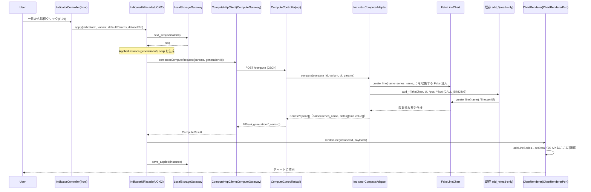
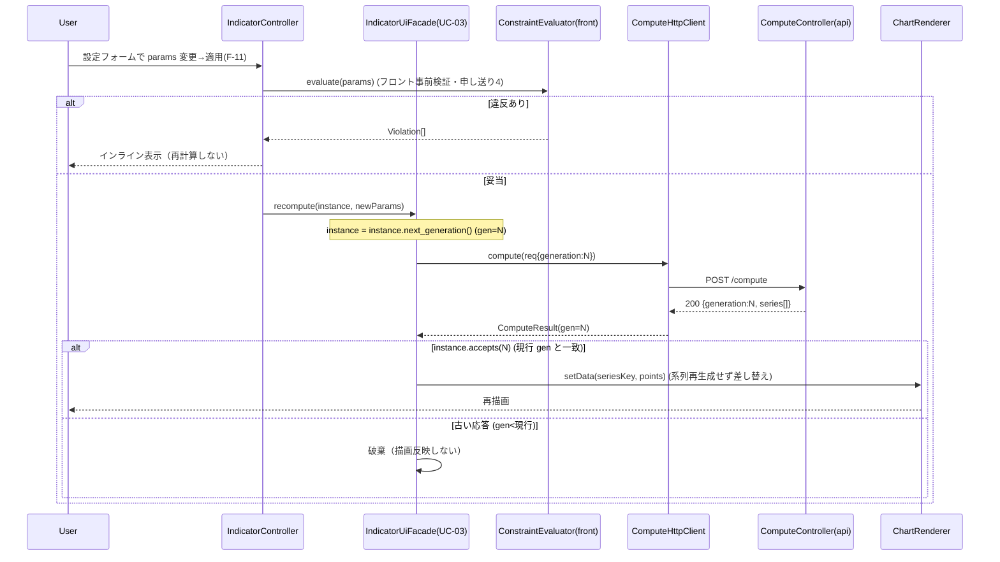
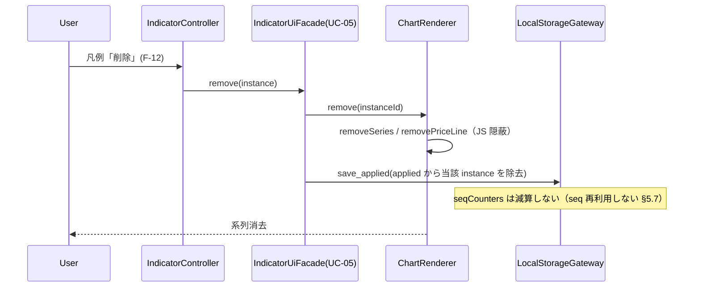
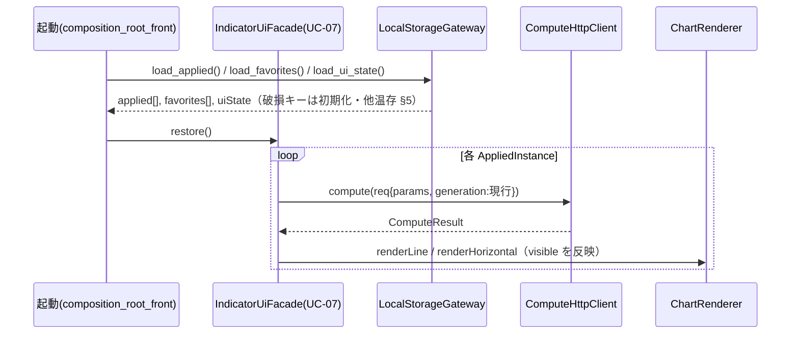
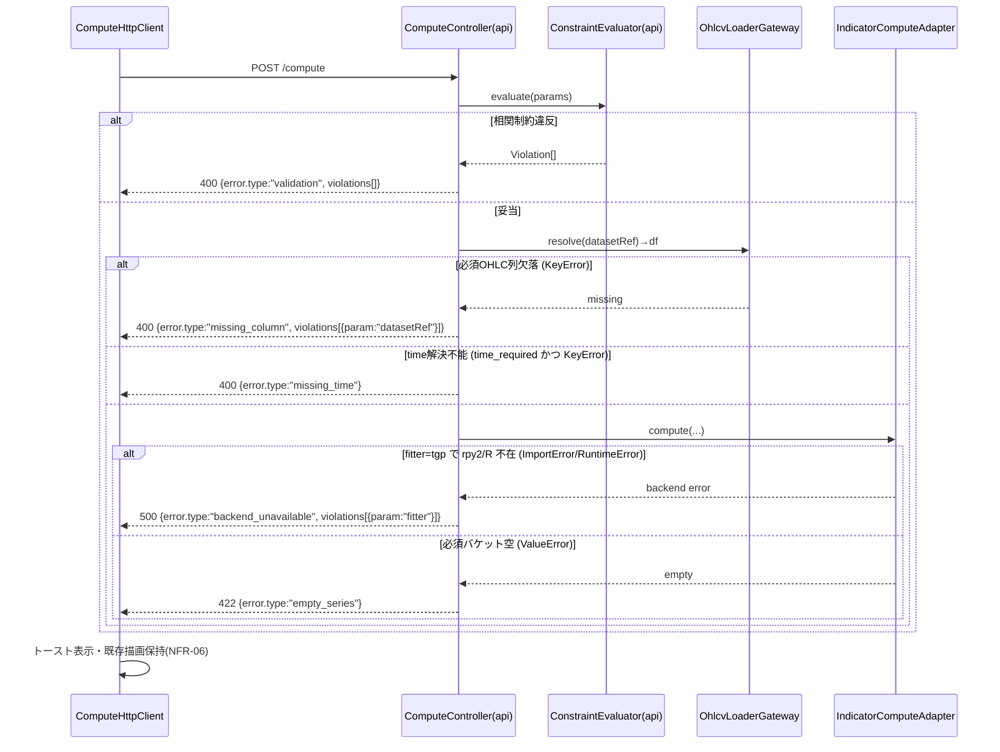
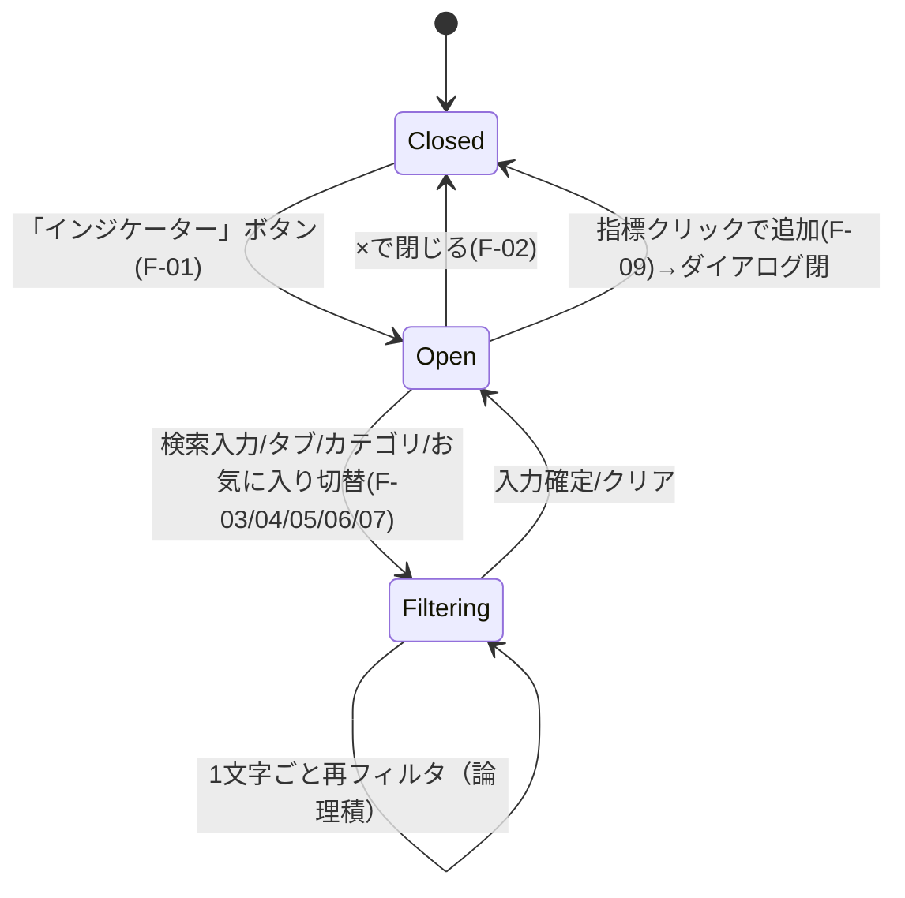
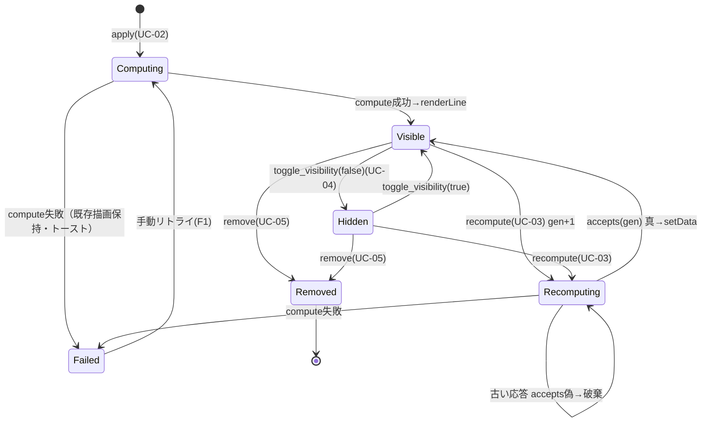

# チャート上インジケーター管理 UI 内部設計書

## 0. 文書情報

- 作成日：2026-06-07
- バージョン：v0.1.1（内部設計・構造検証フィードバック反映）
- 作成者：system-internal-design エージェント
- 承認者：（未承認 / 要ユーザー承認）
- 上位文書：
  - 基本設計書 `/workspaces/app/.doc/indicator-management-ui/基本設計書.md`（v0.2.1・判定「可」・確定）
  - architecture-executor 確定 Phase1 構造（クリーンアーキテクチャ：domain ← usecase ← adapter ← framework/driver、5 ポート、2 Composition Root）
- 基本方針：本書は基本設計で承認された範囲のみを実装可能粒度へ詳細化する。範囲拡大・技術スタック変更（lightweight-charts v4.1.3 固定）は行わない。全新規ファイルは `indigators/indicator_ui/` 配下に限定し、`lightweight-charts-python-main/` および既存 3 指標 `src/` は read-only（import のみ）。

### 0.1 変更履歴

| 版 | 日付 | 変更概要 |
|---|---|---|
| v0.1.1 | 2026-06-07 | 構造検証（architecture-executor / Phase3「合格」）の軽微改善 2 点をピンポイント反映（追記・明示のみ。構造・依存方向・クラス配置は不変）。改善1：F3（系列名不一致検出）の照合実行主体を §3.3 に明示（§3.3.5 `IndicatorController` 行に責務追記＋§3.3.6 新設でメソッド署名 `_validateSeriesNames` を確定。基準データ＝domain `SeriesDef.series_name`、実行＝front adapter 層、`source_column` 非使用を §3.1.2/§3.3.2/§6.3.2 と整合）。改善2：v4.1.3 の要確認項目を §10.3.1「実装時 read-only 確認チェックリスト」として明確化（(a) `LineStyle` enum 整数実値、(b) `createPriceLine` 引数名と horizontal_line 対応、(c) `lightweight-charts-python-main/` の bundled JS / abstract.py を read-only 参照で確定）。JS API 名・引数・実値は断定せず確認項目として記述。 |
| v0.1.0 | 2026-06-07 | 初版。Phase1 構造（5 ポート・FakeChart 注入・CALL_BINDING）を骨格として、domain/usecase/adapter のクラス設計・シーケンス・状態遷移・物理データモデル・IF 仕様・テスト設計を実装可能粒度で確定。Phase1 申し送り 6 点を反映。とりわけ申し送り点 3（SERIES_DEF の source_column / series_name 分離）を実コード実証（`profit_band/src/lwc_chart.py:136-137`）で確定し、基本設計 §5.5.3/F3 の「系列名＝出力列名」記述を内部設計で是正。 |

### 0.2 基本設計との差分（内部設計で是正した点）

| # | 基本設計の記述 | 是正内容 | 実コード根拠 |
|---|---|---|---|
| D-1 | §5.5.3 SERIES_DEF「系列名は出力列名と一致」、§10.1/F3「列名＝系列名」 | **不正確**。`profit_band` は値列名（`pOL_99`）と `create_line(name=...)` の系列名（`pOL 99%`）が**不一致**。SERIES_DEF を `source_column`（値列名）と `series_name`（描画系列名）の 2 属性に分離。F3（系列名不一致検出）は `series_name` 基準で判定する | `profit_band/src/lwc_chart.py:136` `col = f"{bucket}_{tag}"`（値列名・例 `pOL_99`）／`:137` `name = f"{bucket} {tag}%"`（系列名・例 `pOL 99%`）。`:138-145` `create_line(name=name, ...)` と `:147` `pd.DataFrame({"time":..., name: bands[col]...})` で**系列名 `name` と値列名 `col` を別物として使用** |
| D-2 | F3 を「`series[].name` がレジストリ SERIES_DEF の `name`/`name_pattern` に一致しない」で検出 | API は系列を生成する際に `series_name` を正規キーとして付与し、フロントは描画時に `series_name` をそのまま `addLineSeries` のラベルへ用いる。F3 は「API が SERIES_DEF.series_name 以外の名を返した契約違反」検出に限定（正常系の `pOL 99%` を誤検出しない） | 同上 |

---

## 1. 位置づけ・前提（基本設計／構造設計との関係、対象範囲）

### 1.1 本書の位置づけ

- 基本設計書（v0.2.1）が確定した「何を作るか（機能・データ・IF・非機能）」を入力に、architecture-executor が確定した「どの層にどう置くか（クリーンアーキテクチャ）」を骨格として、本書は「実装者がクラス名・メソッドシグネチャ・処理フローまで迷わず着手できる粒度」を確定する。
- 本書は計算 Python 側と Web フロント側の 2 つの Composition Root に分かれる設計を反映する。

### 1.2 対象範囲

| 区分 | 含む | 含まない |
|---|---|---|
| 対象 | レジストリ（domain メタデータ）、UC-01..07 のusecase、5 ポートの adapter 実装、FakeChart 注入、CALL_BINDING、localStorage 物理スキーマ、計算 API の HTTP/JSON 契約、テスト設計 | 実装コードそのもの、TDD 実行、性能実測（TBD-04）、vendor 取り込み方式（TBD-06）、Python API FW の最終選定（TBD-03） |
| 既存資産 | 既存 3 指標 `src/*.py` を import 読み取りで利用、PORTING_GUIDE の Fake 手法を流用 | 既存 `src/` の改変、`lightweight-charts-python-main/` の改変 |

### 1.3 前提（基本設計より引き継ぎ・実証済み）

| 前提 | 値 | 根拠 |
|---|---|---|
| チャート技術 | lightweight-charts **v4.1.3**（ペイン API 不在・time=UNIX 秒 int） | 基本設計 §3.3、`abstract.py:203` |
| 現 3 指標の配置 | 全て `overlay`（ペイン不要） | 基本設計 §4.5 |
| 既存 add\_\* 隔離 | duck typing（`create_line`/`horizontal_line` を持つ chart を要求） | `tgp_btlm/lwc_chart.py:42-43`、`price_range_power/lwc_chart.py:32-33`、PORTING_GUIDE §2 |
| 系列の NaN 方針 | 計算側 dropna 済みで JSON 化、欠落点として送出 | `tgp_btlm/lwc_chart.py:112`、`profit_band/lwc_chart.py:148` |

### 1.4 UC（ユースケース）一覧と機能対応

| UC | 名称 | 対応機能（基本設計） | Composition Root |
|---|---|---|---|
| UC-01 | 指標カタログ取得（一覧・検索・お気に入り対象） | F-05/06/07/08, FR-13 | フロント |
| UC-02 | 指標追加（適用） | F-09, FR-09 | フロント → API |
| UC-03 | 再計算（設定変更・generation 競合破棄） | F-11, FR-11 | フロント → API |
| UC-04 | 表示／非表示トグル | F-10, FR-10 | フロント |
| UC-05 | 削除 | F-12, FR-12 | フロント |
| UC-06 | お気に入り登録／解除 | F-07, FR-07 | フロント |
| UC-07 | 永続化／復元 | F-15, FR-15 | フロント |

---

## 2. パッケージ／ディレクトリ詳細

> 基本設計 §8.4 のディレクトリ案を実ファイル名粒度に展開。クリーンアーキテクチャの層名でサブパッケージを切る。全て `indigators/indicator_ui/` 配下。

### 2.1 ディレクトリツリー（実ファイル名）

```text
indigators/indicator_ui/
├── README.md
├── domain/                         # 【layer: domain（Entities）】内向き最深。外側参照ゼロ
│   ├── indicator_def.py            #   IndicatorDef / CategoryRef / ComputeEntry
│   ├── param_def.py                #   ParamDef / Constraint（相関制約・単一定義 §申し送り4）
│   ├── series_def.py               #   SeriesDef（source_column / series_name 分離 §申し送り3）
│   ├── applied_instance.py         #   AppliedInstance（generation/seq の不変ルール §申し送り5）
│   ├── favorite.py                 #   Favorite（削除済み：2026-07-18。favorites は id 配列で実装）
│   ├── compute_models.py           #   ComputeRequest / ComputeResult / SeriesPayload（plain DTO）
│   ├── validation.py               #   ConstraintEvaluator（CONSTRAINT 評価・フロント/APIで共有）
│   └── errors.py                   #   ドメイン例外（ValidationError/EmptySeriesError 等）
├── usecase/                        # 【layer: usecase（Interactor＋境界宣言）】domain のみ参照
│   ├── ports.py                    #   5 ポートの抽象宣言（Protocol/ABC）
│   ├── catalog_usecase.py          #   UC-01
│   ├── apply_usecase.py            #   UC-02
│   ├── recompute_usecase.py        #   UC-03（generation 競合判定）
│   ├── visibility_usecase.py       #   UC-04
│   ├── remove_usecase.py           #   UC-05
│   ├── favorite_usecase.py         #   UC-06
│   ├── persistence_usecase.py      #   UC-07
│   └── facade.py                   #   IndicatorUiFacade（UC 関数群の集約・YAGNI是正 §申し送りYAGNI）
├── adapter/                        # 【layer: adapter】usecase/domain 参照。外側 driver は注入で受ける
│   ├── api/                        #   ▼ Composition Root #1（API 側）
│   │   ├── compute_controller.py   #     ComputeController（HTTP→ComputeRequest 変換）
│   │   ├── indicator_compute_adapter.py # IndicatorComputeAdapter（既存 add_* 隔離点・FakeChart・CALL_BINDING）
│   │   ├── fake_chart.py           #     FakeLineChart / FakeHorizontalChart（系列仕様収集）
│   │   ├── call_binding.py         #     CALL_BINDING テーブル + fitter 実体化マップ
│   │   ├── ohlcv_loader_gateway.py #     既存 loader 経由の OHLCV 供給（datasetRef→実パス解決）
│   │   └── catalog_provider.py     #     IndicatorCatalogProvider（domain レジストリの提供）
│   └── front/                      #   ▼ Composition Root #2（フロント側・JS）
│       ├── indicator_controller.js #     IndicatorController（UI イベント→UC ファサード）
│       ├── chart_renderer.js       #     ChartRenderer（upstream 隔離点・JS API 名を隠蔽 §申し送り1）
│       ├── local_storage_gateway.js#     LocalStorageGateway（StatePersistencePort 実装）
│       ├── compute_http_client.js  #     ComputeHttpClient（ComputeGateway 実装・fetch）
│       ├── catalog_client.js       #     IndicatorCatalogClient（IndicatorCatalogPort 実装）
│       ├── constraint_eval.js      #     ConstraintEvaluator（domain と同一ロジックの JS 実装 §申し送り4）
│       └── domain_models.js        #     plain JS 版 ParamDef/SeriesDef/AppliedInstance（型のみ）
├── framework/                      # 【layer: framework/driver】最外。具体ドライバ
│   ├── api/
│   │   ├── http_server.py          #     HTTP サーバ起動（TBD-03：標準 http.server か軽量 FW）
│   │   └── composition_root_api.py #     API 側 Composition Root（依存配線）
│   └── front/
│       ├── index.html              #     エントリ HTML
│       ├── composition_root_front.js#    フロント側 Composition Root（依存配線）
│       ├── css/
│       └── vendor/                 #     upstream JS の read-only 参照配置（取り込み方式 TBD-06）
└── tests/
    ├── domain/                     #   単体：ConstraintEvaluator / SeriesDef / AppliedInstance
    ├── adapter/                    #   単体：CALL_BINDING / FakeChart 収集
    ├── integration/                #   結合：API ↔ 既存 add_*（3 指標）
    └── e2e/                        #   E2E：ダイアログ→描画（xvfb ヘッドレス）
```

### 2.2 各パッケージの import ルール（依存方向の構造的担保）

| パッケージ | import 可 | import 禁止 | 担保方法 |
|---|---|---|---|
| `domain/` | 標準ライブラリのみ（`dataclasses`/`typing`/`enum`/`math`） | usecase/adapter/framework、pandas、numpy、JS 型、HTTP 型、localStorage、`lightweight_charts`、既存指標 `src/` | §9 の import lint で `domain/` からの外向き import を 0 件強制 |
| `usecase/` | `domain/` のみ。ポートは `usecase/ports.py` の抽象に依存 | adapter/framework の具象、外部ライブラリ I/O | ポート経由でのみ外側へアクセス |
| `adapter/api/` | `usecase/`, `domain/`, 既存指標 `src/`（import 読み取り）、pandas/numpy | `lightweight_charts`（描画ライブラリ） | IndicatorComputeAdapter は FakeChart 注入で描画ライブラリ非依存（PORTING_GUIDE §2 を踏襲） |
| `adapter/front/` | `usecase` 相当の JS ファサード、`domain_models.js` | upstream JS API 名を `chart_renderer.js` 以外で参照禁止（§申し送り1） | ChartRenderer 以外のファイルで `addLineSeries`/`createPriceLine` 等を grep 0 件強制（§9） |
| `framework/` | 全層（配線のため） | — | Composition Root のみ |

- **既存指標 `src/` の import 形式**：PORTING_GUIDE §7 準拠で `sys.path.insert(0, <indicator_dir>)` → `from src import ...` をアダプタ内に閉じる。改変は行わない。

---

## 3. クラス設計（層別）

### 3.1 domain 層

> 全て plain（標準ライブラリのみ）。`@dataclass(frozen=True)`（PORTING_GUIDE §2「DTO は不変」）。pandas/numpy/JS/HTTP/localStorage を参照しない（§申し送り6）。

#### 3.1.1 ParamDef / Constraint（param_def.py）

```python
class ParamType(Enum):
    INT="int"; FLOAT="float"; ENUM="enum"; BOOL="bool"
    STRING="string"; COLOR="color"; FLOAT_LIST="float_list"; ENUM_LIST="enum_list"

class ConstraintKind(Enum):
    LT="lt"; LTE="lte"; GT="gt"; GTE="gte"
    RANGE_OPEN="range_open"; MIN_VALUE="min_value"; CONDITIONAL="conditional"

@dataclass(frozen=True)
class Constraint:
    kind: ConstraintKind
    operands: tuple[object, ...]      # パラメータ名(str) または定数(number)
    message_key: str                  # i18n キー（違反メッセージ）
    when: "Constraint | None" = None  # CONDITIONAL 用の前提条件

@dataclass(frozen=True)
class ParamDef:
    name: str                         # add_* の引数名と一致（例 "q_low"）
    label_key: str                    # i18n キー
    type: ParamType
    default: object
    min: float | None = None
    max: float | None = None
    enum_values: tuple[object, ...] | None = None
    ui_visible: bool = True           # false=内部専用（例 time_column）
    constraints: tuple[Constraint, ...] = ()
```

- 責務：1 パラメータの宣言と、それに紐づく相関制約の**単一定義**（§申し送り4）。フロント JS（`constraint_eval.js`）と API（`validation.py`）は本定義を共有する。

#### 3.1.2 SeriesDef（series_def.py）— ★ 申し送り点3 是正の核心

```python
class SeriesKind(Enum):
    LINE="line"; HORIZONTAL_LINE="horizontal_line"

class LineStyle(Enum):
    SOLID="solid"; DOTTED="dotted"; DASHED="dashed"

@dataclass(frozen=True)
class SeriesDef:
    kind: SeriesKind
    source_column: str | None          # 計算結果 DataFrame の値列名（例 "pOL_99"）。dynamic 時はパターン
    series_name: str | None            # 描画系列名 = create_line(name=...) の値（例 "pOL 99%"）
    dynamic: bool                      # params 依存で本数可変か
    source_column_pattern: str | None = None  # dynamic 時の列名生成規則（例 "{bucket}_{percent}"）
    series_name_pattern: str | None = None     # dynamic 時の系列名生成規則（例 "{bucket} {percent}%"）
    style: LineStyle | None = None     # line で必須
    width: int | None = None
    color_rule: str | None = None      # 固定色 or 規則識別子（alpha/bull-bear）
    price_scale_id: str | None = None  # 現 3 指標は None（主スケール）
    axis_label_visible: bool = False   # horizontal_line 用（描画側固定 false）
```

- **是正理由（実証）**：`profit_band/src/lwc_chart.py:136-137` で `col = f"{bucket}_{tag}"`（値列名・例 `pOL_99`）と `name = f"{bucket} {tag}%"`（系列名・例 `pOL 99%`）が**別物として**使われている。`source_column` は計算結果 DataFrame から値を取り出すキー、`series_name` は lightweight-charts の系列ラベル（時系列 JSON の `name` フィールド）。両者を 1 属性に潰すと正常系で F3 誤検出が起こる（§0.2 D-1/D-2）。
- **F3 検出の正しい基準**：API が返す `SeriesPayload.name` は **`series_name`（または `series_name_pattern` 展開結果）**に一致しなければならない。`source_column` には一致を要求しない。

##### 3 指標の SeriesDef マッピング（確定値・実コード根拠）

| 指標 | kind | source_column / pattern | series_name / pattern | dynamic | 根拠 |
|---|---|---|---|---|---|
| `tgp_btlm` mean | line | `btlm_mean` | `btlm_mean` | false（名は固定） | `core.py:40,43-45`、`lwc_chart.py:96,101`（name=value 列名）。**一致するが分離属性に同値を入れる** |
| `tgp_btlm` lower | line | `btlm_q{round(q_low*100)}` | 同左 | semi（q 依存） | `core.py:48-50` `quantile_column`、`lwc_chart.py:97,102` |
| `tgp_btlm` upper | line | `btlm_q{round(q_high*100)}` | 同左 | semi（q 依存） | 同上 `:98,103` |
| `profit_band` 各系列 | line | `{bucket}_{percent}`（例 `pOL_99`） | **`{bucket} {percent}%`（例 `pOL 99%`）** | true（bucket×prob） | **`lwc_chart.py:136`（col）／`:137`（name）— 不一致** |
| `profit_band` robust 各系列 | line | `{bucket}_{percent}` | `{bucket} {percent}%` | true | `robust_bands.py:163`（列名同形）→ `lwc_chart.py:193` が `add_profit_band` に委譲し同じ `:136-137` を通る（**robust も同一規約**） |
| `price_range_power` 各帯 | horizontal_line | （該当なし・水平価格ライン） | API 内部キー `bull#{i}`/`bear#{i}`（描画は text ラベル） | true（最大 2×top_n） | `lwc_chart.py:84-93`（`horizontal_line(price=..., text=f"BULL ...")`、系列名フィールドは持たず price/text/color） |

- **robust 系列名の確認結果（要確認事項の決着）**：`add_robust_profit_band`（`lwc_chart.py:158-200`）は `build_robust_bands`（`robust_bands.py:91-165`）で `{bucket}_{percent}` 列の DataFrame を作り（`:163`）、`:193-200` で `add_profit_band(chart, df, ..., bands=bands)` に委譲する。描画は `add_profit_band` の `:130-150` を通るため、**robust も global と完全に同一の命名規約**（source_column=`{bucket}_{percent}`、series_name=`{bucket} {percent}%`）。robust 固有の系列名規約は存在しない。→ 要確認は解消。

#### 3.1.3 IndicatorDef / ComputeEntry（indicator_def.py）

```python
class Tab(Enum): INDICATOR="indicator"; STRATEGY="strategy"; PROFILE="profile"; PATTERN="pattern"
class Placement(Enum): OVERLAY="overlay"; PANE="pane"
class Group(Enum): PERSONAL="personal"; BUILTIN="builtin"; COMMUNITY="community"

@dataclass(frozen=True)
class CategoryRef:
    group: Group
    name_key: str

@dataclass(frozen=True)
class ComputeEntry:
    compute_id: str
    required_columns: tuple[str, ...]          # 全 3 指標 ("open","high","low","close")
    time_required: bool                        # line=true, price_range_power=false
    backend_param: str | None = None           # tgp_btlm="fitter"、他 None
    variants: tuple[str, ...] = ("default",)   # profit_band=("global","robust")
    # call_binding は variant ごとに引ける（adapter 側 CALL_BINDING テーブルと compute_id で対応）

@dataclass(frozen=True)
class IndicatorDef:
    id: str
    display_name_key: str
    category: CategoryRef
    tab: Tab
    placement: Placement
    params: tuple[ParamDef, ...]
    series: tuple[SeriesDef, ...]
    compute: ComputeEntry
    description_key: str | None = None
```

- 責務：レジストリ 1 件。`IndicatorCatalogProvider`（adapter）が `tuple[IndicatorDef, ...]` を提供する。検索・フィルタ（UC-01）は `series`/`params` を読まず `id`/`display_name` を対象（基本設計 §4.6）。

#### 3.1.4 AppliedInstance（applied_instance.py）— ★ 申し送り点5（generation を domain 不変ルールに）

```python
@dataclass(frozen=True)
class AppliedInstance:
    instance_id: str                  # "{indicatorId}#{seq}"（§5.7）
    indicator_id: str
    variant: str                      # "default"/"global"/"robust"
    params: tuple[tuple[str, object], ...]  # 不変化した {name:value}（dict は frozen 化のため tuple-of-pairs）
    visible: bool
    generation: int                   # 再計算世代（単調増加）。HTTP/JS 由来でない純粋整数
    seq: int
    created_at: str                   # ISO8601 文字列（domain は時計を持たない・値で受ける）

    def next_generation(self) -> "AppliedInstance":
        return replace(self, generation=self.generation + 1)

    def accepts(self, response_generation: int) -> bool:
        """応答の generation が現行と一致する時のみ描画反映を許す（§6.6 レース対策）。"""
        return response_generation == self.generation
```

- **不変ルール（domain に集約）**：generation は単調増加し、`accepts()` で「現行 generation と一致する応答のみ採用」を判定する。`AbortController` 等 HTTP/JS の都合は domain に混入させない（§申し送り5）。recompute_usecase は本ルールを呼ぶだけ。

#### 3.1.5 ConstraintEvaluator（validation.py）— ★ 申し送り点4（単一定義）

```python
@dataclass(frozen=True)
class Violation:
    param: str
    constraint: str        # 例 "lt(q_low,q_high)"
    expected: str          # 例 "q_low<q_high"
    actual: object

class ConstraintEvaluator:
    @staticmethod
    def evaluate(params: ParamDef_seq, values: Mapping[str, object]) -> list[Violation]:
        """全 ParamDef.constraints を評価し違反を列挙。空 list = 妥当。"""
```

- 責務：CONSTRAINT 評価の**唯一の実装**。API 入口（§7.3）とフロント事前検証（F-11）は同一ロジックを共有。JS 側 `constraint_eval.js` は本仕様の移植（同一テストベクタで一致検証＝§8 結合テスト T-INT-5）。

### 3.2 usecase 層

> domain のみ参照。ポートは `ports.py` の抽象に依存。独立 Presenter 層は作らない（YAGNI是正・変換は Controller/Renderer 内）。UC ごとの独立 Input Boundary を 7 本に強制せず、UC 関数群＋ファサードで構成。

#### 3.2.1 5 ポート抽象（ports.py）

| ポート | 種別 | 主要メソッド（疑似署名） | 実装（adapter） |
|---|---|---|---|
| `ComputeGateway` | プロセス境界（計算 Python ⇔ フロント JS） | `compute(req: ComputeRequest) -> ComputeResult` | フロント：`ComputeHttpClient`（fetch）／API 側受け口：`ComputeController` |
| `ChartRendererPort` | 描画（upstream 隔離点・唯一） | `render_line(instance_id, SeriesPayload[])`, `render_horizontal(instance_id, HLinePayload[])`, `set_data(seriesKey, points)`, `set_visible(instance_id, bool)`, `remove(instance_id)` | `ChartRenderer`（JS。`addLineSeries`/`createPriceLine` を内部に隠蔽） |
| `StatePersistencePort` | localStorage（nextSeq 含む） | `load_applied()`, `save_applied(...)`, `load_favorites()`, `save_favorites(...)`, `next_seq(indicator_id) -> int`, `load_ui_state()`, `save_ui_state(...)` | `LocalStorageGateway` |
| `IndicatorCallBinding` | 既存 add\_\* 差分吸収（隔離点・唯一） | `invoke(compute_id, variant, fake_chart, df, params) -> None` | `IndicatorComputeAdapter`（CALL_BINDING + FakeChart） |
| `IndicatorCatalogPort` | レジストリ提供 | `list_indicators() -> tuple[IndicatorDef,...]`, `get(id) -> IndicatorDef` | フロント：`IndicatorCatalogClient`／API 側：`IndicatorCatalogProvider` |

#### 3.2.2 UC Interactor（各 *_usecase.py）

| UC | 関数（疑似署名） | 依存ポート | 主要処理 |
|---|---|---|---|
| UC-01 | `list_for_view(filter: CatalogFilter) -> IndicatorDef[]` | IndicatorCatalogPort | タブ∧カテゴリ∧検索語∧お気に入りの論理積（§4.6）。検索＝id/表示名の部分一致・大小無視 |
| UC-02 | `apply(indicator_id, variant, params, dataset_ref) -> AppliedInstance` | IndicatorCatalogPort, ComputeGateway, ChartRendererPort, StatePersistencePort | seq 採番→generation=0→compute→ChartRenderer 描画→persist |
| UC-03 | `recompute(instance: AppliedInstance, new_params) -> AppliedInstance` | 同上（ChartRenderer.set_data 利用） | `next_generation()`→検証→compute→**`accepts()` 真なら** set_data 差し替え。偽なら破棄 |
| UC-04 | `toggle_visibility(instance, visible) -> AppliedInstance` | ChartRendererPort, StatePersistencePort | set_visible→persist |
| UC-05 | `remove(instance) -> None` | ChartRendererPort, StatePersistencePort | ChartRenderer.remove→applied から除去（seqCounters は減算しない §5.7） |
| UC-06 | `toggle_favorite(indicator_id) -> str[]` | StatePersistencePort | favorites 集合 add/remove→persist |
| UC-07 | `restore() -> AppliedInstance[]` / `persist_all()` | StatePersistencePort, ComputeGateway, ChartRendererPort | 起動時：applied 復元→各 instance を再計算して再描画 |

- **ファサード**（`facade.py`）：`IndicatorUiFacade` が上記 UC 関数群を集約し、フロント `IndicatorController` から単一窓口で呼ぶ。

#### 3.2.3 入出力 Model（plain）

- 入力：`ComputeRequest`（indicatorId, variant, params, datasetRef, range, generation）。
- 出力：`ComputeResult`（ok, generation, series: `SeriesPayload[]` または error）。
- これらは domain の `compute_models.py` に置く plain DTO。pandas/HTTP/JS 型は持たない（§申し送り6。アダプタが変換）。

### 3.3 adapter 層

#### 3.3.1 IndicatorComputeAdapter（adapter/api/indicator_compute_adapter.py）— ★ 申し送り点2（既存 add\_\* 隔離点・唯一）

- 責務：`IndicatorCallBinding` ポートの実装。**CALL_BINDING と FakeChart 注入をここに閉じる**。既存 `src/` は import のみ・改変禁止。
- 属性：`call_binding_table`（`call_binding.py`）、`fitter_factory`（enum→実体）。
- 主要メソッド：

```python
class IndicatorComputeAdapter:  # implements IndicatorCallBinding
    def compute(self, compute_id: str, variant: str,
                df: "pandas.DataFrame", params: dict) -> list[SeriesPayload]:
        binding = self.call_binding_table.resolve(compute_id, variant)
        fake = self._make_fake_chart(binding.output_kind)   # line→FakeLineChart / hl→FakeHorizontalChart
        pos, kw = self._split_args(binding, params, df, fake)  # CALL_BINDING に従い位置/キーワード二分
        binding.callable(*pos, **kw)                          # 既存 add_* を一意・決定論的に呼ぶ（描画せず収集）
        return fake.to_payloads()                             # 収集した系列仕様を SeriesPayload へ変換
```

- **FakeChart 注入の根拠**：既存 add\_\* は `create_line`/`horizontal_line` を持つ chart を duck typing で要求する（`tgp_btlm/lwc_chart.py:42-43`、`price_range_power/lwc_chart.py:32-33`）。API 経路では描画せず「呼ばれた系列仕様を収集する Fake chart」を注入し系列 JSON へ変換する（PORTING_GUIDE §7 と同手法）。

#### 3.3.2 FakeChart（adapter/api/fake_chart.py）

```python
class _FakeLine:
    def __init__(self, name, **style): self.name=name; self.style=style; self.points=None
    def set(self, df): self.points = df            # add_btlm/add_profit_band は line.set(df) を呼ぶ

class FakeLineChart:                               # create_line を持つ duck type
    def create_line(self, name, **kwargs) -> _FakeLine: ...   # 収集
    def legend(self, visible): ...                # add_profit_band の legend 呼び出し吸収（lwc_chart.py:152-153）
    def to_payloads(self) -> list[SeriesPayload]:
        # 各 _FakeLine から series_name=name、data=[{time,value}]（NaN は呼び元 dropna 済み）を構築
        ...

class FakeHorizontalChart:                        # horizontal_line を持つ duck type
    def horizontal_line(self, price, **kwargs): ...           # price/color/width/style/text/axis_label_visible 収集
    def to_payloads(self) -> list[HLinePayload]: ...
```

- 収集対象（実コード対応）：
  - line：`name`（=series_name）、`color`/`style`/`width`、`set(df)` の DataFrame の `time` 列と値列（値列名 = `name`）。→ §6.5.2 `line` 応答に変換。
  - horizontal_line：`price`/`color`/`width`/`style`/`text`/`axis_label_visible`（`price_range_power/lwc_chart.py:85-93`）。→ §6.5.2 `horizontal_line` 応答に変換。
- **重要**：FakeLineChart は `name`（series_name）を収集し、`set(df)` の DataFrame は値列名 = `name`（`profit_band/lwc_chart.py:147` は `pd.DataFrame({"time":..., name: ...})`）なので、FakeChart は series_name をそのまま JSON の `name` に載せればよく、source_column は API 内部のみで使われ外に漏れない（§申し送り3 と整合）。

#### 3.3.3 CALL_BINDING テーブル（adapter/api/call_binding.py）— ★ 申し送り点2

- 構造：`compute_id`（+variant）→ `{callable, positional, keyword, output_kind}`。
- 確定値（基本設計 §5.5.4.1 実証・本書で再確認）：

| compute_id / variant | callable | positional | keyword | output_kind |
|---|---|---|---|---|
| `tgp_btlm` | `add_btlm` | `[chart, df, <fitter実体>]`（fitter は enum→実体化後・第3位置） | `[price, maxbars, q_low, q_high, time_column, color]` | line |
| `profit_band` / global | `add_profit_band` | `[chart, df]` | `[probabilities, buckets, time_column, require_full, legend]` | line |
| `profit_band` / robust | `add_robust_profit_band` | `[chart, df]` | `[probabilities, buckets, normalize, window, atr_period, min_obs, time_column, legend]` | line |
| `price_range_power` | `add_price_range_power` | `[chart, df]` | `[interval, range_from, range_to, top_n, bull_color, bear_color, width]` | horizontal_line |

- 実コード根拠：`tgp_btlm/lwc_chart.py:63-73`（fitter が `*` の手前＝位置3）、`profit_band/lwc_chart.py:89-98`・`158-169`（`*` 以降キーワード専用）、`price_range_power/lwc_chart.py:36-46`（同）。
- **fitter 実体化マップ**（`fitter_factory`）：`"ols" → OlsBtlmFitter()`（`tgp_btlm/src/__init__.py:39`）、`"tgp" → TgpBtlmFitter()`（`:38`）。実体化失敗（`tgp` で rpy2/R 不在）は `backend_unavailable`（500）へ翻訳（§7.4 例外翻訳表）。

#### 3.3.4 ChartRenderer（adapter/front/chart_renderer.js）— ★ 申し送り点1（upstream 隔離点・唯一）

- 責務：`ChartRendererPort` の唯一の実装。**`addLineSeries`/`createPriceLine`/`setData`/`applyOptions` 等の lightweight-charts v4.1.3 JS API 名をこのファイルの外へ漏らさない**。v5 移行時も波及をこの 1 アダプタに限定。
- 主要メソッド（外向き契約は port 署名・内部で JS API を呼ぶ）：

| メソッド | 内部 JS（v4.1.3・隠蔽対象） | 備考 |
|---|---|---|
| `renderLine(instanceId, payloads[])` | `chart.addLineSeries({color,lineStyle,lineWidth,...})` → `series.setData(points)` | 系列キー＝`{instanceId}::{series_name}`（§5.7 衝突回避）。`series_name` を表示ラベルに使用（F3 は series_name 基準） |
| `renderHorizontal(instanceId, hlines[])` | `mainSeries.createPriceLine({price,color,lineWidth,lineStyle,title:text,axisLabelVisible:false})` | `price_range_power` 用 |
| `setData(seriesKey, points)` | `series.setData(points)` | UC-03 再計算の差し替え（系列再生成しない） |
| `setVisible(instanceId, visible)` | `series.applyOptions({visible})` / priceLine 再生成 | UC-04 |
| `remove(instanceId)` | `chart.removeSeries(series)` / `series.removePriceLine(pl)` | UC-05 |

- lineStyle マッピング（domain `LineStyle`→ v4.1.3 enum）も本ファイル内に閉じる（`solid→0, dotted→1, dashed→2` 等。実値は実装時に v4.1.3 の `LineStyle` 定数で確定＝要確認）。

#### 3.3.5 その他 adapter

| クラス | ポート | 責務 |
|---|---|---|
| `ComputeHttpClient`（front） | ComputeGateway | `ComputeRequest`→fetch POST→`ComputeResult`。HTTP/JSON↔plain 変換。タイムアウト（F1）・不正 JSON（F2）翻訳 |
| `ComputeController`（api） | ComputeGateway 受け口 | HTTP Request→`ComputeRequest`→facade→`ComputeResult`→HTTP Response。例外→§6.5.3 エラー JSON 翻訳 |
| `LocalStorageGateway`（front） | StatePersistencePort | §5 物理スキーマの読み書き・破損時フォールバック・seq 採番 |
| `IndicatorCatalogProvider`（api）/`IndicatorCatalogClient`（front） | IndicatorCatalogPort | レジストリ提供（API 化 or 静的：TBD-03） |
| `OhlcvLoaderGateway`（api） | （内部） | `datasetRef`→ホワイトリスト実パス解決→既存 `loader.load_ohlc_csv` で DataFrame 化（§7.3 パストラバーサル対策） |
| `IndicatorController`（front） | — | UI イベント→facade。Presenter を作らずここで表示変換。**F3（系列名不一致検出）の照合実行主体**（下記 3.3.6 で署名確定） |

#### 3.3.6 F3（系列名不一致検出）の照合実行主体 ★ 申し送り点3（フロント adapter 層に確定）

- **責務の所在（構造維持）**：F3 照合の**実行**は front adapter 層の `IndicatorController` に置く。`ChartRenderer`（§3.3.4・upstream 隔離点）にも domain/usecase にも検出ロジックを置かない。照合の**基準データ**は domain の `SeriesDef.series_name`（§3.1.2）であり、`IndicatorController` はこれを参照のみで使う（domain 側に判定ロジックを持たせない）。`source_column` は API 内部に留め、照合には一切使わない（§3.1.2／§3.3.2／§6.3.2 と整合）。
- **照合の定義**：計算 API 応答（§6.3.2 `SeriesPayload[]`）の各 `series[].name` を、適用中インスタンス（`AppliedInstance.indicator_id` → `IndicatorDef.series_defs`）の `SeriesDef.series_name`（dynamic は `series_name_pattern` の展開結果）の集合と突合し、**集合に含まれない系列名はスキップ（`renderLine` に渡さない）し `console.warn` で記録**する。正常系（例 `pOL 99%`）は誤検出しない（§0.2 D-2）。
- **メソッド署名（front adapter・JS）**：

```js
class IndicatorController {
  // payloads: ComputeResult.series[]（{name, kind, data|hlines}）
  // def: 適用中 IndicatorDef（series_defs を持つ）
  // 返り値: F3 通過系列のみ（不一致系列は除外）。副作用として console.warn を記録
  _validateSeriesNames(payloads, def) {
    const expected = this._expectedSeriesNames(def);      // SeriesDef.series_name（dynamic は pattern 展開）の集合
    return payloads.filter(p => {
      const ok = expected.has(p.name);
      if (!ok) console.warn(`[F3] 系列名不一致のためスキップ: instance=${def.indicator_id} name=${p.name}`);
      return ok;                                          // 一致系列のみ renderLine へ
    });
  }
  // 描画前に必ず通す：renderLine(instanceId, this._validateSeriesNames(payloads, def)) の順
}
```

- **`source_column` 非使用の根拠（実コード）**：`profit_band/src/lwc_chart.py:136`（`col = f"{bucket}_{tag}"`＝値列名 `pOL_99`）と `:137`（`name = f"{bucket} {tag}%"`＝系列名 `pOL 99%`）は別物であり、API 応答 `name` に載るのは `series_name`（`:139` `create_line(name=name,...)`／`:147` `pd.DataFrame({... name: ...})`）。照合は `series_name` のみを基準とし `source_column`（`pOL_99`）を突合に使わないことで、正常系の誤検出を防ぐ（§3.1.2 是正理由と同根拠）。

### 3.4 クラス図（mermaid）

```mermaid
classDiagram
  direction LR

  class IndicatorDef
  class ParamDef
  class Constraint
  class SeriesDef {
    +SeriesKind kind
    +str source_column
    +str series_name
    +bool dynamic
  }
  class ComputeEntry
  class AppliedInstance {
    +int generation
    +int seq
    +accepts(int) bool
    +next_generation() AppliedInstance
  }
  class Favorite (削除済み：2026-07-18)
  class ConstraintEvaluator
  class ComputeRequest
  class ComputeResult
  class SeriesPayload

  IndicatorDef "1" --> "*" ParamDef
  IndicatorDef "1" --> "*" SeriesDef
  IndicatorDef "1" --> "1" ComputeEntry
  ParamDef "1" --> "*" Constraint
  AppliedInstance --> IndicatorDef : indicator_id
  ConstraintEvaluator ..> ParamDef : evaluates

  class ComputeGateway
  class ChartRendererPort
  class StatePersistencePort
  class IndicatorCallBinding
  class IndicatorCatalogPort
  <<interface>> ComputeGateway
  <<interface>> ChartRendererPort
  <<interface>> StatePersistencePort
  <<interface>> IndicatorCallBinding
  <<interface>> IndicatorCatalogPort

  class ApplyUseCase
  class RecomputeUseCase
  class IndicatorUiFacade
  ApplyUseCase ..> ComputeGateway
  ApplyUseCase ..> ChartRendererPort
  ApplyUseCase ..> StatePersistencePort
  ApplyUseCase ..> IndicatorCatalogPort
  RecomputeUseCase ..> AppliedInstance : accepts()
  IndicatorUiFacade --> ApplyUseCase
  IndicatorUiFacade --> RecomputeUseCase

  class IndicatorComputeAdapter
  class FakeLineChart
  class FakeHorizontalChart
  class ChartRenderer
  class ComputeHttpClient
  class LocalStorageGateway
  IndicatorComputeAdapter ..|> IndicatorCallBinding
  IndicatorComputeAdapter --> FakeLineChart : injects
  IndicatorComputeAdapter --> FakeHorizontalChart : injects
  ChartRenderer ..|> ChartRendererPort
  ComputeHttpClient ..|> ComputeGateway
  LocalStorageGateway ..|> StatePersistencePort

  class add_btlm
  class add_profit_band
  class add_price_range_power
  IndicatorComputeAdapter ..> add_btlm : duck-typed call (read-only)
  IndicatorComputeAdapter ..> add_profit_band : read-only
  IndicatorComputeAdapter ..> add_price_range_power : read-only
```

---

## 4. シーケンス設計（mermaid）

### 4.1 UC-02 指標追加（正常系：フロント→ComputeGateway→API→FakeChart→add\_\*→系列JSON→ChartRenderer描画）



### 4.2 UC-03 再計算＋generation 競合の破棄



- 競合シナリオ：スライダー連続操作で gen=N の後すぐ gen=N+1 を発行。gen=N の応答が gen=N+1 より遅れて届いても `accepts(N)` は false（現行=N+1）で破棄（§6.6・申し送り5）。

### 4.3 UC-05 削除



### 4.4 UC-07 永続化／復元



### 4.5 エラー経路（validation / missing_column / missing_time / backend_unavailable）



- 翻訳の出所（実コード）：missing_column＝`profit_band/src/bands.py:62`・`price_range_power/src/ratio.py:92` の `KeyError`／missing_time＝`tgp_btlm/lwc_chart.py:52,60`・`profit_band/lwc_chart.py:76,84` の `KeyError`／backend_unavailable＝`TgpBtlmFitter` の rpy2/R 依存（`__init__.py:38`）。

---

## 5. 状態遷移（mermaid）

### 5.1 ダイアログ開閉・検索（UI 状態）



### 5.2 AppliedInstance ライフサイクル（追加→表示/非表示→再計算→削除）



---

## 6. 物理データモデル

### 6.1 localStorage 物理スキーマ（確定）

> 全キーに `indicatorUi.` プレフィックス＋末尾 `.v{N}`（基本設計 §5.6）。`LocalStorageGateway` が唯一の読み書き点。

| キー | JSON スキーマ | 原子性単位 |
|---|---|---|
| `indicatorUi.schemaVersion` | `{"version": <int>}` | 全体版管理 |
| `indicatorUi.favorites.v1` | `{"ids": string[]}` | お気に入り全体 |
| `indicatorUi.applied.v1` | `{"instances": AppliedInstanceJSON[]}` | **配列要素＝インスタンス単位**（読み→該当差替→全体書き戻し） |
| `indicatorUi.seqCounters.v1` | `{"counters": {<indicatorId>: <lastSeq:int>}}` | 指標 id 単位（発行済み最大 seq の永続カウンタ） |
| `indicatorUi.uiState.v1` | `{"lastTab": string, "lastCategory": string, "dialogOpen": bool}` | UI 状態全体 |

`AppliedInstanceJSON`：
```json
{ "instanceId": "profit_band#3", "indicatorId": "profit_band", "variant": "global",
  "params": { "probabilities": [0.95,0.99], "buckets": ["pOL","nOH"] },
  "visible": true, "generation": 2, "seq": 3, "createdAt": "2026-06-07T00:00:00Z" }
```

### 6.2 バージョニング・マイグレーション・破損時挙動

| 事象 | 挙動 | 根拠 |
|---|---|---|
| 旧版検出 | `schemaVersion` < 現行 → 版ごと変換を順次適用 | §5.6 前方互換 |
| 未知上位版 | 温存・解釈不能領域は無視（データ喪失防止） | 同 |
| パース失敗/スキーマ不一致 | **当該キーのみ初期化**（空既定）、他キー温存、console 警告。全消去しない | §5.6・CLAUDE.md 破壊的変更回避 |
| `seqCounters.v1` 不在 | `applied.v1` 各指標の現存最大 seq（無ければ 0）で一度だけ再構築 | §5.7 マイグレーション |
| `seqCounters.v1` 破損 | 当該キー初期化するが各 `lastSeq` は `applied.v1` 現存最大 seq 以上に設定（衝突回避） | §5.7 破損時 |
| QuotaExceeded | F5：通知し当該書き込み中止、メモリ状態保持 | §7.2.1 F5 |

- **seq 採番（`next_seq`）**：`next = (counters[indicatorId] ?? 0) + 1` を計算し、同時に `counters[indicatorId] = next` を永続化。全削除後も単調増加（§5.7・H-2）。

### 6.3 計算 API リクエスト/レスポンス/エラー JSON（確定スキーマ）

#### 6.3.1 リクエスト（POST /compute）
```json
{ "indicatorId": "string", "variant": "string|null", "params": { "<name>": "<value>" },
  "datasetRef": "string", "range": {"from": 0, "to": 0}, "generation": 0 }
```

#### 6.3.2 正常応答 200 — kind=line（tgp_btlm / profit_band）
```json
{ "ok": true, "generation": 0, "series": [
  { "name": "pOL 99%", "kind": "line", "style": "solid", "width": 1, "color": "rgba(...)",
    "data": [ {"time": 1277769600, "value": 1.234}, ... ] } ] }
```
- `name` = **SERIES_DEF.series_name**（例 `pOL 99%`、`btlm_mean`）。`source_column`（`pOL_99`）は応答に**出さない**（API 内部のみ）。NaN は `data` から除外済み。

#### 6.3.3 正常応答 200 — kind=horizontal_line（price_range_power）
```json
{ "ok": true, "generation": 0, "series": [
  { "name": "price_range_power", "kind": "horizontal_line", "lines": [
    {"price": 1.2345, "color": "rgba(46,158,91,0.9)", "width": 2, "style": "solid",
     "text": "BULL 12.34", "axis_label_visible": false}, ... ] } ] }
```
- `axis_label_visible` 固定 `false`（`price_range_power/lwc_chart.py:87,92`）。勢力 0 帯は非描画（`:80-81`）。

#### 6.3.4 エラー応答（4xx/5xx）
```json
{ "ok": false, "generation": 0, "error": {
  "type": "validation|missing_column|missing_time|empty_series|backend_unavailable|internal",
  "message": "string",
  "violations": [ {"param": "q_low", "constraint": "lt(q_low,q_high)", "expected": "q_low<q_high", "actual": 0.96} ] } }
```

| HTTP | type | 発生源（実コード） |
|---|---|---|
| 400 | validation | 相関制約違反（`tgp_btlm/core.py:147-148`、`price_range_power/core.py:109`、`lwc_chart.py:68`） |
| 400 | missing_column | `profit_band/bands.py:62`・`price_range_power/ratio.py:92`（KeyError） |
| 400 | missing_time | `tgp_btlm/lwc_chart.py:52,60`・`profit_band/lwc_chart.py:76,84`（KeyError、time_required=true のみ） |
| 422 | empty_series | `profit_band/bands.py` の必須バケット空 ValueError / 空 OHLC |
| 500 | backend_unavailable | `TgpBtlmFitter` の rpy2/R 不在 |
| 500 | internal | 上記以外 |

---

## 7. IF 仕様

### 7.1 5 ポートのメソッド署名と契約

#### 7.1.1 ComputeGateway（プロセス境界）
| 項目 | 内容 |
|---|---|
| Python（受け口 ComputeController） | `def handle(req: ComputeRequest) -> ComputeResult` |
| JS（ComputeHttpClient） | `async compute(req: ComputeRequest): Promise<ComputeResult>` |
| 事前条件 | `req.params` は ParamDef.name をキーに持つ。`generation >= 0` |
| 事後条件 | `result.ok==true` なら `series` 非 null、`result.generation == req.generation` |
| 例外翻訳 | タイムアウト→F1、非 JSON/ok 欠落→F2、4xx/5xx→§6.3.4 error |

#### 7.1.2 ChartRendererPort（upstream 隔離点）
| メソッド（JS） | 事前条件 | 事後条件 |
|---|---|---|
| `renderLine(instanceId, payloads[])` | payloads[].name は series_name | 系列キー `{instanceId}::{name}` で生成・表示 |
| `renderHorizontal(instanceId, hlines[])` | mainSeries 存在 | priceLine 群生成 |
| `setData(seriesKey, points)` | seriesKey 既存 | 系列再生成せず差し替え |
| `setVisible(instanceId, visible)` | instance 既存 | 表示状態反映 |
| `remove(instanceId)` | — | 系列除去（冪等） |
| 隠蔽契約 | `addLineSeries`/`createPriceLine`/`setData`/`removeSeries`/`applyOptions` を本実装外へ出さない | — |

#### 7.1.3 StatePersistencePort
`load_applied()→AppliedInstance[]` / `save_applied(instances)` / `load_favorites()→str[]` / `save_favorites(ids)` / `next_seq(indicatorId)→int` / `load_ui_state()→UiState` / `save_ui_state(s)`。事後：破損キーは初期化し他温存（§6.2）。

#### 7.1.4 IndicatorCallBinding（既存 add\_\* 隔離点）
`compute(compute_id, variant, df, params)→SeriesPayload[]`。事前：compute_id が CALL_BINDING に存在。事後：既存 add\_\* を改変せず呼び、収集系列を返す。例外翻訳＝§7.4。

#### 7.1.5 IndicatorCatalogPort
`list_indicators()→IndicatorDef[]` / `get(id)→IndicatorDef`。

### 7.2 HTTP エンドポイント仕様

| メソッド | パス | ボディ | 正常 | エラー |
|---|---|---|---|---|
| POST | `/compute` | §6.3.1 | 200 §6.3.2/6.3.3 | 400/422/500 §6.3.4 |
| GET | `/indicators` | — | 200 `IndicatorDef[]`（API 化時。静的化＝TBD-03） | 500 |
| GET | `/ohlcv?datasetRef=&from=&to=` | — | 200 `OHLCV[]`（time=UNIX 秒） | 400（datasetRef 不正・パストラバーサル拒否） |

- セキュリティ：localhost バインドのみ、`datasetRef` ホワイトリスト解決（生パス直送禁止・§7.3 基本設計）。

### 7.3 入力検証の共有（申し送り点4）

- API 入口（`ConstraintEvaluator` Python）とフロント事前検証（`constraint_eval.js`）は **同一の Constraint 定義（ParamDef.constraints）** を評価する。二重実装ではなく「同一仕様の 2 言語実装＋同一テストベクタ一致検証」（§8 T-INT-5）で同値性を保証する。

### 7.4 例外翻訳表（既存例外 → API error.type）

| 既存例外（発生箇所） | error.type | HTTP |
|---|---|---|
| `ValueError`（`tgp_btlm/core.py:148` norm_ppf、`price_range_power/lwc_chart.py:69` top_n、相関制約） | validation | 400 |
| `KeyError`（必須 OHLC：`profit_band/bands.py:62`, `price_range_power/ratio.py:92`） | missing_column | 400 |
| `KeyError`（time：`tgp_btlm/lwc_chart.py:52,60`, `profit_band/lwc_chart.py:84`） | missing_time | 400 |
| `ValueError`（必須バケット空：`profit_band/bands.py`） | empty_series | 422 |
| `ImportError`/`RuntimeError`（`TgpBtlmFitter` rpy2/R） | backend_unavailable | 500 |
| その他 | internal | 500 |

---

## 8. テスト設計

### 8.1 単体テスト

| ID | 対象 | 観点 | 既存流用 |
|---|---|---|---|
| T-U-1 | `ConstraintEvaluator`（domain） | `q_low<q_high`/`0<q<1`/`interval>0`/`top_n>=0`/`conditional(atr→atr_period)` の違反列挙 | 新規 |
| T-U-2 | `SeriesDef` 分離 | `source_column != series_name`（`pOL_99` vs `pOL 99%`）を保持し、F3 が series_name 基準で正常系を誤検出しない | 新規（D-1 是正の回帰防止） |
| T-U-3 | `AppliedInstance.accepts/next_generation` | gen 単調増加・古い応答破棄判定 | 新規 |
| T-U-4 | CALL_BINDING / IndicatorComputeAdapter | 3 指標を一意に呼べる（位置/キーワード二分）、fitter 実体化マップ | 新規 |
| T-U-5 | FakeChart 収集 | FakeLineChart が `create_line(name)`+`set(df)` から series_name と data を収集、FakeHorizontalChart が price/text/axis_label_visible を収集 | **PORTING_GUIDE §7・`tests/test_lwc_chart.py` の Fake 手法を流用** |
| T-U-6 | `LocalStorageGateway` | 破損キーのみ初期化・他温存、seqCounters 単調性、QuotaExceeded(F5) | 新規 |

### 8.2 結合テスト（API ↔ 既存 add\_\*・3 指標）

| ID | 対象 | 観点 |
|---|---|---|
| T-INT-1 | `tgp_btlm` 経路 | `add_btlm`（fitter=ols 第3位置）を Fake 注入で呼び、`btlm_mean`/`btlm_q5`/`btlm_q95` の line 系列 JSON が返る。fitter=tgp 不在時 backend_unavailable |
| T-INT-2 | `profit_band` global/robust | `pOL_99` 列→`pOL 99%` 系列名の line JSON。robust が `add_robust_profit_band`→`add_profit_band` 委譲経由で同一命名 |
| T-INT-3 | `price_range_power` | `horizontal_line` JSON（price/text/axis_label_visible=false）、time_required=false（missing_time 対象外） |
| T-INT-4 | エラー経路 | missing_column/missing_time/empty_series/validation の HTTP ステータス・violations 構造 |
| T-INT-5 | Constraint 同値性 | Python `ConstraintEvaluator` と JS `constraint_eval.js` を同一ベクタで突き合わせ一致（申し送り4 二重実装防止の担保） |

### 8.3 E2E テスト（ダイアログ→描画）

| ID | シナリオ | 環境 |
|---|---|---|
| T-E2E-1 | 起動→ダイアログ→検索→3 指標それぞれ追加→描画確認 | xvfb ヘッドレス（`LANG=en_US.UTF-8` 等必須・PORTING_GUIDE §6 / lwc-headless-run） |
| T-E2E-2 | 設定変更→再計算→setData 差し替え→generation 競合（連続変更で古い破棄） | 同上 |
| T-E2E-3 | 表示/非表示→削除→再起動で永続復元 | 同上 |

### 8.4 カバレッジ目標・自動化範囲

| 層 | カバレッジ目標 | 自動化 |
|---|---|---|
| domain（検証・SeriesDef・AppliedInstance） | 行 90% 以上（純粋関数・分岐網羅） | CI 完全自動 |
| adapter（CALL_BINDING・FakeChart・LocalStorage） | 行 85% 以上 | CI 完全自動（FakeChart で描画ライブラリ非依存） |
| 結合（API↔add\_\*） | 3 指標×正常/異常を網羅 | CI 自動（Python のみ・ブラウザ不要） |
| E2E | 主要シナリオ 3 本 | xvfb 自動（環境 env 前提・nightly 想定） |

- 既存テスト流用方針：`tests/test_lwc_chart.py`（Fake チャート）の手法を FakeChart 単体テスト（T-U-5）と結合テスト（T-INT-1..3）にそのまま転用。既存テストの import 規約（`sys.path.insert`→`from src import`、PORTING_GUIDE §7）を踏襲。

---

## 9. 依存方向の遵守確認（構造的担保）

| 規律 | 担保方法 | 検査 |
|---|---|---|
| domain が外側参照ゼロ | `domain/` の import は標準ライブラリのみ | import lint：`domain/**` から `usecase/adapter/framework/pandas/numpy/lightweight_charts/src` への import を grep 0 件（CI チェック） |
| usecase が domain のみ参照 | ポート経由のみ外側アクセス | `usecase/**` から具象 adapter import を 0 件 |
| upstream 隔離点 1 つ | JS API 名は ChartRenderer のみ | `adapter/front/**` のうち `chart_renderer.js` 以外で `addLineSeries`/`createPriceLine`/`setData`/`removeSeries` を grep 0 件（CI チェック・申し送り1） |
| 既存 add\_\* 隔離点 1 つ | CALL_BINDING/FakeChart は IndicatorComputeAdapter のみ | `from src import` を `adapter/api/**` 以外で 0 件（申し送り2） |
| 跨ぎ禁止 | pandas/JS/HTTP/localStorage 型を UC/domain が参照しない | `domain/`・`usecase/` で `import pandas`/`fetch`/`localStorage` を 0 件（申し送り6） |
| upstream 不可侵 | 全新規ファイルは `indigators/indicator_ui/` 配下 | `lightweight-charts-python-main/` への差分 0（CI チェック） |

---

## 10. 未決事項・承認要事項・要確認・下流引き渡し

### 10.1 残 TBD（基本設計から継承・内部設計でも未決）

| TBD | 内容 | 確定タイミング |
|---|---|---|
| TBD-02 | 将来の別パネル指標のペイン方式（現 3 指標は全 overlay で即時不要） | 別パネル指標追加時プロトタイプ実測 |
| TBD-03 | レジストリ API 化 or 静的データ／Python API FW 選定（標準 http.server か軽量 FW） | **承認要**（新規ライブラリ） |
| TBD-04 | NFR-01/02 性能実測・F1 タイムアウト閾値 | 内部設計後のヘッドレス計測 |
| TBD-05 | 永続化 localStorage か Python ファイル（複数端末共有要否） | ユーザー確認 |
| TBD-06 | vendor JS のフロント取り込み方式（コピー/リンク/パス参照） | 実装時確定（upstream 内に書かない） |

### 10.2 承認要事項

1. Python API FW の新規採用可否（標準 http.server 超過時）＝ TBD-03。
2. フロント FW（バニラ以外）＝新規依存追加時。
3. lightweight-charts v5 更新（本設計は v4.1.3 固定・不採用前提）。

### 10.3 要確認（実装時に v4.1.3 実物で確定すべき微小点）

| 項目 | 内容 | 確認先 |
|---|---|---|
| LineStyle enum 実値 | domain `LineStyle`→v4.1.3 JS の `LineStyle` 定数（solid/dotted/dashed の整数値） | `lightweight-charts-python-main/.../js/lightweight-charts.js`（read-only 参照のみ） |
| horizontal_line の JS 実現 | priceLine（`createPriceLine`）で `text`→`title`、`axis_label_visible`→`axisLabelVisible:false` の対応確定 | 同上 |

- robust 系列名（指示の追加要確認）＝**解消済み**（§3.1.2：robust は `add_profit_band` 委譲で global と同一命名 `{bucket} {percent}%`）。

#### 10.3.1 実装時 read-only 確認チェックリスト（v4.1.3 実物で確定）

実装着手時に、以下 (a)〜(c) を**着手前のワンタイム確認項目**として実施する。確認は **read-only 参照のみ**で行い、`lightweight-charts-python-main/` の改変・新たな未定義の作成は行わない（本書では JS API 名・引数・実値を**断定しない**＝確認すべき項目としてのみ列挙する）。

| # | 確認項目 | 確認内容（read-only で確定する事実） | 反映先（§3.3.4 ChartRenderer 内に閉じる） |
|---|---|---|---|
| (a) | `LineStyle` enum の整数実値 | v4.1.3 JS の `LineStyle` 定数が solid/dotted/dashed 等に割り当てる**整数値**（点線・実線等）を確定する。domain `LineStyle`→整数のマッピング表（§3.3.4 の `solid→0, dotted→1, dashed→2` は**仮値・要確認**）を実値で確定 | `chart_renderer.js` の lineStyle マッピング |
| (b) | `createPriceLine` の引数名と horizontal_line 対応 | `createPriceLine` が**受ける引数名**と、domain `horizontal_line`（`price` / `text` / `axis_label_visible`）への対応（`text`→引数名、`axis_label_visible`→引数名）を確定する。引数名は推測で断定せず実物で確認 | `chart_renderer.js` の `renderHorizontal` |
| (c) | 確認方法（read-only 参照） | 上記 (a)(b) は `lightweight-charts-python-main/` 配下の **bundled JS（`.../js/lightweight-charts.js`）および `abstract.py`** を read-only 参照で確定する。**改変禁止・import / 参照のみ**。確認結果は新たな未定義を作らず §3.3.4 のマッピング表へ実値で反映する | （確認手段。成果物は (a)(b) の反映先に集約） |

### 10.4 下流（実装/TDD）への引き渡し

| 項目 | 引き渡し内容 |
|---|---|
| 着手起点 | domain（型のみ・I/O ゼロ）→ ConstraintEvaluator → IndicatorComputeAdapter+FakeChart+CALL_BINDING（中核）→ ComputeController/HTTP → ChartRenderer → UI |
| TDD 順序 | T-U-1/2/3（domain）→ T-U-4/5（adapter）→ T-INT-1..5（3 指標結合）→ T-E2E |
| 絶対制約 | 既存 `src/` 改変禁止（import のみ）、`lightweight-charts-python-main/` 不可侵、v4.1.3 固定、upstream JS API 名は ChartRenderer に隔離 |
| 是正の継承 | SeriesDef は source_column/series_name 分離（D-1）。F3 は series_name 基準（D-2）。robust=global 同一命名 |

---

## 付録 A. Phase1 申し送り 6 点の反映箇所

| # | 申し送り | 反映箇所 |
|---|---|---|
| 1 | upstream 隔離点は ChartRendererPort 1 つ | §3.3.4 ChartRenderer、§7.1.2、§9（grep 0 件強制） |
| 2 | 既存 add\_\* 隔離点は IndicatorComputeAdapter 1 つ | §3.3.1/3.3.2/3.3.3、§9（`from src import` を adapter/api のみ） |
| 3 | SERIES_DEF に source_column と series_name を別属性、F3 は series_name 基準 | §0.2 D-1/D-2、§3.1.2 SeriesDef、§6.3.2、T-U-2 |
| 4 | 相関制約は domain 単一定義、フロント/API で共有 | §3.1.1 Constraint、§3.1.5 ConstraintEvaluator、§7.3、T-INT-5 |
| 5 | generation は AppliedInstance の不変ルール（HTTP/JS 都合を混入させない） | §3.1.4 accepts/next_generation、§4.2、§5.2 |
| 6 | UC/domain が pandas/JS/HTTP/localStorage を直接参照しない | §2.2 import ルール、§3.2.3 plain DTO、§9（跨ぎ禁止 grep） |
