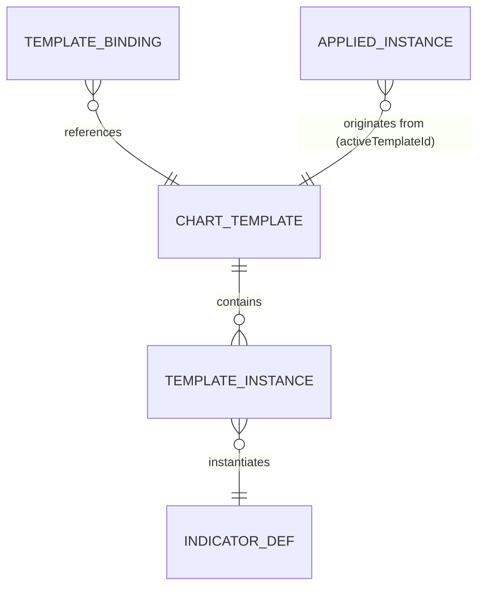

# チャートテンプレート 基本設計書（仕様追加）

## 1. 文書情報

- 作成日：2026-07-26
- バージョン：v0.1.0（基本設計・実装は別承認）
- 上位文書：`.doc/indicator-management-ui/基本設計書.md`（本書は §4 機能設計 / §5 データ設計への加法的追補）
- 対象アプリ：`indigators/indicator_ui`（ライブ・8000）／`simulator/replay_ui`（リプレイ・8280）
- ユーザー確定事項（2026-07-26 の選択）：
  - 適用方式＝**名前付き保存／適用 ＋ 時間足紐付け（切替時に自動適用）**
  - 保存範囲＝**指標構成のみ**（時間足・表示レンジ・価格スケールは含めない）

---

## 2. 課題（実測事実）

| # | 事実 | 実証根拠 |
|---|---|---|
| E-1 | 適用済み指標は時間足に無関係な**単一グローバル配列**で保持・永続化される | `local_storage_gateway.js:12`（`indicatorUi.applied.v1`）／`indicator_controller.js:730-734`（`_persistAll` は applied を丸ごと 1 キーへ） |
| E-2 | 時間足切替は「**同一の指標セットを新しい足で再計算**」する。指標の増減は起こらない | `timeframe_controller.js:33-80`（`setTimeframe` → `recomputeAllApplied`） |
| E-3 | ゆえに「足ごとに別の指標構成を使いたい」場合、切替のたびに**削除・追加・パラメータ再入力を手作業**で行う必要がある＝本件の手間の実体 | E-1・E-2 の合成 |
| E-4 | 指標単位の計算時間足 override（`timeframe`＝`chart`／固定足）は既に存在する。ただしこれは「1 指標の計算足」であり「構成の切替」ではない | `catalog.js:418` |
| E-5 | 指標管理の中核（`indicator_controller.js` / `timeframe_controller.js` / `local_storage_gateway.js` 等）は replay_ui へ **symlink による単一ソース共有**。共有ベースへ載せた機能は両アプリに同時成立する | `simulator/replay_ui/web/js/adapter/front/` の symlink 一覧 |
| E-6 | ライブ（8000）とリプレイ（8280）は **origin が異なるため localStorage が別空間**。両者は同一キー名を使いながら衝突しない | `composition_root_front.js:205`（live）／同 `:144`（replay）が同一キー名の `LocalStorageGateway` を使用 |
| E-7 | 時間足変更の購読スロット（`setTimeframeObserver`）は**単数**で、両アプリとも売買マーカー用に使用済み | `indicator_controller.js:644`／live `composition_root_front.js:582`／replay 同 `:277` |
| E-8 | Market Profile（MP）は `/compute` を持たないアクター駆動型で、**単一インスタンス制約**があり、復元は専用経路を通る | `market_profile_controller.js:108-130`（既存在席なら no-op）／`:237-246`（`restoreInstance`） |

---

## 3. スコープ

### 3.1 対象（In）

| 要件 ID | 概要 |
|---|---|
| FR-T01 | 現在の指標構成を名前付きテンプレートとして保存する |
| FR-T02 | 保存済みテンプレートを手動適用する（現構成を置換） |
| FR-T03 | テンプレートを時間足へ紐付ける／紐付けを解除する |
| FR-T04 | 時間足切替時、切替先に紐付いたテンプレートを自動適用する |
| FR-T05 | テンプレートを改名・削除する |
| FR-T06 | テンプレート・紐付けを永続化し、再読込後も保持する |
| FR-T07 | リプレイ UI でライブと同一の仕様・同一挙動で動作する（参照実装＝ライブ） |

### 3.2 対象外（Out・確定）

- 時間足・表示レンジ・価格スケール・スクロール位置の保存と復元（ユーザー確定「指標構成のみ」）。テンプレート適用は**ビューに一切触れない**（ISSUE-164 のビュー自動介入禁止裁定を侵さない）。
- テンプレートのファイル書き出し・読み込み・端末間共有。
- ライブ⇄リプレイ間でのテンプレート共有（E-6 により別空間。**別集合であることを仕様とする**）。
- ストラテジー／描画ツール／レイアウト（分割チャート）のテンプレート化。
- 構成の「変更検知（dirty 判定）」。テンプレート適用後にユーザーが手で指標を足しても、テンプレートは *由来の記録* にとどめ、差分追跡はしない（§5.4 の再適用規則で決定論性を担保）。

---

## 4. データ設計

### 4.1 エンティティ



#### CHART_TEMPLATE

| 属性 | 型 | 必須 | 説明 |
|---|---|---|---|
| `templateId` | string | 必須 | 一意 id。採番規則 `tpl#{seq}`（§4.3） |
| `name` | string | 必須 | 表示名。1〜40 文字（前後空白は trim）。空は不可 |
| `instances` | TEMPLATE_INSTANCE[] | 必須（0 件可） | 宣言順＝適用順。0 件は「全指標なし」を意味する有効なテンプレート |
| `createdAt` | int（UNIX 秒） | 必須 | 作成時刻 |
| `updatedAt` | int（UNIX 秒） | 必須 | 最終更新時刻（同名上書き・改名で更新） |

#### TEMPLATE_INSTANCE

| 属性 | 型 | 必須 | 説明 |
|---|---|---|---|
| `indicatorId` | string | 必須 | 指標 id（カタログ参照キー） |
| `variant` | string | 必須 | 計算バリアント |
| `params` | { name: value } | 必須 | パラメータ実値（平坦オブジェクト。`AppliedInstance.params` のペア配列形は保存時に正規化する） |
| `visible` | bool | 必須 | 表示／非表示 |
| `styles` | { seriesName: {color?,width?,style?,visible?} } \| null | 必須（null 可） | 系列スタイル上書き（`AppliedInstance.styles` と同形） |

**保存しない属性と理由（決定論性の担保）**

| 属性 | 保存しない理由 |
|---|---|
| `instanceId` | 適用時に `seqCounters`（基本設計書 §5.7）で再採番する。保存すると同一 id の重複適用が起こり系列名 `{instanceId}::{seriesName}` が衝突する |
| `seq` / `createdAt` | 適用済みインスタンス固有の履歴であり構成ではない |
| `generation` | 実行時の再計算世代（§6.6 競合破棄用）。構成ではない |
| `datasetRef` / `timeframe`（チャート足） | 構成ではなくチャート状態。保存範囲外（§3.2） |

#### TEMPLATE_BINDING

- 形：`{ [timeframe]: templateId }`
- 多重度：1 時間足 : 0..1 テンプレート／1 テンプレート : 0..N 時間足
- 有効な時間足キーは各アプリのメニュー集合（ライブ 9 足・リプレイ 8 足＝`timeframe_menu.js:20-24` と composition root の注入値）に限る。集合外キーは読み込み時に無視する。

### 4.2 永続化スキーマ（localStorage・基本設計書 §5.6 の命名規約に準拠・既存キーは無改変）

| キー | 値スキーマ | 原子性単位 |
|---|---|---|
| `indicatorUi.templates.v1` | `{ templates: CHART_TEMPLATE[] }` | テンプレート集合全体 |
| `indicatorUi.templateBindings.v1` | `{ bindings: { <timeframe>: <templateId> } }` | 紐付け全体 |
| `indicatorUi.templateSeq.v1` | `{ lastSeq: int }` | templateId 採番カウンタ（単調増加・削除で減算しない） |
| `indicatorUi.uiState.v1`（既存キーへ加法） | 既存項目 ＋ `activeTemplateId: string \| null` | UI 状態全体 |

- **破損時挙動**（§5.6 準拠）：JSON パース不能・スキーマ不一致は**当該キーのみ**空既定へ初期化し、他キーは温存。console に警告。全消去はしない。
- **QuotaExceeded**（F6 準拠）：当該書き込みを中止し、メモリ上の状態は保持。例外は投げない。
- **前方互換**：未知の上位版キーは温存し、解釈できない領域は無視する。

### 4.3 templateId 採番規則

- 形式：`tpl#{seq}`。`seq` は `indicatorUi.templateSeq.v1.lastSeq + 1`、発行と同時に永続化する。
- 全テンプレート削除後も `lastSeq` は減算・削除しない（基本設計書 §5.7 と同方針＝id の再利用禁止）。
- `templateSeq.v1` 破損時は、初期化後の `lastSeq` を `templates.v1` 内の既存 `tpl#N` の最大 N 以上に設定してから運用に入る（衝突回避を優先）。

---

## 5. 機能仕様

### 5.1 UC-T01 現在の構成を保存（FR-T01）

- 入力：テンプレート名（ユーザー入力）、「この時間足に紐付ける」チェック（既定 ON）。
- 処理：
  1. 現在の `state.applied` 全件を TEMPLATE_INSTANCE へ写像する（`params` はペア配列→オブジェクトへ正規化、`styles` は現状値をそのまま、除外属性は落とす）。
  2. 名前を trim して正規化（`trim` ＋小文字化）した値が既存テンプレートと一致する場合は、**その既存テンプレートを上書き更新**する（`templateId` と紐付けは保持、`name` は入力の表記を採用、`updatedAt` を更新）。一致しなければ新規採番して追加する。
  3. `activeTemplateId` を当該テンプレートの id に設定する。
  4. チェック ON なら現在の時間足へ紐付ける（既存の紐付けがあれば置換）。
- 後条件：メニューの「保存済み」一覧に在席し、`templates.v1`（＋必要なら `templateBindings.v1`・`uiState.v1`）が永続化されている。
- 例外：
  - 名前が空（trim 後 0 文字）／40 文字超 → 保存せずダイアログ内にインライン表示（F-T1）。
  - テンプレート件数が上限 50 件に達している状態での**新規**保存 → 保存せず通知（F-T1）。上書き更新は可。
  - 書き込み Quota 超過 → 当該書き込み中止・メモリ状態は保持（F-T5）。

### 5.2 UC-T02 テンプレート適用（FR-T02）

適用は**現構成の置換**である（マージではない）。空テンプレートの適用は全指標除去を意味する。

- 手順（決定論的・この順序で固定）：
  1. 現在の適用済みインスタンスを全件除去する。MP 種別は MP 経路（アクター無効化＋detach＋state 除去）、それ以外は renderer 除去＋state 除去。
  2. テンプレートの `instances` を**宣言順**に適用する。各件で `instanceId` を新規採番し、保存済み `variant` / `params` / `visible` / `styles` を復元する。
  3. 計算は現在のチャート時間足で行う（テンプレートは時間足を持たない）。描画は 1 回の同期バッチで行い、中間ペイント（バラバラ更新）を出さない（ISSUE-023 の既定方針に整合）。
  4. `visible=false` の指標は描画後に非表示へ戻す。`styles` は描画の最後に再適用する（`_applyStoredStyles` と同一順序）。
  5. `activeTemplateId` を当該テンプレート id に更新し、`applied.v1` を永続化する（＝以後の通常復元でこの構成が復元される）。
  6. 凡例を再描画する。
- 適用が触らないもの（確定）：チャート時間足、表示レンジ、価格スケール、ライブ追従状態、お気に入り。
- MP の扱い（E-8 準拠）：テンプレート内の MP 指標が 2 件以上ある場合、**宣言順の先頭 1 件のみ**適用し、後続は無視して console に警告する（参照実装の単一インスタンス制約に従う）。MP の有効化は MP 復元経路（`restoreInstance` 相当）で行う。
- 例外：
  - カタログ非在席の `indicatorId` → 当該 1 件をスキップし console 警告（既存 `restore` と同一方針）。
  - 個別指標の計算失敗 → **当該 1 件のみ**スキップし、残りの適用と描画は継続する（既存 `restore` の try/catch 方針と同一。全体を中止しない）。
  - 適用対象 `templateId` が不在（削除済み） → 何もしない・紐付けの遅延クリーンアップを行う（F-T3）。

### 5.3 UC-T03 時間足への紐付け／解除（FR-T03）

- 入力：対象時間足（既定＝現在の足）、テンプレート（または「紐付けなし」）。
- 処理：`templateBindings.v1` の当該キーを設定または削除して永続化する。
- 後条件：メニュー上で当該足に紐付いたテンプレートに紐付け印が付く。
- **紐付け操作そのものは構成を変更しない**（適用は行わない）。適用が起こるのは UC-T02（手動）と UC-T04（切替時）のみ。

### 5.4 UC-T04 時間足切替時の自動適用（FR-T04）

- **発火条件（すべて成立時のみ）**：
  1. ユーザーの明示的な時間足切替である（時間足メニュー項目のクリック）。
  2. 切替先の時間足に紐付けが存在し、参照先テンプレートが在席する。
  3. その `templateId` が現在の `activeTemplateId` と**異なる**。
- **再適用しない規則（決定論性）**：条件 3 が偽（同一テンプレート由来のまま）なら適用しない。したがってユーザーが手で足した指標は、同一テンプレート紐付けの足の間を行き来しても失われない。異なるテンプレートが紐付いた足へ切替えたときのみ構成が置換される。
- **適用手順（無駄な計算・二重描画を出さない順序）**：
  - ステップ 1（切替前）：現構成を除去する（renderer 除去＋state 空化）。計算は行わない。
  - ステップ 2：既存の時間足切替処理を実行する（candles 再取得・メイン系列差替・永続化・購読者通知）。このとき適用済みは 0 件なので指標計算は発生しない。
  - ステップ 3（切替後）：UC-T02 の手順 2 以降を新しい時間足で 1 回だけ実行する。
  - ⇒ 指標の計算は**新構成に対して 1 回だけ**。旧構成を新しい足で計算する無駄も、旧指標が一瞬見える二重描画も発生しない。
- **紐付けが無い足への切替**：現行挙動を完全に維持する（構成を持ち越して新しい足で再計算）。
- **ページ読込時（復元）**：自動適用しない。`applied.v1` の現構成をそのまま復元する。理由：読込は明示的な時間足切替ではなく、かつユーザーが最後に手で変えた構成を破棄しないため（ビュー・状態への自動介入は明示イベント起点に限る方針に整合）。
- **リプレイ UI**：同一仕様（リプレイでの時間足切替もユーザー明示イベント）。再生中でも例外規則を設けない。
- **再入防止**：自動適用の実行中に発生した時間足切替要求は無視する。

### 5.5 UC-T05 改名・削除（FR-T05）

- 改名：`name` を検証（1〜40 文字・正規化名の重複不可）して更新し `updatedAt` を進める。`templateId`・紐付け・`activeTemplateId` は不変。
- 削除：確認を 1 段挟む（ユーザー操作の取り消し不能な状態変更のため）。削除後、
  - 当該 id を参照する紐付けは削除する。
  - `activeTemplateId` が当該 id なら null にする。
  - **現在チャート上の構成は変更しない**（テンプレート削除は構成の削除ではない）。

### 5.6 失敗定義（基本設計書 §7.2.1 の F 系へ加法）

| ID | 失敗 | 検出方法 | システム挙動 |
|---|---|---|---|
| F-T1 | テンプレート名が不正（空・40 字超・重複件数上限） | 保存時の入力検証 | 保存中止・ダイアログ内インライン表示。既存データは不変 |
| F-T2 | `templates.v1` / `templateBindings.v1` / `templateSeq.v1` の破損 | JSON パース失敗・スキーマ不一致 | 当該キーのみ初期化・他キー温存・console 警告 |
| F-T3 | dangling 紐付け（参照先テンプレートが削除済み） | 紐付け解決時に id 不在 | 自動適用しない・当該紐付けを削除して永続化（遅延クリーンアップ）・警告のみ |
| F-T4 | 適用中の個別指標の計算失敗／カタログ非在席 | compute 例外・`catalog.get` が null | 当該 1 件をスキップし残りを適用継続・console 警告 |
| F-T5 | localStorage Quota 超過 | 書き込み例外 | 当該書き込み中止・メモリ状態保持・警告（既存 F6 と同一） |
| F-T6 | 有効時間足集合外の紐付けキー | 読み込み時にメニュー集合と突合 | 当該キーを無視（削除はしない＝別アプリ・将来足の温存） |

---

## 6. UI 設計

### 6.1 ツールバー

```
[NI225] [日 ▾] [ライブ] [テンプレート ▾] [インジケーター]
```

「テンプレート」はインジケーターボタンの左隣に置く（指標構成の操作系として隣接させる）。時間足ドロップダウンと同型の実装方式にする：`index.html` には空マウント（`<div class="tpl-menu" id="tpl-menu"></div>`）のみを置き、項目 DOM は共有 JS が生成する（`timeframe_menu.js` の ISSUE-123 方針＝両アプリの HTML 直書き複製を作らない）。

### 6.2 メニュー構造

```
[テンプレート ▾]
 ├ 現在の構成を保存…
 ├ ── 保存済み ──
 │   ● スイング      (1D, 1W)     ← 行クリックで適用。● = 現在足に紐付け
 │     デイトレ      (5m, 15m)
 │     ボリューム分析 (紐付けなし)
 ├ この時間足に紐付け ▸  [紐付けなし / スイング / デイトレ / …]
 └ 管理（改名・削除）…
```

- 各行の右側に紐付け先時間足をバッジ表示する（どのテンプレートがどの足に効くかを 1 画面で判別可能にする）。
- `activeTemplateId` に一致する行は選択状態（`is-active`）で示す。
- 「現在の構成を保存…」ダイアログ：名前入力（初期値＝空）、保存対象の指標一覧（読み取り専用プレビュー・件数と指標名）、「この時間足（例：日）に紐付ける」チェック（既定 ON）。
- 「管理」ダイアログ：一覧＋改名・削除（削除は確認 1 段）。
- 開閉挙動は時間足メニューと同一（トリガークリックでトグル、項目選択で閉じる、外側クリックで閉じる）。

### 6.3 リプレイ UI

同一ツールバー位置・同一メニュー構造・同一文言とする（参照実装＝ライブ。リプレイ固有の差分は設けない）。メニュー項目の時間足集合のみ、リプレイ対応 8 足を composition root から注入する（時間足メニューと同一の注入方式）。

---

## 7. 内部設計方針（実装は別承認・詳細は内部設計工程）

### 7.1 ファイル配置（既存の層規約に一致）

| 層 | 新規ファイル | 責務 |
|---|---|---|
| usecase | `js/usecase/chart_templates.js` | 純関数：テンプレート集合の追加／更新／改名／削除、紐付け解決、`AppliedInstance ⇄ TEMPLATE_INSTANCE` 写像、名前検証。DOM・Storage 非依存 |
| adapter | `js/adapter/front/local_storage_template_gateway.js` | `TemplateStorePort` 実装（templates／bindings／templateSeq の読み書き・破損時初期化・Quota 中止）。**既存 `LocalStorageGateway` は無改変**（ISP：既存ポートを汚さない） |
| adapter | `js/adapter/front/chart_template_controller.js` | ホスト契約（`TemplateHost`）にのみ依存する協働子。保存・適用・紐付け・切替時自動適用のオーケストレーション。`TimeframeController` / `MarketProfileController` と同型 |
| adapter | `js/adapter/front/chart_template_menu.js` | メニュー DOM 生成と開閉（`timeframe_menu.js` と同型）。controller を知らない（DIP） |
| 配線 | 各 `composition_root_front.js`（ライブ／リプレイ個別） | gateway・controller・menu の生成と注入 |

usecase / adapter の新規ファイルは `indigators/indicator_ui/web/js/` 側に単一ソースで置き、リプレイ側は symlink で共有する（E-5 の既存方式に従う＝両アプリの挙動一致を構造的に保証）。

### 7.2 既存コードへの介入（**アーキテクチャ判断＝実装着手前に承認が必要**）

適用処理が必要とする手順（インスタンス再採番、`variant`/`params` 復元、MP の専用復元経路、`styles` の再適用、個別失敗の局所化）は、既存の復元処理（`indicator_controller.js:750-802` `_restoreRun`）が**すでに実装している手順と同一**である。ここが設計上の唯一の分岐点になる。

| 案 | 内容 | 利点 | 欠点 |
|---|---|---|---|
| **S2（推奨）** | 共有ベースへ**挙動不変の抽出＋加法**：`_restoreRun` の「読み込み後の再構築部分」を内部メソッドへ切り出し、`applied` 配列を受け取って構成を再構築する公開入口を 1 つ追加する。テンプレート協働子はその入口を呼ぶ | 適用手順（MP 復元・styles 再適用・失敗の局所化）が単一ソースになり、ライブ／リプレイで乖離しない。symlink 共有により両アプリへ同時に載る | 共有ベース（`indicator_controller.js`）の改変を伴う（挙動不変・加法のみ） |
| S1 | 共有ベースを一切触らず、協働子が composition root で `setTimeframe` をデコレートし、既存の公開面のみで適用を組み立てる | 共有ベース無改変 | 適用手順を協働子側に再実装＝**二重実装**になり、MP 復元・styles 再適用の手順が将来ドリフトする |

- **推奨は S2**。理由：リプレイはライブへの厳密一致が最優先要件であり、適用手順の二重実装は乖離の恒久的な発生源になる。S2 の改変は「既存メソッド本体の抽出（挙動不変）＋公開入口 1 個の追加」に限定し、既存の呼び出し面（`restore` / `setTimeframe` / テスト）は不変とする。
- 時間足切替への介入点は、既存の購読スロットが単数かつ使用済み（E-7）であり、かつ §5.4 の順序（切替前に除去・切替後に適用）が必要なため、**購読スロットは使わず** composition root での `setTimeframe` デコレートで実現する（既存購読者＝売買マーカーの配線は不変）。

### 7.3 テスト方針

| 種別 | 対象 |
|---|---|
| usecase 単体（vitest・DOM 非依存） | 名前検証（空・上限・正規化重複）、`AppliedInstance ⇄ TEMPLATE_INSTANCE` 写像（除外属性が落ちること）、紐付け解決（dangling・集合外キー）、再適用判定（`activeTemplateId` 一致で不適用） |
| adapter 単体 | gateway の破損キー初期化・Quota 中止・`templateSeq` 単調性、メニュー DOM 生成 |
| 結線 | 切替時自動適用の**順序**（除去 → 切替 → 適用が 1 回・旧構成の計算が発生しないこと）、MP 単一インスタンス制約、個別失敗時に残りが適用されること |
| 実 UI 検証 | ライブ 8000／リプレイ 8280 を `serve.sh` で起動し、実 HTTP 経路・実 UI で確認する（compute 直叩き・合成データは検証根拠にしない） |

### 7.4 受入基準（実 UI で検証可能な形）

1. 1D で指標構成 A を作り「スイング」として保存 → 5m へ切替（紐付けなし）→ 構成 A が持ち越される（現行挙動不変）。
2. 5m に「デイトレ」を紐付け → 1D ⇄ 5m を切替 → 各足で該当構成に自動で入れ替わる。
3. 同上の切替で、旧構成の指標が新しい足で一瞬描画されない・指標計算が新構成に対して 1 回のみ。
4. テンプレート適用でチャート時間足・表示レンジ・価格スケールが変化しない。
5. テンプレートに MP を含めて適用 → MP が表示される（単一インスタンス）。
6. リロード後、最後の構成・テンプレート・紐付けが保持され、リロードだけでは自動適用が起こらない。
7. テンプレート削除後に該当足へ切替 → 自動適用されず、現構成が保持される。
8. 上記 1〜7 がリプレイ UI（8280）でも同一に成立する。

---

## 8. 未確定・承認要事項

| # | 事項 | 既定案 |
|---|---|---|
| A-1 | 共有ベース `indicator_controller.js` への挙動不変な抽出＋公開入口 1 個の追加（§7.2 案 S2）の可否 | S2 を推奨 |
| A-2 | 上限値：テンプレート最大 50 件・名前最大 40 文字 | 上記で確定してよいか |
| A-3 | ライブ⇄リプレイでテンプレートを共有しない（origin 別 localStorage・E-6） | 共有しないことを仕様とする |
| A-4 | ツールバー上の配置（インジケーターボタンの左） | §6.1 の配置で確定してよいか |
