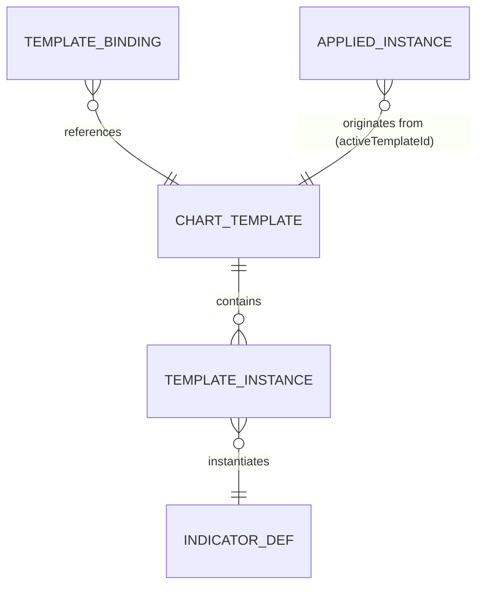

# チャートテンプレート 基本設計書（仕様追加）

## 1. 文書情報

- 作成日：2026-07-26
- 最終更新：2026-08-10
- バージョン：v0.1.4（基本設計・実装済み）
- 上位文書：`.doc/indicator-management-ui/基本設計書.md`（本書は §4 機能設計 / §5 データ設計への加法的追補）
- 対象アプリ：統合 UI `unified_ui`（公開 8000・ライブ／リプレイをモード切替）
- ユーザー確定事項（2026-07-26 の選択）：
  - 適用方式＝**名前付き保存／適用 ＋ 時間足紐付け（切替時に自動適用）**
  - 保存範囲＝**指標構成のみ**（時間足・表示レンジ・価格スケールは含めない）
- ユーザー確定事項（2026-07-28 の裁定）：
  - A-1 共有ベースへの挙動不変な抽出＋公開入口 1 個追加（S2）＝**採用**
  - A-2 テンプレート最大 50 件・名前最大 40 文字＝**確定**
  - A-3 ライブ／リプレイでテンプレートを**共有する**（v0.1.0 の「共有しない」を撤回）
  - A-4 ツールバー配置＝インジケーターボタンの左＝**確定**

### 1.1 改訂履歴

| 版 | 日付 | 内容 |
|---|---|---|
| v0.1.0 | 2026-07-26 | 初版 |
| v0.1.1 | 2026-07-28 | 実測再検証による是正。(1) E-6 を撤回（統合 UI は単一オリジン・単一 bootstrap でありライブ／リプレイは localStorage を共有する）。(2) §3.2 から「ライブ⇄リプレイ間のテンプレート共有」を対象外から削除し、共有を仕様とする。(3) §7.2 の介入先を `indicator_controller.js` から `indicator_state_store.js`（ISSUE-181 で分離済み）へ差替。(4) 対象アプリを 2 アプリ 2 ポートから統合 UI 単一ポートへ更新。(5) §8 の A-1〜A-4 を確定済みへ移動 |
| v0.1.3 | 2026-07-28 | ユーザー指示による仕様追加・UI 文言変更。(1) §5.1 に上書き保存時の確認 1 段を追加（同名保存＝上書きは変えず、実行前に確認を挟む）。(2) UI 文言「改名」を「名前を変更」へ変更（§6.2）。内部用語・UC 名称（UC-T05 改名）は変更しない |
| v0.1.4 | 2026-08-10 | ユーザー報告による開閉挙動の是正（ISSUE-366）。§6.2 に「ツールバーのドロップダウンは同時に 1 つしか開かない」を明記。旧実装は閉じる条件を**イベント伝播の有無**に置いており、トリガーの `stopPropagation()` が他メニューの閉じる処理まで止めていた（テンプレートを開いたままテーマを押すと両方開く）。条件を**クリック位置**へ置き換えた |
| v0.1.2 | 2026-07-28 | 実装フェーズで判明した記述誤り・内部矛盾の是正。(1) §5.2 手順 3 の「1 回の同期バッチ描画」を §7.2（復元ループの単一ソース化＝逐次描画）に合わせて是正（**設計書内部の矛盾**であり、実装は §7.2 に従っている）。(2) §7.3 の「vitest」を実 harness の `node:test` へ是正。(3) §7.1 の変更点一覧に CSS・A方式バンドル定義・ダイアログ view を追加。(4) §5.4 に発火条件 0（切替が実際に発生すること）を明記。(5) §5.2 に除去先行の永続化窓を注記。(6) §8.2 の A-7・A-8 を確定済みへ移動。(7) 実装で確定した未定義事項 U1〜U11 を §9 として追記 |

---

## 2. 課題（実測事実）

すべて 2026-07-28 時点の作業ツリーで再検証済み。行番号は同時点のもの。

| # | 事実 | 実証根拠 |
|---|---|---|
| E-1 | 適用済み指標は時間足に無関係な**単一グローバル配列**で保持・永続化される | `local_storage_gateway.js:11`（`indicatorUi.applied.v1`）／`indicator_state_store.js:36-41`（`persistAll` は applied を丸ごと 1 キーへ） |
| E-2 | 時間足切替は「**同一の指標セットを新しい足で再計算**」する。指標の増減は起こらない | `timeframe_controller.js:62-102`（`setTimeframe` → `recomputeAllApplied`） |
| E-3 | ゆえに「足ごとに別の指標構成を使いたい」場合、切替のたびに**削除・追加・パラメータ再入力を手作業**で行う必要がある＝本件の手間の実体 | E-1・E-2 の合成 |
| E-4 | 指標単位の計算時間足 override（`timeframe`＝`chart`／固定足）は既に存在する。ただしこれは「1 指標の計算足」であり「構成の切替」ではない | `catalog.js:418` |
| E-5 | 指標管理の中核（`indicator_controller.js` / `indicator_state_store.js` / `timeframe_controller.js` / `local_storage_gateway.js` 等）は replay_ui へ **symlink による単一ソース共有**。共有ベースへ載せた機能は両モードに同時成立する | `simulator/replay_ui/web/js/adapter/front/` の symlink 一覧 |
| E-6 | **統合 UI（公開 8000）はライブ／リプレイを同一オリジン・同一ページで提供する**。`/live/*`→127.0.0.1:8001、`/replay/*`→127.0.0.1:8281 は router の内部プロキシで、内部ポートは loopback 限定。ブラウザから見た origin は 8000 の 1 つのみ | `unified_ui/serve.sh:5-8,26-28`／`unified_ui/router.py` |
| E-7 | 時間足変更の購読スロット（`setTimeframeObserver`）は**単数**で、売買マーカー用に使用済み | `indicator_controller.js:570`／live `composition_root_front.js:582`／replay 同 `:277` |
| E-8 | Market Profile（MP）は `/compute` を持たないアクター駆動型で、**単一インスタンス制約**があり、復元は専用経路を通る | `market_profile_controller.js:108-130`（既存在席なら no-op）／`:237-246`（`restoreInstance`） |
| E-9 | 統合 UI は **chart を 1 回だけ生成し、live root の `bootstrap` を 1 回だけ呼ぶ**。リプレイは同一インスタンス上のモード切替であり、別 bootstrap ではない。controller 実体は `ReplayIndicatorController`、MP は `ReplayMarketProfileActor` が単一注入される | `unified_root.js:4`（単一 chart）／`:176-198`（唯一の `bootstrap` 呼出・replay 部品注入） |
| E-10 | ゆえに **localStorage 名前空間は両モードで同一**（物理接頭辞 `live:` 固定）。`scopedStorage` は `MODE.LIVE` の 1 箇所でのみ使用され、`MODE.REPLAY` スコープは未使用 | `unified_root.js:184`（`scopedStorage(globalThis.localStorage, MODE.LIVE)`・他に呼出なし）／`mode_storage.js:20-33` |
| E-11 | 永続化・復元（`persistAll` / `restore` / `_restoreRun` / `toJson`）は `IndicatorStateStore` へ**分離済み**。`indicator_controller.js` 側は薄い委譲のみ | `indicator_state_store.js:22-125`／`indicator_controller.js:655-664`（委譲）／commit `bc70de8`（ISSUE-181） |
| E-12 | 保存済み系列スタイルの再適用は `_draw` → `series_render_router` → `_applyStoredStyles` の既存経路で自動的に行われる | `series_render_router.js:74`／`indicator_controller.js:304` |
| E-13 | 統合 UI のツールバーは**単一**（`#tf-menu`・`#indicator-open-btn`・`#enter-replay` を両モードが共有）。時間足メニューは live composition root が既定 9 足で install する | `unified_ui/web/index.html:35-50`／`composition_root_front.js:324`（`new TimeframeMenu({ document: doc }).install()`） |

### 2.1 v0.1.0 からの撤回事項

v0.1.0 の E-6 は「ライブ 8000／リプレイ 8280 は origin が異なるため localStorage が別空間」としていたが、**統合 UI 導入後の現構成では成立しない**（E-6・E-9・E-10）。これに依存していた §3.2 の「ライブ⇄リプレイ間でのテンプレート共有＝対象外」も同時に撤回する。

なお上位設計 `LIVE_REPLAY_UNIFICATION_BASIC_DESIGN.md:62`（R4：モード別 prefix で localStorage を分離する）は、bootstrap が 2 回走る前提の対策である。現行は単一 bootstrap（E-9）のため前提ごと不要になっており、**R4 の記述が現構成に対して陳腐化している**（本件の対象外・別途是正）。

---

## 3. スコープ

### 3.1 対象（In）

| 要件 ID | 概要 |
|---|---|
| FR-T01 | 現在の指標構成を名前付きテンプレートとして保存する |
| FR-T02 | 保存済みテンプレートを手動適用する（現構成を置換） |
| FR-T03 | テンプレートを時間足へ紐付ける／紐付けを解除する |
| FR-T04 | 時間足切替時、切替先に紐付いたテンプレートを自動適用する |
| FR-T05 | テンプレートを改名・削除する |
| FR-T06 | テンプレート・紐付けを永続化し、再読込後も保持する |
| FR-T07 | リプレイモードでライブと同一の仕様・同一挙動で動作する（参照実装＝ライブ） |
| FR-T08 | テンプレート集合はライブ／リプレイで**共有**する（片方で保存したテンプレートがもう片方でもそのまま使える） |

### 3.2 対象外（Out・確定）

- 時間足・表示レンジ・価格スケール・スクロール位置の保存と復元（ユーザー確定「指標構成のみ」）。テンプレート適用は**ビューに一切触れない**（ISSUE-164 のビュー自動介入禁止裁定を侵さない）。
- テンプレートのファイル書き出し・読み込み・端末間共有。
- ストラテジー／描画ツール／レイアウト（分割チャート）のテンプレート化。
- 構成の「変更検知（dirty 判定）」。テンプレート適用後にユーザーが手で指標を足しても、テンプレートは *由来の記録* にとどめ、差分追跡はしない（§5.4 の再適用規則で決定論性を担保）。
- 上位設計 R4（モード別 localStorage 名前空間分離）の是正。本件は現行の共有名前空間（E-10）にそのまま載せる。

---

## 4. データ設計

### 4.1 エンティティ



#### CHART_TEMPLATE

| 属性 | 型 | 必須 | 説明 |
|---|---|---|---|
| `templateId` | string | 必須 | 一意 id。採番規則 `tpl#{seq}`（§4.3） |
| `name` | string | 必須 | 表示名。1〜40 文字（前後空白は trim）。空は不可 |
| `instances` | TEMPLATE_INSTANCE[] | 必須（0 件可） | 宣言順＝適用順。0 件は「全指標なし」を意味する有効なテンプレート |
| `createdAt` | int（UNIX 秒） | 必須 | 作成時刻 |
| `updatedAt` | int（UNIX 秒） | 必須 | 最終更新時刻（同名上書き・改名で更新） |

#### TEMPLATE_INSTANCE

| 属性 | 型 | 必須 | 説明 |
|---|---|---|---|
| `indicatorId` | string | 必須 | 指標 id（カタログ参照キー） |
| `variant` | string | 必須 | 計算バリアント |
| `params` | { name: value } | 必須 | パラメータ実値（平坦オブジェクト。`AppliedInstance.params` のペア配列形は保存時に正規化する。既存 `_paramsObject`（`indicator_controller.js:692`）と同一の正規化を用いる） |
| `visible` | bool | 必須 | 表示／非表示 |
| `styles` | { seriesName: {color?,width?,style?,visible?} } \| null | 必須（null 可） | 系列スタイル上書き（`AppliedInstance.styles` と同形） |

**保存しない属性と理由（決定論性の担保）**

| 属性 | 保存しない理由 |
|---|---|
| `instanceId` | 適用時に `seqCounters`（基本設計書 §5.7）で再採番する。保存すると同一 id の重複適用が起こり系列名 `{instanceId}::{seriesName}` が衝突する |
| `seq` / `createdAt` | 適用済みインスタンス固有の履歴であり構成ではない |
| `generation` | 実行時の再計算世代（§6.6 競合破棄用）。構成ではない |
| `datasetRef` / `timeframe`（チャート足） | 構成ではなくチャート状態。保存範囲外（§3.2） |

#### TEMPLATE_BINDING

- 形：`{ [timeframe]: templateId }`
- 多重度：1 時間足 : 0..1 テンプレート／1 テンプレート : 0..N 時間足
- 有効な時間足キーは統合 UI のメニュー集合（live composition root が install する既定 9 足＝E-13）に限る。集合外キーは読み込み時に無視する（削除はしない＝F-T6）。

### 4.2 永続化スキーマ（localStorage・基本設計書 §5.6 の命名規約に準拠・既存キーは無改変）

| 論理キー | 値スキーマ | 原子性単位 |
|---|---|---|
| `indicatorUi.templates.v1` | `{ templates: CHART_TEMPLATE[] }` | テンプレート集合全体 |
| `indicatorUi.templateBindings.v1` | `{ bindings: { <timeframe>: <templateId> } }` | 紐付け全体 |
| `indicatorUi.templateSeq.v1` | `{ lastSeq: int }` | templateId 採番カウンタ（単調増加・削除で減算しない） |
| `indicatorUi.uiState.v1`（既存キーへ加法） | 既存項目 ＋ `activeTemplateId: string \| null` | UI 状態全体 |

- 物理キーは `scopedStorage` により `live:` 接頭辞が付く（E-10）。**新規 gateway は接頭辞を自前で付けず、注入された storage ポートをそのまま使う**（既存 `LocalStorageGateway` と同じ扱い＝共有名前空間に自動的に載る）。
- **モード共有**：上記 4 キーはライブ／リプレイで同一実体（E-9・E-10）。テンプレート・紐付け・`activeTemplateId` はモード切替をまたいで保持される。
- **破損時挙動**（§5.6 準拠）：JSON パース不能・スキーマ不一致は**当該キーのみ**空既定へ初期化し、他キーは温存。console に警告。全消去はしない。
- **QuotaExceeded**（F6 準拠）：当該書き込みを中止し、メモリ上の状態は保持。例外は投げない。
- **前方互換**：未知の上位版キーは温存し、解釈できない領域は無視する。

### 4.3 templateId 採番規則

- 形式：`tpl#{seq}`。`seq` は `indicatorUi.templateSeq.v1.lastSeq + 1`、発行と同時に永続化する。
- 全テンプレート削除後も `lastSeq` は減算・削除しない（基本設計書 §5.7 と同方針＝id の再利用禁止）。
- `templateSeq.v1` 破損時は、初期化後の `lastSeq` を `templates.v1` 内の既存 `tpl#N` の最大 N 以上に設定してから運用に入る（衝突回避を優先）。

---

## 5. 機能仕様

### 5.1 UC-T01 現在の構成を保存（FR-T01）

- 入力：テンプレート名（ユーザー入力）、「この時間足に紐付ける」チェック（既定 ON）。
- 処理：
  1. 現在の `state.applied` 全件を TEMPLATE_INSTANCE へ写像する（`params` はペア配列→オブジェクトへ正規化、`styles` は現状値をそのまま、除外属性は落とす）。
  2. 名前を trim して正規化（`trim` ＋小文字化）した値が既存テンプレートと一致するかを判定する。
     - **一致しない場合**：新規採番して追加する。
     - **一致する場合**：**確認を 1 段挟む**（v0.1.3 追加・ユーザー指示 2026-07-28）。確認を経て、**その既存テンプレートを上書き更新**する（`templateId` と紐付けは保持、`name` は入力の表記を採用、`instances` は現在の構成で置換、`updatedAt` を更新、`createdAt` は不変）。確認の形式は §6.2 を参照。
  3. `activeTemplateId` を当該テンプレートの id に設定する。
  4. チェック ON なら現在の時間足へ紐付ける（既存の紐付けがあれば置換）。
- 後条件：メニューの「保存済み」一覧に在席し、`templates.v1`（＋必要なら `templateBindings.v1`・`uiState.v1`）が永続化されている。
- 例外：
  - 名前が空（trim 後 0 文字）／40 文字超 → 保存せずダイアログ内にインライン表示（F-T1）。
  - テンプレート件数が上限 50 件に達している状態での**新規**保存 → 保存せず通知（F-T1）。上書き更新は可。
  - 書き込み Quota 超過 → 当該書き込み中止・メモリ状態は保持（F-T5）。

### 5.2 UC-T02 テンプレート適用（FR-T02）

適用は**現構成の置換**である（マージではない）。空テンプレートの適用は全指標除去を意味する。

- 手順（決定論的・この順序で固定）：
  1. 現在の適用済みインスタンスを全件除去する。MP 種別は MP 経路（アクター無効化＋detach＋state 除去）、それ以外は renderer 除去＋state 除去。
  2. テンプレートの `instances` を**宣言順**に適用する。各件で `instanceId` を新規採番し、保存済み `variant` / `params` / `visible` / `styles` を復元する。
  3. 計算は現在のチャート時間足で行う（テンプレートは時間足を持たない）。**描画は復元処理（`_restoreRun` の再構築ループ）と同一手順＝指標 1 件ごとに `compute` → `_draw` の逐次描画**とする。

     > **v0.1.2 是正**：v0.1.1 まで本項は「描画は 1 回の同期バッチで行い、中間ペイント（バラバラ更新）を出さない」としていたが、これは §7.2（適用手順を復元処理と単一ソース化する＝S2・承認済み）と矛盾する。復元ループは元来 1 件ずつ描画するため、両立しない。適用手順の単一ソース化を優先し、本項を逐次描画へ是正する。一括同期描画を要求する場合は `rebuildApplied` の 2 相化が必要で、これは S2 の「挙動不変」条件に抵触するため再承認を要する。
  4. `visible=false` の指標は描画後に非表示へ戻す。`styles` の再適用は `_draw` の既存経路が自動で行うため**追加実装は不要**（E-12・`series_render_router.js:74` → `_applyStoredStyles`）。
  5. `activeTemplateId` を当該テンプレート id に更新し、`applied.v1` を永続化する（＝以後の通常復元でこの構成が復元される）。
  6. 凡例を再描画する。
- 適用が触らないもの（確定）：チャート時間足、表示レンジ、価格スケール、ライブ追従状態、お気に入り、リプレイのモード・再生位置。
- **除去先行の永続化窓（v0.1.2 注記・受容）**：手順 1 の除去は既存 `removeInstance` を件数分呼ぶため、その都度 `applied.v1` が永続化される。したがって除去完了から手順 5 の永続化までの間（compute の HTTP 往復ぶん）にリロード・タブ終了が起きると、空構成が復元される。テンプレート本体と紐付けは別キーで保全されるため再適用で完全復旧でき、恒久的なデータ喪失ではない。解消にはバッチ除去入口の新設が必要だが、これは §7.2 S2 の承認範囲（公開入口 1 個）を超え、かつ協働子側で `removeInstance` の多態差（replay subclass の `_invalidateReveal`）を再実装することになるため**採らない**。
- MP の扱い（E-8 準拠）：テンプレート内の MP 指標が 2 件以上ある場合、**宣言順の先頭 1 件のみ**適用し、後続は無視して console に警告する（参照実装の単一インスタンス制約に従う）。MP の有効化は MP 復元経路（`restoreInstance` 相当）で行う。
- 例外：
  - カタログ非在席の `indicatorId` → 当該 1 件をスキップし console 警告（既存 `_restoreRun` と同一方針）。
  - 個別指標の計算失敗 → **当該 1 件のみ**スキップし、残りの適用と描画は継続する（`indicator_state_store.js:108-120` の try/catch 方針と同一。全体を中止しない）。
  - 適用対象 `templateId` が不在（削除済み） → 何もしない・紐付けの遅延クリーンアップを行う（F-T3）。

### 5.3 UC-T03 時間足への紐付け／解除（FR-T03）

- 入力：対象時間足（既定＝現在の足）、テンプレート（または「紐付けなし」）。
- 処理：`templateBindings.v1` の当該キーを設定または削除して永続化する。
- 後条件：メニュー上で当該足に紐付いたテンプレートに紐付け印が付く。
- **紐付け操作そのものは構成を変更しない**（適用は行わない）。適用が起こるのは UC-T02（手動）と UC-T04（切替時）のみ。

### 5.4 UC-T04 時間足切替時の自動適用（FR-T04）

- **発火条件（すべて成立時のみ）**：
  0. **切替が実際に発生すること**（クリックされた時間足が現在のチャート時間足と異なる）。現在足と同じ項目のクリックは既存実装で完全な no-op（`timeframe_controller.js:62-65`）であり、テンプレート機能はこの挙動を変えない。（v0.1.2 追記：条件 1 の「切替である」に含意されるが、実装で誤発火したため明文化する）
  1. ユーザーの明示的な時間足切替である（時間足メニュー項目のクリック）。
  2. 切替先の時間足に紐付けが存在し、参照先テンプレートが在席する。
  3. その `templateId` が現在の `activeTemplateId` と**異なる**。
- **再適用しない規則（決定論性）**：条件 3 が偽（同一テンプレート由来のまま）なら適用しない。したがってユーザーが手で足した指標は、同一テンプレート紐付けの足の間を行き来しても失われない。異なるテンプレートが紐付いた足へ切替えたときのみ構成が置換される。
- **適用手順（無駄な計算・二重描画を出さない順序）**：
  - ステップ 1（切替前）：現構成を除去する（renderer 除去＋state 空化）。計算は行わない。
  - ステップ 2：既存の時間足切替処理を実行する（candles 再取得・メイン系列差替・永続化・購読者通知）。このとき適用済みは 0 件なので指標計算は発生しない。
  - ステップ 3（切替後）：UC-T02 の手順 2 以降を新しい時間足で 1 回だけ実行する。
  - ⇒ 指標の計算は**新構成に対して 1 回だけ**。旧構成を新しい足で計算する無駄も、旧指標が一瞬見える二重描画も発生しない。
- **紐付けが無い足への切替**：現行挙動を完全に維持する（構成を持ち越して新しい足で再計算）。
- **ページ読込時（復元）**：自動適用しない。`applied.v1` の現構成をそのまま復元する。理由：読込は明示的な時間足切替ではなく、かつユーザーが最後に手で変えた構成を破棄しないため（ビュー・状態への自動介入は明示イベント起点に限る方針に整合）。
- **リプレイ⇄ライブのモード切替**：自動適用しない。モード切替は時間足切替ではなく、統合 UI の目的が状態保持であるため（`LIVE_REPLAY_UNIFICATION_BASIC_DESIGN.md:12`）。切替後も構成・`activeTemplateId` はそのまま維持される。
- **リプレイモード中の時間足切替**：ライブと同一仕様（リプレイでの時間足切替もユーザー明示イベント）。再生中でも例外規則を設けない。
- **再入防止**：自動適用の実行中に発生した時間足切替要求は無視する。

### 5.5 UC-T05 改名・削除（FR-T05）

- 改名：`name` を検証（1〜40 文字・正規化名の重複不可）して更新し `updatedAt` を進める。`templateId`・紐付け・`activeTemplateId` は不変。
- 削除：確認を 1 段挟む（ユーザー操作の取り消し不能な状態変更のため）。削除後、
  - 当該 id を参照する紐付けは削除する。
  - `activeTemplateId` が当該 id なら null にする。
  - **現在チャート上の構成は変更しない**（テンプレート削除は構成の削除ではない）。

### 5.6 失敗定義（基本設計書 §7.2.1 の F 系へ加法）

| ID | 失敗 | 検出方法 | システム挙動 |
|---|---|---|---|
| F-T1 | テンプレート名が不正（空・40 字超・重複件数上限） | 保存時の入力検証 | 保存中止・ダイアログ内インライン表示。既存データは不変 |
| F-T2 | `templates.v1` / `templateBindings.v1` / `templateSeq.v1` の破損 | JSON パース失敗・スキーマ不一致 | 当該キーのみ初期化・他キー温存・console 警告 |
| F-T3 | dangling 紐付け（参照先テンプレートが削除済み） | 紐付け解決時に id 不在 | 自動適用しない・当該紐付けを削除して永続化（遅延クリーンアップ）・警告のみ |
| F-T4 | 適用中の個別指標の計算失敗／カタログ非在席 | compute 例外・`catalog.get` が null | 当該 1 件をスキップし残りを適用継続・console 警告 |
| F-T5 | localStorage Quota 超過 | 書き込み例外 | 当該書き込み中止・メモリ状態保持・警告（既存 F6 と同一） |
| F-T6 | 有効時間足集合外の紐付けキー | 読み込み時にメニュー集合と突合 | 当該キーを無視（削除はしない＝将来足の温存） |

---

## 6. UI 設計

### 6.1 ツールバー

```
[NI225] [日 ▾] [ライブ] [テンプレート ▾] [インジケーター] [リプレイ]
```

「テンプレート」はインジケーターボタンの左隣に置く（指標構成の操作系として隣接させる）。時間足ドロップダウンと同型の実装方式にする：`index.html` には空マウント（`<div class="tpl-menu" id="tpl-menu"></div>`）のみを置き、項目 DOM は共有 JS が生成する（`timeframe_menu.js` の ISSUE-123 方針＝HTML 直書き複製を作らない）。

統合 UI のツールバーは単一で両モードが共有する（E-13）。よって**テンプレートボタンも 1 個のみ**存在し、ライブ・リプレイのどちらのモードでも同じボタン・同じ一覧を操作する。

### 6.2 メニュー構造

```
[テンプレート ▾]
 ├ 現在の構成を保存…
 ├ ── 保存済み ──
 │   ● スイング      (1D, 1W)     ← 行クリックで適用。● = 現在足に紐付け
 │     デイトレ      (5m, 15m)
 │     ボリューム分析 (紐付けなし)
 ├ この時間足に紐付け ▸  [紐付けなし / スイング / デイトレ / …]
 └ 管理（名前を変更・削除）…
```

- 各行の右側に紐付け先時間足をバッジ表示する（どのテンプレートがどの足に効くかを 1 画面で判別可能にする）。
- `activeTemplateId` に一致する行は選択状態（`is-active`）で示す。
- 「現在の構成を保存…」ダイアログ：名前入力（初期値＝空）、保存対象の指標一覧（読み取り専用プレビュー・件数と指標名）、「この時間足（例：日）に紐付ける」チェック（既定 ON）。
  - **上書き確認（v0.1.3 追加）**：「保存」押下時に正規化名が既存テンプレートと一致した場合、保存せずその場で確認 1 段に入る（§5.5 削除の確認と同型）。
    - 保存ボタンのラベルを「**上書きする**」に変える。
    - 対象名をダイアログ内にインライン表示する（例：`「デイトレ」を上書きします。`）。**エラーではないためエラー色にしない**（F-T1 の入力エラー表示とは区別する）。
    - 「上書きする」を押して初めて上書きを実行する。
    - 確認状態で名前を編集した場合は確認状態を解除し、ボタンを「保存」へ戻す。編集後の名前が別テンプレートと一致すれば、再度「保存」押下で改めて確認に入る。
    - 「キャンセル」「×」はダイアログを閉じる（保存しない）。
    - 一致しない場合は 1 回目の「保存」で即実行する（v0.1.2 までの挙動を維持）。
    - 紐付けチェックの扱いは不変（上書き確定時もチェック ON なら現在足へ紐付ける）。
- 「管理」ダイアログ：一覧＋名前変更・削除（削除は確認 1 段）。
  - **UI 文言（v0.1.3 変更）**：メニュー項目は「管理（名前を変更・削除）…」、行内のボタンは「名前を変更」とする。内部用語・UC 名称（UC-T05 改名）は変更しない。
  - 改名時の正規化名の重複は**拒否**する（F-T1）。上書き確認には入らない（保存とは異なる扱い）。
- 開閉挙動は時間足メニューと同一（トリガークリックでトグル、項目選択で閉じる、外側クリックで閉じる）。
- **ツールバーのドロップダウンは同時に 1 つしか開かない（v0.1.4・ISSUE-366）**。他のドロップダウン（時間足・テーマ）のトリガーを押したときも「外側クリック」として閉じる。判定は「クリック位置が自分のマウント（トリガー＋ポップ）の内側か」であり、イベント伝播の有無には依存しない（依存させると、他メニューが `stopPropagation()` した瞬間に閉じなくなる）。

### 6.3 モード間の一貫性

ライブ／リプレイで**同一ツールバー・同一メニュー・同一文言・同一テンプレート集合**とする（参照実装＝ライブ。リプレイ固有の差分は設けない）。統合 UI は単一 controller・単一 storage（E-9・E-10）であるため、これは配線上も自動的に成立する。

---

## 7. 内部設計方針（実装は別承認・詳細は実装時に確定）

### 7.1 ファイル配置（既存の層規約に一致）

| 層 | 新規ファイル | 責務 |
|---|---|---|
| usecase | `js/usecase/chart_templates.js` | 純関数：テンプレート集合の追加／更新／改名／削除、紐付け解決、`AppliedInstance ⇄ TEMPLATE_INSTANCE` 写像、名前検証。DOM・Storage 非依存 |
| adapter | `js/adapter/front/local_storage_template_gateway.js` | `TemplateStorePort` 実装（templates／bindings／templateSeq の読み書き・破損時初期化・Quota 中止）。**既存 `LocalStorageGateway` は無改変**（ISP：既存ポートを汚さない）。注入された storage ポートをそのまま使う（§4.2） |
| adapter | `js/adapter/front/chart_template_controller.js` | ホスト契約（`TemplateHost`）にのみ依存する協働子。保存・適用・紐付け・切替時自動適用のオーケストレーション。`TimeframeController` / `MarketProfileController` と同型 |
| adapter | `js/adapter/front/chart_template_menu.js` | ドロップダウン DOM 生成と開閉（`timeframe_menu.js` と同型）。controller を知らない（DIP） |
| adapter | `js/adapter/front/chart_template_dialogs.js` | 保存ダイアログ・管理ダイアログの DOM（`properties_dialog.js` と同型）。controller を知らない（DIP）。**v0.1.2 追加**：§6.2 が要求する 2 つのダイアログの実装先が v0.1.1 の一覧に欠落していた（ユーザー承認 2026-07-28） |
| 配線 | `indigators/indicator_ui/.../composition_root_front.js` | gateway・controller・menu の生成と注入。統合 UI の唯一の bootstrap 経路（E-9）であるため、ここへの配線でライブ・リプレイ両モードに同時成立する |
| 配線 | `simulator/replay_ui/.../composition_root_front.js` | standalone replay_ui（内部 8281）を単体起動した場合の同等配線。統合 UI 経由では呼ばれないが、既存テストと単体起動の一致を保つため同一注入を行う |
| マウント | `unified_ui/web/index.html`（＋ standalone 両 `index.html`） | 空マウント `<div class="tpl-menu" id="tpl-menu"></div>` の追加のみ |
| スタイル | `indigators/indicator_ui/web/css/app.css` | `.tpl-menu` 系・ダイアログ系の追加（`.tf-menu` 系に隣接）。3 アプリとも同一実体を読む。**v0.1.2 追加**（v0.1.1 の一覧に欠落） |
| バンドル | `indigators/indicator_ui/web/build.mjs` | `MODULE_ORDER` へ新規 5 本を依存順に追加。未追加だと A方式バンドル（`file://`）が未定義参照で壊れる。**v0.1.2 追加**（v0.1.1 の一覧に欠落） |

usecase / adapter の新規ファイルは `indigators/indicator_ui/web/js/` 側に単一ソースで置き、replay_ui 側は symlink で共有する（E-5 の既存方式に従う＝両モードの挙動一致を構造的に保証）。

### 7.2 既存コードへの介入（A-1 で S2 承認済み）

適用処理が必要とする手順（インスタンス再採番、`variant`/`params` 復元、MP の専用復元経路、`styles` の再適用、個別失敗の局所化）は、既存の復元処理が**すでに実装している手順と同一**である。

**v0.1.0 からの是正**：v0.1.0 は介入先を `indicator_controller.js:750-802` `_restoreRun` としていたが、commit `bc70de8`（ISSUE-181）で当該処理は `IndicatorStateStore` へ分離済み（E-11）。**介入先は `indicator_state_store.js` に変わる**。

| 案 | 内容 | 利点 | 欠点 |
|---|---|---|---|
| **S2（承認済み）** | 共有ベースへ**挙動不変の抽出＋加法**：`IndicatorStateStore._restoreRun`（`indicator_state_store.js:71-124`）を「保存状態の読込・時間足復元」部（`:73-94`）と「applied 配列からの再構築ループ」部（`:96-121`）へ分割し、後者を `applied` 配列を引数に取る公開入口（例 `rebuildApplied(appliedList)`）として切り出す。テンプレート協働子はその入口を呼ぶ | 適用手順（MP 復元・styles 再適用・失敗の局所化）が単一ソースになり、ライブ／リプレイで乖離しない。symlink 共有により両モードへ同時に載る | 共有ベース（`indicator_state_store.js`）の改変を伴う（挙動不変・加法のみ） |
| S1（不採用） | 共有ベースを一切触らず、協働子が composition root で `setTimeframe` をデコレートし、既存の公開面のみで適用を組み立てる | 共有ベース無改変 | 適用手順を協働子側に再実装＝**二重実装**になり、MP 復元・styles 再適用の手順が将来ドリフトする |

- S2 の改変は「既存メソッド本体の抽出（挙動不変）＋公開入口 1 個の追加」に限定し、既存の呼び出し面（`restore` / `setTimeframe` / `controller._persistAll` / 既存テスト）は不変とする。
- 抽出範囲は再構築ループのみとする。**時間足復元部（`:81-90`）は含めない**（テンプレートは時間足を持たないため・§3.2）。
- 時間足切替への介入点は、既存の購読スロットが単数かつ使用済み（E-7）であり、かつ §5.4 の順序（切替前に除去・切替後に適用）が必要なため、**購読スロットは使わず** composition root での `setTimeframe` デコレートで実現する（既存購読者＝売買マーカーの配線は不変）。

### 7.3 テスト方針

テスト harness は `node:test`（`indigators/indicator_ui/web` と `simulator/replay_ui/web`）。vitest は `unified_ui/web` の独立ハーネスのみで、本件の対象ではない（v0.1.1 までの「vitest」表記は誤り＝v0.1.2 で是正）。

| 種別 | 対象 |
|---|---|
| usecase 単体（node:test・DOM 非依存） | 名前検証（空・上限・正規化重複）、`AppliedInstance ⇄ TEMPLATE_INSTANCE` 写像（除外属性が落ちること）、紐付け解決（dangling・集合外キー）、再適用判定（`activeTemplateId` 一致で不適用） |
| adapter 単体 | gateway の破損キー初期化・Quota 中止・`templateSeq` 単調性、メニュー DOM 生成 |
| 回帰 | `IndicatorStateStore` 抽出が挙動不変であること（既存 restore 系テストが無改変で通ること） |
| 結線 | 切替時自動適用の**順序**（除去 → 切替 → 適用が 1 回・旧構成の計算が発生しないこと）、MP 単一インスタンス制約、個別失敗時に残りが適用されること |
| 実 UI 検証 | 統合 UI（`unified_ui/serve.sh`・公開 8000）を起動し、実 HTTP 経路・実 UI で確認する（compute 直叩き・合成データは検証根拠にしない） |

### 7.4 受入基準（実 UI で検証可能な形）

1. 1D で指標構成 A を作り「スイング」として保存 → 5m へ切替（紐付けなし）→ 構成 A が持ち越される（現行挙動不変）。
2. 5m に「デイトレ」を紐付け → 1D ⇄ 5m を切替 → 各足で該当構成に自動で入れ替わる。
3. 同上の切替で、旧構成の指標が新しい足で一瞬描画されない・指標計算が新構成に対して 1 回のみ。
   - **v0.1.2 注記**：本項のうち「指標計算が新構成に対して 1 回のみ・旧構成の計算が 0 回」は結線テストで固定する（実 UI ではブラウザの計算回数を計測する手段が無いため）。「一瞬描画されない」は除去先行の順序（§5.4）から構造的に成立する。ただし除去〜適用完了の間は**指標が一時的に消える**状態になる（§5.4 が禁じるのは「旧構成が新しい足で描画されること」であり、この一時消失は該当しない）。
4. テンプレート適用でチャート時間足・表示レンジ・価格スケールが変化しない。
5. テンプレートに MP を含めて適用 → MP が表示される（単一インスタンス）。
6. リロード後、最後の構成・テンプレート・紐付けが保持され、リロードだけでは自動適用が起こらない。
7. テンプレート削除後に該当足へ切替 → 自動適用されず、現構成が保持される。
8. ライブでテンプレートを保存 → リプレイへトグル → **同じテンプレートが一覧に在席し適用できる**（FR-T08）。
9. モードトグル（ライブ⇄リプレイ）だけでは自動適用が起こらず、構成・`activeTemplateId` が維持される。
10. 上記 1〜7 がリプレイモードでも同一に成立する。

---

## 8. 承認事項

### 8.1 確定済み（2026-07-28）

| # | 事項 | 決定 |
|---|---|---|
| A-1 | 共有ベースへの挙動不変な抽出＋公開入口 1 個の追加（§7.2 S2） | **S2 採用**。介入先は `indicator_state_store.js`（v0.1.1 で是正） |
| A-2 | 上限値：テンプレート最大 50 件・名前最大 40 文字 | **確定** |
| A-3 | ライブ／リプレイ間のテンプレート共有 | **共有する**（v0.1.0 の「共有しない」を撤回。E-6・E-9・E-10） |
| A-4 | ツールバー上の配置（インジケーターボタンの左） | **§6.1 の配置で確定** |
| A-6 | 内部設計書の要否 | **不要**（本書が決定論的水準に達しており、実装は既存経路の再利用が中心） |

### 8.2 確定済み（2026-07-28・追加分）

| # | 事項 | 決定 |
|---|---|---|
| A-5 | 実装着手前の設計書是正（v0.1.1） | **実施済み** |
| A-7 | standalone replay_ui composition root（内部 8281・統合 UI 経由では未使用）へも同一配線を行うか | **行う**（単体起動と既存テストの一致を保つため・§7.1） |
| A-8 | 実装着手そのものの承認 | **承認・着手済み**（2026-07-28） |
| A-9 | §6.2 の 2 つのダイアログの実装先（v0.1.1 の §7.1 一覧に欠落） | **新規 view 1 本を追加**（`chart_template_dialogs.js`・ユーザー承認 2026-07-28） |

### 8.3 本件対象外の別課題

| # | 事項 | 備考 |
|---|---|---|
| B-1 | `LIVE_REPLAY_UNIFICATION_BASIC_DESIGN.md:62`（R4）の記述が現構成に対して陳腐化（単一 bootstrap のためモード別 prefix は不要・`MODE.REPLAY` スコープは未使用） | 本書の対象外。上位設計側で別途是正の要否を判断する |
| B-2 | lightweight-charts の `Value is null`（時間足切替時に観測） | ISSUE-167（2026-07-24）・commit `c2ded05`（2026-07-27）に本件以前からの記録あり。今回観測した個体が同一原因かは未実証。ISSUE-189 で切り分け手順を管理 |

---

## 9. 実装フェーズで確定した事項（v0.1.2 追記）

本書 v0.1.1 に定義が無く、実装フェーズで設計書・既存参照実装から導出して確定した事項。いずれもスコープ変更を伴わない。

| # | 事項 | 確定内容 |
|---|---|---|
| U1 | 有効時間足集合（§4.2）の供給源 | composition root から注入（`TimeframeMenu` の groups 注入と同型）。live は `Object.keys(TF_BAR_SEC)` 由来の既定 9 足、standalone replay は 8 足 |
| U2 | §6.2 の 2 つのダイアログの実装先 | 新規 view `chart_template_dialogs.js`（A-9 で承認） |
| U3 | メニュー更新 API | 協働子が保存・改名・削除・適用・紐付けの後に `render(vm)` を呼ぶ |
| U4 | メニュー行クリック → 適用の接続 | menu へ `onSelect` コールバックを注入（menu は controller を import しない＝DIP 維持） |
| U5 | UC-T02 手順 1（全件除去）の永続化回数 | 既存 `removeInstance` を件数分呼ぶ（N 回永続化）。バッチ除去入口は新設しない（S2 の承認範囲外・§5.2 の注記を参照） |
| U6 | メニュー初期描画と `restore()` の順序 | メニューは開くたびに再描画する。順序依存を構造的に作らない |
| U7 | CSS の追加先 | `app.css`（§7.1 に追記済み） |
| U8 | A方式バンドル定義 | `build.mjs` の `MODULE_ORDER`（§7.1 に追記済み） |
| U9 | `TEMPLATE_HOST_CONTRACT` の宣言位置 | 新規 `chart_template_controller.js` 内（共有ベース無改変・ISP の client 所有原則） |
| U10 | symlink の相対パス形 | 既存 symlink の実測に一致（usecase は 5 段・adapter/front は 6 段） |
| U11 | 改名で自身の現在名と同じ正規化名へ変更する操作 | 許容する（自身は重複ではない） |
| U12 | 指標単位の計算足 override（`params.timeframe`・`catalog.js:418`） | params の一部として保存する。§4.1 の除外「timeframe（チャート足）」はインスタンス属性であってパラメータではない |
| U13 | MP「宣言順の先頭 1 件のみ」の実装所在 | テンプレート協働子側（UC-T02）。`rebuildApplied` には入れない（§7.2 が挙動不変を要件とするため） |
| U14 | 公開入口が凡例・ダイアログ再描画を含むか | 含めない。凡例再描画は §5.2 手順 6 として協働子が `host._renderLegend()` を呼ぶ |
| U15 | 紐付けバッジの時間足表記 | キー表記（`(1D, 1W)`＝§6.2 のメニュー構造図どおり）。保存ダイアログのみラベル表記（`（例：日）`＝§6.2 の本文どおり）。両者で規約が異なるのは設計書の記述に従った結果 |
