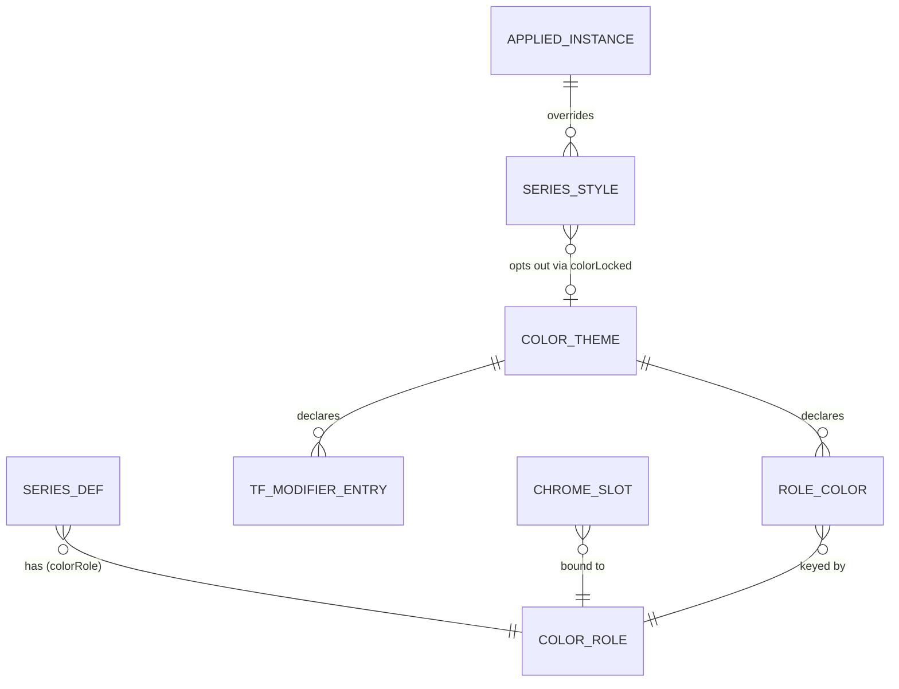

# 指標カラーテーマ 基本設計書（仕様追加）

## 1. 文書情報

- 作成日：2026-08-09
- 最終更新：2026-08-09
- バージョン：v0.3.1（基本設計・**段階 1／段階 2／段階 3 は実装済み**・段階 4 は未実装）
- 上位文書：`.doc/indicator-management-ui/基本設計書.md`（本書は §4 機能設計 / §5 データ設計への加法的追補）
- 同格文書：`.doc/indicator-management-ui/基本設計_チャートテンプレート.md`（本書の書式・章立ての参照実装。テーマとテンプレートは直交＝§3.3）
- 対象アプリ：統合 UI `unified_ui`（公開 8000・ライブ／リプレイをモード切替）

### 1.0 目的（v0.2.0 で依頼者が明示）

本機能の目的は次の 2 点である。以下のすべての設計判断はこの 2 点に従属する。

1. **認知負荷の軽減**
2. **カラーに意味をもたせること**

したがって本設計の合格条件は「テーマで色を変えられること」ではなく、**同一の意味には、指標でもチャートクロムでも同一の色が割り当たる構造になっていること**である。現状はこれが破れている（§2.2 に実測を示す）。

### 1.1 改訂履歴

| 版 | 日付 | 内容 |
|---|---|---|
| v0.1.0 | 2026-08-09 | 初版。実測に基づき役割語彙 7 種（部位軸）を確定し、解決順・変調規則・永続化・段階分割を規定 |
| v0.3.0 | 2026-08-09 | **段階 1・段階 2 の実装に伴う是正**（ISSUE-351）。実装中に通過条件を逐語でテスト化した結果、v0.2.0 の規定に同時成立しない箇所が 4 件見つかったため、実測に基づき是正した。(1) クロムの既定値の単一情報源を**トークン単位から配線点（slot）単位へ**（§4.2・§4.6・#7 の不透明度に由来）。(2) §5.8 の系列名→トークン解決から `horizontal_line` を構造的に除外し、§4.1.3 規則 3 の適用範囲を実描画系列の名前空間に限定（規則 1 との両立）。(3) §4.5 ステップ 5 の既定色を適用側が書かない規律を明文化（`defaultColor` 引数）。(4) §7.1 の `build.mjs`／付与関数の記述を実態へ是正（`build.mjs` は不在・共有は symlink・`level` 強制は `SeriesDef` の不変条件）。あわせて `chrome_theme_applier` の JS 配信先を `ChartRenderer` へ寄せた（upstream lwc API 隔離規約 ISSUE-262） |
| v0.3.1 | 2026-08-09 | **段階 3 着手前のアーキテクチャ評価による是正**（ISSUE-352）。実コードとの突合で 5 件のずれを検出した。(1) §6.1・§7.1・A-3 の「index.html へ空マウントを置く」は撤去済みの手書き複製を 3 枚ぶん復活させる（実測: `tpl-menu` は 4 枚の index.html に 0 件で、器は `app_chrome_view.js:59,67` が生成＝ISSUE-278 #16）。生成点を `installChartToolbar` へ是正し index.html は無改変とした。(2) §7.1 の `build.mjs` 行を削除（§7.8 と自己矛盾していた）。(3) §7.3 の `ThemeHost` 契約は `IndicatorController` に**在席しない** `applySeriesStyle` / `applyLevelLineColor` を含み、必須の `_applyStoredStyles` / `_renderLegend` を欠いていた。最小 4 メンバーへ是正し `createHostView` で射影する。(4) §7.1 に `color_themes.js` の CODE 語彙・`recoverLastSeq` 相当・ラベルの所在を追記。(5) §6.3 のトークン 14 行を `COLOR_ROLES` 導出と明記（時間足行の `TF_CODES` 導出と対称化）。あわせて `color_theme_dialog.js` を `color_theme_dialogs.js` へ改称し、`setColorThemeProvider` の加法（両 root への手書き複製回避）を §7.1 に追加した |
| v0.2.0 | 2026-08-09 | 依頼者によるスコープ拡張と目的の明示を反映。(1) 非目標 N-1（チャートクロム対象外）を**撤回**し、背景・グリッド・軸・ローソク・現在値ラインをテーマ対象に追加。(2) 目的（認知負荷軽減・カラーに意味をもたせる）を §1.0 に明記。(3) **役割語彙を部位軸から意味軸へ再編**し、7 種 → 14 種の単一閉集合に統合（§4.1）。旧 7 語は全数を新語へ写像（写像表 §4.1.2）。(4) `profit_band` の動的 `SeriesDef` を bucket 別 4 件へ分割し、方向（強気／弱気）を色の意味として表現可能にした（`SeriesDef` 94 件 → 97 件）。(5) クロム 20 配線点とトークンの対応表・`surface` 派生規則（実測差分）を追加（§4.2）。(6) 単一トークン表から JS チャートオプションと CSS カスタムプロパティの 2 機構を駆動する構造を規定（§4.3）。(7) `tfModifier` をクロムに適用しない規則を明記（§4.7）。(8) `data-theme` は読み手 0 件の死属性と実測され、v0.1.0 §1.3 の「命名衝突」前提を**撤回**（§1.3・E-15）。(9) スコープ・UC・失敗定義・SOLID 写像・段階分割・受入基準・承認事項をクロム追加に追随 |

### 1.2 上流入力に対する是正（本書で採用しなかった／条件付きで採用した上流前提）

上流（依頼指示）の前提のうち、実測で成立しなかったものを以下に明示する。判定根拠は §2 の E 番号。

| # | 上流前提 | 実測 | 本書の判定 |
|---|---|---|---|
| U-1 | 指標既定色のリテラルは 23 ファイル | `indigators/*/src/lwc_chart.py` は **25 ファイル**（E-2）。うち `tickvol_updown` は `catalog.js` 未登録 | **是正して採用**（25 ファイル・無改変の方針は不変） |
| U-2 | 静的 `SeriesDef` は 29 件 | 登録 26 IndicatorDef に対し `SeriesDef` は **94 件**（v0.1.0 実測）。v0.2.0 の `profit_band` 分割後は **97 件**（E-5） | **是正して採用** |
| U-3 | 色の直書きは 3 層 | **4 層**。pane 指標の水準線は backend 色を front の `schemeColor` が上書きする（E-8） | **是正して採用** |
| U-4 | v1 適用範囲に「水準線」を含む | 水準線（`horizontal_line`）は `priceLine` 経路で、既存の系列スタイル入口（`applySeriesStyle`）から**到達できない**（E-7・E-10） | **条件付き採用**。トークン `level` を語彙に含めたうえで、専用の追加ポート 1 個を新設して届ける（§7.2 案 S2） |
| U-5 | 解決順は「ロック色 → 役割色 → payload 色 → 既定色」の 4 段 | この 4 段だけだと、**テーマ未設定時に既存ユーザーの個別色（`colorLocked` 無し）が payload 色に戻る**＝現行挙動の破壊 | **条件付き採用**。役割色と payload 色の間に「ロックなし個別色」を 1 段挿入した 5 段にする（§4.5・上流の 4 段の相対順序は不変） |
| U-6 | `calcTimeframeParam` は `catalog.js:886` | 実体は `catalog.js:885-891`、付与関数は `:900-905` | **是正して採用** |
| U-7 | `_applyStoredStyles` は `indicator_controller.js:374-395` | 実体は `:380-397`（`:374-379` は docstring） | **是正して採用** |
| U-8 | `theme` の語は不在＝命名衝突なし（v0.1.0 で「衝突あり」と判定） | `data-theme` は 4 HTML に在席するが、これを読む JS / CSS / Python は **0 件**（E-15）＝死属性。衝突ではない | **v0.1.0 の判定を撤回**。§1.3 で接頭辞規約の**理由を差し替え**、占有しない判断を確定 |
| U-9 | `app.css` の hex リテラルは 166 個・相異 21 種前後 | 6 桁 hex **189 出現 / 相異 33 種**、3 桁 `#fff` **30 出現 / 相異 1 種**。合計 **219 出現 / 相異 34 種**（E-21） | **是正して採用**（重複が支配的という結論は不変・むしろ強化） |
| U-10 | front JS の相異は 15 種前後 | `indigators/indicator_ui/web/js` 配下で 6 桁 hex **50 出現 / 相異 15 種**（E-22） | **採用**（実測一致） |
| U-11 | 主要色の重複数（`#2a2e39` css 47＋js 6・`#d1d4dc` css 28＋js 4・`#26a69a` css 2＋js 9・`#ef5350` css 8＋js 9） | 全 4 件とも実測一致（E-21・E-22） | **採用**（実証取得） |
| U-12 | 「上昇/強気」を `profit_band` は `#1565C0`（青）で表現している | **不成立**。`#1565C0` は `pOL`（陽線の押し幅）と `nOH`（陰線の戻し幅）に付く「塗りバンド端」の色で、方向を表さない。方向を表しているのは `pOH`＝`#00897B`（teal・陽線の上伸）と `nOL`＝`#C62828`（darkred・陰線の下落）である（E-24） | **是正して採用**。分裂の実体は §2.2 の 3 色 × 2 方向として書き直す |
| U-14 | （v0.2.0 自身の前提）クロムの既定はトークン単位（`CHROME_DEFAULT[token]`）で表せる | **不成立**。#7 `separatorHoverColor` の現行値 `rgba(178,181,189,0.2)` は、束ねるトークン `border` の現行値 `#2a2e39`＝(42,46,57) とは別の色。トークン単位の既定で解決するとテーマ未設定時点で見た目が変わり、D-11／§7.4 段階 1 通過条件 6 を破る | **是正して採用**。既定値の単一情報源を**配線点単位**（`slot.current`）に置き、テーマが当該トークンを宣言したときだけ §4.6 の合成へ切り替える（§4.6 `resolveChromeSlotColor`） |
| U-15 | （v0.2.0 自身の前提）§4.1.3 規則 1 と規則 3 は同時に成立する | **不成立**。`btlm_trail_marod` / `ma_marod` は同名で line（`primary`）と 0% 水平基準線（規則 1 で強制 `level`）を宣言する。実測で `series_drawer._createPriceLines` は `styleMeta` を書かず、水準線の `seriesName` は `getSeriesStyles` に現れない（E-10）＝両者は別の名前空間 | **是正して採用**。§5.8 の解決から `horizontal_line` を構造的に除外し、規則 3 を実描画系列の名前空間内で成立させる |
| U-16 | （v0.2.0 自身の前提）§4.5 ステップ 5 の既定色 `#2962ff` はそのまま系列へ適用してよい | **不成立**。payload が色を持たない系列（lwc 既定色で描かれている）へ書くと色を捏造して変える。実測で既存テスト `ISSUE-110 🔴-1 _applyStoredStyles` が落ちた | **条件付き採用**。純関数の全域性（必ず値を返す）は維持し、`defaultColor` 引数で差し替え可能にする。適用側は `null` を渡し、未解決なら色を書かない（§4.5 補則 R-7） |
| U-13 | `tickvol_updown` は「上昇/強気」を緑系で表現しており、ローソクと色が分裂している | **不成立**。`_UP_COLOR = rgba(38, 166, 154, 0.85)` の RGB は `#26a69a` と**厳密に同値**、`_DN_COLOR = rgba(239, 83, 80, 0.85)` は `#ef5350` と**厳密に同値**。コメントも「ローソクの陽線・陰線と同じ向きの配色」と明記しており、**分裂していない唯一の例**である（E-25） | **棄却**。分裂の実例からは除外し、逆に「意味が一致すれば色も一致する」既存の正例として §2.2 に記録する |

### 1.3 用語と命名規約（v0.1.0 §1.3 の前提を撤回して再定義）

v0.1.0 は `data-theme="dark"` を「命名衝突」と判定したが、**これを読むコードは 0 件**（E-15）であり衝突は成立しない。判断を以下に差し替える。

**判断：`data-theme` を本機能が占有しない。撤去も本件では行わず、別課題（T-6）として起票する。**

- 理由 1（機能上の利得が無い）：本機能のテーマはユーザー定義で動的（最大 50 件・内容は編集可能）である。`[data-theme="<id>"] { --ct-*: ... }` のような静的 CSS 属性セレクタでは値を供給できない。値の供給は JS が `:root` へカスタムプロパティを書き込む経路（§4.3）でしか成立しないため、`data-theme` を占有しても使い道が無い。
- 理由 2（意味が異なる）：`data-theme` の現在値 `dark` は「明暗」を指す。本機能のトークンは「意味 → 色」であり、明暗の 2 値ではない。占有すると 1 つの属性が 2 つの概念を担うことになり、目的（認知負荷の軽減）に反する。

| 対象 | 本件で用いる名 | 理由 |
|---|---|---|
| 概念の呼称（UI 文言・文書） | **指標カラーテーマ**（UI 上の短縮表示は「テーマ」） | — |
| CSS カスタムプロパティ | `--ct-<token>`（例 `--ct-bullish`） | 既存の `--live-follow-*`（`app.css:60-64`・live-follow ボタン専用の 5 件）と名前空間を分離する。汎用トークン層は現存しない（E-23）ため、本機能が最初の汎用層になる |
| DOM id / CSS クラス | `color-theme-menu` / `.color-theme-menu` | CSS カスタムプロパティと同一の名前空間規約に揃える（`--ct-` と `color-theme-` を同一機能の印とする） |
| JS の型・関数名 | `ColorTheme` / `ColorRole` / `colorRole` / `resolveSeriesColor` / `resolveChromeColor` | 「役割（ColorRole）」は v0.2.0 で**意味**を指す語として再定義する（§4.1）。旧「部位」の語は使わない |
| localStorage キー | `indicatorUi.themes.v1` / `indicatorUi.activeTheme.v1`（依頼者確定 D-6・変更しない） | `indicatorUi.` 名前空間で既に限定済み |

---

## 2. 課題（実測事実）

すべて 2026-08-09 時点の作業ツリー（worktree `spec-indicator-color-theme`・develop 42e358f 基準）で再検証済み。行番号は同時点のもの。

### 2.1 構造（色が意味を持てない理由）

| # | 事実 | 実証根拠 |
|---|---|---|
| E-1 | 系列の色は「意味」ではなく「値」として保持されている。`SeriesDef` は色の**値**を持つ席（`colorRule`）を宣言するが、意味を持つ席は存在しない | `domain/domain_models.js:25-61`（`colorRule` は `:35` 引数・`:49` 代入） |
| E-2 | 指標既定色のリテラルは各指標の Python 出力アダプタに直書きされている。`indigators/*/src/lwc_chart.py` は **25 ファイル**在席し、25 件すべてに色リテラルまたは色引数が在る | `Glob indigators/*/src/lwc_chart.py`＝25 件／例：`moving_averages/src/lwc_chart.py:44-46`・`btlm_trail/src/lwc_chart.py:31-34`・`ma_marod/src/lwc_chart.py:55-60` |
| E-3 | 色リテラルの**命名**は既に意味区分を持つ（`_COLOR_MA` / `_COLOR_SMOOTH` / `_COLOR_BAND` / `_COLOR_OFFSET` / `_COLOR_METRIC` / `_LEVEL_COLOR` / `_SIGNAL_COLOR` / `_QUANTILE_COLOR` / `_GPD_COLOR` / `_BULL_COLOR` / `_BEAR_COLOR`）。すなわち意味の概念は既に存在し、**型として表現されていない**だけである | `moving_averages/src/lwc_chart.py:44-46`／`btlm_trail/src/lwc_chart.py:31-34`／`btlm_trail_marod/src/lwc_chart.py:52-57`／`tickvol/src/lwc_chart.py:52-57`／`profit_mfi_macd/src/lwc_chart.py:55-59`／`price_range_power/src/lwc_chart.py:27-28` |
| E-4 | 意味を跨いだ色の共有は既に 1 箇所で実現している。外れ値イベント水準線の色は共有定数 `EVQ_COLOR` が単一情報源で、**5 指標**（btlm_trail_marod / ma_marod / cvfe / tickvol / profit_rsi）へ共通に届く | `common/event_quantiles.py:38-39`・`:244-254`（`emit_evq_lines`）／直接 import：`tickvol/src/lwc_chart.py:43`・`profit_rsi/src/lwc_chart.py:35`・`cvfe/src/lwc_chart.py:80`／共有 emit 経由：`btlm_trail_marod/src/lwc_chart.py:55`・`ma_marod/src/lwc_chart.py:58` |
| E-5 | `catalog.js` の登録指標は **26 件**、宣言された `SeriesDef` は **94 件**（静的 87・動的 7） | `usecase/catalog.js:907-912`（REGISTRY 26 件）／内訳の全数は §4.1.3 |
| E-6 | `SeriesDef.colorRule` への**代入は 0 件**。読み出しは `properties_dialog.js:417` の 1 箇所のみで、`_seriesStyles` 未供給時のフォールバック分岐でしか通らない。実運用では常に `toHex(null)` ＝ `#2962ff` を返す | `Grep colorRule`＝`domain_models.js:35,49` と `properties_dialog.js:417` の 2 ファイルのみ／`properties_dialog.js:399-425`／`property_control_builders.js:35-49` |
| E-7 | 実描画色の供給元は `/compute` payload の `color`。back は `_line_payload` が `kwargs["color"]` をそのまま載せ、front は `_renderSeries` が `options.color = p.color` として系列生成オプションへ渡す | `api/adapter/compute/fake_chart.py:62-79`（`:73`）／`adapter/front/series_drawer.js:139-156`（`:153`） |
| E-8 | pane 指標の水準線は backend 色を front のアルゴリズム色（緑→赤の距離補間 `schemeColor`）が上書きする | `adapter/front/series_drawer.js:257-286`（`:264` `useScheme = !!slot.pane && lines.length > 0`・`:272-275` が backend の `h.color` を捨てる）・`:30-35` |
| E-9 | ユーザー個別上書きの適用点は 1 箇所。描画の最後に必ず `_applyStoredStyles` が走り、`styles[系列名]` の patch を `applySeriesStyle` へ流す | `adapter/front/series_render_router.js:101-103`／`adapter/front/indicator_controller.js:380-397`（`:394-396`） |
| E-10 | `applySeriesStyle` が届く系列は `slot.lines`＝`line` / `histogram` / `level_dash` のみ。`horizontal_line` は `priceLine` として別経路で生成され `styleMeta` に載らない | `adapter/front/series_drawer.js:139-255`・`:257-286`／`adapter/front/chart_renderer.js:504-511`・`:789-795` |
| E-11 | ヒート配色（per-point `color`）を持つ系列は、色 patch を構造的に無視する（ヒート絶対優先＝確定仕様・ISSUE-112） | `adapter/front/series_drawer.js:220`・`:327` |
| E-12 | `AppliedInstance.styles` へのキー追加は加法的に成立する。`setSeriesStyles` は patch を素通しマージし、`reconcileSeriesStyles` は系列単位オブジェクトを丸ごと保持する。永続化は JSON 逐語 | `usecase/facade.js:121-137`（`:132`）・`:89-117`（`:108-113`）／`adapter/front/local_storage_gateway.js:11` |
| E-13 | アクター駆動指標（`market_profile` / `tickvol_bands`）は `/compute` を持たず、`SeriesDef` はダミー 1 件（描画に用いられない）で、実描画は canvas プリミティブ内の色リテラルで行う | `usecase/actor_driven_ids.js:9-13`／`market_profile/web/js/usecase/catalog_entry.js:80-81,179-181`／`usecase/tickvol_bands_catalog_entry.js:54-57`／`adapter/front/tickvol_bands_primitive.js:19,99` |
| E-14 | 全指標インスタンスは「計算.時間足」param（`timeframe`・値は `chart` ＋ `TF_CODES`）を持つ。ただし**アクター駆動指標は対象外**として注入されない | `usecase/catalog.js:885-891`・`:900-905`・`:907-912`／`domain/tf_meta.js:19-22` |
| E-15 | **`data-theme="dark"` は死属性である**。属性は 4 つの HTML（`indigators/indicator_ui/web/index.html:2` / `unified_ui/web/index.html:2` / `simulator/replay_ui/web/index.html:2` / `prototype_260626-01/web/index.html:2`）に在席するが、**これを読む `.js` / `.css` / `.py` は 0 件** | `Grep "data-theme\|dataset\.theme\|getAttribute\('data-theme'" --glob *.{js,css,mjs,py}` の一致は `prototype_260626-01/web/build.mjs:123`（HTML 文字列を出力する側）の 1 件のみで、読み手は 0 件 |
| E-16 | 永続化キーの命名規約・破損時挙動・Quota 挙動・接頭辞の扱いには参照実装が在る | `adapter/front/local_storage_gateway.js:8-14`／`adapter/front/local_storage_template_gateway.js:14-15,17-21` |
| E-17 | ライブ／リプレイは統合 UI の単一オリジン・単一 bootstrap であり、`indicatorUi.*` の localStorage 名前空間は両モードで同一実体である | `基本設計_チャートテンプレート.md:41-45`・`:140` |
| E-18 | テンプレートは `styles` を丸ごと保存する。現状はテーマ由来の色も同じ席へ焼き付く構造になっている | `usecase/chart_templates.js:93-101`（`:99`）／`adapter/front/chart_template_controller.js:351-386` |
| E-19 | テンプレートの上限は「最大 50 件・名前最大 40 文字」で確定済み | `基本設計_チャートテンプレート.md:355`・`:100`・`:168` |
| E-20 | payload 色（backend 既定色）は描画後に失われる。`styleMeta.color` は生成時に payload 色で初期化されるが、`applySeriesStyle` が同じフィールドを破壊的に上書きする | `adapter/front/series_drawer.js:215-224`（フィールドは name / kind / color / width / style / visible / heat / display / barEditable の 9 種で payload 色の保存先が無い）・`:328`／`adapter/front/chart_renderer.js:789-795` |

### 2.2 目的（意味）から見た課題

| # | 事実 | 実証根拠 |
|---|---|---|
| E-21 | `app.css` は色リテラルの塊であり、**同一値の重複が支配的**である。6 桁 hex は **189 出現 / 相異 33 種**、3 桁 `#fff` は **30 出現 / 相異 1 種**（合計 219 出現 / 相異 34 種）。主要値の出現数は `#2a2e39` 47・`#d1d4dc` 28・`#2962ff` 18・`#787b86` 17・`#ef5350` 8・`#131722` 6・`#26a69a` 2 | `Grep "#[0-9a-fA-F]{6}\b" app.css -o` の全数列挙（189 件）と `Grep "#[0-9a-fA-F]{3}\b"`（30 件）。**出現数はコメント中のリテラルを含む**（例：`#26a69a` の 2 件は `:143` のコメントと `:151` の宣言）。`app.css` は 1 実体のみ（`Glob **/web/css/app.css` は `indigators/indicator_ui/web/css/app.css` と prototype の 2 件で、後者は本アプリ外） |
| E-22 | front JS も同型に重複する。`indigators/indicator_ui/web/js` 配下の 6 桁 hex は **50 出現 / 相異 15 種**。主要値の出現数は `#26a69a` 9・`#ef5350` 9・`#2962ff` 6・`#2a2e39` 6・`#131722` 5・`#d1d4dc` 4 | `Grep "#[0-9a-fA-F]{6}\b" indigators/indicator_ui/web/js -o -n` の全数列挙。**出現数はコメント中のリテラルを含む**（例：`tickvol_bands_primitive.js:13` の `#131722` / `#2962ff`、`chart_renderer.js:48,950` の `#131722`、`series_drawer.js:34` の `#131722` はいずれもコメント）。集計範囲は `indicator_ui/web/js` 配下のみで、`simulator/replay_ui/web/js` 固有のファイル（`replay_boundary_dim.js` 等）は含まない |
| E-23 | 汎用の CSS 配色機構は存在しない。CSS カスタムプロパティは `app.css:59-65` の `:root` ブロック **5 件のみ**で、すべて live-follow ボタン専用（`--live-follow-red` / `-hover` / `-off-bg` / `-off-bg-hover` / `-off-text`） | `indigators/indicator_ui/web/css/app.css:57-70` |
| E-24 | **同一の意味「上方向・強気」に 3 色、「下方向・弱気」に 3 色が割り当たっている**。上：ローソク陽線 `#26a69a`／`price_range_power` 支持帯（ブル）`rgba(46, 158, 91, 0.9)`＝`#2e9e5b`／`profit_band` `pOH`（陽線の Open→High 幅＝上伸）`#00897B`。下：ローソク陰線 `#ef5350`／`price_range_power` 抵抗帯（ベア）`rgba(210, 67, 58, 0.9)`＝`#d2433a`／`profit_band` `nOL`（陰線の Open→Low 幅＝下落）`#C62828` | `chart_bootstrap.js:39-41`／`price_range_power/src/lwc_chart.py:27-28`（コメントが「支持帯（ブル）」「抵抗帯（ベア）」と明記）／`profit_band/src/core.py:22`（`p`=Positive 陽線 / `n`=Negative 陰線、`OH`=Open-High / `OL`=Open-Low）・`profit_band/src/lwc_chart.py:49-57`（`pOH`＝上側外側 teal、`nOL`＝下側外側 darkred、`pOL`/`nOH`＝塗りバンド端 navy） |
| E-25 | 一方で、**意味が一致すれば色も一致している既存の正例が 1 件ある**。`tickvol_updown` の `_UP_COLOR = rgba(38, 166, 154, 0.85)` は `#26a69a` と RGB 厳密同値、`_DN_COLOR = rgba(239, 83, 80, 0.85)` は `#ef5350` と RGB 厳密同値で、コメントも「ローソクの陽線・陰線と同じ向きの配色」と宣言している | `indigators/tickvol_updown/src/lwc_chart.py:37-39`。なお当該指標は `catalog.js` の REGISTRY（`:907-912`）に未登録で UI から追加できない |
| E-26 | **緑／赤の組は、本アプリ内で 3 つの直交する意味に同時に使われている**。(1) 方向（上昇／下降）＝ローソク・`tickvol_updown`・`price_range_power`・`profit_band`、(2) 強度（穏やか／過熱）＝`_CALM`/`_HOT` と front の `schemeColor`、(3) 勝敗（利益／損失）＝売買ペア線・売買マーカー。**同一の色が 3 つの意味を担っている状態**が、目的「カラーに意味をもたせる」が未達である直接の証拠である | (1) `chart_bootstrap.js:39-41`・`tickvol_updown/src/lwc_chart.py:37-39`・`price_range_power/src/lwc_chart.py:27-28`・`profit_band/src/lwc_chart.py:53-57`／(2) `common_view/level_colors.py:24-26`（`_CALM = "#2e7d32"` 緑＝中心＝穏やか／`_HOT = "#d32f2f"` 赤＝両極端＝過熱）・`series_drawer.js:30-35`（同値を front で再宣言）／(3) `pair_lines_primitive.js:18-19`（`C_WIN = '#26a69a'` / `C_LOSS = '#ef5350'`）・`trade_markers_renderer.js:138-146` |
| E-27 | 逆向きの衝突も在る。`#d2433a`（`rgba(210, 67, 58, *)`）は「抵抗帯（ベア）」と「外れ値（`EVQ_COLOR` / `_COLOR_OFFSET`）」の **2 つの意味**を同時に担っている | `price_range_power/src/lwc_chart.py:28`（`_BEAR_COLOR = "rgba(210, 67, 58, 0.9)"`）／`common/event_quantiles.py:38`（`EVQ_COLOR = "rgba(210, 67, 58, 1)"`）／`btlm_trail/src/lwc_chart.py:33`（`_COLOR_OFFSET = "rgba(210, 67, 58, 0.8)"`） |
| E-28 | 色は **2 つの配信機構**に分かれている。(a) Lightweight Charts のオプション（JS API）、(b) CSS。同一の意味が両機構に分かれて実装されている実例が現在値表示である（価格線は JS、数値表示は CSS） | (a) `chart_bootstrap.js:18-46`（`layout.background` `#131722` / `layout.textColor` `#d1d4dc` / `layout.panes.separatorColor` `#2a2e39` / `grid` `#1f2530` / `rightPriceScale.borderColor` `#2a2e39` / `timeScale.borderColor` `#2a2e39` / ローソク 6 経路 `#26a69a`・`#ef5350` / `priceLineColor` `#ff9800`）／(b) `app.css:151-152`（`#current-price.is-up { color: #26a69a; }` / `.is-down { color: #ef5350; }`）・`current_price_view.js:5-7`（「色の実体はローソクと同スキーム（app.css: 上げ #26a69a / 下げ #ef5350）」と明記） |
| E-29 | クロムの派生色 3 件は、いずれも背景 `#131722` からの**チャネル別整数オフセットで厳密に表せる**。減光ローソク `#16191f` ＝ 背景 +(3, 2, −3)、分析モード背景 tint `#1b1a24` ＝ 背景 +(8, 3, 2)、リプレイ減光境界 `#090d18` ＝ 背景 +(−10, −10, −10) | `chart_renderer.js:48-51`（`DIM_CANDLE_COLOR = '#16191f'`・「背景 #131722 に近い不透明暗色」）／`chart_renderer.js:950-954`（`ANALYSIS_TINT_COLOR = '#1b1a24'`・「既定背景 #131722 より僅かに紫寄り」・`DEFAULT_BACKGROUND_COLOR = '#131722'`）／`simulator/replay_ui/web/js/adapter/front/replay_boundary_dim.js:9,11`（`BG_DIM_COLOR = '#090d18'`・「本番背景 #131722 の各チャネルを -10（明度 -10）」とコード自身が式を明記）。3 件とも 16 進を 10 進へ展開した差分が上記と一致する |

### 2.3 課題の要約

- **構造**（E-1〜E-6）：色の「意味」は既に存在する（E-3・E-4）が、それを表現する型が無い。そのため意味は 25 個の Python ファイル・front JS 50 リテラル・CSS 219 リテラルへ値として分散する（E-2・E-21・E-22）。
- **意味**（E-24〜E-27）：同一の意味に複数の色が割り当たり（上 3 色・下 3 色）、逆に同一の色が複数の意味を担う（緑／赤が 3 意味、`#d2433a` が 2 意味）。読み手は色から意味を復元できない。
- **認知負荷**（E-21・E-22）：同一値の重複（`#2a2e39` 53 箇所・`#d1d4dc` 32 箇所・`#ef5350` 17 箇所・`#26a69a` 11 箇所）が、変更のたびに全箇所の追随を強制する。この重複そのものが認知負荷の実体である。

---

## 3. スコープ

### 3.1 対象（In）

| 要件 ID | 概要 |
|---|---|
| FR-C01 | 全 `SeriesDef` に色の**意味**（ColorRole）を宣言する席を設け、97 件全数へ付与する |
| FR-C02 | 意味 → 色 の写像（テーマ）を名前付きで作成・保存する |
| FR-C03 | テーマを適用し、適用中の全指標・全系列の色を一括で切り替える |
| FR-C04 | テーマを改名・削除する |
| FR-C05 | 系列単位で色を**ロック**し、テーマ適用の対象外にする |
| FR-C06 | 時間足に応じた色の変調（`tfModifier`）を宣言し、計算.時間足ごとに明度差を付ける（**指標系列のみ**・クロムには適用しない） |
| FR-C07 | テーマ集合と選択中テーマを永続化し、再読込後も保持する |
| FR-C08 | テーマ集合はライブ／リプレイで**共有**する（E-17 に整合） |
| FR-C09 | テーマとテンプレートを直交させる（テンプレート保存時にテーマ由来の色を焼き付けない） |
| FR-C10 | **チャートクロム 5 項目**（背景・グリッド・軸・ローソク・現在値ライン）をテーマ対象に含める（v0.2.0 追加） |
| FR-C11 | **指標とクロムを 1 つのトークン表で駆動する**。同一の意味には同一の色が割り当たる（v0.2.0 追加・目的そのもの） |
| FR-C12 | **単一のトークン表から 2 つの配信機構**（Lightweight Charts のオプションと CSS カスタムプロパティ）を駆動する（v0.2.0 追加・E-28） |
| FR-C13 | **クロムの派生色**（減光ローソク・分析モード背景 tint・リプレイ減光境界）を `surface` に従属させ、背景を変えたときに相対関係を保つ（v0.2.0 追加・E-29） |

### 3.2 対象外（Out・非目標）

| # | 非目標 | 判定と理由（範囲の線引きとして記す） |
|---|---|---|
| ~~N-1~~ | ~~チャートクロムの色~~ | **v0.2.0 で撤回**。依頼者指示により FR-C10 として対象に含める |
| N-2 | ヒート配色（per-point `color`） | **v1 対象外を維持**。理由 1：`series_drawer.js:327` が色 patch を構造的に無視する確定仕様（ISSUE-112）であり、これを覆すのは既存挙動の破壊的変更にあたる。理由 2：ヒートは値 → 色の**連続写像**であり、離散トークンでは表現できない（トークン 2 個から連続グラデーションは決まらない）。**接続方法**：将来ヒートをテーマ化する場合、`bullish` / `bearish`（方向ヒート用）と `neutral` / `alert`（強度ヒート用）を**グラデーションの端点として供給する**形で接続できる。トークンの追加は不要 |
| N-3 | 売買マーカー・売買ペア線の色 | **v1 対象外を維持**。理由：依頼者が列挙した v1 の 5 項目（背景・グリッド・軸・ローソク・現在値ライン）に含まれない。**接続方法**：これらの色は `#26a69a` / `#ef5350`（`trade_markers_renderer.js:138-146`・`pair_lines_primitive.js:18-19`）で、意味は「勝ち／負け」である（E-26 の意味 3）。方向（`bullish` / `bearish`）とは**別の意味**であるため、v2 で接続する際は `profit` / `loss` の 2 トークンを追加する（既存トークンの流用は E-26 の再生産になる）。本書ではトークンを追加しない |
| N-4 | アクター駆動指標（`market_profile` / `tickvol_bands`）の色 | **v1 対象外を維持**。理由：`/compute` を持たず `SeriesDef` はダミー（描画に用いられない）で、実描画は canvas プリミティブの色リテラル（E-13）。系列色の経路にも `applyOptions` の経路にも乗らないため、トークンの届く先が存在しない。**接続方法**：各プリミティブの描画時に `--ct-*` の解決値を読む配線を足せば接続できる（v2） |
| N-5 | pane 指標の水準線に対する `schemeColor`（緑→赤の距離補間）の撤去 | **v1 対象外を維持**。理由：撤去は既存の見た目の破壊的変更。本件は追加のみで成立させる（テーマが `level` を宣言したときに限り `schemeColor` より優先＝§4.5 R-3）。なお `schemeColor` の端点は `neutral`（穏やか）と `alert`（過熱）の意味に一致する（E-26 の意味 2）ため、v2 では 2 トークンの補間として表現できる |
| N-6 | 色以外のスタイル（線幅・線種・ドット／棒表示・可視性）のテーマ化 | **維持**。理由：`styles` の他フィールドは系列単位の設定として現行どおり保持する。色以外を含めるとトークンが「色の意味」でなくなり、語彙が閉じなくなる |
| N-7 | テーマのファイル書き出し・読み込み・端末間共有 | **維持**。テンプレートの既存規定（`基本設計_チャートテンプレート.md:76`）に揃える |
| N-8 | 色覚特性への自動適合・コントラスト自動検証 | **維持**。理由：色は宣言値と明示係数のみから決まる（§4.6・§4.7 の決定論性）。自動補正を入れると同一トークンが文脈で別の色になり、目的「カラーに意味をもたせる」が崩れる |
| N-9 | **アプリ UI クロム**（ツールバー・ダイアログ・凡例・サイドバー・スクロールバー等。`app.css` の 219 リテラルの大半） | **v1 対象外**。理由：依頼者が列挙した v1 の 5 項目に含まれない。**接続方法**：本設計は §4.3 のとおり全トークンを `:root` の CSS カスタムプロパティ `--ct-<token>` として公開する。v2 での接続作業は「`app.css` のリテラルを `var(--ct-*)` へ置換する」だけで完結し、JS 側・トークン表・resolver の変更を伴わない。置換候補の優先順は出現数の多い順（`#2a2e39` 47 → `border`、`#d1d4dc` 28 → `text`、`#2962ff` 18 → 新トークン `accent`（v2 で追加）、`#787b86` 17 → `muted`）とする |

### 3.3 テンプレートとの直交（v0.1.0 から維持）

- **テンプレート＝どの指標を出すか。テーマ＝どの色で出すか。** 両者は独立に保存・適用され、片方の適用が他方の状態を変えない。
- テンプレート保存時に**テーマ由来の色を `styles` へ焼き付けない**。焼き付けると、テーマを変えても古いテンプレートから復元した系列だけ旧色のまま残り、E-1 の病因を再生産する。
- テンプレートが `styles` へ保存するのは `colorLocked === true` の系列の色のみ（UC-C06）。

### 3.4 ビュー自動介入の禁止（v0.1.0 から維持・クロム追加後も不変）

テーマの作成・適用・改名・削除・ロック操作は、以下に**一切触れない**。

- チャート時間足／表示レンジ（可視論理レンジ）／価格スケール（手動レンジ・オートスケール状態）／スクロール位置／ライブ追従状態／リプレイのモード・再生位置。

テーマ適用は既存系列に対する `applySeriesStyle`（＋ §7.2 の水準線ポート）と、チャート全体に対する `applyOptions`（クロム）、および `:root` へのカスタムプロパティ書き込みのみで完結し、`fitContent` / `setVisibleLogicalRange` / `applyOptions({ autoScale })` / `timeScale().scrollToPosition` を呼ばない。ISSUE-164（ビュー自動介入禁止の裁定）を侵さない。

**「ビュー」の範囲（v0.3.1 で明確化・ISSUE-356）**：本節が禁じるのは**視野**への介入である。すなわち時間足・表示レンジ（可視論理レンジ）・価格スケール（手動レンジ・オートスケール状態）・スクロール位置・ライブ追従状態・リプレイのモードと再生位置。**自分が所有する描画物の再着色はこれに当たらない**。したがって、per-bar の色で表現している要素（ペア外の減光ローソク）にテーマ色を反映するために、その色だけを計算し直して書き戻すことは許される（リプレイ減光境界の primitive が `requestUpdate` で自分の canvas を塗り直すのと同じ扱い）。これを禁止と解釈すると、テーマを適用したのに一部だけ旧色が残る状態を「仕様」として固定してしまう（実測: ペア内は新色・ペア外は旧色の混在）。**時間軸・レンジには一切触れない**という制約は不変。

---

## 4. データ設計

### 4.1 ColorRole 語彙（v0.2.0 で意味軸へ再編・単一閉集合 14 種）

#### 4.1.0 語彙構成の判断（2 軸か単一閉集合か）

**判断：2 軸（意味軸 × 部位軸）を作らず、単一の閉集合 1 つに統合する。**

| 案 | 内容 | 利点 | 欠点 | 判定 |
|---|---|---|---|---|
| **単一閉集合（採用）** | 「その要素が伝える意味」1 つを表すトークンの閉集合を 1 つだけ持つ。1 系列 / 1 クロム配線点 → 必ず 1 トークン | トークン表が 1 つ（FR-C12 の前提）。テーマ編集 UI の項目数はトークン数と等しい（14 行）。同一の意味には必ず同一の色が割り当たる（FR-C11 が構造的に成立） | 意味が同じで部位が違う要素（例：軸の境界線とグリッド線）を区別したい場合、トークンを 1 語増やす判断が要る | **採用** |
| 2 軸（意味 × 部位） | `(意味, 部位)` の組でトークンを決める | 表現力が高い | トークン数が意味数 × 部位数の**積**になる（例 5 × 4 = 20）。テーマ編集 UI が積の行数になり、目的（認知負荷の軽減）に正面から反する。さらに「指標用の軸」と「クロム用の軸」に分裂すると、同一意味に別色が割り当たる余地が残り目的（カラーに意味をもたせる）も満たさない | 棄却 |

**部位の区別は色ではなく既存の別チャネルが担う**：線種（`style`）・線幅（`width`）・不透明度・表示形式（ドット／線／棒）は既に `SeriesDef` と `styles` が保持している（`domain_models.js:36-38,68`）。色のトークンに部位を混ぜない。

#### 4.1.1 語彙（閉じた 14 種）

トークンは `SeriesDef` 単位（指標）またはクロム配線点単位（クロム）に 1 つだけ宣言する。語彙は閉集合であり、未知トークンは §5.7 F-C3 で扱う。

| # | token | 日本語表示 | 意味（この色が伝えること） | 既存語で表せない理由 | 現行の代表値（恒等テーマ時） |
|---|---|---|---|---|---|
| 1 | `bullish` | 強気・上方向 | 価格が上へ向かう／支持されている | v0.1.0 の 7 語はいずれも方向を表さない。方向は E-24 で 3 色に分裂しており、統合するためのトークンが必要 | `#26a69a` |
| 2 | `bearish` | 弱気・下方向 | 価格が下へ向かう／抵抗されている | 同上（`bullish` の対） | `#ef5350` |
| 3 | `neutral` | 基準・中立 | 基準となる水準（回帰平均・0% 線・中心線） | 方向でも警戒でもない「ここが基準」を表す。`range`（域の境界）とは別 | `rgba(123,104,238,1)` 等（指標ごとの payload 色） |
| 4 | `alert` | 警戒・外れ値 | 通常域を外れた／過熱している | `range`（通常域の境界）と対になる意味。`bearish` とは独立（上方向の外れ値も `alert`） | `rgba(210,67,58,1)`（`EVQ_COLOR`） |
| 5 | `primary` | 主出力 | その指標の主たる出力値 | 方向・警戒を持たない指標本体を指す語が他に無い | 指標ごとの payload 色 |
| 6 | `secondary` | 副出力 | 主出力に随伴する平滑線・シグナル線・副オシレータ | `primary` と同色にすると MA と平滑線、MACD と Signal が判別不能になる | 指標ごとの payload 色 |
| 7 | `range` | 通常域 | 正常域の境界（分位バンド・BB 上下・確率帯） | `neutral`（中心）と `alert`（域外）の間にある「域の縁」を指す。3 者は排他 | `rgba(38,198,218,1)` 等 |
| 8 | `level` | 参照水準 | 価格軸上の参照線（`horizontal_line` 経路の全系列） | `muted` と違い「読むための線」。注入経路も別（E-10） | `rgba(84,84,84,*)` 等 |
| 9 | `muted` | 非強調 | チャート上で読ませない補助情報（読取欄専用系列） | `level` は読ませる線、`muted` は読ませない線。`readout_only` で軸ラベル・クロスヘアマーカーも抑止されている（`series_drawer.js:189-195`） | `rgba(160,160,160,1)` |
| 10 | `surface` | 面 | チャートの地（背景） | クロムの土台。他のどの意味とも排他 | `#131722` |
| 11 | `grid` | 目盛線 | 面の上に引く最も控えめな構造線 | `border` と 1 語に畳むと、グリッドが軸境界と同じ強さになり面上の情報量が増える（現行は `#1f2530` と `#2a2e39` で明度差がある）。この明度差が情報の階層そのもの | `#1f2530` |
| 12 | `border` | 境界 | 構造の境界（価格軸線・時間軸線・pane 区切り） | 同上（`grid` の対） | `#2a2e39` |
| 13 | `text` | 文字 | 軸ラベル等の読ませる文字 | 線ではなく文字。`muted` は線、`text` は文字で、読ませる／読ませないも逆 | `#d1d4dc` |
| 14 | `highlight` | 現在地 | 「今この瞬間の値」を指す強調 | 方向（`bullish`/`bearish`）でも警戒（`alert`）でもない。現在値ラインは値の上下と無関係に常時同色（`chart_bootstrap.js:36-37` が「candle 色に依存しない固定色」と明記） | `#ff9800` |

**語彙をこの 14 種に閉じた根拠**：内訳は指標側で使う 9 種（1〜9）とクロム側で使う 7 種（1・2・10〜14）で、`bullish` / `bearish` は**両側で共有される**。共有されること自体が FR-C11（同一の意味には同一の色）の実体である。14 という数はテーマ編集ダイアログの行数と一致し、指標を何件追加しても増えない（OCP）。

#### 4.1.2 v0.1.0（7 語・部位軸）からの写像

| v0.1.0 | v0.2.0 | 変更種別 | 改称の理由 |
|---|---|---|---|
| `primary` | `primary` | 不変 | — |
| `signal` | `secondary` | 改称 | 「signal」は MACD の `Signal` 系列という具体名（`catalog.js:681,686,691`）と衝突し、副出力一般を指す語として使えない |
| `center` | `neutral` | 改称 | 「center」は位置（部位）を指す語。v0.2.0 は意味軸のため「中立・基準」を表す語へ |
| `band` | `range` | 改称 | 「band」は指標名 `profit_band` / `profit_hl_band` / `profit_hlband` と衝突する（`catalog.js:664-677`） |
| `extreme` | `alert` | 改称 | 「extreme」は分位の位置を指す語。意味は「警戒」であり、`schemeColor` の HOT 端（`_HOT`＝過熱・`common_view/level_colors.py:26`）と同一の意味である |
| `level` | `level` | 不変 | — |
| `readout` | `muted` | 改称 | 「readout」は実装ヒント名 `readout_only`（`fake_chart.py:59`）に由来する実装語であり意味ではない |
| （新規） | `bullish` / `bearish` | 追加 | E-24 の 3 色分裂を統合するため |
| （新規） | `surface` / `grid` / `border` / `text` / `highlight` | 追加 | FR-C10（クロム 5 項目）のため |

#### 4.1.3 付与規則（決定論・例外なし）

1. `kind === 'horizontal_line'` の `SeriesDef` は**必ず** `level`。例外を作らない（供給経路が `priceLine` で構造的に別のため・E-10）。
2. `readout_only` で emit される系列は `muted`。
3. 同一 `seriesName` を複数の `SeriesDef` が宣言する場合（`cvfe` の `LEVEL_DASH` ＋ `LINE`）、**全宣言で同一トークン**とする。解決は系列名で行うため、食い違うと非決定になる。
   - **適用範囲は「実描画系列の名前空間」に限る（v0.3.0 で是正・U-15）**。対象 kind は `line` / `histogram` / `level_dash`。`horizontal_line` は含めない。根拠：水準線は `createPriceLine` で生成され `styleMeta` に載らないため、`getSeriesStyles`（＝§5.8 の解決入力）に一度も現れない（E-10）。水準線の `seriesName` は payload グループ id であって実描画系列名ではない。この区別を入れないと、`btlm_trail_marod` / `ma_marod`（同名の line と 0% 水平基準線）で規則 1 と規則 3 が同時に成立しない。
4. 動的系列（`seriesNamePattern` 持ち）は、パターン単位で 1 つのトークンを持つ。展開後の全系列が同トークンになる。
5. アクター駆動指標のダミー `SeriesDef` も規則 1 により `level` を持つ。描画されないため無害（E-13）。
6. **`bullish` / `bearish` は「価格の方向」を伝える要素にのみ付与する**。勝敗（`profit`/`loss`）・強度（`neutral`/`alert`）へ流用しない（E-26 の再生産を禁じる）。

#### 4.1.4 `profit_band` の `SeriesDef` 分割（v0.2.0・方向を表現可能にするため）

現状の `profit_band` は 4 bucket をまとめた**動的 `SeriesDef` 1 件**（`catalog.js:358-364`・`buckets: ['nOH','pOL','pOH','nOL']`）である。トークンは `SeriesDef` 単位に付くため、このままでは `pOH`（強気の上伸）と `nOL`（弱気の下落）に別トークンを与えられず、E-24 の分裂を統合できない。

**判断：bucket ごとの `SeriesDef` 4 件へ分割する（front `catalog.js` のみ・Python 無改変）。**

| 案 | 内容 | 判定 |
|---|---|---|
| **分割（採用）** | `buckets` を 1 件ずつ持つ `SeriesDef` を 4 件並べる | 挙動不変であることが構造的に言える（下記）。方向の意味を表現できる |
| 非分割（不採用） | 1 件のまま `range` を付与する | テーマ適用時に `pOH` / `nOL` の方向の区別が失われる。目的（カラーに意味をもたせる）を満たさない |
| 系列名単位のトークン宣言（不採用） | `SeriesDef` に「系列名 → トークン」の写像を持たせる | 命名規約の知識が `catalog.js` に二重化し、`series_name_matcher.js` の展開規則と食い違う余地が生まれる |

**分割が挙動不変である根拠（実測）**：

- 期待系列名の集合：`expandSeriesNamePattern`（`series_name_matcher.js:20-43`）は `buckets × pcts` の直積を返す。4 buckets × 7 pcts の 1 件と、1 bucket × 7 pcts の 4 件は、和集合が同一（28 名）。
- スタイル行のグループ化：`buildSeriesStyleRows`（`form_model.js:329-343`）は `def.series` を走査して非空 bucket ごとに `{ bucket, prefix }` を積む。1 件 × 4 buckets と 4 件 × 1 bucket で `bucketDefs` は同一（4 件）。
- 描画：`SeriesDef` は描画に使われず、描画は payload 駆動（E-7）。件数の変化は描画に影響しない。

#### 4.1.5 指標側 `SeriesDef` 97 件の付与内訳（全数）

| # | 指標 id | SeriesDef | bullish | bearish | neutral | alert | primary | secondary | range | level | muted | 出典 |
|---|---|---|---|---|---|---|---|---|---|---|---|---|
| 1 | tgp_btlm | 2 | 0 | 0 | 1 | 0 | 0 | 0 | 1 | 0 | 0 | `catalog.js:120-129` |
| 2 | btlm_trail | 7 | 0 | 0 | 1 | 2 | 0 | 0 | 1 | 0 | 3 | `catalog.js:209-224`／`btlm_trail/src/lwc_chart.py:173-184`（muted 3 件） |
| 3 | btlm_trail_marod | 7 | 0 | 0 | 0 | 4 | 1 | 0 | 1 | 1 | 0 | `catalog.js:297-312` |
| 4 | ma_marod | 7 | 0 | 0 | 0 | 4 | 1 | 0 | 1 | 1 | 0 | `catalog.js:492-508` |
| 5 | cvfe | 18 | 0 | 0 | 2 | 8 | 0 | 0 | 8 | 0 | 0 | `catalog.js:778-787` |
| 6 | profit_band（分割後） | 4 | 1 | 1 | 0 | 0 | 0 | 0 | 2 | 0 | 0 | `catalog.js:357-365`（分割前）／`profit_band/src/core.py:22`・`lwc_chart.py:49-57`（bucket の意味と色） |
| 7 | price_range_power | 1 | 0 | 0 | 0 | 0 | 0 | 0 | 0 | 1 | 0 | `catalog.js:400-402` |
| 8 | moving_averages | 4 | 0 | 0 | 0 | 0 | 1 | 1 | 2 | 0 | 0 | `catalog.js:447` |
| 9 | market_profile | 1 | 0 | 0 | 0 | 0 | 0 | 0 | 0 | 1 | 0 | `market_profile/.../catalog_entry.js:179-181` |
| 10 | tickvol_bands | 1 | 0 | 0 | 0 | 0 | 0 | 0 | 0 | 1 | 0 | `tickvol_bands_catalog_entry.js:55-57` |
| 11 | tickvol | 5 | 0 | 0 | 0 | 3 | 1 | 0 | 1 | 0 | 0 | `catalog.js:856-869` |
| 12 | profit_adx_needle | 2 | 0 | 0 | 0 | 0 | 1 | 0 | 0 | 1 | 0 | `catalog.js:549-553` |
| 13 | profit_arctan | 2 | 0 | 0 | 0 | 0 | 1 | 0 | 0 | 1 | 0 | `catalog.js:554-563` |
| 14 | profit_mfi | 3 | 0 | 0 | 0 | 0 | 1 | 1 | 0 | 1 | 0 | `catalog.js:564-568` |
| 15 | profit_rsi | 6 | 0 | 0 | 0 | 4 | 1 | 0 | 1 | 0 | 0 | `catalog.js:609-621` |
| 16 | profit_stc | 2 | 0 | 0 | 0 | 0 | 1 | 0 | 0 | 1 | 0 | `catalog.js:623-627` |
| 17 | profit_oscillator | 2 | 0 | 0 | 0 | 0 | 1 | 0 | 0 | 1 | 0 | `catalog.js:628-632` |
| 18 | profit_oscillator2 | 3 | 0 | 0 | 0 | 0 | 1 | 1 | 0 | 1 | 0 | `catalog.js:633-640` |
| 19 | profit_osi_ma | 2 | 0 | 0 | 0 | 0 | 1 | 0 | 0 | 1 | 0 | `catalog.js:641-648` |
| 20 | profit_rmm | 2 | 0 | 0 | 0 | 0 | 1 | 0 | 0 | 1 | 0 | `catalog.js:649-653` |
| 21 | profit_volatility | 2 | 0 | 0 | 0 | 0 | 1 | 0 | 0 | 1 | 0 | `catalog.js:654-663` |
| 22 | profit_hl_band | 1 | 0 | 0 | 0 | 0 | 0 | 0 | 0 | 1 | 0 | `catalog.js:664-668` |
| 23 | profit_hlband | 2 | 0 | 0 | 0 | 0 | 1 | 0 | 0 | 1 | 0 | `catalog.js:672-677` |
| 24 | profit_mfi_macd | 4 | 0 | 0 | 0 | 0 | 2 | 1 | 0 | 1 | 0 | `catalog.js:678-682` |
| 25 | profit_rmm_macd | 3 | 0 | 0 | 0 | 0 | 2 | 1 | 0 | 0 | 0 | `catalog.js:683-687` |
| 26 | profit_rsi_macd | 4 | 0 | 0 | 0 | 0 | 2 | 1 | 0 | 1 | 0 | `catalog.js:688-692` |
| — | **合計** | **97** | **1** | **1** | **4** | **25** | **21** | **6** | **18** | **18** | **3** | 列和 1+1+4+25+21+6+18+18+3 ＝ 97（行和と一致） |

- 動的 `SeriesDef` は 10 件（tgp_btlm・btlm_trail・btlm_trail_marod・ma_marod・profit_rsi・tickvol 各 1 件、profit_band 4 件）。静的は 87 件。
- 既知の色の縮退（テーマ適用時に同色になる組。テーマ未適用時は現行色のまま）：
  - `profit_mfi_macd` / `profit_rmm_macd` / `profit_rsi_macd` の本体ヒストグラムと MACD 線（いずれも `primary`）。現行は `_HIST_COLOR` と `_MACD_COLOR` で別色（`profit_mfi_macd/src/lwc_chart.py:55-56`）。
  - `profit_band` の `pOL` と `nOH`（いずれも `range`）。現行も同色 `#1565C0`（`profit_band/src/lwc_chart.py:54-55`）のため**縮退は起きない**。
  - `price_range_power` の水準線群（1 つの `SeriesDef` が bull / bear の 2 意味の線を含む）。テーマが `level` を宣言した場合、bull / bear の区別が失われる。back が per-line の意味タグを emit しない限り解消できず、それは Python 改変（禁止）を伴うため v1 では受容する（T-4）。
  - 区別が必要な場合はユーザーが `colorLocked`（FR-C05）で個別に確保する。

### 4.2 クロム配線点とトークンの対応（v1・全 20 点）

| # | 配線点 | 現行値 | 出典 | 機構 | トークン |
|---|---|---|---|---|---|
| 1 | `layout.background`（チャート背景） | `#131722` | `chart_bootstrap.js:20` | JS | `surface` |
| 2 | 背景フォールバック定数 | `#131722` | `chart_renderer.js:954` | JS | `surface` |
| 3 | `grid.vertLines.color` | `#1f2530` | `chart_bootstrap.js:25` | JS | `grid` |
| 4 | `grid.horzLines.color` | `#1f2530` | `chart_bootstrap.js:25` | JS | `grid` |
| 5 | `layout.textColor`（軸ラベル文字） | `#d1d4dc` | `chart_bootstrap.js:21` | JS | `text` |
| 6 | `layout.panes.separatorColor` | `#2a2e39` | `chart_bootstrap.js:23` | JS | `border` |
| 7 | `layout.panes.separatorHoverColor` | `rgba(178,181,189,0.2)` | `chart_bootstrap.js:23` | JS | `border`（不透明度 0.2 は現行値を維持） |
| 8 | `rightPriceScale.borderColor`（価格軸） | `#2a2e39` | `chart_bootstrap.js:29` | JS | `border` |
| 9 | `timeScale.borderColor`（時間軸） | `#2a2e39` | `chart_bootstrap.js:31` | JS | `border` |
| 10 | ローソク `upColor` / `borderUpColor` / `wickUpColor` | `#26a69a` | `chart_bootstrap.js:39-41` | JS | `bullish` |
| 11 | ローソク `downColor` / `borderDownColor` / `wickDownColor` | `#ef5350` | `chart_bootstrap.js:39-41` | JS | `bearish` |
| 12 | ローソク復元色 `CANDLE_UP_COLOR` | `#26a69a` | `chart_renderer.js:56` | JS | `bullish` |
| 13 | ローソク復元色 `CANDLE_DOWN_COLOR` | `#ef5350` | `chart_renderer.js:57` | JS | `bearish` |
| 14 | `priceLineColor`（現在値ライン） | `#ff9800` | `chart_bootstrap.js:43` | JS | `highlight` |
| 15 | 現在値表示 `.is-up` | `#26a69a` | `app.css:151` | CSS | `bullish` |
| 16 | 現在値表示 `.is-down` | `#ef5350` | `app.css:152` | CSS | `bearish` |
| 17 | 現在値表示の中立色（初回・方向未確定） | `#d1d4dc` | `app.css:147` | CSS | `text` |
| 18 | 減光ローソク `DIM_CANDLE_COLOR` | `#16191f` | `chart_renderer.js:51` | JS | `surface` **派生**（+3, +2, −3） |
| 19 | 分析モード背景 tint `ANALYSIS_TINT_COLOR` | `#1b1a24` | `chart_renderer.js:952` | JS | `surface` **派生**（+8, +3, +2） |
| 20 | リプレイ減光境界 `BG_DIM_COLOR` | `#090d18` | `replay_boundary_dim.js:11` | JS | `surface` **派生**（−10, −10, −10） |

（表は 20 行。#10・#11 はそれぞれ lightweight-charts のオプション 3 経路をまとめた 1 行のため、実際に書き換わるオプション数は 24 になる。以下「クロム配線点 20 点・7 トークン（`surface` / `grid` / `border` / `text` / `bullish` / `bearish` / `highlight`）」と数える。）

**「現在値」が 2 機構にまたがることの扱い（依頼者からの確認事項）**

「現在値」は 2 つの視覚要素からなり、**意味が異なるため別トークンを割り当てる**（ちぐはぐではなく、意味に忠実な割り当てである）。

- 現在値**ライン**（価格軸上の水平線・JS・#14）＝「今この瞬間の値はここ」を指す。値の上下と無関係に常時同色であることがコードに明記されている（`chart_bootstrap.js:36-37`「candle 色に依存しない固定色」）→ `highlight`。
- 現在値**表示**（左上の大型数値・CSS・#15〜#17）＝「前回表示値と比べて上がったか下がったか」を色で示す（`current_price_view.js:5-7`・`app.css:143-144` が「上げ下げのカラースキームはローソクと同一」と明記）→ `bullish` / `bearish`、方向未確定時は `text`。

両者は同一のトークン表・同一の適用手順（UC-C02 手順 2）で同時に配信されるため、片側だけが更新される状態は構造的に起こらない。

**派生色の従属判定（依頼者からの確認事項）**

- **リプレイ減光境界（`replay_boundary_dim.js`）は `surface` に従属する。** 根拠：コード自身が「本番背景 `#131722` の各チャネルを -10（明度 -10）」と派生式を明記している（`replay_boundary_dim.js:9,11`）。独立トークンにすると、背景を変えたときに減光帯だけ旧色に残り、依頼者が指摘した破綻がそのまま起きる。
- 減光ローソク・分析モード背景 tint も同じ理由で `surface` に従属させる。3 件とも現行値は背景からのチャネル別整数オフセットで**厳密に**表せる（E-29）。オフセット値は実測差分をそのまま採用するため、`surface` が現行値のときは現行値を完全に再現する（恒等）。

### 4.3 2 つの配信機構を 1 つのトークン表から駆動する（FR-C12）

```
                    ┌──────────────────────────┐
                    │  ColorTheme.roleColors   │  ← 単一のトークン表（14 キー・§4.1.1）
                    └────────────┬─────────────┘
                                 │
                 ┌───────────────┴────────────────┐
                 ▼                                ▼
    resolveSeriesColor（§4.5・5 段）    resolveChromeColor（§4.6・2 段）
                 │                                │
                 ▼                    ┌───────────┴───────────┐
        applySeriesStyle              ▼                       ▼
        applyLevelLineColor   chart.applyOptions      :root へ --ct-<token> を
        （指標系列）           （JS 機構・#1〜#14,#18〜#20）  setProperty（CSS 機構・#15〜#17）
```

- **トークン表は 1 つだけ**。`roleColors` のキー集合が指標側とクロム側で共有される（`bullish` / `bearish` は両側が読む）。
- CSS 機構は「JS が `:root` へカスタムプロパティを書き、CSS がそれを `var()` で読む」構造にする。CSS 側に色リテラルを持たせない。
- v1 で `var(--ct-*)` へ置換する CSS は現在値表示の 3 宣言（`app.css:147`＝`text`・`:151`＝`bullish`・`:152`＝`bearish`）のみ。残り（N-9）は同じ機構へ後から接続できる。
- 静的 CSS 属性セレクタ（`[data-theme=...]`）は使わない。理由は §1.3。

### 4.4 COLOR_THEME（エンティティ）



| 属性 | 型 | 必須 | 説明 |
|---|---|---|---|
| `themeId` | string | 必須 | 一意 id。採番規則 `thm#{seq}`（§4.9） |
| `name` | string | 必須 | 表示名。1〜40 文字（前後空白は trim）。空は不可。正規化名（trim ＋小文字化）の重複は不可 |
| `roleColors` | `{ [token]: hex }` | 必須（0 件可） | トークン → 色。キーは §4.1.1 の 14 トークンのみ。値は `#rrggbb`（小文字 6 桁）。**0 件＝恒等テーマ**（指標・クロムとも現行のまま） |
| `tfModifier` | `{ [timeframe]: number }` \| null | 必須（null 可） | 時間足 → 明度係数 `l ∈ [-1, 1]`（小数第 3 位まで）。キーは `TF_CODES`（`domain/tf_meta.js:22`）のみ。未宣言の足は `l = 0`。**指標系列にのみ適用しクロムには適用しない**（§4.7） |
| `createdAt` | int（UNIX 秒） | 必須 | 作成時刻 |
| `updatedAt` | int（UNIX 秒） | 必須 | 最終更新時刻 |

**保存しない属性と理由**

| 属性 | 保存しない理由 |
|---|---|
| 系列名ごとの色 | 系列名で持つと E-1 の病因（意味が値へ潰れる）の再生産になる |
| 指標 id ごとの色 | 同上。指標を足すたびにテーマの改訂が要る＝OCP 違反 |
| クロム配線点ごとの色 | 同上。配線点 20 点を個別に持つとトークン表が 2 つに割れ、FR-C11・FR-C12 が崩れる |

**`tfModifier` が 3 用途を同一の型で吸収すること**

| 用途 | 宣言 |
|---|---|
| 時間足に依らず一貫した配色 | `tfModifier: null`（または全キー `0`） |
| 意味色 × 時間足の明度差 | `roleColors` をトークンごとに宣言し、`tfModifier` に足ごとの `l` を宣言 |
| 時間足別カラーのみ | `roleColors` の指標側 9 トークンすべてに同一色を宣言し、`tfModifier` で足ごとに `l` を変える |

### 4.5 指標系列の解決順（純関数・5 段・v0.1.0 から不変）

```
resolveSeriesColor({ styles, seriesName, role, theme, timeframe, payloadColor }) -> string

  入力:
    styles       : AppliedInstance.styles（null 可）
    seriesName   : 実描画系列名（string）
    role         : ColorRole トークン（未宣言は null）
    theme        : COLOR_THEME（未選択は null）
    timeframe    : 当該インスタンスの計算.時間足を解決した結果（§4.8）
    payloadColor : 系列生成時に記録した backend 既定色。供給元は styleMeta.baseColor（不変・R-6）

  s = (styles && styles[seriesName]) || null

  ステップ 1（ロック色・最優先）:
    if s && s.colorLocked === true && isColor(s.color): return s.color
  ステップ 2（意味色）:
    if theme && role != null && isHex6(theme.roleColors[role]):
        return applyTfModifier(theme.roleColors[role], theme.tfModifier, timeframe)
  ステップ 3（ロックなし個別上書き）:
    if s && isColor(s.color): return s.color
  ステップ 4（backend 既定＝payload 色）:
    if isColor(payloadColor): return payloadColor
  ステップ 5（既定色）:
    return '#2962ff'
```

- `isColor(v)`：string かつ `/^#[0-9a-fA-F]{3}$/`・`/^#[0-9a-fA-F]{6}$/`・`/^rgba?\(/i` のいずれかに一致。既存 `toHex`（`property_control_builders.js:35-49`）が受理する集合と一致させる。
- `isHex6(v)`：`/^#[0-9a-f]{6}$/` に一致（テーマの保存値は正規化済みの小文字 6 桁のみ）。
- ステップ 3 の存在理由（U-5）：これを欠くとテーマ未設定時に既存ユーザーの個別色が payload 色へ戻る＝現行挙動の破壊になる。

#### 適用時の補則規則（決定論）

| # | 規則 |
|---|---|
| R-1 | 解決結果の適用先は色のみ。`width` / `style` / `visible` / `display` は現行どおり `styles` から `_applyStoredStyles` が適用する。色の書き手を 2 つ作らない |
| R-2 | ヒート系列（E-11）はステップ 1〜5 の結果によらず色が反映されない。resolver は呼ぶが `applySeriesStyle` が構造的に無視する（N-2） |
| R-3 | `level` トークンの系列について、テーマが `roleColors.level` を**宣言していない**場合は現行経路（pane＝`schemeColor` / overlay＝payload 色）をそのまま使う。宣言している場合のみ `schemeColor` に優先して解決色を用いる |
| R-4 | トークン未宣言（`role == null`）の系列はステップ 2 を飛ばす＝payload 色へ降格する |
| R-5 | `theme.roleColors` に §4.1.1 以外のキーがあれば無視する（前方互換）。`SeriesDef.colorRole` に未知トークンがあれば `role = null` として扱う（F-C3） |
| R-7 | **ステップ 5 の既定色を適用側が書いてはならない（v0.3.0 で追加・U-16）**。`resolveSeriesColor` は全域関数として必ず値を返すが（既定 `#2962ff`）、ステップ 1〜4 のいずれも成立しなかった系列は「色を決める材料が無い」のであって「`#2962ff` である」わけではない。適用側は `defaultColor: null` を渡し、戻り値が `null` なら**色を書かない**（色以外の patch は従来どおり適用する）。これを守らないと、payload が色を持たず lwc 既定色で描かれている系列の色を捏造して変えてしまう |
| R-6 | ステップ 4 の `payloadColor` は、系列生成時に記録した**不変の** backend 既定色（`styleMeta.baseColor`）から取る。現在の描画色（`styleMeta.color`）を使ってはならない。理由：`styleMeta.color` は `applySeriesStyle` が破壊的に上書きするため（E-20）、テーマ A → テーマ B（B は当該トークン未宣言）と切り替えたときに「A の色」を backend 既定色と誤認し、結果が適用履歴に依存して非決定になる |

### 4.6 クロムの解決順（純関数・2 段・v0.2.0 追加）

クロムには `styles`（個別上書き）も `/compute` payload も存在しないため、解決順は 2 段になる。**指標系列と同じトークン表・同じ `isHex6` 判定を用いる**（関数は分かれるが語彙と表は 1 つ＝FR-C12）。

```
resolveChromeColor({ token, theme }) -> string        // CSS 機構（トークン単位）が読む
  ステップ 1（意味色）:
    if theme && isHex6(theme.roleColors[token]): return theme.roleColors[token]
  ステップ 2（現行既定）:
    return CHROME_DEFAULT[token]        // §4.2 のトークン単位の現行既定

resolveChromeSlotColor({ slotId, theme }) -> string    // JS 機構（配線点単位）が読む・v0.3.0 追加
  slot = CHROME_SLOTS[slotId]
  ステップ 1（未宣言なら現行リテラルを逐語で返す）:
    if not isHex6(theme?.roleColors[slot.token]): return slot.current
  ステップ 2（宣言時のみ合成）:
    if slot.derivedFrom: return offsetChannels(declared, slot.delta)
    if slot.alpha:       return rgba(declared の r,g,b, slot.alpha)
    return declared

resolveDerivedChromeColor({ delta, theme }) -> string
  base = resolveChromeColor({ token: 'surface', theme })
  return offsetChannels(base, delta)

offsetChannels(hex, [dr, dg, db]) -> hex
  1. hex を r, g, b（各 0..255 の整数）へ分解する
  2. r' = min(255, max(0, r + dr))     （g' / b' も同様。整数演算のみ・丸め不要）
  3. return '#' + hex2(r') + hex2(g') + hex2(b')   （hex2 は小文字 2 桁 0 詰め）
```

- **既定値の単位は「配線点（slot）」である（v0.3.0 で是正・U-14）**。テーマ未宣言時に返す値は `slot.current`（現行リテラルの逐語）であり、`CHROME_DEFAULT[token]` ではない。理由：#7 `paneSeparatorHover` の現行値 `rgba(178,181,189,0.2)` は、束ねるトークン `border` の現行値 `#2a2e39`＝(42,46,57) とは**別の色**である。トークン単位の既定で置き換えると、テーマ未設定の時点で見た目が変わり D-11（恒等テーマ）／§7.4 段階 1 通過条件 6 を破る。`CHROME_DEFAULT` はトークン単位の既定として残り、CSS カスタムプロパティ（§4.3）の供給値に使う。
- `CHROME_SLOTS` / `CHROME_DEFAULT` は §4.2 の現行値表を単一情報源とする。JS 側の各ファイルに散在する現行リテラル（`chart_bootstrap.js` 8 箇所・`chart_renderer.js` 4 箇所・`replay_boundary_dim.js` 1 箇所）は、この表を参照する形へ寄せる。
- 派生の `delta` は §4.2 の実測差分（E-29）を用いる：減光ローソク `(+3, +2, −3)`、分析 tint `(+8, +3, +2)`、リプレイ減光境界 `(−10, −10, −10)`。
- **恒等性**：テーマが `surface` を宣言しないとき `resolveChromeColor` は `#131722` を返し、`offsetChannels` は現行リテラル 3 件を**厳密に再現する**（E-29 で検算済み）。恒等のための分岐は不要。
- 不透明度を持つ配線点（#7 `separatorHoverColor`）は、解決した hex に現行の不透明度 `0.2` を付けて `rgba()` を組む。不透明度はトークンに含めない（トークンは色の意味のみを持つ）。

### 4.7 `tfModifier` 変調規則（決定論・v0.1.0 から不変／適用範囲を明記）

```
applyTfModifier(hex, tfModifier, timeframe) -> hex
  1. l = (tfModifier && Number.isFinite(tfModifier[timeframe])) ? tfModifier[timeframe] : 0
  2. l = min(1, max(-1, l))                         // クランプ
  3. l = floor(l * 1000 + 0.5) / 1000               // 小数第 3 位へ丸め（0.5 は正方向へ）
  4. if l == 0: return hex                          // 恒等
  5. hex を r, g, b（各 0..255 の整数）へ分解する
  6. 各チャネル c について:
       if l >= 0:  c' = c + (255 - c) * l           // 白へ寄せる
       else:       c' = c * (1 + l)                 // 黒へ寄せる
       c'' = min(255, max(0, floor(c' + 0.5)))      // 四捨五入（0.5 は上へ）・クランプ
  7. return '#' + hex2(r'') + hex2(g'') + hex2(b'')
```

- 出力は常に `#rrggbb`（小文字 6 桁）。`l = 0` は恒等、`l = 1` は `#ffffff`、`l = -1` は `#000000`。
- **クロムには `tfModifier` を適用しない（確定）。** `resolveChromeColor` / `resolveDerivedChromeColor` は `tfModifier` を引数に取らない。理由：時間足を変えるたびに背景・グリッド・軸・ローソクの色が変わると、画面の地が動き続けることになり、目的（認知負荷の軽減）に正面から反する。`bullish` / `bearish` は指標側とクロム側で共有されるトークンだが、**指標系列に描かれるときのみ変調され、ローソクに描かれるときは変調されない**。この非対称は本規則で明示的に定める。
- アルファは扱わない。テーマ適用時、backend 既定色が持っていたアルファ（例 `rgba(123, 104, 238, 0.6)`）は失われる。理由：(a) 変調式の入力を 1 形式に固定して決定論性を保つため、(b) 既存のユーザー個別上書き UI は `<input type="color">` 経由で `#rrggbb` しか生成できず（`property_control_builders.js:35-49`）、テーマの出力形式をそれと一致させることで下流の受理形が増えないため。

### 4.8 計算.時間足の解決（`tfModifier` の入力）

```
resolveInstanceTimeframe(instanceParams, chartTimeframe) -> timeframe
  tf = instanceParams && instanceParams.timeframe
  if tf == null or tf === 'chart' or tf not in TF_CODES: return chartTimeframe
  return tf
```

根拠：`timeframe` param は `chart` ＋ `TF_CODES` を値域に持ち（`catalog.js:885-891`）、全非アクター指標へ注入される（`catalog.js:900-905`）。

### 4.9 永続化スキーマ（localStorage・既存キーは無改変）

| 論理キー | 値スキーマ | 原子性単位 | 新設/既存 |
|---|---|---|---|
| `indicatorUi.themes.v1` | `{ themes: COLOR_THEME[] }` | テーマ集合全体 | 新設 |
| `indicatorUi.activeTheme.v1` | `{ themeId: string \| null, lastSeq: int }` | 選択中テーマ ＋ themeId 採番カウンタ | 新設 |
| `indicatorUi.applied.v1` | 既存スキーマ ＋ `styles[系列名].colorLocked: bool`（任意キー） | 既存のまま | **既存キーへ加法** |

- `applied.v1` への加法が非破壊であることの根拠：E-12。旧バージョンが読んでも `colorLocked` を無視するだけで壊れない。
- 物理キーは `scopedStorage` により `live:` 接頭辞が付く（E-17）。新規 gateway は接頭辞を自前で付けず、注入された storage ポートをそのまま使う（`local_storage_template_gateway.js:14-15` と同じ扱い）。
- **モード共有**：上記 3 キーはライブ／リプレイで同一実体（E-17）。テーマ・選択中テーマ・ロックはモード切替をまたいで保持される（FR-C08）。クロムの配色もモード間で共有される。
- **破損時挙動**：JSON パース不能・スキーマ不一致は当該キーのみ空既定へ初期化し、他キーは温存。console に警告。全消去はしない（F-C4）。
- **QuotaExceeded**：当該書き込みを中止し、メモリ上の状態は保持。例外は投げない（F-C5）。
- **前方互換**：未知の上位版キー・未知のトークンキーは温存し、解釈できない領域は無視する。

### 4.10 themeId 採番規則

- 形式：`thm#{seq}`。`seq` は `indicatorUi.activeTheme.v1.lastSeq + 1`、発行と同時に永続化する。
- 全テーマ削除後も `lastSeq` は減算・削除しない（id の再利用禁止）。
- `activeTheme.v1` 破損時は、初期化後の `lastSeq` を `themes.v1` 内の既存 `thm#N` の最大 N 以上に設定してから運用に入る。

### 4.11 上限値（テンプレートと同型・E-19）

| 対象 | 上限 | 根拠 |
|---|---|---|
| テーマ件数 | 最大 50 件 | テンプレートの確定上限（A-2）と同型。同一 UI の同型リストで異なる上限を持たせない |
| テーマ名 | 1〜40 文字（trim 後） | 同上 |
| `roleColors` のキー数 | 最大 14（語彙が閉じているため構造的上限） | §4.1.1 |
| `tfModifier` のキー数 | 最大 `TF_CODES.length`（構造的上限） | `domain/tf_meta.js:22` |

---

## 5. 機能仕様

### 5.1 UC-C01 テーマ作成・保存（FR-C02）

- 入力：テーマ名、14 トークンそれぞれの色（未指定可＝当該トークンは既定へ降格）、`tfModifier`（未指定可）。
- 処理（決定論的・この順序で固定）：
  1. 名前を trim して検証する（1〜40 文字）。
  2. 正規化名（trim ＋小文字化）が既存テーマと一致するかを判定する。一致しなければ新規採番（§4.10）して追加、一致すれば確認を 1 段挟んだうえで**その既存テーマを上書き更新**する（`themeId` 保持・`name` は入力の表記・`roleColors` / `tfModifier` を置換・`updatedAt` 更新・`createdAt` 不変）。
  3. 色は `toHex` 相当で `#rrggbb`（小文字）へ正規化してから保存する。正規化できない値は当該トークンを未宣言として保存する。
  4. `themes.v1` を永続化する。
- 後条件：テーマ一覧に在席し `themes.v1` が永続化されている。**チャート上の色は変化しない**（保存は適用ではない）。
- 例外：名前が空／40 文字超（F-C1）、件数上限 50 件での新規保存（F-C1）、書き込み Quota 超過（F-C5）。

### 5.2 UC-C02 テーマ適用（FR-C03・FR-C10・FR-C11・FR-C12）

- 入力：`themeId`（または「テーマなし」）。
- 事前条件：当該 `themeId` がテーマ集合に在席すること（不在は F-C6）。
- 処理（決定論的・この順序で固定）：
  1. `activeTheme.v1.themeId` を当該 id（「テーマなし」なら `null`）へ更新し、永続化する。
  2. **クロムを適用する**（先に地を決めてから図を載せる）。
     - `resolveChromeColor` で `surface` / `grid` / `border` / `text` / `bullish` / `bearish` / `highlight` を解決し、`chart.applyOptions` へ 1 回で渡す（§4.2 #1〜#14）。
     - 派生 3 件（§4.2 #18〜#20）を含む**全 20 配線点**を `resolveAllChrome` で解決し、`ChartRenderer` が**保持値として受け取る**。減光ローソク（#18）・分析 tint（#19）・背景フォールバック（#2）・ローソク復元色（#12/#13）は、この保持値からのみ読む（v0.3.1 で明確化）。
       - **#20 リプレイ減光境界の配信は `ChartRenderer` 保持値の購読で行う**（v0.3.1 で明確化）。理由（実測）：standalone replay は `simulator/replay_ui/web/index.html` が `setupReplay({ chart, mainSeries, controller, renderer, ... })` を **applier 無しで**呼び、減光境界の primitive は `setupReplay` の内部で生成される。applier からは当該インスタンスへの handle が存在せず、両モードが共有する唯一の handle が `renderer` である。値の出所は同一の保持値なので「書き手 1 箇所」（§7.8）は保たれる。
       - **クロム出力は「保持色 × 表示モード」からの導出 1 本で決める**（v0.3.1 で追記・ISSUE-356）。表示モード（ローソク透明化・ペア外減光・分析 tint）は `_chromeSlots` と並ぶ入力であり、どちらが変わっても同じ規則で出力を再計算する。書き手をモードごとに分けると、テーマ適用が透明化や tint を無言で破壊する（実測済み）。
     - 解決した 14 トークンすべてを `:root` の `--ct-<token>` へ `setProperty` する（§4.3・CSS 機構）。
  3. 適用済みインスタンスを `state.applied` の**宣言順**に走査する。各インスタンスについて、
     - 描画済み（`_meta` 在席）でなければスキップする。
     - `resolveInstanceTimeframe`（§4.8）で `timeframe` を決める。
     - `getSeriesStyles(instanceId)` で実描画系列名の一覧と各系列の `baseColor` を得る。
     - 各系列名について、カタログ定義からトークンを引き（§5.8）、`payloadColor = baseColor`（R-6）として `resolveSeriesColor`（§4.5）で色を決め、`applySeriesStyle(instanceId, name, { color })` を呼ぶ。
     - `level` トークンの系列は §7.2 の水準線ポートへ渡す（R-3 の条件を満たすときのみ）。
  4. 凡例を再描画する。
- **再計算を行わない**。`/compute` を呼ばない。指標系列の色は既存系列への `applyOptions` で完結する（`series_drawer.js:385`）。
  - **`setData` の扱い（v0.3.1 で是正）**：per-point の色で表現している要素（ペア外の減光ローソク）は `applyOptions` では色を変えられないため、その要素に限り `setData` で**色だけ**を書き直す。許されるのは §3.4 の解釈どおり「自分が所有する per-bar 色の塗り直し」であり、**書き戻す対象は現在所有しているバー集合に限る**（トリム中なら T までのバーだけ）。全件を書き戻すと「どのバーが存在するか」まで変わり、T より後のバーが再表示される（実測で発生した欠陥・ISSUE-356 の周辺）。減光が無効なときは `setData` を一切呼ばない。
- 適用が触らないもの（確定）：§3.4 の全項目。
- 例外：ヒート系列（R-2・F-C2）、トークン未宣言（R-4・F-C7）、未知トークン（R-5・F-C3）、`colorLocked === true`（ステップ 1 で確定）、アクター駆動指標（F-C8）。

### 5.3 UC-C03 テーマ改名・削除（FR-C04）

- 改名：`name` を検証（1〜40 文字・正規化名の重複不可。自身の現在名と同一正規化名への変更は許容）して更新し `updatedAt` を進める。`themeId`・`activeThemeId` は不変。**チャート上の色は変化しない**。
- 削除：確認を 1 段挟む。削除後、`activeThemeId` が当該 id なら `null` にし、**チャート上の色は変更しない**。次に描画が起こった時点から既定で解決される。この非対称性は「削除は取り消し不能な操作であり、その場で見た目を巻き戻すと誤操作の被害が拡大する」ため意図的に定める。

### 5.4 UC-C04 系列色のロック／解除（FR-C05）

- 入力：`instanceId`、系列名、ロック状態（true / false）。
- 処理：
  1. `setSeriesStyles(state, instanceId, { [系列名]: { colorLocked: <bool> } })` で state を更新する（E-12 により加法的）。
  2. ロック ON にした場合、その時点で実描画されている色を同時に `styles[系列名].color` へ書き込む（`getSeriesStyles(instanceId)` の `color`＝`styleMeta` 由来）。
  3. `applied.v1` を永続化する。
  4. ロック OFF は `colorLocked` を `false` にするのみで `color` は残す（ステップ 3 の「ロックなし個別上書き」として引き続き有効）。
- **ユーザーがスタイルタブで色を編集しても `colorLocked` は自動で立てない**。ロックは「テーマから除外する」という明示の意思表示であり、色を触っただけで除外扱いにすると、テーマ適用が「一部だけ効かない」状態を無言で作る。
- **クロムにはロックが無い**。クロムは `styles` を持たない（§4.6 は 2 段）。クロムの一部だけを固定したい要求は v1 では扱わない（T-5）。

### 5.5 UC-C05 時間足切替時の挙動（FR-C06）

- **発火条件**：時間足切替により指標が再計算・再描画されること（`timeframe_controller.js` の既存経路）。
- 処理：再描画の最後に走る `_applyStoredStyles`（E-9・`series_render_router.js:103`）と同じ後段で、resolver の結果を適用する。追加の再計算・追加の HTTP 往復は発生しない。
- `tfModifier` の効き方：各インスタンスの計算.時間足（§4.8）が変わった系列だけ色が変わる。計算.時間足を固定足で持つインスタンスは、チャート足を変えても色が変わらない。
- **クロムは時間足切替で一切変化しない**（§4.7）。時間足切替時にクロムの再適用を行わない。
- **時間足切替そのものの挙動は不変**。テーマは切替の順序・回数・再計算回数に一切介入しない。
- **ページ読込時（復元）**：`activeTheme.v1` を読み、クロム適用（UC-C02 手順 2）を chart 生成直後に 1 回行い、指標側は復元描画の後段で resolver が走る。復元ループへ追加処理を差し込まない。

### 5.6 UC-C06 テンプレート保存・適用時の挙動（FR-C09・例外規則）

- **テンプレート保存時（UC-T01）**：`toTemplateInstance`（`usecase/chart_templates.js:93-101`）が `styles` を保存する際、**`colorLocked === true` のエントリの `color` のみを残し、それ以外のエントリの `color` キーを落とす**。`width` / `style` / `visible` / `display` は現行どおり全エントリで保存する。`colorLocked` フラグ自体は保存する。
  - 根拠：テーマ由来の色は「テーマが決める値」であり構成ではない。焼き付けると E-1 の病因を再生産する（E-18）。
- **テンプレート適用時（UC-T02）**：復元された各インスタンスに対し、既存の再構築ループの後段（`_applyStoredStyles`）で resolver が走る。テンプレートは `activeThemeId` を変更しない。
- **テーマ適用はテンプレートを変更しない**：`activeTemplateId`・`templates.v1`・`templateBindings.v1` に一切書き込まない。
- **テンプレートはクロムを保存しない**：クロムはテーマの管轄であり構成ではない。

### 5.7 失敗定義（基本設計書 §7.2.1 の F 系へ加法）

| ID | 失敗 | 検出方法 | システム挙動 |
|---|---|---|---|
| F-C1 | テーマ名が不正（空・40 字超・正規化名重複・件数上限） | 保存時の入力検証 | 保存中止・ダイアログ内インライン表示。既存データは不変 |
| F-C2 | ヒート系列へ色を適用しようとした | `applySeriesStyle` の heat ゲート（`series_drawer.js:327`） | 色は反映されない。エラーにしない（確定仕様どおりの正常系） |
| F-C3 | 未知のトークン（`SeriesDef.colorRole` または `theme.roleColors` のキー） | 語彙集合との突合 | 当該トークンを未宣言として扱う（`role = null` ／ キー無視）。警告は 1 回。**警告を出す主体は adapter**（v0.3.1 で明確化）：usecase の純関数は「無視したトークンの一覧」を戻り値で返すだけで、`console` を呼ばない（`js/usecase/` は副作用を持たない層で、実測でも console 参照 0 件）。F-C6 の `changed` を usecase が返し `loadThemeState` が警告する規律と対称 |
| F-C4 | `themes.v1` / `activeTheme.v1` の破損 | JSON パース失敗・スキーマ不一致 | 当該キーのみ初期化・他キー温存・console 警告。**クロムは現行既定へ戻る**（`CHROME_DEFAULT`） |
| F-C5 | localStorage Quota 超過 | 書き込み例外 | 当該書き込み中止・メモリ状態保持・警告 |
| F-C6 | dangling `activeThemeId`（参照先テーマが削除済み） | 適用時に id 不在 | テーマ未選択として解決する。`activeThemeId` を `null` にして永続化（遅延クリーンアップ）・警告のみ |
| F-C7 | トークン未宣言の系列（`role == null`） | カタログ引き当て失敗 | payload 色へ降格（R-4）。エラーにしない |
| F-C8 | アクター駆動指標へテーマを適用しようとした | `isActorDriven` 判定 | 何もしない（N-4）。エラーにしない |
| F-C9 | `roleColors` の値が色として解釈できない | `isHex6` 判定 | 当該トークンを未宣言として扱い、以降のステップへ降格する |
| F-C10 | チャート API が `applyOptions` を持たない（SSR・単体テスト・後方互換 Fake） | `typeof chart.applyOptions !== 'function'` | クロム適用を no-op にする。指標側の適用は継続する（既存 `setAnalysisTint` と同一方針・`chart_renderer.js:946-949`） |
| F-C11 | `:root` へのカスタムプロパティ書き込みが不能（`document` 不在・`documentElement.style` 不在） | 型チェック | CSS 機構への配信を no-op にする。JS 機構への配信は継続する |

### 5.8 系列名 → トークンの解決規則（決定論）

0. **`kind === 'horizontal_line'` の `SeriesDef` は解決対象から除外する（v0.3.0 で追加・U-15）**。水準線は `createPriceLine` で生成され `styleMeta` に載らないため、実描画系列名として現れない（E-10）。除外しないと `btlm_trail_marod` / `ma_marod` で同名の line（`primary`）と水平基準線（`level`）が競合し、解決が非決定になる。水準線の色は §7.2 S2(b) の専用ポート（`applyLevelLineColor`）が別経路で解決する。
1. 当該指標の `SeriesDef` のうち `dynamic === false` かつ `seriesName === 名前` のものがあれば、その `colorRole`。
2. 無ければ、`dynamic === true` の `SeriesDef` のうち `seriesNamePattern` の展開集合に名前が含まれるものの `colorRole`（判定は既存 `expandSeriesNamePattern`（`series_name_matcher.js:20-43`）を用い、命名規約の知識を二重に持たない）。
3. いずれにも一致しなければ `null`（F-C7）。
4. 複数一致した場合は §4.1.3 規則 3 により全て同一トークンであるため、先頭を採る（順序依存が結果に影響しない）。

---

## 6. UI 設計

### 6.1 ツールバー

```
[NI225] [日 ▾] [ライブ] [テンプレート ▾] [テーマ ▾] [インジケーター] [リプレイ]
```

- 「テーマ」は「テンプレート」の右隣に置く。理由：テンプレート（どの指標）とテーマ（どの色）は直交する独立概念であり、同一メニューへ入れると「テンプレートが色も持つ」という誤解を生む＝本設計が排除しようとしている病因そのものである。
- 実装方式は時間足・テンプレートメニューと同型：**空マウント（`<div class="color-theme-menu" id="color-theme-menu"></div>`）は `app_chrome_view.installChartToolbar` が生成し**、項目 DOM は `color_theme_menu.js` が生成する。id / クラスの接頭辞は §1.3 の規約に従う。
  - **v0.3.0 で是正**：v0.2.0 は「`index.html` には空マウントのみを置き」と書いていたが、実測で `tpl-menu` は 4 枚の index.html に **0 件**であり、器は `app_chrome_view.js:59,67` が生成している。ページが持つのはアンカー `#app` だけという規約（ISSUE-278 #16）が既に確立済みで、HTML へ書くと撤去済みの手書き複製を 3 枚ぶん復活させることになる。**index.html は 1 枚も触らない。**
- 統合 UI のツールバーは単一で両モードが共有するため、**テーマボタンも 1 個のみ**存在する（E-17）。
- **本項は UI 変更のため承認事項とする（§8.2 A-3・未承認）。**

### 6.2 メニュー構造

```
[テーマ ▾]
 ├ テーマなし（既定色）              ← ● = 選択中
 ├ ── 保存済み ──
 │   ● ダーク統一
 │     時間足別
 ├ 新しいテーマを作成…
 └ 管理（名前を変更・削除）…
```

- 行クリックで即適用（UC-C02）。`activeThemeId` に一致する行は選択状態（`is-active`）で示す。
- 「テーマなし（既定色）」は常に先頭に在席する固定行で、削除も改名もできない。選択すると `activeThemeId = null`（指標もクロムも現行既定へ戻る）。
- 開閉挙動は時間足・テンプレートメニューと同一。

### 6.3 テーマ編集ダイアログ

トークンは 14 行固定（語彙が閉じているため増減しない）。**行は `domain/color_roles.js` の `COLOR_ROLES` から生成する（手書きの配列を持たない・v0.3.0 で明記）**。順序は同台帳の並び＝§4.1.1 の表順。手書きにすると語彙を足したときにダイアログだけ取り残される（時間足の行が `TF_CODES` 導出であることと対称にする）。日本語ラベルの写像は `color_theme_dialogs.js` が持ち、台帳に無いキーはトークン名をそのまま表示する。**意味ごとに 1 行であり、指標用とクロム用に分けない**（分けると同一意味に 2 つの席ができ、目的に反する）。各行には「この色が使われる場所」を短く併記し、指標とクロムの両方に効くことを示す。

```
テーマ名: [                    ]

意味の色
  強気・上方向   [■] #26a69a   ← ローソク陽線 / 現在値（上げ）/ 上伸バンド
  弱気・下方向   [■] #ef5350   ← ローソク陰線 / 現在値（下げ）/ 下落バンド
  基準・中立     [■] #7b68ee   ← 回帰平均線 / 0% 基準線 / 中心線
  警戒・外れ値   [■] #d2433a   ← 外れ値水準 / GPD 線 / オフセット
  主出力         [■] #2962ff   ← 各指標の本体線・本体ヒストグラム
  副出力         [■] #ff9800   ← 平滑線 / シグナル線 / 副オシレータ
  通常域         [■] #26c6da   ← 分位バンド / BB 上下 / 確率帯
  参照水準       [■] #545454   ← 水平水準線群
  非強調         [■] #a0a0a0   ← 読取欄専用の系列
  面             [■] #131722   ← チャート背景（減光・分析 tint も追従）
  目盛線         [■] #1f2530   ← グリッド縦横
  境界           [■] #2a2e39   ← 価格軸線 / 時間軸線 / pane 区切り
  文字           [■] #d1d4dc   ← 軸ラベル
  現在地         [■] #ff9800   ← 現在値ライン
  （各行に「この色を使う」トグルと「未指定に戻す」ボタン。未指定＝その意味は現行の既定色のまま）

**宣言の有無は明示トグルが持つ（v0.3.1 で追記・値からの推論を禁じる）**：行が「宣言済みか未指定か」は、専用のトグル（チェックボックス）が保持する。スウォッチの値や操作イベントから推論してはならない。理由：`<input type="color">` は未指定時の表示値が `#000000` であり、イベント発火から宣言を推論すると**黒を選んでも値が変わらずイベントが出ないため宣言できない**（1 色だけ選べない盲点ができる）。状態の変更点は 1 箇所に集約し、スウォッチ操作・「この色を使う」・「未指定に戻す」のいずれもそこを通す（表示と状態がずれる操作列を作らない）。

時間足による明度差（指標系列のみ・チャートの地には効きません）
  [ ] 使う
    1m [-0.30]  5m [-0.20]  15m [-0.10]  30m [0.00]
    1h [0.00]   4h [0.10]   1D [0.20]   1W [0.30]  1M [0.40]
    （-1.00〜1.00・0.01 刻み・0 は変化なし）

[キャンセル] [保存]
```

- 上に示した色見本の値は §4.2・§4.1.1 の現行代表値であり、ダイアログの初期表示は**すべて「未指定」**（恒等テーマ）である。
- 時間足の行は `TF_CODES`（`domain/tf_meta.js:22`）から生成する。手書きの配列を持たない。
- 「使う」チェック OFF は `tfModifier: null` を意味する。
- 保存押下時に正規化名が既存テーマと一致した場合は確認 1 段に入る（テンプレートの上書き確認と同型）。

### 6.4 系列色のロック UI

- 既存のプロパティダイアログ「スタイル」タブの各系列行に、色スウォッチの右へ**錠アイコンのトグル**を 1 個追加する（行あたり 1 個）。
- ON＝`colorLocked: true`（テーマ適用の対象外）。OFF＝`colorLocked: false`。
- ヒート系列の行にはロックトグルを出さない（色そのものが編集不能であり、席を作ると効かないツマミになる＝F-C2）。
- **本項は UI 変更のため承認事項とする（§8.2 A-4・未承認）。**

### 6.5 モード間の一貫性

ライブ／リプレイで**同一ツールバー・同一メニュー・同一文言・同一テーマ集合・同一クロム配色**とする（参照実装＝ライブ）。統合 UI は単一 controller・単一 storage・単一 chart（E-17）であるため、これは配線上も自動的に成立する。リプレイ減光境界は `surface` に従属する（§4.2）ため、背景を変えても相対関係が保たれる。

---

## 7. 内部設計方針（実装は別承認・詳細は実装時に確定）

### 7.1 ファイル配置（既存の層規約に一致）

| 層 | 新規／既存 | ファイル | 責務 |
|---|---|---|---|
| domain | 新規 | `js/domain/color_roles.js` | ColorRole 語彙の閉集合（14 トークン）と述語 `isColorRole`。台帳 1 箇所（`actor_driven_ids.js` と同型） |
| domain | 既存へ加法 | `js/domain/domain_models.js` | `SeriesDef` へ `colorRole = null` を追加。`colorRule` は撤去（§7.2） |
| usecase | 新規 | `js/usecase/color_resolver.js` | 純関数 `resolveSeriesColor` / `resolveChromeColor` / `resolveDerivedChromeColor` / `offsetChannels` / `applyTfModifier` / `resolveInstanceTimeframe` / `roleForSeriesName`。DOM・Storage・chart 非依存 |
| usecase | 新規 | `js/usecase/chrome_tokens.js` | クロム配線点 20 点 → トークンの対応表と `CHROME_DEFAULT`（§4.2）。**現行リテラルの単一情報源** |
| usecase | 新規 | `js/usecase/color_themes.js` | テーマ集合の追加／更新／改名／削除、名前検証、`themeId` 採番、色の正規化。DOM・Storage 非依存 |
| domain | 既存へ加法 | `js/domain/domain_models.js` | **`horizontal_line` の `level` 強制は `SeriesDef` コンストラクタの不変条件として置く（v0.3.0 で是正・U-16 の付記）**。`SeriesDef` は `Object.freeze` 済みで付与関数が後から書けず、かつ market_profile / tickvol_bands の `SeriesDef` は別 factory が生成するため、型の入口で固定するのが唯一「例外を作る余地が無い」形になる |
| usecase | 既存へ加法 | `js/usecase/catalog.js` | 全 `SeriesDef` へ `colorRole` を付与（§4.1.5）。`horizontal_line` には書かない（上記の不変条件が与える）。`profit_band` の `SeriesDef` を bucket 別 4 件へ分割（§4.1.4） |
| adapter | 新規 | `js/adapter/front/local_storage_theme_gateway.js` | `ThemeStorePort` 実装（themes / activeTheme の読み書き・破損時初期化・Quota 中止）。既存 `LocalStorageGateway` は無改変 |
| adapter | 新規 | `js/adapter/front/color_theme_controller.js` | ホスト契約（`ThemeHost`）にのみ依存する協働子。保存・適用・改名・削除・ロックのオーケストレーション |
| adapter | 新規 | `js/adapter/front/chrome_theme_applier.js` | 解決済みトークンを 2 機構へ配信する（`chart.applyOptions` ＋ `:root` への `setProperty`）。resolver を知らず、値を受け取って配るだけ |
| adapter | 新規 | `js/adapter/front/color_theme_menu.js` | ドロップダウン DOM 生成と開閉（`chart_template_menu.js` と同型）。controller を知らない（DIP） |
| adapter | 新規 | `js/adapter/front/color_theme_dialogs.js` | テーマ編集ダイアログ・管理ダイアログの DOM（2 枚を 1 モジュールが所有＝`chart_template_dialogs.js` と同型・複数形へ揃える）。controller を知らない（DIP）。**トークン 14 行は `COLOR_ROLES` から生成**し、日本語ラベルの写像を本モジュールが持つ（未定義キーはトークン名で表示）。行を手書きすると語彙追加でダイアログだけ取り残される（OCP 違反）。domain にラベルを置かない（domain は表示を知らない） |
| adapter | 既存へ加法 | `js/adapter/front/series_drawer.js` | (1) 水準線色ポート `applyLevelLineColor(instanceId, color)` を 1 個追加。(2) `styleMeta` へ不変フィールド `baseColor` を追加し `applySeriesStyle` からは書き換えない（R-6） |
| adapter | 既存へ加法 | `js/adapter/front/chart_renderer.js` | 上記ポートの委譲 1 行を追加。`DIM_CANDLE_COLOR` / `ANALYSIS_TINT_COLOR` / `DEFAULT_BACKGROUND_COLOR` / `CANDLE_UP_COLOR` / `CANDLE_DOWN_COLOR` の 5 リテラルを `chrome_tokens.js` 参照へ置換（現行値は同表が保持＝挙動不変） |
| adapter | 既存へ加法 | `js/adapter/front/chart_bootstrap.js` | 生成時オプションの色（hex 14 出現 ＋ `separatorHoverColor` の `rgba()` 1 件）を `chrome_tokens.js` 参照へ置換（現行値は同表が保持＝挙動不変） |
| adapter | 既存へ加法 | `simulator/replay_ui/.../replay_boundary_dim.js` | `BG_DIM_COLOR` を `resolveDerivedChromeColor` 参照へ置換（現行値は実測差分で厳密再現＝挙動不変・E-29） |
| adapter | 既存を最小改変 | `js/adapter/front/indicator_controller.js` | `_applyStoredStyles` の色決定を resolver 経由へ差し替える |
| adapter | 既存へ加法 | `js/adapter/front/properties_dialog.js` | スタイル行へロックトグルを追加。`colorRule` 参照（`:417`）を撤去 |
| usecase | 既存を最小改変 | `js/usecase/chart_templates.js` | `toTemplateInstance` の `styles` 写像で非ロック色を落とす（UC-C06） |
| usecase | 新規（v0.3.0 追記） | `js/usecase/color_themes.js` に**含める**もの | (1) 失敗 CODE 語彙（`chart_templates.js` の CODE と同型。ダイアログ文言へ写像するための境界。無いと名前検証が dialog にも生まれ判定源が 2 つになる）。(2) `recoverLastSeq` 相当（§4.10 の破損復旧の実体）。(3) 色の正規化 |
| adapter | 既存へ加法（v0.3.0 是正） | `js/adapter/front/app_chrome_view.js` | ツールバーへ空マウント `<div class="color-theme-menu" id="color-theme-menu"></div>` を **1 行追加**（`tpl-menu` の直後＝§6.1 の並び）。**index.html は 1 枚も触らない**（実測: `tpl-menu` は 4 枚の index.html に 0 件で、器は本 View が生成する＝ISSUE-278 #16 の規約） |
| 配線 | 既存へ加法 | `js/adapter/front/chart_app_wiring.js`（両 root 共有の単一ソース） | `composeChartShell` が gateway を生成して選択中テーマを解決し、**起動時のクロム配信を 1 回**にする（§5.5）。`installSharedUi` が menu の `install()` を呼ぶ。`wireControllerCollaborators` が controller・gateway・menu・dialogs・applier を結び、`controller.setColorThemeProvider(...)` を **1 箇所**で結線する |
| adapter | 既存へ加法（v0.3.0 追記） | `js/adapter/front/indicator_controller.js` | `setColorThemeProvider(fn)` を加法する。理由: constructor 引数のままだと両 `composition_root_front.js` に同一 1 行を手書き複製することになる（`new IndicatorController(...)` は共有配線ではなく各 root が書いている） |
| スタイル | 既存を最小改変 | `indigators/indicator_ui/web/css/app.css` | (1) `.color-theme-menu` 系・ダイアログ系の追加。(2) `#current-price` の中立色（`:147`）・`.is-up`（`:151`）・`.is-down`（`:152`）の 3 宣言を `var(--ct-text, #d1d4dc)` / `var(--ct-bullish, #26a69a)` / `var(--ct-bearish, #ef5350)` へ置換（fallback に現行値を書き、JS 不動作時も現行と一致させる） |

usecase / adapter / domain の新規ファイルは `indigators/indicator_ui/web/js/` 側に単一ソースで置き、replay_ui 側は symlink で共有する。**指標 Python 25 ファイルは無改変。**

### 7.2 既存コードへの介入（案の比較と採用）

| 案 | 内容 | 利点 | 欠点 | 判定 |
|---|---|---|---|---|
| **S2（採用）** | (a) `_applyStoredStyles` の**色決定のみ**を resolver 経由へ差し替える。(b) 水準線用に `applyLevelLineColor` を公開入口 1 個だけ追加する。(c) `styleMeta` へ不変フィールド `baseColor` を追加し `getSeriesStyles` の返却へ載せる。(d) クロムの現行リテラルを `chrome_tokens.js`（単一情報源）へ集約し、各配線点はそこを参照する。(e) クロム適用は `chrome_theme_applier` が `chart.applyOptions` と `:root` の 2 経路へ配る | 色の書き手が指標側 1 箇所・クロム側 1 箇所に集約される（R-1）。既存の描画後段（`series_render_router.js:103`）に全経路が集約済みのため結線漏れが構造的に起きない。(c) により解決結果が適用履歴に依存しない。(d) によりクロムの現行値が 3 ファイルから 1 表へ畳まれる（E-21・E-22 の重複解消の起点） | 共有ベース 4 ファイル（`indicator_controller.js` / `series_drawer.js` / `chart_bootstrap.js` / `chart_renderer.js`）の改変を伴う（挙動不変・リテラルの参照化と加法のみ） | **採用** |
| S1（不採用） | 共有ベースを一切触らず、テーマ協働子が独自に全インスタンスを走査して `applySeriesStyle` を後追いで呼ぶ。クロムは `chart.applyOptions` を上から呼ぶ | 共有ベース無改変 | 再計算・復元・時間足切替の各経路の完了時点を協働子が独自に検知する必要があり、検知漏れの経路では色が戻る。水準線（`level`）には到達できない。クロムの現行値は 3 ファイルに散在したままで、「テーマなし」へ戻すときの復元値をもう一度書き写す＝二重定義になる | 棄却 |
| S3（不採用） | `series_drawer._renderSeries` の `options.color = p.color`（`:153`）を resolver 呼び出しへ差し替える | 生成時点で正しい色になり後追いの上書きが不要 | 描画層（adapter）が state（`styles`）とテーマを知ることになり依存方向が逆流する（DIP 違反）。色の書き手が 2 つになる | 棄却 |
| S4（不採用） | CSS 側を `[data-theme="<themeId>"]` セレクタで切り替える | CSS だけで完結する | ユーザー定義テーマは動的で件数上限 50・内容も可変のため、静的セレクタでは表現できない（§1.3 理由 1） | 棄却 |

- S2 の改変は「既存メソッド内部の色決定の差し替え（テーマ未選択時は挙動不変）＋公開入口 1 個の追加＋リテラルの単一情報源化」に限定し、既存の呼び出し面（`_applyStoredStyles` のシグネチャ・`applySeriesStyle` の契約・`createChartWithMainSeries` の契約・既存テスト）は不変とする。
- `SeriesDef.colorRule` は**撤去する**（`colorRole` を新設し、二重の呼び名を残さない）。根拠：
  1. 代入 0 件・実運用の読み出し 0 経路（E-6）。撤去しても描画・表示は byte 等価である（`properties_dialog.js:417` は常に `toHex(null)` ＝ `#2962ff` を返す）。
  2. `colorRule` の席は**色の値**として型付けされている（`toHex` に渡される）。ここへ意味トークンを入れると、同名の席が状況により色または識別子を保持することになり、置換可能性（LSP）が壊れる。
  3. 「色を決める規則」と「色の意味」という 2 つの呼び名を同時に残すと、同一概念に複数の名前を作ることになる（目的：認知負荷の軽減に反する）。

### 7.3 SOLID 写像（本プロジェクトの絶対原則）

| 原則 | 本設計での写像 |
|---|---|
| **SRP** | 「意味の宣言」（`catalog.js` の `colorRole` ＋ `chrome_tokens.js` の配線点表）・「意味→色の写像」（`color_themes.js`）・「色の決定」（`color_resolver.js` 純関数）・「色の適用」（`series_drawer.applySeriesStyle` ／ `chrome_theme_applier`）・「永続化」（`local_storage_theme_gateway.js`）を別々のモジュールが 1 つずつ担う。現状はこの 5 つが 25 個の Python ファイル・front JS 50 リテラル・CSS 219 リテラルに混在している（E-2・E-21・E-22） |
| **OCP** | 指標を 1 件追加するとき、テーマ側の改変は不要（新指標の `SeriesDef` に `colorRole` を宣言するだけで既存テーマがそのまま効く）。クロム配線点を 1 点追加するときも `chrome_tokens.js` の表へ 1 行足すだけで、resolver・UI・永続化は不変。語彙は `domain/color_roles.js` の台帳 1 箇所で閉じ、`horizontal_line → level` は付与関数側の規則で自動適用される |
| **LSP** | `colorRule`（色の値）を意味トークンで置き換えず、別名 `colorRole` を新設する（§7.2）。`resolveSeriesColor` は role が `null` でも未知トークンでも同じシグネチャで全域的に定義され、呼び出し側の分岐を要求しない（R-4・R-5）。`resolveChromeColor` も同様に全域的で、`CHROME_DEFAULT` が全トークンに定義を持つため未定義返却が起きない |
| **ISP** | テーマ協働子は `ThemeHost` 契約のみに依存し、`IndicatorController` の全公開面には依存しない。**契約の最小集合は 4 メンバー（v0.3.0 で是正）**: methods `_applyStoredStyles`（UC-C02 手順 3 の反復対象＝色の書き手 1 箇所へ委譲）/ `_renderLegend`（手順 4）、fields `_state`（`applied` の宣言順）/ `_meta`（描画済み判定）。v0.2.0 が挙げていた `applySeriesStyle` / `applyLevelLineColor` は **`IndicatorController` に在席しない**（実体は `ChartRenderer`。実測で定義 0 件）ため契約から外す。`_catalog` は `_applyStoredStyles` が内部解決するため不要。`_persistAll` / `_commitState` は `colorLocked` を書く段階 4 で追加する。契約は `createHostView(controller, COLOR_THEME_HOST_CONTRACT)` で射影し、契約外アクセスを実行時に落とす（宣言だけで施行しない状態を作らない）。クロム配信は `ChromeSinkPort`（`applyOptions` を持つ chart と `setProperty` を持つ style の 2 メソッドのみ）に依存し、`ChartRenderer` の全公開面に依存しない。既存 `LocalStorageGateway` は無改変で、テーマ用ポートを別クラスに分ける |
| **DIP** | `color_resolver.js` / `color_themes.js` / `chrome_tokens.js` は DOM・Storage・lightweight-charts のいずれにも依存しない純 usecase。`chrome_theme_applier` は解決済みの値だけを受け取り、resolver・state・テーマの構造を知らない。メニュー・ダイアログ view は controller を import せず、コールバック注入で結線する。CSS は色リテラルを持たず `var(--ct-*)` を読むだけの側になる（依存の向きが CSS → トークンの一方向になる） |

### 7.4 段階分割と各段階の通過条件

| 段階 | 内容 | 通過条件（計測可能な形） |
|---|---|---|
| **段階 1** | 語彙の確定（`domain/color_roles.js` 14 トークン）、全 `SeriesDef` への `colorRole` 付与、`profit_band` の `SeriesDef` 分割、`chrome_tokens.js` によるクロム現行リテラルの単一情報源化、`colorRule` の撤去 | 1. `SeriesDef` 97 件すべてに `colorRole` が在席し、値が語彙 14 種のいずれかであること（`catalog.js` を走査する台帳テストで固定）。2. `kind === 'horizontal_line'` の 18 件がすべて `level` であること。3. 同一 `seriesName` を宣言する複数 `SeriesDef` の `colorRole` が一致すること。4. `profit_band` の分割前後で `expandSeriesNamePattern` の展開集合（28 名）と `buildSeriesStyleRows` の行構成（4 行）が一致すること。5. **指標側**：全 26 指標を描画して `getSeriesStyles(instanceId)` が返す `color` の集合が段階 1 の適用前後で完全一致すること。6. **クロム側（JS）**：`createChartWithMainSeries` に渡る `createChart` オプションと `addSeries` オプションの全色値（hex 14 ＋ `rgba()` 1）、および `DIM_CANDLE_COLOR` / `ANALYSIS_TINT_COLOR` / `DEFAULT_BACKGROUND_COLOR` / `CANDLE_UP_COLOR` / `CANDLE_DOWN_COLOR` / `BG_DIM_COLOR` の値が、単一情報源化の前後で**文字列として完全一致**すること（fake lwc でオプションを捕捉して比較）。7. **クロム側（CSS）**：`app.css:147,151,152` の `var(--ct-*, fallback)` 置換後、`--ct-*` 未設定の状態で解決される色が現行値（`#d1d4dc` / `#26a69a` / `#ef5350`）と一致すること。8. 既存の描画系テストが 1 件も改変なしで通ること |
| **段階 2** | `color_resolver.js`（純関数）の導入と 4 つの注入点（`_applyStoredStyles` の色決定・`applyLevelLineColor`・`chart.applyOptions`・`:root` の `setProperty`）の結線 | 1. **テーマ未設定時（`activeThemeId = null`）の指標描画色とクロム色が段階 1 と完全一致**すること（段階 1 の 5・6 の回帰テストを再実行）。2. 既存の `styles[名].color` を持つ状態でも色が変わらないこと（解決順ステップ 3 の回帰）。3. `resolveSeriesColor` の単体テストが 5 ステップ全分岐と境界（`colorLocked` false / role null / 未知 role / 不正 hex / payload null）を網羅すること。4. `resolveChromeColor` の単体テストが 2 ステップ全分岐と 14 トークン全数を網羅すること。5. **`offsetChannels` が `#131722` と実測差分から `#16191f` / `#1b1a24` / `#090d18` を厳密に再現すること**（E-29 の恒等性）。6. `applyTfModifier` が `l = 0` で恒等、`l = 1` で `#ffffff`、`l = -1` で `#000000` を返し、丸めが `floor(x + 0.5)` に一致すること。7. `styleMeta.baseColor` が `applySeriesStyle` 呼び出し後も変化しないこと（R-6）。8. テーマ A → テーマ B（当該トークン未宣言）の順で適用したとき、B 適用後の色がテーマ未適用時と同一になること（適用履歴に依存しない） |
| **段階 3** | テーマ CRUD・適用 UI（メニュー／編集ダイアログ）・永続化・クロム適用 | 1. **実 UI（`unified_ui/serve.sh`・公開 8000）を起動し、実 HTTP 経路のブラウザ操作で**テーマを作成 → 適用し、適用中の全指標の系列色が一括で切り替わることを確認する。2. 同じ操作で**チャート背景・グリッド・軸境界・軸文字・ローソク上げ下げ・現在値ラインが切り替わる**ことを確認する。3. `bullish` を 1 色変えたとき、**ローソク陽線・現在値表示（上げ）・`profit_band` の `pOH` バンドが同時に同じ色になる**ことを確認する（FR-C11 の直接確認）。4. 全 9 時間足で 1〜3 が成立すること。5. リロード後もテーマ・選択中テーマが保持されること。6. ライブで保存したテーマがリプレイのメニューに在席し適用でき、**リプレイの減光境界が新しい背景に追従する**こと（FR-C13）。7. テーマ適用でチャート時間足・表示レンジ・価格スケール・スクロール位置が変化しないこと（§3.4）。**`/compute` の直叩き・合成データを検証根拠にしない** |
| **段階 4** | ロック UI と `tfModifier` | 1. 系列をロック → テーマを切り替え → **ロックした系列の色が不変**であること（実 UI）。2. ロック解除 → テーマを切り替え → 色がテーマ色へ追随すること。3. `tfModifier` を宣言したテーマで時間足を切り替え、計算.時間足が `chart` のインスタンスの色が足ごとに変わり、固定足のインスタンスの色が変わらないこと（実 UI）。4. **同じ切替で背景・グリッド・軸・ローソク・現在値ラインの色が 1 度も変化しないこと**（§4.7・実 UI で全 9 足を巡回して確認）。5. テンプレートを保存 → テーマを切り替え → テンプレートを適用したとき、ロックしていない系列がテーマの現在色で描かれること（UC-C06） |

### 7.5 テスト方針

テスト harness は `node:test`（`indigators/indicator_ui/web` と `simulator/replay_ui/web`）。

| 種別 | 対象 |
|---|---|
| domain 単体 | `color_roles` の語彙が閉じていること（14 件）・`isColorRole` の全域性 |
| usecase 単体（DOM 非依存） | `resolveSeriesColor` の 5 ステップ全分岐／`resolveChromeColor` の 2 ステップ × 14 トークン／`offsetChannels` の恒等再現・0/255 クランプ／`applyTfModifier` の恒等・端点・丸め／`resolveInstanceTimeframe`／`roleForSeriesName`／テーマ名検証／`themeId` 単調採番 |
| 台帳テスト | 全 `SeriesDef` に `colorRole` が在席し語彙内であること・`horizontal_line` は必ず `level`・同名系列のトークン一致・`chrome_tokens.js` の配線点 20 点が全て語彙内トークンへ束ねられていること |
| adapter 単体 | gateway の破損キー初期化・Quota 中止・`lastSeq` 単調性／メニュー・ダイアログ DOM 生成／`chrome_theme_applier` が `applyOptions` 非提供時に no-op（F-C10）・`documentElement` 不在時に no-op（F-C11） |
| 回帰 | 恒等テーマ／テーマ未設定時の指標描画色が導入前と一致（全 26 指標）。**クロムのオプション値が導入前と文字列一致**（fake lwc でオプション捕捉）。`profit_band` 分割の展開集合・行構成の一致。既存の `_applyStoredStyles` 系テストが無改変で通ること |
| 結線 | テーマ適用が `/compute` を呼ばないこと・`fitContent` / `setVisibleLogicalRange` / `applyOptions({autoScale})` / `scrollToPosition` を呼ばないこと（§3.4 をスパイで固定）。減光が無効なら `setData` を呼ばないこと、減光中は**所有バー集合の本数を変えずに**色だけ書き直すこと（v0.3.1 で是正）。時間足切替時に `chart.applyOptions` がクロム色を伴って呼ばれないこと（§4.7 をスパイで固定） |
| 実 UI 検証 | 統合 UI（`unified_ui/serve.sh`・公開 8000）を起動し、実 HTTP 経路・実 UI で確認する（compute 直叩き・合成データは検証根拠にしない） |

### 7.6 受入基準（実 UI で検証可能な形）

1. テーマ未選択の状態で、全 26 指標の系列色とチャートクロム（背景・グリッド・軸・ローソク・現在値ライン）が本件導入前と同一である。
2. 「通常域」だけを白に設定したテーマを適用 → 全指標の通常域系列（18 宣言）が白になり、他は不変。
3. 同じ状態で時間足を 1D → 5m へ切替 → 通常域系列は白のまま（再描画で戻らない）。
4. **「強気・上方向」を 1 色変える → ローソク陽線・現在値表示（上げ）・`profit_band` の `pOH` バンドが同時に同じ色になる**（目的「同一の意味には同一の色」の直接確認）。
5. **「弱気・下方向」を 1 色変える → ローソク陰線・現在値表示（下げ）・`profit_band` の `nOL` バンドが同時に同じ色になる**。
6. **「面」を 1 色変える → 背景が変わり、同時に減光ローソク・分析モード背景 tint・リプレイの減光境界も相対関係を保って追従する**（FR-C13・背景だけ変わって減光帯が旧色に残る破綻が起きない）。
7. 「目盛線」と「境界」を別々に変えられ、グリッドと軸線が独立に変わる。
8. `tfModifier` を宣言したテーマで 1D → 5m へ切替 → 計算.時間足が「チャート」のインスタンスの色が変わり、固定足のインスタンスは不変。
9. **同じ切替で、背景・グリッド・軸・ローソク・現在値ラインの色は 1 度も変化しない**（§4.7）。
10. 系列 1 本をロック → テーマを別のものへ切替 → その系列だけ色が不変。
11. テーマ適用でチャート時間足・表示レンジ・価格スケール・スクロール位置が変化しない。
12. リロード後、テーマ・選択中テーマ・ロックが保持され、クロムも保持される。
13. ライブでテーマを保存 → リプレイへトグル → 同じテーマが一覧に在席し適用でき、クロムも同一になる。
14. テンプレートを保存 → テーマを切替 → テンプレートを適用 → ロックしていない系列が現在のテーマの色で描かれる（旧色が焼き付いていない）。
15. ヒート配色の histogram にテーマの色が反映されない（現行どおりヒートのまま・N-2）。
16. Market Profile / 取引密度帯を表示した状態でテーマを切り替えても、それらの描画が変化しない（N-4）。
17. 「通常域」を宣言したテーマ A → 宣言しないテーマ B の順で適用 → 通常域系列の色が受入基準 1 の色へ戻る（適用履歴に依存しない・R-6）。
18. 上記 1〜17 がリプレイモードでも同一に成立する。

### 7.7 内部設計工程への引き渡し情報

| 項目 | 内容 |
|---|---|
| 前提条件 1 | 指標側の描画完了の後段は `series_render_router.js:103`（`host._applyStoredStyles`）の 1 点に集約済みである。テーマの適用点を新設せず、この 1 点に相乗りする |
| 前提条件 2 | `applySeriesStyle` は `line` / `histogram` / `level_dash` にのみ到達する。`horizontal_line` には専用ポートが要る（E-10） |
| 前提条件 3 | `AppliedInstance.styles` へのキー追加は既存コードの改変なしに成立する（E-12） |
| 前提条件 4 | 色の値域は `toHex` が受理する集合（`#rgb` / `#rrggbb` / `rgb()` / `rgba()`）。テーマの出力は `#rrggbb` に限定する |
| 前提条件 5 | payload 色は描画後に `styleMeta.color` から失われる（E-20）。resolver のステップ 4 は不変フィールド `baseColor` を参照する必要がある |
| 前提条件 6 | クロムの現行リテラルは JS 3 ファイル（`chart_bootstrap.js` 14 hex ＋ `rgba()` 1 件／`chart_renderer.js` 5 定数＝`DIM_CANDLE_COLOR`・`CANDLE_UP_COLOR`・`CANDLE_DOWN_COLOR`・`ANALYSIS_TINT_COLOR`・`DEFAULT_BACKGROUND_COLOR`／`replay_boundary_dim.js` 1 定数）と CSS 3 宣言（`app.css:147,151,152`）に散在する。単一情報源化がテーマ適用の前提であり、これを飛ばすと「テーマなし」へ戻すときの復元値が二重定義になる |
| 前提条件 7 | 派生色 3 件は背景からのチャネル別整数オフセットで厳密に表せる（E-29）。この差分は実測値であり、設計で決めた値ではない |
| 設計判断の動機 1 | 語彙を意味軸へ再編したのは、部位軸（v0.1.0 の 7 語）ではクロムを同じ表に載せられず、載せると表が 2 つに割れて「同一意味に別色」が残るため（目的 2 が未達になる） |
| 設計判断の動機 2 | 2 軸（意味 × 部位）を採らないのは、トークン数が積になりテーマ編集 UI の行数が積になるため（目的 1 に反する） |
| 設計判断の動機 3 | `profit_band` の `SeriesDef` を分割したのは、トークンが `SeriesDef` 単位に付くため、分割しないと方向（`pOH` 強気 / `nOL` 弱気）を表現できないため（E-24 の統合が不可能になる） |
| 設計判断の動機 4 | 解決順にステップ 3（ロックなし個別上書き）を挿入したのは、これが無いとテーマ未設定時に既存ユーザーの色が失われるため（U-5） |
| 設計判断の動機 5 | クロムに `tfModifier` を適用しないのは、時間足ごとに画面の地が動くと目的 1 に反するため |
| トレードオフ 1 | テーマ適用時に backend 既定色のアルファが失われる。決定論的な変調式の入力を 1 形式に固定することを優先した（§4.7） |
| トレードオフ 2 | MACD 系 3 指標で本体ヒストグラムと MACD 線が同色になる。語彙を閉じることを優先し、区別が要る場合は `colorLocked` で確保する |
| トレードオフ 3 | `price_range_power` の水準線群は bull / bear の 2 意味を 1 つの `SeriesDef` に含むため、テーマが `level` を宣言すると方向の区別が失われる。back が per-line の意味タグを emit しない限り解消できず、それは Python 改変（禁止）を伴う（T-4） |
| トレードオフ 4 | `bullish` / `bearish` は指標側では `tfModifier` の影響を受け、クロム側では受けない。同一トークンが文脈で異なる変調を受けるという非対称を、§4.7 で明示的に定めて受容した |

### 7.8 レイヤ分割と依存方向（v0.3.0 追加・段階 1／2 の実装で確定）

実装で確定した層と依存の向き。矢印は「参照する側 → される側」で、**内向き（adapter → usecase → domain）のみ**。逆流は 1 本も無い（実測: 新規 4 モジュールの `import` 行を走査して確認）。

```
  [domain]                      [usecase]                        [adapter/front]
  color_roles.js  <──────┬──  chrome_tokens.js  <──┐
   （import 0 本・葉）    │                          │
                         ├──  color_resolver.js ────┼──< indicator_controller.js
  tf_meta.js      <──────┘        （純関数）         │      （色の書き手 1 箇所・R-1）
                                                     │
  domain_models.js                                   ├──< chart_app_wiring.js
   （SeriesDef.colorRole の                          │      （組み立て・起動時配信）
     不変条件 horizontal_line→level）                │
                                  chrome_tokens.js ──┴──< chart_bootstrap.js
                                                          chart_renderer.js
                                                          replay_boundary_dim.js

  chrome_theme_applier.js（adapter・**import 0 本**）
     ├─ chromeSink ──> ChartRenderer.applyChromeColors（upstream lwc 隔離点・ISSUE-262）
     └─ rootStyle  ──> documentElement.style.setProperty('--ct-*')  ──> app.css が var() で読む
```

| 層 | 責務 | 禁止事項（構造で担保） |
|---|---|---|
| domain | 色の**意味**の語彙（閉集合 14 種）と、`SeriesDef` が意味を持つ席・その不変条件 | 色の**値**を持たない。DOM・Storage・lwc を知らない |
| usecase | 意味 → 色 の**決定**（純関数）とクロム配線点の台帳 | DOM・Storage・lwc を知らない。adapter を import しない（動的パターン展開は関数注入で受ける＝DIP） |
| adapter | 決定済みの色の**適用**（系列・水準線・チャート・CSS 変数）と組み立て | 色を決めない。lwc の API 名は隔離点（`ChartRenderer` / `chart_bootstrap`）だけが知る |

**色の書き手の数（R-1 の実体）**：指標系列＝`indicator_controller._applyStoredStyles` の 1 箇所。水準線＝`series_drawer._createPriceLines` の 1 箇所（色は `slot.levelColor` の 1 状態で決まる）。クロム＝`ChartRenderer.applyChromeColors` の 1 箇所。CSS＝`chrome_theme_applier._applyCss` の 1 箇所。

**共有の実体**：新規モジュールは `indigators/indicator_ui/web/js/` に単一ソースで置き、リプレイ側は symlink で参照する（`color_roles.js` / `chrome_tokens.js` / `color_resolver.js` / `chrome_theme_applier.js` の 4 本を追加）。`build.mjs` は存在せず、配信は ES モジュール直読み（U-16 の付記）。

---

## 8. 承認事項

### 8.1 確定済み（依頼者裁定 2026-08-09）

| # | 事項 | 決定 |
|---|---|---|
| D-1 | 解決順（ロック色 → 意味色 → payload 色 → 既定色） | **確定**。実測 U-5 によりステップ 3（ロックなし個別上書き）を挿入した 5 段（相対順序は不変） |
| D-2 | テーマのデータ形（`themeId` / `name` / `roleColors` / `tfModifier?` / `createdAt` / `updatedAt`） | **確定**（§4.4）。`roleColors` のキー集合が v0.2.0 で 7 → 14 に拡大 |
| D-3 | 適用範囲 | **v0.2.0 で拡張**。指標系列の色 ＋ **チャートクロム 5 項目**（背景・グリッド・軸・ローソク・現在値ライン）。ヒート配色・売買マーカー・アプリ UI クロムは対象外（§3.2） |
| D-4 | テンプレートとの直交（非ロック色を焼き付けない） | **確定**（§3.3・UC-C06） |
| D-5 | 指標 Python は無改変（payload 色はフォールバックへ降格） | **確定**。対象は **25 ファイル**（U-1） |
| D-6 | 永続化キー新設（`indicatorUi.themes.v1` / `indicatorUi.activeTheme.v1`）・既存キー無改変 | **確定**。`applied.v1` は `colorLocked` の加法のみ（E-12） |
| D-7 | ライブ／リプレイでテーマを共有する | **確定**（E-17） |
| D-8 | 上限値：テーマ最大 50 件・名前最大 40 文字 | **確定**（E-19） |
| D-9 | 目的＝認知負荷の軽減 ／ カラーに意味をもたせること | **確定**（§1.0・v0.2.0 で明示） |
| D-10 | `tfModifier` をクロムに適用しない | **確定**（§4.7） |
| D-11 | 既定テーマは現行配色と完全一致（恒等テーマ） | **確定**（§7.4 段階 1 の通過条件 5・6） |

### 8.2 未承認（実装着手前に承認が必要）

| # | 事項 | 種別 | v0.2.0 での変化 |
|---|---|---|---|
| A-1 | ColorRole 語彙 **14 種**（`bullish` / `bearish` / `neutral` / `alert` / `primary` / `secondary` / `range` / `level` / `muted` / `surface` / `grid` / `border` / `text` / `highlight`）と 97 件の付与内訳・クロム 20 配線点の対応（§4.1・§4.2） | アーキテクチャ上の判断 | v0.1.0 の 7 種から再編・拡大 |
| A-2 | `SeriesDef.colorRule` の撤去（`colorRole` 新設に伴う。挙動 byte 等価・§7.2） | 既存ファイルの変更 | 不変 |
| A-3 | ツールバーへの [テーマ ▾] ボタン 1 個の追加（§6.1）。**実施箇所は `app_chrome_view.installChartToolbar` への 1 行追加**で、index.html は 1 枚も触らない（v0.3.0 で是正） | UI 変更 | v0.3.0 で実施箇所を是正 |
| A-4 | プロパティダイアログ「スタイル」タブへのロックトグル追加（§6.4） | UI 変更 | 不変 |
| A-5 | `series_drawer.js` への公開入口 `applyLevelLineColor` ＋ 不変フィールド `baseColor` の追加（§7.2 S2(b)(c)） | 共有ベースの変更 | 不変 |
| A-6 | `indicator_controller._applyStoredStyles` の色決定を resolver 経由へ差し替える（挙動不変・§7.2 S2(a)） | 共有ベースの変更 | 不変 |
| A-7 | `chart_templates.toTemplateInstance` で非ロック色を落とす（§5.6） | 既存ファイルの変更 | 不変 |
| A-8 | **`profit_band` の動的 `SeriesDef` を bucket 別 4 件へ分割する**（§4.1.4・front `catalog.js` のみ・Python 無改変・挙動不変） | アーキテクチャ上の判断 | v0.2.0 追加 |
| A-9 | **クロム現行リテラルの単一情報源化**（`chart_bootstrap.js` の 14 hex ＋ `rgba()` 1 件・`chart_renderer.js` の 5 定数・`replay_boundary_dim.js` の 1 定数を `chrome_tokens.js` 参照へ置換。挙動不変） | 共有ベースの変更 | v0.2.0 追加 |
| A-10 | **`app.css:147,151,152`（現在値表示の中立色／上げ／下げ）を `var(--ct-text)` / `var(--ct-bullish)` / `var(--ct-bearish)` へ置換**（fallback に現行値を書き、JS 不動作時も現行と一致） | UI 変更（CSS） | v0.2.0 追加 |
| A-11 | **クロム配信の 2 経路**（`chart.applyOptions` ＋ `:root` への `setProperty`）を新設する（§4.3・§7.1 `chrome_theme_applier.js`） | アーキテクチャ上の判断 | v0.2.0 追加 |
| A-12 | 内部設計書の要否 | 判断待ち | 不変 |
| A-13 | 実装着手そのものの承認 | 判断待ち | 不変 |

---

## 9. 未確定事項（TBD 一覧）

| # | 項目 | 確認が必要な理由 | 確認先／確認方法 |
|---|---|---|---|
| T-1 | テーマの既定プリセット（初回起動時に何件・どんな配色を同梱するか） | 配色の良否は実測で決められない（視認性の問題） | 依頼者へ確認。0 件（ユーザーが作る）でも仕様は成立する |
| T-2 | `tfModifier` の既定値セット（「時間足別」テーマを同梱する場合の各足の `l`） | T-1 と同根 | 依頼者へ確認 |
| T-3 | `tickvol_updown`（`indigators/tickvol_updown/src/lwc_chart.py` 在席・`catalog.js` 未登録）を将来登録する場合のトークン付与 | 現時点で UI から追加できないため付与先が無い。なお色は既にローソクと RGB 同値（E-25）で、登録時は `bullish` / `bearish` の per-point ヒート（N-2）に該当する | 当該指標を登録する時点で決まる。本件の対象外 |
| T-4 | `price_range_power` の水準線群で bull / bear を別トークンに分けること | 1 つの `SeriesDef` が 2 意味の線を含む。分けるには back が per-line の意味タグを emit する必要があり、Python 改変（禁止）を伴う | v2 で Python 改変の承認を取ってから。本件の対象外（§4.1.5 の縮退として受容） |
| T-5 | クロムの一部だけを固定する要求（クロム版の `colorLocked`） | クロムは `styles` を持たないため、現状ロックの器が無い | 要求が出た時点で検討。v1 では扱わない |
| T-6 | **`data-theme="dark"` 死属性の撤去**（4 HTML の 1 行ずつ・読み手 0 件＝E-15） | 本機能が占有しない判断（§1.3）を採ったため、読まれない属性が残る。同一概念に 2 つの名前が残るのは目的 1 に反する | 別課題として起票。本書は撤去も占有もしない（本件のスコープ外） |
| T-7 | アプリ UI クロム（N-9・`app.css` の残り約 200 リテラル）の `var(--ct-*)` 置換 | v1 のスコープ外だが、目的 1（認知負荷の軽減）の本体は `#2a2e39` 47 箇所・`#d1d4dc` 28 箇所といった重複の解消にある | v2。接続方法は §3.2 N-9 に記載済み（トークン表・resolver の変更を伴わない） |
| T-8 | 売買マーカー・売買ペア線（N-3）への `profit` / `loss` トークン追加 | 「勝ち／負け」は方向（`bullish`/`bearish`）とは別の意味（E-26 の意味 3）。既存トークンを流用すると E-26 を再生産する | v2。トークン 2 語の追加を伴うため承認が要る |
