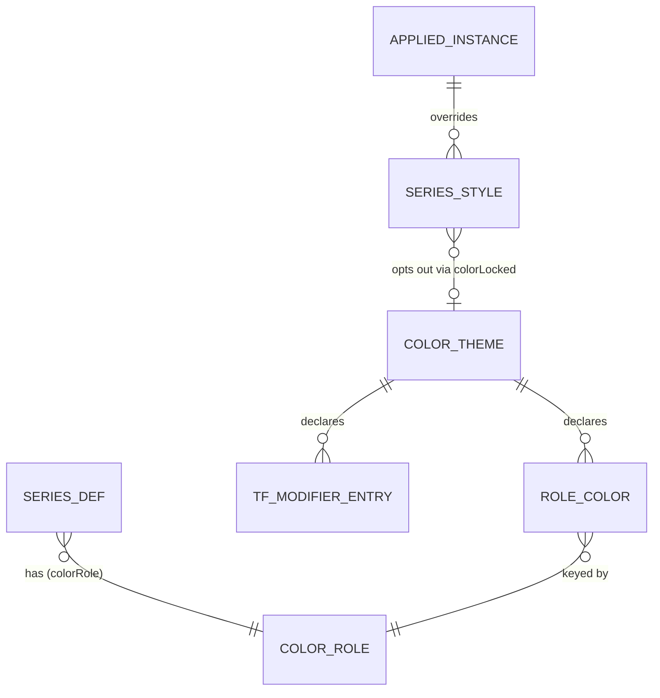

# 指標カラーテーマ 基本設計書（仕様追加）

## 1. 文書情報

- 作成日：2026-08-09
- 最終更新：2026-08-09
- バージョン：v0.1.0（基本設計・未実装）
- 上位文書：`.doc/indicator-management-ui/基本設計書.md`（本書は §4 機能設計 / §5 データ設計への加法的追補）
- 同格文書：`.doc/indicator-management-ui/基本設計_チャートテンプレート.md`（本書の書式・章立ての参照実装。テーマとテンプレートは直交＝§3.3）
- 対象アプリ：統合 UI `unified_ui`（公開 8000・ライブ／リプレイをモード切替）
- 依頼者確定事項（2026-08-09）：
  - 解決順＝**ロック色 → 役割色 → payload 色 → 既定色** の純関数 1 本（§4.4）
  - テーマのデータ形＝`{themeId, name, roleColors, tfModifier?, createdAt, updatedAt}`（§4.3）
  - 適用範囲 v1 ＝**指標系列の色のみ**（チャートクロム・ヒート配色・売買マーカーは非目標＝§3.2）
  - テンプレート保存時に**テーマ由来の色を `styles` へ焼き付けない**（§3.3・UC-C06）
  - 指標 Python 25 ファイルは**無改変**（payload 色はフォールバックへ降格するのみ）
  - 永続化キーは `indicatorUi.themes.v1` / `indicatorUi.activeTheme.v1` を**新設**（既存キー無改変）

### 1.1 改訂履歴

| 版 | 日付 | 内容 |
|---|---|---|
| v0.1.0 | 2026-08-09 | 初版。実測（§2）に基づき ColorRole 語彙 7 種を確定し、解決順・変調規則・永続化・段階分割を規定 |

### 1.2 上流入力に対する是正（本書で採用しなかった／条件付きで採用した上流前提）

上流（依頼指示）の前提のうち、実測で成立しなかったものを以下に明示する。判定根拠は §2 の E 番号。

| # | 上流前提 | 実測 | 本書の判定 |
|---|---|---|---|
| U-1 | 指標既定色のリテラルは 23 ファイル | `indigators/*/src/lwc_chart.py` は **25 ファイル**（E-2）。うち `tickvol_updown` は `catalog.js` 未登録 | **是正して採用**（25 ファイル・無改変の方針は不変） |
| U-2 | 静的 `SeriesDef` は 29 件 | 登録 26 IndicatorDef に対し `SeriesDef` は **94 件**（静的 87 / 動的 7）（E-4） | **是正して採用**（語彙確定は 94 件全数に対して実施＝§4.1） |
| U-3 | 色の直書きは 3 層 | **4 層**。pane 指標の水準線は backend 色を front の `schemeColor` が上書きする（E-8） | **是正して採用**（第 4 層を §3.2・§4.4 の規則で明示的に扱う） |
| U-4 | 適用範囲 v1 に「水準線」を含む | 水準線（`horizontal_line`）は `priceLine` 経路で、既存の系列スタイル入口（`applySeriesStyle`）から**到達できない**（E-7・E-8） | **条件付き採用**。役割 `level` を語彙に含めたうえで、専用の追加ポート 1 個を新設して届ける（§7.2 案 S2） |
| U-5 | 解決順は「ロック色 → 役割色 → payload 色 → 既定色」の 4 段 | この 4 段だけだと、**テーマ未設定時に既存ユーザーの個別色（`colorLocked` 無し）が payload 色に戻る**＝現行挙動の破壊（E-6） | **条件付き採用**。役割色と payload 色の間に「ロックなし個別色」を 1 段挿入した 5 段にする（§4.4・上流の 4 段の相対順序は不変） |
| U-6 | `calcTimeframeParam` は `catalog.js:886` | 実体は `catalog.js:885-891`、付与関数は `:900-905` | **是正して採用** |
| U-7 | `_applyStoredStyles` は `indicator_controller.js:374-395` | 実体は `:380-397`（`:374-379` は docstring） | **是正して採用** |
| U-8 | `theme` / `テーマ` の語はコード・設計文書に存在しない（命名衝突なし） | 全 HTML の `<html>` 要素が `data-theme="dark"` を持つ（E-15）。**`theme` は既に「明暗のクロム配色」を指す語として使用中** | **棄却**。§1.3 の命名規約で衝突を回避する |

### 1.3 用語と命名規約（E-15 による）

`theme` は既に「明暗（ダーク／ライト）のクロム配色」を指す語として使われている（`data-theme="dark"`）。本件の概念は「指標系列の役割 → 色の写像」であり別物である。同一の呼び名を 2 つの概念へ付けない（認知負荷の最小化）ため、以下を規約とする。

| 対象 | 本件で用いる名 | 理由 |
|---|---|---|
| 概念の呼称（UI 文言・文書） | **指標カラーテーマ**（UI 上の短縮表示は「テーマ」だが、常にインジケーター操作系のメニュー内に置く） | `data-theme` はチャート外の DOM 属性であり、ユーザーの操作対象として露出していない |
| DOM id / CSS クラス | `color-theme-menu` / `.color-theme-menu` 等、**`color-theme-` 接頭辞**を必ず付ける | `theme-` 接頭辞は `data-theme` のスコープと衝突する |
| JS の型・関数名 | `ColorTheme` / `ColorRole` / `colorRole` / `resolveSeriesColor` | 同上 |
| localStorage キー | `indicatorUi.themes.v1` / `indicatorUi.activeTheme.v1`（依頼者確定 D-6・変更しない） | `indicatorUi.` 名前空間で既に限定されており、`data-theme`（DOM 属性）とは名前空間が交わらない |

---

## 2. 課題（実測事実）

すべて 2026-08-09 時点の作業ツリー（worktree `spec-indicator-color-theme`・develop 42e358f 基準）で再検証済み。行番号は同時点のもの。

| # | 事実 | 実証根拠 |
|---|---|---|
| E-1 | 系列の色は「意味」ではなく「値」として保持されている。`SeriesDef` は色の**値**を持つ席（`colorRule`）を宣言するが、意味（役割）を持つ席は存在しない | `domain/domain_models.js:25-61`（`colorRule` は `:35` 引数・`:49` 代入） |
| E-2 | 指標既定色のリテラルは各指標の Python 出力アダプタに直書きされている。`indigators/*/src/lwc_chart.py` は **25 ファイル**在席し、25 件すべてに色リテラルまたは色引数が在る | `Glob indigators/*/src/lwc_chart.py`＝25 件／例：`moving_averages/src/lwc_chart.py:44-46`・`btlm_trail/src/lwc_chart.py:31-34`・`ma_marod/src/lwc_chart.py:55-60` |
| E-3 | 色リテラルの**命名**は既に意味区分を持つ（`_COLOR_MA` / `_COLOR_SMOOTH` / `_COLOR_BAND` / `_COLOR_OFFSET` / `_COLOR_METRIC` / `_LEVEL_COLOR` / `_SIGNAL_COLOR` / `_QUANTILE_COLOR` / `_GPD_COLOR` 等）。すなわち役割の概念は既に存在し、**型として表現されていない**だけである | `moving_averages/src/lwc_chart.py:44-46`／`btlm_trail/src/lwc_chart.py:31-34`／`btlm_trail_marod/src/lwc_chart.py:52-57`／`tickvol/src/lwc_chart.py:52-57`／`profit_mfi_macd/src/lwc_chart.py:55-59` |
| E-4 | 意味を跨いだ色の共有は既に 1 箇所で実現している。外れ値イベント水準線の色は共有定数 `EVQ_COLOR` が単一情報源で、**5 指標**（btlm_trail_marod / ma_marod / cvfe / tickvol / profit_rsi）へ共通に届く（marod 2 指標は共有 emit 経由、他 3 指標は直接 import） | `common/event_quantiles.py:38-39`（定数）・`:244-254`（`emit_evq_lines` が `EVQ_COLOR` で emit）／直接 import：`tickvol/src/lwc_chart.py:43`・`profit_rsi/src/lwc_chart.py:35`・`cvfe/src/lwc_chart.py:80`／共有 emit 経由：`btlm_trail_marod/src/lwc_chart.py:55`・`ma_marod/src/lwc_chart.py:58`（いずれも「単一情報源」と明記） |
| E-5 | `catalog.js` の登録指標は **26 件**、宣言された `SeriesDef` は **94 件**（静的 87・動的 7）。上流前提の「静的 29 件」は成立しない | `usecase/catalog.js:907-912`（REGISTRY 26 件）／内訳の全数は §4.1 表 |
| E-6 | `SeriesDef.colorRule` への**代入は 0 件**。読み出しは `properties_dialog.js:417` の 1 箇所のみで、しかも `_seriesStyles` 未供給時（SSR／単体テスト）のフォールバック分岐でしか通らない。実運用では常に `toHex(null)` ＝ `#2962ff` を返す | `Grep colorRule`＝`domain_models.js:35,49` と `properties_dialog.js:417` の 2 ファイルのみ（`prototype_260626-01/` は別系統）／`properties_dialog.js:399-425`（`_seriesStyles` 在席時は `buildSeriesStyleRows` 経路）／`property_control_builders.js:35-49`（`toHex` は非色文字列に `#2962ff` を返す） |
| E-7 | 実描画色の供給元は `/compute` payload の `color`。back は `_line_payload` が `kwargs["color"]` をそのまま載せ、front は `_renderSeries` が `options.color = p.color` として系列生成オプションへ渡す | `api/adapter/compute/fake_chart.py:62-79`（`:73` が `"color": kwargs.get("color")`）／`adapter/front/series_drawer.js:139-156`（`:153`） |
| E-8 | **色の値は 4 層に分かれて直書きされている**。(1) 指標 Python の色リテラル（E-2）、(2) front クロム色（背景 `#131722`・グリッド `#1f2530`・ローソク `#26a69a`/`#ef5350`）、(3) ユーザー個別上書き `AppliedInstance.styles`、(4) **pane 指標の水準線は backend 色を front のアルゴリズム色（緑→赤の距離補間 `schemeColor`）が上書きする** | (2) `adapter/front/chart_bootstrap.js:18-46`（`:20`背景・`:25`グリッド・`:39-41`ローソク）／(3) `domain/domain_models.js:68`・`usecase/facade.js:121-137`／(4) `adapter/front/series_drawer.js:257-286`（`:264` `useScheme = !!slot.pane && lines.length > 0`・`:272-275` が backend の `h.color` を捨てる）・`:30-35`（`SCHEME_CALM`/`SCHEME_HOT`/`LEVEL_LINE_DIM`） |
| E-9 | ユーザー個別上書きの適用点は 1 箇所。描画の最後に必ず `_applyStoredStyles` が走り、`styles[系列名]` の patch を `applySeriesStyle` へ流す。**テーマの適用点として再利用できる唯一の共通後段**である | `adapter/front/series_render_router.js:101-103`（`draw` の末尾で `host._applyStoredStyles(instanceId)`）／`adapter/front/indicator_controller.js:380-397`（`:394-396` が patch ループ） |
| E-10 | `applySeriesStyle` が届く系列は `slot.lines`＝`line` / `histogram` / `level_dash` のみ。`horizontal_line` は `priceLine` として別経路で生成され `styleMeta` に載らないため、**既存のスタイル入口からは色を変えられない** | `adapter/front/series_drawer.js:139-255`（`_renderSeries` が `slot.lines`・`slot.styleMeta` へ登録）／`:257-286`（`_createPriceLines` は `slot.priceLines` のみ）／`adapter/front/chart_renderer.js:504-511`（`renderHorizontal`）・`:789-795`（`getSeriesStyles` は `styleMeta` のみ返す） |
| E-11 | ヒート配色（per-point `color`）を持つ系列は、色 patch を構造的に無視する（ヒート絶対優先＝確定仕様・ISSUE-112） | `adapter/front/series_drawer.js:220`（`heat` 判定）・`:327`（`patch.color != null && !(supportsHeat && meta.heat)` のときのみ色を採用） |
| E-12 | `AppliedInstance.styles` へのキー追加は加法的に成立する。`setSeriesStyles` は patch を `{ ...merged[name], ...fields }` で素通しマージし、`reconcileSeriesStyles` は系列単位のオブジェクトを丸ごと保持する。永続化は JSON 逐語 | `usecase/facade.js:121-137`（`:132` マージ）・`:89-117`（`:108-113` 保持）／`adapter/front/local_storage_gateway.js:11`（`indicatorUi.applied.v1`） |
| E-13 | アクター駆動指標（`market_profile` / `tickvol_bands`）は `/compute` を持たず、`SeriesDef` はダミー 1 件（描画に用いられない）で、実描画は canvas プリミティブ内の色リテラルで行う。**系列色の経路に一切乗らない** | `usecase/actor_driven_ids.js:9-13`／`market_profile/web/js/usecase/catalog_entry.js:179-181`（「描画には用いられない」＝`:80-81`）／`usecase/tickvol_bands_catalog_entry.js:54-57`／`adapter/front/tickvol_bands_primitive.js:19,99`（`TVB_BAND_FILL` を `fillStyle` へ直書き） |
| E-14 | 全指標インスタンスは「計算.時間足」param（`timeframe`・値は `chart` ＋ `TF_CODES`）を持つ。ただし**アクター駆動指標は対象外**として注入されない | `usecase/catalog.js:885-891`（`calcTimeframeParam`）・`:900-905`（`withCalcTimeframe` が `isActorDriven` を除外）・`:907-912`／`domain/tf_meta.js:19-22`（`TF_CODES` は台帳 `TF_LEDGER` 由来） |
| E-15 | **`theme` の語は既に使われている**。全 HTML の `<html>` 要素が `data-theme="dark"` を持ち、これは明暗（ダーク／ライト）のクロム配色を指す。設計文書側には一致が無い（本書を除く） | `Grep -i "theme"`＝`indigators/indicator_ui/web/index.html:2`・`unified_ui/web/index.html:2`・`simulator/replay_ui/web/index.html:2`・`prototype_260626-01/web/index.html:2`（いずれも `data-theme="dark"`）／`.doc/indicator-management-ui/**` は本書のみ 145 件 |
| E-16 | 永続化キーの命名規約・破損時挙動・Quota 挙動・接頭辞の扱いには参照実装が在る。テーマ用ゲートウェイはこれと同型で新設できる | `adapter/front/local_storage_gateway.js:8-14`（既存 5 キー）／`adapter/front/local_storage_template_gateway.js:17-21`（後発の 3 キー・`:14-15` 接頭辞は付けない） |
| E-17 | ライブ／リプレイは統合 UI の単一オリジン・単一 bootstrap であり、`indicatorUi.*` の localStorage 名前空間は両モードで同一実体である | `基本設計_チャートテンプレート.md:41-45`（E-6・E-9・E-10）・`:140`（「上記 4 キーはライブ／リプレイで同一実体」） |
| E-18 | テンプレートは `styles` を丸ごと保存する。**現状はテーマ由来の色も同じ席へ焼き付く構造になっている** | `usecase/chart_templates.js:93-101`（`:99` `styles: instance.styles ?? null`）／`adapter/front/chart_template_controller.js:351-386` |
| E-19 | テンプレートの上限は「最大 50 件・名前最大 40 文字」で確定済み。テーマの上限はこれと同型に定める根拠がある | `基本設計_チャートテンプレート.md:355`（A-2）・`:100`（名前 1〜40 文字）・`:168`（新規保存の上限 50 件） |
| E-20 | **payload 色（backend 既定色）は描画後に失われる**。`styleMeta.color` は生成時に payload 色で初期化されるが、`applySeriesStyle` が同じフィールドを破壊的に上書きする。したがって一度でも色を上書きすると、その系列の backend 既定色を再取得する手段が**再描画まで存在しない** | `adapter/front/series_drawer.js:215-224`（`color: p.color ?? null` で初期化。フィールドは name / kind / color / width / style / visible / heat / display / barEditable の 9 種で、payload 色の保存先は無い）／`:328`（`meta.color = patch.color`）／`adapter/front/chart_renderer.js:789-795`（`getSeriesStyles` は `styleMeta` をそのまま返す） |

### 2.1 課題の要約

E-1〜E-4 の合成：**色の「意味」は既に存在する（E-3・E-4）が、それを表現する型が無い（E-1・E-6）**。そのため意味は 25 個の Python ファイル（E-2）と front の 2 経路（E-8）へ値として分散し、「バンドの色をまとめて変える」操作が構造的に不可能になっている。ユーザーが取れる手段は系列 1 本ずつの手作業上書き（E-9）のみで、指標を足すたび・時間足を変えるたびに同じ作業が再発する。本件の手間の実体はこれである。

---

## 3. スコープ

### 3.1 対象（In）

| 要件 ID | 概要 |
|---|---|
| FR-C01 | 全 `SeriesDef` に色の**役割**（ColorRole）を宣言する席を設け、94 件全数へ付与する |
| FR-C02 | 役割 → 色 の写像（テーマ）を名前付きで作成・保存する |
| FR-C03 | テーマを適用し、適用中の全指標・全系列の色を一括で切り替える |
| FR-C04 | テーマを改名・削除する |
| FR-C05 | 系列単位で色を**ロック**し、テーマ適用の対象外にする |
| FR-C06 | 時間足に応じた色の変調（`tfModifier`）を宣言し、計算.時間足ごとに明度差を付ける |
| FR-C07 | テーマ集合と選択中テーマを永続化し、再読込後も保持する |
| FR-C08 | テーマ集合はライブ／リプレイで**共有**する（E-17 に整合） |
| FR-C09 | テーマとテンプレートを直交させる（テンプレート保存時にテーマ由来の色を焼き付けない） |

### 3.2 対象外（Out・非目標）

| # | 非目標 | 理由（実測に基づく） |
|---|---|---|
| N-1 | チャートクロム（背景・グリッド・軸・ローソク・現在値ライン）の色 | 供給点が指標系列と完全に別（`chart_bootstrap.js:18-46`＝チャート生成時 1 回・E-8(2)）。同一のテーマ機構へ載せると「指標の色」と「チャートの色」という別概念が 1 つの入口に同居し、認知負荷が増える。指標色の役割語彙が確定した後に、別書で同型に拡張する |
| N-2 | ヒート配色（per-point `color`）| `series_drawer.js:327` が色 patch を構造的に無視する（ヒート絶対優先＝ISSUE-112 の確定仕様・E-11）。テーマから色を送っても届かないため、席を作ること自体が「効かないツマミ」になる |
| N-3 | 売買マーカーの色 | 系列ではなくマーカー API 経路。`SeriesDef` を持たず役割の付与先が存在しない |
| N-4 | アクター駆動指標（`market_profile` / `tickvol_bands`）の色 | `/compute` を持たず `SeriesDef` はダミー（描画に用いられない）。実描画は canvas プリミティブの色リテラルで、系列色の経路に一切乗らない（E-13）。役割を付与しても届く先が無い |
| N-5 | pane 指標の水準線に対する `schemeColor`（緑→赤の距離補間）の撤去 | 撤去は既存の見た目の破壊的変更。本件は**追加のみ**で成立させる（テーマが `level` の色を宣言したときに限り `schemeColor` より優先する＝§4.4 R-3） |
| N-6 | 色以外のスタイル（線幅・線種・ドット／棒表示・可視性）のテーマ化 | `styles` の他フィールドは現行どおり系列単位で保持する。v1 で拡げると「役割」の意味が色から離れ、語彙が閉じなくなる |
| N-7 | テーマのファイル書き出し・読み込み・端末間共有 | テンプレートの既存規定（`基本設計_チャートテンプレート.md:76`）に揃える |
| N-8 | 色覚特性への自動適合・コントラスト自動検証 | 変調規則の決定論性（§4.5）を保つため、色は宣言値と明示係数のみから決まる。自動補正は入れない |

### 3.3 テンプレートとの直交（確定）

- **テンプレート＝どの指標を出すか。テーマ＝どの色で出すか。** 両者は独立に保存・適用され、片方の適用が他方の状態を変えない。
- テンプレート保存時に**テーマ由来の色を `styles` へ焼き付けない**。焼き付けると、テーマを変えても古いテンプレートから復元した系列だけ旧色のまま残り、E-1 の病因（意味が値へ潰れる）を再生産する。
- テンプレートが `styles` へ保存するのは `colorLocked === true` の系列の色のみ（UC-C06）。それ以外の色は保存対象から落とす。

### 3.4 ビュー自動介入の禁止（確定）

テーマの作成・適用・改名・削除・ロック操作は、以下に**一切触れない**。

- チャート時間足／表示レンジ（可視論理レンジ）／価格スケール（手動レンジ・オートスケール状態）／スクロール位置／ライブ追従状態／リプレイのモード・再生位置。

テーマ適用は既存系列に対する `applySeriesStyle`（＋ §7.2 の水準線ポート）の呼び出しのみで完結し、`setData` / `fitContent` / `setVisibleLogicalRange` / `applyOptions({autoScale})` を呼ばない。ISSUE-164（ビュー自動介入禁止の裁定）を侵さない。

---

## 4. データ設計

### 4.1 ColorRole 語彙（実測に基づく確定）

#### 4.1.1 語彙（閉じた 7 種）

役割は `SeriesDef` 単位に 1 つだけ宣言する。語彙は閉集合であり、未知トークンは §5.7 F-C3 で扱う。

| role | 日本語表示 | 意味（何を表す系列か） | 語彙決定の根拠（実測） |
|---|---|---|---|
| `primary` | 本体 | その指標の主出力そのもの（オシレータ本体・MA 本線・本体ヒストグラム） | back の `_COLOR_MA` / `_COLOR_MA_MAROD` / `_COLOR_MAROD` / `_RSI_COLOR` / `_MFI_COLOR` / `_HIST_COLOR` / `_MACD_COLOR` / `_COLOR`（profit_* 各所）が担う区分 |
| `signal` | 副線 | 主出力から派生する平滑線・シグナル線・副オシレータ | `_COLOR_SMOOTH`（`moving_averages:45`）/ `_SIGNAL_COLOR`（`profit_mfi_macd:57`）/ `_MA_COLOR`（`profit_mfi:36`）/ `_RCI_COLOR`（`profit_oscillator2:42`） |
| `center` | 中心 | 基準となる中心水準（回帰平均線・中心線） | `_COLOR_MEAN`（`btlm_trail:31`）/ `COLOR_MID`（`cvfe:110`） |
| `band` | 帯 | 正常域の境界（分位バンド・BB 上下・確率帯） | `_COLOR_BAND`（`btlm_trail:32`・`moving_averages:46`）/ `_COLOR_QUANTILE`（`ma_marod:57`）/ `_QUANTILE_COLOR`（`tickvol:57`・`profit_rsi:47`）/ `COLOR_BAND`・`COLOR_OUTER`（`cvfe:108-109`）/ profit_band の bucket 色（`profit_band:55-58`） |
| `extreme` | 外れ値 | 外れ値・極端水準（イベント分位・GPD 外挿・オフセット） | 共有 `EVQ_COLOR`（`common/event_quantiles.py:38`・4 指標が参照＝E-4）/ `_GPD_COLOR`（`tickvol:54`・`profit_rsi:49`）/ `_COLOR_OFFSET`（`btlm_trail:33`） |
| `level` | 水準線 | 価格軸に並ぶ水準線群（`horizontal_line` 経路の全系列） | `_LEVEL_COLOR`（`profit_*` 各所・`ma_marod:60`）/ `_BULL_COLOR`・`_BEAR_COLOR`（`price_range_power:27-28`）/ `_OVERLAY_COLOR`（`profit_hlband:58`）/ `_BAND_COLOR`（`profit_hl_band:42`） |
| `readout` | 読取専用 | 読取欄へ値を供給するだけの系列（`readout_only`） | `_COLOR_METRIC`（`btlm_trail:34`）。`btlm_trail:173-184` が beta / sigma / band_hit_rate の 3 系列を `readout_only=True` で emit |

**語彙をこの 7 種に閉じた根拠**：back の色定数の命名区分（E-3）と共有色定数の実在（E-4）は、既にこの 7 区分に一致する。これ以上細分すると同一概念に複数の呼び名を作ることになり（`_HIST_COLOR` と `_MACD_COLOR` を別役割にする等）、テーマ編集 UI の項目数が指標数に比例して増える。これ以下に統合すると、`center` と `band`（中心線と帯）のように「テーマで別色にしたい」動機が明白な区分が潰れる。

#### 4.1.2 付与規則（決定論・例外なし）

1. `kind === 'horizontal_line'` の `SeriesDef` は**必ず** `level`。例外を作らない（供給経路が `priceLine` で構造的に別のため・E-10）。
2. `readout_only` で emit される系列は `readout`。
3. 同一 `seriesName` を複数の `SeriesDef` が宣言する場合（`cvfe` の `LEVEL_DASH` ＋ `LINE`）、**全宣言で同一 role** とする。解決は系列名で行うため、食い違うと非決定になる。
4. 動的系列（`seriesNamePattern` 持ち）は、パターン単位で 1 つの role を持つ。展開後の全系列が同 role になる。
5. アクター駆動指標のダミー `SeriesDef` も規則 1 により `level` を持つ。描画されないため無害（E-13）。

#### 4.1.3 全 94 件の付与内訳（`usecase/catalog.js` 実測全数）

| # | 指標 id | SeriesDef 数 | primary | signal | center | band | extreme | level | readout | 出典 |
|---|---|---|---|---|---|---|---|---|---|---|
| 1 | tgp_btlm | 2 | 0 | 0 | 1 | 1 | 0 | 0 | 0 | `catalog.js:120-129` |
| 2 | btlm_trail | 7 | 0 | 0 | 1 | 1 | 2 | 0 | 3 | `catalog.js:209-224` |
| 3 | btlm_trail_marod | 7 | 1 | 0 | 0 | 1 | 4 | 1 | 0 | `catalog.js:297-312` |
| 4 | ma_marod | 7 | 1 | 0 | 0 | 1 | 4 | 1 | 0 | `catalog.js:492-508` |
| 5 | cvfe | 18 | 0 | 0 | 2 | 8 | 8 | 0 | 0 | `catalog.js:778-787` |
| 6 | profit_band | 1 | 0 | 0 | 0 | 1 | 0 | 0 | 0 | `catalog.js:357-365` |
| 7 | price_range_power | 1 | 0 | 0 | 0 | 0 | 0 | 1 | 0 | `catalog.js:400-402` |
| 8 | moving_averages | 4 | 1 | 1 | 0 | 2 | 0 | 0 | 0 | `catalog.js:447` |
| 9 | market_profile | 1 | 0 | 0 | 0 | 0 | 0 | 1 | 0 | `market_profile/.../catalog_entry.js:179-181` |
| 10 | tickvol_bands | 1 | 0 | 0 | 0 | 0 | 0 | 1 | 0 | `tickvol_bands_catalog_entry.js:55-57` |
| 11 | tickvol | 5 | 1 | 0 | 0 | 1 | 3 | 0 | 0 | `catalog.js:856-869` |
| 12 | profit_adx_needle | 2 | 1 | 0 | 0 | 0 | 0 | 1 | 0 | `catalog.js:549-553` |
| 13 | profit_arctan | 2 | 1 | 0 | 0 | 0 | 0 | 1 | 0 | `catalog.js:554-563` |
| 14 | profit_mfi | 3 | 1 | 1 | 0 | 0 | 0 | 1 | 0 | `catalog.js:564-568` |
| 15 | profit_rsi | 6 | 1 | 0 | 0 | 1 | 4 | 0 | 0 | `catalog.js:609-621` |
| 16 | profit_stc | 2 | 1 | 0 | 0 | 0 | 0 | 1 | 0 | `catalog.js:623-627` |
| 17 | profit_oscillator | 2 | 1 | 0 | 0 | 0 | 0 | 1 | 0 | `catalog.js:628-632` |
| 18 | profit_oscillator2 | 3 | 1 | 1 | 0 | 0 | 0 | 1 | 0 | `catalog.js:633-640` |
| 19 | profit_osi_ma | 2 | 1 | 0 | 0 | 0 | 0 | 1 | 0 | `catalog.js:641-648` |
| 20 | profit_rmm | 2 | 1 | 0 | 0 | 0 | 0 | 1 | 0 | `catalog.js:649-653` |
| 21 | profit_volatility | 2 | 1 | 0 | 0 | 0 | 0 | 1 | 0 | `catalog.js:654-663` |
| 22 | profit_hl_band | 1 | 0 | 0 | 0 | 0 | 0 | 1 | 0 | `catalog.js:664-668` |
| 23 | profit_hlband | 2 | 1 | 0 | 0 | 0 | 0 | 1 | 0 | `catalog.js:672-677` |
| 24 | profit_mfi_macd | 4 | 2 | 1 | 0 | 0 | 0 | 1 | 0 | `catalog.js:678-682` |
| 25 | profit_rmm_macd | 3 | 2 | 1 | 0 | 0 | 0 | 0 | 0 | `catalog.js:683-687` |
| 26 | profit_rsi_macd | 4 | 2 | 1 | 0 | 0 | 0 | 1 | 0 | `catalog.js:688-692` |
| — | **合計** | **94** | **21** | **6** | **4** | **17** | **25** | **18** | **3** | — |

- 静的 `SeriesDef` 87 件／動的 7 件（tgp_btlm・btlm_trail・btlm_trail_marod・ma_marod・profit_band・tickvol・profit_rsi が各 1 件）。
- 既知の色の縮退：`profit_mfi_macd` / `profit_rmm_macd` / `profit_rsi_macd` は本体ヒストグラムと MACD 線がいずれも `primary` になるため、テーマ適用時に同色になる。現行は `_HIST_COLOR` と `_MACD_COLOR` で別色（`profit_mfi_macd:55-56`）。**これは役割語彙を閉じたことの帰結であり、必要な区別はユーザーが `colorLocked`（FR-C05）で個別に確保する**。テーマ未適用時は現行色のまま（§4.4 で保証）。

### 4.2 エンティティ



### 4.3 COLOR_THEME

| 属性 | 型 | 必須 | 説明 |
|---|---|---|---|
| `themeId` | string | 必須 | 一意 id。採番規則 `thm#{seq}`（§4.7） |
| `name` | string | 必須 | 表示名。1〜40 文字（前後空白は trim）。空は不可。正規化名（trim ＋小文字化）の重複は不可 |
| `roleColors` | `{ [role]: hex }` | 必須（0 件可） | 役割 → 色。キーは §4.1.1 の 7 トークンのみ。値は `#rrggbb`（小文字 6 桁）。**0 件＝恒等テーマ**（何も変えない） |
| `tfModifier` | `{ [timeframe]: number }` \| null | 必須（null 可） | 時間足 → 明度係数 `l ∈ [-1, 1]`（小数第 3 位まで）。キーは `TF_CODES`（`domain/tf_meta.js:22`）のみ。未宣言の足は `l = 0` |
| `createdAt` | int（UNIX 秒） | 必須 | 作成時刻 |
| `updatedAt` | int（UNIX 秒） | 必須 | 最終更新時刻（同名上書き・改名・色編集で更新） |

**保存しない属性と理由**

| 属性 | 保存しない理由 |
|---|---|
| 系列名ごとの色 | 系列名で持つと E-1 の病因（意味が値へ潰れる）の再生産になる。テーマは役割単位のみ |
| 指標 id ごとの色 | 同上。指標を足すたびにテーマの改訂が要る＝OCP 違反になる |
| チャートクロム色 | §3.2 N-1 |

**`tfModifier` が 3 用途を同一の型で吸収すること**

| 用途 | 宣言 |
|---|---|
| 時間足に依らず一貫した配色 | `tfModifier: null`（または全キー `0`） |
| 役割色 × 時間足の明度差 | `roleColors` を役割ごとに宣言し、`tfModifier` に足ごとの `l` を宣言 |
| 時間足別カラーのみ（役割で分けない） | `roleColors` の 7 役割すべてに同一色を宣言し、`tfModifier` で足ごとに `l` を変える |

### 4.4 解決順（純関数・単一情報源）

`resolveSeriesColor` は DOM・Storage・chart API に依存しない純関数とする。同一入力に対し常に同一出力を返す。

```
resolveSeriesColor({ styles, seriesName, role, theme, timeframe, payloadColor }) -> string

  入力:
    styles       : AppliedInstance.styles（null 可）
    seriesName   : 実描画系列名（string）
    role         : ColorRole トークン（未宣言は null）
    theme        : COLOR_THEME（未選択は null）
    timeframe    : 当該インスタンスの計算.時間足を解決した結果（TF_CODES の要素・§4.6）
    payloadColor : 系列生成時に記録した backend 既定色（/compute payload の color）。
                   供給元は styleMeta.baseColor（不変・R-6）。無ければ null

  s = (styles && styles[seriesName]) || null

  ステップ 1（ロック色・最優先）:
    if s && s.colorLocked === true && isColor(s.color):
        return s.color

  ステップ 2（役割色）:
    if theme && role != null && isHex6(theme.roleColors[role]):
        return applyTfModifier(theme.roleColors[role], theme.tfModifier, timeframe)

  ステップ 3（ロックなし個別上書き）:
    if s && isColor(s.color):
        return s.color

  ステップ 4（backend 既定＝payload 色）:
    if isColor(payloadColor):
        return payloadColor

  ステップ 5（既定色）:
    return '#2962ff'
```

- `isColor(v)`：`v` が string かつ `/^#[0-9a-fA-F]{3}$/`・`/^#[0-9a-fA-F]{6}$/`・`/^rgba?\(/i` のいずれかに一致すること。既存 `toHex`（`property_control_builders.js:35-49`）が受理する集合と一致させる。
- `isHex6(v)`：`v` が `/^#[0-9a-f]{6}$/` に一致すること（テーマの保存値は正規化済みの小文字 6 桁のみ）。
- ステップ 3 の存在理由（上流指示への是正・U-5）：これを欠くと**テーマ未選択時に既存ユーザーの個別色が payload 色へ戻る**＝現行挙動の破壊になる。ステップ 3 を挟むと、テーマ未選択時の解決結果は現行の `_applyStoredStyles` の結果と一致する（`styles.color` があればそれ、無ければ payload）。上流が指定した 4 段の**相対順序は不変**である。

#### 適用時の補則規則（決定論）

| # | 規則 |
|---|---|
| R-1 | 解決結果の適用先は色のみ。`width` / `style` / `visible` / `display` は現行どおり `styles` から `_applyStoredStyles` が適用する。色の書き手を 2 つ作らない |
| R-2 | ヒート系列（E-11）はステップ 1〜5 の結果によらず色が反映されない。resolver は呼ぶが `applySeriesStyle` が構造的に無視する。テーマ編集 UI は「ヒート系列には効かない」ことを表示せず、席も作らない（§3.2 N-2） |
| R-3 | `level` 役割の系列について、テーマが `roleColors.level` を**宣言していない**場合は現行経路（pane＝`schemeColor` / overlay＝payload 色）をそのまま使う。宣言している場合のみ、`schemeColor` に優先して解決色を用いる。これにより「テーマ未選択＝現行と完全一致」が `level` でも成立する（E-8(4) との両立） |
| R-4 | 役割未宣言（`role == null`）の系列はステップ 2 を飛ばす＝payload 色へ降格する。カタログに無い系列名が届いても壊れない |
| R-5 | `theme.roleColors` に §4.1.1 以外のキーがあれば無視する（前方互換）。`SeriesDef.colorRole` に未知トークンがあれば `role = null` として扱う（F-C3） |
| R-6 | ステップ 4 の `payloadColor` は、**系列生成時に記録した不変の backend 既定色**（`styleMeta.baseColor`）から取る。現在の描画色（`styleMeta.color`）を使ってはならない。理由：`styleMeta.color` は `applySeriesStyle` が破壊的に上書きするため（E-20）、テーマ A → テーマ B（B は当該 role 未宣言）と切り替えたときに「A の色」を backend 既定色と誤認し、結果が適用履歴に依存して非決定になる。`baseColor` は生成時に 1 回だけ書き、`applySeriesStyle` は決して書き換えない（§7.2 S2(c)） |

### 4.5 `tfModifier` 変調規則（決定論・丸め規則まで確定）

```
applyTfModifier(hex, tfModifier, timeframe) -> hex

  1. l = (tfModifier && Number.isFinite(tfModifier[timeframe])) ? tfModifier[timeframe] : 0
  2. l = min(1, max(-1, l))                         // クランプ
  3. l = floor(l * 1000 + 0.5) / 1000               // 小数第 3 位へ丸め（0.5 は正方向へ）
  4. if l == 0: return hex                          // 恒等（副作用なし）
  5. hex を r, g, b（各 0..255 の整数）へ分解する
  6. 各チャネル c について:
       if l >= 0:  c' = c + (255 - c) * l           // 白へ寄せる
       else:       c' = c * (1 + l)                 // 黒へ寄せる
       c'' = min(255, max(0, floor(c' + 0.5)))      // 四捨五入（0.5 は上へ）・クランプ
  7. return '#' + hex2(r'') + hex2(g'') + hex2(b'')  // hex2 は小文字 2 桁 0 詰め
```

- 出力は常に `#rrggbb`（小文字 6 桁）。実装言語・浮動小数の丸めモードに依存しない（明示的な `floor(x + 0.5)` を用いる）。
- `l = 0` は恒等（ステップ 4 で早期復帰。ステップ 6 の両分岐も `l = 0` で `c' = c` となり一致する）。
- `l = 1` は `#ffffff`、`l = -1` は `#000000`。
- アルファは扱わない。テーマ適用時、backend 既定色が持っていたアルファ（例 `rgba(123, 104, 238, 0.6)`）は失われる。これは意図した仕様であり、根拠は (a) 変調式の入力を 1 形式に固定して決定論性を保つため、(b) 既存のユーザー個別上書き UI は `<input type="color">` 経由で `#rrggbb` しか生成できず（`toHex`・`property_control_builders.js:35-49`）、テーマの出力形式をそれと一致させることで下流（`applySeriesStyle`）の受理形が増えないため。

### 4.6 計算.時間足の解決（`tfModifier` の入力）

```
resolveInstanceTimeframe(instanceParams, chartTimeframe) -> timeframe
  tf = instanceParams && instanceParams.timeframe
  if tf == null or tf === 'chart' or tf not in TF_CODES:
      return chartTimeframe
  return tf
```

- 根拠：`timeframe` param は `chart` ＋ `TF_CODES` を値域に持ち（`catalog.js:885-891`）、全非アクター指標へ注入される（`catalog.js:900-905`）。
- アクター駆動指標は `timeframe` param を持たない（E-14）が、そもそも §3.2 N-4 で対象外。

### 4.7 永続化スキーマ（localStorage・基本設計書 §5.6 の命名規約に準拠・既存キーは無改変）

| 論理キー | 値スキーマ | 原子性単位 | 新設/既存 |
|---|---|---|---|
| `indicatorUi.themes.v1` | `{ themes: COLOR_THEME[] }` | テーマ集合全体 | 新設 |
| `indicatorUi.activeTheme.v1` | `{ themeId: string \| null, lastSeq: int }` | 選択中テーマ ＋ themeId 採番カウンタ | 新設 |
| `indicatorUi.applied.v1` | 既存スキーマ ＋ `styles[系列名].colorLocked: bool`（任意キー） | 既存のまま（適用済み構成全体） | **既存キーへ加法** |

- `applied.v1` への加法が非破壊であることの根拠：`setSeriesStyles` は patch を素通しマージし、`reconcileSeriesStyles` は系列単位オブジェクトを丸ごと保持し、永続化は JSON 逐語（E-12）。旧バージョンが読んでも `colorLocked` を無視するだけで壊れない。
- 物理キーは `scopedStorage` により `live:` 接頭辞が付く（E-17）。**新規 gateway は接頭辞を自前で付けず、注入された storage ポートをそのまま使う**（`local_storage_template_gateway.js:14-15` と同じ扱い）。
- **モード共有**：上記 3 キーはライブ／リプレイで同一実体（E-17・`基本設計_チャートテンプレート.md:140`）。テーマ・選択中テーマ・ロックはモード切替をまたいで保持される（FR-C08）。
- **破損時挙動**：JSON パース不能・スキーマ不一致は**当該キーのみ**空既定へ初期化し、他キーは温存。console に警告。全消去はしない（F-C4）。
- **QuotaExceeded**：当該書き込みを中止し、メモリ上の状態は保持。例外は投げない（F-C5）。
- **前方互換**：未知の上位版キー・未知の role キーは温存し、解釈できない領域は無視する。

### 4.8 themeId 採番規則

- 形式：`thm#{seq}`。`seq` は `indicatorUi.activeTheme.v1.lastSeq + 1`、発行と同時に永続化する。
- 全テーマ削除後も `lastSeq` は減算・削除しない（基本設計書 §5.7 と同方針＝id の再利用禁止）。
- `activeTheme.v1` 破損時は、初期化後の `lastSeq` を `themes.v1` 内の既存 `thm#N` の最大 N 以上に設定してから運用に入る（衝突回避を優先）。

### 4.9 上限値（テンプレートと同型・E-19）

| 対象 | 上限 | 根拠 |
|---|---|---|
| テーマ件数 | 最大 50 件 | テンプレートの確定上限（A-2）と同型。同一 UI の同型リストで異なる上限を持たせない |
| テーマ名 | 1〜40 文字（trim 後） | 同上 |
| `roleColors` のキー数 | 最大 7（語彙が閉じているため構造的上限） | §4.1.1 |
| `tfModifier` のキー数 | 最大 `TF_CODES.length`（構造的上限） | `domain/tf_meta.js:22` |

---

## 5. 機能仕様

### 5.1 UC-C01 テーマ作成・保存（FR-C02）

- 入力：テーマ名、7 役割それぞれの色（未指定可＝当該役割は payload 色へ降格）、`tfModifier`（未指定可）。
- 事前条件：なし。
- 処理（決定論的・この順序で固定）：
  1. 名前を trim して検証する（1〜40 文字）。
  2. 正規化名（trim ＋小文字化）が既存テーマと一致するかを判定する。
     - **一致しない場合**：新規採番（§4.8）して追加する。
     - **一致する場合**：確認を 1 段挟み、確認を経て**その既存テーマを上書き更新**する（`themeId` は保持、`name` は入力の表記を採用、`roleColors` / `tfModifier` を置換、`updatedAt` を更新、`createdAt` は不変）。
  3. 色は `toHex` 相当で `#rrggbb`（小文字）へ正規化してから保存する。正規化できない値は当該役割を未宣言として保存する。
  4. `themes.v1` を永続化する。
- 後条件：テーマ一覧に在席し `themes.v1` が永続化されている。**チャート上の色は変化しない**（保存は適用ではない）。
- 例外：
  - 名前が空（trim 後 0 文字）／40 文字超 → 保存せずダイアログ内にインライン表示（F-C1）。
  - 件数が上限 50 件に達している状態での**新規**保存 → 保存せず通知（F-C1）。上書き更新は可。
  - 書き込み Quota 超過 → 当該書き込み中止・メモリ状態は保持（F-C5）。

### 5.2 UC-C02 テーマ適用（FR-C03）

- 入力：`themeId`（または「テーマなし」）。
- 事前条件：当該 `themeId` がテーマ集合に在席すること（不在は F-C6）。
- 処理（決定論的・この順序で固定）：
  1. `activeTheme.v1.themeId` を当該 id（「テーマなし」なら `null`）へ更新し、永続化する。
  2. 適用済みインスタンスを `state.applied` の**宣言順**に走査する。各インスタンスについて、
     - 描画済み（`_meta` 在席）でなければスキップする。
     - `resolveInstanceTimeframe`（§4.6）で `timeframe` を決める。
     - `getSeriesStyles(instanceId)` で実描画系列名の一覧と各系列の `baseColor` を得る。
     - 各系列名について、カタログ定義から `role` を引き（§5.8 の解決規則）、`payloadColor = baseColor`（R-6）として `resolveSeriesColor`（§4.4）で色を決め、`applySeriesStyle(instanceId, name, { color })` を呼ぶ。
     - `level` 役割の系列は §7.2 の水準線ポートへ渡す（R-3 の条件を満たすときのみ）。
  3. 凡例を再描画する。
- **再計算を行わない**。`/compute` を呼ばず、`setData` を呼ばない。色は既存系列への `applyOptions` で完結する（`series_drawer.js:385`）。
- 適用が触らないもの（確定）：§3.4 の全項目。
- 例外：
  - ヒート系列 → 色 patch が構造的に無視される（R-2・F-C2）。エラーにしない。
  - 役割未宣言の系列 → payload 色へ降格（R-4）。エラーにしない。
  - 未知 role トークン → `role = null` として扱う（R-5・F-C3）。
  - `colorLocked === true` の系列 → ステップ 1 で確定し、テーマの色は届かない（仕様どおり）。

### 5.3 UC-C03 テーマ改名・削除（FR-C04）

- 改名：`name` を検証（1〜40 文字・正規化名の重複不可。ただし自身の現在名と同一正規化名への変更は許容）して更新し `updatedAt` を進める。`themeId`・`activeThemeId` は不変。**チャート上の色は変化しない**。
- 削除：確認を 1 段挟む（取り消し不能な状態変更のため）。削除後、
  - `activeThemeId` が当該 id なら `null` にする。
  - **チャート上の色は変更しない**（テーマ削除は色の巻き戻しではない）。次に描画が起こった時点から payload 色（＋ロック色・個別上書き）で解決される。この非対称性は「削除は取り消し不能な操作であり、その場で見た目を巻き戻すと誤操作の被害が拡大する」ため意図的に定める。

### 5.4 UC-C04 系列色のロック／解除（FR-C05）

- 入力：`instanceId`、系列名、ロック状態（true / false）。
- 処理：
  1. `setSeriesStyles(state, instanceId, { [系列名]: { colorLocked: <bool> } })` で state を更新する（E-12 により加法的）。
  2. ロック ON にした場合、**その時点で実描画されている色**を同時に `styles[系列名].color` へ書き込む（ロック対象の色が未定義になることを防ぐため）。実描画色は `getSeriesStyles(instanceId)` の `color`（`series_drawer.js:215-224` の `styleMeta`）から取る。
  3. `applied.v1` を永続化する。
  4. ロック OFF にした場合、`colorLocked` を `false` にするのみで `color` は残す（ステップ 3 の「ロックなし個別上書き」として引き続き有効）。テーマが当該 role を宣言していればテーマ色が勝つ。
- 後条件：以後のテーマ適用・再描画で、ロック ON の系列の色は不変（§4.4 ステップ 1）。
- **ユーザーがスタイルタブで色を編集した場合、`colorLocked` は自動で立てない**。理由：ロックは「テーマから除外する」という明示の意思表示であり、色を触っただけで除外扱いにすると、テーマ適用が「一部だけ効かない」状態を無言で作る。

### 5.5 UC-C05 時間足切替時の挙動（FR-C06）

- **発火条件**：時間足切替により指標が再計算・再描画されること（`timeframe_controller.js` の既存経路）。
- 処理：再描画の最後に走る `_applyStoredStyles`（E-9・`series_render_router.js:103`）と同じ後段で、resolver の結果を適用する。テーマ適用のための追加の再計算・追加の HTTP 往復は発生しない。
- `tfModifier` の効き方：各インスタンスの計算.時間足（§4.6）が変わった系列だけ色が変わる。計算.時間足を固定足で持つインスタンス（`params.timeframe` が `chart` 以外）は、チャート足を変えても色が変わらない。
- **時間足切替そのものの挙動は不変**。テーマは切替の順序・回数・再計算回数に一切介入しない。
- **ページ読込時（復元）**：`activeTheme.v1` を読み、復元描画の後段で同じ resolver が走る。テーマ適用のための追加処理を復元ループへ差し込まない。

### 5.6 UC-C06 テンプレート保存・適用時の挙動（FR-C09・例外規則）

- **テンプレート保存時（UC-T01）**：`toTemplateInstance`（`usecase/chart_templates.js:93-101`）が `styles` を保存する際、**`colorLocked === true` のエントリの `color` のみを残し、それ以外のエントリの `color` キーを落とす**。`width` / `style` / `visible` / `display` は現行どおり全エントリで保存する。
  - 根拠：テーマ由来の色は「テーマが決める値」であり構成ではない。焼き付けると、テーマを変えても当該テンプレート由来の系列だけ旧色で復元され、E-1 の病因を再生産する（E-18）。
  - `colorLocked` フラグ自体は保存する（ロックは構成に属するユーザーの意思表示であるため）。
- **テンプレート適用時（UC-T02）**：復元された各インスタンスに対し、既存の再構築ループの後段（`_applyStoredStyles`）で resolver が走る。テンプレートは `activeThemeId` を変更しない。
- **テーマ適用はテンプレートを変更しない**：`activeTemplateId`・`templates.v1`・`templateBindings.v1` に一切書き込まない。

### 5.7 失敗定義（基本設計書 §7.2.1 の F 系へ加法）

| ID | 失敗 | 検出方法 | システム挙動 |
|---|---|---|---|
| F-C1 | テーマ名が不正（空・40 字超・正規化名重複・件数上限） | 保存時の入力検証 | 保存中止・ダイアログ内インライン表示。既存データは不変 |
| F-C2 | ヒート系列へ色を適用しようとした | `applySeriesStyle` の heat ゲート（`series_drawer.js:327`） | 色は反映されない。エラーにしない・警告も出さない（確定仕様どおりの正常系） |
| F-C3 | 未知の role トークン（`SeriesDef.colorRole` または `theme.roleColors` のキー） | 語彙集合との突合 | 当該役割を未宣言として扱う（`role = null` ／ キー無視）。console に警告 1 回。他役割は正常に解決する |
| F-C4 | `themes.v1` / `activeTheme.v1` の破損 | JSON パース失敗・スキーマ不一致 | 当該キーのみ初期化・他キー温存・console 警告 |
| F-C5 | localStorage Quota 超過 | 書き込み例外 | 当該書き込み中止・メモリ状態保持・警告（既存 F6・F-T5 と同一） |
| F-C6 | dangling `activeThemeId`（参照先テーマが削除済み） | 適用時に id 不在 | テーマ未選択として解決する（ステップ 2 を飛ばす）。`activeThemeId` を `null` にして永続化（遅延クリーンアップ）・警告のみ |
| F-C7 | 役割未宣言の系列（`role == null`） | カタログ引き当て失敗 | payload 色へ降格（R-4）。エラーにしない |
| F-C8 | アクター駆動指標へテーマを適用しようとした | `isActorDriven` 判定 | 何もしない（§3.2 N-4）。エラーにしない |
| F-C9 | `roleColors` の値が色として解釈できない | `isHex6` 判定 | 当該役割を未宣言として扱い、ステップ 3 以降へ降格する |

### 5.8 系列名 → role の解決規則（決定論）

系列名は動的に決まりうる（`btlm_q{pct}` 等）ため、role の引き当てを次の順序で行う。

1. 当該指標の `SeriesDef` のうち `dynamic === false` かつ `seriesName === 名前` のものがあれば、その `colorRole`。
2. 無ければ、`dynamic === true` の `SeriesDef` のうち `seriesNamePattern` の展開集合に名前が含まれるものの `colorRole`（判定は既存 `expandSeriesNamePattern` を用い、命名規約の知識を二重に持たない）。
3. いずれにも一致しなければ `null`（F-C7）。
4. 複数一致した場合は §4.1.2 規則 3 により全て同一 role であるため、先頭を採る（順序依存が結果に影響しない）。

---

## 6. UI 設計

### 6.1 ツールバー

```
[NI225] [日 ▾] [ライブ] [テンプレート ▾] [テーマ ▾] [インジケーター] [リプレイ]
```

- 「テーマ」は「テンプレート」の右隣に置く。理由：テンプレート（どの指標）とテーマ（どの色）は直交する独立概念であり、同一メニューへ入れると「テンプレートが色も持つ」という誤解を生む＝本設計が排除しようとしている病因そのものである。隣接させることで「構成の操作系」であることは示す。
- 実装方式は時間足・テンプレートメニューと同型：`index.html` には空マウント（`<div class="color-theme-menu" id="color-theme-menu"></div>`）のみを置き、項目 DOM は共有 JS が生成する（HTML 直書き複製を作らない）。id / クラスの `color-theme-` 接頭辞は §1.3 の命名規約に従う（既存 `data-theme` との衝突回避）。
- 統合 UI のツールバーは単一で両モードが共有するため、**テーマボタンも 1 個のみ**存在する（E-17）。
- **本項は UI 変更のため承認事項とする（§8.2 A-3・未承認）。**

### 6.2 メニュー構造

```
[テーマ ▾]
 ├ テーマなし（既定色）              ← ● = 選択中
 ├ ── 保存済み ──
 │   ● ダーク統一
 │     時間足別
 ├ 新しいテーマを作成…
 └ 管理（名前を変更・削除）…
```

- 行クリックで即適用（UC-C02）。`activeThemeId` に一致する行は選択状態（`is-active`）で示す。
- 「テーマなし（既定色）」は常に先頭に在席する固定行で、削除も改名もできない。選択すると `activeThemeId = null`（＝解決順ステップ 2 を飛ばす）。
- 開閉挙動は時間足・テンプレートメニューと同一（トリガークリックでトグル、項目選択で閉じる、外側クリックで閉じる）。

### 6.3 テーマ編集ダイアログ

```
テーマ名: [                    ]

役割の色
  本体      [■] #26a69a
  副線      [■] #ff9800
  中心      [■] #d1d4dc
  帯        [■] #26c6da
  外れ値    [■] #d2433a
  水準線    [■] #545454
  読取専用  [■] #a0a0a0
  （各行に「未指定に戻す」ボタン。未指定＝その役割は指標の既定色のまま）

時間足による明度差
  [ ] 使う
    1m [-0.30]  5m [-0.20]  15m [-0.10]  30m [0.00]
    1h [0.00]   4h [0.10]   1D [0.20]   1W [0.30]  1M [0.40]
    （-1.00〜1.00・0.01 刻み・0 は変化なし）

[キャンセル] [保存]
```

- 役割は 7 行固定（語彙が閉じているため増減しない）。行の順序は §4.1.1 の表順で固定する。
- 時間足の行は `TF_CODES`（`domain/tf_meta.js:22`）から生成する。手書きの配列を持たない。
- 「使う」チェック OFF は `tfModifier: null` を意味する。
- 保存押下時に正規化名が既存テーマと一致した場合は確認 1 段に入る（UC-C01 手順 2・テンプレートの上書き確認と同型）。

### 6.4 系列色のロック UI

- 既存のプロパティダイアログ「スタイル」タブの各系列行に、色スウォッチの右へ**錠アイコンのトグル**を 1 個追加する（行あたり 1 個）。
- ON＝`colorLocked: true`（テーマ適用の対象外）。OFF＝`colorLocked: false`。
- ヒート系列の行にはロックトグルを出さない（色そのものが編集不能であり、席を作ると効かないツマミになる＝F-C2）。
- **本項は UI 変更のため承認事項とする（§8.2 A-4・未承認）。**

### 6.5 モード間の一貫性

ライブ／リプレイで**同一ツールバー・同一メニュー・同一文言・同一テーマ集合**とする（参照実装＝ライブ。リプレイ固有の差分は設けない）。統合 UI は単一 controller・単一 storage（E-17）であるため、これは配線上も自動的に成立する。

---

## 7. 内部設計方針（実装は別承認・詳細は実装時に確定）

### 7.1 ファイル配置（既存の層規約に一致）

| 層 | 新規／既存 | ファイル | 責務 |
|---|---|---|---|
| domain | 新規 | `js/domain/color_roles.js` | ColorRole 語彙の閉集合（7 トークン）と述語 `isColorRole`。台帳 1 箇所（`actor_driven_ids.js` と同型） |
| domain | 既存へ加法 | `js/domain/domain_models.js` | `SeriesDef` へ `colorRole = null` を追加。`colorRule` は撤去（§7.3） |
| usecase | 新規 | `js/usecase/color_resolver.js` | 純関数 `resolveSeriesColor` / `applyTfModifier` / `resolveInstanceTimeframe` / `roleForSeriesName`。DOM・Storage・chart 非依存 |
| usecase | 新規 | `js/usecase/color_themes.js` | テーマ集合の追加／更新／改名／削除、名前検証、`themeId` 採番、色の正規化。DOM・Storage 非依存（`chart_templates.js` と同型） |
| usecase | 既存へ加法 | `js/usecase/catalog.js` | 全 `SeriesDef` へ `colorRole` を付与（§4.1.3）。`horizontal_line` は付与関数側で一律 `level` を与え、指標定義へ直書きしない |
| adapter | 新規 | `js/adapter/front/local_storage_theme_gateway.js` | `ThemeStorePort` 実装（themes / activeTheme の読み書き・破損時初期化・Quota 中止）。**既存 `LocalStorageGateway` は無改変**（`local_storage_template_gateway.js` と同型） |
| adapter | 新規 | `js/adapter/front/color_theme_controller.js` | ホスト契約（`ThemeHost`）にのみ依存する協働子。保存・適用・改名・削除・ロックのオーケストレーション |
| adapter | 新規 | `js/adapter/front/color_theme_menu.js` | ドロップダウン DOM 生成と開閉（`chart_template_menu.js` と同型）。controller を知らない（DIP） |
| adapter | 新規 | `js/adapter/front/color_theme_dialog.js` | テーマ編集ダイアログ・管理ダイアログの DOM（`chart_template_dialogs.js` と同型）。controller を知らない（DIP） |
| adapter | 既存へ加法 | `js/adapter/front/series_drawer.js` | (1) 水準線色ポート `applyLevelLineColor(instanceId, color)` を 1 個追加（§7.2 S2(b)）。(2) `styleMeta` へ不変フィールド `baseColor`（生成時の payload 色）を 1 個追加し、`applySeriesStyle` からは書き換えない（§7.2 S2(c)・R-6） |
| adapter | 既存へ加法 | `js/adapter/front/chart_renderer.js` | 上記ポートの委譲 1 行を追加 |
| adapter | 既存を最小改変 | `js/adapter/front/indicator_controller.js` | `_applyStoredStyles` の色決定を resolver 経由へ差し替える（§7.2） |
| adapter | 既存へ加法 | `js/adapter/front/properties_dialog.js` | スタイル行へロックトグルを追加。`colorRule` 参照（`:417`）を撤去 |
| usecase | 既存を最小改変 | `js/usecase/chart_templates.js` | `toTemplateInstance` の `styles` 写像で非ロック色を落とす（UC-C06） |
| 配線 | 既存へ加法 | `indigators/indicator_ui/.../composition_root_front.js` ／ `simulator/replay_ui/.../composition_root_front.js` | gateway・controller・menu の生成と注入 |
| マウント | 既存へ加法 | `unified_ui/web/index.html`（＋ standalone 両 `index.html`） | 空マウント `<div class="color-theme-menu" id="color-theme-menu"></div>` の追加のみ。既存の `<html data-theme="dark">`（E-15）は無改変 |
| スタイル | 既存へ加法 | `indigators/indicator_ui/web/css/app.css` | `.color-theme-menu` 系・ダイアログ系の追加（§1.3 の接頭辞規約） |
| バンドル | 既存へ加法 | `indigators/indicator_ui/web/build.mjs` | `MODULE_ORDER` へ新規 6 本を依存順に追加 |

usecase / adapter / domain の新規ファイルは `indigators/indicator_ui/web/js/` 側に単一ソースで置き、replay_ui 側は symlink で共有する（既存方式に従う＝両モードの挙動一致を構造的に保証）。**指標 Python 25 ファイルは無改変。**

### 7.2 既存コードへの介入（案の比較と採用）

| 案 | 内容 | 利点 | 欠点 |
|---|---|---|---|
| **S2（採用）** | (a) `_applyStoredStyles` の**色決定のみ**を resolver 経由へ差し替える（適用先は既存の `applySeriesStyle` 公開面のまま）。(b) 水準線用に `applyLevelLineColor` を**公開入口 1 個だけ**追加する（`_createPriceLines` は色の決定を新しい任意引数から受け、未指定時は現行どおり `schemeColor` / payload 色を使う）。(c) `styleMeta` へ不変フィールド `baseColor` を 1 個追加し、`getSeriesStyles` の返却へ載せる（E-20 の解消・R-6） | 色の書き手が 1 箇所に集約される（R-1）。既存の描画後段（`series_render_router.js:103`）にすべての経路（初回描画・再計算・復元・時間足切替・テンプレート適用）が既に集約済みのため、経路ごとの結線漏れが構造的に起きない。(c) により解決結果が適用履歴に依存しない | 共有ベース 2 ファイル（`indicator_controller.js` / `series_drawer.js`）の改変を伴う（挙動不変・加法のみ） |
| S1（不採用） | 共有ベースを一切触らず、テーマ協働子が独自に全インスタンスを走査して `applySeriesStyle` を後追いで呼ぶ | 共有ベース無改変 | 再計算・復元・時間足切替の**各経路の完了時点**を協働子が独自に検知する必要があり、検知漏れの経路では色が戻る。実測で描画完了の後段は `series_render_router.js:103` の 1 点に集約済みであり、それを使わない設計は同じ処理の二重実装になる。水準線（`level`）には到達できないまま残る |
| S3（不採用） | `series_drawer._renderSeries` の `options.color = p.color`（`:153`）を resolver 呼び出しへ差し替える | 生成時点で正しい色になり後追いの上書きが不要 | 描画層（adapter）が state（`styles`）とテーマを知ることになり、依存方向が逆流する（DIP 違反）。`applySeriesStyle` 経路（既存の個別上書き）と色の書き手が 2 つになる |

- S2 の改変は「既存メソッド内部の色決定の差し替え（テーマ未選択時は挙動不変）＋公開入口 1 個の追加」に限定し、既存の呼び出し面（`_applyStoredStyles` のシグネチャ・`applySeriesStyle` の契約・既存テスト）は不変とする。
- `SeriesDef.colorRule` は**撤去する**（`colorRole` を新設し、二重の呼び名を残さない）。判断根拠：
  1. 代入 0 件・実運用の読み出し 0 経路（E-6）。撤去しても描画・表示は byte 等価である（`properties_dialog.js:417` は常に `toHex(null)` ＝ `#2962ff` を返しており、撤去後の固定値 `#2962ff` と一致する）。
  2. `colorRule` の席は**色の値**として型付けされている（`toHex` に渡される・`property_control_builders.js:35-49`）。ここへ役割トークンを入れると、同名の席が状況により色または識別子を保持することになり、置換可能性（LSP）が壊れる。
  3. 「色を決める規則」と「色の役割」という 2 つの呼び名を同時に残すと、同一概念に複数の名前を作ることになる。

### 7.3 SOLID 写像（本プロジェクトの絶対原則）

| 原則 | 本設計での写像 |
|---|---|
| **SRP** | 「役割の宣言」（`catalog.js` の `colorRole`）・「役割→色の写像」（`color_themes.js`）・「色の決定」（`color_resolver.js` 純関数）・「色の適用」（`series_drawer.applySeriesStyle`）・「永続化」（`local_storage_theme_gateway.js`）を別々のモジュールが 1 つずつ担う。現状はこの 5 つが 25 個の Python ファイルと front 2 経路に混在している（E-2・E-8） |
| **OCP** | 指標を 1 件追加するとき、テーマ側の改変は不要（新指標の `SeriesDef` に `colorRole` を宣言するだけで既存テーマがそのまま効く）。役割語彙は `domain/color_roles.js` の台帳 1 箇所で閉じ、`horizontal_line → level` は付与関数側の規則で自動適用されるため、指標定義への直書きも不要 |
| **LSP** | `colorRule`（色の値）を役割トークンで置き換えず、別名 `colorRole`（トークン）を新設する（§7.2）。`resolveSeriesColor` は role が `null` でも未知トークンでも同じシグネチャで全域的に定義され、呼び出し側の分岐を要求しない（R-4・R-5） |
| **ISP** | テーマ協働子は `ThemeHost` 契約（`_state` / `_meta` / `_catalog` / `applySeriesStyle` / `applyLevelLineColor` / `_persistAll`）のみに依存し、`IndicatorController` の全公開面には依存しない（`TEMPLATE_HOST_CONTRACT`・`chart_template_controller.js:55-62` と同型）。既存 `LocalStorageGateway` は無改変で、テーマ用ポートを別クラスに分ける |
| **DIP** | `color_resolver.js` / `color_themes.js` は DOM・Storage・lightweight-charts のいずれにも依存しない純 usecase。メニュー・ダイアログ view は controller を import せず、コールバック注入で結線する（`chart_template_menu.js` と同型）。描画層は state を知らず、色は決定済みの値として受け取る |

### 7.4 段階分割と各段階の通過条件

| 段階 | 内容 | 通過条件（計測可能な形） |
|---|---|---|
| **段階 1** | 役割語彙の確定（`domain/color_roles.js`）と全 `SeriesDef` 94 件への `colorRole` 付与。`colorRule` の撤去 | 1. `SeriesDef` 94 件すべてに `colorRole` が在席し、値が語彙 7 種のいずれかであること（`catalog.js` を走査する台帳テストで固定）。2. `kind === 'horizontal_line'` の 18 件がすべて `level` であること。3. 同一 `seriesName` を宣言する複数 `SeriesDef` の `colorRole` が一致すること。4. **役割の付与が描画へ一切影響しないこと**（＝この段階の既定は恒等テーマ＝`roleColors` 0 件に等しい）。検証は、全 26 指標を描画して `getSeriesStyles(instanceId)` が返す `color` の集合を段階 1 の適用前後で比較し、完全一致することを回帰テストで固定する。加えて既存の描画系テストが 1 件も改変なしで通ること |
| **段階 2** | `color_resolver.js`（純関数）の導入と 2 つの注入点（`_applyStoredStyles` の色決定・`applyLevelLineColor`）の結線 | 1. **テーマ未設定時（`activeThemeId = null`）の描画色が段階 1 と完全一致**すること（同上の回帰テストを再実行）。2. 既存の `styles[名].color` を持つ状態でも色が変わらないこと（解決順ステップ 3 の回帰テスト）。3. `resolveSeriesColor` の単体テストが 5 ステップ全分岐と境界（`colorLocked` false / role null / 未知 role / 不正 hex / payload null）を網羅すること。4. `applyTfModifier` が `l = 0` で恒等、`l = 1` で `#ffffff`、`l = -1` で `#000000` を返し、丸めが `floor(x + 0.5)` に一致すること。5. **`styleMeta.baseColor` が `applySeriesStyle` の呼び出し後も生成時の payload 色から変化しないこと**（R-6・E-20 の回帰）。6. テーマ A 適用 → テーマ B（当該 role 未宣言）適用の順で、B 適用後の色が**テーマ未適用時と同一**になること（適用履歴に依存しないこと） |
| **段階 3** | テーマ CRUD・適用 UI（メニュー／編集ダイアログ）・永続化 | 1. **実 UI（`unified_ui/serve.sh`・公開 8000）を起動し、実 HTTP 経路のブラウザ操作で**テーマを作成 → 適用し、適用中の全指標の系列色が一括で切り替わることを確認する。2. 同じ確認を全 9 時間足で行い、いずれの足でも切り替わること。3. リロード後もテーマ・選択中テーマが保持されること。4. ライブで保存したテーマがリプレイのメニューに在席し適用できること（FR-C08）。5. テーマ適用でチャート時間足・表示レンジ・価格スケール・スクロール位置が変化しないこと（§3.4）。**`/compute` の直叩き・合成データを検証根拠にしない** |
| **段階 4** | ロック UI と `tfModifier` | 1. 系列をロック → テーマを切り替え → **ロックした系列の色が不変**であること（実 UI）。2. ロック解除 → テーマを切り替え → 色がテーマ色へ追随すること。3. `tfModifier` を宣言したテーマで時間足を切り替え、計算.時間足が `chart` のインスタンスの色が足ごとに変わり、固定足のインスタンスの色が変わらないこと（実 UI）。4. テンプレートを保存 → テーマを切り替え → テンプレートを適用したとき、**ロックしていない系列がテーマの現在色で描かれる**こと（UC-C06 の焼き付け禁止の検証） |

### 7.5 テスト方針

テスト harness は `node:test`（`indigators/indicator_ui/web` と `simulator/replay_ui/web`）。

| 種別 | 対象 |
|---|---|
| domain 単体 | `color_roles` の語彙が閉じていること・`isColorRole` の全域性 |
| usecase 単体（DOM 非依存） | `resolveSeriesColor` の 5 ステップ全分岐／`applyTfModifier` の恒等・端点・丸め／`resolveInstanceTimeframe`（`chart`・固定足・未知足）／`roleForSeriesName`（静的一致・動的展開一致・不一致）／テーマ名検証（空・上限・正規化重複・自身同名）／`themeId` 単調採番 |
| 台帳テスト | 全 `SeriesDef` に `colorRole` が在席し語彙内であること・`horizontal_line` は必ず `level`・同名系列の role 一致（段階 1 の通過条件を機械化） |
| adapter 単体 | gateway の破損キー初期化・Quota 中止・`lastSeq` 単調性／メニュー・ダイアログ DOM 生成 |
| 回帰 | 恒等テーマ／テーマ未設定時の描画色が導入前と一致すること（全 26 指標）。既存の `_applyStoredStyles` 系テストが無改変で通ること |
| 結線 | テーマ適用が `/compute` を呼ばないこと・`setData` / `fitContent` / `setVisibleLogicalRange` を呼ばないこと（§3.4 のビュー不介入をスパイで固定） |
| 実 UI 検証 | 統合 UI（`unified_ui/serve.sh`・公開 8000）を起動し、実 HTTP 経路・実 UI で確認する（compute 直叩き・合成データは検証根拠にしない） |

### 7.6 受入基準（実 UI で検証可能な形）

1. テーマ未選択の状態で、全 26 指標の系列色が本件導入前と同一である。
2. 「帯」だけを白に設定したテーマを適用 → 全指標の帯系列（17 宣言）が白になり、他役割は不変。
3. 同じ状態で時間足を 1D → 5m へ切替 → 帯系列は白のまま（再描画で戻らない）。
4. `tfModifier` を宣言したテーマで 1D → 5m へ切替 → 計算.時間足が「チャート」のインスタンスの色が変わり、固定足のインスタンスは不変。
5. 系列 1 本をロック → テーマを別のものへ切替 → その系列だけ色が不変。
6. テーマ適用でチャート時間足・表示レンジ・価格スケール・スクロール位置が変化しない。
7. リロード後、テーマ・選択中テーマ・ロックが保持される。
8. ライブでテーマを保存 → リプレイへトグル → 同じテーマが一覧に在席し適用できる。
9. テンプレートを保存 → テーマを切替 → テンプレートを適用 → ロックしていない系列が**現在のテーマの色**で描かれる（旧色が焼き付いていない）。
10. ヒート配色の histogram（該当指標）にテーマの色が反映されない（現行どおりヒートのまま）。
11. Market Profile / 取引密度帯を表示した状態でテーマを切り替えても、それらの描画が変化しない（§3.2 N-4）。
12. 「帯」を宣言したテーマ A を適用 → 「帯」を宣言しないテーマ B を適用 → 帯系列の色が**受入基準 1 の色（backend 既定色）へ戻る**（テーマ A の色が残らない＝E-20 の解消・R-6）。
13. 上記 1〜12 がリプレイモードでも同一に成立する。

### 7.7 内部設計工程への引き渡し情報

| 項目 | 内容 |
|---|---|
| 前提条件 1 | 描画完了の後段は `series_render_router.js:103`（`host._applyStoredStyles`）の 1 点に集約済みである。テーマの適用点を新設せず、この 1 点に相乗りする |
| 前提条件 2 | `applySeriesStyle` は `line` / `histogram` / `level_dash` にのみ到達する。`horizontal_line` には専用ポートが要る（E-10） |
| 前提条件 3 | `AppliedInstance.styles` へのキー追加は既存コードの改変なしに成立する（E-12） |
| 前提条件 4 | 色の値域は `toHex` が受理する集合（`#rgb` / `#rrggbb` / `rgb()` / `rgba()`）。テーマの出力は `#rrggbb` に限定する |
| 前提条件 5 | payload 色は描画後に `styleMeta.color` から失われる（E-20）。resolver のステップ 4 は不変フィールド `baseColor` を参照する必要があり、これを欠くと解決結果がテーマの適用履歴に依存して非決定になる |
| 設計判断の動機 1 | 役割語彙を 7 種に閉じたのは、back の色定数の命名区分（E-3）と共有色定数の実在（E-4）が示す既存の意味区分に一致させ、新しい概念を発明しないため |
| 設計判断の動機 2 | 解決順にステップ 3（ロックなし個別上書き）を挿入したのは、これが無いとテーマ未設定時に既存ユーザーの色が失われるため（U-5） |
| 設計判断の動機 3 | テンプレートへ非ロック色を保存しないのは、焼き付けが E-1 の病因を再生産するため（§3.3） |
| トレードオフ 1 | テーマ適用時に backend 既定色のアルファが失われる。決定論的な変調式の入力を 1 形式に固定することを優先した（§4.5） |
| トレードオフ 2 | MACD 系 3 指標で本体ヒストグラムと MACD 線が同色になる。役割語彙を閉じることを優先し、区別が要る場合は `colorLocked` で確保する（§4.1.3） |
| トレードオフ 3 | `level` 役割は既存の `schemeColor`（pane 指標の距離補間）を上書きする。テーマが `level` を宣言しないかぎり現行挙動を維持する条件付き上書きとした（R-3） |

---

## 8. 承認事項

### 8.1 確定済み（依頼者裁定 2026-08-09）

| # | 事項 | 決定 |
|---|---|---|
| D-1 | 解決順（ロック色 → 役割色 → payload 色 → 既定色） | **確定**。ただし実測 U-5 によりステップ 3（ロックなし個別上書き）を挿入した 5 段とする（相対順序は不変） |
| D-2 | テーマのデータ形（`themeId` / `name` / `roleColors` / `tfModifier?` / `createdAt` / `updatedAt`） | **確定**（§4.3） |
| D-3 | 適用範囲 v1 ＝指標系列の色のみ。クロム・ヒート・売買マーカーは非目標 | **確定**（§3.2） |
| D-4 | テンプレートとの直交（非ロック色を焼き付けない） | **確定**（§3.3・UC-C06） |
| D-5 | 指標 Python は無改変（payload 色はフォールバックへ降格） | **確定**。対象は 23 ではなく **25 ファイル**（U-1） |
| D-6 | 永続化キー新設（`indicatorUi.themes.v1` / `indicatorUi.activeTheme.v1`）・既存キー無改変 | **確定**。`applied.v1` は `colorLocked` の加法のみ（非破壊・E-12） |
| D-7 | ライブ／リプレイでテーマを共有する | **確定**（テンプレートの既存規定 §4.2 に整合・E-17） |
| D-8 | 上限値：テーマ最大 50 件・名前最大 40 文字 | **確定**（テンプレートと同型・E-19） |

### 8.2 未承認（実装着手前に承認が必要）

| # | 事項 | 種別 |
|---|---|---|
| A-1 | ColorRole 語彙 7 種（`primary` / `signal` / `center` / `band` / `extreme` / `level` / `readout`）と 94 件の付与内訳（§4.1） | アーキテクチャ上の判断 |
| A-2 | `SeriesDef.colorRule` の撤去（`colorRole` 新設に伴う。挙動 byte 等価・§7.2） | 既存ファイルの変更 |
| A-3 | ツールバーへの [テーマ ▾] ボタン 1 個の追加（§6.1） | UI 変更 |
| A-4 | プロパティダイアログ「スタイル」タブへのロックトグル追加（§6.4） | UI 変更 |
| A-5 | `series_drawer.js` への (b) 公開入口 `applyLevelLineColor` 1 個の追加 ＋ (c) 不変フィールド `baseColor` の追加（§7.2 S2・E-20） | 共有ベースの変更 |
| A-6 | `indicator_controller._applyStoredStyles` の色決定を resolver 経由へ差し替える（挙動不変・§7.2 S2(a)） | 共有ベースの変更 |
| A-7 | `chart_templates.toTemplateInstance` で非ロック色を落とす（§5.6） | 既存ファイルの変更 |
| A-8 | 内部設計書の要否 | 判断待ち（本書は決定論的水準に達しており、実装は既存経路の再利用が中心） |
| A-9 | 実装着手そのものの承認 | 判断待ち |

---

## 9. 未確定事項（TBD 一覧）

| # | 項目 | 確認が必要な理由 | 確認先／確認方法 |
|---|---|---|---|
| T-1 | テーマの既定プリセット（初回起動時に何件・どんな配色を同梱するか） | 配色の良否は本書の実測で決められない（ユーザーの視認性の問題） | 依頼者へ確認。0 件（ユーザーが作る）でも仕様は成立する |
| T-2 | `tfModifier` の既定値セット（「時間足別」テーマを同梱する場合の各足の `l`） | T-1 と同根 | 依頼者へ確認 |
| T-3 | `tickvol_updown`（`indigators/tickvol_updown/src/lwc_chart.py` 在席・`catalog.js` 未登録）を将来登録する場合の役割付与 | 現時点で UI から追加できないため付与先が無い | 当該指標を登録する時点で §4.1.2 の規則により機械的に決まる。本件の対象外 |
| T-4 | `market_profile` / `tickvol_bands` の配色をテーマへ載せるか（v2 以降） | 系列色の経路に乗らないため、載せるには別の注入点が要る（E-13） | 別書で検討。本件の対象外（§3.2 N-4） |
| T-5 | チャートクロム（背景・グリッド・ローソク）のテーマ化（v2 以降） | 供給点が別（E-8(2)）。役割語彙が確定した後に同型で拡張できる | 別書で検討。本件の対象外（§3.2 N-1） |
