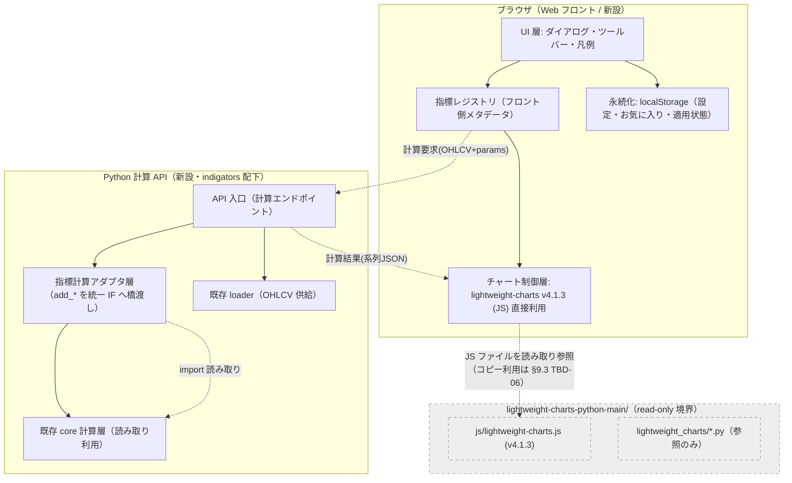
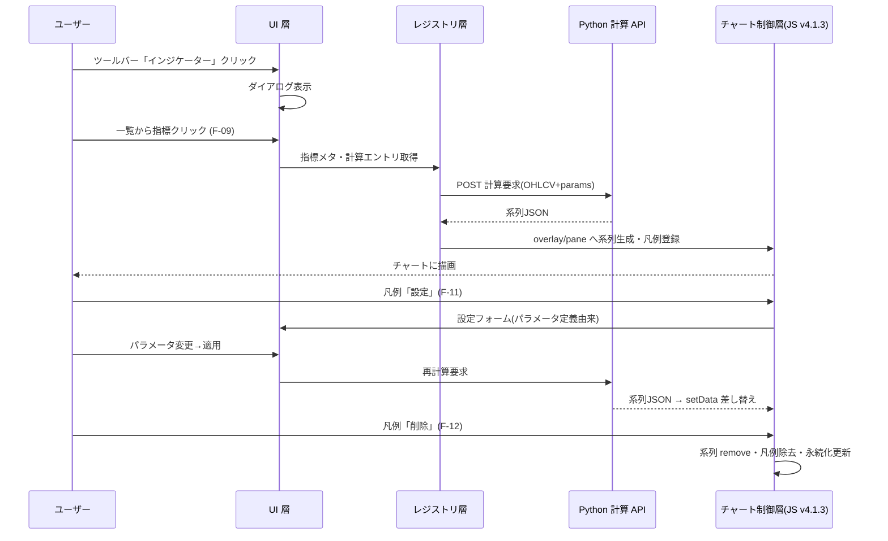
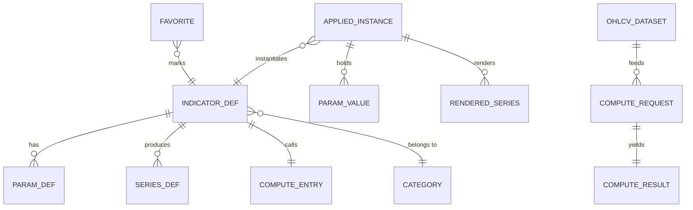
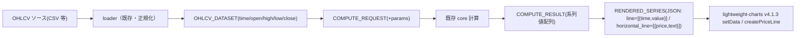
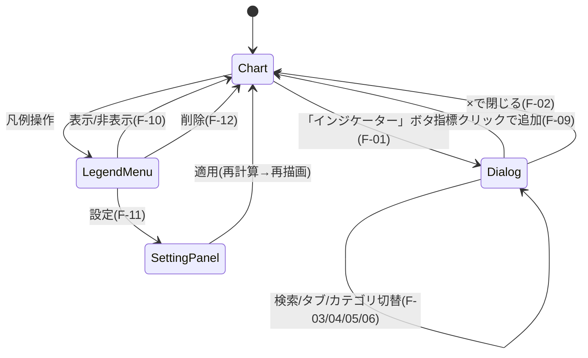

# チャート上インジケーター管理 UI 基本設計書

## 1. 文書情報

- 作成日：2026-06-06
- バージョン：v0.2.1（基本設計・改訂第 2 版＋レビュー指摘反映）
- 作成者：system-basic-design エージェント
- 承認者：（未承認 / 要ユーザー承認）
- 変更履歴：

| 版 | 日付 | 変更概要 |
|---|---|---|
| v0.1.0 | 2026-06-06 | 初版作成（実装は後工程・別承認） |
| v0.2.0 | 2026-06-06 | 全 3 指標の実 `.py` ソース・PORTING_GUIDE.md・upstream `abstract.py` を実証根拠に改訂。前回 TBD のうち TBD-01/07/08 を解消し、確定すべき先送り 8 項目（レジストリ完全スキーマ・計算 API 契約・time 形式・世代管理・失敗定義・永続化スキーマ・インスタンス ID 採番・検索/お気に入り規則）を本文で確定。`price_range_power` が時系列ラインでなく水平価格ライン（`horizontal_line`）出力である事実を反映し、SERIES_DEF を 2 種別（line / horizontal_line）に拡張。 |
| v0.2.1 | 2026-06-07 | spec-reviewer 指摘（条件付き可→可）をピンポイント反映。①H-1：共通 IF の呼び出し規約（位置/キーワード引数バインド・fitter enum→Fitter 実体化マップ）を §5.5.4 COMPUTE_ENTRY に追加（`tgp_btlm/src/lwc_chart.py:63-66` の fitter 位置引数を実証）。②H-2：全削除後も seq 単調増加を保証する永続カウンタ `indicatorUi.seqCounters.v1` を §5.6 に追加・§5.7 を改訂。③M-4：時刻列欠落（`KeyError`）を新コード `missing_time` として §6.5.3／§7.2.1 失敗分類に収載（`tgp_btlm/src/lwc_chart.py:60`・`profit_band/src/lwc_chart.py:84` を実証）。④M-2：`horizontal_line` 応答スキーマに `axis_label_visible`（bool・描画側固定 false）を §6.5.2 へ追加（`price_range_power/src/lwc_chart.py:87` を実証）。⑤M-1：引用行ズレを訂正（`norm_ppf` 条件 `core.py:147`／raise `core.py:148`、`ratio.py` の `raise KeyError` を `:90`→`:92` に訂正）。他章の再設計・範囲拡大なし。 |

> 本書は基本設計書である。クラス設計・物理ファイル詳細・実装コードは内部設計（後工程）の対象であり、本書では概念粒度に留める。

### 1.1 改訂サマリ（前回 TBD のどれを解消したか）

| 前回 TBD | 状態 | 本改訂での扱い |
|---|---|---|
| TBD-01（他 2 指標の実シグネチャ） | **解消** | `price_range_power/src/lwc_chart.py:36` `add_price_range_power` / `profit_band/src/lwc_chart.py:89` `add_profit_band` / `:158` `add_robust_profit_band` の実引数を全マッピング（§4.5・§5.5）。 |
| TBD-07（系列 time 形式） | **解消** | upstream `abstract.py:203` `df['time'].astype('int64') // 10**9` により **UNIX 秒（int）** で確定（§6.4）。 |
| TBD-08（PORTING_GUIDE 所在） | **解消** | `indigators/PORTING_GUIDE.md` を読了。共通 IF 規約（層分離・系列名＝出力列名・NaN→dropna・duck typing）の根拠に採用（§3.2・§5.5）。 |
| 確定すべき先送り 1（レジストリ完全スキーマ） | **解消** | §5.5 に INDICATOR_DEF / PARAM_DEF / SERIES_DEF / COMPUTE_ENTRY の型・必須/任意・enum・相関制約構文を定義し、3 指標を全マッピング。 |
| 確定すべき先送り 2（計算 API 契約・エラースキーマ） | **解消** | §6.5 に正常系列 JSON スキーマ（line / horizontal_line 別）とエラースキーマ（HTTP ステータス・違反パラメータ構造）を定義。 |
| 確定すべき先送り 3（time 形式） | **解消** | TBD-07 と同一（§6.4）。 |
| 確定すべき先送り 4（再計算の世代管理） | **解消** | §6.6 にリクエスト世代番号方式を定義。 |
| 確定すべき先送り 5（失敗定義の網羅） | **解消** | §7.2.1 に 7 失敗モードの検出方法と挙動を定義。 |
| 確定すべき先送り 6（永続化スキーマ） | **解消** | §5.6 に localStorage キー設計・値スキーマ・バージョニング・破損時挙動を定義。 |
| 確定すべき先送り 7（インスタンス ID 採番） | **解消** | §5.7 に採番規則を定義。 |
| 確定すべき先送り 8（検索一致規則・お気に入りキー） | **解消** | §4.6・§5.6 に定義。 |
| TBD-02（ペイン実現方式） | **正当に残置** | 現 3 指標は全て overlay（§4.5）でペイン不要だが、将来の別ペイン指標向けに案 P1/P2 を残置（プロトタイプ実測で確定）。 |
| NFR 性能数値 | **正当に残置** | 実測前のため仮説と明記（§7.1）。 |

#### 1.1.1 v0.2.1 レビュー指摘の反映（spec-reviewer：条件付き可→可）

| 指摘 ID | 重大度 | 反映章 | 反映内容（要旨） | 実コード根拠 |
|---|---|---|---|---|
| H-1 | 🔴 | §5.5.4 | 共通 IF の呼び出し規約を確定。各指標の計算エントリ呼出時の「位置引数群／キーワード引数群」構築規約、`backend_param`(fitter) の enum→Fitter 実体化マップ、「fitter は位置・他はキーワード」を明示 | `tgp_btlm/src/lwc_chart.py:63-73`（fitter が第 3 位置引数・以降 `*` でキーワード専用）、`tgp_btlm/src/__init__.py:38-39`、`tgp_btlm/lwc_demo.py:24,43` |
| H-2 | 🔴 | §5.6・§5.7 | seq 単調性を全削除後も保証する永続カウンタ `indicatorUi.seqCounters.v1`（{indicatorId: lastSeq}）を追加 | §5.7 既存採番規則の欠陥（`applied.v1` 空化時の記憶喪失） |
| M-4 | 🟡 | §6.5.3・§7.2.1 | 時刻列欠落（`KeyError`）を新コード `missing_time` として失敗分類・エラースキーマに収載 | `tgp_btlm/src/lwc_chart.py:52,60`、`profit_band/src/lwc_chart.py:76,84`（時刻解決不能で `KeyError`） |
| M-2 | 🟡 | §6.5.2 | `horizontal_line` 応答スキーマに `axis_label_visible`（bool・描画側固定 false）を追加 | `price_range_power/src/lwc_chart.py:87,92`（`axis_label_visible=False` を渡す） |
| M-1 | 🟡 | §4.4・§5.5.5・§6.5.3・§7.3 | 引用行ズレ訂正：`norm_ppf` 条件 `core.py:147`／raise `core.py:148`、`ratio.py` の `raise KeyError` を `:90`→`:92` | `tgp_btlm/src/core.py:147-148`、`price_range_power/src/ratio.py:91-92` |

---

## 2. プロジェクト概要

> 出力元：S-1 要件分析と設計方針決定

### 2.1 システム概要

- **位置付け**：本プロジェクト `indigators/` 配下の 3 つの自作インジケーター（`tgp_btlm` / `price_range_power` / `profit_band`、いずれも Python 計算 + lightweight-charts 描画）を、TradingView のインジケーター選択ダイアログを範とした Web フロントエンド UI 上で **追加・表示切替・設定変更・削除** できるようにする管理レイヤーを新設する。
- **解決する業務課題**：
  - 課題 A（中核）：3 指標の適用関数 `add_*` のシグネチャ・出力種別が指標ごとに不統一であり、UI から「統一的に登録・適用」できない。実コードで確認した差分（§4.5・§5.5 で全マッピング）：
    - `tgp_btlm/src/lwc_chart.py:63` `add_btlm(chart, df, fitter, *, price, maxbars, q_low, q_high, time_column, color)` — **第 3 引数に `BtlmFitter` ポート（戦略オブジェクト）を要求**。出力＝時系列ライン 3 本（overlay）。
    - `profit_band/src/lwc_chart.py:89` `add_profit_band(chart, df, *, probabilities, buckets, time_column, require_full, legend, bands)` と `:158` `add_robust_profit_band(... normalize, window, atr_period, min_obs ...)` — `fitter` 不在・確率配列とバケット集合を取り、出力＝時系列ライン **最大 4 系統 × 7 確率 = 28 本**（overlay）。
    - `price_range_power/src/lwc_chart.py:36` `add_price_range_power(chart, df, *, interval, range_from, range_to, top_n, bull_color, bear_color, width)` — `fitter` 不在・`time_column` も**不要**。出力＝**水平価格ライン**（`horizontal_line(price, ...)`、時系列でなく価格軸分布。SPEC.md §7「価格チャートに水平価格ラインで重畳」）。
    - ⇒ シグネチャ差分に加え、**出力系列の種別が「時系列ライン」と「水平価格ライン」の 2 種類存在**することが共通 IF（SERIES_DEF）の中核要件（§5.5）。
  - 課題 B：現状は各指標が個別の `*_demo.py` / `lwc_demo.py` を持ち（例 `indigators/tgp_btlm/lwc_demo.py`）、チャート上での対話的な追加・削除・再設定の手段が存在しない。
- **対象外（スコープ外）**：
  - `lightweight-charts-python-main/`（ベンダリングされた upstream）の改変・追記・設定上書き・新規ファイル配置（絶対制約）。
  - upstream の `StaticLWC` / `Chart`（pywebview）への依存・改変を前提とする設計（ユーザー確定方針により不採用）。
  - ストラテジー / プロファイル / パターン（TradingView 上部タブのうちインジケーター以外）の **実体機能**。タブ UI の枠は設計するが、中身は空または「未対応」表示とする（§4.1 F-12）。
  - 内部設計（クラス構成・物理 DB・API 実装仕様・コンポーネント実装）。

### 2.2 開発目的・背景

- **背景**：mql-porting メモリに従い `indigators/` 配下で MQL→Python 移植が継続的に増える前提。指標が増えるほど「個別 demo を都度書く」運用は破綻する。
- **達成目標**：
  1. 新指標を**メタデータ登録 1 箇所**で UI に載せられる共通レジストリ層を定義する（拡張点の単一化）。
  2. TradingView 同等の選択ダイアログ・ツールバー起動・凡例操作の操作系を提供する。
  3. Python 計算と Web 描画を**プロセス境界で分離**し、upstream pywebview 依存を排除する。

### 2.3 適用範囲・制約条件

#### 機能要件サマリー（要件 ID 一覧）

| 要件 ID | 概要 | 出所 |
|---|---|---|
| FR-01 | ツールバーの「インジケーター」起動ボタン | 指示 範囲2 |
| FR-02 | 選択ダイアログ（タイトル・閉じる） | 指示 範囲1 |
| FR-03 | サイドバー（パーソナル / 内蔵 / コミュニティ等カテゴリ） | 指示 範囲1 |
| FR-04 | 上部タブ（インジケーター / ストラテジー / プロファイル / パターン） | 指示 範囲1 |
| FR-05 | 検索ボックス（指標名インクリメンタル絞り込み） | 指示 範囲1 |
| FR-06 | 指標一覧表示（カテゴリ / 検索でフィルタ） | 指示 範囲1 |
| FR-07 | お気に入り★ 登録 / 解除 | 指示 範囲1 |
| FR-08 | 指標詳細表示 | 指示 範囲1 |
| FR-09 | 一覧クリックでチャートへ追加（適用） | 指示 範囲1 |
| FR-10 | 凡例（legend）から表示 / 非表示トグル | 指示 範囲3 |
| FR-11 | 凡例から設定（パラメータ変更・再計算・再描画） | 指示 範囲3 |
| FR-12 | 凡例から削除 | 指示 範囲3 |
| FR-13 | 指標レジストリへの統一登録（共通 IF） | 指示 範囲4（中核） |
| FR-14 | 既存 3 指標の後付け移行（アダプタ） | 指示 範囲4 |
| FR-15 | 設定 / お気に入り / 適用済み指標の永続化 | §5.4 派生 |

#### 非機能要件サマリー（数値目標を含む）

| 要件 ID | 区分 | 数値目標 | 根拠 |
|---|---|---|---|
| NFR-01 | 性能（描画） | 1 指標の追加〜初回描画完了まで 500 ms 以内（ローカル / 単一指標 / 250 本以下、計算時間を除く） | lwc v4.1.3 のローカル描画は数十 ms 規模（実務的推奨／仮説、§9.3 TBD-04 で実測要） |
| NFR-02 | 性能（再計算） | パラメータ変更〜再描画まで、計算 API 応答時間 + 200 ms 以内（計算時間は指標依存のため別計上） | TBD-04 |
| NFR-03 | 保守性 | 新指標追加時の改修箇所をレジストリ登録 1 ファイル + 計算アダプタ 1 ファイルに限定 | プロジェクト規約（mql-porting：拡張点単一化） |
| NFR-04 | テスト容易性 | 計算層は I/O 非依存・純粋関数（既存 core 層方針を踏襲、`tgp_btlm/src/core.py` 冒頭 docstring「外部 I/O 非依存・numpy のみ」） | 実コード根拠 |
| NFR-05 | i18n | UI 表示文字列は日本語を既定とし、外部辞書化して言語追加可能とする | 指示 §4-7 |
| NFR-06 | 可用性 | ローカル単一ユーザー開発ツール。SLA なし。計算 API ダウン時はフロントにエラー表示し既存描画を保持 | §2.1 位置付け |

#### 制約条件（技術 / 予算 / 期限 / 運用 / 法規制）

| 区分 | 制約 | 根拠（実証） |
|---|---|---|
| 技術（絶対） | `lightweight-charts-python-main/` は read-only。改変・新規配置禁止 | 指示 §0 絶対制約 |
| 技術 | lightweight-charts JS は **v4.1.3**。無断バージョン変更禁止 | `lightweight-charts-python-main/lightweight_charts/js/lightweight-charts.js:3`「TradingView Lightweight Charts™ v4.1.3」 |
| 技術 | lightweight-charts **v4.1.3 はマルチペイン API（`addPane`/`paneIndex`/`createPane`）非搭載** | `lightweight_charts/js/lightweight-charts.js` 内 grep で `addPane`/`paneIndex`/`createPane` **0 件**（v4.1.3、再実証）。なお `addLineSeries`/`addHistogramSeries`/`addAreaSeries` は存在（JS レベルで line/histogram/area 系列は描画可能） |
| 技術 | 系列の time 形式は **UNIX 秒（int）**（v4.1.3 が JS へ渡す形式） | upstream `abstract.py:203` `df['time'] = df['time'].astype('int64') // 10 ** 9`（日付列を UNIX 秒整数へ変換してから JS へ投入） |
| 技術 | Python 側計算ライブラリは numpy / pandas（既存 core/loader が依存） | `tgp_btlm/src/core.py` docstring「外部: numpy」、`loader.py`「外部: pandas」。全 3 指標とも core 層は numpy のみ・成果物層で pandas（PORTING_GUIDE §2） |
| 運用 | ヘッドレスコンテナ（Debian13, DISPLAY 空）で動作する構成が必要 | lwc-headless-run メモリ |
| 実装範囲 | 本タスクは基本設計書のみ。実装は後工程・別承認 | 指示 §2 成果物の位置づけ |

#### 設計上の課題と技術的リスク

| # | 課題 / リスク | 影響 |
|---|---|---|
| C-1 | 3 指標の `add_*` シグネチャ・出力種別差分の統一表現。**実 `.py` ソースは全 3 指標とも存在（解消）**。残課題は「時系列ライン」「水平価格ライン」2 種別を 1 つの SERIES_DEF で表現すること | レジストリ設計（§5.5 で解消） |
| C-2 | v4.1.3 にペイン分割 API が無い。**ただし現 3 指標は全て overlay（同一価格スケール）で、ペインは現時点では不要**（§4.5）。将来の別パネル指標向けに案 P1/P2 を残置 | §4.5・§9.3 TBD-02（将来課題） |
| C-3 | Python 計算とフロントのプロセス分離方式（ローカル HTTP / 静的書き出し / WebSocket）の選定 | §3、§6 |
| C-4 | `tgp_btlm` の `BtlmFitter` のような「戦略オブジェクト引数」を JSON 契約でどう表現するか。実コードで既定 `OlsBtlmFitter`（`lwc_demo.py:24`）／忠実 `TgpBtlmFitter`（`__init__.py:11-12`）の 2 実装を確認 → enum 化で解消（§4.5・§5.5） | §5.5 計算エントリ設計（解消） |
| C-5 | パラメータ連続変更時に古い計算応答が新しい応答を上書きするレース | §6.6 世代管理で解消 |
| C-6 | 計算失敗（タイムアウト・不正 JSON・空系列・系列名不一致・localStorage 溢れ・vendor JS ロード失敗）の網羅的検出 | §7.2.1 で解消 |

---

## 3. システムアーキテクチャ

> 出力元：S-1 採用パターン選定 ／ S-2 アーキテクチャ設計

### 3.1 全体構成図



- **依存方向の原則**：フロント → Python 計算 API（一方向）。Python 計算 API は upstream の `core`/`loader` を **import 読み取り**するのみ。フロントは upstream JS を**読み取り参照**するのみ。upstream への書き戻し依存は存在しない。

### 3.2 アーキテクチャパターン選択理由

#### 採用：フロント / バック分離（プレゼンテーション＝Web、計算＝Python API）＋ レジストリ駆動プラグイン

| 評価軸 | 案A: フロント/バック分離 + レジストリ（採用） | 案B: upstream `StaticLWC`/`Chart` 拡張（pywebview 単体） | 案C: Python 単一プロセスでサーバサイド HTML 生成 |
|---|---|---|---|
| upstream 不可侵制約 | 適合（upstream は read-only 参照） | **不適合**（StaticLWC 依存・改変前提、指示 §2 で不採用） | 適合（生成のみ） |
| 対話操作（追加/削除/再設定） | 適合（JS で動的に系列操作） | 限定的（pywebview の双方向は wrapper 依存） | **不適合**（静的 HTML は再描画に再生成必要） |
| 計算層の再利用 | 適合（既存 core を API 化） | 適合 | 適合 |
| ヘッドレス運用 | 適合（ブラウザ / 静的 HTML 両対応） | 表示バックエンド要（lwc-headless-run の制約） | 適合 |
| 新指標追加コスト | 低（レジストリ登録 1 箇所） | 高（demo 都度作成） | 中 |

- **採用根拠**：指示 §2 確定方針（独立 Web フロント新設・JS 直接利用・upstream 非依存）と一致し、絶対制約（upstream 不可侵）を構造的に満たす唯一の案。FR-09〜FR-12 の対話操作は JS の動的系列操作が必須で、静的生成（案C）では満たせない。（実務的推奨／仮説の混在：分離自体は確定方針、API 方式詳細は §3.3 で比較）
- **棄却理由**：案B は指示で明示的に不採用。案C は対話再描画要件（FR-10/FR-11）に不適合。
- レジストリ駆動プラグインパターン採用根拠：NFR-03（新指標の改修箇所限定）を満たすため、指標を「データ（メタデータ）＋計算アダプタ」として外部登録する（出典：関心の分離 / Open-Closed 原則、Robert C. Martin "Agile Software Development" 由来の公式設計原則）。

### 3.3 技術スタック詳細

| 層 | 採用技術 | バージョン | 代替候補 | 採用根拠 |
|---|---|---|---|---|
| チャート描画 | lightweight-charts (JS) | v4.1.3（既存 bundled を参照） | upgrade v5（ペイン対応） | 制約：無断バージョン変更禁止。v5 採用は §9.3 TBD-02・承認要 |
| フロント基盤 | 素 HTML/CSS/JS（バニラ） | — | 軽量 FW（Preact / Alpine.js / Lit） | §8 技術選定で比較。バニラを第一候補（依存ゼロ・upstream JS と素直に結合）、判断は承認要 |
| 計算 API 通信 | ローカル HTTP（JSON） | — | 静的 JSON 書き出し / WebSocket | §6.4 で比較。HTTP REST を第一候補（リクエスト/レスポンスが計算契約と一致） |
| Python 計算 | numpy / pandas | 既存準拠（無断変更禁止） | — | 既存 core/loader が依存。`tgp_btlm/src/core.py` docstring 根拠 |
| Python API FW | TBD（標準ライブラリ http.server か軽量 FW） | — | FastAPI / Flask / 標準 http.server | §9.3 TBD-03。新規ライブラリ採用は承認要 |
| 永続化 | ブラウザ localStorage | — | Python 側ファイル(JSON) | §5.4。ローカル単一ユーザーのため localStorage を第一候補 |

> 注：本プロジェクトには現状 `requirements.txt` 等の依存定義ファイルを本設計範囲では確認していない。Python API FW の新規採用可否は §9.3 TBD-03 / 承認要事項に集約する。

### 3.4 レイヤー構成・責務分担

| レイヤー | 責務 | 依存先 | 出典／根拠 |
|---|---|---|---|
| UI 層（フロント） | ダイアログ・ツールバー・凡例・検索・お気に入りの描画と操作受付 | レジストリ層 / チャート制御層 / 永続化 | 関心の分離（公式） |
| 指標レジストリ層（フロント） | 指標メタデータの保持・カテゴリ/検索フィルタ・適用 IF 提供 | 計算 API クライアント | プロジェクト規約（拡張点単一化） |
| チャート制御層（フロント） | lightweight-charts v4.1.3 への系列追加/更新/削除・overlay/pane 振り分け・凡例同期 | upstream JS（read-only 参照） | upstream 不可侵制約 |
| 永続化層（フロント） | 設定・お気に入り・適用済み指標の保存/復元 | localStorage | §5.4 |
| API 入口（Python） | 計算要求の受付・入力検証・結果整形 | 計算アダプタ層 | 関心の分離（公式） |
| 計算アダプタ層（Python） | 統一 IF と各指標 `add_*`/計算関数の差分吸収 | 既存 core/loader（read-only import） | FR-14 / C-4 |
| 既存計算層（Python・既存） | 指標の純粋計算（btlm 等） | numpy/pandas | 既存実装（改変しない方針） |

- **依存方向の不変条件**：UI → レジストリ → チャート制御 → upstream JS（読み取り）。Python 側は API 入口 → アダプタ → 既存 core（読み取り）。**循環なし。upstream への書き込み依存なし。**

---

## 4. 機能設計

> 出力元：S-3 機能設計

### 4.1 機能一覧・優先度

| 機能 ID | 機能名 | 概要 | 優先度 | 対応要件 ID |
|---|---|---|---|---|
| F-01 | インジケーター起動ボタン | ツールバーのボタンでダイアログ開閉 | 高 | FR-01 |
| F-02 | 選択ダイアログ枠 | タイトル・モーダル・閉じる（×） | 高 | FR-02 |
| F-03 | カテゴリサイドバー | パーソナル/内蔵/コミュニティ等のグループとカテゴリ選択 | 中 | FR-03 |
| F-04 | 上部タブ | インジケーター/ストラテジー/プロファイル/パターン切替 | 中 | FR-04 |
| F-05 | 検索 | 指標名のインクリメンタル絞り込み | 高 | FR-05 |
| F-06 | 指標一覧 | カテゴリ/検索/タブでフィルタした一覧 | 高 | FR-06 |
| F-07 | お気に入り | ★ トグルと「パーソナル＞お気に入り」表示 | 低 | FR-07 |
| F-08 | 詳細表示 | 選択指標の説明・パラメータ概要 | 低 | FR-08 |
| F-09 | チャートへ追加 | クリックで計算要求→系列描画→凡例登録 | 高 | FR-09 |
| F-10 | 表示/非表示トグル | 凡例から系列の visible 切替 | 高 | FR-10 |
| F-11 | 設定（再計算） | 凡例から設定パネル→パラメータ変更→再計算→再描画 | 高 | FR-11 |
| F-12 | 削除 | 凡例から系列削除・レジストリ適用解除 | 高 | FR-12 |
| F-13 | レジストリ統一登録 | INDICATOR_DEF（id/表示名/カテゴリ/tab/placement(overlay·pane)/PARAM_DEF/SERIES_DEF(line·horizontal_line)/COMPUTE_ENTRY）の登録（§5.5） | 最高 | FR-13 |
| F-14 | 既存指標アダプタ | 3 指標を後付けで載せる移行 | 高 | FR-14 |
| F-15 | 永続化 | 設定/お気に入り/適用状態の保存・復元 | 中 | FR-15 |
| F-16 | 非対応タブ表示 | ストラテジー等は「未対応」プレースホルダ | 低 | §2.1 対象外 |

### 4.2 機能詳細仕様（主要機能）

#### F-09 チャートへ追加

- 入力：選択された指標 id、既定パラメータ（レジストリ由来）、現在チャートの OHLCV 範囲。
- 前提条件：当該 id がレジストリに登録済み。計算 API が応答可能。
- 処理：(1) レジストリから計算エントリ取得 → (2) 計算 API へ OHLCV + params 送信 → (3) 系列 JSON 受信 → (4) `overlay` なら主チャート、`pane` なら別 priceScale/別チャートへ系列生成（§4.2 overlay/pane）→ (5) 凡例にエントリ追加 → (6) 永続化に適用状態を保存。
- 後条件：チャート上に系列が表示され、凡例から操作可能。
- 例外：計算 API エラー → トースト表示し描画中止（既存描画は保持、NFR-06）。

#### F-11 設定（再計算）

- 入力：適用済み指標インスタンス id、変更後パラメータ集合。
- 処理：(1) レジストリのパラメータ定義に基づき設定フォーム生成 → (2) 入力検証（型・範囲、§4.4）→ (3) 再計算要求 → (4) 既存系列を `setData` で差し替え（系列インスタンスは再利用、追加/削除しない）。
- 後条件：同一系列に新パラメータの結果が反映。
- 例外：検証エラー → フォーム内インライン表示、再計算しない。

#### overlay / pane 振り分け（C-2 対応・実コードで確定）

- **現 3 指標は全て overlay（価格と同一スケールに重畳）であることを実コードで確認**：
  - `tgp_btlm`：SPEC.md §7「overlay（価格と同一スケールに重畳）」。`lwc_chart.py:107` `create_line` で主 priceScale に時系列ライン 3 本。
  - `profit_band`：`lwc_chart.py:138` `create_line(price_line=False, price_label=False)` で始値基準バンド（価格スケール上）。SPEC は無いが README「Line として重畳」「始値基準バンド」より overlay。
  - `price_range_power`：`lwc_chart.py:85` `chart.horizontal_line(price=...)` で**水平価格ライン**。価格軸上の重畳であり overlay（SPEC.md §7「価格チャートに水平価格ラインで重畳」）。
  - ⇒ **現時点でペイン分割（別スケール領域）を要する指標は存在しない**。ペイン実現方式の確定は不要（C-2 の即時リスクは解消）。
- **将来の別パネル指標（オシレーター系・RSI/MACD 等）向けの残置案**（§9.3 TBD-02。PORTING_GUIDE §3 で「`#property indicator_separate_window` → `create_subchart(position='below')`」と対応付けあり）：
  - 案P1：同一チャート上で `create_line(price_scale_id=...)` により priceScale を分離し、`scaleMargins` で表示領域を上下分割する。`create_line` に `price_scale_id` 引数が存在することを実コードで確認（`abstract.py:725`）。
  - 案P2：別チャート（upstream `create_subchart(position='below', sync=True)`、`abstract.py:953`）を縦積みし時間軸同期する。ただし本設計はフロント JS 直接利用方針のため、JS 側 `createChart` 複数生成＋`subscribeVisibleLogicalRangeChange` 同期で等価実装する。
  - 採用は別パネル指標を追加する時点でプロトタイプ実測により確定（基本設計では両案を提示）。

### 4.3 処理フロー図（主要ユースケース：追加→設定→削除）



### 4.4 業務フロー・ユースケース

- **アクター**：ローカル単一ユーザー（指標を視覚的に検討する分析者）。
- **主要ユースケース**：UC1 指標を探して追加 / UC2 表示を一時的に消す / UC3 パラメータを変えて再評価 / UC4 不要指標を消す / UC5 お気に入り登録。
- **パラメータ定義（共通 IF の中核要素）**：各パラメータは `名前 / ラベル(i18n) / 型(int·float·enum·bool·string) / 既定値 / 範囲(min·max) / 相関制約` を持つ。完全スキーマは §5.5、3 指標の全マッピングは §4.5。
  - 相関制約の必要性（実証）：`tgp_btlm` SPEC.md §8「`0 < q_low < q_high < 1`」、`norm_ppf` の `0 < p < 1` チェック（条件 `core.py:147` `if np.any((pp<=0.0)|(pp>=1.0))`／raise `core.py:148` `raise ValueError`）→ enum/数値範囲だけでなく**パラメータ間相関制約**を表現する必要がある（§5.5 で構文定義）。
  - 戦略オブジェクト引数の表現（C-4）：`add_btlm` 第 3 引数 `fitter`（`BtlmFitter` ポート）は JSON で直送できないため「計算バックエンド選択 enum」としてパラメータ化する。実装が `OlsBtlmFitter`（R 不要・参照／既定。`lwc_demo.py:24`）と `TgpBtlmFitter`（要 R+tgp+rpy2・忠実。`__init__.py:38`）の 2 つであることを実コードで確認 → enum 許容値 `{ols, tgp}`、既定 `ols`（`lwc_demo.py` が `OlsBtlmFitter()` を採用）。

### 4.5 3 指標の実パラメータ・出力系列マッピング（共通スキーマの表現可能性実証）

> 本節は「共通レジストリ スキーマ（§5.5）が実 3 指標を実際に表現できる」ことを実コード根拠で示す。各 `add_*` 関数の全引数を PARAM_DEF へ、各出力を SERIES_DEF へ写像する。

#### 4.5.1 `tgp_btlm`（`add_btlm`、`lwc_chart.py:63-115`）

| 実引数 | 型 | 既定 | PARAM_DEF 型 | enum 許容値 | 相関制約 | UI 露出 |
|---|---|---|---|---|---|---|
| `price` | str | `"open"` | enum | `{open,high,low,close}` | — | 露出（既定 open。`lwc_chart.py:68`） |
| `maxbars` | int | `100`（`core.py:33`） | int | — | `>= 2`（`OlsBtlmFitter` 観測 3 点未満で `ValueError`、SPEC §8） | 露出 |
| `q_low` | float | `0.05`（`core.py:34`） | float | — | `0 < q_low < q_high < 1`（SPEC §8） | 露出 |
| `q_high` | float | `0.95`（`core.py:35`） | float | — | `0 < q_low < q_high < 1` | 露出 |
| `fitter`（第 3 引数） | `BtlmFitter` | — | enum（C-4 写像） | `{ols,tgp}` | — | 露出（既定 ols） |
| `time_column` | str\|None | `None` | string\|null | — | — | 内部（API 入口で OHLCV に付随） |
| `color` | str | MediumSlateBlue | string（色） | — | — | 露出（任意・描画） |

- 出力系列（SERIES_DEF）：種別＝`line`（時系列）。系列名は実コードで動的生成：`mean_column()="btlm_mean"`（`core.py:43`）、`quantile_column(q_low)`（例 `btlm_q5`）、`quantile_column(q_high)`（例 `btlm_q95`）。`core.py:50` `f"btlm_q{int(round(q*100))}"`。線種：mean=solid(width2) / lower・upper=dotted(width1)（`lwc_chart.py:100-104`）。overlay。NaN は `lwc_chart.py:112` `.dropna()` で除外。

#### 4.5.2 `profit_band`（`add_profit_band`/`add_robust_profit_band`、`lwc_chart.py:89-200`）

| 実引数 | 型 | 既定 | PARAM_DEF 型 | enum 許容値 | 相関制約 | 適用関数 |
|---|---|---|---|---|---|---|
| `probabilities` | float[] | `(0.51,0.80,0.85,0.90,0.95,0.98,0.99)`（`core.py:19`） | float[]（複数選択） | 各値 `0<p<1` | 昇順推奨（`np.quantile` 受容） | 両方 |
| `buckets` | str[] | `("nOH","pOL","pOH","nOL")`（`lwc_chart.py:51`） | enum[]（複数選択） | `{pOH,pOL,pHL,nOH,nOL,nHL}`（`core.py:23`。描画有効は 4 系統 `lwc_chart.py:40-45`） | — | 両方 |
| `require_full` | bool | `True` | bool | — | — | `add_profit_band` |
| `legend` | bool | `False` | bool | — | — | 両方 |
| `time_column` | str\|None | `None` | string\|null | — | — | 両方（内部） |
| `normalize` | str | `"return"` | enum | `{return,atr}`（`robust_bands.py:135-140`） | — | `add_robust_profit_band` |
| `window` | str\|int | `"expanding"` | enum\|int | `{expanding}` または正整数 | — | robust |
| `atr_period` | int | `14` | int | `>= 1` | `normalize==atr` の時のみ有効 | robust |
| `min_obs` | int | `30` | int | `>= 1` | — | robust |

- 出力系列（SERIES_DEF）：種別＝`line`。系列名＝`{bucket}_{percent}`（例 `pOL_99`。`lwc_chart.py:136` `col = f"{bucket}_{tag}"`、`bands.py:84`）。本数＝`len(buckets) × len(probabilities)`（既定 4×7=28 本）。線種：`nOH`/`pOL`=solid(navy)・`pOH`/`nOL`=dotted（`lwc_chart.py:40-45`）。不透明度はパーセンタイル別（`_ALPHA`, `lwc_chart.py:48`）。overlay。NaN は `lwc_chart.py:148` `.dropna()` で除外。
- 注：`add_robust_profit_band` は `add_profit_band` の薄いラッパ（`lwc_chart.py:193`）。レジストリ上は **同一指標の 2 計算バリアント**として表現する（COMPUTE_ENTRY の `variant` enum `{global, robust}`。§5.5）。

#### 4.5.3 `price_range_power`（`add_price_range_power`、`lwc_chart.py:36-94`）

| 実引数 | 型 | 既定 | PARAM_DEF 型 | enum 許容値 | 相関制約 | UI 露出 |
|---|---|---|---|---|---|---|
| `interval` | float | `0.1`（`core.py:40`） | enum\|float | `{0.1,0.01,0.001}`（`INTERVAL_CHOICES`, `core.py:41`） | `> 0`（`core.py:109`） | 露出 |
| `range_from` | float\|None | `None`（→安値最小） | float\|null | — | — | 露出（任意） |
| `range_to` | float\|None | `None`（→高値最大） | float\|null | — | — | 露出（任意） |
| `top_n` | int | `5` | int | — | `>= 0`（`lwc_chart.py:68`） | 露出 |
| `bull_color`/`bear_color` | str | 緑/赤 | string（色） | — | — | 露出（任意） |
| `width` | int | `2` | int | `>= 1` | — | 露出（任意） |

- 出力系列（SERIES_DEF）：**種別＝`horizontal_line`（水平価格ライン・時系列でない）**。価格軸上の値（`horizontal_line(price=float(bands[i]), ...)`, `lwc_chart.py:85`）。ブル＝緑（`net>0` 上位 `top_n`）／ベア＝赤（`net<0` 上位 `top_n`）。`text` ラベルに勢力値（`f"BULL {bull[i]:.2f}"`）。系列数は可変（最大 `2*top_n`）。overlay。`time_column` 不要。
- ⇒ **本指標が SERIES_DEF に `horizontal_line` 種別を要求する唯一の指標**。共通スキーマはこの種別を表現できねばならない（§5.5 で定義）。

### 4.6 検索・フィルタ・お気に入りの規則（確定）

- **検索一致規則**（F-05）：対象＝**表示名（i18n 解決後の表示文字列）と指標 id の両方**を対象とする。理由：id（`tgp_btlm` 等）でも引けると開発者が探しやすい（実務的推奨／仮説）。大小文字＝**区別しない**（入力・対象を共に小文字化して比較）。一致＝**部分一致**（含有）。インクリメンタル（1 文字ごとに即時フィルタ）。
- **フィルタ合成**：タブ（インジケーター等）∧ カテゴリ（サイドバー選択）∧ 検索語 ∧（お気に入り表示中なら ★ 集合）の **論理積**で一覧を絞る。
- **お気に入り**（F-07）：★ トグルは指標 id 単位。永続化キーは §5.6 で定義（`indicatorUi.favorites.v1`）。「パーソナル＞お気に入り」カテゴリは FAVORITE 集合をそのまま一覧化。

---

## 5. データ設計

> 出力元：S-3 データ設計

### 5.1 データモデル概要（概念・実装非依存）



### 5.2 主要エンティティ定義

| エンティティ | 概要 | 主要属性 | 関連エンティティ |
|---|---|---|---|
| INDICATOR_DEF（指標定義） | レジストリの 1 件。統一メタデータ | id, 表示名(i18n), カテゴリ, パラメータ定義集合, overlay/pane 区分, 系列定義集合, 計算エントリ参照 | PARAM_DEF, SERIES_DEF, COMPUTE_ENTRY, CATEGORY |
| PARAM_DEF（パラメータ定義） | 1 パラメータの宣言 | 名前, ラベル(i18n), 型, 既定値, min/max, 相関制約, 列挙肢 | INDICATOR_DEF |
| SERIES_DEF（系列定義） | 出力 1 系列（または系列群）の描画宣言 | 系列名/名前パターン(出力列名と一致), 種別(line/horizontal_line), 線種(solid/dotted), 色, 太さ, priceScale 区分, 動的本数フラグ | INDICATOR_DEF |
| COMPUTE_ENTRY（計算エントリ） | 計算 API 上の論理識別子と必要入力 | 計算 id, 必要価格列, 追加オプション(バックエンド選択等) | INDICATOR_DEF |
| CATEGORY（カテゴリ） | サイドバー分類 | グループ(パーソナル/内蔵/コミュニティ), カテゴリ名(i18n) | INDICATOR_DEF |
| APPLIED_INSTANCE（適用済み指標） | チャート上に追加された 1 インスタンス | インスタンス id, 指標 id, パラメータ実値, 表示状態, 生成系列参照 | INDICATOR_DEF, PARAM_VALUE, RENDERED_SERIES |
| FAVORITE（お気に入り） | ★ 登録 | 指標 id | INDICATOR_DEF |
| OHLCV_DATASET | 入力時系列 | time, open, high, low, close, (volume) | COMPUTE_REQUEST |
| COMPUTE_REQUEST / RESULT | 計算要求 / 結果 | 入力 OHLCV + パラメータ実値 / 系列値配列群 | — |

- 実証根拠（系列名＝出力列名一致）：`tgp_btlm/src/lwc_chart.py:111` コメント「値列名はライン名と完全一致させる」、列名は `core.py:43` `mean_column()="btlm_mean"`, `quantile_column(q)="btlm_q{int}"`。SERIES_DEF の系列名はこの規約に従う。
- 実証根拠（入力形式）：`loader.py:22` 必須列 `("open","high","low","close")`、時刻解決順「明示 > time > date > DatetimeIndex」（`lwc_chart.py:46`）。OHLCV_DATASET はこれに整合。

### 5.3 データフロー図



- 系列値の窓外・非対象は `NaN`（PORTING_GUIDE §4.5 / 各 SPEC §6）→ JSON 化時は当該点を**除外**して送る（`tgp_btlm/lwc_chart.py:112`・`profit_band/lwc_chart.py:148` の `.dropna()` と同方針）。
- `price_range_power` は時系列を持たず、勢力 0 の帯は非描画（`lwc_chart.py:80-81` で `net>0 & bull>0` / `net<0 & bear>0` のみ抽出）。RENDERED_SERIES は `[{price, text, color}]` 形（§6.5）。

### 5.4 データライフサイクル

- **設定・お気に入り・適用済み指標**：ブラウザ localStorage に永続化（第一候補）。代替＝Python 側 JSON ファイル。
  - 採用根拠：ローカル単一ユーザー開発ツールで、サーバ側状態を持たない方がアーキテクチャが単純（実務的推奨／仮説）。
  - 代替検討：複数端末共有が将来必要なら Python 側ファイル化（§9.3 TBD-05）。
- **OHLCV / 計算結果**：揮発（リクエスト都度生成）。キャッシュは性能最適化として内部設計で検討（保持期間 = セッション内、§9.3 TBD-04）。
- 保持期間・アーカイブ・削除：localStorage はユーザー操作（削除/クリア）まで保持。監査ログ要件なし（NFR：開発ツール）。

### 5.5 共通レジストリ メタデータ完全スキーマ（確定）

> 本節は INDICATOR_DEF / PARAM_DEF / SERIES_DEF / COMPUTE_ENTRY の各属性の「型・必須/任意・enum 許容値・相関制約の表現構文」を確定する。§4.5 で 3 指標を本スキーマへ全マッピング済み。属性表記は概念粒度（実装の型名・クラス名は内部設計）。

#### 5.5.1 INDICATOR_DEF

| 属性 | 型 | 必須/任意 | enum 許容値 | 説明・根拠 |
|---|---|---|---|---|
| `id` | string | 必須 | — | 指標一意 id（例 `tgp_btlm`）。ディレクトリ名と一致させる（実務的推奨／仮説） |
| `display_name` | i18n キー or {lang: string} | 必須 | — | 表示名（NFR-05 i18n） |
| `description` | i18n キー | 任意 | — | 詳細表示（F-08）用 |
| `category` | { group, name } | 必須 | group ∈ `{personal, builtin, community}` | サイドバー分類（§6.2 根拠：参照 UI） |
| `tab` | enum | 必須 | `{indicator, strategy, profile, pattern}` | 上部タブ。現 3 指標は `indicator` |
| `placement` | enum | 必須 | `{overlay, pane}` | 現 3 指標は全て `overlay`（§4.5 実証） |
| `params` | PARAM_DEF[] | 必須（空可） | — | §5.5.2 |
| `series` | SERIES_DEF[] | 必須（1 以上） | — | §5.5.3 |
| `compute` | COMPUTE_ENTRY | 必須 | — | §5.5.4 |

#### 5.5.2 PARAM_DEF

| 属性 | 型 | 必須/任意 | 説明 |
|---|---|---|---|
| `name` | string | 必須 | 計算 API へ渡すキー（`add_*` の引数名と一致。例 `q_low`） |
| `label` | i18n キー | 必須 | フォーム表示名 |
| `type` | enum | 必須 | `{int, float, enum, bool, string, color, float_list, enum_list}`（`float_list`=`probabilities`、`enum_list`=`buckets` を表現） |
| `default` | 値 | 必須 | 既定値（実コードの既定に一致。§4.5） |
| `min` / `max` | 数値 | 任意（int/float のみ） | 単一値域 |
| `enum_values` | 値[] | enum/enum_list で必須 | 許容肢（例 `interval`=`{0.1,0.01,0.001}`） |
| `ui_visible` | bool | 任意（既定 true） | false は内部専用（例 `time_column`） |
| `constraints` | CONSTRAINT[] | 任意 | パラメータ間相関制約（§5.5.5 構文） |

#### 5.5.3 SERIES_DEF

| 属性 | 型 | 必須/任意 | enum/根拠 |
|---|---|---|---|
| `kind` | enum | 必須 | `{line, horizontal_line}`（実 3 指標で確認した 2 種別。将来 `histogram` 拡張余地） |
| `name` または `name_pattern` | string | 必須 | line：系列名は出力列名と一致（PORTING_GUIDE §5）。固定名（`btlm_mean`）または動的（`{bucket}_{percent}`） |
| `dynamic` | bool | 必須 | 系列本数が params 依存で可変か（`profit_band`=true、`price_range_power`=true、`tgp_btlm`=固定 3 本だが分位列名は q 依存で半動的） |
| `style` | enum | line で必須 | `{solid, dotted, dashed}`（PORTING_GUIDE §3、`abstract.py` `LINE_STYLE`） |
| `width` | int | 任意 | 線幅 |
| `color` | string\|rule | 任意 | 固定色 or 規則（`profit_band` はパーセンタイル別 alpha。`price_range_power` はブル/ベアで二分） |
| `price_scale_id` | string\|null | 任意 | pane 化（案 P1）用。現 3 指標は null（主スケール） |
| `axis_label_visible` | bool | `horizontal_line` で任意（既定 false） | 価格軸ラベル表示可否。描画側固定値 false（`price_range_power/src/lwc_chart.py:87,92`）。§6.5.2 horizontal_line 応答に反映 |

#### 5.5.4 COMPUTE_ENTRY

| 属性 | 型 | 必須/任意 | 説明・根拠 |
|---|---|---|---|
| `compute_id` | string | 必須 | 計算 API 上の論理識別子（指標 id と 1:1 または variant 付き） |
| `required_columns` | enum[] | 必須 | 必須入力列。全 3 指標 `{open,high,low,close}`（各 `loader.py:21-22` / `bands.py:60` / `core.py` の必須列チェック） |
| `variant` | enum | 任意 | 計算バリアント。`profit_band` のみ `{global, robust}`（`add_profit_band` vs `add_robust_profit_band`, `lwc_chart.py:89/158`）。他は単一 |
| `time_required` | bool | 必須 | 出力が時系列か。line 出力指標=true、`price_range_power`=false（`horizontal_line` は time 不要） |
| `backend_param` | string\|null | 任意 | 戦略オブジェクト引数を写像した enum パラメータ名。`tgp_btlm`=`fitter`（enum `{ols,tgp}`）、他=null |
| `call_binding` | CALL_BINDING | 必須 | 計算アダプタが各指標の `add_*` を一意に呼ぶための引数バインド規約（§5.5.4.1） |

##### 5.5.4.1 呼び出し規約（CALL_BINDING・H-1 反映）

> アダプタ層が 3 指標を**決定論的に**呼べる規約を確定する。3 指標の `add_*` は「`df` 以降がすべてキーワード専用」という点では共通だが、`tgp_btlm` のみ `fitter` を**第 3 位置引数**に要求するため（実コード差分）、引数バインドを規約化しないとアダプタが一意に呼べない。

- **実コード根拠（バインド差分）**：
  - `tgp_btlm/src/lwc_chart.py:63-73` `add_btlm(chart, df, fitter, *, price, maxbars, q_low, q_high, time_column, color)` — `fitter` は `*` の**手前**にあり**位置引数**。`chart`/`df`/`fitter` の 3 つが位置、以降キーワード専用。
  - `profit_band/src/lwc_chart.py:89-98` `add_profit_band(chart, df, *, ...)` / `:158-169` `add_robust_profit_band(chart, df, *, ...)` — `chart`/`df` のみ位置、以降すべてキーワード専用（`fitter` 引数なし）。
  - `price_range_power/src/lwc_chart.py:36-46` `add_price_range_power(chart, df, *, ...)` — `chart`/`df` のみ位置、以降すべてキーワード専用（`fitter`・`time_column` なし）。

- **CALL_BINDING の構造（概念粒度。実装の関数参照解決は内部設計）**：

| 属性 | 型 | 必須/任意 | 説明 |
|---|---|---|---|
| `callable_ref` | string | 必須 | 計算エントリの callable 論理参照（`add_*` を指す論理 id。`{global}→add_profit_band` / `{robust}→add_robust_profit_band` のように `variant` で分岐） |
| `positional` | string[] | 必須 | 位置で渡す引数を**渡す順**に列挙。`chart`/`df` はアダプタが供給する固定スロット。後続に `backend_param` 起点のスロットを置けるのは `tgp_btlm` のみ |
| `keyword` | string[] | 必須 | キーワードで渡すパラメータ名の集合（PARAM_DEF の `name` と一致。`ui_visible=false` の内部引数 `time_column` を含む） |

- **(a) 引数群の構築規約**：アダプタは計算要求 `params:{name:value}` を受け、各 `name` を CALL_BINDING の `positional`／`keyword` のどちらに属するかで二分する。`positional` のスロットは**列挙順**に並べて位置引数列を構成し、残りを `keyword` 引数として展開する。`chart` はアダプタ生成、`df` は OHLCV から構築して常に先頭 2 位置に置く。
- **(b) `backend_param`(fitter) の enum 値→Fitter 実体化マップ**：`backend_param != null` の指標では、`params` 中の当該 enum 値を Fitter 実体へ写像してから位置引数に積む。写像は以下に固定する。
  - `ols → OlsBtlmFitter()`（R 不要・参照／既定。`tgp_btlm/src/__init__.py:39` `from .reference import OlsBtlmFitter`、`tgp_btlm/lwc_demo.py:24,43` が既定採用 `add_btlm(chart, df, OlsBtlmFitter(), ...)`）
  - `tgp → TgpBtlmFitter()`（R+tgp+rpy2 忠実。`tgp_btlm/src/__init__.py:38` `from .rbridge import TgpBtlmFitter`）
  - 実体化失敗（`tgp` で rpy2/R 不在）は §6.5.3 `backend_unavailable`（500）へ写像する。
- **(c) fitter は位置・他はキーワードで渡す**：`tgp_btlm` の CALL_BINDING は `positional=[chart, df, <fitter実体>]`、`keyword=[price, maxbars, q_low, q_high, time_column, color]`。`profit_band`/`price_range_power` の CALL_BINDING は `positional=[chart, df]`、残り全パラメータは `keyword`。これにより 3 指標すべてをアダプタが一意・決定論的に呼べる。

- **3 指標の CALL_BINDING 確定値（実コード写像）**：

| 指標 | callable_ref | positional | keyword |
|---|---|---|---|
| `tgp_btlm` | `add_btlm` | `[chart, df, fitter実体]`（fitter は enum→実体化後を位置 3） | `[price, maxbars, q_low, q_high, time_column, color]` |
| `profit_band`(global) | `add_profit_band` | `[chart, df]` | `[probabilities, buckets, time_column, require_full, legend]` |
| `profit_band`(robust) | `add_robust_profit_band` | `[chart, df]` | `[probabilities, buckets, normalize, window, atr_period, min_obs, time_column, legend]` |
| `price_range_power` | `add_price_range_power` | `[chart, df]` | `[interval, range_from, range_to, top_n, bull_color, bear_color, width]` |

> 注：上表 keyword 列は各 `add_*` の `*` 以降の実引数（`tgp_btlm/src/lwc_chart.py:67-73`、`profit_band/src/lwc_chart.py:92-98`・`162-169`、`price_range_power/src/lwc_chart.py:39-46`）に一致。`bands` 引数（`add_profit_band` の事前計算注入用）はアダプタ経路では使用しない（内部 None 既定）。

#### 5.5.5 相関制約（CONSTRAINT）の表現構文

- 形式：`{ kind, operands, message_key }`。`kind` ∈ 以下：

| kind | 意味 | 適用例（実証） |
|---|---|---|
| `lt` / `lte` / `gt` / `gte` | 2 オペランド間の大小（オペランドはパラメータ名または定数） | `q_low < q_high`（`tgp_btlm` SPEC §8） |
| `range_open` | `c1 < x < c2`（開区間） | `0 < q_low < 1`, `0 < q_high < 1`（`norm_ppf` 条件 `core.py:147`／raise `core.py:148`） |
| `min_value` | `x >= c` | `interval > 0`（`core.py:109`）、`top_n >= 0`（`lwc_chart.py:68`）、`maxbars >= 2` |
| `conditional` | `when P then constraint`（条件付き有効） | `when normalize==atr then atr_period 有効`（`robust_bands.py:137`） |

- チェーン制約 `0 < q_low < q_high < 1` は `range_open(0, q_low, 1)` ∧ `range_open(0, q_high, 1)` ∧ `lt(q_low, q_high)` の論理積で表現する。
- 本構文は API 入口の入力検証（§6.5 エラースキーマ）とフロントのインライン検証（F-11）の両方で共有する（単一定義）。

### 5.6 永続化スキーマ（localStorage・確定）

- **名前空間とキー設計**（全キーに `indicatorUi.` プレフィックス、末尾に `.v{N}` のスキーマ版を付す）：

| キー | 値スキーマ（概念） | 原子性単位 |
|---|---|---|
| `indicatorUi.schemaVersion` | `{ version: int }` | 全体版管理 |
| `indicatorUi.favorites.v1` | `{ ids: string[] }`（指標 id 配列） | お気に入り全体 |
| `indicatorUi.applied.v1` | `{ instances: APPLIED_INSTANCE[] }` 各要素 `{ instanceId, indicatorId, variant, params:{name:value}, visible:bool, createdAt }` | **インスタンス単位**で配列要素を置換（§7.2 原子性） |
| `indicatorUi.seqCounters.v1` | `{ counters: { <indicatorId>: <lastSeq:int> } }` | 指標 id 単位。**発行済み最大 seq の永続カウンタ**（§5.7・H-2）。全削除後も単調増加を保証 |
| `indicatorUi.uiState.v1` | `{ lastTab, lastCategory, dialogOpen:bool }` | UI 状態全体 |

- **バージョニング／マイグレーション**：`schemaVersion` を読み、現行版より小さい場合は版ごとの変換を順次適用してから使用する。未知の上位版（将来版で書かれた値）はそのまま温存し、解釈できない領域は無視する（前方互換・データ喪失防止）。
- **破損時挙動**：JSON パース失敗・スキーマ不一致のキーは「当該キーのみ初期化（空既定へフォールバック）」し、他キーは温存する。破損内容は console に警告出力。全消去はしない（CLAUDE.md 破壊的変更回避）。
- **原子性**：localStorage はキー単位上書きが原子的。`applied.v1` は配列全体を 1 キーに持つため、1 インスタンスの更新時も「現配列を読み→該当要素を差し替え→キー全体を書き戻す」を 1 操作で行う（書き込み中断時も前の値が残る）。
- **QuotaExceeded**：書き込み例外を検出した場合は §7.2.1 失敗モード F6 に従い、ユーザーへ通知し当該書き込みを中止（メモリ上の状態は保持）。

### 5.7 APPLIED_INSTANCE のインスタンス ID 採番規則（確定）

- 同一指標を異なるパラメータで複数回適用できる（§10.1 用語「適用済みインスタンス」）。インスタンス id はこれを一意識別する。
- **採番規則**：`{indicatorId}#{seq}` 形式。`seq` は当該指標の適用順に 1 から単調増加する整数（指標ごとに独立カウンタ）。例：`profit_band#1`, `profit_band#2`, `tgp_btlm#1`。
  - 根拠：人間可読で衝突しない。指標横断で一意（プレフィックスが指標 id）（実務的推奨／仮説）。
- **永続カウンタによる単調性保証（H-2 反映）**：`seq` の発行源は `applied.v1` の現存最大値ではなく、**指標ごとの「発行済み最大 seq」を保持する永続カウンタ** `indicatorUi.seqCounters.v1`（`{ counters: { <indicatorId>: <lastSeq> } }`、§5.6）とする。新規発行は `next = (counters[indicatorId] ?? 0) + 1` とし、発行と同時に `counters[indicatorId] = next` を永続化する。
  - **全削除後の単調性**：当該指標の `applied.v1` 要素が 0 件になっても `seqCounters.v1` は減算・削除しないため、過去最大の記憶が消えず再発行（重複）が起こらない。`applied.v1` の現存最大値から復元する旧方式（全削除で記憶喪失）を本改訂で廃する。
  - 削除されても `seq` は再利用しない（ID 安定性）。
  - **マイグレーション**（§5.6 方針に整合）：`seqCounters.v1` 不在の既存データを読む場合は、`applied.v1` 各指標の現存最大 `seq`（無ければ 0）で `counters` を一度だけ初期化してから運用に入る（後方互換の一回限り再構築）。
  - **破損時挙動**（§5.6 方針に整合）：`seqCounters.v1` がパース不能・スキーマ不一致のときは当該キーのみ初期化するが、**初期化後の各 `lastSeq` は `applied.v1` の現存最大 `seq` 以上に設定**してから運用に入る（既存インスタンスとの衝突回避を優先。空既定 0 への単純フォールバックはしない）。
- インスタンス id は RENDERED_SERIES の系列名プレフィックスにも用い、同一指標複数適用時の lightweight-charts 系列名衝突を防ぐ（系列名＝`{instanceId}::{seriesName}`。内部設計で確定する命名だが、衝突回避要件は本書で確定）。

---

## 6. インターフェース設計

> 出力元：S-3 インターフェース設計

### 6.1 API 設計概要

- 種別：ローカル HTTP / REST（JSON）を第一候補（§6.4 で代替比較）。
- 主要エンドポイント（概念・パス例は内部設計で確定）：

| 論理エンドポイント | メソッド | 概要 | 入力 | 出力 |
|---|---|---|---|---|
| 指標一覧取得 | GET | レジストリ定義一覧（id/表示名/カテゴリ/パラメータ定義/系列定義） | — | INDICATOR_DEF[]（§5.5） |
| 指標計算 | POST | 指定指標の計算実行 | §6.5.1 計算要求 | §6.5.2 正常応答 / §6.5.3 エラー応答 |
| OHLCV 取得 | GET | チャート初期データ供給 | {datasetRef, range} | OHLCV[]（time=UNIX 秒） |

- 注：レジストリ定義をフロント静的データとして持つ案（API 不要）も成立する。GET 指標一覧を API 化するか静的にするかは §9.3 TBD-03 で確定。
- 出力スキーマは SERIES_DEF 種別（line / horizontal_line）で分岐する（§6.5.2）。

### 6.2 画面構成・遷移

| 画面 ID | 画面名 | 概要 |
|---|---|---|
| V-00 | チャート画面（ベース） | チャート + ツールバー + 凡例 |
| V-01 | インジケーター選択ダイアログ | タイトル/検索/タブ/サイドバー/一覧/詳細 |
| V-02 | 凡例操作メニュー | 表示切替・設定・削除 |
| V-03 | 設定パネル | パラメータ定義由来のフォーム |



- 画面構成根拠：`.doc/ss2026060774834.jpg`（実物）より、ダイアログ＝[タイトル「インジケーター・指標・ストラテジー」][検索][タブ：インジケーター/ストラテジー/プロファイル/パターン][サイドバー：パーソナル(マイスクリプト/購入済)・内蔵(テクニカル/ファンダメンタル)・コミュニティ(エディターズピック/トップ/急上昇/ストア)][右：スクリプト名一覧]。本設計は本プロジェクト 3 指標を「内蔵＞テクニカル」相当 + 「パーソナル＞お気に入り」に対応付ける。

### 6.3 外部システム連携仕様

| 連携先 | 連携方式 | データ形式 | 頻度 | エラー時動作 |
|---|---|---|---|---|
| Python 計算 API | ローカル HTTP | JSON | 指標追加/再計算の都度 | フロントにエラー表示、既存描画保持(NFR-06) |
| upstream lightweight-charts JS | ファイル参照（read-only） | JS（v4.1.3） | 起動時ロード | 該当なし（静的） |

- upstream 連携の絶対制約：`lightweight-charts-python-main/` を**改変せず**、JS を read-only で参照。フロントへの取り込み方式（コピー配置 / シンボリックリンク / パス参照）は §9.3 TBD-06 で確定（upstream 内には一切書かない）。

### 6.4 通信プロトコル・データ形式

| 評価軸 | 案I: ローカル HTTP/REST（採用候補） | 案II: 静的 JSON 書き出し | 案III: WebSocket |
|---|---|---|---|
| 再計算（FR-11）の即応性 | 適合（リクエスト都度） | 不適合（再生成必要） | 適合 |
| 実装単純性 | 中 | 高 | 低 |
| ヘッドレス検証 | 適合 | 適合 | 中 |
| 採用判断 | 第一候補 | 初期プロトタイプ用に併用可 | 過剰（単一ユーザー） |

- **データ形式：JSON。time 形式は UNIX 秒（整数）で確定**（TBD-07 解消）。
  - 確定根拠：upstream `abstract.py:203` が `df['time'] = df['time'].astype('int64') // 10 ** 9` で日付列を UNIX 秒整数へ変換してから JS の `series.setData` へ渡す（`abstract.py:234`）。lightweight-charts v4.1.3 はこの整数 UNIX 秒を受容する。既存データ（`examples/4_line_indicators/ohlcv.csv`）の time 列は `date`＝`'yyyy-mm-dd'` 文字列（例 `2010-06-29`）であり、フロント／API はこれを **UNIX 秒へ変換してから JS へ渡す**。
  - 各 loader の time 解決順「明示 > `time` 列 > `date` 列 > DatetimeIndex」（`tgp_btlm/lwc_chart.py:46`・`profit_band/lwc_chart.py:66`）。`price_range_power` は time 不要（horizontal_line）。
  - NaN 点は除外（§5.3）。

### 6.5 計算 API ⇔ フロントの IF 契約（正常系列スキーマ・エラースキーマ確定）

> F-11 のインライン検証表示が実装可能な水準で、正常時・エラー時の JSON 構造を確定する。

#### 6.5.1 計算要求（POST 指標計算）

```
{ "indicatorId": string, "variant": string|null, "params": { <name>: <value> }, "datasetRef": string, "range": {from:int, to:int}|null, "generation": int }
```
- `generation`：再計算の世代番号（§6.6）。`datasetRef`：OHLCV データセット参照（任意ファイル直送でなく参照。§7.3 パストラバーサル対策）。

#### 6.5.2 正常応答（200）— SERIES_DEF 種別ごとの形

- 種別 `line`（`tgp_btlm` / `profit_band`）：
```
{ "ok": true, "generation": int, "series": [ { "name": string, "kind": "line", "style": "solid|dotted|dashed", "width": int, "color": string, "data": [ {"time": <unix秒int>, "value": <number>}, ... ] }, ... ] }
```
  NaN は `data` から除外済み（点の欠落として表現。§5.3）。`name` は SERIES_DEF の `name`/`name_pattern` と一致（PORTING_GUIDE §5、`profit_band` `pOL_99` 等）。

- 種別 `horizontal_line`（`price_range_power`）：
```
{ "ok": true, "generation": int, "series": [ { "name": string, "kind": "horizontal_line", "lines": [ {"price": <number>, "color": string, "width": int, "style": "solid", "text": string, "axis_label_visible": false}, ... ] }, ... ] }
```
  勢力 0 帯は非描画（`lwc_chart.py:80-81`）。`price`/`text` は `add_price_range_power` の `horizontal_line(price=..., text=f"BULL {...}")`（`lwc_chart.py:85`）に対応。`axis_label_visible` は描画側固定値 `false`（`price_range_power/src/lwc_chart.py:87,92` が `axis_label_visible=False` を渡す＝価格軸ラベルを出さない方針）。応答に明示しスキーマ完全性を担保する。

#### 6.5.3 エラー応答（4xx/5xx）— 違反パラメータの構造

```
{ "ok": false, "generation": int, "error": { "type": string, "message": string,
    "violations": [ { "param": string, "constraint": string, "expected": string, "actual": <value> }, ... ] } }
```

| HTTP | `error.type` | 発生源（実コード） | violations 例 |
|---|---|---|---|
| 400 | `validation` | 相関制約違反（§5.5.5） | `q_low<q_high` 違反 → `{param:"q_low", constraint:"lt(q_low,q_high)", expected:"q_low<q_high", actual:0.96}`。`0<q<1` 違反（`norm_ppf` 条件 `core.py:147`／raise `core.py:148` `ValueError`）→ `{param:"q_high", constraint:"range_open(0,_,1)"}` |
| 400 | `validation` | `interval<=0`（`core.py:109`）/`top_n<0`（`lwc_chart.py:68`）/`maxbars` 観測不足 | `{param:"interval", constraint:"min_value(>0)", actual:0}` |
| 400 | `missing_column` | 必須 OHLC 列欠落（`KeyError`、`profit_band/src/bands.py:62`・`price_range_power/src/ratio.py:92`） | `{param:"datasetRef", constraint:"required_columns", expected:"open,high,low,close"}` |
| 400 | `missing_time` | 時刻列欠落／解決不能（`KeyError`、`tgp_btlm/src/lwc_chart.py:52,60`・`profit_band/src/lwc_chart.py:76,84`）。`time_required=true` の line 出力指標でのみ発生 | `{param:"datasetRef", constraint:"time_resolvable", expected:"time|date列 または DatetimeIndex"}` |
| 422 | `empty_series` | 必須バケット空（`profit_band` `bands.py:75` `ValueError`）/ 空 OHLC（`core.py:75`） | `{param:"buckets", constraint:"non_empty"}` |
| 500 | `backend_unavailable` | `TgpBtlmFitter` の rpy2 未導入 `ImportError` / R/tgp ロード不可 `RuntimeError`（SPEC §8） | `{param:"fitter", constraint:"backend(tgp)_available"}` |
| 500 | `internal` | 上記以外 | — |

- 本スキーマにより、F-11 設定フォームは `violations[].param` で該当入力フィールドを特定し、`message`/`expected` をインライン表示できる。

### 6.6 再計算の世代管理／レース対策（確定）

- 課題（C-5）：パラメータ連続変更時、先行リクエストの応答が後続より遅れて到着すると古い結果が新しい結果を上書きする。
- **方式：リクエスト世代番号（generation token）**。
  - 各適用インスタンスは単調増加カウンタ `generation` を持つ。再計算要求のたびに `+1` して要求に含める（§6.5.1）。
  - 応答受信時、インスタンスの**現行 generation と応答の generation が一致する場合のみ**描画反映する。古い generation の応答は破棄。
  - 代替案：先行リクエストの `AbortController` キャンセル。比較：世代番号は HTTP 中断に依存せず確実（サーバが計算継続してもフロントが結果採用しないだけ）。キャンセルはサーバ負荷を抑えるが中断対応が必要。**第一候補＝世代番号**（実装単純・確実）、サーバ負荷が問題化したらキャンセル併用（実務的推奨／仮説）。
- 採用根拠：単一ユーザーでも分位計算（`np.quantile`）や R tgp（MCMC）は応答時間に幅があり、連続スライダー操作で順序逆転が起こりうる（`TgpBtlmFitter` は MCMC で重い。SPEC §9）。

---

## 7. 非機能設計

> 出力元：S-4 品質特性の担保

### 7.1 性能設計・スケーラビリティ対策

| 要件 | 数値目標 | 設計対策 | 測定方法 |
|---|---|---|---|
| NFR-01 描画 | 追加〜初回描画 500ms 以内（計算除く/250本以下） | 系列は `setData` で一括投入。再設定時は系列を再生成せず `setData` 差し替え（F-11） | ブラウザ Performance API で追加→描画完了を計測 |
| NFR-02 再計算 | 計算API応答+200ms 以内 | 同一系列再利用・差分なし全置換。計算結果のセッションキャッシュ（TBD-04） | API 応答時刻 + 描画完了時刻の差分計測 |
| スケーラビリティ | 同時適用指標 20 件まで描画劣化なし（目標・仮説） | 系列は overlay 主スケールへ集約。系列数が多い指標（`profit_band` 28 本）は `price_line=False, price_label=False`（実コード既定。`profit_band/lwc_chart.py:144`）で価格軸過密を回避 | 20 指標適用時の描画フレーム計測（TBD-04） |

- 注：250 本は `tgp_btlm/lwc_demo.py:33` `_MAXBARS=250`、`price_range_power/lwc_demo.py:68` は 300 本を基準値として採用。NFR-01/02 の数値は実測前のため**仮説**（§9.3 TBD-04）。

### 7.2 可用性設計・障害対策

| 要件 | 数値目標 | 設計対策 | 測定方法 |
|---|---|---|---|
| NFR-06 可用性 | SLA なし（ローカル開発ツール） | 計算 API ダウン時：トースト通知＋既存描画保持、再試行ボタン提供 | 計算 API 停止時の手動シナリオ確認 |
| データ整合 | 設定喪失ゼロ（正常系） | localStorage 書き込みは原子的単位（指標インスタンス単位）で実施（§5.6） | 再起動後の設定復元確認 |

#### 7.2.1 失敗定義の網羅（検出方法とシステム挙動・確定）

| # | 失敗モード | 検出方法 | システム挙動 |
|---|---|---|---|
| F1 | 計算タイムアウト | 計算要求に**閾値 10 秒**（既定・仮説）のタイマー。`TgpBtlmFitter`(MCMC) は重いため指標別に上書き可。超過で abort | トースト「計算がタイムアウトしました」＋再試行ボタン。**リトライは自動でなく手動 1 回**（自動多重リトライはサーバ過負荷を招くため不採用）。既存描画は保持（NFR-06） |
| F2 | 不正 JSON 応答 | 応答ボディの JSON パース失敗、または `ok` フィールド欠落 | エラートースト。当該インスタンスは前回結果を保持。console に生応答記録 |
| F3 | 系列名と SERIES_DEF 不一致 | 応答 `series[].name` がレジストリ SERIES_DEF の `name`/`name_pattern` に一致しない。lightweight-charts は名不一致で `NameError` を起こす（upstream `abstract.py:230`、PORTING_GUIDE §5） | 当該系列をスキップしエラー表示。他系列は描画。契約違反として console 記録（開発時に検出すべき） |
| F4 | 空系列 | 応答の `data`/`lines` が空（全 NaN 除外後 0 点、または必須バケット空の 422） | 「該当データなし」を凡例に注記。描画は空（クラッシュさせない） |
| F5 | localStorage QuotaExceeded | 書き込み時の例外捕捉（§5.6） | ユーザー通知。当該書き込み中止。メモリ上状態は保持（次回正常時に再試行可） |
| F6 | localStorage 破損/パース不能 | 読み込み時の JSON パース失敗・スキーマ不一致（§5.6） | 当該キーのみ初期化、他キー温存。全消去しない |
| F7 | vendor JS（lightweight-charts v4.1.3）ロード失敗 | 起動時、`createChart` 等のグローバル不在を検出 | チャート初期化中止しエラー画面表示（指標機能は無効化）。vendor 取り込み方式（TBD-06）に依存 |
| F8 | 入力列欠落（OHLC 列／時刻列） | 計算 API 入口で `required_columns` 不足は `missing_column`（400、`profit_band/src/bands.py:62`・`price_range_power/src/ratio.py:92` の `KeyError`）、`time_required=true` 指標で時刻解決不能は `missing_time`（400、`tgp_btlm/src/lwc_chart.py:52,60`・`profit_band/src/lwc_chart.py:76,84` の `KeyError`）。`price_range_power` は `time_required=false` のため `missing_time` 対象外 | §6.5.3 エラースキーマで `violations[].param=datasetRef` を返し、フロントは「入力データに必須列／時刻が無い」旨を表示。描画は行わず既存描画は保持（NFR-06） |

- F1 タイムアウト閾値・リトライ方針は実測前の仮説（§9.3 TBD-04 連動）。検出ロジック自体は本書で確定。
- F8 の `missing_time` は時系列ライン出力指標（`tgp_btlm`/`profit_band`）でのみ発生する失敗モードであり、`price_range_power`（`horizontal_line`・time 不要）では検出対象外（§5.5.4 `time_required`）。

### 7.3 セキュリティ設計

- 認証・認可方針：ローカル単一ユーザー・ローカルバインドのため認証なし。計算 API は **localhost のみバインド**し外部公開しない（実務的推奨／仮説、内部設計で確定）。
- 通信暗号化：localhost のため TLS 不要。
- 入力検証：計算 API 入口で PARAM_DEF（型・範囲・enum・相関制約 §5.5.5）に基づく検証を実施（OWASP「Input Validation」に基づく）。違反は §6.5.3 エラースキーマで構造化返却。実コード由来の検証点：`q_low<q_high`・`0<q<1`（`tgp_btlm` SPEC §8 / `norm_ppf` 条件 `core.py:147`・raise `core.py:148`）、`interval>0`（`price_range_power/core.py:109`）、`top_n>=0`（`lwc_chart.py:68`）、必須 OHLC 列（`profit_band/src/bands.py:62`・`price_range_power/src/ratio.py:92`）、時刻列解決（`tgp_btlm/src/lwc_chart.py:60`・`profit_band/src/lwc_chart.py:84`、§6.5.3 `missing_time`）。フロント側でも同一 CONSTRAINT で事前検証し二重化（F-11 インライン表示）。
- 任意ファイル読み込み防止：OHLCV データセット参照は `datasetRef`（識別子）で受け、ホワイトリスト化されたパスのみ許可（パストラバーサル対策、OWASP に基づく）。各 `loader.py:48` は任意 `path` を受ける（`load_ohlc_csv`）ため、API 境界で参照→実パス解決を制限し、生パスの直送を禁止。
- 監査ログ：開発ツールのため要件なし（該当なし）。
- 詳細脅威分析：本書範囲外。必要時 security スキル成果物を参照。

### 7.4 運用・保守性設計

- ログ設計：計算 API はリクエスト/エラーを標準出力にログ。フロントは console にエラー記録。
- 監視ポイント：計算 API 応答時間・エラー率（ローカル目視）。
- 構成管理：新指標は「レジストリ定義 1 件 + 計算アダプタ 1 件」で追加（NFR-03）。upstream には一切追加しない。
- バックアップ・リストア：localStorage 設定の JSON エクスポート/インポート機能を保守用に用意（任意・低優先、§9.3 TBD-05 連動）。

---

## 8. 開発・運用方針

> 出力元：S-4 品質特性の担保

### 8.1 開発方法論・プロセス

- 段階的実装：(1) レジストリ + 計算アダプタ（中核）→ (2) ダイアログ/一覧/追加 → (3) 凡例操作（設定/削除）→ (4) 検索/お気に入り/永続化。
- CLAUDE.md 準拠：スコープ外変更・技術スタック変更・アーキテクチャ判断は承認取得。upstream 改変は禁止（承認があっても不可）。

### 8.2 品質保証方針

- 計算層：既存 core 層の純粋関数方針を維持（NFR-04）。アダプタ層は入出力契約の単体テスト対象。
- フロント：レジストリのフィルタ/検索ロジックと overlay/pane 振り分けを単体テスト対象。

#### フロント技術選定（バージョン変更可否を含む比較）

| 評価軸 | バニラ HTML/JS/CSS（第一候補） | Alpine.js | Preact | Lit |
|---|---|---|---|---|
| 新規依存追加 | なし（承認不要） | 要（軽量・CDN）/承認要 | 要/承認要 | 要/承認要 |
| upstream JS との結合 | 直接・素直 | 直接 | ラッパ要 | Web Components |
| 状態管理（ダイアログ/一覧/凡例） | 手書き（中量） | 宣言的（少量） | コンポーネント（少量） | コンポーネント |
| 学習・保守コスト | 低（依存ゼロ） | 低 | 中 | 中 |
| 採用判断 | 第一候補 | 次点 | — | — |

- 採用根拠：絶対制約（バージョン無断変更禁止）と「依存追加は承認要」方針に照らし、**新規依存ゼロのバニラ**を第一候補とする。軽量 FW は状態管理が楽になるが新規ライブラリ採用＝承認要（§10 承認要事項）。

### 8.3 テスト方針

- 単体：計算アダプタ（統一 IF ↔ `add_*` 差分吸収）、パラメータ検証、レジストリフィルタ。
- 結合：計算 API ↔ フロント（系列 JSON 契約）。
- システム：追加→設定→削除の一連（§4.3）をヘッドレス（xvfb / 静的 HTML）で検証（lwc-headless-run メモリ準拠）。
- 受入：3 指標すべてが UI から追加・再設定・削除できること（FR-09〜F-14）。

### 8.4 リリース・デプロイメント方針

- 環境：ローカル開発のみ（本番なし）。
- デプロイ：`indigators/` 配下に静的フロント + Python 計算 API を配置。upstream JS は read-only 参照（配置方式は TBD-06）。

#### ディレクトリ構成案（指示 §4-9 / upstream 不可侵）

```text
indigators/
  indicator_ui/                 # 新設・本UIのルート（upstreamには一切触れない）
    web/                        # フロント（HTML/JS/CSS）
      index.html
      css/
      js/
        ui/                     # ダイアログ・ツールバー・凡例・設定パネル
        registry/               # 指標レジストリ（メタデータ + フィルタ/検索）
        chart/                  # lightweight-charts v4.1.3 制御・line/horizontal_line 振り分け
        store/                  # localStorage 永続化
      vendor/                   # upstream JS の read-only 参照配置（コピー/リンク方式はTBD-06）
    api/                        # Python 計算 API
      app/                      # API 入口・ルーティング
      adapters/                 # 指標計算アダプタ（tgp_btlm/price_range_power/profit_band）
      registry/                 # サーバ側指標定義（API化する場合）
    tests/
  tgp_btlm/                     # 既存（改変しない・アダプタから読み取り利用）
  price_range_power/            # 既存
  profit_band/                  # 既存
```

- 根拠：upstream（`lightweight-charts-python-main/`）の外に全新規ファイルを配置。既存 3 指標 src は改変せずアダプタから import 利用（FR-14）。

---

## 9. リスク・課題

> 出力元：S-1 リスク列挙 ／ S-5 設計検証

### 9.1 技術的リスクと対策

| リスク | 影響度 | 発生確率 | 対策 | 対策の出典／根拠 |
|---|---|---|---|---|
| 将来の別パネル指標（オシレーター系）で v4.1.3 にペイン API が無い | 中 | 中 | priceScale 分離(案P1, `create_line(price_scale_id=...)` 存在) / 別 createChart 同期(案P2)。**現 3 指標は全 overlay でペイン不要**のため即時影響なし | `lightweight-charts.js` で addPane/paneIndex/createPane 0 件（実証）、`abstract.py:725` price_scale_id 引数あり |
| `horizontal_line` 種別（price_range_power）を line 前提の IF で扱えない | 中 | 中（解消済） | SERIES_DEF に kind=`{line, horizontal_line}` を導入（§5.5.3）。応答スキーマを種別分岐（§6.5.2） | `price_range_power/lwc_chart.py:85` `chart.horizontal_line(price=...)`（実証） |
| `BtlmFitter` 型の戦略オブジェクトを JSON で表現できない | 中 | 中（解消済） | バックエンド選択 enum 化（ols/tgp） | `add_btlm` 第3引数 fitter / `__init__.py:38` TgpBtlmFitter・`lwc_demo.py:24` OlsBtlmFitter 既定（実証） |
| パラメータ連続変更で古い応答が新応答を上書き | 中 | 中 | 世代番号方式（§6.6） | `TgpBtlmFitter` MCMC で応答時間に幅（SPEC §9） |
| 計算結果の窓外/非対象 NaN を JSON でそのまま送ると描画崩れ | 中 | 中 | NaN 点を除外して送出（§5.3・§6.5.2） | `tgp_btlm/lwc_chart.py:112`・`profit_band/lwc_chart.py:148` `.dropna()`（実証） |
| 系列名と SERIES_DEF 不一致で lightweight-charts が NameError | 中 | 低 | 契約として系列名＝SERIES_DEF 名を固定。不一致は F3 で検出スキップ | upstream `abstract.py:230` `NameError`、PORTING_GUIDE §5 |
| upstream への誤った書き込み | 高（制約違反） | 低 | 全新規ファイルを `indigators/indicator_ui/` に限定、vendor は read-only コピー/リンク | 指示 §0 絶対制約 |
| C ロケールでヘッドレス描画がハング | 中 | 中 | `LANG=en_US.UTF-8` 等の env 必須化（実行手順に明記） | lwc-headless-run メモリ / PORTING_GUIDE §6（実証記録） |

### 9.2 スケジュール・リソースリスク

- 本書は基本設計のみ。実装は別承認・後工程。**前回クリティカルパスだった TBD-01（実ソース不在）は解消**（全 3 指標 src を読了・全マッピング済み §4.5）。レジストリ移行（F-14）の内部設計は着手可能。残るクリティカル依存は TBD-03（API 化/FW 採用＝承認要）と TBD-06（vendor 取り込み方式）。

### 9.3 今後の検討課題（TBD 一覧）

> 解消した TBD-01/07/08 は §1.1 改訂サマリ参照。以下は正当に残置する TBD（外部入力待ち / プロトタイプ検証待ち / 承認待ち）。

| 項目 | 残置理由（正当性） | 確認先／確認方法 |
|---|---|---|
| TBD-02 | 別パネル指標（将来）の実現方式（priceScale 分離 vs 別チャート同期）。**現 3 指標は全 overlay で即時不要**。v4.1.3 制約由来 | 別パネル指標追加時にプロトタイプ実測で確定 |
| TBD-03 | レジストリ定義を API 化するか静的データにするか／Python API FW 選定 | 承認要（新規ライブラリ採用可能性） |
| TBD-04 | NFR-01/02 の性能実測（250/300本・20指標）・F1 タイムアウト閾値。現状は仮説 | 内部設計時にヘッドレス計測 |
| TBD-05 | 永続化を localStorage か Python ファイルにするか（複数端末共有要否）。スキーマ自体は §5.6 で確定済 | ユーザー確認 |
| TBD-06 | upstream JS のフロントへの取り込み方式（コピー/リンク/パス参照）。upstream 内には書かない | 内部設計で確定 |

### 9.4 承認要事項（指示 §0・スコープ外/技術スタック判断）

1. **フロント FW の新規採用**（バニラ以外＝Alpine.js 等を採る場合）。バニラは新規依存ゼロで承認不要、軽量 FW 採用は承認要。
2. **Python API FW の新規採用**（FastAPI/Flask 等）。標準 `http.server` で済ませる範囲を超える場合は承認要。
3. **lightweight-charts v5 への更新**（ペイン正式対応が必要と判断する場合）。バージョン変更につき承認要。本設計は v4.1.3 前提。
4. **永続化方式**（localStorage 採用＝アーキテクチャ判断）。
5. **ストラテジー/プロファイル/パターンタブの実体化**（本設計はプレースホルダのみ。実装は範囲外）。

---

## 10. 付録

### 10.1 用語集

| 用語 | 定義 |
|---|---|
| overlay 指標 | 価格と同一スケールに重畳する指標（例 tgp_btlm） |
| pane 指標 | 価格とは別の領域/スケールに描く指標 |
| レジストリ | 指標を統一メタデータで登録する単一の拡張点 |
| 計算アダプタ | 指標固有の `add_*`/計算関数を統一 IF へ橋渡しする層 |
| 適用済みインスタンス | チャート上に追加された 1 つの指標（同一指標を複数パラメータで重複適用可。インスタンス id 採番は §5.7） |
| 系列 | lightweight-charts の描画単位。種別＝line（時系列 `{time,value}`）または horizontal_line（価格軸 `{price,text}`）。line の系列名は出力列名と一致（PORTING_GUIDE §5） |
| 計算バリアント | 同一指標の複数計算方式（`profit_band` の global/robust）。COMPUTE_ENTRY.variant で表現 |

### 10.2 設計判断の根拠・トレードオフ

| 判断項目 | 採用 | 代替 | 根拠 | 出典区分 |
|---|---|---|---|---|
| フロント/バック分離 | Web フロント + Python 計算 API | StaticLWC 拡張 | upstream 不可侵 + 対話操作要件 | プロジェクト規約/確定方針 |
| プラグイン化 | レジストリ駆動 | 指標ごと個別 demo | 新指標追加コスト最小化(NFR-03) | 公式(OCP/関心の分離) |
| フロント FW | バニラ | Alpine.js/Preact | 新規依存ゼロ=承認不要 | 実務的推奨／仮説 |
| 通信 | ローカル HTTP/REST | 静的JSON/WebSocket | 再計算即応 + 単純性 | 実務的推奨／仮説 |
| SERIES_DEF 種別 | line + horizontal_line の 2 種別 | line 単一 | price_range_power が horizontal_line 出力(実証) | 実証(`lwc_chart.py:85`) |
| time 形式 | UNIX 秒(int) | 'yyyy-mm-dd' 文字列 | upstream が int 秒へ変換(実証) | 実証(`abstract.py:203`) |
| ペイン実現 | priceScale 分離 or 別チャート同期(将来) | v5 ペインAPI | v4.1.3 にペインAPI不在・現3指標は全overlay(実証) | 実証 + TBD-02 |
| fitter 表現 | バックエンド選択 enum {ols,tgp} | オブジェクト直送 | JSON 契約で表現可能化 | 実証(add_btlm/2実装) |
| 再計算レース対策 | 世代番号 | AbortController | HTTP中断非依存で確実 | 実務的推奨／仮説 |
| インスタンスID | `{indicatorId}#{seq}` | UUID | 人間可読・指標横断一意 | 実務的推奨／仮説 |
| 永続化 | localStorage | Python ファイル | ローカル単一ユーザー | 実務的推奨／仮説/TBD-05 |

### 10.3 参考資料

- 実コード（tgp_btlm）：`src/lwc_chart.py`（`add_btlm` シグネチャ・系列定義）, `src/core.py`（既定定数・列名・BtlmFitter ポート・norm_ppf）, `src/loader.py`（入力契約）, `src/__init__.py`（公開 API・2 fitter）, `lwc_demo.py`（既定 OlsBtlmFitter・250本）, `SPEC.md`（overlay/系列/異常系/差分）。
- 実コード（profit_band）：`src/lwc_chart.py`（`add_profit_band`/`add_robust_profit_band`・28 系列・bucket スタイル）, `src/core.py`（PROBABILITIES/BUCKETS）, `src/bands.py`（`{bucket}_{percent}` 列）, `src/robust_bands.py`（normalize/window/atr_period/min_obs）, `src/__init__.py`, `README.md`。
- 実コード（price_range_power）：`src/lwc_chart.py`（`add_price_range_power`・`horizontal_line`・top_n）, `src/core.py`（DEFAULT_INTERVAL/INTERVAL_CHOICES/列定義）, `src/ratio.py`（bull/bear profile）, `src/loader.py`, `src/__init__.py`, `SPEC.md`（horizontal_line 描画方針）。
- 共通：`indigators/PORTING_GUIDE.md`（層分離・依存内向き・系列名規約・duck typing・NaN→dropna・ヘッドレス env）。
- upstream（read-only）：`lightweight_charts/js/lightweight-charts.js:3`（v4.1.3）/ ペインAPI不在の実証, `lightweight_charts/abstract.py`（`:203` time→UNIX秒, `:310` horizontal_line, `:722` create_line/price_scale_id, `:953` create_subchart の概念参照）。
- UI 参照：`.doc/ss2026060774834.jpg`（TradingView 実ダイアログ構成）, `design/chart-design.html` 一式。
- メモリ：mql-porting（移植指針/拡張点）, lwc-headless-run（ヘッドレス実行必須 env）。

### 10.4 関連する標準・規格

- OWASP（入力検証・パストラバーサル対策の参照元、§7.3）。
- SOLID / 関心の分離（Open-Closed 原則、§3.2 / §10.2）。

---

## 下流（内部設計）への引き渡し情報

| 項目 | 引き渡し内容 |
|---|---|
| 前提条件 | upstream `lightweight-charts-python-main/` は read-only。lightweight-charts JS は v4.1.3（ペインAPI不在・time=UNIX秒）。既存 3 指標 src は改変しない（アダプタから import 利用）。現 3 指標は全 overlay |
| 設計判断の動機 | レジストリ駆動＝新指標追加コスト最小化(NFR-03)。フロント/バック分離＝upstream 不可侵 + 対話操作要件。バニラ FW＝新規依存ゼロ。SERIES_DEF 2 種別＝price_range_power の horizontal_line 出力 |
| トレードオフ | ペイン実現（将来）は v4.1.3 制約で 2 案に分岐。FW/通信/永続化/API化はいずれも承認 or TBD。世代番号 vs キャンセル（§6.6） |
| 未確定で内部設計の入力になる項目 | TBD-03（API FW/API化＝承認要・準クリティカル）。TBD-06（vendor 取り込み方式）。TBD-02（将来のペイン方式）。TBD-04（性能・タイムアウト実測）。**TBD-01/07/08 は解消済** |
| 共通 IF の確定要素（§5.5） | INDICATOR_DEF（id/display_name/category/tab/placement/PARAM_DEF[]/SERIES_DEF[]/COMPUTE_ENTRY）。PARAM_DEF＝型(int/float/enum/bool/string/color/float_list/enum_list)+範囲+enum+相関制約(§5.5.5)。SERIES_DEF.kind∈{line,horizontal_line}。COMPUTE_ENTRY.variant（profit_band の global/robust）・backend_param（tgp_btlm の fitter enum）。系列名＝出力列名一致。永続化スキーマ §5.6・インスタンスID §5.7・計算契約 §6.5・世代管理 §6.6 |
