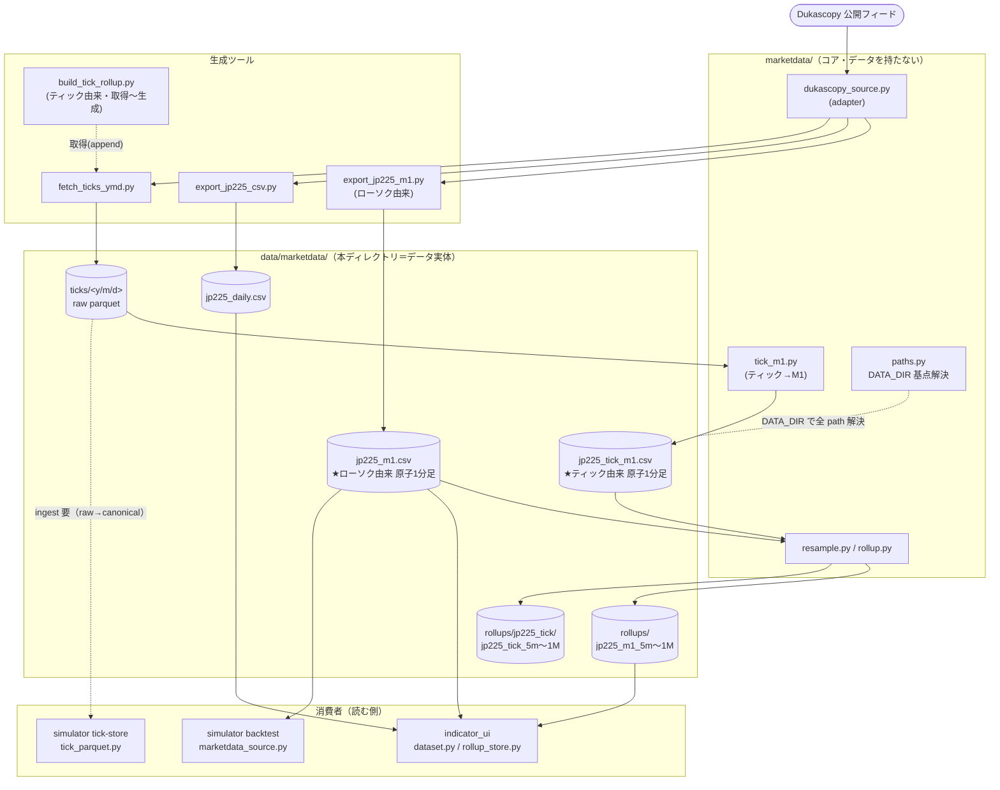

# data/ — 生成データ（時系列データの実体）

`marketdata/`（コード）が取得・変換・配置した**時系列データの実体**を置くディレクトリ。
コードとデータを分離する方針（設計 Sd）に基づき、データはすべてここに集約する。

- **コード**＝ `/workspaces/app/marketdata/`（Python パッケージ）
- **データ**＝ `/workspaces/app/data/marketdata/`（本ディレクトリ・DATA_DIR 単一基点）

## DATA_DIR（コードが読む基点）

`marketdata.paths.DATA_DIR` が本ディレクトリを指す（`marketdata/paths.py`）。

- 既定（環境変数なし）＝ `<repo>/data/marketdata`
- `MARKETDATA_DATA_DIR` を設定するとその path を採用（不在 path は fail-fast）

> **Git**: `data/` は **gitignore**（大容量・再生成可能なため非追跡）。バックアップ対象は別途運用。

## 2 つの OHLC 系統（ローソク由来 / ティック由来）

本ディレクトリには **2 系統**の OHLC データが**並存**する。源データ（生成元）が異なり、互いに上書きしない。

| 系統 | 源データ | 原子 1分足 | 上位足 | 価格/出来高 |
|---|---|---|---|---|
| **ローソク由来**（旧来） | Dukascopy ローソク取得 | `jp225_m1.csv` | `rollups/jp225_m1_<tf>.csv` | ベンダ OHLC / tick volume |
| **ティック由来**（新規） | 生ティック（mid・UTC） | `jp225_tick_m1.csv` | `rollups/jp225_tick/jp225_tick_<tf>.csv` | mid=(bid+ask)/2 / その分のティック数 |

- ティック由来は「チャートの足も足内更新も同一ティック由来へ統一」する系で、足と足内更新が同一ソース＝書き変わりなく整合する。
- 物理隔離：ティック由来のロールアップは **サブディレクトリ** `rollups/jp225_tick/` に置き、CSV だけでなく `rollup_state.json` も分離する（ローソク由来の共有 state を壊さない）。

## 依存関係（データフロー）

上流（Dukascopy）→ 生成ツール →**本ディレクトリ（データ）**→ 消費者、という一方向の流れ。
全 path は `marketdata.paths.DATA_DIR` を基点に解決される。



- **一方向依存**：消費者（indicator_ui / simulator）はデータを**読むだけ**。データはコード（生成ツール）経由でのみ更新する。
- **2 系統の原子起点**：ローソク由来は `jp225_m1.csv`、ティック由来は `jp225_tick_m1.csv` が源で、各 `rollups/…` はそこから導出。
- **ティックの結線**：`ticks/`（raw）は `tick_m1.py` 経由で `jp225_tick_m1.csv`→上位足へ結線済み（`build_tick_rollup.py` が合成）。一方 simulator の canonical tick-store は別段階で ingest が必要（破線）。tick-store 既定 root は旧 `marketdata/ticks`（要確認）。
- **チャートの取り込み先**：現在 indicator_ui のチャートが読むのは **ローソク由来 `jp225_m1` 系**（`rollups/jp225_m1_<tf>.csv`）。新規の `jp225_tick` 系（サブディレクトリ）は**生成のみ**で、チャートへの結線は別途。

## 構成

```
data/marketdata/
├── jp225_m1.csv               # ★ローソク由来 原子データ：JP225 1分足
├── jp225_m1.csv.bak           # 上記のバックアップ（増分取得前のスナップショット）
├── jp225_tick_m1.csv          # ★ティック由来 原子データ：mid・UTC の1分足（tick_m1.py 生成）
├── jp225_daily.csv            # JP225 日足（"jp225" ビュー用・m1とは別系統）
├── live_watch.log             # ライブ監視ランナーのログ
├── rollups/                   # 上位足（キャッシュ）
│   ├── jp225_m1_5m.csv        #   ローソク由来：5m / 15m / 30m / 1h / 4h / 1D / 1W / 1M（計8本）
│   ├── … （計8本）
│   ├── rollup_state.json      #   ローソク由来の増分更新カーソル（last_processed_ts）
│   └── jp225_tick/            #   ★ティック由来 上位足（物理隔離・state も独立）
│       ├── jp225_tick_5m.csv  #     5m / 15m / 30m / 1h / 4h / 1D / 1W / 1M（計8本）
│       ├── … （計8本）
│       └── rollup_state.json  #     ティック由来の増分更新カーソル
└── ticks/                     # 生ティック（日別・raw landing）
    ├── <YYYY>/<MM>/<DD>/JP225_ticks.parquet   # 1日1ファイル
    ├── <YYYY>/<MM>/<DD>/JP225_ticks.empty     # 取得0件（休場/未提供）マーカー
    └── fetch_ymd.log                          # 取得ランナーの進捗ログ
```

### jp225_m1.csv（ローソク由来 原子データ）
- 形式：`date,open,high,low,close,volume`（UTC・1分足）
- 範囲：2012-06-14 〜 最新（増分取得で延伸）／約 4.54M 行・約 298MB
- 位置づけ：ローソク由来系統の源。`rollups/jp225_m1_*` はここから導出する。

### jp225_tick_m1.csv（ティック由来 原子データ）
- 形式：`date,open,high,low,close,volume`（UTC・1分足・ローソク由来と同形式＝loader 互換）
- 値：price は **mid=(bid+ask)/2**、volume は **その1分のティック数**（出来高ではない）。
- 範囲：2012-06-14 〜 最新／約 274MB。
- 生成：`python -m marketdata.tools.tick_m1_cli`（集計規則は `marketdata/tick_m1.py`、`ticks/` の日別 parquet の所在は `marketdata/tick_tree.py` が解決）。`rollups/jp225_tick/*` はここから導出する。

### jp225_daily.csv
- 形式：`date,open,high,low,close`（日足）
- 用途：indicator_ui の "jp225"（日足ビュー）。`rollups/jp225_m1_1D.csv`（m1由来の日足）とは**別系統**。

### rollups/（上位足キャッシュ）
- `jp225_m1_<TF>.csv`：`jp225_m1.csv` をリサンプルした 5m〜1M の8本（ローソク由来）。
- `jp225_tick/jp225_tick_<TF>.csv`：`jp225_tick_m1.csv` をリサンプルした 5m〜1M の8本（ティック由来・サブディレクトリで隔離）。
- 各ディレクトリの `rollup_state.json`：増分更新の処理済み末尾時刻（系統ごとに独立）。

### ticks/（生ティック・year/month/day）
- 形式：parquet 列 `timestamp, bidPrice, askPrice, bidVolume, askVolume`（気配両建て）。
- 構成：`<年>/<月>/<日>/JP225_ticks.parquet`（1日1ファイル）。
- 範囲：2012-06-14 〜 最新／約 4,144 日・約 1.15億ティック・約 1.3GB。
- 段階：**raw landing**（取得生出力）。ティック由来 OHLC（`jp225_tick_m1.csv`）の源であり、simulator の canonical tick-store（hive）とは別段階で利用には ingest が必要。

## 生成・更新（コマンド）

| データ | 生成ツール | 更新（増分） |
|---|---|---|
| `jp225_m1.csv` ＋ `rollups/jp225_m1_*` | `indigators/indicator_ui/tools/export_jp225_m1.py` | `--start/--end` 省略で最終行→最新を追記（rollups も同時更新） |
| `jp225_daily.csv` | `indigators/indicator_ui/tools/export_jp225_csv.py` | 最新まで全件再生成（小容量） |
| `ticks/<y/m/d>/` | `simulator/tools/fetch_ticks_ymd.py` | `--start/--end` 指定・既取得日/空日はスキップ（resume） |
| `jp225_tick_m1.csv` ＋ `rollups/jp225_tick/*` | `tools/build_tick_rollup.py` | 既定で増分（M1 は最終日以降を追記・rollup は state 差分）。`--full` で全再構築 |

例（いずれも `PYTHONPATH=/workspaces/app` で実行）：

```bash
# ローソク由来：1分足＋ロールアップを最新へ増分更新
python3 indigators/indicator_ui/tools/export_jp225_m1.py

# ティックを期間指定で取得（y/m/d・resume 対応）
python3 simulator/tools/fetch_ticks_ymd.py --start 2025-01-01 --end 2026-06-26 \
    --root data/marketdata/ticks

# ティック由来：取得(append)→tick M1→上位足ロールアップ を一括（既定=増分）
python3 -m tools.build_tick_rollup

#   取得をスキップして生成のみ（既存ティックから再生成）
python3 -m tools.build_tick_rollup --skip acquire

#   全再構築（state を無視して最初から作り直す・派生CSVを手編集した場合の復旧）
python3 -m tools.build_tick_rollup --skip acquire --full
```

## 注意

- 本ディレクトリは**生成物**。削除しても上記ツールで再生成できる（ただしティック全期間は長時間）。
- データソースは Dukascopy 公開フィード（`marketdata/dukascopy_source.py`）。
- データの**直接編集は不可**（コード経由でのみ生成・更新する）。ロールアップ等の派生 CSV を手編集しても増分更新は state を信頼するため検出・修復しない（`--full` で全再構築する）。
