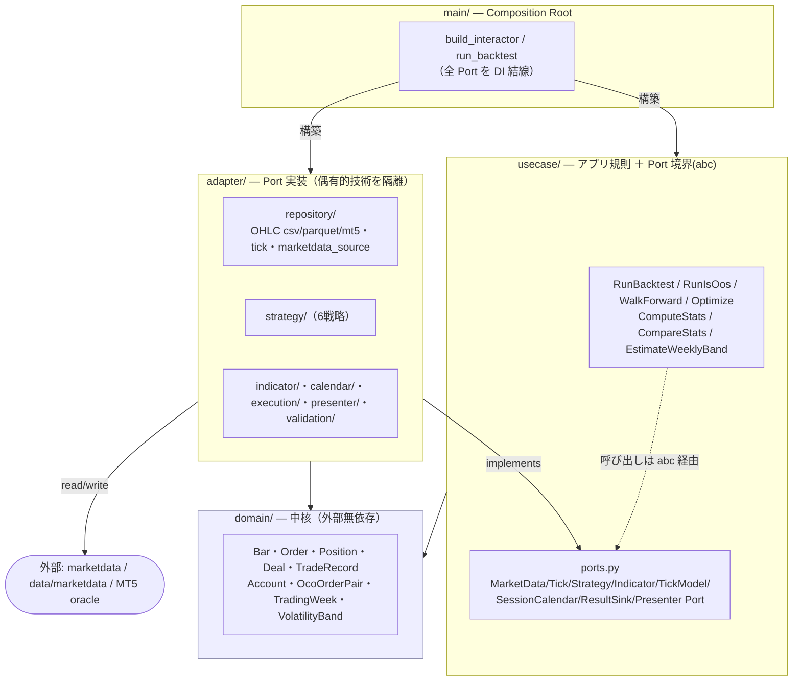

# simulator/ — MT5 忠実バックテストシミュレータ

JP225 の EA 戦略を**MT5 Strategy Tester と一致するよう再現**するバックテスト基盤。
クリーンアーキテクチャ（依存方向は内向き・DIP）で構成し、MT5 ReportTester の結果と
trade-by-trade で突合（reconciliation）できることを品質基準とする。

## レイヤー構成（依存方向）



**依存ルール**：`domain ← usecase ← adapter ← main`。内側（domain/usecase）は外側を知らない。
pandas / lightweight-charts / Dukascopy 等の技術は adapter に隔離し、usecase は abc（ports.py）にのみ依存する。

## ディレクトリ

| ディレクトリ | 役割 |
|---|---|
| `domain/` | 中核モデルと不変条件（Bar/Order/Position/Deal/TradeRecord/Account/OcoOrderPair/TradingWeek/VolatilityBand/exceptions）。外部依存なし。 |
| `usecase/` | アプリ規則＋Port 境界。`run_backtest`/`run_is_oos`/`walk_forward`/`optimize`/`compute_stats`/`compare_stats`/`estimate_weekly_band`/`run_weekly_segments`/`validate_strategy`＋`ports.py`。 |
| `adapter/` | Port 実装。`repository/`（OHLC・tick・`marketdata_source`＝marketdata 委譲）、`strategy/`（6戦略）、`indicator/`、`calendar/`（JP225 セッション）、`execution/`（tick_model）、`presenter/`（json/html/markdown/trade_markers）、`validation/`（SPA）、`controller.py`。 |
| `main/` | Composition Root。`build_interactor` / `run_backtest`（DI と CLI 分離）。 |
| `framework/` | `config_loader`（設定読込）。 |
| `tools/` | CLI/スクリプト群（下表）。 |
| `report_ui/` | **別アクター**＝バックテスト結果ビューア（独自の usecase/adapter/web）。詳細は `report_ui/` 配下を参照。 |
| `tests/` | `unit`/`integration`/`confirmation`（MT5 oracle 突合）/`fixtures`。計 約90 テスト。 |

## 戦略（adapter/strategy/）

| 戦略 | 概要 |
|---|---|
| `stop_entry_probe` | MA 非依存・現値上下へ逆指値両建て（StopEntryProbe_EA）。 |
| `ma_slope` / `ma_slope_pending` | MA 傾きベース（成行 / 指値・逆指値）。 |
| `weekly_vol_band` | 週次ボラティリティバンド戦略。 |
| `tc24051901` | TC 系戦略。 |
| `pro_fit_band` | ProFit バンド戦略。 |

## 主な CLI（tools/・`PYTHONPATH=/workspaces/app` で実行）

| ツール | 用途 |
|---|---|
| `python -m simulator.main …` | 単一バックテスト実行（Composition Root）。 |
| `run_is_oos_cli.py` | IS/OOS 分割実行。 |
| `walk_forward_cli.py` | ウォークフォワード検証。 |
| `optimize_cli.py` | パラメータ最適化。 |
| `run_weekly_vol_band_cli.py` | 週次ボラバンド戦略の実行。 |
| `fetch_ticks_dukascopy.py` / `fetch_ticks_ymd.py` | ティック取得（範囲指定 / y-m-d 構成）。 |
| `ingest_ticks.py` | raw ティック → canonical tick-store。 |
| `export_trade_markers.py` | チャート用トレードマーカー出力。 |

## データ依存

時系列データは `marketdata/`（コード）→ `data/marketdata/`（実体）に依存する（`data/README.md` 参照）。
- バー：S5 で `adapter/repository/marketdata_source.py` が `marketdata.CandleSource` へ委譲（`Candle → domain.Bar`）。
- ティック：`adapter/repository/tick_parquet.py`（ParquetTickRepository）が tick-store を読む。

## MT5 突合（品質基準）

`tests/confirmation/` に MT5 ReportTester の oracle（xlsx）を置き、シミュレータ出力が
trade-by-trade／統計で一致することを検証する。建値・閉鎖・stop-out・通貨丸め等の要因を
合わせ込むことで bit/value-exact な再現を担保する。

## テスト

```bash
PYTHONPATH=/workspaces/app python3 -m pytest simulator/tests -q     # unit/integration/confirmation
```
